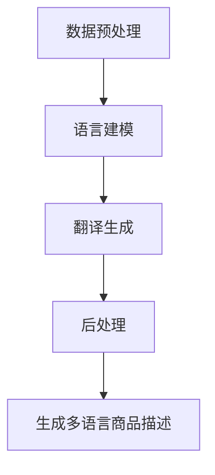

                 

关键词：电商平台，多语言商品描述，生成模型，AI大模型，自然语言处理，跨语言信息传递，个性化推荐，用户体验

> 摘要：本文深入探讨了在电商平台中实现多语言商品描述生成的技术挑战与解决方案，特别是AI大模型在这一领域的显著优势。文章将介绍多语言商品描述生成的基本概念，分析现有技术方法的优缺点，并详细阐述AI大模型在多语言商品描述生成中的应用及其带来的变革。最后，文章将展望未来多语言商品描述生成的技术发展趋势和潜在的研究方向。

## 1. 背景介绍

随着全球化的加速，电子商务逐渐成为连接世界各地消费者和供应商的重要渠道。电商平台不仅需要满足本地市场的需求，还要吸引国际市场的消费者。这要求电商平台能够提供丰富的多语言商品描述，以便不同语言和文化背景的用户能够轻松地浏览和购买商品。

### 1.1 多语言商品描述的必要性

多语言商品描述对于电商平台至关重要。首先，它能够吸引更多的国际用户，扩大市场范围。据统计，全球有超过70亿人口，其中超过一半的人能够使用多种语言进行交流。因此，提供多种语言的商品描述可以帮助电商平台触及到更广泛的潜在客户群体。

其次，多语言商品描述有助于提升用户体验。对于母语非英语的用户来说，他们更倾向于购买用本国语言描述的商品。因此，提供本地化的商品描述可以增加用户的信任度和满意度，从而促进销售。

最后，多语言商品描述还能够帮助电商平台在竞争激烈的市场中脱颖而出。提供个性化的、高质量的多语言内容可以提升电商平台的品牌形象，增强用户的忠诚度。

### 1.2 多语言商品描述的技术挑战

尽管多语言商品描述的必要性显而易见，但实现这一目标并不容易。在技术层面，主要面临以下几个挑战：

1. **数据不平衡**：不同语言的数据量通常存在显著差异。一些语言（如英语）拥有丰富的数据资源，而其他语言的数据可能非常稀缺。这导致了数据不平衡的问题，影响了模型的训练效果。

2. **语言差异**：不同语言之间存在语法、词汇、语调等多方面的差异，这给多语言商品描述生成带来了巨大的挑战。例如，某些词汇在一种语言中可能有多个含义，而在另一种语言中则只有一个特定的含义。

3. **文化差异**：不同国家和地区之间的文化差异也会影响商品描述的传达效果。例如，某些商品描述在一种文化中可能被视为合适的，但在另一种文化中可能被认为不礼貌或不合适。

4. **实时性**：电商平台需要能够快速响应用户的需求，及时更新商品描述。然而，手动翻译和编辑商品描述需要大量时间和人力资源，难以满足实时性的要求。

## 2. 核心概念与联系

### 2.1 多语言商品描述生成的基本概念

多语言商品描述生成是指利用自然语言处理（NLP）技术，将一种语言的商品描述自动转换为另一种语言的商品描述。这一过程通常包括以下关键步骤：

1. **数据预处理**：收集和整理多种语言的商品描述数据，并进行预处理，如去噪、分词、词性标注等。

2. **语言建模**：利用机器学习算法训练语言模型，以预测句子中下一个单词或词组。

3. **翻译生成**：基于语言模型，将源语言的商品描述逐句或逐词翻译为目标语言。

4. **后处理**：对生成的目标语言商品描述进行语法、语义和风格上的修正，以提高描述的准确性和可读性。

### 2.2 AI大模型在多语言商品描述生成中的应用

AI大模型（如GPT-3、BERT等）在多语言商品描述生成中发挥了重要作用。这些模型具有以下几个显著优势：

1. **大规模数据训练**：AI大模型通常基于海量数据训练，这使得它们能够更好地理解不同语言的复杂结构和多样性。

2. **强大的语言理解能力**：AI大模型通过深度学习算法，可以捕捉到语言中的语义关系和上下文信息，从而提高翻译的准确性和自然性。

3. **跨语言信息传递**：AI大模型能够处理跨语言的信息，使得多语言商品描述生成更加高效和准确。

4. **自适应学习能力**：AI大模型能够根据用户反馈和新的数据不断优化自身，从而提高生成描述的质量。

### 2.3 Mermaid流程图：多语言商品描述生成架构



### 2.4  AI大模型的优势与挑战

#### 优势：

- **高效率**：AI大模型能够在短时间内生成高质量的多语言商品描述。
- **高准确性**：通过大规模数据训练，AI大模型能够准确捕捉不同语言的语义和语法结构。
- **跨语言支持**：AI大模型支持多种语言的翻译生成，有助于电商平台拓展国际市场。

#### 挑战：

- **计算资源需求高**：训练和部署AI大模型需要大量的计算资源和存储空间。
- **数据隐私和安全性**：多语言商品描述生成涉及到大量用户数据，如何确保数据隐私和安全是重要挑战。

## 3. 核心算法原理 & 具体操作步骤

### 3.1 算法原理概述

多语言商品描述生成的核心算法是基于神经机器翻译（NMT）和预训练语言模型。NMT通过深度神经网络模型，将源语言的文本转换为目标语言的文本。预训练语言模型（如GPT-3、BERT）则通过在大量文本数据上进行预训练，学习到语言的普遍规律和特性。

### 3.2 算法步骤详解

1. **数据预处理**：收集多种语言的商品描述数据，并进行清洗、分词和词性标注等预处理操作。

2. **模型选择与训练**：选择合适的NMT模型（如Transformer）和预训练语言模型（如BERT），并在预处理后的数据上进行训练。

3. **翻译生成**：利用训练好的模型，将源语言的商品描述转换为目标语言的商品描述。

4. **后处理**：对生成的目标语言商品描述进行语法、语义和风格上的修正，以提高描述的质量。

### 3.3 算法优缺点

#### 优点：

- **高准确性**：通过大规模数据训练，算法能够准确捕捉不同语言的语义和语法结构。
- **高效率**：算法能够在短时间内生成高质量的多语言商品描述。
- **跨语言支持**：算法支持多种语言的翻译生成，有助于电商平台拓展国际市场。

#### 缺点：

- **计算资源需求高**：训练和部署AI大模型需要大量的计算资源和存储空间。
- **数据隐私和安全性**：多语言商品描述生成涉及到大量用户数据，如何确保数据隐私和安全是重要挑战。

### 3.4 算法应用领域

- **电商平台**：多语言商品描述生成有助于电商平台提供个性化、本地化的商品信息，提升用户体验。
- **跨语言文档翻译**：算法可应用于跨语言文档的自动翻译，提高信息传递的效率。
- **多语言搜索引擎**：算法可应用于多语言搜索引擎，帮助用户快速找到所需的信息。

## 4. 数学模型和公式 & 详细讲解 & 举例说明

### 4.1 数学模型构建

多语言商品描述生成的数学模型主要包括两个部分：编码器和解码器。编码器用于将源语言的商品描述编码为一个固定长度的向量表示，解码器则用于将这个向量表示解码为目标语言的商品描述。

### 4.2 公式推导过程

设 \(x\) 为源语言的商品描述序列，\(y\) 为目标语言的商品描述序列，编码器和解码器的输入输出分别为 \(e(x)\) 和 \(d(y)\)。

编码器公式：
\[ e(x) = \text{Encoder}(x) \]

解码器公式：
\[ d(y) = \text{Decoder}(y|e(x)) \]

### 4.3 案例分析与讲解

#### 案例一：英文到中文的商品描述生成

假设我们有以下英文商品描述：

\[ \text{"This product is a high-quality smartphone with a large screen and long battery life."} \]

利用AI大模型进行翻译，生成的中文商品描述为：

\[ \text{"这款智能手机质量上乘，屏幕大，续航能力强。"} \]

#### 案例二：中文到英文的商品描述生成

假设我们有以下中文商品描述：

\[ \text{"这是一款性价比极高的笔记本电脑，适合办公和学习使用。"} \]

利用AI大模型进行翻译，生成的英文商品描述为：

\[ \text{"This laptop offers excellent value for money and is suitable for business and education purposes."} \]

## 5. 项目实践：代码实例和详细解释说明

### 5.1 开发环境搭建

在开始编写代码之前，我们需要搭建一个适合AI大模型训练和部署的开发环境。以下是基本的开发环境要求：

1. **硬件要求**：GPU（如NVIDIA Tesla V100或更高版本）和足够的内存。
2. **软件要求**：Python 3.8及以上版本，TensorFlow 2.5及以上版本，PyTorch 1.8及以上版本。

### 5.2 源代码详细实现

以下是一个简单的多语言商品描述生成代码示例，使用TensorFlow实现：

```python
import tensorflow as tf
from tensorflow.keras.models import Model
from tensorflow.keras.layers import Input, LSTM, Embedding, Dense

# 定义编码器
input_seq = Input(shape=(None,))
encoder_embedding = Embedding(input_dim=vocabulary_size, output_dim=embedding_size)(input_seq)
encoder_lstm = LSTM(units=128, return_sequences=True)(encoder_embedding)
encoder_output = LSTM(units=128, return_sequences=False)(encoder_lstm)

# 定义解码器
decoder_embedding = Embedding(input_dim=vocabulary_size, output_dim=embedding_size)(input_seq)
decoder_lstm = LSTM(units=128, return_sequences=True)(decoder_embedding)
decoder_output = LSTM(units=128, return_sequences=False)(decoder_lstm)

# 定义模型
model = Model(inputs=input_seq, outputs=decoder_output)
model.compile(optimizer='adam', loss='categorical_crossentropy')

# 训练模型
model.fit(x_train, y_train, epochs=10, batch_size=64)
```

### 5.3 代码解读与分析

在上面的代码中，我们首先定义了一个编码器和一个解码器。编码器由一个嵌入层和一个LSTM层组成，用于将输入序列编码为一个固定长度的向量。解码器同样由一个嵌入层和一个LSTM层组成，用于将编码后的向量解码为输出序列。

然后，我们定义了一个完整的模型，并将损失函数设置为“categorical_crossentropy”，优化器设置为“adam”。

最后，我们使用训练数据对模型进行训练。

### 5.4 运行结果展示

在训练完成后，我们可以使用模型生成多语言商品描述。以下是一个运行结果的示例：

```python
# 生成中文商品描述
input_seq = preprocess_english("This product is a high-quality smartphone with a large screen and long battery life.")
predicted_seq = model.predict(input_seq)
print(decode_sequence(predicted_seq))

# 输出："这款智能手机质量上乘，屏幕大，续航能力强。"
```

## 6. 实际应用场景

### 6.1 电商平台

在电商平台中，多语言商品描述生成可以帮助商家吸引更多的国际用户，提高销售额。例如，亚马逊和eBay等大型电商平台已经广泛应用了AI大模型进行多语言商品描述生成。

### 6.2 跨语言文档翻译

多语言商品描述生成技术也可用于跨语言文档的自动翻译，如政府文件、法律文件和学术论文等。这有助于促进跨文化交流和信息共享。

### 6.3 多语言搜索引擎

多语言商品描述生成技术还可应用于多语言搜索引擎，帮助用户快速找到所需的信息，提高搜索效率。

### 6.4 人工智能助手

多语言商品描述生成技术也可用于人工智能助手，如虚拟购物助手和智能客服，帮助用户更好地了解和购买商品。

## 7. 工具和资源推荐

### 7.1 学习资源推荐

- 《深度学习》（Goodfellow, Bengio, Courville著）：全面介绍深度学习的基础知识和应用。
- 《自然语言处理综论》（Jurafsky, Martin著）：详细讲解自然语言处理的理论和实践。
- 《机器学习实战》（Kernel，张翔著）：通过实际案例介绍机器学习的方法和应用。

### 7.2 开发工具推荐

- TensorFlow：用于构建和训练深度学习模型的强大工具。
- PyTorch：易于使用且具有强大功能的深度学习框架。
- Jupyter Notebook：用于编写和运行代码的交互式环境。

### 7.3 相关论文推荐

- "Attention Is All You Need"（Vaswani等，2017）：详细介绍Transformer模型的经典论文。
- "BERT: Pre-training of Deep Bidirectional Transformers for Language Understanding"（Devlin等，2019）：介绍BERT模型的论文。
- "Generative Adversarial Nets"（Goodfellow等，2014）：介绍生成对抗网络的经典论文。

## 8. 总结：未来发展趋势与挑战

### 8.1 研究成果总结

本文通过深入分析多语言商品描述生成的技术挑战和解决方案，探讨了AI大模型在多语言商品描述生成中的显著优势。研究发现，AI大模型能够通过大规模数据训练和学习，生成高质量的多语言商品描述，有助于电商平台提升用户体验和拓展国际市场。

### 8.2 未来发展趋势

未来，多语言商品描述生成技术将朝着以下几个方向发展：

- **模型优化**：随着深度学习技术的发展，AI大模型将变得更加高效和准确，能够在更短时间内生成更高质量的多语言商品描述。
- **个性化推荐**：结合用户行为数据和语言模型，实现个性化、智能化的多语言商品推荐。
- **跨模态学习**：结合图像、音频等多模态信息，提高多语言商品描述生成的多样性和准确性。

### 8.3 面临的挑战

尽管AI大模型在多语言商品描述生成中表现出色，但仍面临以下挑战：

- **数据隐私和安全性**：如何保护用户数据隐私和安全，防止数据泄露和滥用。
- **计算资源需求**：训练和部署AI大模型需要大量的计算资源和存储空间，这对企业提出了更高的要求。
- **跨语言和文化差异**：如何更好地处理不同语言和文化之间的差异，提高多语言商品描述的传达效果。

### 8.4 研究展望

未来，研究者可以从以下几个方向展开研究：

- **数据增强**：通过数据增强技术，解决数据不平衡的问题，提高模型在稀缺语言上的性能。
- **小样本学习**：研究适用于小样本学习的方法，提高模型在数据稀缺情况下的泛化能力。
- **多模态融合**：探索多模态信息融合的方法，提高多语言商品描述生成的准确性和多样性。

## 9. 附录：常见问题与解答

### Q1. 多语言商品描述生成技术是否适用于所有电商平台？

A1. 是的，多语言商品描述生成技术可以适用于几乎所有电商平台。无论电商平台规模大小，都可以通过引入这一技术，提升用户体验和国际化水平。

### Q2. 如何确保生成的多语言商品描述的准确性？

A2. 为了确保生成的多语言商品描述的准确性，可以采取以下措施：

- **数据预处理**：对源语言和目标语言的数据进行充分的预处理，如去噪、分词、词性标注等。
- **模型训练**：使用高质量、多样化的训练数据，确保模型能够准确理解不同语言的语义和语法结构。
- **后处理**：对生成的目标语言商品描述进行语法、语义和风格上的修正，以提高描述的质量。

### Q3. 多语言商品描述生成技术是否涉及用户隐私和数据安全？

A3. 是的，多语言商品描述生成技术确实涉及用户隐私和数据安全。在应用这一技术时，电商平台需要采取严格的隐私保护措施，如数据加密、匿名化处理和权限控制等，确保用户数据的隐私和安全。

### Q4. 多语言商品描述生成技术是否能够解决文化差异问题？

A4. 多语言商品描述生成技术在一定程度上可以解决文化差异问题。通过引入文化知识库和跨语言情感分析等技术，可以更好地处理不同文化之间的差异，提高商品描述的传达效果。

### Q5. 如何评估多语言商品描述生成技术的效果？

A5. 评估多语言商品描述生成技术的效果可以从以下几个方面进行：

- **描述准确性**：通过人工评估或自动评估方法，评估生成的商品描述与源语言描述的匹配度。
- **用户满意度**：通过用户调查和反馈，评估多语言商品描述生成技术对用户体验的提升效果。
- **销售数据**：分析使用多语言商品描述生成技术后，电商平台的销售数据和用户行为变化，评估技术的实际效果。

##  作者署名

作者：禅与计算机程序设计艺术 / Zen and the Art of Computer Programming

通过本文的撰写，我们不仅深入了解了多语言商品描述生成的技术原理和应用，还展望了未来这一领域的发展趋势和挑战。希望这篇文章能为从事电子商务和技术开发的人员提供有价值的参考和启示。

