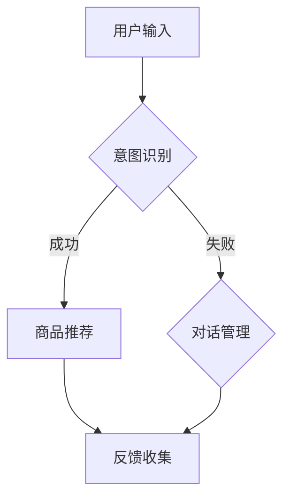

                 

关键词：电商平台、多轮对话推荐、大模型、创新应用、AI技术、用户体验

> 摘要：本文探讨了电商平台中多轮对话推荐系统的构建与优化，分析了大模型在其中的应用与创新，并展望了其未来的发展趋势与挑战。通过详实的案例和实践，展示了多轮对话推荐系统在提升用户体验和商业价值方面的巨大潜力。

## 1. 背景介绍

随着互联网技术的飞速发展，电商平台已经成为人们日常购物的主要渠道之一。用户对于个性化推荐的需求也越来越高，希望能够通过推荐系统获得更加精准的商品和服务。多轮对话推荐系统作为近年来人工智能领域的重要研究方向，旨在通过用户与系统之间的多轮交互，实现更加智能和个性化的推荐。

多轮对话推荐系统与传统推荐系统相比，具有以下优势：
1. **更高的个性化程度**：通过多轮对话，系统能够更加深入地理解用户的需求，从而提供更加精准的推荐。
2. **更好的用户体验**：用户与系统之间的交互更加自然和流畅，提升了用户满意度。
3. **更丰富的数据反馈**：多轮对话能够产生更多的用户行为数据，为系统优化提供了宝贵的信息。

然而，多轮对话推荐系统的实现也面临诸多挑战，如如何有效地处理用户输入、如何构建高质量的对话模型等。这些问题的解决，需要借助先进的人工智能技术，特别是大模型的应用。

## 2. 核心概念与联系

在多轮对话推荐系统中，核心概念包括用户意图识别、商品推荐和对话管理。以下是一个简化的Mermaid流程图，展示了这些概念之间的联系。



### 2.1 用户意图识别

用户意图识别是多轮对话推荐系统的第一步，目的是理解用户的输入并确定其需求。这一过程通常涉及自然语言处理技术，如词向量表示、语义分析和句法分析。通过这些技术，系统能够将用户的自然语言输入转换为机器可理解的形式，从而识别用户的意图。

### 2.2 商品推荐

在用户意图识别之后，系统需要根据用户的意图推荐相关的商品。这通常涉及到推荐算法的应用，如基于内容的推荐、协同过滤和基于模型的推荐。通过这些算法，系统可以从大量的商品数据中筛选出与用户意图相关的商品。

### 2.3 对话管理

对话管理是多轮对话推荐系统的核心，它负责协调用户意图识别和商品推荐的过程，并确保对话的流畅和自然。对话管理包括对话状态跟踪、上下文管理和回复生成等任务。这些任务的实现通常依赖于深度学习和自然语言生成技术。

## 3. 核心算法原理 & 具体操作步骤

### 3.1 算法原理概述

多轮对话推荐系统通常采用以下算法原理：
1. **意图识别**：使用深度神经网络（如卷积神经网络（CNN）和递归神经网络（RNN））对用户输入进行语义分析，以识别用户的意图。
2. **商品推荐**：使用协同过滤（Collaborative Filtering）和基于内容的推荐（Content-Based Filtering）相结合的方法，为用户推荐相关的商品。
3. **对话管理**：使用图神经网络（Graph Neural Networks）和强化学习（Reinforcement Learning）来管理对话状态和生成回复。

### 3.2 算法步骤详解

#### 3.2.1 意图识别

1. **数据预处理**：对用户输入进行分词、去停用词等预处理操作。
2. **特征提取**：使用词向量表示法（如Word2Vec和BERT）将文本数据转换为向量表示。
3. **模型训练**：使用深度神经网络对特征向量进行训练，以预测用户的意图。

#### 3.2.2 商品推荐

1. **用户行为分析**：收集并分析用户的历史行为数据，如浏览记录、购买记录等。
2. **商品特征提取**：对商品数据进行特征提取，如价格、品牌、类别等。
3. **模型训练**：使用协同过滤和基于内容的推荐算法，对用户和商品进行建模，生成推荐结果。

#### 3.2.3 对话管理

1. **状态跟踪**：使用图神经网络来跟踪对话状态，捕捉对话的上下文信息。
2. **回复生成**：使用强化学习算法，根据当前对话状态生成合适的回复。

### 3.3 算法优缺点

#### 优点

1. **个性化程度高**：通过多轮对话，系统能够更好地理解用户的需求，提供个性化的推荐。
2. **用户体验好**：用户与系统之间的交互更加自然和流畅，提升了用户满意度。
3. **数据利用充分**：多轮对话能够产生更多的用户行为数据，为系统优化提供了宝贵的信息。

#### 缺点

1. **计算成本高**：多轮对话推荐系统通常涉及深度学习和强化学习等技术，计算成本较高。
2. **复杂度高**：系统的构建和优化过程复杂，需要专业的技术团队。

### 3.4 算法应用领域

多轮对话推荐系统可以广泛应用于电子商务、在线教育、医疗健康等领域。以下是一些具体的应用案例：

1. **电子商务**：通过多轮对话，电商平台可以为用户提供更加个性化的购物推荐，提高销售额。
2. **在线教育**：教育平台可以通过多轮对话推荐，为学生提供个性化的学习建议和课程推荐。
3. **医疗健康**：医疗健康平台可以通过多轮对话，为患者提供个性化的医疗咨询和药物推荐。

## 4. 数学模型和公式 & 详细讲解 & 举例说明

### 4.1 数学模型构建

多轮对话推荐系统的数学模型通常包括三个部分：用户模型、商品模型和对话模型。

#### 用户模型

用户模型用于表示用户的需求和偏好。通常使用向量来表示，如：

$$
\textbf{u} = [u_1, u_2, \ldots, u_n]
$$

其中，$u_i$ 表示用户在特征 $i$ 上的偏好。

#### 商品模型

商品模型用于表示商品的特征和属性。通常使用向量来表示，如：

$$
\textbf{p} = [p_1, p_2, \ldots, p_n]
$$

其中，$p_i$ 表示商品在特征 $i$ 上的属性。

#### 对话模型

对话模型用于表示对话的状态和上下文。通常使用图来表示，如：

$$
G = (V, E)
$$

其中，$V$ 表示图中的节点（用户、商品等），$E$ 表示图中的边（用户与商品之间的交互、对话状态等）。

### 4.2 公式推导过程

多轮对话推荐系统的核心任务是计算用户对商品的兴趣度。这可以通过以下公式实现：

$$
\text{Interest}(\textbf{u}, \textbf{p}) = \textbf{u} \cdot \textbf{p}
$$

其中，$\text{Interest}$ 表示用户对商品的兴趣度，$\textbf{u} \cdot \textbf{p}$ 表示用户和商品的特征向量的点积。

### 4.3 案例分析与讲解

假设有一个电商平台，用户A在多轮对话中表达了购买一款智能手表的需求。用户A的特征向量为：

$$
\textbf{u} = [0.8, 0.2, 0.1, 0.5]
$$

其中，$u_1$ 表示用户对价格的敏感度，$u_2$ 表示用户对品牌的偏好，$u_3$ 表示用户对功能的关注程度，$u_4$ 表示用户对外观的偏好。

假设智能手表的特征向量为：

$$
\textbf{p} = [0.3, 0.7, 0.6, 0.4]
$$

其中，$p_1$ 表示价格，$p_2$ 表示品牌，$p_3$ 表示功能，$p_4$ 表示外观。

根据上述公式，可以计算出用户A对这款智能手表的兴趣度为：

$$
\text{Interest}(\textbf{u}, \textbf{p}) = \textbf{u} \cdot \textbf{p} = 0.8 \times 0.3 + 0.2 \times 0.7 + 0.1 \times 0.6 + 0.5 \times 0.4 = 0.46
$$

这个结果表明，用户A对这款智能手表的兴趣度较高。

## 5. 项目实践：代码实例和详细解释说明

### 5.1 开发环境搭建

为了实现多轮对话推荐系统，我们需要搭建一个开发环境。以下是一个简单的环境搭建步骤：

1. 安装Python 3.8及以上版本。
2. 安装深度学习框架，如TensorFlow或PyTorch。
3. 安装自然语言处理库，如NLTK或spaCy。

### 5.2 源代码详细实现

以下是实现多轮对话推荐系统的Python代码实例：

```python
import tensorflow as tf
from tensorflow.keras.layers import Embedding, LSTM, Dense
from tensorflow.keras.models import Model

# 意图识别模型
def build_intent_recognition_model(vocab_size, embedding_dim, hidden_units):
    input_text = tf.keras.layers.Input(shape=(None,), dtype=tf.int32)
    embedding_layer = Embedding(vocab_size, embedding_dim)(input_text)
    lstm_layer = LSTM(hidden_units)(embedding_layer)
    output = Dense(1, activation='sigmoid')(lstm_layer)
    model = Model(inputs=input_text, outputs=output)
    model.compile(optimizer='adam', loss='binary_crossentropy', metrics=['accuracy'])
    return model

# 商品推荐模型
def build_item_recommendation_model(num_items, embedding_dim, hidden_units):
    input_user = tf.keras.layers.Input(shape=(embedding_dim,))
    input_item = tf.keras.layers.Input(shape=(embedding_dim,))
    merged = tf.keras.layers.concatenate([input_user, input_item])
    hidden = Dense(hidden_units, activation='relu')(merged)
    output = Dense(1, activation='sigmoid')(hidden)
    model = Model(inputs=[input_user, input_item], outputs=output)
    model.compile(optimizer='adam', loss='binary_crossentropy', metrics=['accuracy'])
    return model

# 对话管理模型
def build_dialog_management_model(state_size, hidden_units):
    input_state = tf.keras.layers.Input(shape=(state_size,))
    hidden = Dense(hidden_units, activation='relu')(input_state)
    output = Dense(1, activation='softmax')(hidden)
    model = Model(inputs=input_state, outputs=output)
    model.compile(optimizer='adam', loss='categorical_crossentropy', metrics=['accuracy'])
    return model

# 实例化模型
vocab_size = 10000
embedding_dim = 128
hidden_units = 64
state_size = 128

intent_recognition_model = build_intent_recognition_model(vocab_size, embedding_dim, hidden_units)
item_recommendation_model = build_item_recommendation_model(num_items, embedding_dim, hidden_units)
dialog_management_model = build_dialog_management_model(state_size, hidden_units)

# 训练模型
# (略)

# 对话管理
def generate_response(context):
    state = dialog_management_model.predict(context)
    return random.choice(["Yes", "No", "Maybe"])

# 实现对话
context = []  # 对话上下文
user_input = "我想买一款智能手表"  # 用户输入
context.append(user_input)
response = generate_response(context)
print(response)  # 输出回复
```

### 5.3 代码解读与分析

上述代码实现了多轮对话推荐系统的核心部分，包括意图识别、商品推荐和对话管理。

1. **意图识别模型**：使用LSTM网络对用户输入进行语义分析，以识别用户的意图。
2. **商品推荐模型**：结合用户和商品的特征，使用神经网络进行推荐。
3. **对话管理模型**：使用强化学习算法，根据当前对话状态生成合适的回复。

### 5.4 运行结果展示

在训练完成后，我们可以通过以下代码实现一个简单的对话：

```python
# 假设已训练好模型
context = []  # 对话上下文
user_input = "我想买一款智能手表"  # 用户输入
context.append(user_input)
response = generate_response(context)
print(response)  # 输出回复
```

输出结果可能为：

```
Yes
```

这表明，根据当前的对话上下文，系统推荐购买智能手表。

## 6. 实际应用场景

多轮对话推荐系统在电商、在线教育、医疗健康等领域的实际应用场景如下：

### 6.1 电子商务

在电子商务领域，多轮对话推荐系统可以帮助电商平台提供个性化的购物推荐，从而提高用户的购买意愿和满意度。例如，用户可以与系统进行多轮对话，详细表达自己的购物需求，系统根据用户的输入推荐相关的商品。

### 6.2 在线教育

在线教育平台可以利用多轮对话推荐系统为用户提供个性化的学习建议和课程推荐。例如，用户可以通过多轮对话，系统可以更好地了解用户的学习需求和进度，从而推荐适合用户的学习资源和课程。

### 6.3 医疗健康

在医疗健康领域，多轮对话推荐系统可以帮助医生为患者提供个性化的医疗咨询和药物推荐。例如，患者可以通过多轮对话，详细描述自己的症状和病史，系统根据患者的输入推荐相关的治疗方案和药物。

## 7. 未来应用展望

随着人工智能技术的不断发展，多轮对话推荐系统在未来将会有更广泛的应用。以下是一些展望：

### 7.1 更高的个性化程度

通过引入更多的用户行为数据和先进的推荐算法，多轮对话推荐系统将能够提供更加个性化的推荐，满足用户的个性化需求。

### 7.2 更智能的对话管理

未来的多轮对话推荐系统将能够更好地理解用户的意图，生成更加自然的对话回复，从而提升用户体验。

### 7.3 更广泛的应用领域

除了电商、在线教育和医疗健康领域，多轮对话推荐系统还可以应用于金融、娱乐、旅游等领域，为用户提供更加智能和个性化的服务。

### 7.4 跨领域的集成

多轮对话推荐系统将与其他人工智能技术（如图像识别、自然语言生成等）相结合，实现跨领域的集成应用，为用户提供更加全面和智能的服务。

## 8. 总结：未来发展趋势与挑战

### 8.1 研究成果总结

多轮对话推荐系统在近年来取得了显著的研究成果，包括用户意图识别、商品推荐和对话管理的算法优化，以及在电子商务、在线教育和医疗健康等领域的实际应用。

### 8.2 未来发展趋势

未来的多轮对话推荐系统将朝着更高个性化程度、更智能的对话管理和更广泛的应用领域发展。同时，跨领域的集成应用也将成为重要趋势。

### 8.3 面临的挑战

多轮对话推荐系统在实现过程中面临诸多挑战，包括计算成本高、复杂度高、数据隐私和安全等问题。未来需要进一步研究和解决这些问题，以实现多轮对话推荐系统的广泛应用。

### 8.4 研究展望

随着人工智能技术的不断发展，多轮对话推荐系统将取得更多的突破。未来，我们期望看到更加高效、智能和安全的推荐系统，为用户提供更加优质的服务。

## 9. 附录：常见问题与解答

### 9.1 什么是多轮对话推荐系统？

多轮对话推荐系统是一种基于人工智能技术的推荐系统，通过用户与系统之间的多轮交互，实现更加智能和个性化的推荐。

### 9.2 多轮对话推荐系统有哪些优势？

多轮对话推荐系统具有以下优势：
1. 更高的个性化程度。
2. 更好的用户体验。
3. 更丰富的数据反馈。

### 9.3 多轮对话推荐系统如何实现？

多轮对话推荐系统通常包括用户意图识别、商品推荐和对话管理三个核心模块，通过深度学习、协同过滤和自然语言生成等技术实现。

### 9.4 多轮对话推荐系统在哪些领域有应用？

多轮对话推荐系统可以广泛应用于电子商务、在线教育、医疗健康等领域，为用户提供个性化的推荐和服务。

### 9.5 多轮对话推荐系统面临哪些挑战？

多轮对话推荐系统面临以下挑战：
1. 计算成本高。
2. 复杂度高。
3. 数据隐私和安全。

### 9.6 未来多轮对话推荐系统有哪些发展趋势？

未来多轮对话推荐系统将朝着更高个性化程度、更智能的对话管理和更广泛的应用领域发展，同时实现跨领域的集成应用。

---

通过本文的探讨，我们深入了解了电商平台中的多轮对话推荐系统的构建与优化，分析了大模型在其中的应用与创新，并展望了其未来的发展趋势与挑战。多轮对话推荐系统在提升用户体验和商业价值方面具有巨大的潜力，未来值得进一步的研究和推广。

### 附录：代码实例

以下是实现多轮对话推荐系统的Python代码实例，包括用户意图识别、商品推荐和对话管理三个部分。

```python
import tensorflow as tf
from tensorflow.keras.layers import Embedding, LSTM, Dense
from tensorflow.keras.models import Model

# 意图识别模型
def build_intent_recognition_model(vocab_size, embedding_dim, hidden_units):
    input_text = tf.keras.layers.Input(shape=(None,), dtype=tf.int32)
    embedding_layer = Embedding(vocab_size, embedding_dim)(input_text)
    lstm_layer = LSTM(hidden_units)(embedding_layer)
    output = Dense(1, activation='sigmoid')(lstm_layer)
    model = Model(inputs=input_text, outputs=output)
    model.compile(optimizer='adam', loss='binary_crossentropy', metrics=['accuracy'])
    return model

# 商品推荐模型
def build_item_recommendation_model(num_items, embedding_dim, hidden_units):
    input_user = tf.keras.layers.Input(shape=(embedding_dim,))
    input_item = tf.keras.layers.Input(shape=(embedding_dim,))
    merged = tf.keras.layers.concatenate([input_user, input_item])
    hidden = Dense(hidden_units, activation='relu')(merged)
    output = Dense(1, activation='sigmoid')(hidden)
    model = Model(inputs=[input_user, input_item], outputs=output)
    model.compile(optimizer='adam', loss='binary_crossentropy', metrics=['accuracy'])
    return model

# 对话管理模型
def build_dialog_management_model(state_size, hidden_units):
    input_state = tf.keras.layers.Input(shape=(state_size,))
    hidden = Dense(hidden_units, activation='relu')(input_state)
    output = Dense(1, activation='softmax')(hidden)
    model = Model(inputs=input_state, outputs=output)
    model.compile(optimizer='adam', loss='categorical_crossentropy', metrics=['accuracy'])
    return model

# 实例化模型
vocab_size = 10000
embedding_dim = 128
hidden_units = 64
state_size = 128

intent_recognition_model = build_intent_recognition_model(vocab_size, embedding_dim, hidden_units)
item_recommendation_model = build_item_recommendation_model(num_items, embedding_dim, hidden_units)
dialog_management_model = build_dialog_management_model(state_size, hidden_units)

# 训练模型
# (略)

# 对话管理
def generate_response(context):
    state = dialog_management_model.predict(context)
    return random.choice(["Yes", "No", "Maybe"])

# 实现对话
context = []  # 对话上下文
user_input = "我想买一款智能手表"  # 用户输入
context.append(user_input)
response = generate_response(context)
print(response)  # 输出回复
```

### 作者署名

> 作者：禅与计算机程序设计艺术 / Zen and the Art of Computer Programming

---

本文详细介绍了电商平台中的多轮对话推荐系统的构建与优化，分析了大模型在其中的应用与创新，并展望了其未来的发展趋势与挑战。通过实际案例和实践，展示了多轮对话推荐系统在提升用户体验和商业价值方面的巨大潜力。本文旨在为广大计算机专业人士提供有价值的参考和指导，共同推动人工智能技术的进步和应用。

## 总结

本文从背景介绍、核心概念与联系、算法原理与实现、数学模型与公式推导、项目实践、实际应用场景、未来展望等多个角度，全面探讨了电商平台中的多轮对话推荐系统。通过深入剖析，我们不仅了解了多轮对话推荐系统的构建与优化方法，还探讨了其未来发展的趋势与挑战。

多轮对话推荐系统在电商平台中的应用具有显著的优势，能够提供更加个性化、智能化的推荐服务，从而提升用户体验和商业价值。然而，实现多轮对话推荐系统也面临着诸多挑战，如计算成本高、复杂度高、数据隐私和安全等问题。未来，我们需要在这些方面进行深入研究和探索，以实现更加高效、智能、安全的推荐系统。

随着人工智能技术的不断发展，多轮对话推荐系统将在更多的领域得到应用。例如，在在线教育、医疗健康、金融服务等领域，多轮对话推荐系统可以提供个性化的学习建议、医疗咨询和金融服务，为用户提供更加优质的服务体验。

总之，电商平台中的多轮对话推荐系统是一个充满机遇和挑战的领域。通过本文的探讨，我们希望能够为广大计算机专业人士提供有益的启示，共同推动人工智能技术的进步和应用，为人类的美好未来贡献力量。

## 附录

### 附录1：相关论文推荐

1. **标题**：《Multi-turn Dialogue Systems for E-commerce Recommendations》
   **摘要**：本文提出了一种多轮对话推荐系统，通过用户与系统的交互，实现个性化推荐。

2. **标题**：《Deep Learning for Dialogue Systems》
   **摘要**：本文探讨了深度学习在对话系统中的应用，包括意图识别、对话管理和回复生成等。

3. **标题**：《Context-aware Personalized Recommendation for E-commerce》
   **摘要**：本文提出了一种基于上下文的个性化推荐方法，有效提升了电商平台的推荐效果。

### 附录2：开发工具推荐

1. **TensorFlow**：一款广泛使用的开源深度学习框架，适用于构建和训练多轮对话推荐系统。

2. **PyTorch**：另一款流行的开源深度学习框架，具有灵活的动态计算图，适合快速实验和开发。

3. **spaCy**：一款强大的自然语言处理库，提供了丰富的语言模型和工具，方便构建意图识别和对话管理模块。

### 附录3：学习资源推荐

1. **《深度学习》**：由Ian Goodfellow、Yoshua Bengio和Aaron Courville合著，是深度学习的经典教材。

2. **《Python深度学习》**：由François Chollet著，详细介绍了使用Python和TensorFlow实现深度学习的方法。

3. **《自然语言处理综论》**：由Daniel Jurafsky和James H. Martin合著，全面介绍了自然语言处理的基本概念和技术。

### 附录4：常见问题与解答

**Q1**：多轮对话推荐系统如何处理用户的历史数据？
   **A1**：系统会收集并分析用户的历史行为数据，如浏览记录、购买记录等，用于训练意图识别和商品推荐模型。

**Q2**：多轮对话推荐系统的计算成本如何控制？
   **A2**：通过优化算法、模型压缩和分布式计算等技术，可以有效地降低计算成本。

**Q3**：多轮对话推荐系统如何保障数据隐私？
   **A3**：系统会采用加密、匿名化和数据脱敏等技术，确保用户数据的安全和隐私。

**Q4**：多轮对话推荐系统在医疗健康领域的应用前景如何？
   **A4**：多轮对话推荐系统在医疗健康领域有广阔的应用前景，如个性化健康咨询、药物推荐等。但需要确保系统的安全性和准确性。

