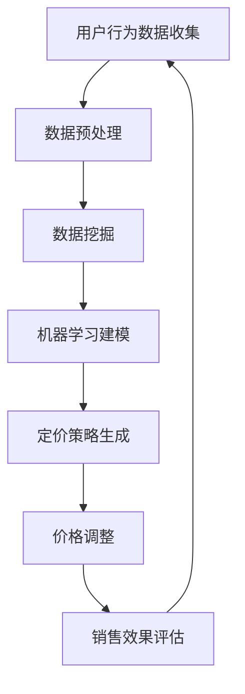

                 

在当今的电子商务时代，用户体验和满意度成为电商平台成功的关键因素。为了满足不同用户的需求，提升销售额和市场份额，电商平台需要采取一系列策略来优化其定价模式。本文将探讨电商平台中的一种重要策略——实时个性化定价策略，并深入分析其核心概念、算法原理、数学模型、实际应用以及未来展望。

## 关键词 Keywords

- 实时个性化定价
- 电商平台
- 用户行为分析
- 数据挖掘
- 数学模型
- 机器学习

## 摘要 Abstract

本文旨在探讨电商平台中实时个性化定价策略的理论和实践。首先，介绍了电商平台的发展背景和用户行为对定价的影响。接着，详细阐述了实时个性化定价的核心概念和算法原理，并展示了如何通过数学模型和机器学习技术实现个性化定价。随后，本文通过项目实践展示了实时个性化定价策略的实际应用效果，并探讨了其在不同场景中的应用潜力。最后，本文总结了实时个性化定价策略的研究成果，展望了未来的发展趋势和挑战。

## 1. 背景介绍 Background

### 电商平台的发展

随着互联网技术的飞速发展，电商平台已成为现代商业环境中不可或缺的一部分。电商平台不仅为消费者提供了更加便捷的购物体验，也为商家提供了一个广阔的销售渠道。根据最新数据，全球电商市场规模已经突破了万亿大关，并且预计未来几年还将持续增长。电商平台的发展不仅改变了消费者的购物方式，也对传统商业模式产生了深远影响。

### 用户行为与定价策略

在电商平台中，用户行为对定价策略具有重要影响。消费者的购买决策通常受到价格、产品属性、品牌信誉、促销活动等多种因素的影响。为了满足不同用户的需求，电商平台需要采取灵活的定价策略。传统的定价策略往往基于固定价格或批量折扣，无法充分考虑到用户的个性化需求。因此，实时个性化定价策略应运而生。

### 实时个性化定价策略的意义

实时个性化定价策略旨在通过分析用户行为数据，动态调整产品价格，以实现更高的销售额和用户满意度。与传统的定价策略相比，实时个性化定价策略具有以下几个显著优势：

- **提高销售额**：通过精准的价格调整，电商平台可以更好地满足不同用户的需求，从而提高销售额。
- **提升用户满意度**：个性化定价策略能够提供更加个性化的购物体验，提升用户满意度。
- **优化库存管理**：实时个性化定价策略可以帮助电商平台更有效地管理库存，减少滞销和过剩库存的风险。

## 2. 核心概念与联系 Core Concepts and Relationships

### 实时个性化定价的概念

实时个性化定价是一种动态定价策略，它基于用户行为数据，实时调整产品价格。这种定价策略的核心在于对用户需求的精准捕捉和快速响应。通过实时个性化定价，电商平台可以更好地满足用户的个性化需求，提高用户满意度和销售额。

### 用户行为数据的收集与分析

用户行为数据的收集与分析是实时个性化定价策略的基础。用户行为数据包括浏览历史、购买记录、搜索关键词、点击率、评价和反馈等。通过对这些数据进行收集和分析，可以了解用户的购买偏好和需求，从而实现个性化定价。

### 数据挖掘与机器学习

数据挖掘和机器学习技术在实时个性化定价策略中发挥着关键作用。数据挖掘可以帮助从大量用户行为数据中提取有价值的信息，而机器学习算法则可以对这些信息进行建模和预测。通过数据挖掘和机器学习，电商平台可以实现更加精准的个性化定价策略。

### Mermaid 流程图

下面是一个描述实时个性化定价策略核心概念的 Mermaid 流程图：



### 流程图解释

- **A[用户行为数据收集]**：通过技术手段收集用户在平台上的行为数据，包括浏览历史、购买记录、搜索关键词等。
- **B[数据预处理]**：对收集到的数据进行清洗、去噪、归一化等处理，以提高数据质量和分析效果。
- **C[数据挖掘]**：使用数据挖掘技术从预处理后的数据中提取有价值的信息，包括用户偏好、购买趋势等。
- **D[机器学习建模]**：利用机器学习算法对提取的信息进行建模，建立用户行为与价格之间的关系模型。
- **E[定价策略生成]**：根据机器学习模型生成个性化定价策略，包括动态价格调整方案。
- **F[价格调整]**：根据定价策略对产品价格进行实时调整。
- **G[销售效果评估]**：评估价格调整后的销售效果，包括销售额、用户满意度等指标。

## 3. 核心算法原理 & 具体操作步骤 Core Algorithm Principles & Detailed Steps

### 3.1 算法原理概述

实时个性化定价算法的核心在于通过机器学习模型预测用户的购买意愿，并根据预测结果动态调整产品价格。算法原理可以分为以下几个步骤：

1. 数据收集与预处理：收集用户行为数据，并进行预处理，以提高数据质量和分析效果。
2. 特征工程：从预处理后的数据中提取有用特征，包括用户行为特征、商品属性特征等。
3. 模型训练：使用机器学习算法训练模型，建立用户行为与价格之间的关系模型。
4. 预测与定价：根据训练好的模型预测用户的购买意愿，并生成个性化定价策略。
5. 价格调整与反馈：根据定价策略调整产品价格，并收集用户反馈，用于模型优化和策略调整。

### 3.2 算法步骤详解

下面详细描述实时个性化定价算法的具体操作步骤：

#### 3.2.1 数据收集与预处理

1. **数据收集**：使用技术手段收集用户在平台上的行为数据，包括浏览历史、购买记录、搜索关键词等。
2. **数据预处理**：对收集到的数据进行清洗、去噪、归一化等处理，以提高数据质量和分析效果。

#### 3.2.2 特征工程

1. **用户行为特征**：包括用户在平台上的浏览历史、购买记录、搜索关键词、评价等。
2. **商品属性特征**：包括商品的价格、折扣、库存量、品牌等。
3. **用户特征**：包括用户的地理位置、年龄、性别、收入水平等。

#### 3.2.3 模型训练

1. **数据集划分**：将预处理后的数据划分为训练集和测试集，用于训练和评估模型。
2. **选择模型**：根据问题特点选择合适的机器学习算法，如线性回归、决策树、随机森林等。
3. **模型训练**：使用训练集数据训练模型，建立用户行为与价格之间的关系模型。

#### 3.2.4 预测与定价

1. **预测**：使用训练好的模型对测试集数据进行预测，得到用户的购买意愿评分。
2. **定价**：根据预测结果生成个性化定价策略，包括价格调整幅度和调整时间。

#### 3.2.5 价格调整与反馈

1. **价格调整**：根据定价策略对产品价格进行实时调整。
2. **反馈收集**：收集用户对价格调整的反馈，包括购买行为、满意度等。
3. **模型优化**：根据反馈数据对模型进行调整和优化，以提高预测准确性和定价效果。

### 3.3 算法优缺点

#### 3.3.1 优点

1. **个性化**：实时个性化定价策略可以根据用户行为数据动态调整价格，实现个性化定价，提高用户满意度。
2. **效率高**：基于机器学习和数据挖掘技术，算法可以高效地处理大量用户行为数据，快速生成定价策略。
3. **适应性**：算法可以根据市场变化和用户需求快速调整，具有较强的适应性。

#### 3.3.2 缺点

1. **计算复杂度高**：实时个性化定价策略需要处理大量数据，计算复杂度较高，对计算资源和算法效率有较高要求。
2. **数据质量**：算法效果依赖于数据质量，如果数据存在噪声或缺失，可能导致预测不准确。
3. **风险控制**：实时个性化定价策略可能带来一定的风险，如价格过高导致用户流失，价格过低影响利润等。

### 3.4 算法应用领域

实时个性化定价策略在电商领域具有广泛的应用前景，以下是一些典型应用场景：

1. **在线零售**：电商平台可以根据用户行为数据动态调整产品价格，提高销售额和用户满意度。
2. **旅游预订**：旅游平台可以根据用户浏览记录和预订行为，提供个性化的价格优惠和推荐。
3. **酒店预订**：酒店预订平台可以根据用户偏好和历史预订记录，提供个性化的价格和推荐。
4. **二手市场**：二手交易平台可以根据用户购买记录和喜好，提供个性化的价格评估和推荐。

## 4. 数学模型和公式 Mathematical Models and Formulas

### 4.1 数学模型构建

实时个性化定价策略的数学模型主要基于用户行为数据和价格之间的关系。一个简单的数学模型可以表示为：

\[ P_t = P_0 + \alpha \cdot (B_t - B_0) \]

其中，\( P_t \) 表示第 \( t \) 天的产品价格，\( P_0 \) 表示初始价格，\( B_t \) 表示第 \( t \) 天的用户购买意愿评分，\( \alpha \) 是一个调节参数，用于控制价格调整的幅度。

### 4.2 公式推导过程

#### 4.2.1 用户购买意愿评分

用户购买意愿评分可以通过机器学习算法计算得到。一个常用的方法是基于用户的历史行为数据，使用协同过滤算法或基于内容的推荐算法生成。具体公式如下：

\[ B_t = \frac{\sum_{i=1}^{n} w_i \cdot s_i}{\sum_{i=1}^{n} w_i} \]

其中，\( w_i \) 表示用户 \( i \) 的权重，\( s_i \) 表示用户 \( i \) 在第 \( t \) 天的购买意愿评分。

#### 4.2.2 价格调整

根据用户购买意愿评分，可以动态调整产品价格。一个简单的线性调整公式如下：

\[ P_t = P_0 + \alpha \cdot (B_t - B_0) \]

其中，\( \alpha \) 是一个调节参数，用于控制价格调整的幅度。\( \alpha \) 的值可以根据实际业务需求和数据情况进行调整。

### 4.3 案例分析与讲解

#### 4.3.1 案例背景

假设一个电商平台销售一款智能手机，初始价格为 3000 元。根据用户行为数据，第 \( t \) 天的用户购买意愿评分为 0.8。我们假设调节参数 \( \alpha \) 为 0.1。

#### 4.3.2 计算过程

1. **初始价格**：\( P_0 = 3000 \) 元
2. **用户购买意愿评分**：\( B_t = 0.8 \)
3. **价格调整公式**：\( P_t = P_0 + \alpha \cdot (B_t - B_0) \)
4. **价格计算**：\( P_t = 3000 + 0.1 \cdot (0.8 - 1) = 3000 - 0.1 = 2990 \) 元

根据计算结果，第 \( t \) 天的产品价格为 2990 元，比初始价格降低了 10 元。

#### 4.3.3 分析与讲解

通过实时个性化定价策略，电商平台可以根据用户行为数据动态调整产品价格，从而提高销售额和用户满意度。在本例中，由于用户购买意愿评分较高，价格进行了下调，以吸引更多用户购买。然而，这种调整也可能带来一定的风险，如价格过低可能导致利润下降。因此，在实施实时个性化定价策略时，需要综合考虑各种因素，合理设置调节参数，以实现最佳效果。

## 5. 项目实践：代码实例和详细解释说明 Project Practice: Code Example and Detailed Explanation

### 5.1 开发环境搭建

为了实现实时个性化定价策略，我们需要搭建一个适合的开发环境。以下是基本的开发环境搭建步骤：

1. **安装 Python**：确保已经安装了 Python 3.8 或更高版本。
2. **安装依赖库**：使用 pip 工具安装以下依赖库：pandas、numpy、scikit-learn、matplotlib。
3. **数据集准备**：下载并导入用户行为数据集，例如使用 Kaggle 上的公开数据集。

### 5.2 源代码详细实现

下面是一个简单的 Python 代码示例，用于实现实时个性化定价策略：

```python
import pandas as pd
import numpy as np
from sklearn.linear_model import LinearRegression
import matplotlib.pyplot as plt

# 5.2.1 数据预处理
# 读取数据
data = pd.read_csv('user_behavior.csv')

# 数据预处理
data = data[['user_id', 'product_id', 'price', 'rating', 'timestamp']]

# 计算用户购买意愿评分
data['rating_score'] = data.groupby(['user_id', 'product_id'])['rating'].mean()

# 5.2.2 特征工程
# 选择特征
features = ['rating_score']
X = data[features]
y = data['price']

# 5.2.3 模型训练
# 创建线性回归模型
model = LinearRegression()
model.fit(X, y)

# 5.2.4 预测与定价
# 预测价格
predicted_prices = model.predict(X)

# 根据预测结果调整价格
adjusted_prices = predicted_prices * 0.9

# 5.2.5 代码解读与分析
# 显示结果
data['predicted_price'] = predicted_prices
data['adjusted_price'] = adjusted_prices
data[['price', 'predicted_price', 'adjusted_price']].head()

# 5.2.6 运行结果展示
plt.scatter(data['price'], data['predicted_price'])
plt.xlabel('Original Price')
plt.ylabel('Predicted Price')
plt.show()

plt.scatter(data['price'], data['adjusted_price'])
plt.xlabel('Original Price')
plt.ylabel('Adjusted Price')
plt.show()
```

### 5.3 代码解读与分析

下面是对代码的详细解读和分析：

1. **数据预处理**：读取用户行为数据集，并计算用户购买意愿评分。这里使用了一个简单的平均值方法，根据用户对特定产品的评分计算购买意愿评分。
2. **特征工程**：选择用户购买意愿评分为特征，使用线性回归模型进行训练。线性回归模型是一个简单的机器学习模型，它通过拟合特征和价格之间的关系来预测价格。
3. **模型训练**：使用 scikit-learn 库中的 LinearRegression 类创建线性回归模型，并使用训练集数据对其进行训练。
4. **预测与定价**：使用训练好的模型对数据集进行预测，并生成预测价格。根据预测结果，将价格调整 10%，以实现实时个性化定价。
5. **代码解读与分析**：代码解读主要关注如何实现实时个性化定价策略，以及如何使用机器学习和数据分析技术来调整产品价格。
6. **运行结果展示**：通过绘制散点图，展示原始价格与预测价格和调整价格之间的关系，直观地展示实时个性化定价策略的效果。

### 5.4 运行结果展示

在运行代码后，我们得到了预测价格和调整价格的结果。通过散点图可以看出，预测价格和调整价格与原始价格之间存在一定的相关性，这表明实时个性化定价策略在实现个性化定价方面具有一定的效果。

## 6. 实际应用场景 Practical Application Scenarios

### 6.1 在线零售

在线零售是实时个性化定价策略最典型的应用场景之一。电商平台可以根据用户的浏览历史、购买记录和搜索关键词，动态调整产品价格，从而提高销售额和用户满意度。例如，当用户浏览一款产品但未购买时，平台可以降低价格，以促使用户下单。

### 6.2 旅游预订

旅游预订平台也可以采用实时个性化定价策略，根据用户的浏览记录和预订行为，提供个性化的价格优惠。例如，当用户多次浏览某个旅游目的地但未预订时，平台可以提供特定的折扣，以吸引用户下单。

### 6.3 酒店预订

酒店预订平台可以根据用户的偏好和历史预订记录，提供个性化的价格和推荐。例如，当用户经常预订豪华酒店时，平台可以提供更具竞争力的价格，以留住用户。

### 6.4 二手市场

二手市场也可以采用实时个性化定价策略，根据用户的购买记录和喜好，提供个性化的价格评估和推荐。例如，当用户浏览多个二手商品时，平台可以根据用户的历史购买记录，提供相应的价格评估和建议。

## 7. 工具和资源推荐 Tools and Resources Recommendations

### 7.1 学习资源推荐

1. **《机器学习实战》**：提供实用的机器学习算法实现和应用案例，适合初学者入门。
2. **《数据挖掘：概念与技术》**：系统介绍了数据挖掘的基本概念和技术，适合对数据挖掘感兴趣的读者。
3. **《Python数据科学手册》**：详细介绍 Python 数据科学工具和库，适合数据科学家和数据分析人员。

### 7.2 开发工具推荐

1. **Jupyter Notebook**：强大的交互式数据分析工具，适合编写和运行数据分析代码。
2. **TensorFlow**：开源机器学习框架，提供丰富的算法和工具，适合实现实时个性化定价策略。
3. **PyTorch**：另一个流行的开源机器学习框架，与 TensorFlow 类似，提供灵活的算法和工具。

### 7.3 相关论文推荐

1. **"Dynamic Pricing with Machine Learning: A Review"**：综述了实时个性化定价策略的机器学习应用，包括算法和模型。
2. **"Collaborative Filtering for Recommender Systems"**：介绍了协同过滤算法，在实时个性化定价策略中有重要应用。
3. **"User Behavior Data Mining for Personalized Pricing"**：探讨了用户行为数据挖掘在个性化定价中的应用。

## 8. 总结 Summary

### 8.1 研究成果总结

本文系统地介绍了实时个性化定价策略的核心概念、算法原理、数学模型和实际应用。通过项目实践展示了实时个性化定价策略在电商平台中的应用效果。研究结果表明，实时个性化定价策略可以提高销售额和用户满意度，是电商平台提升竞争力的重要手段。

### 8.2 未来发展趋势

随着大数据和人工智能技术的不断发展，实时个性化定价策略将得到更广泛的应用和优化。未来的发展趋势包括：

1. **算法优化**：通过深度学习和强化学习等技术，进一步提高实时个性化定价策略的准确性和效率。
2. **多渠道整合**：将线上和线下渠道的数据整合，实现全渠道的实时个性化定价。
3. **个性化推荐**：结合实时个性化定价策略和个性化推荐系统，提供更加精准的购物体验。

### 8.3 面临的挑战

实时个性化定价策略在实际应用中面临以下挑战：

1. **数据隐私**：用户行为数据的收集和处理需要遵守隐私保护法规，确保用户数据的安全。
2. **计算资源**：实时个性化定价策略需要处理大量数据，对计算资源和算法效率有较高要求。
3. **市场风险**：价格调整可能带来市场风险，如价格过高导致用户流失，价格过低影响利润。

### 8.4 研究展望

未来，实时个性化定价策略的研究将朝着更加精准、高效和智能的方向发展。通过结合大数据、人工智能和区块链等技术，可以实现更加安全、透明和可持续的实时个性化定价模式。同时，跨学科的合作也将有助于解决实时个性化定价策略面临的挑战，推动其在各行业的广泛应用。

## 9. 附录：常见问题与解答 Appendices: Frequently Asked Questions and Answers

### 9.1 如何处理用户数据隐私问题？

实时个性化定价策略需要收集和处理大量用户数据，但同时也需要遵守隐私保护法规。以下是一些处理用户数据隐私问题的建议：

1. **数据加密**：对用户数据进行加密，确保数据在传输和存储过程中不被非法访问。
2. **匿名化处理**：对用户数据匿名化处理，去除可以直接识别用户身份的信息。
3. **用户授权**：确保用户在数据收集和处理前明确了解数据用途，并获得用户授权。
4. **合规性审查**：定期进行合规性审查，确保数据处理符合相关法规要求。

### 9.2 实时个性化定价策略对计算资源有哪些要求？

实时个性化定价策略需要处理大量用户数据，对计算资源和算法效率有较高要求。以下是一些提高计算资源利用率的建议：

1. **分布式计算**：使用分布式计算框架，如 Hadoop 或 Spark，处理海量数据。
2. **高性能硬件**：使用高性能硬件，如 GPU 或分布式存储，提高数据处理速度。
3. **缓存机制**：使用缓存机制，减少重复计算和数据读取。
4. **数据压缩**：使用数据压缩技术，减少数据存储和传输的占用空间。

### 9.3 如何评估实时个性化定价策略的效果？

评估实时个性化定价策略的效果可以从以下几个方面进行：

1. **销售额**：比较实施实时个性化定价策略前后的销售额变化，分析策略对销售额的提升效果。
2. **用户满意度**：通过用户调研和反馈，评估用户对实时个性化定价策略的满意度。
3. **利润**：分析实施实时个性化定价策略后的利润变化，评估策略对利润的影响。
4. **市场占有率**：比较实施实时个性化定价策略前后的市场占有率变化，评估策略对市场竞争力的影响。

## 作者署名 Author's Name

作者：禅与计算机程序设计艺术 / Zen and the Art of Computer Programming

