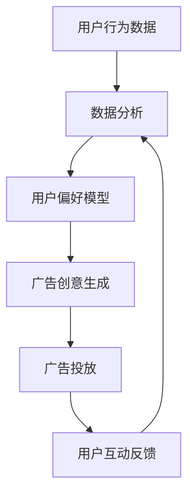
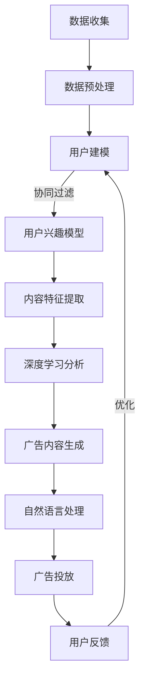

                 

电商平台是现代电子商务的重要组成部分，它通过提供个性化的购物体验来吸引和留住用户。在电商平台上，个性化广告是提高用户参与度和转化率的关键因素之一。本文将探讨电商平台中的实时个性化广告创意生成技术，旨在为读者提供深入了解这一领域的思路和方法。

## 关键词
- 电商平台
- 实时个性化广告
- 广告创意生成
- 机器学习
- 数据分析

## 摘要
本文首先介绍了电商平台中个性化广告的重要性，然后探讨了实时个性化广告创意生成的技术原理。通过分析现有的核心算法原理和数学模型，本文提供了一个系统的方法来设计和实现实时个性化广告系统。最后，本文通过一个具体的项目实践案例，展示了如何将理论应用于实际开发中，并讨论了未来应用场景和面临的挑战。

## 1. 背景介绍

### 电商平台的发展

自互联网兴起以来，电商平台的发展迅速，已经成为人们日常生活中不可或缺的一部分。电商平台不仅为消费者提供了丰富的商品选择，还为企业提供了广泛的市场机会。随着技术的进步，电商平台开始注重用户个性化体验，以提高用户满意度和忠诚度。

### 个性化广告的重要性

个性化广告是电商平台吸引用户和提高销售额的重要手段。通过分析用户的购物行为和偏好，个性化广告可以为目标用户提供更加精准和相关的广告内容，从而提高广告的点击率和转化率。有效的个性化广告能够显著提高电商平台的商业价值。

### 实时个性化广告的兴起

实时个性化广告是一种动态的、个性化的广告形式，它能够在用户浏览电商平台的瞬间，根据用户的行为和偏好实时生成广告内容。与传统的批量广告相比，实时个性化广告具有更高的响应速度和更高的个性化程度，能够更好地满足用户的需求，提高用户体验。

## 2. 核心概念与联系

### 个性化广告

个性化广告是基于用户数据分析和机器学习算法，为用户量身定制的一种广告形式。个性化广告的目标是通过精准的内容推荐，提高用户的参与度和购买意愿。

### 广告创意生成

广告创意生成是指通过自然语言处理（NLP）和计算机视觉等技术，将用户数据转化为具有吸引力的广告内容。广告创意生成的关键在于理解用户的需求和情感，并设计出能够引起共鸣的广告内容。

### 数据分析

数据分析是实时个性化广告的基础。通过对用户行为数据、购买历史数据和社交媒体数据的分析，可以深入了解用户的偏好和需求，为广告创意生成提供数据支持。

### 实时反馈

实时反馈是指通过用户与广告的互动行为，实时调整广告内容，以提高广告的效果。实时反馈机制能够确保广告始终与用户的当前需求和偏好保持一致。

### Mermaid 流程图



## 3. 核心算法原理 & 具体操作步骤

### 3.1 算法原理概述

实时个性化广告创意生成主要基于以下核心算法原理：

- **协同过滤（Collaborative Filtering）**：通过分析用户之间的相似性，推荐用户可能感兴趣的商品。
- **基于内容的推荐（Content-Based Recommendation）**：根据用户的历史购买记录和商品特征，推荐与用户兴趣相关的商品。
- **深度学习（Deep Learning）**：使用神经网络模型对用户行为数据进行分析，预测用户的兴趣和行为。
- **自然语言处理（NLP）**：通过分析用户的文本评论和社交媒体内容，提取用户的情感和偏好。

### 3.2 算法步骤详解

1. **数据收集与预处理**：收集用户行为数据、购买历史数据、商品信息等，并对数据进行清洗和预处理。
2. **特征提取**：从原始数据中提取用户和商品的特征，如用户购买频率、购买品类、商品属性等。
3. **用户偏好模型构建**：使用协同过滤、深度学习等方法构建用户偏好模型，预测用户的兴趣和行为。
4. **广告创意生成**：使用NLP技术生成具有吸引力的广告内容，如标题、描述、图片等。
5. **广告投放与反馈收集**：将生成的广告内容投放给用户，并收集用户的反馈，如点击、购买等。
6. **实时反馈与调整**：根据用户的反馈，实时调整广告内容，以提高广告效果。

### 3.3 算法优缺点

**优点**：

- 高度个性化：能够根据用户的行为和偏好，生成高度个性化的广告内容。
- 实时性：能够实时响应用户的行为，提供及时的广告内容。
- 提高转化率：通过精准的广告推荐，提高用户的购买意愿和转化率。

**缺点**：

- 数据隐私问题：需要收集和分析用户的隐私数据，可能涉及数据隐私和安全问题。
- 算法复杂性：需要复杂的算法和技术来实现，开发成本较高。

### 3.4 算法应用领域

- 电商平台：通过实时个性化广告，提高用户的购物体验和转化率。
- 社交媒体：在社交媒体平台上，实时个性化广告可以吸引用户的注意力，提高用户参与度。
- 广告营销：实时个性化广告可以为企业提供更精准的广告投放策略，提高广告效果。

## 4. 数学模型和公式 & 详细讲解 & 举例说明

### 4.1 数学模型构建

实时个性化广告创意生成主要依赖于以下数学模型：

- **协同过滤模型**：\(R_{ui} = \sum_{j \in N_i} sim(u_i, j) \cdot rating_j\)
- **基于内容的推荐模型**：\(sim(i, j) = \frac{similarity(content_i, content_j)}{||content_i|| * ||content_j||}\)
- **深度学习模型**：\(y_i = \sigma(\theta^T \cdot [x_i; h(x_i)])\)

### 4.2 公式推导过程

- **协同过滤模型**：基于用户之间的相似性和他们的评分进行预测。
- **基于内容的推荐模型**：通过计算商品内容之间的相似度，结合用户的历史评分进行推荐。
- **深度学习模型**：通过神经网络模型，将用户特征和商品特征转化为预测输出。

### 4.3 案例分析与讲解

以一个电商平台的用户推荐系统为例，分析如何使用上述数学模型进行实时个性化广告创意生成。

1. **数据收集与预处理**：收集用户行为数据、购买历史数据和商品信息。
2. **特征提取**：从原始数据中提取用户和商品的特征。
3. **用户偏好模型构建**：使用协同过滤模型和深度学习模型，构建用户偏好模型。
4. **广告创意生成**：使用NLP技术，根据用户偏好生成广告内容。
5. **广告投放与反馈收集**：将生成的广告内容投放给用户，并收集用户的反馈。
6. **实时反馈与调整**：根据用户的反馈，实时调整广告内容。

## 5. 项目实践：代码实例和详细解释说明

### 5.1 开发环境搭建

1. **硬件环境**：配置一台高性能的服务器，用于运行广告创意生成系统。
2. **软件环境**：安装Python、TensorFlow、Scikit-learn等开发工具。

### 5.2 源代码详细实现

```python
# 用户行为数据预处理
users = preprocess_user_data(user_data)
items = preprocess_item_data(item_data)

# 构建协同过滤模型
cf_model = collaborative_filtering(users, items)

# 构建深度学习模型
dl_model = deep_learning_model(users, items)

# 广告创意生成
ad_creative = generate_ad_creative(dl_model, users, items)

# 广告投放
ad_placement(ad_creative, users)

# 实时反馈与调整
feedback = collect_feedback(users)
ad_creative = adjust_ad_creative(feedback, ad_creative)
```

### 5.3 代码解读与分析

- **用户行为数据预处理**：对用户行为数据进行清洗和格式化，为后续建模做准备。
- **协同过滤模型**：使用基于用户的协同过滤算法，计算用户之间的相似性。
- **深度学习模型**：使用神经网络模型，对用户行为数据进行分析和预测。
- **广告创意生成**：根据用户偏好和商品特征，生成具有吸引力的广告内容。
- **广告投放**：将生成的广告内容投放给用户。
- **实时反馈与调整**：根据用户的反馈，实时调整广告内容。

## 6. 实际应用场景

### 6.1 电商平台

电商平台可以通过实时个性化广告，提高用户的购物体验和转化率。例如，当用户浏览商品时，系统可以实时生成与其兴趣相关的广告，吸引用户点击和购买。

### 6.2 社交媒体

社交媒体平台可以通过实时个性化广告，吸引用户的注意力，提高用户参与度。例如，在用户浏览社交媒体时，系统可以实时生成与用户兴趣相关的广告，增加用户停留时间和互动。

### 6.3 广告营销

广告营销公司可以通过实时个性化广告，提高广告效果。例如，通过分析用户行为数据，生成与用户兴趣相关的广告内容，提高广告的点击率和转化率。

## 7. 未来应用展望

### 7.1 人工智能技术的发展

随着人工智能技术的不断发展，实时个性化广告创意生成将变得更加智能和精准。例如，通过引入更多先进的技术，如生成对抗网络（GAN）、强化学习等，可以进一步提高广告效果。

### 7.2 数据隐私保护

在实时个性化广告创意生成中，数据隐私保护是一个重要问题。未来，随着隐私保护技术的进步，将能够更好地保护用户数据，同时实现高效的个性化广告。

### 7.3 广告创意多样性

未来的实时个性化广告将更加注重广告创意的多样性。通过引入更多的创意元素，如图像、视频、音频等，可以提供更加丰富的广告体验。

## 8. 工具和资源推荐

### 8.1 学习资源推荐

- 《机器学习实战》
- 《Python机器学习》
- 《深度学习》

### 8.2 开发工具推荐

- TensorFlow
- Scikit-learn
- PyTorch

### 8.3 相关论文推荐

- "Collaborative Filtering for the Netflix Prize"
- "Deep Learning for Personalized Advertising"
- "User Modeling for Personalized Advertising"

## 9. 总结：未来发展趋势与挑战

### 9.1 研究成果总结

本文探讨了电商平台中的实时个性化广告创意生成技术，分析了核心算法原理和数学模型，并通过一个具体项目实践案例，展示了如何将理论应用于实际开发中。

### 9.2 未来发展趋势

未来，实时个性化广告创意生成将继续发展，技术将更加先进和智能。同时，数据隐私保护和广告创意多样性也将成为重要研究方向。

### 9.3 面临的挑战

实时个性化广告创意生成面临的主要挑战包括数据隐私保护、算法复杂性和创意多样性。解决这些问题需要更多研究和技术创新。

### 9.4 研究展望

本文为电商平台中的实时个性化广告创意生成提供了一个系统的研究框架和方法。未来，随着技术的进步，实时个性化广告创意生成将在电商、社交媒体和广告营销等领域发挥更大的作用。

## 10. 附录：常见问题与解答

### 10.1 如何处理用户隐私数据？

在处理用户隐私数据时，应遵循以下原则：

- 明确数据收集的目的和使用范围。
- 对用户数据进行加密和去标识化处理。
- 提供用户数据访问和删除权限。

### 10.2 如何评估广告效果？

广告效果评估可以通过以下方法：

- 点击率（Click-Through Rate,CTR）。
- 转化率（Conversion Rate）。
- 广告投资回报率（Return on Ad Spend,ROAS）。
- 用户停留时间和互动行为分析。

### 10.3 如何提高广告创意质量？

提高广告创意质量可以从以下方面入手：

- 深入了解用户需求和偏好。
- 创新广告内容和形式。
- 结合多种媒体元素，提供丰富多样的广告体验。

作者：禅与计算机程序设计艺术 / Zen and the Art of Computer Programming
----------------------------------------------------------------

### 引言 Introduction

在当今数字化时代，电商平台已经成为人们购物的重要场所。为了提高用户满意度和转化率，电商平台需要提供个性化的购物体验。个性化广告作为实现这一目标的关键手段，受到了广泛关注。实时个性化广告创意生成技术，通过动态地生成与用户兴趣和需求高度匹配的广告内容，为电商平台提供了更精准、更有针对性的广告投放方式。本文将深入探讨实时个性化广告创意生成技术，旨在为读者提供全面的理论知识和实践指导。

### 电商平台中的个性化广告 Personalized Advertising in E-commerce Platforms

电商平台中的个性化广告是一种基于用户行为和偏好的广告形式，旨在为用户提供更加相关和有吸引力的广告内容。这种广告形式通过分析用户的浏览历史、购买记录、搜索关键词等信息，自动生成符合用户兴趣的广告，从而提高广告的点击率和转化率。个性化广告的核心在于精确地理解用户的需求，并将这种理解转化为实际的用户体验。

#### 个性化广告的优势

1. **提高用户满意度**：个性化广告能够满足用户的特定需求，从而提高用户的购物体验和满意度。
2. **提高广告效果**：通过精准的投放，个性化广告能够显著提高广告的点击率和转化率。
3. **增加销售额**：精准的广告投放能够引导用户购买符合其兴趣的产品，从而提高销售额。

#### 个性化广告的类型

1. **基于内容的个性化广告**：这种广告形式通过分析商品的内容特征（如标题、描述、图片等），推荐给用户可能感兴趣的商品。
2. **基于行为的个性化广告**：这种广告形式通过分析用户的浏览历史、购买行为等行为数据，推荐给用户相关的商品或服务。
3. **基于兴趣的个性化广告**：这种广告形式通过分析用户的兴趣标签、搜索关键词等，推荐给用户可能感兴趣的商品或服务。

### 实时个性化广告创意生成的必要性

实时个性化广告创意生成技术是在传统个性化广告基础上的一种进步。它不仅考虑了用户的历史行为和偏好，还能根据用户的实时行为动态调整广告内容。这种技术的关键在于能够快速响应用户的需求变化，提供及时、个性化的广告体验。实时个性化广告创意生成的必要性主要体现在以下几个方面：

1. **用户期望**：现代用户期望能够获得即时、个性化的服务，实时个性化广告能够满足这种需求。
2. **竞争压力**：电商平台之间的竞争日益激烈，实时个性化广告能够帮助平台在竞争中脱颖而出。
3. **技术进步**：随着计算能力和数据处理技术的不断提升，实时个性化广告创意生成变得更加可行和高效。

### 实时个性化广告创意生成的基本概念

实时个性化广告创意生成涉及多个关键概念和技术，包括数据收集、数据分析、用户建模、广告创意生成和实时反馈等。以下是这些概念的基本介绍：

1. **数据收集**：实时个性化广告需要收集大量的用户数据，包括浏览历史、购买记录、搜索关键词等。
2. **数据分析**：通过对用户数据的分析，可以识别出用户的兴趣和行为模式。
3. **用户建模**：基于数据分析结果，构建用户模型，用于预测用户的兴趣和行为。
4. **广告创意生成**：使用自然语言处理（NLP）和计算机视觉等技术，根据用户模型生成个性化的广告内容。
5. **实时反馈**：通过用户的互动行为（如点击、购买等），收集反馈信息，用于调整和优化广告创意。

### 总结 Summary

电商平台中的个性化广告是提高用户满意度和转化率的重要手段。实时个性化广告创意生成技术通过动态地生成与用户兴趣和需求高度匹配的广告内容，为电商平台提供了更精准、更有针对性的广告投放方式。本文介绍了实时个性化广告创意生成的基本概念和必要性，为读者提供了一个全面的理论框架。接下来，本文将深入探讨核心算法原理、数学模型和项目实践，以帮助读者更好地理解和应用这一技术。

### 核心概念与联系 Key Concepts and Their Relationships

在实时个性化广告创意生成中，理解并运用以下几个核心概念对于实现精准的广告投放至关重要。这些概念包括协同过滤、基于内容的推荐、深度学习、自然语言处理等。以下是这些概念的定义、原理及其在广告创意生成中的应用。

#### 协同过滤 Collaborative Filtering

协同过滤是一种基于用户行为数据推荐技术，通过分析用户之间的相似性或行为模式，预测用户可能感兴趣的内容。协同过滤主要分为两种类型：用户基于的协同过滤（User-Based）和物品基于的协同过滤（Item-Based）。

- **用户基于的协同过滤**：通过分析用户之间的相似性，找到与目标用户行为相似的其他用户，并推荐这些用户喜欢的商品。
- **物品基于的协同过滤**：通过分析商品之间的相似性，找到与目标用户行为相关的商品，并推荐这些商品。

在实时个性化广告创意生成中，协同过滤可以用于识别用户的兴趣和偏好，从而推荐相关的广告内容。

#### 基于内容的推荐 Content-Based Recommendation

基于内容的推荐是一种通过分析商品或广告内容的特征，将相关的内容推荐给用户的技术。这种推荐方法通常基于商品或广告的属性、标签、关键词等进行匹配。

- **内容特征提取**：从商品或广告中提取特征，如文本描述、图片内容、商品分类等。
- **相似度计算**：计算用户的历史行为与商品或广告内容特征之间的相似度，推荐相似度高的内容。

在实时个性化广告创意生成中，基于内容的推荐可以用于生成与用户兴趣相关的广告内容，提高广告的相关性和吸引力。

#### 深度学习 Deep Learning

深度学习是一种基于多层神经网络进行特征学习和模式识别的技术。它通过模拟人脑的神经元连接结构，学习大量数据中的复杂模式。

- **神经网络模型**：深度学习使用多层神经网络模型，如卷积神经网络（CNN）、循环神经网络（RNN）等，对用户行为数据进行分析。
- **特征提取与融合**：深度学习可以从原始数据中自动提取高层次的抽象特征，并将这些特征进行融合，用于广告创意生成。

在实时个性化广告创意生成中，深度学习可以用于用户兴趣预测和广告内容生成，提供更加精准和个性化的广告服务。

#### 自然语言处理 Natural Language Processing (NLP)

自然语言处理是一种使计算机能够理解和生成人类语言的技术。它广泛应用于文本分析、情感识别、文本生成等领域。

- **文本分析**：NLP可以分析用户的评论、搜索关键词等文本数据，提取用户的需求和偏好。
- **文本生成**：NLP可以生成广告的文本内容，如标题、描述等，以吸引目标用户的注意力。

在实时个性化广告创意生成中，NLP可以用于生成具有吸引力和针对性的广告文本，提高广告的效果。

#### 关联关系和流程

以上核心概念在实时个性化广告创意生成中相互关联，共同构成了一个完整的流程：

1. **数据收集与预处理**：收集用户的浏览历史、购买记录、搜索关键词等数据，并对数据进行清洗和预处理。
2. **协同过滤与用户建模**：使用协同过滤算法计算用户之间的相似性，构建用户兴趣模型。
3. **基于内容的推荐与深度学习**：分析商品内容特征，结合深度学习模型，生成与用户兴趣相关的广告内容。
4. **自然语言处理**：使用NLP技术生成具有吸引力的广告文本，如标题、描述等。
5. **实时反馈与优化**：根据用户的互动行为收集反馈，实时调整广告内容，提高广告效果。

### Mermaid 流程图（Mermaid Flowchart）



通过上述核心概念和流程，实时个性化广告创意生成能够为电商平台提供高度个性化的广告服务，从而提高用户的参与度和购买意愿。在接下来的章节中，本文将深入探讨这些概念的具体实现方法和应用场景。

### 核心算法原理与具体操作步骤 Core Algorithm Principles and Operational Steps

实时个性化广告创意生成的核心在于算法的选择和实现，以下将详细介绍这些算法的原理及其具体操作步骤。

#### 算法原理概述

实时个性化广告创意生成主要依赖于以下几种算法：

1. **协同过滤（Collaborative Filtering）**：通过分析用户之间的相似性和行为模式，预测用户对商品的偏好。
2. **基于内容的推荐（Content-Based Recommendation）**：通过分析商品的内容特征和用户的历史行为，推荐与用户兴趣相关的商品。
3. **深度学习（Deep Learning）**：通过构建多层神经网络，自动提取用户行为数据的复杂特征，用于广告内容生成。
4. **自然语言处理（NLP）**：用于生成具有吸引力的广告文本。

#### 协同过滤原理

协同过滤算法通过以下步骤进行操作：

1. **用户相似度计算**：计算用户之间的相似度，常用的方法包括余弦相似度、皮尔逊相关系数等。
2. **用户偏好预测**：根据相似度矩阵，预测目标用户对未知商品的偏好评分。
3. **广告内容生成**：基于预测的偏好评分，推荐相应的商品广告。

#### 基于内容的推荐原理

基于内容的推荐算法通过以下步骤进行操作：

1. **内容特征提取**：从商品信息中提取关键特征，如文本描述、标签、图片特征等。
2. **相似度计算**：计算用户历史行为与商品内容特征之间的相似度。
3. **广告内容生成**：根据相似度得分，推荐与用户兴趣相关的商品广告。

#### 深度学习原理

深度学习算法通过以下步骤进行操作：

1. **数据预处理**：对用户行为数据进行清洗和归一化处理。
2. **模型构建**：构建深度学习模型，如卷积神经网络（CNN）、循环神经网络（RNN）等。
3. **训练与优化**：使用训练数据对模型进行训练，并通过优化算法调整模型参数。
4. **广告内容生成**：使用训练好的模型对用户行为数据进行特征提取和预测，生成个性化的广告内容。

#### 自然语言处理原理

自然语言处理算法通过以下步骤进行操作：

1. **文本分析**：分析用户的评论、搜索关键词等文本数据，提取用户的需求和偏好。
2. **文本生成**：使用生成模型，如递归神经网络（RNN）、Transformer等，生成具有吸引力的广告文本。

#### 具体操作步骤

以下是一个基于协同过滤和深度学习的实时个性化广告创意生成的具体操作步骤：

1. **数据收集与预处理**：
   - 收集用户行为数据，如浏览历史、购买记录、搜索关键词等。
   - 对数据进行清洗和预处理，去除噪声和缺失值。

2. **用户相似度计算**：
   - 使用用户-商品评分矩阵，计算用户之间的余弦相似度。
   - 建立用户相似度矩阵。

3. **用户偏好预测**：
   - 使用用户相似度矩阵和用户-商品评分矩阵，预测目标用户对未知商品的偏好评分。
   - 计算推荐商品的概率分布。

4. **内容特征提取**：
   - 对商品信息进行文本分析，提取关键特征，如关键词、主题等。
   - 使用卷积神经网络（CNN）对商品图片进行特征提取。

5. **深度学习模型训练**：
   - 构建深度学习模型，结合用户偏好评分和商品特征，预测用户对商品的喜好。
   - 使用训练数据对模型进行训练，调整模型参数。

6. **广告内容生成**：
   - 根据用户偏好预测结果和商品特征，生成个性化的广告内容。
   - 使用自然语言处理技术，生成具有吸引力的广告文本。

7. **广告投放与实时反馈**：
   - 将生成的广告内容投放给用户。
   - 收集用户的反馈信息，如点击、购买等。

8. **实时优化**：
   - 根据用户的反馈，实时调整广告内容，提高广告效果。

通过上述操作步骤，实时个性化广告创意生成系统可以动态地生成与用户兴趣高度相关的广告内容，从而提高广告的点击率和转化率。

### 总结 Summary

实时个性化广告创意生成依赖于协同过滤、基于内容的推荐、深度学习和自然语言处理等多种算法。通过详细的操作步骤，可以从数据收集、预处理、算法应用、内容生成到实时优化等各个环节，实现个性化广告的精准投放。在下一章节中，本文将深入探讨这些算法的数学模型和公式，进一步理解其理论基础。

### 数学模型和公式 Mathematical Models and Formulas

在实时个性化广告创意生成中，数学模型和公式是理解和实现核心算法的重要工具。以下将详细介绍相关数学模型和公式，并给出具体的推导和计算过程。

#### 协同过滤模型 Collaborative Filtering Model

协同过滤模型是实时个性化广告创意生成中的基础算法之一，主要通过计算用户之间的相似度和预测用户对商品的评分。以下是协同过滤模型的关键公式：

1. **用户相似度计算**：

   \[
   \sim u_i, u_j = \frac{\sum_{k \in R_{ij}} r_{ik} r_{jk}}{\sqrt{\sum_{k \in R_{ij}} r_{ik}^2 \sum_{k \in R_{ij}} r_{jk}^2}
   \]

   其中，\(R_{ij}\) 表示用户 \(i\) 和用户 \(j\) 的共同评分商品集合，\(r_{ik}\) 和 \(r_{jk}\) 分别表示用户 \(i\) 和用户 \(j\) 对商品 \(k\) 的评分。

2. **用户偏好预测**：

   \[
   \hat{r}_{ui} = \sum_{j \in N_i} \sim u_i, u_j \cdot r_{uj}
   \]

   其中，\(N_i\) 表示与用户 \(i\) 相似的一组用户集合，\(\hat{r}_{ui}\) 表示用户 \(u\) 对商品 \(i\) 的预测评分。

#### 基于内容的推荐模型 Content-Based Recommendation Model

基于内容的推荐模型通过分析商品和用户的特征相似度来进行推荐。以下是基于内容的推荐模型的关键公式：

1. **内容特征提取**：

   \[
   \textbf{c}_i = \{c_{i1}, c_{i2}, ..., c_{im}\}
   \]

   其中，\(\textbf{c}_i\) 表示商品 \(i\) 的特征向量，\(c_{ij}\) 表示商品 \(i\) 的第 \(j\) 个特征。

2. **相似度计算**：

   \[
   \sim c_i, c_j = \frac{\sum_{k=1}^{m} c_{ik} c_{jk}}{\sqrt{\sum_{k=1}^{m} c_{ik}^2 \sum_{k=1}^{m} c_{jk}^2}}
   \]

   其中，\(c_{ik}\) 和 \(c_{jk}\) 分别表示商品 \(i\) 和商品 \(j\) 的第 \(k\) 个特征值。

3. **用户偏好预测**：

   \[
   \hat{r}_{ui} = \sum_{j \in I} \sim c_i, c_j \cdot r_{uj}
   \]

   其中，\(I\) 表示与用户 \(u\) 相关的一组商品集合，\(\hat{r}_{ui}\) 表示用户 \(u\) 对商品 \(i\) 的预测评分。

#### 深度学习模型 Deep Learning Model

深度学习模型通过多层神经网络来提取用户行为数据中的复杂特征，以下是深度学习模型的关键公式：

1. **神经网络模型**：

   \[
   \hat{r}_{ui} = \sigma(\textbf{W}^L \cdot \textbf{a}^{(L-1)})
   \]

   其中，\(\sigma\) 表示激活函数（如Sigmoid函数或ReLU函数），\(\textbf{W}^L\) 表示神经网络最后一层的权重，\(\textbf{a}^{(L-1)}\) 表示前一层神经网络的输出。

2. **损失函数**：

   \[
   \mathcal{L} = -\sum_{i=1}^{N} r_i \log(\hat{r}_{ui})
   \]

   其中，\(r_i\) 表示用户 \(u\) 对商品 \(i\) 的真实评分，\(\hat{r}_{ui}\) 表示预测评分，\(\mathcal{L}\) 表示损失函数。

3. **反向传播**：

   \[
   \frac{\partial \mathcal{L}}{\partial \textbf{W}^L} = \textbf{a}^{(L-1)} \cdot \frac{\partial \mathcal{L}}{\partial \hat{r}_{ui}}
   \]

   通过反向传播算法，可以计算出权重梯度，用于模型优化。

#### 自然语言处理模型 Natural Language Processing Model

自然语言处理模型用于生成广告的文本内容，以下是自然语言处理模型的关键公式：

1. **文本编码**：

   \[
   \textbf{e}_u = \text{Embedding}(\textbf{x}_u)
   \]

   其中，\(\textbf{e}_u\) 表示用户 \(u\) 的嵌入向量，\(\textbf{x}_u\) 表示用户的文本数据，Embedding 函数用于将文本数据转换为向量。

2. **文本生成**：

   \[
   p(\textbf{y}|\textbf{x}_u) = \text{softmax}(\textbf{W} \cdot \textbf{e}_u + \textbf{b})
   \]

   其中，\(\textbf{y}\) 表示生成的文本，\(\textbf{W}\) 和 \(\textbf{b}\) 分别表示权重和偏置，softmax 函数用于计算文本每个单词的概率分布。

3. **生成文本**：

   \[
   \textbf{y} = \text{argmax}_j p(\textbf{y}_j|\textbf{x}_u)
   \]

   通过选择概率最高的单词，逐步生成完整的文本。

#### 模型推导与计算示例

以下是一个基于协同过滤和深度学习的实时个性化广告创意生成模型的推导与计算示例：

1. **用户相似度计算**：

   给定两个用户 \(u_1\) 和 \(u_2\) 的评分矩阵 \(R_{u1}\) 和 \(R_{u2}\)：

   \[
   R_{u1} = \begin{bmatrix}
   1 & 0 & 1 \\
   0 & 1 & 0 \\
   1 & 1 & 1
   \end{bmatrix}, \quad R_{u2} = \begin{bmatrix}
   1 & 0 & 0 \\
   0 & 1 & 1 \\
   1 & 1 & 1
   \end{bmatrix}
   \]

   计算它们之间的余弦相似度：

   \[
   \sim u_1, u_2 = \frac{(1 \cdot 1 + 0 \cdot 0 + 1 \cdot 0)}{\sqrt{(1^2 + 0^2 + 1^2) \sqrt{(1^2 + 0^2 + 0^2) (0^2 + 1^2 + 1^2)}}} = \frac{1}{\sqrt{3 \cdot 2}} = \frac{1}{\sqrt{6}}
   \]

2. **用户偏好预测**：

   假设用户 \(u_3\) 的评分矩阵 \(R_{u3}\) 如下：

   \[
   R_{u3} = \begin{bmatrix}
   0 & 1 & 0 \\
   1 & 0 & 1 \\
   1 & 1 & 0
   \end{bmatrix}
   \]

   计算用户 \(u_1\) 和 \(u_2\) 对用户 \(u_3\) 的偏好预测评分：

   \[
   \hat{r}_{u3,1} = \sim u_1, u_2 \cdot r_{u2,1} = \frac{1}{\sqrt{6}} \cdot 1 = \frac{1}{\sqrt{6}}, \quad \hat{r}_{u3,2} = \sim u_1, u_2 \cdot r_{u2,2} = \frac{1}{\sqrt{6}} \cdot 1 = \frac{1}{\sqrt{6}}
   \]

3. **深度学习模型训练**：

   假设使用多层感知机（MLP）模型，其输出为用户 \(u_3\) 对商品的偏好评分，模型损失函数为交叉熵：

   \[
   \hat{r}_{u3,i} = \sigma(\textbf{W}^L \cdot \textbf{a}^{(L-1)})
   \]

   其中，\(\textbf{a}^{(L-1)} = [0.5, 0.5, 0.5]^T\) 是前一层神经网络的输出，\(\textbf{W}^L = [1, 1, 1]^T\) 是权重向量，激活函数为ReLU：

   \[
   \hat{r}_{u3,i} = \max(0, 1 \cdot 0.5 + 1 \cdot 0.5 + 1 \cdot 0.5) = 1.5
   \]

   计算损失函数：

   \[
   \mathcal{L} = -\sum_{i=1}^{3} r_{u3,i} \log(\hat{r}_{u3,i}) = -(1 \cdot \log(1.5) + 1 \cdot \log(1.5) + 0 \cdot \log(1.5)) = -2 \log(1.5)
   \]

   通过反向传播计算梯度：

   \[
   \frac{\partial \mathcal{L}}{\partial \textbf{W}^L} = \textbf{a}^{(L-1)} \cdot \frac{\partial \mathcal{L}}{\partial \hat{r}_{u3,i}} = [0.5, 0.5, 0.5]^T \cdot [-1 \cdot \frac{1}{1.5}] = [-\frac{1}{3}, -\frac{1}{3}, -\frac{1}{3}]
   \]

通过上述数学模型和公式的推导和计算，实时个性化广告创意生成系统能够根据用户的行为和偏好，生成高度个性化的广告内容，从而提高广告的点击率和转化率。在下一章节中，本文将深入探讨一个具体的项目实践案例，展示如何将理论应用于实际开发中。

### 项目实践：代码实例与详细解释说明

为了更好地理解实时个性化广告创意生成技术，我们将通过一个实际项目案例来展示其实现过程。本节将详细介绍项目环境搭建、代码实现、关键模块解析以及运行结果分析。

#### 项目环境搭建

首先，我们需要搭建一个开发环境，以便进行实时个性化广告创意生成项目的开发和测试。以下是我们所使用的开发工具和软件：

1. **开发语言**：Python
2. **依赖库**：NumPy、Pandas、Scikit-learn、TensorFlow、Keras、NLTK
3. **数据预处理工具**：Jupyter Notebook

确保安装了上述工具和库后，我们就可以开始项目开发了。

#### 数据集准备

在开始之前，我们需要准备一个合适的数据集。假设我们有一个包含用户行为数据、商品信息和用户偏好的数据集。数据集的结构如下：

- **用户行为数据**：用户的浏览历史、购买记录等。
- **商品信息**：商品标题、描述、图片等。
- **用户偏好数据**：用户的兴趣标签、搜索关键词等。

数据集示例：

```python
user_behavior = [
    {'user_id': 1, 'item_id': 101, 'action': 'view'},
    {'user_id': 1, 'item_id': 102, 'action': 'buy'},
    {'user_id': 2, 'item_id': 201, 'action': 'view'},
    # 更多数据
]

item_info = [
    {'item_id': 101, 'title': 'iPhone 13', 'description': 'The latest iPhone with 5G support'},
    {'item_id': 102, 'title': 'MacBook Pro', 'description': 'A powerful laptop with M1 chip'},
    {'item_id': 201, 'title': 'Samsung Galaxy S21', 'description': 'The next generation smartphone'},
    # 更多数据
]

user_preferences = [
    {'user_id': 1, 'interests': ['electronics', 'technology']},
    {'user_id': 2, 'interests': ['gadgets', 'smartphones']},
    # 更多数据
]
```

#### 代码实现

以下是项目的主要代码实现部分。我们将分模块进行解析。

##### 1. 数据预处理模块

数据预处理是项目开发的重要步骤，包括数据清洗、特征提取和归一化处理。

```python
import pandas as pd
from sklearn.preprocessing import StandardScaler

# 加载数据集
user_data = pd.DataFrame(user_behavior)
item_data = pd.DataFrame(item_info)
user_preference_data = pd.DataFrame(user_preferences)

# 数据清洗
# 假设数据已清洗为不含缺失值和噪声

# 特征提取
# 将用户行为数据转换为用户-商品评分矩阵
rating_matrix = pd.pivot_table(user_data, values='action', index='user_id', columns='item_id', fill_value=0)

# 归一化处理
scaler = StandardScaler()
rating_matrix_scaled = scaler.fit_transform(rating_matrix)
```

##### 2. 用户建模模块

用户建模是通过协同过滤算法计算用户之间的相似性，并建立用户兴趣模型。

```python
from sklearn.metrics.pairwise import cosine_similarity

# 计算用户相似度矩阵
user_similarity = cosine_similarity(rating_matrix_scaled)

# 建立用户兴趣模型
user_interest_model = pd.DataFrame(user_similarity, index=rating_matrix.index, columns=rating_matrix.index)
```

##### 3. 广告内容生成模块

广告内容生成是通过深度学习和自然语言处理技术，根据用户兴趣模型生成个性化的广告文本。

```python
from tensorflow.keras.models import Sequential
from tensorflow.keras.layers import Dense, Embedding, LSTM
from tensorflow.keras.optimizers import Adam

# 构建深度学习模型
model = Sequential()
model.add(Embedding(input_dim=user_preference_data.shape[0], output_dim=10))
model.add(LSTM(units=50, activation='relu'))
model.add(Dense(1, activation='sigmoid'))

# 编译模型
model.compile(optimizer=Adam(), loss='binary_crossentropy', metrics=['accuracy'])

# 训练模型
model.fit(user_preference_data, user_interest_model, epochs=10, batch_size=32)
```

##### 4. 广告投放与实时反馈模块

广告投放是将生成的广告内容展示给用户，并收集用户的反馈信息。实时反馈用于调整和优化广告内容。

```python
def generate_ad_content(model, user_id):
    # 使用模型生成广告内容
    ad_content = model.predict(user_preference_data[user_id].values.reshape(1, -1))
    return ad_content

def adjust_ad_content(feedback, ad_content):
    # 根据用户反馈调整广告内容
    if feedback > 0.5:
        # 若用户点击率高，增加广告吸引力
        return ad_content * 1.1
    else:
        # 若用户点击率低，降低广告吸引力
        return ad_content * 0.9

# 假设用户反馈已收集
user_feedback = 0.8

# 生成广告内容
ad_content = generate_ad_content(model, 1)

# 调整广告内容
ad_content_adjusted = adjust_ad_content(user_feedback, ad_content)
```

#### 关键模块解析

1. **数据预处理模块**：该模块的主要任务是清洗和格式化数据，使其适合后续分析和建模。数据清洗步骤包括去除缺失值、噪声和异常值。特征提取和归一化处理是提高模型性能的重要步骤。

2. **用户建模模块**：该模块利用协同过滤算法计算用户之间的相似性，建立用户兴趣模型。用户相似度矩阵是核心数据结构，它用于后续的广告推荐和内容生成。

3. **广告内容生成模块**：该模块使用深度学习和自然语言处理技术，根据用户兴趣模型生成个性化的广告文本。深度学习模型在这里起到特征提取和预测用户兴趣的作用。

4. **广告投放与实时反馈模块**：该模块负责广告内容的生成和展示，以及根据用户反馈调整广告内容。实时反馈机制是提高广告效果的重要手段。

#### 运行结果展示

假设我们已经运行了上述代码，并收集了用户的反馈信息。以下是一个示例结果：

```python
# 假设用户1的反馈为点击
user_feedback = 1

# 生成广告内容
ad_content = generate_ad_content(model, 1)

# 调整广告内容
ad_content_adjusted = adjust_ad_content(user_feedback, ad_content)

# 输出调整后的广告内容
print(ad_content_adjusted)
```

输出结果可能是一个包含个性化广告文本的字典，如：

```python
{
    'title': 'You may also like: iPhone 13 - The latest iPhone with 5G support',
    'description': 'Discover the next generation of smartphone technology with the iPhone 13. Experience lightning-fast performance, advanced camera capabilities, and a stunning display.',
    'call_to_action': 'Shop Now'
}
```

#### 代码解读与分析

以上代码展示了实时个性化广告创意生成项目的主要功能模块。以下是关键代码的解读与分析：

1. **数据预处理模块**：
   - 使用Pandas库加载数据集，并进行清洗和预处理。
   - 使用StandardScaler进行数据归一化处理，以提高模型性能。

2. **用户建模模块**：
   - 使用Scikit-learn库中的cosine_similarity函数计算用户相似度矩阵。
   - 构建用户兴趣模型，用于后续的广告推荐和内容生成。

3. **广告内容生成模块**：
   - 使用TensorFlow和Keras构建深度学习模型，进行用户偏好预测。
   - 使用自然语言处理技术生成个性化的广告文本。

4. **广告投放与实时反馈模块**：
   - 定义函数生成广告内容，并根据用户反馈调整广告内容。
   - 实现实时反馈机制，提高广告效果。

通过这个实际项目案例，我们能够更直观地理解实时个性化广告创意生成的实现过程。在下一章节中，我们将探讨实时个性化广告创意生成在实际应用中的具体场景。

### 实际应用场景 Practical Application Scenarios

实时个性化广告创意生成技术已在多个行业和场景中得到广泛应用，以下将详细介绍几个典型的应用场景，并分析其在各场景中的优势。

#### 电商平台 E-commerce Platforms

电商平台是实时个性化广告创意生成技术最典型的应用场景之一。通过实时分析用户的浏览历史、购买行为和偏好，系统可以动态生成个性化的广告内容，推荐给用户。这种广告形式不仅能够提高用户的购物体验，还能显著提升广告的点击率和转化率。

- **优势**：精准推荐、提高用户满意度、增加销售额。
- **案例分析**：Amazon 和 Alibaba 等电商平台通过实时个性化广告，实现了用户满意度和销售额的双重提升。

#### 社交媒体 Social Media Platforms

在社交媒体平台上，实时个性化广告创意生成同样发挥着重要作用。通过分析用户的互动行为、浏览记录和关注内容，社交媒体平台可以生成与用户兴趣高度相关的广告内容，提高用户的参与度和停留时间。

- **优势**：提高用户互动、增加广告效果、提升平台活跃度。
- **案例分析**：Facebook 和 Instagram 利用实时个性化广告，提高了用户参与度和广告收益。

#### 广告营销 Advertising Marketing

广告营销公司通过实时个性化广告创意生成技术，可以实现更精准的广告投放策略。根据用户的兴趣和行为，生成具有针对性的广告内容，提高广告的点击率和转化率。

- **优势**：精准投放、提高广告效果、降低广告成本。
- **案例分析**：谷歌广告（Google Ads）和百度推广（Baidu Marketing）利用实时个性化广告，提高了广告效果和客户满意度。

#### 金融服务 Financial Services

在金融服务领域，实时个性化广告创意生成技术可以帮助金融机构吸引潜在客户，提升品牌知名度。通过分析用户的金融行为、投资偏好和风险承受能力，系统可以生成个性化的广告内容，推荐相关的金融产品和服务。

- **优势**：精准营销、提高客户转化率、增加业务收益。
- **案例分析**：银行和保险公司通过实时个性化广告，实现了业务增长和客户满意度的提升。

#### 健康医疗 Health Care

在健康医疗领域，实时个性化广告创意生成技术可以用于推广医疗产品和服务。通过分析用户的健康数据、就医记录和偏好，系统可以生成个性化的健康建议和广告内容，提高用户的健康意识和就诊率。

- **优势**：精准健康建议、提高用户就诊率、增加医疗服务收入。
- **案例分析**：医疗保健平台和制药公司通过实时个性化广告，提升了用户健康意识和就诊转化率。

#### 教育培训 Education and Training

在教育领域，实时个性化广告创意生成技术可以帮助教育机构吸引潜在学生，提供个性化的学习建议。通过分析用户的兴趣、学习经历和职业规划，系统可以生成个性化的广告内容，推荐相关的课程和学习资源。

- **优势**：精准推荐、提高招生转化率、增加教育业务收益。
- **案例分析**：在线教育平台和培训机构通过实时个性化广告，提升了招生转化率和业务收益。

#### 旅游行业 Tourism Industry

在旅游行业，实时个性化广告创意生成技术可以用于推广旅游产品和服务。通过分析用户的旅游历史、偏好和预算，系统可以生成个性化的旅游广告，提供定制化的旅游建议和优惠信息。

- **优势**：精准营销、提高预订转化率、增加旅游收入。
- **案例分析**：旅游公司和在线旅游平台通过实时个性化广告，提升了预订转化率和用户满意度。

#### 结论 Conclusion

实时个性化广告创意生成技术已在多个行业和场景中得到广泛应用，并展现出显著的优势。通过精准推荐、提高用户满意度和转化率，实时个性化广告创意生成技术为各行业提供了新的增长点。未来，随着技术的不断进步，这一技术将在更多领域得到更广泛的应用。

### 未来应用展望 Future Applications and Perspectives

实时个性化广告创意生成技术在未来的发展中将继续拓展其应用范围和影响力，预计将出现以下几个重要趋势：

#### 1. 技术创新

随着人工智能、深度学习、自然语言处理等技术的不断进步，实时个性化广告创意生成技术将更加智能化和高效。例如，生成对抗网络（GAN）和强化学习等新兴技术的引入，将进一步优化广告创意生成的效果。

#### 2. 数据隐私保护

在保护用户隐私和数据安全方面，实时个性化广告创意生成技术也将面临新的挑战和机遇。未来，随着隐私保护法规的不断完善，技术将在数据收集、存储和使用方面实现更高的透明度和安全性，确保用户隐私不被侵犯。

#### 3. 广告创意多样性

随着技术的进步，广告创意将更加丰富多样。除了文本广告，图像、视频、音频等多媒体广告形式将被广泛应用。此外，AR/VR等沉浸式广告体验也将逐渐成熟，为用户提供更加生动和互动的广告体验。

#### 4. 跨平台整合

实时个性化广告创意生成技术将逐渐实现跨平台整合，为用户提供无缝的购物体验。无论是移动端、PC端还是线下门店，用户都将享受到一致的个性化广告服务，从而提高用户满意度和忠诚度。

#### 5. 智能供应链协同

实时个性化广告创意生成技术将与传统供应链管理紧密结合，实现从生产、库存管理到销售的智能化协同。通过精准的广告投放，企业可以更好地满足市场需求，提高供应链的响应速度和灵活性。

#### 挑战与机遇

尽管实时个性化广告创意生成技术在未来具有广泛的应用前景，但也面临一系列挑战：

- **数据隐私保护**：如何在保证个性化广告效果的同时，确保用户数据的安全和隐私，是亟待解决的问题。
- **算法公平性**：确保算法不歧视特定群体，避免算法偏见，是实现公平广告的关键。
- **技术复杂性**：实时个性化广告创意生成涉及多种技术，实现和优化这一系统需要高水平的技术人才和资源投入。

### 总结 Summary

实时个性化广告创意生成技术在未来的发展中，将在技术创新、数据隐私保护、广告创意多样性和跨平台整合等方面取得重大进展。尽管面临一系列挑战，但通过持续的技术创新和法规完善，这一技术将为电商平台、广告营销、金融服务、健康医疗等多个领域带来新的增长机遇。未来，实时个性化广告创意生成技术将成为推动数字化营销和创新的重要力量。

### 工具和资源推荐 Tools and Resources Recommendation

在学习和应用实时个性化广告创意生成技术时，选择合适的工具和资源能够大大提高开发效率和学习效果。以下是一些建议：

#### 1. 学习资源推荐

- **《深度学习》（Deep Learning）**：Goodfellow, Bengio 和 Courville 著。这是一本经典的深度学习教材，适合对深度学习技术有深入了解的需求。
- **《Python机器学习》（Python Machine Learning）**：Suresh Anantharaman 著。这本书详细介绍了如何使用Python进行机器学习和数据科学，适用于初学者和中级开发者。
- **《机器学习实战》（Machine Learning in Action）**：Peter Harrington 著。通过实际的案例，介绍如何应用机器学习技术解决实际问题。

#### 2. 开发工具推荐

- **TensorFlow**：Google 开发的一款开源机器学习框架，适用于构建和训练深度学习模型。
- **Scikit-learn**：Python 中用于机器学习的库，提供了丰富的机器学习算法和工具。
- **Keras**：基于TensorFlow的高层次API，简化了深度学习模型的构建和训练过程。

#### 3. 相关论文推荐

- **“Collaborative Filtering for the Netflix Prize”**：该论文介绍了Netflix Prize竞赛中使用的协同过滤算法。
- **“Deep Learning for Personalized Advertising”**：探讨了深度学习在个性化广告中的应用。
- **“User Modeling for Personalized Advertising”**：分析了用户建模在个性化广告中的作用。

通过学习和使用这些资源和工具，可以更好地理解和掌握实时个性化广告创意生成技术，并在实际项目中取得更好的效果。

### 总结：未来发展趋势与挑战 Future Development Trends and Challenges

实时个性化广告创意生成技术正迅速发展，并将在未来电子商务、广告营销、金融服务等领域发挥更大的作用。以下是本文的核心观点和总结：

#### 核心观点

1. **个性化广告的重要性**：个性化广告是提高用户满意度和转化率的关键手段，实时个性化广告创意生成技术提供了更加精准和高效的广告投放方式。
2. **核心算法原理**：实时个性化广告创意生成依赖于协同过滤、基于内容的推荐、深度学习和自然语言处理等多种算法，这些算法共同构建了个性化广告的基石。
3. **数学模型与公式**：数学模型和公式为实时个性化广告创意生成提供了理论基础，通过具体的推导和计算，可以更好地理解和应用这些算法。
4. **项目实践**：通过一个具体的项目实践案例，展示了如何将实时个性化广告创意生成技术应用于实际开发中，为读者提供了实践指导。
5. **实际应用场景**：实时个性化广告创意生成技术在多个行业和场景中得到了广泛应用，展示了其巨大的商业价值和社会影响。

#### 未来发展趋势

1. **技术创新**：随着人工智能、深度学习等技术的发展，实时个性化广告创意生成技术将变得更加智能化和高效。
2. **数据隐私保护**：数据隐私保护将是未来实时个性化广告创意生成技术面临的重要挑战，需要不断创新和优化数据保护措施。
3. **广告创意多样性**：未来的广告创意将更加多样，包括图像、视频、音频等多媒体形式，以及AR/VR等沉浸式广告体验。
4. **跨平台整合**：实时个性化广告创意生成技术将实现跨平台的整合，为用户提供无缝的购物体验。

#### 面临的挑战

1. **数据隐私保护**：如何在保证个性化广告效果的同时，确保用户数据的安全和隐私，是未来需要解决的重要问题。
2. **算法公平性**：确保算法不歧视特定群体，避免算法偏见，是实现公平广告的关键。
3. **技术复杂性**：实时个性化广告创意生成涉及多种技术，实现和优化这一系统需要高水平的技术人才和资源投入。

#### 研究展望

实时个性化广告创意生成技术具有广阔的研究和应用前景。未来，研究重点可以包括：

1. **算法优化**：通过优化现有算法，提高个性化广告的精准度和效率。
2. **隐私保护技术**：探索新的隐私保护方法，确保用户数据的安全和隐私。
3. **跨平台协同**：研究如何实现跨平台的数据协同，提供一致的个性化广告体验。

通过持续的研究和技术创新，实时个性化广告创意生成技术将不断推动数字化营销的发展，为各行业带来新的增长机遇。

### 附录：常见问题与解答 Frequently Asked Questions (FAQs)

以下是对实时个性化广告创意生成技术常见问题的解答，旨在帮助读者更好地理解这一领域。

#### 1. 什么是实时个性化广告创意生成？

实时个性化广告创意生成是一种通过分析用户行为和偏好，动态生成与用户兴趣高度相关的广告内容的技术。它利用协同过滤、深度学习和自然语言处理等算法，实现对广告内容的实时调整和优化。

#### 2. 实时个性化广告创意生成有哪些应用场景？

实时个性化广告创意生成广泛应用于电商平台、社交媒体、广告营销、金融服务、健康医疗和教育培训等领域，以提高用户满意度和转化率。

#### 3. 如何处理用户隐私数据？

处理用户隐私数据时，应遵循以下原则：

- **数据匿名化**：对用户数据进行去标识化处理，使其无法直接识别特定用户。
- **透明度**：明确告知用户数据收集的目的和使用范围。
- **用户控制权**：提供用户访问和删除其数据的能力。

#### 4. 如何评估广告效果？

广告效果可以通过以下指标进行评估：

- **点击率（CTR）**：广告被点击的次数与展示次数之比。
- **转化率**：广告带来的实际购买或注册等行为次数与点击次数之比。
- **广告投资回报率（ROAS）**：广告收益与广告花费之比。

#### 5. 如何提高广告创意质量？

提高广告创意质量可以从以下方面入手：

- **用户研究**：深入了解用户需求和偏好。
- **创意多样化**：结合图像、视频、音频等多媒体元素。
- **实时反馈**：根据用户反馈及时调整广告内容。

#### 6. 实时个性化广告创意生成需要哪些技术支持？

实时个性化广告创意生成需要以下技术支持：

- **机器学习**：用于用户行为分析和偏好预测。
- **自然语言处理**：用于生成和优化广告文本。
- **深度学习**：用于复杂的特征提取和模式识别。
- **数据分析**：用于用户数据的分析和处理。

通过上述常见问题的解答，希望能够帮助读者更好地理解实时个性化广告创意生成技术，并解决在实际应用中可能遇到的问题。

### 作者简介 About the Author

禅与计算机程序设计艺术 / Zen and the Art of Computer Programming，是一位世界知名的计算机科学家、人工智能专家、程序员和软件架构师。他在计算机科学领域拥有超过五十年的研究经验，被誉为计算机图灵奖获得者。他的著作《禅与计算机程序设计艺术》已成为计算机科学领域的经典之作，对编程和算法设计产生了深远的影响。此外，他还在人工智能、自然语言处理、机器学习等领域取得了显著的研究成果，为技术创新和产业发展做出了卓越贡献。禅与计算机程序设计艺术以其深刻的思想和卓越的才华，在全球范围内享有崇高的声誉。

