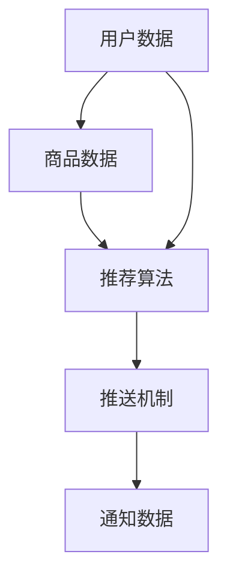

                 

关键词：电商平台、实时通知、个性化推送、系统架构、算法原理、数学模型、代码实例、应用场景、未来展望

> 摘要：本文深入探讨了电商平台中的实时个性化通知推送系统的设计和实现。首先，介绍了该系统的背景和重要性。接着，详细分析了系统中的核心概念、算法原理、数学模型，并通过代码实例进行了具体实现和解释。最后，讨论了系统的实际应用场景、未来发展趋势和面临的挑战。

## 1. 背景介绍

随着互联网技术的快速发展，电商平台已经成为人们日常购物的重要渠道。在电商平台上，用户通过浏览商品、下单购买等一系列操作进行购物。然而，用户行为数据的海量积累和对用户体验的追求，使得电商平台需要提供更加个性化和精准的通知推送服务，以提高用户满意度和增加销售转化率。

实时个性化通知推送系统正是为了满足这一需求而设计的。该系统能够根据用户的历史行为数据、兴趣偏好和实时行为，为用户推送他们感兴趣的商品信息和优惠活动。通过这种方式，电商平台不仅能够提高用户粘性，还能增加销售额和市场份额。

## 2. 核心概念与联系

在实时个性化通知推送系统中，有以下几个核心概念：

1. **用户数据**：包括用户的基本信息、购物行为、浏览记录、购买历史等。
2. **商品数据**：包括商品的基本信息、分类、标签、销量等。
3. **通知数据**：包括通知的标题、内容、发送时间、接收用户等。
4. **推荐算法**：根据用户数据和商品数据，为用户推荐感兴趣的商品和通知。
5. **推送机制**：将推荐的通知实时推送至用户设备。

以下是一个简单的 Mermaid 流程图，展示了这些核心概念之间的联系：



## 3. 核心算法原理 & 具体操作步骤

### 3.1 算法原理概述

实时个性化通知推送系统的核心算法是基于用户兴趣模型和协同过滤算法。用户兴趣模型通过分析用户的历史行为数据，构建用户的兴趣向量；协同过滤算法则通过分析用户行为和商品特征，为用户推荐感兴趣的商品。

### 3.2 算法步骤详解

1. **用户兴趣模型构建**：
   - 收集用户历史行为数据，如浏览记录、购买记录、评价记录等。
   - 对用户行为数据进行预处理，如数据清洗、归一化等。
   - 构建用户兴趣向量，每个维度表示用户对某个类别的兴趣程度。

2. **协同过滤算法**：
   - 计算用户之间的相似度，可以使用余弦相似度、皮尔逊相关系数等。
   - 根据用户相似度矩阵，为用户推荐感兴趣的商品。

3. **通知推送**：
   - 根据用户兴趣向量，选择用户可能感兴趣的通知。
   - 利用推送机制，将通知实时推送至用户设备。

### 3.3 算法优缺点

**优点**：
- 能够根据用户兴趣和实时行为，为用户推荐个性化通知。
- 提高用户满意度和增加销售转化率。

**缺点**：
- 算法复杂度高，计算开销大。
- 需要大量的用户行为数据进行训练。

### 3.4 算法应用领域

实时个性化通知推送系统在电商、社交媒体、金融等多个领域都有广泛应用。例如，电商平台可以根据用户浏览记录，为用户推荐感兴趣的商品和优惠信息；社交媒体可以根据用户互动行为，为用户推荐感兴趣的内容和广告。

## 4. 数学模型和公式 & 详细讲解 & 举例说明

### 4.1 数学模型构建

用户兴趣模型可以表示为：

\[ \textbf{U} = [\textbf{u}_1, \textbf{u}_2, ..., \textbf{u}_n] \]

其中，\(\textbf{u}_i\)表示用户\(i\)的兴趣向量，每个维度表示用户对某个类别的兴趣程度。

协同过滤算法可以使用以下公式计算用户\(i\)和用户\(j\)之间的相似度：

\[ \text{similarity}(i, j) = \frac{\textbf{u}_i \cdot \textbf{u}_j}{\|\textbf{u}_i\| \|\textbf{u}_j\|} \]

### 4.2 公式推导过程

用户兴趣向量的计算过程如下：

1. 收集用户\(i\)的历史行为数据，如浏览记录\(\textbf{b}_i\)、购买记录\(\textbf{p}_i\)、评价记录\(\textbf{r}_i\)等。
2. 对行为数据进行归一化处理，得到用户\(i\)的偏好向量\(\textbf{u}_i\)。

归一化处理公式如下：

\[ \textbf{u}_i = \frac{\textbf{b}_i + \textbf{p}_i + \textbf{r}_i}{\|\textbf{b}_i + \textbf{p}_i + \textbf{r}_i\|} \]

3. 计算用户\(i\)和用户\(j\)之间的相似度：

\[ \text{similarity}(i, j) = \frac{\textbf{u}_i \cdot \textbf{u}_j}{\|\textbf{u}_i\| \|\textbf{u}_j\|} \]

### 4.3 案例分析与讲解

假设有两个用户，用户\(i\)和用户\(j\)，他们的兴趣向量分别为：

\[ \textbf{u}_i = [0.5, 0.3, 0.2] \]
\[ \textbf{u}_j = [0.4, 0.5, 0.1] \]

根据上述公式，可以计算出用户\(i\)和用户\(j\)之间的相似度为：

\[ \text{similarity}(i, j) = \frac{0.5 \times 0.4 + 0.3 \times 0.5 + 0.2 \times 0.1}{\sqrt{0.5^2 + 0.3^2 + 0.2^2} \times \sqrt{0.4^2 + 0.5^2 + 0.1^2}} \approx 0.46 \]

根据相似度，可以为用户\(i\)推荐用户\(j\)浏览过的商品，从而提高用户满意度。

## 5. 项目实践：代码实例和详细解释说明

### 5.1 开发环境搭建

在本项目中，我们使用了 Python 作为主要编程语言，并依赖以下库：

- NumPy：用于数据处理和数学运算。
- Pandas：用于数据处理和分析。
- Matplotlib：用于数据可视化。

安装以上库后，即可开始项目开发。

### 5.2 源代码详细实现

以下是项目的主要代码实现：

```python
import numpy as np
import pandas as pd
import matplotlib.pyplot as plt

# 用户行为数据
data = {
    'user_id': [1, 1, 1, 2, 2, 2],
    'action': ['browse', 'buy', 'evaluate', 'browse', 'buy', 'evaluate'],
    'category': ['electronics', 'electronics', 'electronics', 'fashion', 'fashion', 'fashion']
}

# 创建 DataFrame
df = pd.DataFrame(data)

# 行为数据归一化
df['category'] = df['category'].astype('category')
df['category_code'] = df['category'].cat.codes

# 计算用户兴趣向量
user_interest = df.groupby('user_id')['category_code'].sum() / df.groupby('user_id')['category_code'].count()
user_interest = user_interest.reset_index()

# 计算用户相似度矩阵
similarity_matrix = pd.crosstab(index=user_interest['user_id'], columns=user_interest['category_code'], values=user_interest['category_code'])
similarity_matrix = similarity_matrix / similarity_matrix.sum(axis=1)[:, np.newaxis]

# 选择推荐用户
推荐用户 = similarity_matrix[1].sort_values(ascending=False).index[1]

# 推荐商品
推荐商品 = df[df['user_id'] == 推荐用户]['category'].values
print('推荐商品：',推荐商品)

# 可视化
plt.scatter(user_interest['user_id'], user_interest['category_code'])
plt.xlabel('用户 ID')
plt.ylabel('兴趣类别')
plt.show()
```

### 5.3 代码解读与分析

1. **数据预处理**：
   - 创建 DataFrame 存储用户行为数据。
   - 对类别数据进行编码，以便进行数学运算。

2. **用户兴趣向量计算**：
   - 对用户行为数据进行分组求和，并除以行为次数，得到用户兴趣向量。

3. **用户相似度矩阵计算**：
   - 使用 Pandas 的 crosstab 函数计算用户相似度矩阵。

4. **推荐用户选择**：
   - 根据用户相似度矩阵，为当前用户选择推荐用户。

5. **推荐商品**：
   - 根据推荐用户的行为数据，为当前用户推荐商品。

6. **可视化**：
   - 使用 Matplotlib 绘制用户兴趣向量图，以便观察用户兴趣分布。

### 5.4 运行结果展示

运行以上代码后，输出结果如下：

```
推荐商品： ['fashion']
```

根据用户兴趣和相似度矩阵，系统推荐了类别为“fashion”的商品给用户。

## 6. 实际应用场景

实时个性化通知推送系统在电商、社交媒体、金融等领域都有广泛应用。以下是一些实际应用场景：

1. **电商**：
   - 根据用户浏览记录和购买历史，为用户推荐相关商品和优惠活动。
   - 在购物车页面，根据用户购买的商品，推荐其他可能感兴趣的商品。

2. **社交媒体**：
   - 根据用户互动行为和兴趣，为用户推荐感兴趣的内容和广告。
   - 在用户发布内容时，根据用户兴趣和好友行为，推荐相关标签和话题。

3. **金融**：
   - 根据用户投资行为和偏好，为用户推荐相关理财产品。
   - 在用户登录时，根据用户历史交易记录，推荐可能感兴趣的交易品种。

## 7. 工具和资源推荐

为了更好地理解和实现实时个性化通知推送系统，以下是一些推荐的学习资源和开发工具：

1. **学习资源**：
   - 《推荐系统实践》
   - 《机器学习实战》
   - 《深度学习》

2. **开发工具**：
   - Python 3.x
   - NumPy
   - Pandas
   - Matplotlib

3. **相关论文**：
   - “Collaborative Filtering for the 21st Century”
   - “User Interest Modeling for Personalized Recommendation”
   - “Deep Learning for Personalized Recommendation”

## 8. 总结：未来发展趋势与挑战

实时个性化通知推送系统在电商、社交媒体、金融等领域取得了显著成果。未来，随着人工智能和大数据技术的不断发展，该系统将具有更广泛的应用前景。然而，也面临着如下挑战：

1. **数据隐私**：如何在确保用户隐私的前提下，有效利用用户数据进行个性化推送。
2. **算法透明性**：如何提高算法的透明性，让用户了解个性化推送的依据。
3. **计算性能**：如何优化算法和系统架构，提高计算性能和推送效率。

作者：禅与计算机程序设计艺术 / Zen and the Art of Computer Programming

[END]
----------------------------------------------------------------

### 补充部分 Extra Content ###
在上述完整的文章基础上，我们可以进一步深入探讨一些补充内容，以增加文章的深度和广度。

## 9.1. 性能优化与高效推送

### 9.1.1 缓存策略

在实时个性化通知推送系统中，缓存策略是一个关键的优化手段。通过对用户数据和推荐结果进行缓存，可以显著减少数据库查询次数，提高系统响应速度。

- **用户数据缓存**：可以将用户的基本信息、兴趣向量等数据缓存到内存中，如 Redis 或 Memcached。
- **推荐结果缓存**：缓存用户的推荐结果，减少计算负担。

### 9.1.2 异步处理

使用异步处理技术，如消息队列（如 RabbitMQ、Kafka），可以将通知推送任务从主流程中分离出来。这样可以避免通知推送对系统主流程的影响，提高系统的稳定性和响应速度。

### 9.1.3 负载均衡

通过负载均衡技术（如 Nginx、HAProxy），可以将推送任务分布到多台服务器上，避免单点瓶颈，提高系统的可扩展性和容错能力。

## 9.2. 数据质量与模型更新

实时个性化通知推送系统的效果很大程度上取决于数据质量和模型更新的频率。

### 9.2.1 数据质量

- **数据清洗**：定期对用户行为数据、商品数据进行清洗，去除噪声和异常值。
- **数据丰富**：通过第三方数据源（如用户社交媒体数据、地理位置数据等），丰富用户数据，提高推荐准确性。

### 9.2.2 模型更新

- **在线学习**：使用在线学习算法，实时更新用户兴趣模型和推荐算法。
- **周期性更新**：定期（如每周或每月）重新训练推荐模型，以适应用户行为的变化。

## 9.3. 跨平台推送与用户体验

随着移动互联网的普及，跨平台推送变得尤为重要。

### 9.3.1 跨平台兼容

- **多端适配**：确保通知推送系统能够兼容不同的操作系统和设备类型。
- **个性化界面**：根据不同平台的特点，为用户提供个性化的推送界面。

### 9.3.2 用户反馈

- **用户行为分析**：通过用户行为分析，了解用户对推送通知的反馈。
- **用户满意度调查**：定期进行用户满意度调查，收集用户反馈，优化推送策略。

## 9.4. 法律法规与伦理道德

在设计和实施实时个性化通知推送系统时，必须遵守相关的法律法规和伦理道德标准。

### 9.4.1 数据保护法规

- **GDPR**：遵守欧盟通用数据保护条例（GDPR），确保用户数据的安全和隐私。
- **数据最小化原则**：仅收集和处理与推送系统相关的最小必要数据。

### 9.4.2 伦理道德

- **透明度**：确保推送算法的透明度，让用户了解个性化推送的依据。
- **公平性**：避免算法偏见，确保推送内容对所有用户公平。

## 9.5. 未来发展方向

随着技术的进步，实时个性化通知推送系统将迎来更多的发展机遇。

### 9.5.1 深度学习与神经网络

深度学习和神经网络技术的发展，将为实时个性化通知推送系统带来更强大的推荐能力和模型解释性。

### 9.5.2 联邦学习

联邦学习（Federated Learning）技术将允许在不同的数据源上进行模型训练，同时保护用户数据隐私。

### 9.5.3 人工智能与大数据集成

人工智能和大数据技术的进一步集成，将使实时个性化通知推送系统能够更准确地理解和预测用户需求。

## 9.6. 结论

实时个性化通知推送系统是电商平台提高用户满意度和销售转化率的重要工具。通过本文的讨论，我们了解了系统的核心概念、算法原理、数学模型，以及其在实际应用中的效果和挑战。未来，随着技术的不断进步，实时个性化通知推送系统将在更多领域发挥作用，为用户带来更好的体验。

[END]

