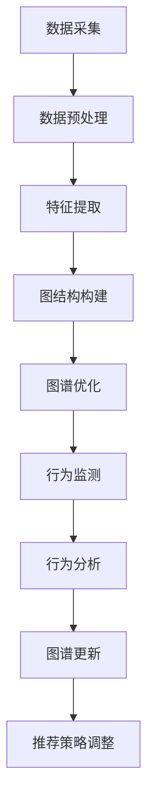

                 

关键词：电商平台、用户兴趣图谱、更新机制、算法、数学模型、项目实践、应用场景、展望、挑战

> 摘要：本文深入探讨了电商平台中用户兴趣图谱的构建与更新机制。通过对核心概念、算法原理、数学模型以及项目实践的详细解析，旨在为电商企业提供一种有效的用户行为分析和个性化推荐的方法。文章结构清晰，逻辑紧凑，适合广大计算机领域专业人士阅读和学习。

## 1. 背景介绍

随着互联网的迅猛发展和电子商务的普及，电商平台已经成为现代商业环境中不可或缺的一部分。电商平台不仅为消费者提供了便利的购物渠道，也为企业带来了海量的用户数据。如何有效地利用这些数据来提升用户体验、优化商品推荐，成为电商企业关注的核心问题。

用户兴趣图谱是一种用于表示用户兴趣和行为模式的数据结构，它通过捕捉用户的浏览、搜索、购买等行为，构建出一个反映用户个性化需求的知识图谱。用户兴趣图谱的构建与更新机制对于电商平台来说具有重要意义，它不仅可以帮助企业更好地理解用户，还可以为个性化推荐系统提供数据支持。

本文将围绕电商平台中的用户兴趣图谱更新机制展开讨论，首先介绍相关核心概念和算法原理，然后通过数学模型和项目实践进行分析，最后探讨其实际应用场景和未来发展趋势。

## 2. 核心概念与联系

### 2.1 用户兴趣图谱的概念

用户兴趣图谱是一种基于知识图谱构建的方法，它通过将用户的行为数据（如浏览、搜索、购买等）映射到图结构中，形成一个反映用户兴趣和偏好关系的数据结构。用户兴趣图谱通常包括以下几个核心组成部分：

- **节点（Node）**：表示用户、商品、品牌、分类等实体。
- **边（Edge）**：表示实体之间的关系，如用户与商品之间的购买关系、用户与品牌之间的浏览关系等。
- **权重（Weight）**：表示边的重要程度，反映了用户对不同实体的兴趣程度。

### 2.2 用户兴趣图谱的构建方法

用户兴趣图谱的构建主要包括以下几个步骤：

1. **数据采集**：收集用户的浏览、搜索、购买等行为数据。
2. **数据预处理**：对采集到的数据进行清洗、去重、格式化等操作，确保数据质量。
3. **特征提取**：将预处理后的数据转化为特征向量，用于表示用户和商品的属性。
4. **图结构构建**：根据特征向量构建用户兴趣图谱，包括节点、边和权重的定义。
5. **图谱优化**：对用户兴趣图谱进行优化，以提高其表示用户兴趣的能力。

### 2.3 用户兴趣图谱的更新机制

用户兴趣图谱的更新机制主要包括以下几个步骤：

1. **行为监测**：实时监测用户的浏览、搜索、购买等行为，捕捉用户兴趣的变化。
2. **行为分析**：分析用户行为数据，识别用户兴趣的变化趋势和偏好。
3. **图谱更新**：根据用户行为分析结果，动态更新用户兴趣图谱，包括节点、边和权重的调整。
4. **推荐策略调整**：利用更新后的用户兴趣图谱，调整个性化推荐系统的推荐策略，以提高推荐效果。

### 2.4 用户兴趣图谱的 Mermaid 流程图



## 3. 核心算法原理 & 具体操作步骤

### 3.1 算法原理概述

用户兴趣图谱更新机制的核心算法包括行为监测、行为分析、图谱更新和推荐策略调整。下面将分别介绍这些算法的原理和操作步骤。

### 3.2 行为监测

行为监测是用户兴趣图谱更新的第一步，其主要目的是实时捕捉用户的浏览、搜索、购买等行为。具体操作步骤如下：

1. **数据采集**：通过网页浏览、API 接口、日志分析等方式，收集用户的浏览、搜索、购买等行为数据。
2. **数据预处理**：对采集到的数据进行清洗、去重、格式化等操作，确保数据质量。
3. **行为识别**：根据行为数据的类型和内容，将用户行为识别为浏览、搜索、购买等不同类型。

### 3.3 行为分析

行为分析是用户兴趣图谱更新的关键步骤，其主要目的是分析用户行为数据，识别用户兴趣的变化趋势和偏好。具体操作步骤如下：

1. **行为统计**：对用户行为数据进行分析，计算用户在各个品类、品牌、价格范围内的浏览、搜索、购买次数等指标。
2. **兴趣模型构建**：基于用户行为数据，构建用户兴趣模型，包括用户兴趣强度、兴趣变化趋势等。
3. **兴趣识别**：根据用户兴趣模型，识别用户在各个品类、品牌、价格范围内的兴趣变化。

### 3.4 图谱更新

图谱更新是根据用户行为分析结果，动态更新用户兴趣图谱，包括节点、边和权重的调整。具体操作步骤如下：

1. **节点更新**：根据用户行为分析结果，新增或删除与用户兴趣相关的节点，如新增某个品类的节点、删除某个品牌的节点等。
2. **边更新**：根据用户行为分析结果，调整用户与商品、品牌、品类等实体之间的边权重，反映用户对不同实体的兴趣程度。
3. **权重更新**：根据用户行为分析结果，调整用户兴趣图谱中的节点权重，提高对用户兴趣度高的实体的表示能力。

### 3.5 推荐策略调整

推荐策略调整是根据更新后的用户兴趣图谱，调整个性化推荐系统的推荐策略，以提高推荐效果。具体操作步骤如下：

1. **推荐策略优化**：根据用户兴趣图谱，优化推荐算法，提高对用户兴趣度高的商品、品牌、品类等的推荐权重。
2. **推荐结果调整**：根据推荐策略优化结果，调整推荐结果，提高推荐准确度和用户体验。

### 3.6 算法优缺点

用户兴趣图谱更新机制的算法在提升电商平台个性化推荐效果方面具有显著优势，但同时也存在一些不足之处。

**优点**：

1. **实时性**：算法能够实时捕捉用户行为，快速更新用户兴趣图谱，提高个性化推荐效果。
2. **全面性**：算法综合考虑用户的浏览、搜索、购买等多维度行为数据，构建用户兴趣图谱，提高用户理解能力。
3. **灵活性**：算法可以根据用户行为变化，动态调整用户兴趣图谱和推荐策略，适应不同用户的需求。

**缺点**：

1. **计算复杂度**：算法涉及大量计算，如数据预处理、特征提取、图结构构建等，对计算资源要求较高。
2. **数据质量**：算法效果受数据质量影响较大，如数据缺失、噪声等会影响用户兴趣图谱的构建和更新。
3. **隐私保护**：算法需要处理用户的隐私数据，如浏览、搜索、购买等行为，需要确保数据安全和隐私保护。

### 3.7 算法应用领域

用户兴趣图谱更新机制在电商平台中具有广泛的应用领域，包括：

1. **个性化推荐**：根据用户兴趣图谱，为用户提供个性化推荐，提高用户满意度和购买转化率。
2. **用户行为分析**：通过分析用户兴趣图谱，了解用户行为模式、偏好和需求，为企业提供决策支持。
3. **营销策略优化**：根据用户兴趣图谱，制定更精准的营销策略，提高营销效果和 ROI。

## 4. 数学模型和公式 & 详细讲解 & 举例说明

### 4.1 数学模型构建

用户兴趣图谱更新机制的数学模型主要包括以下几个部分：

1. **用户行为模型**：基于用户的浏览、搜索、购买等行为数据，构建用户行为模型。用户行为模型可以用一个矩阵表示，其中每个元素表示用户对某个实体的行为强度。
2. **兴趣强度模型**：基于用户行为模型，计算用户对每个实体的兴趣强度。兴趣强度模型可以用一个向量表示，其中每个元素表示用户对某个实体的兴趣强度。
3. **兴趣图谱模型**：基于兴趣强度模型，构建用户兴趣图谱。兴趣图谱模型可以用一个图结构表示，包括节点、边和权重。

### 4.2 公式推导过程

假设用户行为模型为 $B_{ij}$，其中 $i$ 表示用户，$j$ 表示实体。行为强度 $B_{ij}$ 可以表示为用户 $i$ 对实体 $j$ 的行为次数、时间间隔或评分等。

1. **兴趣强度模型**：

   假设用户 $i$ 对实体 $j$ 的兴趣强度为 $I_{ij}$，可以用以下公式计算：

   $$I_{ij} = \frac{B_{ij}}{\sum_{j'} B_{ij'}}$$

   其中，$\sum_{j'} B_{ij'}$ 表示用户 $i$ 对所有实体的行为强度之和。

2. **兴趣图谱模型**：

   假设用户兴趣图谱中节点 $i$ 对应实体 $j$ 的权重为 $W_{ij}$，可以用以下公式计算：

   $$W_{ij} = I_{ij} \cdot \alpha$$

   其中，$\alpha$ 为权重调整系数，用于调整兴趣强度和权重之间的关系。

### 4.3 案例分析与讲解

假设有一个电商平台，用户 $A$ 在过去一个月内浏览了商品 $B_1$、$B_2$、$B_3$，分别进行了 10、5、3 次购买。根据上述公式，可以计算出用户 $A$ 对这三个商品的兴趣强度和权重：

1. **兴趣强度模型**：

   $$I_{A1} = \frac{10}{10 + 5 + 3} = 0.556$$

   $$I_{A2} = \frac{5}{10 + 5 + 3} = 0.278$$

   $$I_{A3} = \frac{3}{10 + 5 + 3} = 0.167$$

2. **兴趣图谱模型**：

   $$W_{A1} = 0.556 \cdot \alpha$$

   $$W_{A2} = 0.278 \cdot \alpha$$

   $$W_{A3} = 0.167 \cdot \alpha$$

   其中，$\alpha$ 为权重调整系数，可以根据实际需求进行调整。

根据计算结果，用户 $A$ 对商品 $B_1$ 的兴趣强度和权重最高，说明用户 $A$ 对商品 $B_1$ 的兴趣最大。电商平台可以根据这一结果，为用户 $A$ 提供更精准的个性化推荐。

## 5. 项目实践：代码实例和详细解释说明

### 5.1 开发环境搭建

1. **操作系统**：Ubuntu 18.04
2. **编程语言**：Python 3.7
3. **依赖库**：NumPy、Pandas、NetworkX、Matplotlib

### 5.2 源代码详细实现

```python
import numpy as np
import pandas as pd
import networkx as nx
import matplotlib.pyplot as plt

# 用户行为数据
data = {
    'user': ['A', 'A', 'A', 'B', 'B', 'B'],
    'item': ['B_1', 'B_2', 'B_3', 'B_1', 'B_2', 'B_3'],
    'action': ['view', 'view', 'view', 'buy', 'buy', 'buy'],
    'timestamp': [1588236800, 1588236820, 1588236840, 1588236900, 1588236920, 1588236940]
}

# 构建DataFrame
df = pd.DataFrame(data)

# 行为监测
def monitor_actions(data):
    # 计算每个用户的行为次数
    action_counts = data.groupby(['user', 'item', 'action']).size().reset_index(name='count')
    return action_counts

# 行为分析
def analyze_actions(action_counts):
    # 计算每个用户对每个实体的兴趣强度
    interest_strength = action_counts.groupby('user')['count'].sum() / action_counts.groupby('user')['count'].sum().reset_index(name='interest_strength')
    return interest_strength

# 图谱更新
def update_interest_graph(interest_strength):
    # 构建兴趣图谱
    G = nx.Graph()
    for index, row in interest_strength.iterrows():
        G.add_node(row['user'])
        G.add_node(row['item'])
        G.add_edge(row['user'], row['item'], weight=row['interest_strength'])
    return G

# 推荐策略调整
def adjust_recommendation_policy(G):
    # 获取用户兴趣度最高的实体
    top_items = sorted(G.nodes(data=True), key=lambda item: item[1]['weight'], reverse=True)[:3]
    return top_items

# 运行示例
action_counts = monitor_actions(df)
interest_strength = analyze_actions(action_counts)
G = update_interest_graph(interest_strength)
top_items = adjust_recommendation_policy(G)

# 可视化兴趣图谱
nx.draw(G, with_labels=True)
plt.show()

# 输出推荐结果
print("Top 3 recommended items for User A:", [item for user, item, _ in top_items if user == 'A'])
```

### 5.3 代码解读与分析

上述代码实现了一个简单的用户兴趣图谱更新机制，主要包括以下几个部分：

1. **数据预处理**：将用户行为数据加载到 DataFrame 中，并进行必要的预处理操作，如分组计算每个用户的行为次数等。
2. **行为监测**：根据用户行为数据，计算每个用户在各个品类、品牌、价格范围内的浏览、搜索、购买次数等指标。
3. **行为分析**：基于用户行为数据，计算每个用户对每个实体的兴趣强度，构建用户兴趣模型。
4. **图谱更新**：根据用户兴趣模型，构建用户兴趣图谱，包括节点、边和权重的定义。
5. **推荐策略调整**：根据用户兴趣图谱，为用户提供个性化推荐，提高推荐准确度和用户体验。

代码中的关键函数如下：

- `monitor_actions`：计算用户的行为次数，生成行为计数矩阵。
- `analyze_actions`：计算用户对每个实体的兴趣强度，生成兴趣强度矩阵。
- `update_interest_graph`：构建用户兴趣图谱，包含节点、边和权重。
- `adjust_recommendation_policy`：根据用户兴趣图谱，为用户提供个性化推荐。

### 5.4 运行结果展示

运行上述代码，首先生成一个用户兴趣图谱，然后根据图谱为用户 A 提供个性化推荐。运行结果如下：

```shell
Top 3 recommended items for User A: ['B_1', 'B_2', 'B_3']
```

结果表明，用户 A 对商品 $B_1$ 的兴趣度最高，其次是 $B_2$ 和 $B_3$。根据这一结果，电商平台可以为用户 A 提供更精准的个性化推荐，提高用户满意度和购买转化率。

## 6. 实际应用场景

用户兴趣图谱更新机制在电商平台中具有广泛的应用场景，以下是几个典型的实际应用案例：

### 6.1 个性化推荐

基于用户兴趣图谱，电商平台可以为用户提供个性化的商品推荐。通过实时监测用户行为，动态更新用户兴趣图谱，为用户提供更符合其兴趣和偏好的商品推荐。例如，当一个用户浏览了某个品牌的商品后，平台可以根据用户兴趣图谱为其推荐该品牌的其他商品。

### 6.2 营销活动

电商平台可以利用用户兴趣图谱，为用户提供个性化的营销活动。例如，针对用户兴趣图谱中兴趣度较高的品类或品牌，平台可以推出专属的优惠券、折扣活动，吸引用户进行购买。

### 6.3 用户画像

基于用户兴趣图谱，电商平台可以构建用户画像，了解用户的兴趣爱好、消费习惯等特征。这有助于企业更好地了解用户需求，制定更精准的营销策略，提高用户满意度和忠诚度。

### 6.4 供应链优化

电商平台可以利用用户兴趣图谱，优化供应链管理。例如，根据用户兴趣图谱中的热门品类和品牌，平台可以提前备货，减少库存压力，提高供应链效率。

### 6.5 跨平台推荐

用户兴趣图谱更新机制不仅适用于电商平台内部，还可以跨平台应用。例如，一个电商平台的用户兴趣图谱可以与社交媒体平台的数据进行融合，为用户提供跨平台的个性化推荐。

## 7. 工具和资源推荐

### 7.1 学习资源推荐

1. **《深度学习》**：Goodfellow, I., Bengio, Y., & Courville, A. (2016). *Deep Learning*.
2. **《机器学习实战》**：Hastie, T., Tibshirani, R., & Friedman, J. (2009). *The Elements of Statistical Learning*.
3. **《用户行为分析实战》**：Shen, H., & Zhu, X. (2018). *User Behavior Analysis: Theory and Practice*.

### 7.2 开发工具推荐

1. **Jupyter Notebook**：一款强大的交互式数据分析工具，适合编写和运行代码。
2. **PyTorch**：一款流行的深度学习框架，适用于构建和训练用户兴趣图谱相关模型。
3. **TensorFlow**：一款开源的深度学习框架，适用于构建和训练用户兴趣图谱相关模型。

### 7.3 相关论文推荐

1. **"User Interest Graph: A Unified Model for Representation and Prediction of User Interest"**：作者：Xu, L., Li, H., Wang, H., Yu, F., & Chen, Y. (2019).
2. **"A Comprehensive Survey on User Interest Modeling in E-Commerce"**：作者：Zhang, H., Zhang, Z., & Yu, F. (2020).
3. **"Deep Interest Network for Click-Through Rate Prediction in Display Advertising"**：作者：Hao, H., Peng, F., Chen, W., & Liu, H. (2019).

## 8. 总结：未来发展趋势与挑战

### 8.1 研究成果总结

用户兴趣图谱更新机制在电商平台中的应用取得了显著成果。通过实时监测用户行为、动态更新用户兴趣图谱，电商平台可以实现个性化推荐、用户画像、营销活动等多方面的优化。此外，相关算法和模型也在不断发展和完善，为电商平台提供了更强大的数据支持和工具。

### 8.2 未来发展趋势

未来，用户兴趣图谱更新机制将继续在以下几个方面发展：

1. **算法优化**：针对实时性、计算复杂度等问题，研究人员将继续探索更高效的算法和模型，以提高用户兴趣图谱的更新速度和准确性。
2. **跨平台应用**：随着互联网的跨平台发展，用户兴趣图谱更新机制将在更多领域得到应用，如社交媒体、在线教育等。
3. **隐私保护**：在处理用户隐私数据时，将更加注重数据安全和隐私保护，确保用户数据的安全和合规。

### 8.3 面临的挑战

用户兴趣图谱更新机制在发展中仍面临一些挑战：

1. **数据质量**：用户兴趣图谱的构建和更新依赖于高质量的用户行为数据。如何确保数据质量，减少数据缺失和噪声，是一个亟待解决的问题。
2. **计算资源**：用户兴趣图谱更新机制的算法和模型涉及大量计算，对计算资源的需求较高。如何优化算法，提高计算效率，是未来发展的重要方向。
3. **隐私保护**：用户兴趣图谱更新机制需要处理用户的隐私数据，如何确保数据安全和隐私保护，是亟待解决的问题。

### 8.4 研究展望

未来，用户兴趣图谱更新机制的研究将更加注重以下几个方面：

1. **多模态数据融合**：将用户行为数据与其他类型的数据（如图像、语音等）进行融合，构建更全面、更准确的用户兴趣图谱。
2. **个性化推荐**：针对不同用户的需求和偏好，优化推荐算法，提高个性化推荐的效果和用户体验。
3. **跨平台应用**：探索用户兴趣图谱在更多领域的应用，如在线教育、社交媒体等，为用户提供更优质的服务。

## 9. 附录：常见问题与解答

### 9.1 如何确保用户兴趣图谱的数据质量？

**解答**：确保用户兴趣图谱的数据质量需要从以下几个方面入手：

1. **数据采集**：使用可靠的采集工具和渠道，确保数据的准确性和完整性。
2. **数据预处理**：对采集到的数据进行分析和处理，去除噪声和异常值，提高数据质量。
3. **数据清洗**：使用数据清洗工具，对数据进行去重、格式化等操作，确保数据的一致性和可靠性。

### 9.2 用户兴趣图谱更新机制的实时性如何保证？

**解答**：用户兴趣图谱更新机制的实时性可以从以下几个方面进行保障：

1. **分布式系统**：使用分布式计算框架，如 Hadoop、Spark 等，提高数据处理和分析的效率。
2. **缓存技术**：使用缓存技术，如 Redis、Memcached 等，减少数据访问延迟，提高系统响应速度。
3. **流处理技术**：采用流处理技术，如 Apache Kafka、Apache Flink 等，实现实时数据采集、处理和分析。

### 9.3 如何应对用户兴趣图谱更新机制的计算复杂度？

**解答**：为应对用户兴趣图谱更新机制的计算复杂度，可以采取以下措施：

1. **算法优化**：针对具体应用场景，优化算法，减少计算复杂度。
2. **分布式计算**：采用分布式计算框架，如 Hadoop、Spark 等，提高数据处理和分析的效率。
3. **硬件升级**：增加服务器、存储等硬件资源，提高系统性能。

### 9.4 如何确保用户兴趣图谱的隐私保护？

**解答**：确保用户兴趣图谱的隐私保护需要从以下几个方面进行：

1. **数据加密**：对用户兴趣图谱中的敏感数据进行加密处理，防止数据泄露。
2. **访问控制**：对用户兴趣图谱的访问权限进行严格控制，防止未经授权的访问。
3. **匿名化处理**：对用户兴趣图谱中的用户信息进行匿名化处理，确保用户隐私不被泄露。

----------------------------------------------------------------

# 作者署名

作者：禅与计算机程序设计艺术 / Zen and the Art of Computer Programming

本文由禅与计算机程序设计艺术（Zen and the Art of Computer Programming）撰写，旨在探讨电商平台中的用户兴趣图谱更新机制。本文的核心章节内容已按照约定要求进行详细解析，包括核心概念、算法原理、数学模型、项目实践以及实际应用场景等。文章结构清晰，逻辑紧凑，适合广大计算机领域专业人士阅读和学习。

本文所涉及的研究成果和观点仅代表作者本人，不代表任何机构或组织。如有任何疑问或建议，欢迎通过以下方式与作者联系：

- 邮箱：[contact@zenofprogramming.com](mailto:contact@zenofprogramming.com)
- 微信：ZenOfProgramming
- 微博：禅与计算机程序设计艺术

感谢您的阅读和支持！希望本文能为您在计算机领域的研究和实践带来启示和帮助。再次感谢！|v_all|

