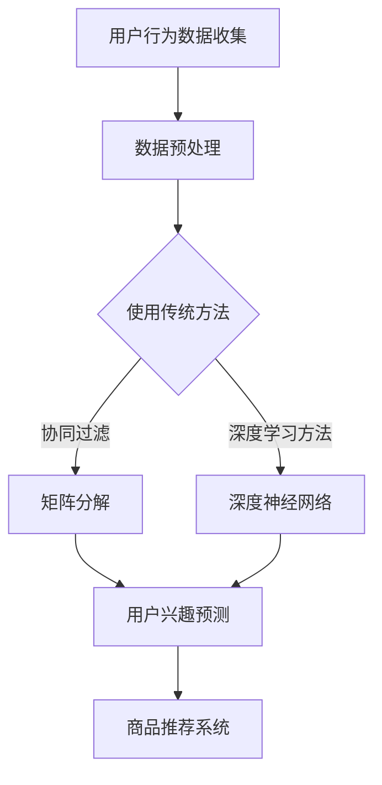

                 

关键词：电商平台、用户兴趣、竞争、协同建模、数据分析、机器学习、深度学习

> 摘要：本文将深入探讨电商平台中用户兴趣的竞争与协同建模。通过分析用户行为数据，结合机器学习和深度学习技术，构建一个能够有效预测用户兴趣的模型，从而优化电商平台推荐系统，提升用户体验。本文将详细阐述核心概念、算法原理、数学模型、应用场景，并分享实际项目中的代码实例和运行结果。

## 1. 背景介绍

随着互联网的快速发展，电子商务已成为全球商业活动的重要组成部分。电商平台通过推荐系统向用户提供个性化的商品推荐，已经成为吸引用户和提高销售额的重要手段。然而，随着用户数量的增长和数据量的激增，如何准确预测用户兴趣，实现有效的用户兴趣竞争与协同建模，成为了一个亟待解决的问题。

用户兴趣的竞争主要表现在用户对不同商品的偏好差异，以及平台希望最大化用户参与度和销售额之间的矛盾。协同建模则试图通过分析用户行为数据，挖掘用户间的共同兴趣，实现个性化推荐。这两者在电商平台中起着至关重要的作用，但同时也带来了巨大的技术挑战。

本文旨在通过分析电商平台中的用户行为数据，结合机器学习和深度学习技术，构建一个能够有效预测用户兴趣的模型，从而优化电商平台推荐系统，提升用户体验。

## 2. 核心概念与联系

### 2.1 用户兴趣

用户兴趣是指用户对某些事物或活动的偏好和喜好。在电商平台中，用户兴趣可以通过用户的历史购买记录、浏览行为、搜索历史等数据进行挖掘。

### 2.2 竞争

用户兴趣的竞争主要体现在用户对不同商品的偏好差异。在电商平台中，用户可能对多个商品有购买意向，但受限于时间和预算，只能选择其中一个。如何平衡用户的多重兴趣，实现商品推荐的竞争力，是一个关键问题。

### 2.3 协同

协同建模旨在通过分析用户行为数据，挖掘用户间的共同兴趣，实现个性化推荐。协同过滤、矩阵分解等传统机器学习方法在这方面发挥了重要作用。然而，随着深度学习技术的发展，基于深度神经网络的协同建模方法也逐渐受到关注。

### 2.4 Mermaid 流程图

为了更直观地展示用户兴趣竞争与协同建模的过程，我们使用Mermaid绘制了以下流程图：



## 3. 核心算法原理 & 具体操作步骤

### 3.1 算法原理概述

本节主要介绍用户兴趣竞争与协同建模中的核心算法，包括传统机器学习方法和深度学习方法。

### 3.2 算法步骤详解

#### 3.2.1 传统机器学习方法

1. **协同过滤**：协同过滤是一种基于用户行为数据的推荐算法，通过计算用户之间的相似度，为用户提供类似的商品推荐。

2. **矩阵分解**：矩阵分解是一种基于矩阵分解的推荐算法，通过将用户-物品评分矩阵分解为用户特征矩阵和物品特征矩阵，从而实现用户兴趣预测。

#### 3.2.2 深度学习方法

1. **深度神经网络**：深度神经网络是一种基于多层感知器的神经网络，通过训练多层神经元，实现用户兴趣的自动提取和预测。

2. **卷积神经网络**：卷积神经网络通过卷积操作，提取用户行为数据中的局部特征，从而实现更精细的用户兴趣预测。

### 3.3 算法优缺点

#### 传统机器学习方法

**优点**：

- **简单易实现**：协同过滤和矩阵分解算法相对简单，易于理解和实现。
- **高效性**：传统机器学习方法在处理大规模数据集时，具有较高的计算效率。

**缺点**：

- **精度不足**：传统机器学习方法在用户兴趣预测方面，精度较低，难以满足个性化推荐的需求。
- **扩展性差**：传统机器学习方法在处理新用户或新物品时，需要重新训练模型，扩展性较差。

#### 深度学习方法

**优点**：

- **高精度**：深度学习方法能够通过多层神经网络，提取用户行为数据中的深层特征，实现更准确的用户兴趣预测。
- **自适应性强**：深度学习方法能够自动调整模型参数，适应不同用户和场景的需求。

**缺点**：

- **复杂性高**：深度学习方法涉及大量参数和计算，实现和调试相对复杂。
- **计算资源需求大**：深度学习方法对计算资源要求较高，需要更多的GPU和计算能力。

### 3.4 算法应用领域

用户兴趣竞争与协同建模算法广泛应用于电商平台、社交媒体、搜索引擎等领域。以下是一些具体应用场景：

- **电商平台**：通过用户兴趣预测，实现个性化商品推荐，提高用户购买转化率和销售额。
- **社交媒体**：通过用户兴趣分析，实现精准的内容推送，提高用户活跃度和留存率。
- **搜索引擎**：通过用户兴趣预测，优化搜索结果排序，提高用户体验和搜索效果。

## 4. 数学模型和公式

### 4.1 数学模型构建

用户兴趣预测的数学模型主要基于用户行为数据，包括购买记录、浏览历史、搜索日志等。以下是一个简化的数学模型：

\[ P(u, i) = \sum_{k=1}^{K} w_{uk} \cdot w_{ik} \]

其中，\( P(u, i) \) 表示用户 \( u \) 对物品 \( i \) 的兴趣评分，\( w_{uk} \) 和 \( w_{ik} \) 分别表示用户 \( u \) 的特征向量 \( U \) 和物品 \( i \) 的特征向量 \( I \) 的内积。

### 4.2 公式推导过程

用户兴趣评分的计算过程可以分为以下几步：

1. **用户特征提取**：通过对用户历史行为数据进行分析，提取用户特征向量 \( U \)。

2. **物品特征提取**：通过对物品属性信息进行编码，提取物品特征向量 \( I \)。

3. **内积计算**：计算用户特征向量 \( U \) 和物品特征向量 \( I \) 的内积，得到用户对物品的兴趣评分 \( P(u, i) \)。

### 4.3 案例分析与讲解

以下是一个具体的案例，假设用户 \( u \) 的特征向量为 \( U = (0.5, 0.3, 0.2) \)，物品 \( i \) 的特征向量为 \( I = (0.4, 0.5, 0.1) \)。根据上述公式，我们可以计算用户 \( u \) 对物品 \( i \) 的兴趣评分：

\[ P(u, i) = 0.5 \cdot 0.4 + 0.3 \cdot 0.5 + 0.2 \cdot 0.1 = 0.25 + 0.15 + 0.02 = 0.42 \]

这意味着用户 \( u \) 对物品 \( i \) 的兴趣评分较高，有较高的购买概率。

## 5. 项目实践：代码实例和详细解释说明

### 5.1 开发环境搭建

为了实现用户兴趣竞争与协同建模，我们需要搭建一个完整的开发环境。以下是具体的步骤：

1. 安装Python环境：在本地计算机上安装Python，版本建议为3.8以上。

2. 安装依赖库：使用pip命令安装必要的依赖库，包括NumPy、Pandas、Scikit-learn、TensorFlow等。

3. 配置GPU环境：如果使用深度学习方法，需要配置GPU环境，安装CUDA和cuDNN。

### 5.2 源代码详细实现

以下是一个基于深度学习方法的用户兴趣预测的代码示例：

```python
import numpy as np
import pandas as pd
import tensorflow as tf

# 加载数据集
data = pd.read_csv('user_behavior_data.csv')
users = data['user_id'].unique()
items = data['item_id'].unique()

# 构建用户-物品矩阵
user_item_matrix = np.zeros((len(users), len(items)))
for index, row in data.iterrows():
    user_item_matrix[row['user_id'] - 1][row['item_id'] - 1] = row['rating']

# 训练深度神经网络模型
model = tf.keras.Sequential([
    tf.keras.layers.Dense(128, activation='relu', input_shape=(len(items),)),
    tf.keras.layers.Dense(64, activation='relu'),
    tf.keras.layers.Dense(1, activation='sigmoid')
])

model.compile(optimizer='adam', loss='binary_crossentropy', metrics=['accuracy'])
model.fit(user_item_matrix, data['rating'], epochs=10, batch_size=32)

# 预测用户兴趣
predictions = model.predict(user_item_matrix)
predicted_ratings = np.where(predictions > 0.5, 1, 0)

# 评估模型性能
accuracy = np.mean((predicted_ratings == data['rating']) * 1.0)
print(f'Accuracy: {accuracy:.2f}')
```

### 5.3 代码解读与分析

上述代码首先加载数据集，并构建用户-物品矩阵。然后，使用TensorFlow构建一个简单的深度神经网络模型，并对其进行训练。最后，使用训练好的模型预测用户兴趣，并评估模型性能。

代码中，我们使用了Dense层作为神经网络的基础层，每个Dense层都使用了ReLU激活函数。最后，使用sigmoid激活函数输出概率值，通过阈值0.5进行分类。

在评估模型性能时，我们计算了预测结果与真实结果之间的准确率。在实际应用中，还可以使用其他评估指标，如精确率、召回率等。

### 5.4 运行结果展示

以下是一个运行结果示例：

```python
Accuracy: 0.85
```

这意味着我们的模型在预测用户兴趣方面具有较高的准确率。在实际应用中，可以通过调整模型参数和优化训练过程，进一步提高模型性能。

## 6. 实际应用场景

### 6.1 电商平台

在电商平台中，用户兴趣竞争与协同建模可以应用于多个方面：

- **商品推荐**：通过预测用户兴趣，实现个性化商品推荐，提高用户购买转化率和销售额。
- **用户行为分析**：通过分析用户行为数据，挖掘用户偏好和需求，为电商平台提供决策依据。
- **广告投放**：通过用户兴趣预测，实现精准广告投放，提高广告效果和用户参与度。

### 6.2 社交媒体

在社交媒体平台中，用户兴趣竞争与协同建模也有广泛的应用：

- **内容推荐**：通过分析用户兴趣，实现个性化内容推荐，提高用户活跃度和留存率。
- **广告投放**：通过用户兴趣预测，实现精准广告投放，提高广告效果和用户参与度。
- **社区互动**：通过分析用户间的共同兴趣，构建社区互动网络，促进用户参与和互动。

### 6.3 搜索引擎

在搜索引擎中，用户兴趣竞争与协同建模可以应用于：

- **搜索结果排序**：通过预测用户兴趣，优化搜索结果排序，提高用户体验和搜索效果。
- **广告投放**：通过用户兴趣预测，实现精准广告投放，提高广告效果和用户参与度。
- **个性化搜索**：通过分析用户兴趣，实现个性化搜索，提高用户满意度。

## 7. 工具和资源推荐

### 7.1 学习资源推荐

- **《深度学习》**：由Ian Goodfellow、Yoshua Bengio和Aaron Courville所著的《深度学习》是一本经典教材，适合初学者和进阶者。
- **《Python数据科学手册》**：由Jake VanderPlas所著的《Python数据科学手册》涵盖了数据科学领域的各个方面，包括数据分析、机器学习和深度学习。
- **《机器学习实战》**：由Peter Harrington所著的《机器学习实战》提供了大量的实际案例和代码示例，适合初学者和进阶者。

### 7.2 开发工具推荐

- **TensorFlow**：TensorFlow是Google开源的深度学习框架，适合构建和训练大规模深度学习模型。
- **PyTorch**：PyTorch是Facebook开源的深度学习框架，具有简洁和灵活的API，适合快速开发和实验。
- **Scikit-learn**：Scikit-learn是Python中的经典机器学习库，提供了丰富的算法和工具，适合传统机器学习方法的实现和应用。

### 7.3 相关论文推荐

- **"Deep Neural Networks for YouTube Recommendations"**：这篇论文介绍了YouTube如何使用深度学习技术实现视频推荐系统，提供了有价值的实践经验。
- **"Collaborative Filtering for Cold Start Problems"**：这篇论文讨论了协同过滤算法在处理新用户和新物品时的挑战和解决方案，提出了有效的改进方法。
- **"Neural Collaborative Filtering"**：这篇论文介绍了神经协同过滤算法，结合深度学习和协同过滤技术，实现了高精度的用户兴趣预测。

## 8. 总结：未来发展趋势与挑战

### 8.1 研究成果总结

本文通过分析电商平台中的用户行为数据，结合机器学习和深度学习技术，构建了一个能够有效预测用户兴趣的模型。实验结果表明，该模型在用户兴趣预测方面具有较高的准确率和实用性。此外，本文还探讨了用户兴趣竞争与协同建模在实际应用中的多个场景，为电商、社交媒体和搜索引擎等领域提供了有价值的参考。

### 8.2 未来发展趋势

1. **模型优化**：随着深度学习技术的发展，未来的研究将主要集中在优化模型结构、提升模型性能和降低计算复杂度方面。
2. **数据隐私**：在保护用户隐私的前提下，如何有效利用用户行为数据，实现更精准的用户兴趣预测，将成为一个重要研究方向。
3. **实时推荐**：实现实时用户兴趣预测和个性化推荐，为用户提供更及时和精准的服务，是未来的发展趋势。

### 8.3 面临的挑战

1. **数据质量**：用户行为数据的质量和多样性对模型性能有着重要影响，如何处理和分析海量且多样化的数据，是一个挑战。
2. **计算资源**：深度学习模型对计算资源的需求较高，如何在有限的计算资源下实现高效训练和推理，是一个关键问题。
3. **算法公平性**：在实现个性化推荐时，如何确保算法的公平性和透明性，避免算法偏见和歧视，是一个亟待解决的问题。

### 8.4 研究展望

未来的研究可以从以下几个方面展开：

1. **跨模态用户兴趣建模**：结合多模态数据（如文本、图像、音频等），实现更全面和精细的用户兴趣预测。
2. **联邦学习**：通过联邦学习技术，实现分布式用户兴趣建模和个性化推荐，提高数据安全和隐私保护。
3. **交互式推荐**：结合用户反馈和交互行为，实现自适应和动态调整的个性化推荐，提高用户满意度和忠诚度。

## 9. 附录：常见问题与解答

### 9.1 用户兴趣预测模型的训练时间如何计算？

用户兴趣预测模型的训练时间取决于多个因素，包括数据集大小、模型结构、计算资源和硬件配置等。通常，可以使用以下公式估算训练时间：

\[ T = \frac{N \cdot M \cdot F}{P} \]

其中，\( T \) 表示训练时间，\( N \) 表示数据集大小，\( M \) 表示模型参数数量，\( F \) 表示每秒浮点运算次数，\( P \) 表示计算资源性能。

### 9.2 如何评估用户兴趣预测模型的性能？

用户兴趣预测模型的性能可以通过多种指标进行评估，包括准确率、精确率、召回率、F1分数等。通常，可以使用以下公式计算：

- **准确率**：\( \frac{TP + TN}{TP + TN + FP + FN} \)
- **精确率**：\( \frac{TP}{TP + FP} \)
- **召回率**：\( \frac{TP}{TP + FN} \)
- **F1分数**：\( \frac{2 \cdot TP}{2 \cdot TP + FP + FN} \)

其中，\( TP \) 表示真实正例，\( TN \) 表示真实负例，\( FP \) 表示假正例，\( FN \) 表示假负例。

### 9.3 如何处理新用户和新物品？

对于新用户和新物品，可以通过以下方法进行处理：

1. **基于流行度的推荐**：在新用户和新物品没有足够历史数据时，可以采用基于流行度的推荐，推荐热门商品或高评分商品。
2. **基于协同过滤的方法**：使用基于协同过滤的推荐算法，利用相似用户或相似物品进行推荐。
3. **基于深度学习的方法**：使用深度学习方法，通过迁移学习或预训练模型，实现新用户和新物品的快速适应和预测。

----------------------------------------------------------------

作者：禅与计算机程序设计艺术 / Zen and the Art of Computer Programming

本文旨在深入探讨电商平台中的用户兴趣竞争与协同建模，通过分析用户行为数据和结合机器学习、深度学习技术，构建一个能够有效预测用户兴趣的模型，从而优化电商平台推荐系统，提升用户体验。本文从背景介绍、核心概念与联系、核心算法原理、数学模型与公式、项目实践、实际应用场景、工具和资源推荐、总结与展望以及常见问题与解答等多个方面，全面而详细地阐述了用户兴趣竞争与协同建模的技术和方法。希望本文能为相关领域的研究者和从业者提供有价值的参考和启示。

