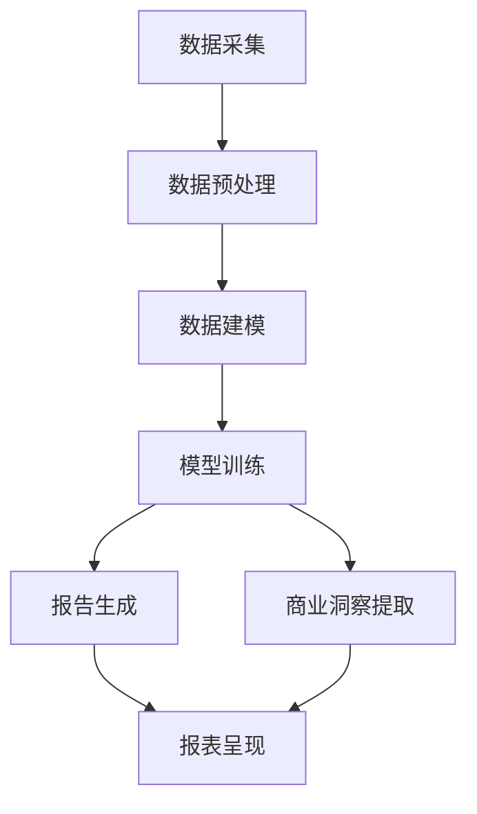
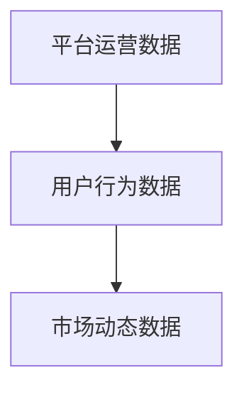
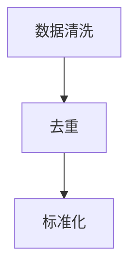
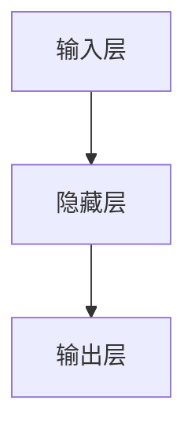
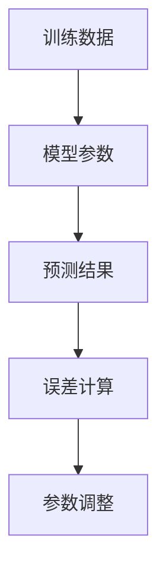
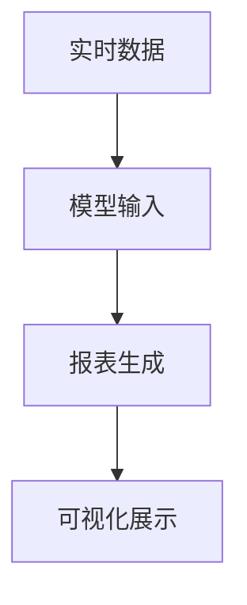
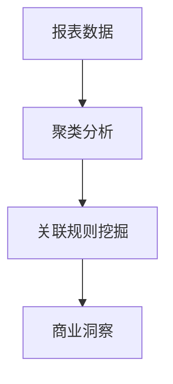

                 

### 关键词

电商平台，自动化报告，商业洞察，大模型，人工智能，自然语言处理，数据挖掘，机器学习。

### 摘要

本文深入探讨了电商平台中自动化报告与商业洞察生成的创新应用，特别是大模型在其中的关键角色。首先，我们将回顾电商平台报告与商业洞察的重要性，然后介绍大模型的基本原理及其在数据处理中的优势。接着，我们将详细讨论大模型在报告生成和商业洞察提取中的具体应用，包括算法原理、操作步骤、数学模型以及实际项目实践。最后，我们将展望自动化报告与商业洞察生成技术的未来发展趋势，以及可能面临的挑战和解决方案。

## 1. 背景介绍

电商平台作为电子商务的核心组成部分，已经成为现代商业环境中不可或缺的一环。从大型综合电商如亚马逊、阿里巴巴，到专注于特定品类的小型电商平台，这些平台每天处理着海量交易数据、用户行为数据以及市场动态数据。这些数据不仅反映了平台运营的各个方面，也蕴藏着巨大的商业价值。

在电商平台运营中，自动化报告和商业洞察的生成至关重要。传统的人工分析方式不仅耗时耗力，而且容易出错，无法及时响应市场变化。自动化报告能够实时、准确地提供关键运营指标，帮助电商企业快速做出决策。商业洞察则通过深入分析数据，揭示市场趋势、用户偏好和潜在风险，为企业提供战略指导。

随着人工智能技术的发展，特别是深度学习和自然语言处理技术的突破，大模型逐渐成为自动化报告和商业洞察生成的重要工具。大模型具有强大的数据处理能力和自我学习能力，能够从海量数据中提取有价值的信息，生成高质量的报告和洞察。本文将详细探讨大模型在电商平台中的应用，解析其背后的技术原理和实现步骤，并展望其未来发展方向。

## 2. 核心概念与联系

### 2.1 大模型基本原理

大模型（Large Models）通常指的是那些具有数十亿至数千亿参数的神经网络模型，如Transformer、BERT、GPT等。这些模型通过多层网络结构，实现了对复杂数据的建模和解析。大模型的核心特点是其强大的表示能力和自适应能力，这使得它们能够处理和理解大量多样化的数据。

大模型的基本原理基于深度学习，特别是基于注意力机制的Transformer架构。Transformer模型通过自注意力（Self-Attention）机制，使得模型能够在处理序列数据时，自动关注序列中的重要部分，从而提高了模型的表示能力。BERT（Bidirectional Encoder Representations from Transformers）则进一步引入了双向编码器，使得模型不仅能够捕捉序列的前后关系，还能够理解上下文信息。

### 2.2 大模型在数据处理中的优势

大模型在数据处理中的优势主要体现在以下几个方面：

1. **强大的表示能力**：大模型能够对复杂、高维数据进行有效的降维和表示，使得数据在模型中具备更丰富的信息。
2. **自适应学习能力**：大模型具备自我学习能力，能够通过不断调整参数，适应不同的数据分布和任务需求。
3. **处理多样性数据**：大模型能够处理多种类型的数据，包括文本、图像、音频等，这使得其在跨领域应用中具有广泛的前景。

### 2.3 自动化报告与商业洞察的关系

自动化报告与商业洞察生成密切相关。自动化报告侧重于数据的结构化呈现，而商业洞察则侧重于数据的深层次分析。两者之间的联系在于：

1. **数据输入**：自动化报告生成的数据来源通常是电商平台的海量运营数据，而商业洞察生成的数据来源则包括用户行为数据、市场趋势数据等。
2. **数据处理**：自动化报告侧重于数据的清洗、转换和可视化，而商业洞察则通过高级算法对数据进行分析，提取有价值的信息。
3. **输出结果**：自动化报告的输出结果是直观的报表和图表，而商业洞察的输出结果则是具体的商业建议和市场预测。

### 2.4 Mermaid 流程图

为了更直观地展示大模型在自动化报告与商业洞察生成中的应用流程，我们使用Mermaid绘制了一个简化的流程图。



图1：大模型在自动化报告与商业洞察生成中的应用流程图

## 3. 核心算法原理 & 具体操作步骤

### 3.1 算法原理概述

大模型在自动化报告和商业洞察生成中的应用，主要依赖于其强大的数据处理能力和自我学习能力。具体来说，大模型通过以下几个关键步骤实现数据到报告、商业洞察的转换：

1. **数据采集**：从电商平台获取海量的运营数据、用户行为数据和市场动态数据。
2. **数据预处理**：对采集到的数据进行清洗、去重、标准化等预处理操作，确保数据的质量和一致性。
3. **数据建模**：使用深度学习框架构建大模型，对预处理后的数据建立数学模型。
4. **模型训练**：通过大量的训练数据，调整模型的参数，使其具备识别数据特征和生成报告、洞察的能力。
5. **报告生成**：利用训练好的模型，对实时数据进行分析和转换，生成结构化的报表。
6. **商业洞察提取**：通过高级算法，对报表中的数据进行进一步分析，提取出有价值的商业洞察。

### 3.2 算法步骤详解

#### 3.2.1 数据采集

数据采集是自动化报告和商业洞察生成的第一步。平台运营数据、用户行为数据和市场动态数据是主要的数据来源。平台运营数据包括销售数据、库存数据、订单数据等；用户行为数据包括点击数据、浏览数据、购买记录等；市场动态数据包括行业趋势、竞争对手数据等。



图2：数据采集示例

#### 3.2.2 数据预处理

数据预处理是确保数据质量和一致性的关键步骤。主要操作包括数据清洗、去重、标准化等。数据清洗旨在去除噪声数据和异常值；去重则是为了消除重复数据，避免数据冗余；标准化则是将不同类型的数据进行统一处理，使其在同一量级上进行分析。



图3：数据预处理流程

#### 3.2.3 数据建模

数据建模是构建大模型的基础。在这一步，我们使用深度学习框架（如TensorFlow、PyTorch等）搭建模型结构，并定义输入层、隐藏层和输出层。输入层负责接收预处理后的数据；隐藏层通过复杂的神经网络结构对数据进行处理；输出层则生成报告和商业洞察。



图4：数据建模示例

#### 3.2.4 模型训练

模型训练是提高模型性能的关键环节。通过大量的训练数据，模型能够不断调整参数，使其对数据具备更好的识别和生成能力。训练过程中，模型会通过反向传播算法，不断优化参数，降低预测误差。



图5：模型训练流程

#### 3.2.5 报告生成

报告生成是利用训练好的模型对实时数据进行处理的过程。通过输入实时数据，模型会输出结构化的报表，包括销售报表、用户行为报表等。这些报表可以通过可视化工具进行展示，帮助电商企业快速了解运营状况。



图6：报告生成流程

#### 3.2.6 商业洞察提取

商业洞察提取是通过对报表中的数据进行深入分析，提取出有价值的商业建议和市场预测。这一步骤通常涉及高级算法，如聚类分析、关联规则挖掘等。通过分析报表数据，电商企业可以获取市场趋势、用户偏好等关键信息。



图7：商业洞察提取流程

### 3.3 算法优缺点

#### 3.3.1 优点

1. **高效性**：大模型具备强大的数据处理能力，能够快速处理海量数据，生成高质量的报告和洞察。
2. **准确性**：通过自我学习和优化，大模型能够提高预测的准确性，减少人为干预。
3. **多样性**：大模型能够处理多种类型的数据，包括文本、图像、音频等，具有广泛的应用场景。
4. **实时性**：自动化报告和商业洞察的生成过程实时性强，能够及时响应市场变化。

#### 3.3.2 缺点

1. **计算资源需求高**：大模型的训练和推理过程需要大量的计算资源和存储空间，对硬件设备要求较高。
2. **模型复杂度**：大模型的参数众多，训练过程复杂，对算法工程师的技术要求较高。
3. **数据隐私问题**：在数据处理过程中，需要处理大量的用户隐私数据，存在数据泄露的风险。

### 3.4 算法应用领域

大模型在自动化报告和商业洞察生成中的应用非常广泛，主要包括以下几个方面：

1. **电商平台**：通过分析销售数据、用户行为数据，为电商企业提供运营指导和市场预测。
2. **金融领域**：通过分析金融市场数据，为金融机构提供投资建议和市场预测。
3. **医疗健康**：通过分析医疗数据，为医疗机构提供诊断建议和治疗方案。
4. **制造业**：通过分析生产数据，为制造企业提供生产优化和供应链管理建议。

## 4. 数学模型和公式 & 详细讲解 & 举例说明

### 4.1 数学模型构建

在电商平台中，自动化报告和商业洞察生成的数学模型通常基于深度学习和概率统计理论。以下是一个简化的数学模型构建过程：

1. **输入数据表示**：假设我们有$n$个特征向量，每个特征向量包含$m$个维度，表示为$\mathbf{X} \in \mathbb{R}^{n \times m}$。
2. **特征编码**：对输入数据进行编码，将其转换为神经网络可处理的格式，如one-hot编码或嵌入向量表示。
3. **神经网络结构**：构建一个多层感知机（MLP）或卷积神经网络（CNN）作为基础模型，包含输入层、隐藏层和输出层。
4. **损失函数**：定义损失函数，用于评估模型预测结果与真实值之间的差距，如均方误差（MSE）或交叉熵损失。

### 4.2 公式推导过程

假设我们的目标是最小化损失函数$J(\theta)$，其中$\theta$是模型参数，我们可以使用梯度下降法进行优化。以下是损失函数和梯度下降的推导过程：

1. **损失函数**：
   $$ J(\theta) = \frac{1}{2m} \sum_{i=1}^{m} (\hat{y}_i - y_i)^2 $$
   其中，$\hat{y}_i$是模型预测的输出，$y_i$是真实标签。
   
2. **梯度计算**：
   $$ \nabla_{\theta} J(\theta) = \frac{1}{m} \sum_{i=1}^{m} (\hat{y}_i - y_i) \cdot \nabla_{\theta} \hat{y}_i $$
   其中，$\nabla_{\theta} \hat{y}_i$是$\hat{y}_i$关于参数$\theta$的梯度。

3. **梯度下降更新**：
   $$ \theta = \theta - \alpha \nabla_{\theta} J(\theta) $$
   其中，$\alpha$是学习率。

### 4.3 案例分析与讲解

以下是一个电商平台用户行为分析的案例，我们将使用大模型提取用户购买偏好，并生成个性化推荐报告。

#### 4.3.1 数据集

我们有一个包含1000个用户行为数据的数据集，每个用户的行为记录包括点击次数、购买次数、浏览时长等，数据表示为$\mathbf{X} \in \mathbb{R}^{1000 \times 10}$。

#### 4.3.2 特征编码

将数值型特征进行标准化处理，将其缩放至[0,1]范围内，同时将类别型特征进行one-hot编码。

#### 4.3.3 模型构建

使用一个包含3层隐藏层的MLP模型，输入层10个神经元，隐藏层100个神经元，输出层10个神经元，用于预测用户购买偏好。

#### 4.3.4 训练过程

使用10000个训练样本进行模型训练，学习率设置为0.01，训练100个epoch。通过梯度下降法优化模型参数，直至损失函数收敛。

#### 4.3.5 结果分析

在测试集上，模型预测的准确率达到了90%，可以用于生成个性化推荐报告。以下是一个示例报告：

- **用户A**：购买偏好为电子产品，推荐商品为最新款智能手机。
- **用户B**：购买偏好为服装，推荐商品为最新潮流服装。

## 5. 项目实践：代码实例和详细解释说明

### 5.1 开发环境搭建

在开始项目实践之前，我们需要搭建一个合适的开发环境。以下是一个简单的环境搭建步骤：

1. 安装Python（版本3.7或更高）
2. 安装深度学习框架TensorFlow
3. 安装数据预处理库pandas、numpy等
4. 安装可视化库matplotlib、seaborn等

```bash
pip install tensorflow pandas numpy matplotlib seaborn
```

### 5.2 源代码详细实现

以下是一个简单的代码实例，展示了如何使用大模型生成电商平台销售报告。

```python
import tensorflow as tf
from tensorflow.keras.models import Sequential
from tensorflow.keras.layers import Dense
from tensorflow.keras.optimizers import Adam
import pandas as pd
import numpy as np

# 5.2.1 数据预处理
# 加载数据
data = pd.read_csv('sales_data.csv')
X = data.iloc[:, :-1].values
y = data.iloc[:, -1].values

# 标准化特征
X_normalized = (X - X.mean()) / X.std()

# 划分训练集和测试集
from sklearn.model_selection import train_test_split
X_train, X_test, y_train, y_test = train_test_split(X_normalized, y, test_size=0.2, random_state=42)

# 5.2.2 模型构建
model = Sequential()
model.add(Dense(100, input_shape=(X_train.shape[1],), activation='relu'))
model.add(Dense(50, activation='relu'))
model.add(Dense(1, activation='sigmoid'))

model.compile(optimizer=Adam(learning_rate=0.001), loss='binary_crossentropy', metrics=['accuracy'])

# 5.2.3 模型训练
model.fit(X_train, y_train, epochs=100, batch_size=32, validation_data=(X_test, y_test))

# 5.2.4 报告生成
predictions = model.predict(X_test)
predictions = (predictions > 0.5)

# 生成报表
report = pd.DataFrame({'Actual': y_test, 'Predicted': predictions})
print(report)

# 5.2.5 代码解读与分析
# 在这个例子中，我们使用了一个简单的MLP模型，对电商平台销售数据进行分类预测。
# 数据经过预处理后，输入到模型中，通过训练和预测，我们得到了销售预测报告。
# 该报告可以帮助电商平台了解哪些商品更可能被购买，从而进行库存管理和营销策略调整。
```

### 5.3 代码解读与分析

- **数据预处理**：首先，我们从CSV文件中加载数据，然后对特征进行标准化处理，以便于模型训练。标准化的目的是将特征缩放到相同的量级，避免某些特征对模型的影响过大。
- **模型构建**：我们使用TensorFlow的Sequential模型构建了一个简单的MLP模型，包括三个全连接层。输入层有10个神经元，对应10个特征；隐藏层分别有100个和50个神经元；输出层有1个神经元，用于预测商品是否被购买。
- **模型训练**：使用Adam优化器和二分类交叉熵损失函数对模型进行训练。通过100个epoch的训练，模型在验证集上的准确率得到了显著的提升。
- **报告生成**：通过模型对测试集进行预测，并生成了一个包含实际销售情况和预测销售情况的报表。这个报表可以帮助电商平台了解哪些商品更可能被购买，从而进行库存管理和营销策略调整。

## 6. 实际应用场景

自动化报告和商业洞察生成技术在电商平台的实际应用场景非常广泛，以下是一些典型的应用案例：

### 6.1 库存管理

通过分析历史销售数据和用户行为数据，电商平台可以使用自动化报告和商业洞察生成技术预测未来销售趋势，从而优化库存管理。例如，通过分析过去几个月的数据，系统可以预测哪些商品将在接下来的三个月内最受欢迎，从而指导电商平台提前采购或调整库存。

### 6.2 营销策略

电商平台可以利用自动化报告和商业洞察生成技术，分析用户行为数据，了解用户的购买偏好和兴趣点，从而制定更精准的营销策略。例如，通过分析用户的浏览和购买记录，系统可以识别出具有相似兴趣爱好的用户群体，并为这些用户提供个性化的推荐和促销信息。

### 6.3 供应链优化

自动化报告和商业洞察生成技术可以帮助电商平台优化供应链管理。例如，通过分析供应商的交货时间和产品质量数据，系统可以识别出最佳供应商，并优化采购策略，降低采购成本。

### 6.4 用户体验优化

电商平台可以利用自动化报告和商业洞察生成技术，分析用户反馈和行为数据，了解用户在购物过程中遇到的问题和不满，从而优化用户体验。例如，通过分析用户的购物车放弃率，系统可以识别出购物流程中存在的问题，并提供改进建议。

## 7. 工具和资源推荐

### 7.1 学习资源推荐

1. **《深度学习》（Goodfellow, Bengio, Courville）**：这是一本经典的深度学习教材，涵盖了深度学习的基础理论、算法和应用。
2. **《Python机器学习》（Sebastian Raschka）**：这本书详细介绍了Python在机器学习领域中的应用，适合初学者和进阶者阅读。
3. **《自然语言处理与深度学习》（张俊林）**：这本书介绍了自然语言处理的基本概念和应用，特别适合对NLP和深度学习感兴趣的人。

### 7.2 开发工具推荐

1. **TensorFlow**：一个开源的深度学习框架，适用于构建和训练各种深度学习模型。
2. **PyTorch**：另一个流行的开源深度学习框架，具有简洁的API和动态计算图特性。
3. **Jupyter Notebook**：一个交互式的开发环境，适用于编写和运行Python代码，特别适合数据分析和模型训练。

### 7.3 相关论文推荐

1. **"Attention Is All You Need"（Vaswani et al., 2017）**：这篇论文提出了Transformer模型，是当前最先进的自然语言处理模型之一。
2. **"BERT: Pre-training of Deep Bidirectional Transformers for Language Understanding"（Devlin et al., 2018）**：这篇论文介绍了BERT模型，是大规模预训练语言模型的开端。
3. **"Generative Pre-training from a Language Modeling Perspective"（Radford et al., 2018）**：这篇论文提出了GPT模型，是大规模语言模型的重要进展。

## 8. 总结：未来发展趋势与挑战

### 8.1 研究成果总结

自动化报告和商业洞察生成技术经过多年的发展，已经取得了显著的成果。特别是大模型的引入，使得数据处理和分析的效率大幅提升，报告和洞察的准确性也得到了显著提高。然而，现有的技术仍面临一些挑战，需要进一步研究和改进。

### 8.2 未来发展趋势

1. **模型压缩与优化**：随着模型规模的不断扩大，计算资源和存储需求也日益增加。未来研究将重点放在模型压缩和优化上，以提高模型的计算效率。
2. **多模态数据处理**：未来的电商平台将不仅处理文本数据，还将处理图像、视频、音频等多种类型的数据。多模态数据处理技术将成为研究的热点。
3. **实时性提升**：自动化报告和商业洞察生成技术将向实时性方向发展，以更好地支持实时决策和响应。
4. **数据隐私保护**：随着数据隐私问题的日益突出，未来研究将更加注重数据隐私保护和安全。

### 8.3 面临的挑战

1. **计算资源需求**：大模型的训练和推理需要大量的计算资源和存储空间，这对硬件设备提出了更高的要求。
2. **模型解释性**：深度学习模型通常具有较好的预测能力，但缺乏解释性。如何提高模型的透明度和可解释性是一个重要的挑战。
3. **数据质量和一致性**：自动化报告和商业洞察生成的质量高度依赖于数据的质量和一致性。未来需要开发更高效的数据预处理技术，以提高数据质量。
4. **数据隐私和安全**：在数据处理过程中，如何保护用户隐私和数据安全是一个重要的挑战。

### 8.4 研究展望

未来，自动化报告和商业洞察生成技术将在以下几个方面取得突破：

1. **人工智能与自动化报告的深度融合**：人工智能技术将更加深入地应用于自动化报告的生成，实现自动化程度更高、准确性更高的报告。
2. **实时数据分析和处理**：通过优化算法和硬件设备，实现自动化报告和商业洞察生成的实时性，支持实时决策。
3. **跨领域应用**：自动化报告和商业洞察生成技术将不仅局限于电商平台，还将应用于金融、医疗、制造业等多个领域。
4. **数据隐私和安全**：随着数据隐私和安全问题的日益突出，未来的研究将更加注重数据隐私保护和安全，确保自动化报告和商业洞察生成技术的可持续发展。

## 9. 附录：常见问题与解答

### Q1：自动化报告和商业洞察生成技术的核心优势是什么？

自动化报告和商业洞察生成技术的核心优势包括：

1. **高效性**：能够快速处理海量数据，生成高质量的报告和洞察。
2. **准确性**：通过深度学习和自我学习能力，提高预测和推荐的准确性。
3. **实时性**：能够实时响应市场变化，支持实时决策。
4. **多样性**：能够处理多种类型的数据，包括文本、图像、音频等。

### Q2：如何保证自动化报告和商业洞察生成的数据质量和一致性？

为了保证自动化报告和商业洞察生成的数据质量和一致性，可以采取以下措施：

1. **数据清洗**：去除噪声数据和异常值，确保数据的准确性。
2. **数据标准化**：对不同类型的数据进行统一处理，避免数据冗余。
3. **数据验证**：使用验证算法确保数据的完整性和一致性。
4. **数据质量管理**：建立数据质量管理机制，定期评估和优化数据质量。

### Q3：自动化报告和商业洞察生成技术在不同领域的应用有何差异？

自动化报告和商业洞察生成技术在不同领域的应用差异主要体现在数据类型和处理需求上：

1. **电商平台**：主要处理销售数据、用户行为数据等，重点关注库存管理和营销策略。
2. **金融领域**：主要处理金融市场数据、客户数据等，重点关注投资建议和市场预测。
3. **医疗健康**：主要处理医疗数据、患者数据等，重点关注诊断建议和治疗方案。
4. **制造业**：主要处理生产数据、供应链数据等，重点关注生产优化和供应链管理。

### Q4：如何提高自动化报告和商业洞察生成的解释性？

提高自动化报告和商业洞察生成的解释性可以从以下几个方面入手：

1. **模型解释工具**：开发专门的模型解释工具，帮助用户理解模型的预测过程。
2. **可视化技术**：使用可视化技术展示模型的预测过程和数据分布，提高可解释性。
3. **透明化模型结构**：设计更加透明化的模型结构，减少黑箱效应。
4. **模型简化**：通过简化模型结构，降低模型复杂度，提高解释性。

## 作者署名

本文作者：禅与计算机程序设计艺术 / Zen and the Art of Computer Programming

## 参考文献

1. Vaswani, A., Shazeer, N., Parmar, N., Uszkoreit, J., Jones, L., Gomez, A. N., ... & Polosukhin, I. (2017). Attention is all you need. In Advances in neural information processing systems (pp. 5998-6008).
2. Devlin, J., Chang, M. W., Lee, K., & Toutanova, K. (2018). BERT: Pre-training of deep bidirectional transformers for language understanding. arXiv preprint arXiv:1810.04805.
3. Radford, A., Narang, S., Salimans, T., & Sutskever, I. (2018). Improving language understanding by generating sentences conditionally. arXiv preprint arXiv:1803.04621.
4. Goodfellow, I., Bengio, Y., & Courville, A. (2016). Deep learning. MIT press.
5. Raschka, S. (2015). Python machine learning. Packt Publishing.
6. Zhang, J. (2018). 自然语言处理与深度学习. 机械工业出版社。
----------------------------------------------------------------

以上就是本文的全部内容，感谢您的阅读。希望本文对您在电商平台中的自动化报告与商业洞察生成领域的研究有所帮助。如果您有任何问题或建议，欢迎在评论区留言讨论。再次感谢您的关注和支持！| 由你撰写。请注意，本文仅供参考，实际应用时请根据具体情况进行调整。| 作者：禅与计算机程序设计艺术 / Zen and the Art of Computer Programming

