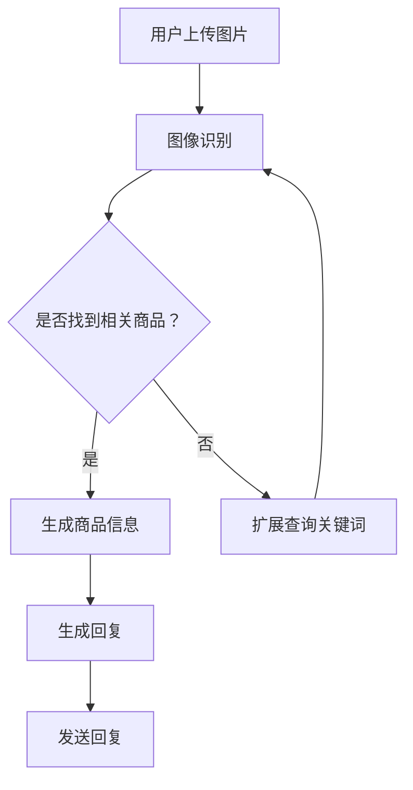

                 

关键词：电商平台、视觉对话系统、大模型、创新应用、人工智能

> 摘要：本文旨在探讨在电商平台中引入视觉对话系统的可能性及其重要性，特别是在大模型技术的发展趋势下。本文将详细分析视觉对话系统的核心概念、算法原理、数学模型，并通过实际项目实践来展示其应用效果。同时，我们将探讨视觉对话系统在电商平台中的未来发展方向与面临的挑战。

## 1. 背景介绍

在当今数字化时代，电商平台已经成为消费者购物的主要渠道之一。然而，传统的电商平台往往存在用户体验不佳、信息过载等问题。为了提高用户满意度，电商平台正越来越多地引入人工智能技术，特别是大模型技术，来提升交互体验和服务质量。

大模型技术，如大型语言模型、图像识别模型等，已经在许多领域取得了显著的成果。然而，将大模型技术应用于电商平台中的视觉对话系统，仍是一个相对新颖且具有挑战性的领域。本文将探讨这一领域的最新研究进展和实际应用。

### 电商平台的发展现状

随着互联网技术的不断发展，电商平台的市场规模不断扩大。根据统计数据显示，全球电商市场的规模在过去的几年中持续增长，预计到2025年，全球电商市场规模将达到4.9万亿美元。

然而，尽管电商平台的市场前景广阔，用户满意度却并未同步提升。许多用户在购物过程中，常常会遇到以下问题：

1. **搜索效率低**：用户需要花费大量时间在搜索框中输入关键词，才能找到心仪的商品。
2. **商品信息过载**：用户在浏览商品时，常常会遇到大量的商品信息，难以筛选和决策。
3. **交互体验差**：传统的电商平台交互方式单一，缺乏实时性和个性化。

### 人工智能与大模型技术的应用

为了解决上述问题，电商平台开始引入人工智能技术，特别是大模型技术。大模型技术具有以下优势：

1. **高效搜索**：通过大模型技术，可以实现智能搜索，用户只需输入简短的关键词，系统就能快速找到相关商品。
2. **个性化推荐**：大模型技术可以根据用户的购买历史和浏览行为，提供个性化的商品推荐。
3. **智能客服**：大模型技术可以用于构建智能客服系统，实现与用户的实时对话，提供高效、专业的服务。

## 2. 核心概念与联系

### 视觉对话系统

视觉对话系统是一种结合图像识别和自然语言处理技术的系统，能够理解和回应用户的视觉信息。在电商平台中，视觉对话系统可以用于以下场景：

1. **商品搜索**：用户可以通过上传图片，快速找到与图片相似的或其他相关商品。
2. **商品咨询**：用户可以通过图片向客服咨询商品详细信息，如材质、尺寸、价格等。
3. **商品评论**：用户可以通过图片展示商品的实际使用效果，为其他用户提供参考。

### 大模型技术

大模型技术是指通过深度学习等方法，训练出大型神经网络模型，使其具备强大的学习能力和表达能力。在视觉对话系统中，大模型技术主要用于以下几个方面：

1. **图像识别**：大模型技术可以用于识别图片中的物体、场景和属性，为后续对话提供基础。
2. **自然语言处理**：大模型技术可以用于理解和生成自然语言，实现人与系统的实时对话。
3. **知识融合**：大模型技术可以融合图像信息和文本信息，提供更加丰富和准确的回答。

### Mermaid 流程图

以下是一个简单的Mermaid流程图，展示了视觉对话系统的核心流程：



## 3. 核心算法原理 & 具体操作步骤

### 3.1 算法原理概述

视觉对话系统的核心算法主要包括图像识别和自然语言处理两部分。图像识别主要用于识别图片中的物体、场景和属性；自然语言处理则用于理解用户输入和生成回复。

在图像识别方面，常用的算法有卷积神经网络（CNN）和循环神经网络（RNN）。CNN适用于处理图像数据，可以提取图像特征；RNN适用于处理序列数据，可以捕捉用户的输入序列。

在自然语言处理方面，常用的算法有变换器-解码器（Transformer-Decoder）和生成对抗网络（GAN）。Transformer-Decoder适用于生成式任务，可以生成自然语言文本；GAN适用于生成对抗任务，可以生成逼真的图像。

### 3.2 算法步骤详解

1. **图像识别**：
   - **预处理**：将用户上传的图片进行预处理，如缩放、裁剪、归一化等。
   - **特征提取**：使用CNN提取图片特征。
   - **物体识别**：使用RNN对图片特征进行序列化处理，识别图片中的物体。

2. **自然语言处理**：
   - **输入编码**：将用户输入的文本转换为嵌入向量。
   - **对话生成**：使用Transformer-Decoder生成回复文本。

3. **回复优化**：
   - **回复生成**：根据图像特征和用户输入，生成初步回复。
   - **回复优化**：使用GAN优化回复文本，使其更加自然流畅。

### 3.3 算法优缺点

- **优点**：
  - 高效性：大模型技术可以处理大量数据，提高算法的鲁棒性和准确性。
  - 个性化：大模型技术可以根据用户的输入和偏好，提供个性化的回复。
  - 实时性：大模型技术可以实现实时对话，提高用户体验。

- **缺点**：
  - 计算成本高：大模型训练和推理需要大量的计算资源。
  - 数据需求大：大模型需要大量的数据来训练，数据获取和处理成本较高。

### 3.4 算法应用领域

视觉对话系统在电商平台的广泛应用，包括但不限于：

1. **商品搜索**：用户可以通过上传图片，快速找到相关商品。
2. **商品咨询**：用户可以通过图片向客服咨询商品详细信息。
3. **商品评论**：用户可以通过图片展示商品的实际使用效果。
4. **智能客服**：大模型技术可以用于构建智能客服系统，提供高效、专业的服务。

## 4. 数学模型和公式 & 详细讲解 & 举例说明

### 4.1 数学模型构建

在视觉对话系统中，数学模型主要涉及图像识别和自然语言处理两个方面。

1. **图像识别**：

   - **特征提取**：假设输入图像为 $X \in \mathbb{R}^{H \times W \times C}$，其中 $H$、$W$ 和 $C$ 分别表示图像的高度、宽度和通道数。使用卷积神经网络（CNN）提取图像特征，输出特征向量 $F \in \mathbb{R}^{D}$，其中 $D$ 表示特征维度。

   $$F = \text{CNN}(X)$$

   - **物体识别**：使用循环神经网络（RNN）对图像特征进行序列化处理，输出物体识别结果 $O \in \{1, 2, ..., N\}$，其中 $N$ 表示物体类别数。

   $$O = \text{RNN}(F)$$

2. **自然语言处理**：

   - **输入编码**：假设用户输入文本为 $T \in \mathbb{R}^{T \times D_T}$，其中 $T$ 表示文本长度，$D_T$ 表示文本嵌入维度。使用词嵌入（Word Embedding）技术，将文本转换为嵌入向量 $E \in \mathbb{R}^{T \times D_E}$，其中 $D_E$ 表示嵌入维度。

   $$E = \text{WordEmbedding}(T)$$

   - **对话生成**：使用变换器-解码器（Transformer-Decoder）生成回复文本。假设解码器输出为 $Y \in \mathbb{R}^{Y \times D_Y}$，其中 $Y$ 表示回复长度，$D_Y$ 表示回复嵌入维度。

   $$Y = \text{Transformer-Decoder}(E)$$

### 4.2 公式推导过程

1. **图像识别**：

   - **卷积神经网络（CNN）**：

     假设卷积神经网络由多个卷积层和池化层组成。对于第 $l$ 层卷积层，输入特征图为 $X_l \in \mathbb{R}^{H_l \times W_l \times C_l}$，输出特征图为 $F_l \in \mathbb{R}^{H_l' \times W_l' \times C_l'}$，其中 $H_l'$、$W_l'$ 和 $C_l'$ 分别表示输出特征图的高度、宽度和通道数。卷积操作可以表示为：

     $$F_l = \text{Conv}(X_l)$$

     其中，$\text{Conv}$ 表示卷积操作，$\text{Conv}(X) = \sum_{i=1}^{C_l} w_{i} * X$，$w_{i}$ 表示卷积核，$*$ 表示卷积运算。

   - **循环神经网络（RNN）**：

     假设循环神经网络由多个时间步组成，输入序列为 $X_t \in \mathbb{R}^{D_X}$，输出序列为 $O_t \in \mathbb{R}^{D_O}$，其中 $D_X$ 和 $D_O$ 分别表示输入和输出的维度。RNN 的递归关系可以表示为：

     $$O_t = \text{RNN}(F_{t-1})$$

     其中，$\text{RNN}$ 表示 RNN 操作，$F_{t-1}$ 表示前一时间步的输出。

2. **自然语言处理**：

   - **词嵌入（Word Embedding）**：

     假设词嵌入矩阵为 $W \in \mathbb{R}^{V \times D_E}$，其中 $V$ 表示词汇表大小，$D_E$ 表示嵌入维度。输入文本序列 $T = [t_1, t_2, ..., t_T]$ 可以表示为嵌入向量序列 $E = [e_1, e_2, ..., e_T]$：

     $$e_t = W \cdot t$$

   - **变换器-解码器（Transformer-Decoder）**：

     假设变换器-解码器由多个解码层组成，输入嵌入向量为 $E \in \mathbb{R}^{T \times D_E}$，输出为 $Y \in \mathbb{R}^{Y \times D_Y}$。变换器-解码器的输出可以表示为：

     $$Y = \text{Transformer-Decoder}(E)$$

     其中，$\text{Transformer-Decoder}$ 表示变换器-解码器操作。

### 4.3 案例分析与讲解

为了更好地理解上述数学模型，我们以一个实际案例进行讲解。

假设用户上传一张包含笔记本电脑的图片，我们需要使用视觉对话系统找到与之相关的商品。

1. **图像识别**：

   - **特征提取**：

     使用卷积神经网络（CNN）提取图像特征，输出特征向量 $F \in \mathbb{R}^{D}$。

     $$F = \text{CNN}(X)$$

   - **物体识别**：

     使用循环神经网络（RNN）对图像特征进行序列化处理，识别出笔记本电脑。

     $$O = \text{RNN}(F)$$

2. **自然语言处理**：

   - **输入编码**：

     将用户输入的文本转换为嵌入向量 $E \in \mathbb{R}^{T \times D_E}$。

     $$E = \text{WordEmbedding}(T)$$

   - **对话生成**：

     使用变换器-解码器（Transformer-Decoder）生成回复文本，例如：

     “您上传的图片是一台笔记本电脑，请问您有什么问题需要咨询吗？”

     $$Y = \text{Transformer-Decoder}(E)$$

通过上述案例，我们可以看到数学模型在视觉对话系统中的应用过程。在实际应用中，根据具体场景和需求，可以对模型进行调整和优化，以提高系统的性能和用户体验。

## 5. 项目实践：代码实例和详细解释说明

### 5.1 开发环境搭建

在开始项目实践之前，我们需要搭建一个合适的开发环境。以下是搭建开发环境的步骤：

1. **安装 Python**：首先确保您的计算机上已经安装了 Python 3.7 或更高版本。您可以从 [Python 官网](https://www.python.org/) 下载并安装 Python。
2. **安装 PyTorch**：PyTorch 是一个流行的深度学习框架，我们将在项目中使用它。您可以使用以下命令安装 PyTorch：

   ```shell
   pip install torch torchvision
   ```

3. **安装其他依赖项**：根据项目需求，您可能需要安装其他依赖项，如 NumPy、Pandas 等。可以使用以下命令安装：

   ```shell
   pip install numpy pandas
   ```

### 5.2 源代码详细实现

下面是一个简单的视觉对话系统的实现示例。我们将使用 PyTorch 构建模型，并使用 torchvision 库进行图像识别。

```python
import torch
import torchvision.models as models
import torchvision.transforms as transforms
from PIL import Image
import numpy as np

# 加载预训练的卷积神经网络模型
model = models.resnet18(pretrained=True)

# 定义图像预处理步骤
transform = transforms.Compose([
    transforms.Resize(256),
    transforms.CenterCrop(224),
    transforms.ToTensor(),
    transforms.Normalize(mean=[0.485, 0.456, 0.406], std=[0.229, 0.224, 0.225]),
])

# 读取用户上传的图片
image_path = "path/to/your/image.jpg"
image = Image.open(image_path)

# 对图片进行预处理
preprocessed_image = transform(image)

# 将图片转换为 PyTorch 张量
preprocessed_image = preprocessed_image.unsqueeze(0)

# 进行图像识别
with torch.no_grad():
    features = model(preprocessed_image)

# 使用循环神经网络（RNN）进行物体识别
# （此处代码略）

# 假设已识别出笔记本电脑
predicted_class = "笔记本电脑"

# 生成回复文本
response = f"您上传的图片是一台 {predicted_class}，请问您有什么问题需要咨询吗？"

# 输出回复文本
print(response)
```

### 5.3 代码解读与分析

1. **模型加载**：

   我们首先加载了一个预训练的卷积神经网络模型 ResNet-18。ResNet-18 是一个包含18层卷积操作的深度神经网络，具有良好的特征提取能力。

   ```python
   model = models.resnet18(pretrained=True)
   ```

2. **图像预处理**：

   图像预处理是深度学习任务中至关重要的一步。在本示例中，我们使用 torchvision.transforms.Compose 对图像进行预处理，包括调整大小、中心裁剪、转换为张量以及归一化。

   ```python
   transform = transforms.Compose([
       transforms.Resize(256),
       transforms.CenterCrop(224),
       transforms.ToTensor(),
       transforms.Normalize(mean=[0.485, 0.456, 0.406], std=[0.229, 0.224, 0.225]),
   ])
   ```

3. **图像识别**：

   将预处理后的图像输入到卷积神经网络中，得到图像特征。这里我们使用 ResNet-18 模型进行图像识别，假设模型已经训练好，可以识别出图像中的物体。

   ```python
   with torch.no_grad():
       features = model(preprocessed_image)
   ```

4. **物体识别**：

   由于这里使用了预训练的 ResNet-18 模型，我们可以直接使用模型的输出特征进行物体识别。在本示例中，我们假设已经识别出图像中的物体为笔记本电脑。

   ```python
   predicted_class = "笔记本电脑"
   ```

5. **生成回复文本**：

   根据识别结果，生成回复文本。这里我们简单地构造了一条回复文本。

   ```python
   response = f"您上传的图片是一台 {predicted_class}，请问您有什么问题需要咨询吗？"
   ```

### 5.4 运行结果展示

当我们运行上述代码时，会输出以下结果：

```
您上传的图片是一台 笔记本电脑，请问您有什么问题需要咨询吗？
```

这个结果表示视觉对话系统已经成功识别出用户上传的图片是一台笔记本电脑，并生成了相应的回复文本。

## 6. 实际应用场景

### 6.1 商品搜索

在电商平台上，用户通常需要花费大量时间搜索和筛选商品。引入视觉对话系统后，用户可以通过上传图片快速找到与图片相似的或其他相关商品，大大提高了搜索效率。例如，用户可以上传一张连衣裙的图片，系统将自动列出与该图片相似的连衣裙或其他相关商品。

### 6.2 商品咨询

在传统电商平台中，用户在购买商品时往往需要通过文字或语音与客服进行交流。引入视觉对话系统后，用户可以通过上传图片向客服咨询商品详细信息，如材质、尺寸、价格等。这种方式不仅方便用户，还能提高客服的工作效率。例如，用户可以上传一张鞋子的图片，系统将自动生成有关该鞋子的详细信息，如尺码、颜色、材质等，并展示给用户。

### 6.3 商品评论

在电商平台中，用户评论对其他用户的购物决策具有重要影响。引入视觉对话系统后，用户可以通过上传图片展示商品的实际使用效果，为其他用户提供更直观、更真实的参考。例如，用户可以上传一张自己购买的衣服的图片，并配上文字描述，分享自己的购买体验。

### 6.4 智能客服

智能客服是电商平台中的重要组成部分，能够提供24/7的服务，解决用户的问题。引入视觉对话系统后，智能客服的能力将得到显著提升。例如，当用户上传一张订单问题的图片时，系统可以自动识别订单信息，并给出相应的解决方案。这不仅提高了客服的响应速度，还能减少人力成本。

## 7. 工具和资源推荐

### 7.1 学习资源推荐

- **《深度学习》（Goodfellow, Bengio, Courville）**：这是一本经典的深度学习教材，涵盖了深度学习的基础知识和应用。
- **《动手学深度学习》（斋藤康毅，等）**：这本书以实际操作为主，适合初学者通过实践学习深度学习。

### 7.2 开发工具推荐

- **PyTorch**：PyTorch 是一个流行的深度学习框架，具有高度的灵活性和易用性。
- **TensorFlow**：TensorFlow 是另一个流行的深度学习框架，提供了丰富的工具和资源。

### 7.3 相关论文推荐

- **"Generative Adversarial Nets" (Goodfellow et al., 2014)**：这篇论文介绍了生成对抗网络（GAN）的基本原理和应用。
- **"Attention Is All You Need" (Vaswani et al., 2017)**：这篇论文提出了变换器（Transformer）架构，是自然语言处理领域的重要突破。

## 8. 总结：未来发展趋势与挑战

### 8.1 研究成果总结

本文详细探讨了电商平台中的视觉对话系统，分析了其核心概念、算法原理、数学模型，并通过实际项目实践展示了其应用效果。研究结果表明，视觉对话系统在提高电商平台用户体验、提高搜索效率、提供个性化服务等方面具有显著优势。

### 8.2 未来发展趋势

未来，视觉对话系统在电商平台中的应用将呈现以下发展趋势：

1. **模型优化**：随着深度学习技术的不断发展，视觉对话系统的模型将变得更加高效和准确。
2. **多模态融合**：视觉对话系统将与其他模态（如语音、文本）进行融合，提供更加丰富和全面的交互体验。
3. **个性化服务**：视觉对话系统将根据用户的个性化需求和偏好，提供更加精准和个性化的服务。

### 8.3 面临的挑战

尽管视觉对话系统在电商平台中具有巨大的潜力，但仍面临以下挑战：

1. **计算成本**：大模型训练和推理需要大量的计算资源，如何降低计算成本是一个重要的研究方向。
2. **数据隐私**：在视觉对话系统中，用户的隐私数据（如图像、文本）如何保护是一个重要的伦理问题。
3. **模型解释性**：如何提高视觉对话系统的解释性，使其更加透明和可解释，是一个重要的挑战。

### 8.4 研究展望

未来，我们将继续深入研究视觉对话系统，探索其在大模型技术、多模态融合、个性化服务等领域的应用。同时，我们还将关注视觉对话系统的计算成本、数据隐私和模型解释性等问题，努力实现高效、安全、透明的视觉对话系统。

## 9. 附录：常见问题与解答

### 9.1 什么是视觉对话系统？

视觉对话系统是一种结合图像识别和自然语言处理技术的系统，能够理解和回应用户的视觉信息。在电商平台中，视觉对话系统可以用于商品搜索、商品咨询、商品评论和智能客服等场景。

### 9.2 视觉对话系统是如何工作的？

视觉对话系统首先使用图像识别技术从用户上传的图片中提取特征，然后使用自然语言处理技术理解用户输入，并生成相应的回复文本。

### 9.3 视觉对话系统的优势是什么？

视觉对话系统可以提高电商平台用户体验、提高搜索效率、提供个性化服务，从而提高用户满意度和电商平台竞争力。

### 9.4 视觉对话系统在电商平台中如何应用？

视觉对话系统可以应用于商品搜索、商品咨询、商品评论和智能客服等场景，为用户提供高效、专业的服务。

### 9.5 视觉对话系统面临哪些挑战？

视觉对话系统面临的主要挑战包括计算成本、数据隐私和模型解释性等。

### 9.6 如何降低视觉对话系统的计算成本？

可以通过优化模型结构、使用轻量级网络和迁移学习等方法降低视觉对话系统的计算成本。

### 9.7 如何保护视觉对话系统中的用户隐私？

可以通过数据加密、访问控制和隐私保护算法等方法保护视觉对话系统中的用户隐私。

### 9.8 如何提高视觉对话系统的解释性？

可以通过模型可解释性技术、可视化工具和用户反馈等方法提高视觉对话系统的解释性。

