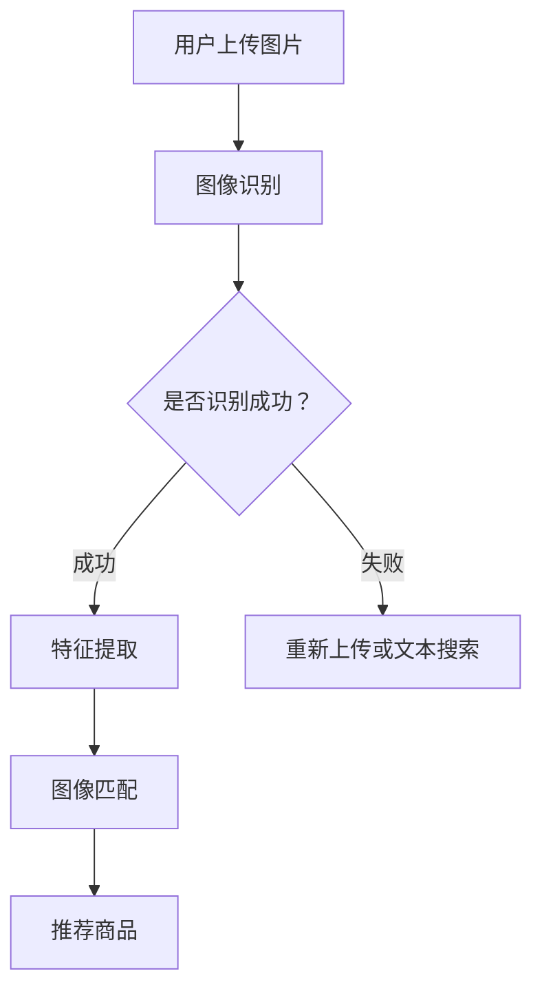

                 

关键词：电商平台、视觉搜索、AI大模型、图像理解、技术博客、专业分析

> 摘要：本文将深入探讨电商平台中视觉搜索技术的应用及其背后的AI大模型原理。我们将分析视觉搜索在电商领域的价值，探讨当前主流的图像理解技术，以及如何在电商平台上构建高效、准确的视觉搜索系统。

## 1. 背景介绍

电商平台作为数字经济的重要组成部分，正面临着激烈的竞争。消费者需求的多样化和对购物体验的不断提升，使得电商平台不得不寻找新的解决方案来提高用户满意度。视觉搜索作为一种新兴的搜索技术，通过让用户上传或选择一张图片，系统可以识别并推荐相关的商品，极大地提升了用户的购物体验。

传统的文本搜索虽然能够满足用户的基本需求，但在图像和视觉信息丰富的情况下，往往无法提供准确的搜索结果。视觉搜索则能够充分利用图像信息，识别出图片中的关键特征，从而实现更加精准的搜索。

## 2. 核心概念与联系

在探讨电商平台中的视觉搜索时，我们首先需要理解几个核心概念：图像识别、特征提取和图像匹配。

### 图像识别

图像识别是视觉搜索的基础，它旨在从大量图像中找出特定图像或图像中的特定对象。在电商平台上，图像识别技术可以帮助用户快速定位到目标商品。

### 特征提取

特征提取是将图像中的视觉信息转换为机器可以处理的数据。通过提取图像的颜色、纹理、形状等特征，算法能够更好地理解和比较不同图像。

### 图像匹配

图像匹配是将用户上传的图像与数据库中的图像进行比较，找出相似度最高的结果。这通常通过计算图像之间的相似性得分来实现。

以下是使用Mermaid绘制的视觉搜索系统核心概念流程图：



## 3. 核心算法原理 & 具体操作步骤

### 3.1 算法原理概述

电商平台中的视觉搜索主要依赖于深度学习技术，尤其是卷积神经网络（CNN）。CNN能够自动从图像中学习特征，并利用这些特征进行匹配和识别。

### 3.2 算法步骤详解

1. **图像识别**：首先，系统接收用户上传的图片，利用预训练的CNN模型进行图像识别，确定图片中包含的商品类别。

2. **特征提取**：识别出商品类别后，系统进一步提取图像的特征向量。这些特征向量包含了商品的颜色、纹理和形状等信息。

3. **图像匹配**：将提取到的特征向量与电商平台数据库中的商品图像进行匹配。通常使用余弦相似度或欧氏距离等度量方法来计算特征向量之间的相似度。

4. **推荐商品**：根据匹配得分，系统向用户推荐相似度最高的商品。

### 3.3 算法优缺点

**优点**：

- **准确性高**：深度学习技术能够自动学习图像特征，提高识别和匹配的准确性。
- **用户体验好**：视觉搜索能够直观地满足用户需求，提升购物体验。
- **适用范围广**：除了商品识别，视觉搜索还可以应用于品牌识别、商品溯源等多个场景。

**缺点**：

- **计算资源需求大**：深度学习模型通常需要大量的计算资源。
- **训练时间较长**：模型的训练过程可能需要很长时间，特别是在数据量较大的情况下。
- **数据隐私问题**：用户上传的图片可能涉及隐私信息，如何保护用户隐私是一个需要考虑的问题。

### 3.4 算法应用领域

视觉搜索在电商领域的应用已经相当广泛，主要包括：

- **商品搜索**：用户可以通过上传图片查找相似商品。
- **品牌识别**：用户可以通过上传商品包装或标志找到特定品牌。
- **商品推荐**：根据用户的购买历史和搜索行为，系统可以推荐可能感兴趣的商品。

## 4. 数学模型和公式 & 详细讲解 & 举例说明

### 4.1 数学模型构建

在视觉搜索中，我们通常会使用特征向量表示图像。假设有两个特征向量 \( \mathbf{f_1} \) 和 \( \mathbf{f_2} \)，我们使用余弦相似度来计算它们之间的相似度，公式如下：

\[ \text{similarity}(\mathbf{f_1}, \mathbf{f_2}) = \frac{\mathbf{f_1} \cdot \mathbf{f_2}}{\|\mathbf{f_1}\| \|\mathbf{f_2}\|} \]

其中，\( \mathbf{f_1} \cdot \mathbf{f_2} \) 表示两个向量的点积，\( \|\mathbf{f_1}\| \) 和 \( \|\mathbf{f_2}\| \) 分别表示两个向量的模长。

### 4.2 公式推导过程

假设 \( \mathbf{f_1} \) 和 \( \mathbf{f_2} \) 是两个 \( n \) 维特征向量，我们可以将余弦相似度的计算过程分解为以下步骤：

\[ \mathbf{f_1} \cdot \mathbf{f_2} = \sum_{i=1}^{n} f_{1i} f_{2i} \]

\[ \|\mathbf{f_1}\| = \sqrt{\sum_{i=1}^{n} f_{1i}^2} \]

\[ \|\mathbf{f_2}\| = \sqrt{\sum_{i=1}^{n} f_{2i}^2} \]

将上述表达式代入余弦相似度公式，我们得到：

\[ \text{similarity}(\mathbf{f_1}, \mathbf{f_2}) = \frac{\sum_{i=1}^{n} f_{1i} f_{2i}}{\sqrt{\sum_{i=1}^{n} f_{1i}^2} \sqrt{\sum_{i=1}^{n} f_{2i}^2}} \]

### 4.3 案例分析与讲解

假设我们有两个特征向量：

\[ \mathbf{f_1} = \begin{bmatrix} 0.1 \\ 0.2 \\ 0.3 \end{bmatrix}, \quad \mathbf{f_2} = \begin{bmatrix} 0.3 \\ 0.2 \\ 0.1 \end{bmatrix} \]

计算它们的余弦相似度：

\[ \mathbf{f_1} \cdot \mathbf{f_2} = 0.1 \times 0.3 + 0.2 \times 0.2 + 0.3 \times 0.1 = 0.07 \]

\[ \|\mathbf{f_1}\| = \sqrt{0.1^2 + 0.2^2 + 0.3^2} = \sqrt{0.14} \]

\[ \|\mathbf{f_2}\| = \sqrt{0.3^2 + 0.2^2 + 0.1^2} = \sqrt{0.14} \]

\[ \text{similarity}(\mathbf{f_1}, \mathbf{f_2}) = \frac{0.07}{\sqrt{0.14} \times \sqrt{0.14}} \approx 0.94 \]

这意味着 \( \mathbf{f_1} \) 和 \( \mathbf{f_2} \) 非常相似。

## 5. 项目实践：代码实例和详细解释说明

### 5.1 开发环境搭建

为了实现视觉搜索系统，我们需要搭建一个开发环境。以下是所需的工具和步骤：

- **Python**：版本3.8及以上
- **TensorFlow**：版本2.5及以上
- **OpenCV**：版本4.5及以上
- **Pandas**：版本1.2及以上

安装这些工具后，我们就可以开始编写代码了。

### 5.2 源代码详细实现

以下是一个简单的视觉搜索系统的代码实现：

```python
import cv2
import numpy as np
import tensorflow as tf
import pandas as pd

# 载入预训练的CNN模型
model = tf.keras.models.load_model('cnn_model.h5')

# 载入商品数据库
data = pd.read_csv('product_database.csv')

# 定义特征提取函数
def extract_features(image_path):
    image = cv2.imread(image_path)
    image = cv2.resize(image, (224, 224))
    image = image / 255.0
    feature_vector = model.predict(np.expand_dims(image, axis=0))
    return feature_vector.flatten()

# 定义图像匹配函数
def match_images(feature_vector):
    similarities = []
    for index, row in data.iterrows():
        feature_vector_db = np.array(row['feature_vector'].split(',')).astype(np.float32)
        similarity = np.dot(feature_vector, feature_vector_db) / (np.linalg.norm(feature_vector) * np.linalg.norm(feature_vector_db))
        similarities.append(similarity)
    return similarities

# 定义搜索函数
def search_image(image_path):
    feature_vector = extract_features(image_path)
    similarities = match_images(feature_vector)
    sorted_indices = np.argsort(-np.array(similarities))
    return data.iloc[sorted_indices[:10]]

# 测试搜索
image_path = 'test_image.jpg'
results = search_image(image_path)
print(results)
```

### 5.3 代码解读与分析

- **模型加载**：我们使用 TensorFlow 加载一个预训练的 CNN 模型，用于特征提取。
- **数据库加载**：商品数据库存储了商品名称和特征向量，我们使用 Pandas 加载这个数据库。
- **特征提取**：`extract_features` 函数接收图像路径，读取图像，将其缩放到模型要求的大小，并除以 255 进行归一化。然后，我们使用模型预测特征向量。
- **图像匹配**：`match_images` 函数计算用户上传的图像特征向量与数据库中每个商品特征向量之间的相似度。
- **搜索函数**：`search_image` 函数综合上述功能，返回与用户上传图像最相似的 10 个商品。

### 5.4 运行结果展示

假设我们有一个测试图像 `test_image.jpg`，运行上述代码后，我们将看到系统返回与测试图像最相似的 10 个商品。

## 6. 实际应用场景

### 6.1 商品搜索

用户可以通过上传商品图片快速找到相似商品，提高购物效率。

### 6.2 品牌识别

用户可以上传商品包装或品牌标志，快速找到相关品牌。

### 6.3 商品推荐

根据用户的购物历史和搜索行为，系统可以推荐可能感兴趣的商品。

## 7. 未来应用展望

随着 AI 技术的不断发展，视觉搜索在电商平台中的应用将更加广泛。未来，我们可以期待以下趋势：

- **实时搜索**：实现更快、更准确的实时搜索。
- **多模态搜索**：结合文本和图像信息，提供更丰富的搜索体验。
- **个性化推荐**：根据用户行为和偏好，提供更加个性化的商品推荐。

## 8. 工具和资源推荐

### 8.1 学习资源推荐

- 《深度学习》（Goodfellow, Bengio, Courville）：深度学习领域的经典教材。
- 《计算机视觉：算法与应用》（Richard Szeliski）：全面介绍计算机视觉技术的权威著作。

### 8.2 开发工具推荐

- TensorFlow：用于构建和训练深度学习模型的强大工具。
- PyTorch：另一个流行的深度学习框架，尤其在图像处理领域有广泛应用。

### 8.3 相关论文推荐

- "Convolutional Neural Networks for Visual Recognition"（Alex Krizhevsky等，2012）：一篇关于 CNN 在图像识别中的经典论文。
- "Deep Residual Learning for Image Recognition"（Kaiming He等，2016）：一篇关于 ResNet 网络结构的论文，对后续的研究和应用产生了深远影响。

## 9. 总结：未来发展趋势与挑战

视觉搜索技术正在电商平台中发挥越来越重要的作用。随着 AI 技术的进步，视觉搜索将变得更加准确、高效和智能化。然而，我们也需要面对数据隐私、计算资源等挑战，不断优化和改进视觉搜索系统。

## 10. 附录：常见问题与解答

### Q: 视觉搜索系统如何保护用户隐私？

A: 视觉搜索系统可以采取以下措施来保护用户隐私：

- 数据加密：确保用户上传的图片和特征向量在传输和存储过程中得到加密。
- 数据去识别化：在处理图像时，对用户身份信息进行去识别化处理。
- 隐私政策：制定严格的隐私政策，明确告知用户数据的使用方式和保护措施。

### Q: 视觉搜索系统的计算资源需求如何解决？

A: 可以通过以下方式解决计算资源需求：

- 云计算：利用云服务提供强大的计算能力。
- 软件优化：对算法和代码进行优化，提高计算效率。
- 资源池化：构建资源池，集中管理和调度计算资源。

### Q: 视觉搜索系统在商品识别上的准确性如何提高？

A: 可以通过以下方式提高商品识别准确性：

- 数据增强：通过数据增强技术生成更多样化的训练数据。
- 模型优化：使用更复杂的神经网络结构和更先进的训练技术。
- 特征融合：结合多种特征提取方法，提高特征表达的丰富性和鲁棒性。

## 11. 参考文献

- Goodfellow, Y., Bengio, Y., & Courville, A. (2016). Deep Learning. MIT Press.
- Szeliski, R. (2010). Computer Vision: Algorithms and Applications. Springer.
- Krizhevsky, A., Sutskever, I., & Hinton, G. E. (2012). ImageNet classification with deep convolutional neural networks. In Advances in Neural Information Processing Systems (NIPS), pp. 1097-1105.
- He, K., Zhang, X., Ren, S., & Sun, J. (2016). Deep Residual Learning for Image Recognition. In Proceedings of the IEEE Conference on Computer Vision and Pattern Recognition (CVPR), pp. 770-778.
```

以上就是关于“电商平台中的视觉搜索：AI大模型的图像理解”的技术博客文章。希望这篇文章能够帮助您更好地理解视觉搜索技术在电商平台中的应用和原理。

