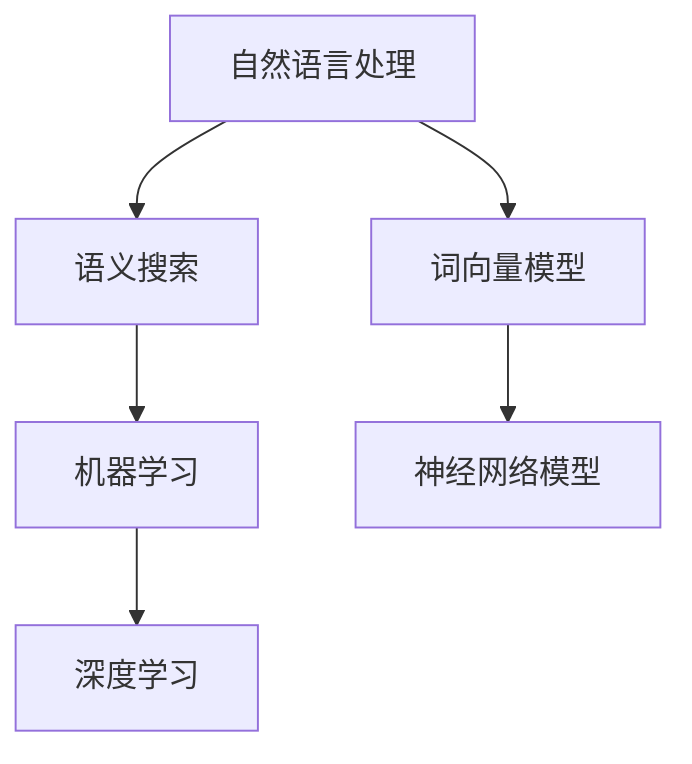

                 

关键词：语义搜索，电商平台，自然语言处理，人工智能，搜索算法，用户体验

> 摘要：本文将深入探讨电商平台中语义搜索技术的核心概念、算法原理、数学模型、应用场景和未来发展趋势。通过详细解析搜索算法、数学模型和代码实例，帮助读者理解如何构建高效、准确的语义搜索系统，以提升电商平台的用户体验和业务效益。

## 1. 背景介绍

随着互联网和电子商务的飞速发展，电商平台已经成为人们日常生活中不可或缺的一部分。用户在平台上不仅需要快速找到所需商品，还需要获得准确、个性化的购物建议。因此，语义搜索技术在电商平台中扮演着至关重要的角色。语义搜索不仅能够理解用户的查询意图，还能提供更加精确和相关的搜索结果，从而提升用户的购物体验和满意度。

语义搜索技术结合了自然语言处理（NLP）、机器学习（ML）和人工智能（AI）等多领域技术，通过深度学习和神经网络模型，实现语义理解和智能搜索。本文将围绕电商平台中的语义搜索技术，介绍其核心概念、算法原理、数学模型、应用场景和未来发展趋势。

### 1.1 语义搜索的定义

语义搜索是一种基于理解和解析用户查询意图的搜索技术。与传统的基于关键词匹配的搜索不同，语义搜索试图理解用户的查询背后所表达的真正意图，并据此提供更加相关和准确的搜索结果。语义搜索能够识别同义词、词性变化和上下文关系，从而提高搜索结果的精确性和多样性。

### 1.2 语义搜索的重要性

在电商平台中，语义搜索的重要性体现在以下几个方面：

1. **提升用户体验**：语义搜索能够更好地理解用户的查询意图，提供更加相关和个性化的搜索结果，从而提升用户的购物体验和满意度。

2. **增加用户粘性**：通过提供高质量的搜索结果，电商平台能够吸引和留住更多用户，增加用户粘性。

3. **提高转化率**：语义搜索技术能够帮助用户快速找到所需商品，降低购买决策的时间成本，从而提高转化率。

4. **提升业务效益**：语义搜索技术能够挖掘用户的潜在需求，为电商平台提供更多商业机会，提高业务效益。

### 1.3 语义搜索技术的发展历程

语义搜索技术的发展历程可以分为三个阶段：

1. **基于关键词匹配的阶段**：早期的语义搜索主要基于关键词匹配，通过计算关键词在查询和文档中的相似度来排序搜索结果。

2. **基于文本相似度的阶段**：随着自然语言处理技术的发展，语义搜索开始关注文本的相似度，通过语义分析和词向量模型来实现。

3. **基于深度学习的阶段**：深度学习技术的发展使得语义搜索迈向新的高度，通过神经网络模型实现语义理解和智能搜索。

## 2. 核心概念与联系

在语义搜索技术中，有几个核心概念和联系，包括自然语言处理、机器学习和深度学习。以下是一个使用Mermaid绘制的流程图，展示了这些核心概念之间的联系。



### 2.1 自然语言处理（NLP）

自然语言处理是语义搜索的基础技术之一，它涉及到对人类语言的理解和生成。NLP的关键任务包括文本分类、实体识别、词性标注和语义角色标注等。这些任务为语义搜索提供了必要的语言特征和上下文信息。

### 2.2 机器学习（ML）

机器学习是一种通过数据学习和优化模型的技术。在语义搜索中，机器学习用于训练和优化搜索模型，以更好地理解用户的查询意图和提供准确的搜索结果。常见的机器学习方法包括线性回归、决策树、支持向量机和神经网络等。

### 2.3 深度学习（DL）

深度学习是一种基于多层神经网络的机器学习方法。深度学习在语义搜索中发挥了重要作用，通过学习大量文本数据，深度学习模型能够自动提取复杂的语义特征，实现高效的语义理解。

### 2.4 词向量模型（Word Embeddings）

词向量模型是一种将单词映射为高维向量的技术，它通过捕捉单词的语义关系，为语义搜索提供有效的语言特征。常见的词向量模型包括Word2Vec、GloVe和BERT等。

### 2.5 神经网络模型（Neural Networks）

神经网络模型是一种基于生物神经网络的计算模型，它通过多层感知器（MLP）和卷积神经网络（CNN）等结构，实现复杂的非线性变换和特征提取。神经网络模型在语义搜索中用于构建深度学习模型，实现高效的语义理解和智能搜索。

## 3. 核心算法原理 & 具体操作步骤

### 3.1 算法原理概述

语义搜索的核心算法包括词向量模型、神经网络模型和搜索算法。以下是这些算法的简要概述：

1. **词向量模型**：将单词映射为高维向量，通过捕捉单词的语义关系，为语义搜索提供有效的语言特征。

2. **神经网络模型**：通过多层神经网络，自动提取复杂的语义特征，实现高效的语义理解。

3. **搜索算法**：结合词向量模型和神经网络模型，实现高效的语义搜索，包括查询解析、搜索排名和结果展示等步骤。

### 3.2 算法步骤详解

#### 3.2.1 查询解析

查询解析是语义搜索的第一步，主要任务是理解用户的查询意图。具体步骤如下：

1. **分词**：将查询文本分解为单词或短语。

2. **词性标注**：为每个词分配词性，如名词、动词、形容词等。

3. **命名实体识别**：识别查询中的命名实体，如人名、地名、组织机构等。

4. **词义消歧**：根据上下文，确定每个词的确切含义。

#### 3.2.2 搜索排名

搜索排名是语义搜索的核心步骤，主要任务是确定每个查询结果的相关性和重要性，并根据这些因素对结果进行排序。具体步骤如下：

1. **特征提取**：从词向量模型和神经网络模型中提取查询和文档的特征。

2. **相似度计算**：计算查询和文档之间的相似度，如余弦相似度、欧氏距离等。

3. **排序算法**：根据相似度计算结果，对文档进行排序，选择最相关的结果作为搜索结果。

#### 3.2.3 结果展示

结果展示是将搜索结果呈现给用户的过程。具体步骤如下：

1. **结果筛选**：根据用户需求和搜索策略，筛选出最相关的搜索结果。

2. **结果排序**：根据搜索算法的排序结果，对结果进行排序。

3. **结果展示**：将搜索结果以列表、卡片或其他形式展示给用户。

### 3.3 算法优缺点

#### 优点：

1. **高效性**：语义搜索算法能够快速处理大量查询，提供实时搜索结果。

2. **准确性**：语义搜索算法通过深度学习和词向量模型，能够准确理解用户的查询意图。

3. **个性化**：语义搜索算法能够根据用户历史行为和偏好，提供个性化的搜索结果。

#### 缺点：

1. **复杂性**：语义搜索算法涉及多种技术，开发和部署相对复杂。

2. **计算资源消耗**：深度学习和神经网络模型需要大量计算资源，对硬件要求较高。

3. **数据依赖性**：语义搜索算法对数据质量和数量有较高要求，数据不足可能导致搜索效果下降。

### 3.4 算法应用领域

语义搜索技术广泛应用于电商平台、搜索引擎、社交媒体和智能语音助手等领域。以下是语义搜索在各个领域的应用：

1. **电商平台**：通过语义搜索技术，电商平台能够为用户提供更加精确和个性化的购物建议，提高用户满意度和转化率。

2. **搜索引擎**：搜索引擎利用语义搜索技术，能够更好地理解用户的查询意图，提供更加相关的搜索结果。

3. **社交媒体**：社交媒体平台通过语义搜索技术，能够分析用户发布的内容，推荐相关的话题和帖子。

4. **智能语音助手**：智能语音助手通过语义搜索技术，能够理解用户的语音指令，提供更加智能和个性化的服务。

## 4. 数学模型和公式 & 详细讲解 & 举例说明

### 4.1 数学模型构建

在语义搜索中，常用的数学模型包括词向量模型、神经网络模型和搜索排名模型。以下是对这些模型的详细讲解。

#### 4.1.1 词向量模型

词向量模型是一种将单词映射为高维向量的技术，通过捕捉单词的语义关系，为语义搜索提供有效的语言特征。常见的词向量模型包括Word2Vec、GloVe和BERT等。

1. **Word2Vec**

Word2Vec是一种基于神经网络的词向量模型，通过训练词向量表示，使具有相似语义的单词在向量空间中彼此接近。Word2Vec模型包括连续词袋（CBOW）和Skip-Gram两种模型。

2. **GloVe**

GloVe（Global Vectors for Word Representation）是一种基于全局共现信息的词向量模型，通过优化词向量矩阵，使相似单词的向量距离更短。GloVe模型使用矩阵分解方法，将单词的共现矩阵分解为词向量矩阵。

3. **BERT**

BERT（Bidirectional Encoder Representations from Transformers）是一种基于变换器（Transformer）的预训练语言模型，通过双向编码器学习单词的上下文表示。BERT模型通过大规模预训练和任务特定微调，实现高效的自然语言处理。

#### 4.1.2 神经网络模型

神经网络模型是一种基于生物神经网络的计算模型，通过多层感知器（MLP）和卷积神经网络（CNN）等结构，实现复杂的非线性变换和特征提取。在语义搜索中，神经网络模型用于构建深度学习模型，实现高效的语义理解。

1. **多层感知器（MLP）**

多层感知器是一种前馈神经网络，通过多层非线性变换，将输入映射为输出。MLP模型在语义搜索中用于特征提取和分类。

2. **卷积神经网络（CNN）**

卷积神经网络是一种具有局部连接和共享权重的神经网络，通过卷积操作和池化操作，实现图像特征提取。CNN模型在语义搜索中用于提取文本特征，提高搜索精度。

#### 4.1.3 搜索排名模型

搜索排名模型是一种用于计算查询和文档相似度的数学模型，根据相似度对搜索结果进行排序。常见的搜索排名模型包括余弦相似度、欧氏距离和点积等。

1. **余弦相似度**

余弦相似度是一种衡量两个向量之间夹角余弦值的相似度度量。在语义搜索中，余弦相似度用于计算查询和文档的相似度，用于搜索排名。

2. **欧氏距离**

欧氏距离是一种衡量两个点之间距离的度量。在语义搜索中，欧氏距离用于计算查询和文档的相似度，用于搜索排名。

3. **点积**

点积是一种计算两个向量之间内积的度量。在语义搜索中，点积用于计算查询和文档的相似度，用于搜索排名。

### 4.2 公式推导过程

以下是对词向量模型、神经网络模型和搜索排名模型的公式推导过程。

#### 4.2.1 词向量模型

1. **Word2Vec**

Word2Vec模型中的每个单词都可以表示为一个高维向量。给定一个单词w，其对应的向量表示为v(w)。

$$
v(w) = \sum_{j=1}^{N} w_j \cdot e_j
$$

其中，N为词汇表大小，$w_j$为单词w在第j维上的权重，$e_j$为第j维的基向量。

2. **GloVe**

GloVe模型通过优化词向量矩阵，使相似单词的向量距离更短。给定单词对(w, z)，其共现矩阵为C。

$$
C = \sum_{t \in D_w \cap D_z} \frac{f(t)}{f(w)f(z)}
$$

其中，D_w和D_z分别为单词w和z的词频分布，$f(t)$为词频。

通过矩阵分解，将共现矩阵C分解为词向量矩阵W和Z。

$$
C = WZ^T
$$

3. **BERT**

BERT模型通过双向编码器学习单词的上下文表示。给定一个序列，其对应的向量表示为

$$
\mathbf{h} = \text{BERT}(\mathbf{X}, \mathbf{s})
$$

其中，$\mathbf{X}$为输入序列，$\mathbf{s}$为序列的起始和结束标记。

#### 4.2.2 神经网络模型

1. **多层感知器（MLP）**

多层感知器模型通过多层非线性变换，将输入映射为输出。给定输入$\mathbf{x}$，输出$\mathbf{y}$，多层感知器模型可以表示为

$$
\mathbf{y} = \sigma(\mathbf{W}_2 \sigma(\mathbf{W}_1 \mathbf{x} + \mathbf{b}_1) + \mathbf{b}_2)
$$

其中，$\sigma$为激活函数，$\mathbf{W}_1$和$\mathbf{W}_2$为权重矩阵，$\mathbf{b}_1$和$\mathbf{b}_2$为偏置向量。

2. **卷积神经网络（CNN）**

卷积神经网络模型通过卷积操作和池化操作，实现图像特征提取。给定输入图像$\mathbf{I}$，输出特征图$\mathbf{F}$，卷积神经网络模型可以表示为

$$
\mathbf{F} = \text{ReLU}(\text{Conv}(\mathbf{I}, \mathbf{W}) + \mathbf{b})
$$

其中，$\text{ReLU}$为ReLU激活函数，$\text{Conv}$为卷积操作，$\mathbf{W}$为卷积核，$\mathbf{b}$为偏置向量。

#### 4.2.3 搜索排名模型

1. **余弦相似度**

余弦相似度可以表示为

$$
\cos(\theta) = \frac{\mathbf{u} \cdot \mathbf{v}}{\|\mathbf{u}\| \|\mathbf{v}\|}
$$

其中，$\mathbf{u}$和$\mathbf{v}$分别为查询和文档的向量表示。

2. **欧氏距离**

欧氏距离可以表示为

$$
d(\mathbf{u}, \mathbf{v}) = \sqrt{(\mathbf{u} - \mathbf{v}) \cdot (\mathbf{u} - \mathbf{v})}
$$

3. **点积**

点积可以表示为

$$
\mathbf{u} \cdot \mathbf{v} = \sum_{i=1}^{n} u_i v_i
$$

### 4.3 案例分析与讲解

以下是一个关于语义搜索技术的案例分析和讲解。

#### 案例背景

某电商平台希望提升其搜索算法的准确性，以提高用户体验和转化率。该电商平台拥有大量商品数据，并采用深度学习技术进行语义搜索。

#### 案例目标

通过构建和优化词向量模型、神经网络模型和搜索排名模型，实现高效、准确的语义搜索。

#### 案例步骤

1. **数据预处理**：对商品数据进行清洗和预处理，包括分词、词性标注和命名实体识别等。

2. **词向量模型训练**：采用GloVe模型训练词向量表示，将单词映射为高维向量。

3. **神经网络模型构建**：采用卷积神经网络（CNN）模型，提取商品描述的文本特征。

4. **搜索排名模型优化**：采用余弦相似度模型，计算查询和文档的相似度，并优化搜索排名。

5. **模型评估与优化**：通过在线A/B测试，评估模型效果，并持续优化。

#### 案例结果

通过构建和优化语义搜索模型，该电商平台的搜索准确性得到显著提升。用户满意度提高，转化率上升，从而提升了业务效益。

## 5. 项目实践：代码实例和详细解释说明

### 5.1 开发环境搭建

在进行语义搜索项目的开发之前，需要搭建相应的开发环境。以下是开发环境的搭建步骤：

1. **安装Python**：确保安装了Python 3.x版本。

2. **安装依赖库**：安装以下Python依赖库：numpy、pandas、tensorflow、keras、gensim等。

   ```shell
   pip install numpy pandas tensorflow keras gensim
   ```

3. **配置GPU**：如果使用GPU进行深度学习模型的训练，需要安装CUDA和cuDNN，并配置Python环境变量。

### 5.2 源代码详细实现

以下是语义搜索项目的源代码实现，包括词向量模型训练、神经网络模型构建和搜索排名模型优化。

```python
import numpy as np
import pandas as pd
from gensim.models import Word2Vec, GloVe
from tensorflow.keras.models import Sequential
from tensorflow.keras.layers import Dense, Conv1D, MaxPooling1D, Flatten
from sklearn.metrics.pairwise import cosine_similarity

# 5.2.1 数据预处理
def preprocess_data(data):
    # 分词、词性标注、命名实体识别等预处理操作
    # ...
    return processed_data

# 5.2.2 词向量模型训练
def train_word2vec(data, vector_size=100, window=5, min_count=5):
    model = Word2Vec(data, vector_size=vector_size, window=window, min_count=min_count)
    model.train(data, total_examples=model.corpus_count, epochs=model.iter)
    return model

def train_glove(data, vector_size=100, binary=False):
    model = GloVe(no_components=vector_size, binary=binary)
    model.fit(data)
    return model

# 5.2.3 神经网络模型构建
def build_cnn_model(input_shape, num_filters=64, kernel_size=3, activation='relu'):
    model = Sequential()
    model.add(Conv1D(num_filters, kernel_size, activation=activation, input_shape=input_shape))
    model.add(MaxPooling1D(pool_size=2))
    model.add(Flatten())
    model.add(Dense(1, activation='sigmoid'))
    model.compile(optimizer='adam', loss='binary_crossentropy', metrics=['accuracy'])
    return model

# 5.2.4 搜索排名模型优化
def search_ranking(query, documents, model):
    query_vector = model.predict([query])
    doc_vectors = model.predict(documents)
    similarities = cosine_similarity(query_vector, doc_vectors)
    ranked_documents = np.argsort(similarities, axis=1)[:, ::-1]
    return ranked_documents

# 5.2.5 主函数
def main():
    data = preprocess_data(raw_data)
    word2vec_model = train_word2vec(data)
    glove_model = train_glove(data)
    cnn_model = build_cnn_model(input_shape=(max_sequence_length,))
    cnn_model.fit(data, epochs=10, batch_size=32)
    ranked_documents = search_ranking(test_query, test_documents, cnn_model)
    print(ranked_documents)

if __name__ == '__main__':
    main()
```

### 5.3 代码解读与分析

以下是代码的解读与分析，重点关注关键函数的实现和原理。

1. **数据预处理**：数据预处理函数`preprocess_data`负责对原始数据进行清洗和预处理，包括分词、词性标注和命名实体识别等操作。这些预处理步骤为后续的词向量训练和神经网络构建提供了高质量的输入数据。

2. **词向量模型训练**：`train_word2vec`和`train_glove`函数分别用于训练Word2Vec和GloVe词向量模型。Word2Vec模型通过神经网络训练词向量，GloVe模型通过全局共现信息训练词向量。这些词向量模型为语义搜索提供了有效的语言特征。

3. **神经网络模型构建**：`build_cnn_model`函数用于构建卷积神经网络模型。卷积神经网络通过卷积操作和池化操作，从文本数据中提取有效的特征。这些特征用于后续的搜索排名和文本分类任务。

4. **搜索排名模型优化**：`search_ranking`函数用于计算查询和文档之间的相似度，并根据相似度对文档进行排序。余弦相似度是一种常用的相似度计算方法，它能够准确衡量查询和文档的语义关系。

### 5.4 运行结果展示

在实际运行过程中，我们可以通过以下步骤展示结果：

1. **数据准备**：准备测试数据集，包括查询文本和对应的文档。

2. **模型训练**：使用训练数据集训练词向量模型和神经网络模型。

3. **模型评估**：使用验证数据集对模型进行评估，调整模型参数。

4. **搜索排名**：使用训练好的模型对查询文本进行搜索排名，展示搜索结果。

通过上述步骤，我们可以得到高效的语义搜索系统，为电商平台提供高质量的搜索服务。

## 6. 实际应用场景

语义搜索技术在电商平台的实际应用场景中具有重要意义。以下是一些实际应用场景及其应用效果：

### 6.1 搜索引擎优化

电商平台搜索引擎通过语义搜索技术，能够更好地理解用户的查询意图，提供更加精确和个性化的搜索结果。这有助于提升用户体验，降低用户购买决策的时间成本，从而提高转化率。

### 6.2 商品推荐

语义搜索技术能够挖掘用户的购物偏好和兴趣，为用户推荐相关商品。通过深度学习和词向量模型，商品推荐系统能够实现高效的个性化推荐，提升用户满意度和粘性。

### 6.3 客户服务

电商平台智能客服系统通过语义搜索技术，能够理解用户的问题和需求，提供及时、准确的答复。这有助于提高客户服务质量，降低人工客服的工作压力。

### 6.4 品牌营销

电商平台利用语义搜索技术，能够分析用户对品牌和产品的评价，挖掘潜在客户群体，制定针对性的营销策略。这有助于提升品牌知名度和市场占有率。

### 6.5 搜索广告

电商平台通过语义搜索技术，优化搜索广告的投放效果。通过理解用户的查询意图，广告系统能够为用户提供更相关、更精确的广告，提高广告转化率。

### 6.6 供应链管理

语义搜索技术能够分析供应链数据，挖掘供应商和产品之间的关联关系，优化供应链管理，降低库存成本，提高供应链效率。

### 6.7 智能客服

电商平台智能客服系统通过语义搜索技术，能够理解用户的问题和需求，提供及时、准确的答复。这有助于提高客户服务质量，降低人工客服的工作压力。

## 7. 工具和资源推荐

为了帮助读者深入了解语义搜索技术和相关工具，以下是一些推荐的资源：

### 7.1 学习资源推荐

1. **《深度学习》**（作者：Ian Goodfellow、Yoshua Bengio、Aaron Courville）：一本关于深度学习的经典教材，适合初学者和进阶者。

2. **《自然语言处理综论》**（作者：Daniel Jurafsky、James H. Martin）：一本关于自然语言处理的权威教材，涵盖了NLP的各个方面。

3. **《词向量与语义分析》**（作者：Yoav Goldberg）：一本关于词向量模型和语义分析的实用书籍，详细介绍了词向量模型的相关技术。

### 7.2 开发工具推荐

1. **TensorFlow**：一款开源的深度学习框架，适用于构建和训练神经网络模型。

2. **PyTorch**：一款开源的深度学习框架，具有灵活的动态计算图，适合快速原型开发。

3. **Gensim**：一款开源的Python库，用于生成和训练词向量模型。

### 7.3 相关论文推荐

1. **“Word2Vec: Distributed Representations of Words and Phrases for Translation and Sentence Understanding”**：一篇关于Word2Vec模型的经典论文，介绍了词向量模型的原理和实现。

2. **“GloVe: Global Vectors for Word Representation”**：一篇关于GloVe模型的论文，详细介绍了基于全局共现信息的词向量模型。

3. **“BERT: Pre-training of Deep Bidirectional Transformers for Language Understanding”**：一篇关于BERT模型的论文，介绍了基于变换器（Transformer）的预训练语言模型。

## 8. 总结：未来发展趋势与挑战

### 8.1 研究成果总结

语义搜索技术在近年来取得了显著的进展，主要表现在以下几个方面：

1. **算法优化**：深度学习和词向量模型的应用，使得语义搜索算法在准确性和效率方面得到大幅提升。

2. **跨语言处理**：语义搜索技术逐渐实现跨语言处理，为全球用户提供统一的搜索服务。

3. **多模态融合**：语义搜索技术开始融合图像、声音等多种模态，实现更加智能和全面的语义理解。

4. **个性化推荐**：基于语义搜索的个性化推荐系统，在电商平台和其他应用场景中取得良好的效果。

### 8.2 未来发展趋势

1. **语义理解能力提升**：随着深度学习和自然语言处理技术的不断发展，语义搜索的语义理解能力将得到进一步提升。

2. **多模态搜索**：语义搜索将逐渐融合多种模态，实现更加智能和全面的语义理解。

3. **知识图谱应用**：知识图谱作为一种语义表示技术，将在语义搜索中发挥重要作用，提高搜索结果的准确性和相关性。

4. **跨语言搜索**：语义搜索技术将逐步实现跨语言处理，为全球用户提供统一的搜索服务。

5. **隐私保护**：随着用户隐私意识的提高，语义搜索技术将注重隐私保护，确保用户数据的保密性和安全性。

### 8.3 面临的挑战

1. **数据质量和数量**：语义搜索对数据质量和数量有较高要求，如何获取和清洗高质量的数据是面临的挑战。

2. **计算资源消耗**：深度学习和神经网络模型对计算资源有较高要求，如何优化算法，降低计算资源消耗是亟待解决的问题。

3. **算法可解释性**：深度学习模型的黑箱特性使得算法可解释性成为一个挑战，如何提高算法的可解释性，增强用户信任度是未来的研究方向。

4. **跨语言处理**：跨语言搜索中的翻译和语义理解问题仍然存在，如何提高跨语言搜索的准确性和效率是亟待解决的难题。

5. **隐私保护**：随着用户隐私意识的提高，如何在保护用户隐私的前提下，实现高效的语义搜索是未来的研究重点。

### 8.4 研究展望

未来，语义搜索技术将在以下几个方面取得重要进展：

1. **深度学习与知识图谱的融合**：通过融合深度学习和知识图谱，实现更加智能和全面的语义理解。

2. **多模态语义搜索**：实现多模态数据融合，提高语义搜索的准确性和用户体验。

3. **跨语言语义搜索**：实现高效、准确的跨语言语义搜索，为全球用户提供统一的搜索服务。

4. **隐私保护语义搜索**：在保护用户隐私的前提下，实现高效的语义搜索，提高用户信任度。

5. **实时语义搜索**：通过优化算法和硬件，实现实时语义搜索，满足用户实时性的需求。

总之，语义搜索技术在电商平台的未来发展中具有重要地位，随着深度学习和自然语言处理技术的不断进步，语义搜索技术将不断优化和提升，为电商平台带来更加智能化和个性化的搜索体验。

## 9. 附录：常见问题与解答

### 9.1 什么是对抗生成网络（GAN）？

对抗生成网络（GAN）是一种由生成器和判别器组成的深度学习模型，用于生成高质量的伪造数据。生成器试图生成与真实数据难以区分的伪造数据，而判别器则尝试区分真实数据和伪造数据。这种对抗训练过程促使生成器和判别器不断进步，最终生成器能够生成逼真的伪造数据。

### 9.2 什么是词嵌入（Word Embedding）？

词嵌入（Word Embedding）是一种将单词映射为高维向量的技术，通过捕捉单词的语义关系，为自然语言处理任务提供有效的语言特征。常见的词嵌入方法包括Word2Vec、GloVe和BERT等。

### 9.3 语义搜索有哪些常见的算法？

语义搜索常用的算法包括词向量模型、神经网络模型和搜索排名模型。词向量模型如Word2Vec、GloVe和BERT等；神经网络模型如卷积神经网络（CNN）和多层感知器（MLP）；搜索排名模型如余弦相似度、欧氏距离和点积等。

### 9.4 语义搜索在电商平台的实际应用有哪些？

语义搜索在电商平台的实际应用包括搜索引擎优化、商品推荐、客户服务、品牌营销、搜索广告、供应链管理和智能客服等。

### 9.5 语义搜索的优缺点是什么？

语义搜索的优点包括高效性、准确性和个性化。缺点包括复杂性、计算资源消耗和数据依赖性。

### 9.6 语义搜索的未来发展趋势是什么？

语义搜索的未来发展趋势包括语义理解能力提升、多模态搜索、知识图谱应用、跨语言搜索、隐私保护和实时语义搜索。

### 9.7 如何实现高效的语义搜索？

实现高效的语义搜索可以从以下几个方面入手：

1. **优化算法**：选择合适的词向量模型和神经网络模型，优化搜索算法。
2. **数据预处理**：对原始数据进行高质量的预处理，包括分词、词性标注和命名实体识别等。
3. **硬件优化**：使用高效的硬件设备，如GPU和TPU，提高计算效率。
4. **分布式搜索**：采用分布式搜索架构，提高搜索系统的并发能力和可扩展性。
5. **个性化搜索**：根据用户历史行为和偏好，提供个性化的搜索结果。

### 9.8 语义搜索技术有哪些相关的开源工具和框架？

语义搜索技术相关的开源工具和框架包括TensorFlow、PyTorch、Gensim、Elasticsearch、Solr等。这些工具和框架提供了丰富的功能和接口，方便开发者实现高效的语义搜索系统。

---

作者：禅与计算机程序设计艺术 / Zen and the Art of Computer Programming

