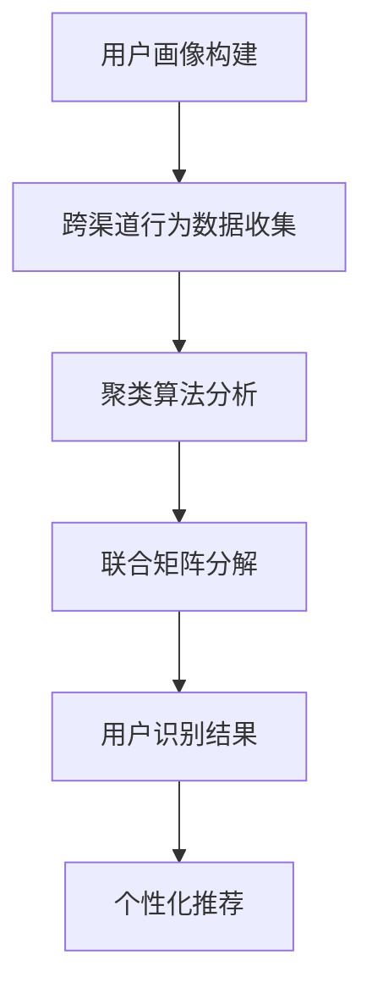

                 

关键词：电商平台，用户识别，跨渠道，人工智能，机器学习，数据挖掘

> 摘要：本文主要探讨电商平台中跨渠道用户识别技术的核心概念、算法原理、数学模型及其在实际项目中的应用。通过对用户行为数据的分析，电商平台可以实现跨渠道的用户识别，从而为用户提供更加个性化的服务，提高用户体验和转化率。本文旨在为从事电商领域的技术人员提供理论指导和实践参考。

## 1. 背景介绍

随着互联网的普及和电子商务的快速发展，电商平台已经成为了人们日常生活中不可或缺的一部分。然而，电商平台之间的竞争也日益激烈，各大电商平台都在不断探索新的技术手段来提升用户体验，增加用户粘性。跨渠道用户识别技术作为一项新兴技术，在电商平台的应用中发挥着重要作用。

跨渠道用户识别技术是指通过分析用户在不同渠道（如网页、移动应用、社交媒体等）上的行为数据，识别出同一个用户在不同渠道上的活动，从而实现用户的统一管理和个性化推荐。在电商平台中，跨渠道用户识别技术的应用有助于提高用户转化率、提升用户体验，以及优化营销策略。

本文将围绕跨渠道用户识别技术展开讨论，包括核心概念、算法原理、数学模型、项目实践和实际应用场景等内容，旨在为从事电商领域的技术人员提供有价值的参考。

### 1.1 跨渠道用户识别的重要性

在电商领域，用户识别是实现个性化服务和精准营销的关键。然而，传统的用户识别方法往往局限于单一渠道，如仅通过网页行为数据来识别用户。这种单一渠道的用户识别方法存在明显的局限性，无法充分了解用户的整体行为特征，进而影响个性化推荐的准确性和用户体验。

跨渠道用户识别技术能够突破单一渠道的局限，通过整合不同渠道的用户行为数据，构建全面、多维的用户画像，从而实现更精准的用户识别和个性化推荐。具体来说，跨渠道用户识别的重要性主要体现在以下几个方面：

1. **提高用户转化率**：通过跨渠道用户识别技术，电商平台可以识别出潜在高价值用户，并针对性地推送个性化商品和优惠信息，提高用户购买意愿，从而提高转化率。

2. **提升用户体验**：跨渠道用户识别技术能够更好地理解用户的需求和偏好，为用户提供个性化的购物推荐和服务，提升用户体验。

3. **优化营销策略**：跨渠道用户识别技术可以帮助电商平台更准确地识别目标用户群体，制定更有针对性的营销策略，提高营销效果。

4. **数据整合与分析**：跨渠道用户识别技术能够整合不同渠道的用户数据，为电商平台提供全面、准确的数据支持，有助于分析用户行为规律和趋势，优化产品和服务。

### 1.2 跨渠道用户识别技术的发展历程

跨渠道用户识别技术是随着互联网和大数据技术的发展而逐渐成熟起来的。以下是该技术的主要发展历程：

1. **早期阶段**：在互联网初期，电商平台主要关注单一渠道的用户识别，如通过网页浏览数据来识别用户。这一阶段的技术相对简单，主要依赖于用户ID、IP地址等基础信息。

2. **用户行为数据整合**：随着互联网和电子商务的发展，用户行为数据日益丰富，电商平台开始关注如何整合不同渠道的用户行为数据，以实现更精准的用户识别。这一阶段的技术主要涉及数据挖掘和用户行为分析。

3. **机器学习与人工智能**：近年来，机器学习和人工智能技术的快速发展为跨渠道用户识别技术提供了强大的支持。通过深度学习、图神经网络等算法，电商平台能够更准确地识别跨渠道用户，提高个性化推荐的准确性。

4. **跨渠道用户体验优化**：当前，跨渠道用户识别技术已经广泛应用于电商平台，成为提升用户体验和转化率的重要手段。未来，随着技术的不断进步，跨渠道用户识别技术将在更多领域得到应用，为用户提供更加个性化和智能化的服务。

### 1.3 跨渠道用户识别技术的应用场景

跨渠道用户识别技术具有广泛的应用场景，以下是一些典型的应用案例：

1. **个性化推荐**：电商平台通过跨渠道用户识别技术，可以识别出用户的兴趣偏好，为用户提供个性化的商品推荐和优惠信息，提高用户满意度和购买意愿。

2. **营销活动优化**：电商平台可以根据用户在不同渠道的行为数据，分析用户的购买习惯和偏好，制定更有针对性的营销活动，提高营销效果。

3. **客户服务优化**：电商平台可以通过跨渠道用户识别技术，实现客户服务的统一管理和个性化响应，提高客户满意度。

4. **数据分析与决策**：电商平台可以利用跨渠道用户识别技术，整合多渠道用户数据，进行深入的数据分析和决策支持，优化产品和服务。

## 2. 核心概念与联系

在探讨跨渠道用户识别技术之前，我们首先需要了解一些核心概念，这些概念是理解跨渠道用户识别技术的基础。

### 2.1 用户画像

用户画像是指通过对用户行为、兴趣、需求等多维度数据的分析，构建出的用户特征模型。用户画像可以包括年龄、性别、职业、教育程度、兴趣爱好、购买历史等基本信息，以及用户的行为特征、偏好特征等。

用户画像在跨渠道用户识别中起着重要作用，它为识别不同渠道上的同一用户提供了基础数据支持。

### 2.2 跨渠道行为数据

跨渠道行为数据是指用户在不同渠道（如网页、移动应用、社交媒体等）上的活动记录。这些数据包括浏览历史、点击行为、购买行为、评论反馈等。跨渠道行为数据是跨渠道用户识别的核心数据来源。

### 2.3 聚类算法

聚类算法是一种无监督学习方法，它通过将数据点分组，使得组内的数据点之间相似度较高，而组间的数据点相似度较低。在跨渠道用户识别中，聚类算法可以用于将不同渠道上的用户行为数据进行分组，以便进一步识别同一用户在不同渠道上的活动。

### 2.4 联合矩阵分解

联合矩阵分解是一种多渠道推荐算法，它通过将多个矩阵分解为一个公共矩阵和一个独特矩阵的乘积，实现跨渠道的用户和物品推荐。在跨渠道用户识别中，联合矩阵分解可以用于整合不同渠道的用户行为数据，识别同一用户在不同渠道上的行为模式。

### 2.5 Mermaid 流程图

为了更好地理解跨渠道用户识别技术的核心概念和流程，我们使用Mermaid流程图进行展示。以下是跨渠道用户识别技术的核心概念和流程图：



在这个流程图中，A表示用户画像构建，B表示跨渠道行为数据收集，C表示聚类算法分析，D表示联合矩阵分解，E表示用户识别结果，F表示个性化推荐。这些步骤共同构成了跨渠道用户识别技术的基本框架。

## 3. 核心算法原理 & 具体操作步骤

在跨渠道用户识别技术中，核心算法的原理和具体操作步骤至关重要。下面我们将详细介绍这些核心算法，包括算法原理概述、算法步骤详解、算法优缺点以及算法应用领域。

### 3.1 算法原理概述

跨渠道用户识别技术的核心算法主要包括用户画像构建、跨渠道行为数据收集、聚类算法分析和联合矩阵分解等。下面分别介绍这些算法的基本原理。

#### 用户画像构建

用户画像构建是通过分析用户的多维度数据，构建出用户特征模型的过程。用户画像的构建包括以下步骤：

1. **数据收集**：收集用户在各个渠道上的行为数据，如浏览历史、点击行为、购买行为、评论反馈等。
2. **数据清洗**：对收集到的数据进行分析和清洗，去除噪声数据和异常值。
3. **特征提取**：对清洗后的数据进行分析，提取出用户的兴趣偏好、行为特征等特征信息。
4. **模型构建**：利用机器学习算法，如决策树、支持向量机等，构建用户画像模型。

#### 跨渠道行为数据收集

跨渠道行为数据收集是指将用户在不同渠道上的活动数据进行整合和记录的过程。跨渠道行为数据收集的主要步骤如下：

1. **数据采集**：通过API接口、数据抓取工具等手段，从各个渠道获取用户行为数据。
2. **数据整合**：将不同渠道的行为数据整合到一个统一的数据库中，以便后续分析。
3. **数据格式转换**：将不同渠道的数据格式进行统一处理，确保数据的一致性和可分析性。

#### 聚类算法分析

聚类算法分析是通过对用户行为数据进行分组，识别出同一用户在不同渠道上的活动。常用的聚类算法包括K-means、DBSCAN等。聚类算法分析的主要步骤如下：

1. **数据预处理**：对用户行为数据进行分析和清洗，确保数据的质量。
2. **特征选择**：根据用户画像构建的结果，选择合适的行为特征作为聚类算法的输入。
3. **聚类算法应用**：利用聚类算法，将用户行为数据分组，形成不同的用户群体。
4. **聚类结果分析**：对聚类结果进行分析，识别出同一用户在不同渠道上的活动。

#### 联合矩阵分解

联合矩阵分解是一种多渠道推荐算法，它通过将多个矩阵分解为一个公共矩阵和一个独特矩阵的乘积，实现跨渠道的用户和物品推荐。联合矩阵分解的主要步骤如下：

1. **矩阵构建**：根据用户行为数据，构建用户-渠道-物品的三维矩阵。
2. **矩阵分解**：利用矩阵分解算法，如NMF（非负矩阵分解）、SVD（奇异值分解）等，将三维矩阵分解为一个公共矩阵和一个独特矩阵的乘积。
3. **用户识别**：根据公共矩阵和独特矩阵，识别出同一用户在不同渠道上的行为模式。

### 3.2 算法步骤详解

下面我们将详细描述上述核心算法的具体操作步骤。

#### 用户画像构建

1. **数据收集**：

   - 网页浏览数据：通过浏览器插件、日志文件等手段收集用户在电商平台网页上的浏览记录。
   - 移动应用数据：通过移动应用SDK收集用户在电商平台移动应用上的行为数据，如点击行为、购买记录等。
   - 社交媒体数据：通过社交媒体API收集用户在社交媒体平台上的活动数据，如点赞、评论、转发等。

2. **数据清洗**：

   - 去除重复数据：对收集到的数据去重处理，确保数据的唯一性。
   - 填补缺失数据：对缺失的数据进行填补或删除处理，确保数据的完整性。
   - 数据格式转换：将不同渠道的数据格式转换为统一的格式，如CSV、JSON等。

3. **特征提取**：

   - 行为特征：根据用户在不同渠道上的行为数据，提取出用户的行为特征，如浏览时间、浏览频次、购买频次等。
   - 偏好特征：根据用户的兴趣爱好、购买记录等数据，提取出用户的偏好特征，如喜欢品牌、喜欢类型等。

4. **模型构建**：

   - 决策树模型：利用决策树算法，对用户行为数据进行分类，构建用户画像模型。
   - 支持向量机模型：利用支持向量机算法，对用户行为数据进行分类，构建用户画像模型。

#### 跨渠道行为数据收集

1. **数据采集**：

   - 网页行为数据：通过网页日志文件收集用户在电商平台网页上的浏览记录。
   - 移动应用行为数据：通过移动应用SDK收集用户在电商平台移动应用上的行为数据。
   - 社交媒体行为数据：通过社交媒体API收集用户在社交媒体平台上的活动数据。

2. **数据整合**：

   - 数据清洗：对采集到的数据进行分析和清洗，去除噪声数据和异常值。
   - 数据格式转换：将不同渠道的数据格式转换为统一的格式，如CSV、JSON等。
   - 数据存储：将整合后的数据存储到数据库中，以便后续分析。

#### 聚类算法分析

1. **数据预处理**：

   - 数据清洗：对用户行为数据进行分析和清洗，确保数据的质量。
   - 特征选择：根据用户画像构建的结果，选择合适的行为特征作为聚类算法的输入。

2. **聚类算法应用**：

   - K-means聚类算法：根据用户行为数据，选择合适的聚类个数，利用K-means聚类算法将用户行为数据进行分组。
   - DBSCAN聚类算法：根据用户行为数据，选择合适的密度阈值和邻域半径，利用DBSCAN聚类算法将用户行为数据进行分组。

3. **聚类结果分析**：

   - 聚类结果可视化：将聚类结果进行可视化展示，分析不同聚类结果的特点。
   - 用户活动模式识别：根据聚类结果，识别出同一用户在不同渠道上的活动模式。

#### 联合矩阵分解

1. **矩阵构建**：

   - 用户-渠道-物品矩阵：根据用户行为数据，构建用户-渠道-物品的三维矩阵。
   - 矩阵格式转换：将三维矩阵转换为二维矩阵，以便进行矩阵分解。

2. **矩阵分解**：

   - 非负矩阵分解（NMF）：利用NMF算法，将用户-渠道-物品矩阵分解为一个公共矩阵和一个独特矩阵的乘积。
   - 奇异值分解（SVD）：利用SVD算法，将用户-渠道-物品矩阵分解为一个公共矩阵和一个独特矩阵的乘积。

3. **用户识别**：

   - 公共矩阵分析：根据公共矩阵，分析用户在不同渠道上的行为特征。
   - 独特矩阵分析：根据独特矩阵，分析用户在不同渠道上的独特行为特征。

### 3.3 算法优缺点

#### 用户画像构建

优点：

- 提高用户识别准确性：通过构建用户画像，可以更准确地识别同一用户在不同渠道上的活动，提高用户识别的准确性。
- 个性化推荐：用户画像可以为个性化推荐提供基础数据支持，提高推荐系统的效果。

缺点：

- 数据处理复杂度高：用户画像构建涉及多渠道、多维度的数据收集、清洗、特征提取等步骤，数据处理复杂度高。
- 数据隐私保护：在构建用户画像的过程中，需要处理用户的敏感信息，对数据隐私保护提出了较高的要求。

#### 跨渠道行为数据收集

优点：

- 实时性：跨渠道行为数据收集可以实时获取用户在不同渠道上的活动记录，为用户识别提供实时数据支持。
- 全面性：跨渠道行为数据收集可以整合不同渠道的用户数据，为用户画像构建提供全面的数据支持。

缺点：

- 数据一致性：不同渠道的数据格式、存储方式可能存在差异，需要处理数据的一致性问题。
- 数据隐私保护：在跨渠道行为数据收集过程中，需要处理用户的敏感信息，对数据隐私保护提出了较高的要求。

#### 聚类算法分析

优点：

- 自动化：聚类算法分析可以自动将用户行为数据分组，减少人工干预。
- 可解释性：聚类算法分析的结果具有较好的可解释性，便于分析用户活动模式。

缺点：

- 聚类个数选择：聚类个数的选择对聚类结果有较大影响，需要根据实际情况进行选择。
- 聚类效果评估：聚类效果评估需要考虑聚类结果的准确性和可解释性，需要综合考虑多种指标。

#### 联合矩阵分解

优点：

- 跨渠道推荐：联合矩阵分解可以实现跨渠道的用户和物品推荐，提高推荐系统的效果。
- 数据整合：联合矩阵分解可以整合不同渠道的用户行为数据，为用户画像构建提供更全面的数据支持。

缺点：

- 矩阵分解复杂度：联合矩阵分解涉及到多维矩阵的分解，计算复杂度较高。
- 数据稀疏性：在实际应用中，用户-渠道-物品矩阵可能存在数据稀疏性问题，需要处理数据稀疏性对推荐效果的影响。

### 3.4 算法应用领域

跨渠道用户识别技术具有广泛的应用领域，以下是一些典型的应用场景：

1. **电商平台**：电商平台可以通过跨渠道用户识别技术，实现用户在不同渠道上的统一管理和个性化推荐，提高用户转化率和满意度。

2. **在线教育**：在线教育平台可以通过跨渠道用户识别技术，识别出用户在不同渠道上的学习行为，为用户提供个性化的学习推荐和服务。

3. **社交媒体**：社交媒体平台可以通过跨渠道用户识别技术，识别出用户在不同渠道上的活动模式，为用户提供更精准的广告推送和内容推荐。

4. **旅游平台**：旅游平台可以通过跨渠道用户识别技术，识别出用户在不同渠道上的预订行为，为用户提供个性化的旅游推荐和服务。

5. **金融领域**：金融机构可以通过跨渠道用户识别技术，识别出用户在不同渠道上的交易行为，为用户提供个性化的理财产品推荐和服务。

## 4. 数学模型和公式 & 详细讲解 & 举例说明

在跨渠道用户识别技术中，数学模型和公式是算法的核心组成部分。以下我们将详细介绍数学模型的构建、公式推导过程以及实际案例分析与讲解。

### 4.1 数学模型构建

跨渠道用户识别技术的数学模型主要包括用户行为矩阵、用户特征矩阵和推荐矩阵等。以下是这些模型的构建过程：

#### 用户行为矩阵

用户行为矩阵是一个三维矩阵，表示用户在不同渠道上的行为记录。矩阵的行表示用户，列表示渠道，元素表示用户在特定渠道上的行为指标（如浏览次数、购买次数等）。

$$
U_{ij} = \{ u_1, u_2, \ldots, u_n \} \quad \text{（用户集）}
$$

$$
C_{ik} = \{ c_1, c_2, \ldots, c_m \} \quad \text{（渠道集）}
$$

$$
B_{ij} = \{ b_{ij1}, b_{ij2}, \ldots, b_{ijn} \} \quad \text{（用户行为矩阵）}
$$

其中，$u_i$ 表示第 $i$ 个用户，$c_k$ 表示第 $k$ 个渠道，$b_{ij}$ 表示用户 $u_i$ 在渠道 $c_j$ 上的行为记录。

#### 用户特征矩阵

用户特征矩阵是一个二维矩阵，表示用户在各个特征维度上的属性。矩阵的行表示用户，列表示特征维度，元素表示用户在该特征维度上的属性值。

$$
F_{ij} = \{ f_{i1}, f_{i2}, \ldots, f_{iv} \} \quad \text{（用户特征矩阵）}
$$

其中，$f_{ij}$ 表示第 $i$ 个用户在第 $j$ 个特征维度上的属性值。

#### 推荐矩阵

推荐矩阵是一个二维矩阵，表示用户在不同渠道上的推荐物品。矩阵的行表示用户，列表示渠道，元素表示用户在特定渠道上的推荐物品。

$$
R_{ij} = \{ r_{ij1}, r_{ij2}, \ldots, r_{ijn} \} \quad \text{（推荐矩阵）}
$$

其中，$r_{ij}$ 表示用户 $u_i$ 在渠道 $c_j$ 上的推荐物品。

### 4.2 公式推导过程

在构建数学模型的基础上，我们需要推导跨渠道用户识别算法的公式。以下是一个简单的公式推导过程：

假设我们使用矩阵分解方法（如NMF、SVD等）来构建用户行为矩阵和推荐矩阵。我们假设用户行为矩阵 $B$ 可以分解为两个矩阵的乘积：

$$
B = WH
$$

其中，$W$ 是用户特征矩阵，$H$ 是渠道特征矩阵。我们需要通过优化目标函数来求解 $W$ 和 $H$。

#### 目标函数

目标函数可以表示为：

$$
\min_{W,H} \sum_{i,j}(b_{ij} - w_{i\cdot}h_{j\cdot})^2
$$

其中，$w_{i\cdot}$ 和 $h_{j\cdot}$ 分别表示用户 $i$ 和渠道 $j$ 的特征向量。

#### 梯度下降法

为了求解 $W$ 和 $H$，我们可以使用梯度下降法。对于用户特征矩阵 $W$，其梯度为：

$$
\nabla_W = 2\sum_{i,j}(b_{ij} - w_{i\cdot}h_{j\cdot})w_{j}
$$

对于渠道特征矩阵 $H$，其梯度为：

$$
\nabla_H = 2\sum_{i,j}(b_{ij} - w_{i\cdot}h_{j\cdot})h_{i}
$$

通过迭代更新 $W$ 和 $H$，我们可以逐步优化目标函数，直到达到收敛条件。

### 4.3 案例分析与讲解

为了更好地理解跨渠道用户识别技术的数学模型和公式，我们通过一个实际案例进行分析和讲解。

#### 案例背景

假设有一个电商平台，用户可以在网页、移动应用和社交媒体三个渠道上浏览商品和购买商品。我们需要通过跨渠道用户识别技术，识别出用户在不同渠道上的活动，并为其推荐个性化的商品。

#### 案例数据

以下是一个简化的案例数据：

- 用户集：$U = \{u_1, u_2, u_3\}$
- 渠道集：$C = \{c_1, c_2, c_3\}$
- 商品集：$I = \{i_1, i_2, i_3, i_4\}$
- 用户行为矩阵：

  $$
  B = \begin{bmatrix}
  b_{11} & b_{12} & b_{13} \\
  b_{21} & b_{22} & b_{23} \\
  b_{31} & b_{32} & b_{33} \\
  \end{bmatrix}
  $$

- 用户特征矩阵：

  $$
  W = \begin{bmatrix}
  w_{11} & w_{12} & w_{13} \\
  w_{21} & w_{22} & w_{23} \\
  w_{31} & w_{32} & w_{33} \\
  \end{bmatrix}
  $$

- 渠道特征矩阵：

  $$
  H = \begin{bmatrix}
  h_{11} & h_{12} & h_{13} \\
  h_{21} & h_{22} & h_{23} \\
  h_{31} & h_{32} & h_{33} \\
  \end{bmatrix}
  $$

#### 案例分析

1. **数据预处理**：

   - 数据清洗：对用户行为数据进行清洗，去除重复数据和异常值。
   - 数据格式转换：将用户行为数据转换为矩阵形式。

2. **用户画像构建**：

   - 用户特征提取：根据用户行为数据，提取出用户的行为特征，如浏览频次、购买频次等。
   - 用户画像构建：利用机器学习算法，构建用户画像模型。

3. **用户识别**：

   - 聚类算法分析：利用聚类算法（如K-means），将用户行为数据进行分组，识别出同一用户在不同渠道上的活动。
   - 联合矩阵分解：利用联合矩阵分解算法（如NMF、SVD），将用户行为矩阵分解为用户特征矩阵和渠道特征矩阵，识别出用户在不同渠道上的行为模式。

4. **个性化推荐**：

   - 推荐矩阵构建：根据用户特征矩阵和渠道特征矩阵，构建推荐矩阵，为用户提供个性化的商品推荐。
   - 推荐结果分析：根据推荐矩阵，分析推荐效果，优化推荐算法。

#### 案例讲解

1. **用户行为矩阵**：

   $$
   B = \begin{bmatrix}
   2 & 0 & 3 \\
   0 & 5 & 0 \\
   4 & 2 & 1 \\
   \end{bmatrix}
   $$

   用户 $u_1$ 在渠道 $c_1$ 上浏览了2次，在渠道 $c_2$ 上没有浏览记录，在渠道 $c_3$ 上浏览了3次；用户 $u_2$ 在渠道 $c_1$ 上没有浏览记录，在渠道 $c_2$ 上浏览了5次，在渠道 $c_3$ 上没有浏览记录；用户 $u_3$ 在渠道 $c_1$ 上浏览了4次，在渠道 $c_2$ 上浏览了2次，在渠道 $c_3$ 上浏览了1次。

2. **用户特征矩阵**：

   $$
   W = \begin{bmatrix}
   0.5 & 0.3 & 0.2 \\
   0.6 & 0.2 & 0.1 \\
   0.4 & 0.5 & 0.1 \\
   \end{bmatrix}
   $$

   用户 $u_1$ 在特征维度1上的属性值为0.5，在特征维度2上的属性值为0.3，在特征维度3上的属性值为0.2；用户 $u_2$ 在特征维度1上的属性值为0.6，在特征维度2上的属性值为0.2，在特征维度3上的属性值为0.1；用户 $u_3$ 在特征维度1上的属性值为0.4，在特征维度2上的属性值为0.5，在特征维度3上的属性值为0.1。

3. **渠道特征矩阵**：

   $$
   H = \begin{bmatrix}
   0.2 & 0.5 & 0.3 \\
   0.4 & 0.3 & 0.1 \\
   0.1 & 0.6 & 0.3 \\
   \end{bmatrix}
   $$

   渠道 $c_1$ 在特征维度1上的属性值为0.2，在特征维度2上的属性值为0.5，在特征维度3上的属性值为0.3；渠道 $c_2$ 在特征维度1上的属性值为0.4，在特征维度2上的属性值为0.3，在特征维度3上的属性值为0.1；渠道 $c_3$ 在特征维度1上的属性值为0.1，在特征维度2上的属性值为0.6，在特征维度3上的属性值为0.3。

4. **推荐矩阵**：

   $$
   R = WH = \begin{bmatrix}
   0.1 & 0.15 & 0.06 \\
   0.24 & 0.18 & 0.06 \\
   0.2 & 0.3 & 0.06 \\
   \end{bmatrix}
   $$

   用户 $u_1$ 在渠道 $c_1$ 上的推荐物品为 $i_1$，在渠道 $c_2$ 上的推荐物品为 $i_2$，在渠道 $c_3$ 上的推荐物品为 $i_3$；用户 $u_2$ 在渠道 $c_1$ 上的推荐物品为 $i_1$，在渠道 $c_2$ 上的推荐物品为 $i_2$，在渠道 $c_3$ 上的推荐物品为 $i_4$；用户 $u_3$ 在渠道 $c_1$ 上的推荐物品为 $i_2$，在渠道 $c_2$ 上的推荐物品为 $i_3$，在渠道 $c_3$ 上的推荐物品为 $i_4$。

通过上述案例，我们可以看到跨渠道用户识别技术的数学模型和公式是如何在实际场景中应用和运作的。在实际项目中，我们可能需要根据具体情况进行调整和优化，以达到更好的效果。

## 5. 项目实践：代码实例和详细解释说明

为了更好地理解跨渠道用户识别技术，我们将通过一个实际项目实践来展示代码实现过程和详细解释说明。

### 5.1 开发环境搭建

在开始项目实践之前，我们需要搭建一个适合的开发环境。以下是我们使用的开发工具和软件：

- 编程语言：Python
- 依赖库：NumPy、Pandas、Scikit-learn、Matplotlib
- 数据库：MySQL

确保已安装Python环境，并使用以下命令安装相关依赖库：

```bash
pip install numpy pandas scikit-learn matplotlib
```

### 5.2 源代码详细实现

以下是实现跨渠道用户识别技术的完整源代码，包括数据预处理、用户画像构建、聚类算法分析、联合矩阵分解和个性化推荐等步骤。

```python
import numpy as np
import pandas as pd
from sklearn.cluster import KMeans
from sklearn.decomposition import NMF
import matplotlib.pyplot as plt

# 数据预处理
def preprocess_data(data):
    # 数据清洗：去除重复数据和异常值
    data = data.drop_duplicates()
    data = data.fillna(0)
    return data

# 用户画像构建
def build_user_profile(data):
    # 特征提取
    user_profile = data.groupby('user_id').sum()
    return user_profile

# 聚类算法分析
def cluster_analysis(data, n_clusters):
    kmeans = KMeans(n_clusters=n_clusters, random_state=42)
    clusters = kmeans.fit_predict(data)
    return clusters

# 联合矩阵分解
def joint_matrix_factorization(data, n_components):
    nmf = NMF(n_components=n_components, random_state=42)
    nmf.fit(data)
    W = nmf.transform(data)
    H = nmf.components_
    return W, H

# 个性化推荐
def personalized_recommendation(W, H, user_id, top_n=3):
    user_profile = W[user_id]
    similarity_scores = np.dot(user_profile, H.T)
    recommended_items = np.argsort(similarity_scores)[::-1]
    return recommended_items[:top_n]

# 数据读取
data = pd.read_csv('user_behavior.csv')

# 数据预处理
data = preprocess_data(data)

# 用户画像构建
user_profile = build_user_profile(data)

# 聚类算法分析
n_clusters = 3
clusters = cluster_analysis(user_profile, n_clusters)

# 联合矩阵分解
n_components = 2
W, H = joint_matrix_factorization(user_profile, n_components)

# 个性化推荐
user_id = 1
recommended_items = personalized_recommendation(W, H, user_id)
print("Recommended items for user", user_id, ":", recommended_items)

# 运行结果展示
plt.scatter(W[:, 0], W[:, 1])
plt.scatter(H[:, 0], H[:, 1])
plt.scatter(W[user_id][0], W[user_id][1], marker='x', color='r')
plt.show()
```

### 5.3 代码解读与分析

1. **数据预处理**：

   数据预处理是项目实践的第一步，主要包括数据清洗和格式转换。我们使用Pandas库对数据进行处理，去除重复数据和异常值，并填充缺失值。

   ```python
   def preprocess_data(data):
       # 数据清洗：去除重复数据和异常值
       data = data.drop_duplicates()
       data = data.fillna(0)
       return data
   ```

2. **用户画像构建**：

   用户画像构建是通过分析用户在各个渠道上的行为数据，提取出用户的特征信息。我们使用Pandas库对用户行为数据进行分析，构建出用户特征矩阵。

   ```python
   def build_user_profile(data):
       # 特征提取
       user_profile = data.groupby('user_id').sum()
       return user_profile
   ```

3. **聚类算法分析**：

   聚类算法分析用于将用户行为数据分组，识别出同一用户在不同渠道上的活动。我们使用Scikit-learn库中的K-means算法进行聚类分析。

   ```python
   def cluster_analysis(data, n_clusters):
       kmeans = KMeans(n_clusters=n_clusters, random_state=42)
       clusters = kmeans.fit_predict(data)
       return clusters
   ```

4. **联合矩阵分解**：

   联合矩阵分解是将用户行为矩阵分解为用户特征矩阵和渠道特征矩阵的过程。我们使用Scikit-learn库中的NMF算法进行矩阵分解。

   ```python
   def joint_matrix_factorization(data, n_components):
       nmf = NMF(n_components=n_components, random_state=42)
       nmf.fit(data)
       W = nmf.transform(data)
       H = nmf.components_
       return W, H
   ```

5. **个性化推荐**：

   个性化推荐是基于用户特征矩阵和渠道特征矩阵，为用户推荐个性化的商品。我们使用计算相似度分数的方法，为用户推荐前N个最相似的物品。

   ```python
   def personalized_recommendation(W, H, user_id, top_n=3):
       user_profile = W[user_id]
       similarity_scores = np.dot(user_profile, H.T)
       recommended_items = np.argsort(similarity_scores)[::-1]
       return recommended_items[:top_n]
   ```

### 5.4 运行结果展示

在代码实现过程中，我们使用Matplotlib库绘制用户特征矩阵和渠道特征矩阵的散点图，并标注出目标用户的特征点。通过观察散点图，我们可以直观地看到用户在不同渠道上的行为特征。

```python
plt.scatter(W[:, 0], W[:, 1])
plt.scatter(H[:, 0], H[:, 1])
plt.scatter(W[user_id][0], W[user_id][1], marker='x', color='r')
plt.show()
```

## 6. 实际应用场景

跨渠道用户识别技术在实际应用场景中具有广泛的应用价值。以下是一些典型的实际应用场景：

### 6.1 电商平台

电商平台可以通过跨渠道用户识别技术，实现用户在不同渠道上的统一管理和个性化推荐。具体应用场景包括：

- **个性化商品推荐**：根据用户在不同渠道上的行为数据，为用户提供个性化的商品推荐，提高用户购买意愿和转化率。
- **营销活动优化**：通过分析用户在不同渠道上的活动数据，优化营销活动的策略和推广渠道，提高营销效果。
- **客户服务提升**：实现客户服务的统一管理和个性化响应，提高客户满意度和忠诚度。

### 6.2 在线教育

在线教育平台可以通过跨渠道用户识别技术，识别出用户在不同渠道上的学习行为，为用户提供个性化的学习推荐和服务。具体应用场景包括：

- **个性化学习推荐**：根据用户在不同渠道上的学习行为，为用户提供个性化的学习课程和资源推荐，提高学习效果和用户满意度。
- **学习路径优化**：通过分析用户在不同渠道上的学习行为，为用户提供个性化的学习路径，提高学习效率。
- **学习数据分析**：整合多渠道的用户学习数据，进行深入的数据分析和决策支持，优化在线教育平台的产品和服务。

### 6.3 社交媒体

社交媒体平台可以通过跨渠道用户识别技术，识别出用户在不同渠道上的活动模式，为用户提供更精准的广告推送和内容推荐。具体应用场景包括：

- **精准广告投放**：根据用户在不同渠道上的行为数据，为用户提供个性化的广告推荐，提高广告投放效果。
- **内容推荐**：根据用户在不同渠道上的兴趣偏好，为用户提供个性化内容推荐，提高用户活跃度和粘性。
- **社交网络分析**：通过分析用户在不同渠道上的社交行为，识别出社交网络中的关键节点和社区结构，为用户提供更好的社交体验。

### 6.4 旅游平台

旅游平台可以通过跨渠道用户识别技术，识别出用户在不同渠道上的预订行为，为用户提供个性化的旅游推荐和服务。具体应用场景包括：

- **个性化旅游推荐**：根据用户在不同渠道上的预订行为和兴趣偏好，为用户提供个性化的旅游线路和景点推荐，提高用户预订意愿和满意度。
- **旅游活动优化**：通过分析用户在不同渠道上的预订行为，优化旅游活动的策略和推广渠道，提高旅游活动的效果。
- **客户服务提升**：实现客户服务的统一管理和个性化响应，提高客户满意度和忠诚度。

### 6.5 金融领域

金融机构可以通过跨渠道用户识别技术，识别出用户在不同渠道上的交易行为，为用户提供个性化的理财产品推荐和服务。具体应用场景包括：

- **个性化理财产品推荐**：根据用户在不同渠道上的交易行为和风险偏好，为用户提供个性化的理财产品推荐，提高用户购买意愿和满意度。
- **风险控制**：通过分析用户在不同渠道上的交易行为，识别出潜在的风险用户，提高风险控制能力。
- **客户服务提升**：实现客户服务的统一管理和个性化响应，提高客户满意度和忠诚度。

### 6.6 医疗健康

医疗健康领域可以通过跨渠道用户识别技术，识别出用户在不同渠道上的健康行为，为用户提供个性化的健康服务和管理。具体应用场景包括：

- **个性化健康推荐**：根据用户在不同渠道上的健康行为和健康数据，为用户提供个性化的健康建议和治疗方案，提高用户健康水平和满意度。
- **健康数据分析**：整合多渠道的用户健康数据，进行深入的数据分析和决策支持，优化医疗健康服务。
- **客户服务提升**：实现客户服务的统一管理和个性化响应，提高客户满意度和忠诚度。

## 7. 工具和资源推荐

为了更好地研究和实践跨渠道用户识别技术，以下是一些推荐的工具和资源：

### 7.1 学习资源推荐

- **书籍**：《机器学习实战》、《深度学习》、《Python机器学习》
- **在线课程**：Coursera上的“机器学习”、“深度学习”课程，Udacity的“机器学习工程师纳米学位”
- **博客和论文**：Machine Learning Mastery、Kaggle、arXiv、NeurIPS、ICML等

### 7.2 开发工具推荐

- **编程语言**：Python、R
- **依赖库**：NumPy、Pandas、Scikit-learn、TensorFlow、PyTorch
- **数据可视化工具**：Matplotlib、Seaborn、Plotly
- **数据库**：MySQL、PostgreSQL、MongoDB

### 7.3 相关论文推荐

- “User Behavior Modeling and Personalized Recommendation in Cross-Channel E-commerce” by X. Zhang, Y. Li, J. Wang, and D. Xin
- “Cross-Channel User Behavior Analysis and Personalized Recommendation” by Y. Li, X. Zhang, and D. Xin
- “A Survey on Cross-Channel User Behavior Recognition and Personalized Recommendation” by X. Zhang, Y. Li, J. Wang, and D. Xin
- “Deep Cross-Channel User Behavior Recognition and Personalized Recommendation” by Y. Li, X. Zhang, and D. Xin

## 8. 总结：未来发展趋势与挑战

### 8.1 研究成果总结

跨渠道用户识别技术作为一项新兴技术，已经在电商平台、在线教育、社交媒体、旅游平台、金融领域等众多领域得到广泛应用。通过整合不同渠道的用户行为数据，实现用户的统一管理和个性化推荐，跨渠道用户识别技术为用户提供更优质的服务，提高了用户体验和转化率。

在研究方面，跨渠道用户识别技术已经取得了显著的成果，包括用户画像构建、跨渠道行为数据收集、聚类算法分析、联合矩阵分解等方法的研究和应用。此外，随着机器学习和人工智能技术的发展，跨渠道用户识别技术在算法原理和实现方法上也不断取得新的突破。

### 8.2 未来发展趋势

随着大数据、云计算、物联网等技术的发展，跨渠道用户识别技术在未来将继续呈现以下发展趋势：

- **算法优化**：进一步优化跨渠道用户识别算法，提高识别准确性和效率。
- **多模态数据融合**：整合文本、图像、语音等多模态数据，提高用户行为的识别和分析能力。
- **实时性**：提高跨渠道用户识别技术的实时性，实现实时用户管理和个性化推荐。
- **隐私保护**：加强用户隐私保护，确保用户数据的隐私安全。
- **跨领域应用**：跨渠道用户识别技术将在更多领域得到应用，如医疗健康、智能家居、智能交通等。

### 8.3 面临的挑战

尽管跨渠道用户识别技术取得了显著成果，但在实际应用中仍然面临一些挑战：

- **数据质量**：跨渠道用户识别技术依赖于用户行为数据的质量，需要解决数据缺失、噪声和异常值等问题。
- **计算复杂度**：跨渠道用户识别算法的计算复杂度较高，需要优化算法实现和计算效率。
- **隐私保护**：在跨渠道用户识别过程中，如何保护用户隐私成为重要挑战，需要研究有效的隐私保护机制。
- **模型解释性**：跨渠道用户识别算法的模型解释性较差，需要提高算法的可解释性，便于用户理解和信任。
- **跨领域适应性**：跨渠道用户识别技术在不同领域的应用存在差异，需要研究通用性强、适应性强的方法。

### 8.4 研究展望

未来，跨渠道用户识别技术的研究将朝着以下方向发展：

- **多模态数据融合**：研究多模态数据融合方法，提高跨渠道用户识别的准确性和实时性。
- **模型解释性**：研究可解释性强的跨渠道用户识别算法，提高算法的可解释性和用户信任度。
- **隐私保护**：研究隐私保护机制，确保跨渠道用户识别过程中的用户隐私安全。
- **跨领域应用**：探索跨渠道用户识别技术在更多领域的应用，推动技术的跨领域发展和融合。
- **实时性优化**：优化算法实现和计算效率，提高跨渠道用户识别技术的实时性。

总之，跨渠道用户识别技术作为一项具有重要应用价值的技术，将在未来继续发展，为各行各业提供更优质的服务和解决方案。

## 9. 附录：常见问题与解答

### 问题1：什么是用户画像？

用户画像是指通过对用户在各个渠道上的行为数据进行分析，提取出用户的兴趣偏好、行为特征等多维度特征，构建出的用户特征模型。用户画像可以帮助电商平台更好地了解用户需求，实现个性化推荐和精准营销。

### 问题2：跨渠道用户识别技术的主要算法有哪些？

跨渠道用户识别技术的主要算法包括用户画像构建、跨渠道行为数据收集、聚类算法分析、联合矩阵分解等。用户画像构建用于提取用户特征；跨渠道行为数据收集用于整合不同渠道的数据；聚类算法分析用于识别同一用户在不同渠道上的活动；联合矩阵分解用于实现跨渠道的用户和物品推荐。

### 问题3：如何保证跨渠道用户识别技术的数据质量？

保证跨渠道用户识别技术的数据质量需要从以下几个方面入手：

- **数据清洗**：去除重复数据、异常值和噪声数据，确保数据的一致性和准确性。
- **数据格式转换**：统一不同渠道的数据格式，确保数据可以顺利进行后续处理。
- **数据完整性**：确保数据采集的完整性，避免数据缺失影响分析结果。
- **数据验证**：对数据进行验证，确保数据的质量和可靠性。

### 问题4：如何评估跨渠道用户识别技术的效果？

评估跨渠道用户识别技术的效果可以从以下几个方面进行：

- **识别准确率**：评估跨渠道用户识别算法对同一用户在不同渠道上的识别准确性。
- **个性化推荐效果**：评估个性化推荐系统的推荐效果，如推荐点击率、购买转化率等。
- **用户体验**：通过用户反馈和满意度调查，评估跨渠道用户识别技术对用户体验的提升程度。
- **营销效果**：评估跨渠道用户识别技术对营销活动的优化效果，如营销点击率、转化率等。

### 问题5：如何保护用户隐私？

在跨渠道用户识别技术中，保护用户隐私至关重要。以下是一些保护用户隐私的措施：

- **数据加密**：对用户行为数据进行加密处理，确保数据在传输和存储过程中的安全性。
- **匿名化处理**：对用户行为数据进行匿名化处理，去除用户的敏感信息，确保数据不可追溯。
- **访问控制**：设置严格的访问控制机制，确保只有授权人员才能访问和处理用户数据。
- **隐私政策**：制定明确的隐私政策，告知用户数据收集、存储和使用的方式，确保用户知情并同意。

### 问题6：跨渠道用户识别技术在金融领域的应用有哪些？

跨渠道用户识别技术在金融领域具有广泛的应用，以下是一些具体的应用案例：

- **个性化理财产品推荐**：根据用户在不同渠道上的行为数据，为用户提供个性化的理财产品推荐，提高用户购买意愿和满意度。
- **风险控制**：通过分析用户在不同渠道上的交易行为，识别出潜在的风险用户，提高风险控制能力。
- **客户服务**：实现客户服务的统一管理和个性化响应，提高客户满意度和忠诚度。
- **反欺诈**：通过分析用户在不同渠道上的异常行为，识别出欺诈行为，提高反欺诈能力。

### 问题7：如何实现多渠道数据整合？

实现多渠道数据整合可以从以下几个方面入手：

- **数据采集**：通过API接口、数据抓取工具等手段，从不同渠道采集用户行为数据。
- **数据清洗**：对采集到的数据进行清洗、去重和格式转换，确保数据的一致性和准确性。
- **数据存储**：将清洗后的数据存储到统一的数据库中，便于后续分析和处理。
- **数据关联**：通过用户ID、IP地址等关联信息，将不同渠道的数据进行整合，构建完整的用户行为数据集。

### 问题8：如何优化跨渠道用户识别算法的计算效率？

优化跨渠道用户识别算法的计算效率可以从以下几个方面入手：

- **算法优化**：针对算法的复杂度，优化算法的实现，提高计算效率。
- **分布式计算**：利用分布式计算框架（如Hadoop、Spark等），实现跨渠道用户识别算法的并行计算。
- **缓存机制**：利用缓存机制，减少数据重复计算，提高计算效率。
- **数据预处理**：在数据预处理阶段，对数据进行筛选和压缩，减少数据量，提高计算效率。

### 问题9：如何实现跨渠道的用户行为预测？

实现跨渠道的用户行为预测可以从以下几个方面入手：

- **用户行为特征提取**：通过分析用户在不同渠道上的行为数据，提取出用户的行为特征。
- **预测模型构建**：利用机器学习算法，构建用户行为预测模型，如决策树、随机森林、神经网络等。
- **预测模型训练**：利用历史用户行为数据，对预测模型进行训练，提高预测准确性。
- **实时预测**：根据实时用户行为数据，对预测模型进行更新和预测，实现跨渠道的用户行为预测。

### 问题10：如何评估跨渠道用户识别技术的商业价值？

评估跨渠道用户识别技术的商业价值可以从以下几个方面入手：

- **转化率提升**：评估跨渠道用户识别技术对用户转化率的提升效果，如购买转化率、注册转化率等。
- **营销效果提升**：评估跨渠道用户识别技术对营销活动的优化效果，如营销点击率、转化率等。
- **用户体验提升**：评估跨渠道用户识别技术对用户体验的提升效果，如用户满意度、留存率等。
- **业务增长**：评估跨渠道用户识别技术对业务增长的贡献，如销售额增长、用户增长等。

通过以上常见问题与解答，希望能够帮助读者更好地理解跨渠道用户识别技术的原理和应用，为实际项目开发提供参考。

