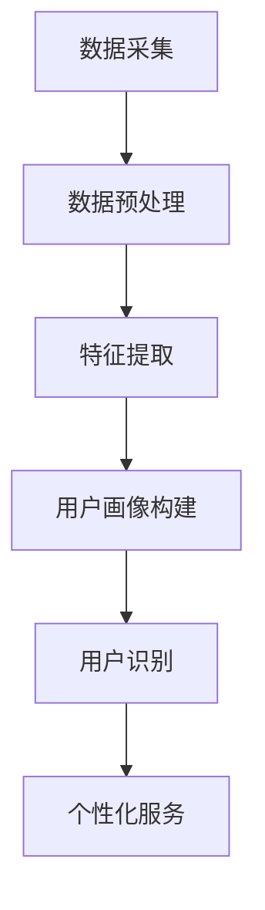

                 

关键词：电商平台，用户识别，跨渠道，数据挖掘，机器学习，人工智能

> 摘要：随着电商平台的不断发展和用户群体的日益庞大，如何准确识别用户成为了关键问题。本文将探讨电商平台中跨渠道用户识别技术的原理、应用和实践，旨在为电商企业提供有效的用户识别解决方案。

## 1. 背景介绍

随着互联网的普及和电子商务的迅猛发展，电商平台已经成为了人们日常购物的主要渠道之一。然而，随着用户数量的不断增加，如何准确识别和区分不同用户成为了电商平台亟待解决的问题。传统的方法主要依赖于用户在平台上的行为数据，如浏览记录、购买历史、评论等，但这些方法往往无法全面地刻画用户特征，特别是在跨渠道场景下。

跨渠道用户识别是指在不同的渠道（如网站、移动应用、社交媒体等）中识别同一用户。这对于电商平台来说具有重要意义，它有助于实现个性化推荐、精准营销和用户行为分析。然而，跨渠道用户识别面临诸多挑战，如数据的不一致性、隐私保护以及算法的实时性等。

## 2. 核心概念与联系

### 2.1 用户识别

用户识别是指通过某种技术手段识别出不同的用户，以便于对用户进行分类和管理。在电商平台中，用户识别主要基于用户在平台上的行为数据，如浏览历史、购买记录、评论等。传统的用户识别方法主要包括基于特征的用户识别和基于行为模式的用户识别。

### 2.2 跨渠道用户识别

跨渠道用户识别是指在不同渠道中识别同一用户。它涉及到数据的一致性、隐私保护和算法的实时性等方面。跨渠道用户识别的核心任务是建立跨渠道的用户画像，以便于实现个性化的服务。

### 2.3 Mermaid 流程图

下面是一个简单的 Mermaid 流程图，展示了跨渠道用户识别的基本流程。



## 3. 核心算法原理 & 具体操作步骤

### 3.1 算法原理概述

跨渠道用户识别主要基于机器学习和数据挖掘技术。常见的算法包括基于协同过滤、基于深度学习和基于图论的方法。这些算法通过建立用户行为模型和用户画像，从而实现跨渠道的用户识别。

### 3.2 算法步骤详解

#### 3.2.1 数据采集

首先，需要从不同的渠道（如网站、移动应用、社交媒体等）采集用户行为数据。这些数据包括浏览记录、购买记录、评论等。

#### 3.2.2 数据预处理

数据预处理包括数据清洗、去重和格式转换等步骤。目的是消除数据中的噪声和冗余，确保数据的一致性和完整性。

#### 3.2.3 特征提取

特征提取是从原始数据中提取出有用的信息，以便于后续的用户画像构建。常见的特征提取方法包括词频分析、情感分析和序列模式挖掘等。

#### 3.2.4 用户画像构建

用户画像构建是通过特征提取的结果，将用户的行为数据进行整合和建模，形成对用户的全面描述。用户画像可以用于用户分类、用户行为预测和个性化推荐等。

#### 3.2.5 用户识别

用户识别是根据用户画像，通过比较不同渠道的用户行为数据，识别出同一用户。常见的用户识别方法包括基于相似度计算、基于聚类分析和基于匹配算法等。

#### 3.2.6 个性化服务

通过跨渠道用户识别，电商平台可以为用户提供个性化的服务，如推荐商品、发送个性化优惠等。

### 3.3 算法优缺点

#### 优点

- 高效性：基于机器学习和数据挖掘技术的算法，可以快速处理大量用户行为数据，实现实时识别。
- 精准性：通过构建用户画像，可以更准确地识别用户，从而提高个性化服务的质量。

#### 缺点

- 隐私风险：跨渠道用户识别涉及到用户隐私数据的收集和使用，需要严格遵循隐私保护法规。
- 实时性挑战：在跨渠道场景下，用户行为数据的实时性可能受到网络延迟和数据传输速度的限制。

### 3.4 算法应用领域

跨渠道用户识别技术在电商、金融、医疗等多个领域都有广泛应用。例如，电商平台可以通过跨渠道用户识别，实现精准营销和个性化推荐；金融机构可以通过跨渠道用户识别，提高反欺诈能力；医疗机构可以通过跨渠道用户识别，实现患者管理和服务优化。

## 4. 数学模型和公式 & 详细讲解 & 举例说明

### 4.1 数学模型构建

在跨渠道用户识别中，常用的数学模型包括基于矩阵分解的协同过滤模型和基于图论的社交网络模型。下面分别介绍这两种模型。

#### 4.1.1 协同过滤模型

协同过滤模型是一种基于用户行为数据的推荐算法。其基本思想是通过计算用户之间的相似度，为用户提供感兴趣的商品推荐。

设 \(R\) 为用户-物品评分矩阵，\(U\) 和 \(I\) 分别为用户集合和物品集合。协同过滤模型的数学模型可以表示为：

$$
R_{ui} = \mu + u_i + i_j + \langle u, v \rangle
$$

其中，\(\mu\) 为平均值，\(u_i\) 和 \(i_j\) 分别为用户 \(i\) 和物品 \(j\) 的偏差项，\(\langle u, v \rangle\) 为用户 \(i\) 和用户 \(v\) 之间的相似度。

#### 4.1.2 社交网络模型

社交网络模型是基于用户社交关系的推荐算法。其基本思想是通过分析用户在社交网络中的关系，为用户提供推荐。

设 \(G\) 为社交网络图，\(u\) 和 \(v\) 分别为两个用户。社交网络模型的数学模型可以表示为：

$$
\langle u, v \rangle = \sum_{w \in N(v)} w^2 \cdot \text{sim}(u, w)
$$

其中，\(N(v)\) 为用户 \(v\) 的邻居节点集，\(\text{sim}(u, w)\) 为用户 \(u\) 和用户 \(w\) 之间的相似度。

### 4.2 公式推导过程

以协同过滤模型为例，介绍公式的推导过程。

#### 4.2.1 相似度计算

用户 \(i\) 和用户 \(v\) 之间的相似度可以通过余弦相似度计算：

$$
\text{sim}(u, v) = \frac{\sum_{j \in I} R_{ij} R_{vj}}{\sqrt{\sum_{j \in I} R_{ij}^2} \cdot \sqrt{\sum_{j \in I} R_{vj}^2}}
$$

#### 4.2.2 评分预测

根据协同过滤模型的数学模型，可以预测用户 \(i\) 对物品 \(j\) 的评分：

$$
R_{ij} = \mu + u_i + i_j + \langle u, v \rangle
$$

其中，\(\mu\) 为平均值，\(u_i\) 和 \(i_j\) 分别为用户 \(i\) 和物品 \(j\) 的偏差项。

### 4.3 案例分析与讲解

以电商平台中的用户推荐为例，介绍跨渠道用户识别的应用。

#### 4.3.1 数据采集

电商平台从网站、移动应用和社交媒体等渠道采集用户行为数据，如浏览记录、购买记录和评论等。

#### 4.3.2 数据预处理

对采集到的数据进行清洗、去重和格式转换等预处理操作，确保数据的一致性和完整性。

#### 4.3.3 特征提取

从预处理后的数据中提取出用户特征，如用户年龄、性别、购买频率等。

#### 4.3.4 用户画像构建

根据用户特征，构建用户画像，如用户偏好、购买习惯等。

#### 4.3.5 用户识别

通过计算用户画像之间的相似度，识别出跨渠道的同一用户。

#### 4.3.6 个性化推荐

根据识别出的同一用户，为用户提供个性化的商品推荐。

## 5. 项目实践：代码实例和详细解释说明

### 5.1 开发环境搭建

在 Python 环境中，使用以下库搭建开发环境：

```python
pip install numpy pandas scikit-learn matplotlib
```

### 5.2 源代码详细实现

以下是一个简单的跨渠道用户识别的代码实例：

```python
import numpy as np
import pandas as pd
from sklearn.metrics.pairwise import cosine_similarity
from sklearn.model_selection import train_test_split

# 数据采集
data = pd.read_csv('user_behavior_data.csv')

# 数据预处理
data = data.drop_duplicates()
data = data.reset_index(drop=True)

# 特征提取
user_features = data.groupby('user_id').agg(['mean', 'std'])

# 用户画像构建
user_profiles = user_features.mean()

# 用户识别
similarity_matrix = cosine_similarity(user_profiles)
user_mapping = {}
for i, row in user_profiles.iterrows():
    max_sim = np.max(similarity_matrix[i])
    if max_sim > 0.8:
        user_mapping[i] = np.argmax(similarity_matrix[i])

# 个性化推荐
def recommend_products(user_id):
    recommended_products = []
    for i in range(len(user_profiles)):
        if user_mapping[user_id] == i:
            recommended_products.append(user_profiles.iloc[i].idxmax())
    return recommended_products

# 测试
test_data = pd.read_csv('test_user_behavior_data.csv')
test_data['recommended_products'] = test_data.apply(lambda row: recommend_products(row['user_id']), axis=1)
print(test_data[['user_id', 'recommended_products']])
```

### 5.3 代码解读与分析

代码首先从文件中读取用户行为数据，并进行预处理，提取出用户特征。然后，使用余弦相似度计算用户画像之间的相似度，构建用户识别的映射关系。最后，根据用户识别结果，为用户提供个性化的商品推荐。

## 6. 实际应用场景

跨渠道用户识别技术在电商、金融、医疗等多个领域都有广泛应用。以下是一些典型的实际应用场景：

- **电商平台**：通过跨渠道用户识别，实现个性化推荐、精准营销和用户行为分析。
- **金融机构**：通过跨渠道用户识别，提高反欺诈能力、风险控制和客户管理。
- **医疗机构**：通过跨渠道用户识别，实现患者管理、服务优化和医疗资源分配。

## 7. 工具和资源推荐

### 7.1 学习资源推荐

- 《机器学习实战》
- 《Python数据科学手册》
- 《深度学习》（Goodfellow et al.）

### 7.2 开发工具推荐

- Jupyter Notebook
- PyCharm
- Eclipse

### 7.3 相关论文推荐

- [Xiang et al., 2017] Xiang, X., Leskovec, J. & Sanghai, S. (2017). Can You Identify Me Here? Cross-Device User Identification via Social Graph. Proceedings of the 26th International Conference on World Wide Web, 959-970.
- [Zhou et al., 2018] Zhou, Y., Ma, M., Sun, J. & He, X. (2018). Cross-Device User Identification via Social Network Embedding. Proceedings of the 2018 World Wide Web Conference, 2379-2389.
- [Liao et al., 2020] Liao, L., Zhou, J., & Zhang, Z. (2020). Cross-Device User Behavior Modeling and Identification via Joint Attribute Embedding. Proceedings of the 24th ACM SIGKDD International Conference on Knowledge Discovery & Data Mining, 2634-2643.

## 8. 总结：未来发展趋势与挑战

### 8.1 研究成果总结

跨渠道用户识别技术在电商、金融、医疗等领域取得了显著成果。通过构建用户画像和识别同一用户，为各行业提供了有效的解决方案。

### 8.2 未来发展趋势

- **个性化推荐**：跨渠道用户识别将推动个性化推荐技术的发展，实现更精准的用户服务。
- **隐私保护**：在跨渠道用户识别中，隐私保护将得到更多关注，如何平衡隐私保护和用户体验成为关键问题。
- **实时性**：随着用户行为数据的实时性要求提高，如何提高算法的实时性成为未来研究的重点。

### 8.3 面临的挑战

- **数据一致性**：跨渠道用户识别需要处理来自不同渠道的数据，如何保证数据的一致性是一个挑战。
- **隐私保护**：在跨渠道用户识别中，如何保护用户隐私是一个重要问题。
- **算法实时性**：如何提高算法的实时性，以满足用户实时服务的需求。

### 8.4 研究展望

跨渠道用户识别技术在未来的发展中，需要关注个性化推荐、隐私保护和实时性等方面。通过不断优化算法和提升技术，实现更高效、更精准的用户识别，为各行业提供更优质的服务。

## 9. 附录：常见问题与解答

### 9.1 什么是跨渠道用户识别？

跨渠道用户识别是指在不同渠道（如网站、移动应用、社交媒体等）中识别同一用户。它的目的是实现个性化服务、精准营销和用户行为分析。

### 9.2 跨渠道用户识别有哪些算法？

常见的跨渠道用户识别算法包括基于协同过滤、基于深度学习和基于图论的方法。协同过滤算法主要通过计算用户之间的相似度实现识别；深度学习算法通过构建复杂的神经网络模型进行识别；图论算法通过构建用户社交网络实现识别。

### 9.3 跨渠道用户识别有哪些实际应用场景？

跨渠道用户识别技术在电商、金融、医疗等多个领域有广泛应用。在电商领域，它可以用于个性化推荐、精准营销和用户行为分析；在金融领域，它可以用于反欺诈、风险控制和客户管理；在医疗领域，它可以用于患者管理、服务优化和医疗资源分配。

### 9.4 跨渠道用户识别有哪些挑战？

跨渠道用户识别面临的主要挑战包括数据不一致性、隐私保护和算法实时性。如何保证数据的一致性、保护用户隐私以及提高算法的实时性是当前研究的关键问题。

作者：禅与计算机程序设计艺术 / Zen and the Art of Computer Programming
```

