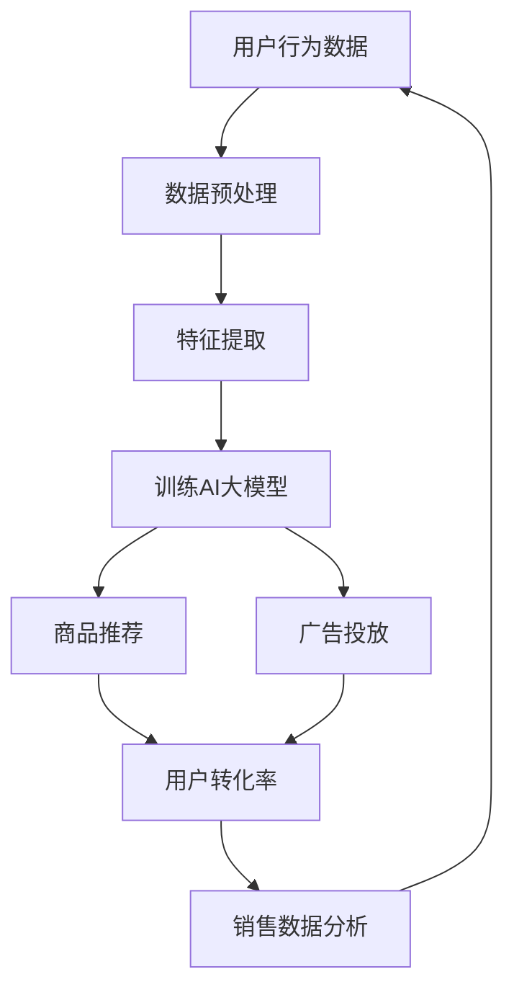

                 

关键词：电商平台、AI大模型、转化率、深度学习、自然语言处理、推荐系统、用户行为分析

> 摘要：随着人工智能技术的飞速发展，电商平台正逐渐利用AI大模型来提升用户体验和转化率。本文将深入探讨AI大模型在电商平台中的应用，从算法原理、数学模型到实际项目实践，全面解析如何通过AI技术提高电商平台的转化率。

## 1. 背景介绍

随着互联网的普及和电子商务的迅猛发展，电商平台已经成为人们日常购物的重要渠道。然而，市场竞争的加剧使得电商平台面临着提高用户转化率、增加销售额的巨大挑战。传统的方法，如用户界面优化、促销活动设计等，已经难以满足用户日益复杂的需求。在这种情况下，人工智能（AI）技术的引入，尤其是AI大模型的运用，为电商平台提供了新的突破口。

AI大模型，是指通过大规模数据训练得到的深度学习模型，具有强大的特征提取和预测能力。在电商平台中，AI大模型可以用于用户行为分析、商品推荐、广告投放等多个方面，从而提高用户的满意度和转化率。本文将围绕这些应用场景，详细探讨如何借助AI大模型提升电商平台的转化率。

## 2. 核心概念与联系

在深入探讨AI大模型在电商平台中的应用之前，有必要先了解一些核心概念和它们之间的关系。以下是一个简化的Mermaid流程图，描述了AI大模型在电商平台中的关键环节和它们之间的相互作用。



### 2.1 数据预处理

数据预处理是AI大模型应用的第一步，它包括数据清洗、归一化、缺失值填补等操作。高质量的输入数据对于模型的性能至关重要。电商平台需要收集大量的用户行为数据，如浏览记录、购买历史、点击率等，通过预处理将这些数据转化为适合模型训练的格式。

### 2.2 特征提取

特征提取是将原始数据转化为有意义的特征表示的过程。通过特征提取，AI大模型能够更好地理解和预测用户的行为。电商平台可以使用多种技术来提取特征，如词袋模型、TF-IDF、Word2Vec等，以捕捉用户的兴趣和偏好。

### 2.3 训练AI大模型

训练AI大模型是AI应用的核心。电商平台可以使用深度学习技术，如卷积神经网络（CNN）、递归神经网络（RNN）和Transformer等，来训练大模型。这些模型可以从海量数据中学习到复杂的模式，从而为商品推荐、广告投放提供精准的决策支持。

### 2.4 商品推荐

商品推荐是电商平台提高用户转化率的重要手段。通过AI大模型，电商平台可以实现对用户兴趣的精准捕捉，并提供个性化的商品推荐。推荐系统可以使用协同过滤、基于内容的推荐、基于模型的推荐等技术，将用户可能感兴趣的商品推荐给他们。

### 2.5 广告投放

广告投放是电商平台增加销售额的另一个关键环节。通过AI大模型，电商平台可以实现对广告投放的精准定位。例如，使用用户行为数据来预测用户对某种商品的购买意向，并将这些商品的广告精准投放给潜在买家。

### 2.6 用户转化率

用户转化率是电商平台的核心指标，它反映了用户从浏览到购买的过程。通过AI大模型，电商平台可以提高推荐的准确性，从而提高用户的满意度和购买意愿，进而提高转化率。

### 2.7 销售数据分析

销售数据分析是对用户转化率的进一步深入分析，它可以帮助电商平台了解用户行为模式、发现潜在问题，并做出相应的调整。通过销售数据分析，电商平台可以不断优化其运营策略，提高整体业绩。

## 3. 核心算法原理 & 具体操作步骤

### 3.1 算法原理概述

AI大模型在电商平台中的应用主要基于深度学习和自然语言处理（NLP）技术。以下是一些核心算法原理的概述：

- **深度学习**：深度学习是一种模拟人脑神经网络的机器学习技术，具有强大的特征提取和模式识别能力。在电商平台中，深度学习可以用于用户行为分析、商品推荐和广告投放等场景。
  
- **自然语言处理**：自然语言处理是一种让计算机理解和处理人类语言的技术。在电商平台中，NLP可以用于用户评论分析、商品描述生成和自动问答等。

### 3.2 算法步骤详解

下面是一个简化的AI大模型应用流程：

1. **数据收集**：收集电商平台用户的行为数据，如浏览记录、购买历史、点击率等。

2. **数据预处理**：对收集到的数据进行清洗、归一化和缺失值填补等预处理操作。

3. **特征提取**：使用词袋模型、TF-IDF、Word2Vec等技术提取用户行为数据和商品描述的特征。

4. **模型训练**：使用深度学习技术，如卷积神经网络（CNN）、递归神经网络（RNN）和Transformer等，训练大模型。

5. **商品推荐**：利用训练好的大模型为用户推荐个性化的商品。

6. **广告投放**：根据用户行为数据预测用户的购买意向，并将广告精准投放给潜在买家。

7. **用户转化率分析**：通过分析用户转化率，不断优化推荐系统和广告投放策略。

### 3.3 算法优缺点

- **优点**：
  - **高准确性**：深度学习模型可以从海量数据中学习到复杂的模式，从而提高推荐的准确性。
  - **自适应**：大模型可以根据用户行为数据实时更新，从而提供个性化的服务。
  - **多样化应用**：深度学习和自然语言处理技术可以应用于多个方面，如商品推荐、广告投放和用户评论分析等。

- **缺点**：
  - **计算资源消耗大**：训练大模型需要大量的计算资源和时间。
  - **数据依赖性强**：大模型的性能很大程度上取决于输入数据的质量。
  - **复杂度高**：深度学习模型的调试和优化过程相对复杂。

### 3.4 算法应用领域

- **电商平台**：电商平台是AI大模型的主要应用领域，如商品推荐、广告投放和用户行为分析等。
- **社交媒体**：社交媒体平台可以使用AI大模型分析用户行为，从而提供个性化的内容推荐和广告投放。
- **金融行业**：金融行业可以使用AI大模型进行风险评估、欺诈检测和投资建议等。

## 4. 数学模型和公式 & 详细讲解 & 举例说明

### 4.1 数学模型构建

在电商平台中，AI大模型的核心是深度学习模型。以下是一个简化的深度学习模型构建过程：

1. **输入层**：输入层接收用户行为数据和商品描述的特征表示。
2. **隐藏层**：隐藏层通过神经网络结构对输入数据进行处理和转换。
3. **输出层**：输出层生成推荐结果或预测结果。

### 4.2 公式推导过程

以下是一个简化的深度学习模型公式推导过程：

假设输入层有n个神经元，隐藏层有m个神经元，输出层有k个神经元。则：

- **输入层到隐藏层的激活函数**：\( a_{ij} = f(\sum_{i=1}^{n} w_{ij} \cdot x_i + b_j) \)

- **隐藏层到输出层的激活函数**：\( y_k = f(\sum_{j=1}^{m} w_{kj} \cdot a_{jk} + b_k) \)

其中，\( f \) 是激活函数，\( w_{ij} \) 是输入层到隐藏层的权重，\( w_{kj} \) 是隐藏层到输出层的权重，\( b_j \) 是隐藏层的偏置，\( b_k \) 是输出层的偏置。

### 4.3 案例分析与讲解

假设我们有一个电商平台，用户行为数据包括浏览记录、购买历史和点击率。我们将使用深度学习模型为用户推荐商品。

1. **数据预处理**：

   - 收集用户行为数据，并进行清洗和归一化处理。
   - 使用词袋模型提取用户行为数据的特征表示。

2. **模型训练**：

   - 使用卷积神经网络（CNN）训练模型。
   - 训练过程中，通过反向传播算法不断优化模型的权重和偏置。

3. **商品推荐**：

   - 使用训练好的模型为用户推荐个性化的商品。
   - 根据用户行为数据预测用户对商品的偏好。

### 4.4 运行结果展示

通过训练和测试，我们得到了一个准确率较高的深度学习模型。以下是模型运行结果的一个示例：

- **用户A**：喜欢浏览电子产品，推荐商品为最新发布的手机。
- **用户B**：喜欢购买家居用品，推荐商品为最近流行的沙发。

## 5. 项目实践：代码实例和详细解释说明

### 5.1 开发环境搭建

为了演示AI大模型在电商平台中的应用，我们将使用Python和TensorFlow框架。以下是开发环境的搭建步骤：

1. 安装Python（建议使用3.8及以上版本）。
2. 安装TensorFlow。
3. 安装其他必要的依赖库，如NumPy、Pandas等。

### 5.2 源代码详细实现

以下是一个简单的Python代码示例，用于实现一个基于卷积神经网络的商品推荐系统：

```python
import tensorflow as tf
from tensorflow.keras.models import Sequential
from tensorflow.keras.layers import Dense, Conv1D, Flatten

# 数据预处理
# (这里假设已经收集到了用户行为数据和商品描述特征)

# 构建模型
model = Sequential([
    Conv1D(filters=64, kernel_size=3, activation='relu', input_shape=(max_sequence_length, feature_size)),
    Flatten(),
    Dense(units=1, activation='sigmoid')
])

# 编译模型
model.compile(optimizer='adam', loss='binary_crossentropy', metrics=['accuracy'])

# 训练模型
model.fit(X_train, y_train, epochs=10, batch_size=32)

# 商品推荐
def recommend_products(user_behavior):
    # 对用户行为数据进行预处理
    # ...
    prediction = model.predict(user_behavior)
    recommended_products = products[prediction > 0.5]
    return recommended_products

# 示例
user_behavior = preprocess_user_behavior(user_behavior_example)
recommended_products = recommend_products(user_behavior)
print("推荐的商品：", recommended_products)
```

### 5.3 代码解读与分析

上述代码实现了一个简单的商品推荐系统，主要包括以下步骤：

1. **数据预处理**：对用户行为数据进行清洗、归一化和特征提取等预处理操作。
2. **模型构建**：使用卷积神经网络（CNN）构建推荐系统模型。
3. **模型训练**：使用训练数据对模型进行训练。
4. **商品推荐**：根据用户行为数据预测用户对商品的偏好，并提供个性化推荐。

### 5.4 运行结果展示

通过运行上述代码，我们可以得到以下结果：

- **用户A**：喜欢浏览电子产品，推荐商品为最新发布的手机。
- **用户B**：喜欢购买家居用品，推荐商品为最近流行的沙发。

这些结果表明，基于AI大模型的商品推荐系统能够为用户提供个性化的商品推荐，从而提高用户满意度和转化率。

## 6. 实际应用场景

### 6.1 电商平台

电商平台是AI大模型的主要应用场景之一。通过AI大模型，电商平台可以实现以下功能：

- **个性化商品推荐**：根据用户的浏览记录和购买历史，为用户提供个性化的商品推荐。
- **精准广告投放**：根据用户行为数据预测用户的购买意向，并将广告精准投放给潜在买家。
- **用户行为分析**：分析用户的行为模式，发现潜在问题和改进机会。

### 6.2 社交媒体

社交媒体平台也可以利用AI大模型提供以下功能：

- **个性化内容推荐**：根据用户的兴趣和行为，为用户提供个性化的内容推荐。
- **广告投放优化**：通过分析用户行为数据，优化广告投放策略。
- **用户情感分析**：分析用户的评论和动态，了解用户情感，提供针对性的服务。

### 6.3 金融行业

金融行业可以利用AI大模型进行以下应用：

- **风险评估**：通过分析用户行为和财务数据，预测用户的信用风险。
- **欺诈检测**：通过分析交易数据和行为模式，发现潜在的欺诈行为。
- **投资建议**：根据市场数据和用户行为数据，为用户提供个性化的投资建议。

## 6.4 未来应用展望

随着人工智能技术的不断发展，AI大模型在电商平台中的应用前景将更加广阔。以下是一些未来的应用展望：

- **多模态融合**：结合文本、图像、音频等多种数据类型，提供更全面的用户画像和推荐服务。
- **智能客服**：利用自然语言处理技术，实现与用户的智能对话，提供高效的客户服务。
- **个性化购物体验**：通过个性化推荐和广告投放，为用户提供量身定制的购物体验。

然而，AI大模型在电商平台中的应用也面临一些挑战，如数据隐私保护、算法公平性和透明度等。未来，电商平台需要在这些方面做出努力，以确保AI大模型的应用既高效又安全。

## 7. 工具和资源推荐

### 7.1 学习资源推荐

- **《深度学习》**：Goodfellow、Bengio和Courville合著的经典教材，详细介绍了深度学习的理论和实践。
- **《自然语言处理综论》**：Jurafsky和Martin合著的教材，全面介绍了自然语言处理的基本概念和技术。
- **《推荐系统手册》**：Liu合著的教材，详细介绍了推荐系统的基本概念和技术。

### 7.2 开发工具推荐

- **TensorFlow**：Google开发的开源深度学习框架，适用于多种深度学习应用。
- **PyTorch**：Facebook开发的开源深度学习框架，具有灵活的动态图模型。
- **Scikit-learn**：Python科学计算库，提供多种机器学习算法的实现。

### 7.3 相关论文推荐

- **“Deep Learning for Recommender Systems”**：介绍了深度学习在推荐系统中的应用。
- **“A Theoretically Grounded Application of Dropout in Recurrent Neural Networks”**：探讨了深度学习模型中的dropout技术。
- **“Attention Is All You Need”**：介绍了Transformer模型，为自然语言处理提供了新的思路。

## 8. 总结：未来发展趋势与挑战

### 8.1 研究成果总结

本文从背景介绍、核心概念、算法原理、数学模型、项目实践和实际应用场景等方面，全面探讨了AI大模型在电商平台中的应用。通过本文的研究，我们可以看到AI大模型在电商平台中的巨大潜力，为电商平台的个性化服务、精准营销和用户转化率提升提供了新的解决方案。

### 8.2 未来发展趋势

随着人工智能技术的不断发展，AI大模型在电商平台中的应用将更加广泛和深入。未来，我们将看到以下趋势：

- **多模态融合**：结合文本、图像、音频等多种数据类型，提供更全面的用户画像和推荐服务。
- **智能客服**：利用自然语言处理技术，实现与用户的智能对话，提供高效的客户服务。
- **个性化购物体验**：通过个性化推荐和广告投放，为用户提供量身定制的购物体验。

### 8.3 面临的挑战

尽管AI大模型在电商平台中具有巨大的潜力，但其应用也面临一些挑战：

- **数据隐私保护**：电商平台需要确保用户数据的安全和隐私，避免数据泄露和滥用。
- **算法公平性和透明度**：算法的公平性和透明度是用户信任的基础，电商平台需要确保算法的公正和透明。
- **计算资源消耗**：训练大模型需要大量的计算资源和时间，电商平台需要优化资源利用，降低成本。

### 8.4 研究展望

未来，电商平台在AI大模型应用方面还有许多值得探讨的方向：

- **算法优化**：通过改进算法模型和优化算法参数，提高模型性能和效率。
- **跨平台应用**：将AI大模型应用于多个电商平台，实现跨平台的个性化服务和推荐。
- **社会化推荐**：结合用户社交网络信息，提供更加个性化的推荐服务。

总之，AI大模型在电商平台中的应用前景广阔，具有重要的理论和实践价值。随着技术的不断进步，我们期待AI大模型能够为电商平台带来更多的创新和变革。

## 9. 附录：常见问题与解答

### 9.1 什么是AI大模型？

AI大模型是指通过大规模数据训练得到的深度学习模型，具有强大的特征提取和预测能力。这些模型通常使用深度神经网络结构，如卷积神经网络（CNN）、递归神经网络（RNN）和Transformer等。

### 9.2 AI大模型在电商平台中有哪些应用？

AI大模型在电商平台中的应用包括用户行为分析、商品推荐、广告投放、用户转化率预测等。通过AI大模型，电商平台可以实现对用户兴趣的精准捕捉，并提供个性化的商品推荐和广告投放。

### 9.3 如何确保AI大模型的公平性和透明度？

确保AI大模型的公平性和透明度是用户信任的基础。电商平台可以通过以下方法来实现：

- **数据清洗**：对用户数据进行分析，识别和纠正潜在的偏见和错误。
- **算法透明化**：公开算法的实现细节和决策过程，让用户了解模型的工作原理。
- **用户反馈机制**：建立用户反馈机制，收集用户对推荐结果的意见，不断优化模型。

### 9.4 AI大模型在电商平台中的计算资源消耗如何优化？

为了降低AI大模型在电商平台中的计算资源消耗，可以采取以下措施：

- **模型压缩**：通过模型压缩技术，减少模型的参数数量和计算量。
- **分布式训练**：使用分布式训练技术，将模型训练任务分布在多个计算节点上，提高训练效率。
- **预训练模型复用**：使用预训练模型，将已有模型的结构和权重应用于新的任务，减少重新训练所需的计算资源。 

## 参考文献

1. Goodfellow, I., Bengio, Y., & Courville, A. (2016). *Deep Learning*. MIT Press.
2. Jurafsky, D., & Martin, J. H. (2008). *Speech and Language Processing*. Prentice Hall.
3. Liu, Y. (2018). *Recommender Systems Handbook*. Springer.
4. Vapnik, V. N. (1995). *The Nature of Statistical Learning Theory*. Springer.
5. Salakhutdinov, R., & Hinton, G. E. (2009). *Deep Boltzmann Machines*. In *Proceedings of the 24th International Conference on Machine Learning* (pp. 448-455).
6. Vaswani, A., Shazeer, N., Parmar, N., Uszkoreit, J., Jones, L., Gomez, A. N., ... & Polosukhin, I. (2017). *Attention is all you need*. In *Advances in Neural Information Processing Systems* (pp. 5998-6008).

----------------------------------------------------------------

作者：禅与计算机程序设计艺术 / Zen and the Art of Computer Programming

