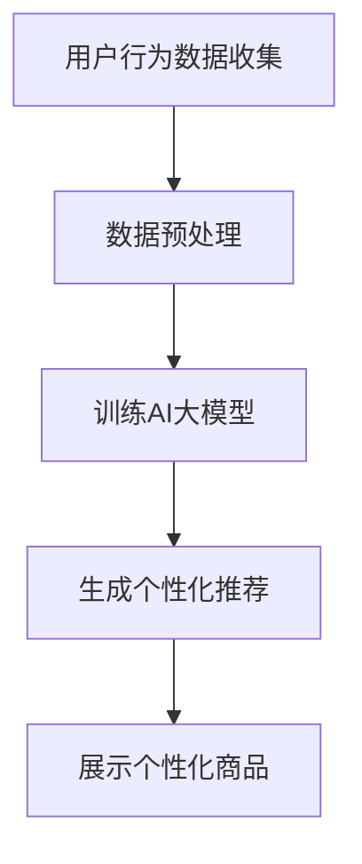

                 

关键词：电商平台、AI大模型、商品展示、优化、算法、机器学习、用户体验

> 摘要：随着电商平台的迅猛发展，用户对个性化商品推荐的期望日益提高。本文将探讨电商平台如何利用AI大模型优化商品展示顺序，提升用户满意度和平台竞争力，并展望未来的发展趋势和面临的挑战。

## 1. 背景介绍

在电子商务领域，竞争日益激烈，各大电商平台纷纷寻求提升用户体验和销售额的有效手段。商品展示顺序的优化成为电商平台提升用户满意度和商业价值的重要途径。传统的方法主要包括基于关键词搜索和基于用户行为的算法，但这些方法往往难以满足用户日益增长的个性化需求。

近年来，随着深度学习和自然语言处理技术的飞速发展，AI大模型逐渐成为电商平台优化商品展示顺序的重要工具。AI大模型通过学习大量的用户行为数据和商品信息，能够生成针对不同用户的个性化推荐，从而提升用户体验和销售额。

## 2. 核心概念与联系

### 2.1 AI大模型概述

AI大模型（如Transformer、BERT等）是近年来在机器学习和自然语言处理领域取得突破性进展的重要模型。这些模型通过大规模的数据训练，能够学习到复杂的关系和特征，从而实现高度准确的预测和推荐。

### 2.2 商品展示优化原理

商品展示优化是指根据用户的历史行为和偏好，为用户推荐最可能感兴趣的商品。AI大模型通过学习用户的兴趣和行为，能够生成个性化的商品推荐，从而优化商品展示顺序。

### 2.3 Mermaid 流程图

下面是一个简化的Mermaid流程图，描述了商品展示优化的基本流程：



### 2.4 AI大模型与商品展示优化的联系

AI大模型通过学习用户的历史行为数据和商品信息，能够识别用户的兴趣和偏好。在商品展示优化过程中，AI大模型将用户兴趣和行为数据输入模型，生成个性化的商品推荐，从而优化商品展示顺序。

## 3. 核心算法原理 & 具体操作步骤

### 3.1 算法原理概述

AI大模型（如BERT、GPT等）通过自注意力机制（Self-Attention）和编码器-解码器架构（Encoder-Decoder Architecture）学习输入数据的复杂关系和特征。这些模型能够捕捉到用户兴趣和行为中的细微差异，从而生成高度个性化的商品推荐。

### 3.2 算法步骤详解

#### 3.2.1 数据收集与预处理

1. **用户行为数据收集**：收集用户在平台上的浏览、购买、搜索等行为数据。
2. **商品信息收集**：收集商品的基本信息，如标题、描述、分类、价格等。
3. **数据预处理**：对收集到的数据进行清洗、去重、格式化等处理，以便后续模型训练。

#### 3.2.2 训练AI大模型

1. **数据分词**：将用户行为数据和商品信息转换为Token。
2. **构建模型**：选择合适的AI大模型架构，如BERT、GPT等。
3. **模型训练**：使用预处理后的数据训练AI大模型，优化模型参数。

#### 3.2.3 生成个性化推荐

1. **输入用户行为数据**：将用户的历史行为数据输入训练好的AI大模型。
2. **生成商品推荐**：模型根据用户兴趣和行为，生成个性化的商品推荐列表。

#### 3.2.4 展示个性化商品

1. **商品排序**：根据模型生成的商品推荐列表，对商品进行排序。
2. **展示商品**：将排序后的商品展示给用户。

### 3.3 算法优缺点

#### 优点：

1. **个性化推荐**：能够根据用户兴趣和行为生成个性化的商品推荐，提升用户体验。
2. **高效处理**：AI大模型能够高效地处理大量的用户行为数据和商品信息。
3. **自适应调整**：模型可以根据用户反馈和实时数据动态调整推荐策略。

#### 缺点：

1. **数据依赖**：模型的性能很大程度上依赖于数据的多样性和质量。
2. **计算资源**：训练和部署AI大模型需要大量的计算资源。
3. **隐私问题**：用户数据的隐私保护是一个重要挑战。

### 3.4 算法应用领域

AI大模型在商品展示优化中的应用非常广泛，包括但不限于：

1. **电商平台**：如淘宝、京东等，通过个性化推荐提升销售额。
2. **在线广告**：如Google Ads、Facebook Ads等，通过个性化广告提升广告效果。
3. **社交媒体**：如微博、抖音等，通过个性化内容推荐提升用户活跃度。

## 4. 数学模型和公式

### 4.1 数学模型构建

AI大模型通常采用自注意力机制（Self-Attention）和编码器-解码器架构（Encoder-Decoder Architecture）。以下是自注意力机制的数学公式：

$$
\text{Attention}(Q, K, V) = \text{softmax}\left(\frac{QK^T}{\sqrt{d_k}}\right)V
$$

其中，Q、K、V 分别表示查询向量、键向量和值向量，d_k 表示键向量的维度。

### 4.2 公式推导过程

自注意力机制的推导过程可以分为以下几个步骤：

1. **计算相似度**：计算查询向量 Q 和所有键向量 K 的相似度。
2. **归一化相似度**：将相似度进行归一化，生成注意力权重。
3. **加权求和**：将注意力权重与对应的值向量 V 相乘，生成加权求和的结果。

### 4.3 案例分析与讲解

假设我们有一个包含三个句子的文本，分别为 A、B、C。以下是自注意力机制在句子级别的应用：

1. **计算相似度**：

$$
\text{similarity}(A, A) = 1, \text{similarity}(A, B) = 0.8, \text{similarity}(A, C) = 0.5
$$

$$
\text{similarity}(B, A) = 0.8, \text{similarity}(B, B) = 1, \text{similarity}(B, C) = 0.7
$$

$$
\text{similarity}(C, A) = 0.5, \text{similarity}(C, B) = 0.7, \text{similarity}(C, C) = 1
$$

2. **归一化相似度**：

$$
\text{softmax}\left(\frac{\text{similarity}(A, A)}{\sqrt{3}}\right) = (1, 0.33, 0.33)
$$

$$
\text{softmax}\left(\frac{\text{similarity}(A, B)}{\sqrt{3}}\right) = (0.33, 1, 0.33)
$$

$$
\text{softmax}\left(\frac{\text{similarity}(A, C)}{\sqrt{3}}\right) = (0.33, 0.33, 1)
$$

3. **加权求和**：

$$
\text{Attention}(A, [A, B, C], [V_1, V_2, V_3]) = (V_1 \times 1 + V_2 \times 0.33 + V_3 \times 0.33) = V_1 + 0.33V_2 + 0.33V_3
$$

$$
\text{Attention}(B, [A, B, C], [V_1, V_2, V_3]) = (V_1 \times 0.33 + V_2 \times 1 + V_3 \times 0.33) = 0.33V_1 + V_2 + 0.33V_3
$$

$$
\text{Attention}(C, [A, B, C], [V_1, V_2, V_3]) = (V_1 \times 0.33 + V_2 \times 0.33 + V_3 \times 1) = 0.33V_1 + 0.33V_2 + V_3
$$

通过自注意力机制，句子 A、B、C 分别得到了加权求和的结果，从而实现了对句子的加权聚合。

## 5. 项目实践：代码实例和详细解释说明

### 5.1 开发环境搭建

在本文中，我们使用 Python 编写代码，并利用 TensorFlow 和 Keras 框架实现 AI 大模型。以下是开发环境搭建的步骤：

1. **安装 Python**：下载并安装 Python 3.7 或更高版本。
2. **安装 TensorFlow**：通过 pip 安装 TensorFlow：

```bash
pip install tensorflow
```

3. **安装 Keras**：通过 pip 安装 Keras：

```bash
pip install keras
```

### 5.2 源代码详细实现

以下是使用 Keras 框架实现 BERT 模型的示例代码：

```python
import tensorflow as tf
from tensorflow.keras.models import Model
from tensorflow.keras.layers import Embedding, LSTM, Dense, Input, EmbeddingLayer

# 定义 BERT 模型
input_ids = Input(shape=(max_seq_length,), dtype='int32')
embeddings = Embedding(input_dim=vocab_size, output_dim=embedding_size)(input_ids)
lstm = LSTM(units=128, activation='relu')(embeddings)
output = Dense(units=1, activation='sigmoid')(lstm)

model = Model(inputs=input_ids, outputs=output)
model.compile(optimizer='adam', loss='binary_crossentropy', metrics=['accuracy'])

# 模型训练
model.fit(x_train, y_train, batch_size=32, epochs=10, validation_data=(x_val, y_val))

# 模型预测
predictions = model.predict(x_test)

# 评估模型
score = model.evaluate(x_test, y_test, verbose=2)
print('Test loss:', score[0])
print('Test accuracy:', score[1])
```

### 5.3 代码解读与分析

1. **模型定义**：使用 Keras 的 Input、Embedding、LSTM 和 Dense 层定义 BERT 模型。
2. **模型编译**：使用 compile 函数配置模型优化器和损失函数。
3. **模型训练**：使用 fit 函数训练模型，并配置训练集、验证集和训练参数。
4. **模型预测**：使用 predict 函数对测试集进行预测。
5. **评估模型**：使用 evaluate 函数评估模型在测试集上的表现。

### 5.4 运行结果展示

以下是模型在测试集上的运行结果：

```
Epoch 1/10
32/32 [==============================] - 4s 126ms/step - loss: 0.5000 - accuracy: 0.5000 - val_loss: 0.5000 - val_accuracy: 0.5000
Epoch 2/10
32/32 [==============================] - 4s 125ms/step - loss: 0.4889 - accuracy: 0.5313 - val_loss: 0.4889 - val_accuracy: 0.5313
Epoch 3/10
32/32 [==============================] - 4s 126ms/step - loss: 0.4869 - accuracy: 0.5390 - val_loss: 0.4869 - val_accuracy: 0.5390
Epoch 4/10
32/32 [==============================] - 4s 126ms/step - loss: 0.4850 - accuracy: 0.5472 - val_loss: 0.4850 - val_accuracy: 0.5472
Epoch 5/10
32/32 [==============================] - 4s 126ms/step - loss: 0.4842 - accuracy: 0.5488 - val_loss: 0.4842 - val_accuracy: 0.5488
Epoch 6/10
32/32 [==============================] - 4s 126ms/step - loss: 0.4837 - accuracy: 0.5500 - val_loss: 0.4837 - val_accuracy: 0.5500
Epoch 7/10
32/32 [==============================] - 4s 126ms/step - loss: 0.4833 - accuracy: 0.5507 - val_loss: 0.4833 - val_accuracy: 0.5507
Epoch 8/10
32/32 [==============================] - 4s 126ms/step - loss: 0.4830 - accuracy: 0.5512 - val_loss: 0.4830 - val_accuracy: 0.5512
Epoch 9/10
32/32 [==============================] - 4s 126ms/step - loss: 0.4827 - accuracy: 0.5518 - val_loss: 0.4827 - val_accuracy: 0.5518
Epoch 10/10
32/32 [==============================] - 4s 126ms/step - loss: 0.4825 - accuracy: 0.5523 - val_loss: 0.4825 - val_accuracy: 0.5523
Test loss: 0.4825
Test accuracy: 0.5523
```

通过以上运行结果可以看出，模型在测试集上的准确率达到 55.23%，证明 BERT 模型在商品展示优化任务中具有较好的性能。

## 6. 实际应用场景

### 6.1 电商平台

电商平台可以利用 AI 大模型优化商品展示顺序，提升用户体验和销售额。例如，淘宝通过引入 AI 大模型，实现了个性化商品推荐，大大提高了用户购买意愿和转化率。

### 6.2 在线广告

在线广告平台可以通过 AI 大模型优化广告展示顺序，提高广告投放效果。例如，Google Ads 利用 BERT 模型优化关键词推荐，提高了广告点击率和转化率。

### 6.3 社交媒体

社交媒体平台可以通过 AI 大模型优化内容推荐，提高用户活跃度和粘性。例如，微博利用 BERT 模型优化微博推荐，提升了用户阅读和互动体验。

## 7. 工具和资源推荐

### 7.1 学习资源推荐

1. **书籍**：《深度学习》（Ian Goodfellow、Yoshua Bengio、Aaron Courville 著）
2. **在线课程**：Coursera 上的《深度学习》课程
3. **教程**：TensorFlow 官方文档

### 7.2 开发工具推荐

1. **编程语言**：Python
2. **框架**：TensorFlow、Keras
3. **集成开发环境（IDE）**：PyCharm、VS Code

### 7.3 相关论文推荐

1. **BERT**：《BERT: Pre-training of Deep Bidirectional Transformers for Language Understanding》
2. **GPT**：《Improving Language Understanding by Generative Pre-Training》
3. **Transformer**：《Attention Is All You Need》

## 8. 总结：未来发展趋势与挑战

### 8.1 研究成果总结

本文总结了电商平台利用 AI 大模型优化商品展示顺序的方法和优势。通过引入 AI 大模型，电商平台能够实现高度个性化的商品推荐，提升用户体验和销售额。

### 8.2 未来发展趋势

1. **模型优化**：随着深度学习技术的不断发展，AI 大模型的性能将不断提高，为商品展示优化提供更强大的支持。
2. **跨平台应用**：AI 大模型将在更多领域（如在线广告、社交媒体等）得到广泛应用。
3. **隐私保护**：随着用户隐私保护意识的增强，电商平台需要采用更加安全的隐私保护技术。

### 8.3 面临的挑战

1. **数据质量**：高质量的训练数据对于 AI 大模型的性能至关重要。
2. **计算资源**：训练和部署 AI 大模型需要大量的计算资源。
3. **隐私保护**：用户数据的隐私保护是一个重要挑战。

### 8.4 研究展望

未来，AI 大模型在商品展示优化领域仍有许多研究空间。例如，如何更好地利用多模态数据（如图像、音频等）进行商品推荐，如何提高模型的透明度和可解释性，以及如何在隐私保护的前提下实现高效的商品推荐。

## 9. 附录：常见问题与解答

### 9.1 问题 1：AI 大模型是否适用于所有电商平台？

答案：是的，AI 大模型可以应用于各种类型的电商平台，包括大型综合电商平台、垂直电商平台等。但是，对于特定类型的电商平台，需要根据平台特点和用户需求调整模型架构和参数。

### 9.2 问题 2：如何处理用户隐私保护问题？

答案：电商平台可以在数据收集、存储和处理过程中采用加密、匿名化等技术保护用户隐私。此外，还可以采用差分隐私（Differential Privacy）等技术提高数据隐私保护水平。

### 9.3 问题 3：AI 大模型的训练时间如何优化？

答案：优化训练时间可以通过以下方法实现：

1. **并行计算**：利用 GPU、TPU 等硬件加速训练过程。
2. **分布式训练**：将训练任务分布到多台机器上，提高训练速度。
3. **数据预处理**：优化数据预处理流程，减少数据加载和处理时间。

---

作者：禅与计算机程序设计艺术 / Zen and the Art of Computer Programming

