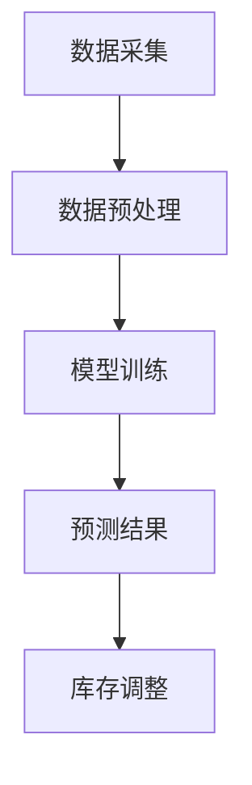

                 

关键词：AI大模型、电商平台、库存预测、优化算法、数据分析、机器学习、深度学习、自然语言处理、神经网络、决策树、协同过滤、强化学习

> 摘要：本文旨在探讨电商平台如何利用人工智能（AI）大模型来优化库存预测。我们将深入分析AI大模型在电商领域的应用场景，解析核心算法原理，展示数学模型和公式的推导过程，并通过实际项目实践分享代码实例和详细解释。此外，文章还将探讨AI大模型在实际应用场景中的效果和未来应用展望，为电商平台优化库存预测提供有价值的参考。

## 1. 背景介绍

在电商行业，库存管理是运营的核心环节之一。准确预测库存需求不仅有助于降低库存成本，还能提升客户满意度。然而，传统的库存预测方法通常依赖于历史数据和简单统计模型，难以应对日益复杂的市场环境和不断变化的消费者需求。随着人工智能技术的快速发展，尤其是深度学习、强化学习等AI大模型的广泛应用，为库存预测带来了全新的可能性。

AI大模型具有以下几个显著优势：

1. **数据处理能力**：AI大模型能够处理海量的数据，挖掘隐藏在数据中的规律，从而提高预测准确性。
2. **适应性强**：AI大模型可以根据不同电商平台的特点和需求进行定制化训练，提高模型的适应性和实用性。
3. **实时预测**：AI大模型可以实时更新数据，快速响应市场变化，提供更精确的库存预测。

本文将详细介绍如何利用AI大模型优化电商平台的库存预测，并探讨相关算法原理、数学模型以及实际应用案例。

## 2. 核心概念与联系

### 2.1. 核心概念

**人工智能（AI）**：人工智能是指通过计算机模拟人类智能行为的技术和理论，包括机器学习、深度学习、自然语言处理等。

**大模型**：大模型通常指的是参数量巨大的神经网络模型，例如GPT-3、BERT等，具有极强的学习和表达能力。

**库存预测**：库存预测是指通过历史销售数据、市场趋势等信息，预测未来某一时间段内的库存需求。

### 2.2. 关联关系

在电商平台中，库存预测与AI大模型之间存在紧密的联系。具体来说：

- **历史数据与AI大模型**：电商平台的历史销售数据是训练AI大模型的重要来源，通过深度学习等算法，模型可以从中提取有价值的信息。
- **市场动态与AI大模型**：市场动态的变化，如季节性波动、促销活动等，都会影响库存需求。AI大模型可以通过实时数据更新，动态调整预测结果。

### 2.3. Mermaid 流程图

下面是AI大模型在库存预测中的基本流程：



- **数据采集**：收集电商平台的历史销售数据、市场动态等相关信息。
- **数据预处理**：对数据进行清洗、归一化等处理，确保数据质量。
- **模型训练**：使用深度学习算法训练AI大模型，使其能够预测未来库存需求。
- **预测结果**：根据模型预测结果，制定库存调整策略。
- **库存调整**：根据预测结果，调整库存水平，确保满足市场需求。

## 3. 核心算法原理 & 具体操作步骤

### 3.1 算法原理概述

库存预测的AI大模型主要基于深度学习算法，特别是神经网络和强化学习。以下是对这些算法的简要概述：

- **神经网络**：神经网络通过多层节点（神经元）进行信息传递和计算，能够自动提取特征并进行分类或回归。
- **强化学习**：强化学习是一种通过试错和反馈来优化决策的过程，适用于动态和不确定的环境。

### 3.2 算法步骤详解

#### 3.2.1 数据采集与预处理

1. **数据采集**：收集电商平台的销售数据、库存数据、市场动态等。
2. **数据预处理**：清洗数据，去除噪声和异常值，进行数据归一化等。

#### 3.2.2 模型训练

1. **数据划分**：将数据划分为训练集、验证集和测试集。
2. **模型构建**：使用深度学习框架（如TensorFlow、PyTorch）构建神经网络模型。
3. **模型训练**：使用训练集数据训练模型，通过反向传播算法不断优化模型参数。

#### 3.2.3 预测结果与库存调整

1. **预测结果**：使用训练好的模型对测试集数据进行预测，得到未来库存需求预测结果。
2. **库存调整**：根据预测结果，调整库存水平，制定相应的库存管理策略。

### 3.3 算法优缺点

#### 优点

- **高效性**：深度学习算法能够自动提取特征，提高预测准确性。
- **适应性**：强化学习能够适应动态和不确定的市场环境，提高预测的实时性。

#### 缺点

- **计算成本**：深度学习算法需要大量的计算资源和时间。
- **数据依赖**：模型的性能高度依赖于数据的质量和数量。

### 3.4 算法应用领域

AI大模型在库存预测中的应用非常广泛，不仅适用于电商平台，还可以应用于其他零售行业，如超市、服装店等。

## 4. 数学模型和公式 & 详细讲解 & 举例说明

### 4.1 数学模型构建

库存预测的数学模型通常是一个时间序列模型，可以表示为：

\[ \hat{Q}_t = f(X_t, \theta) \]

其中：

- \( \hat{Q}_t \) 是第 \( t \) 时刻的库存预测值；
- \( X_t \) 是第 \( t \) 时刻的输入特征，包括历史销售数据、市场动态等；
- \( \theta \) 是模型的参数，需要通过训练得到。

### 4.2 公式推导过程

库存预测的时间序列模型可以基于ARIMA（自回归积分滑动平均模型）或LSTM（长短时记忆网络）等。

#### ARIMA模型

ARIMA模型的公式推导过程如下：

\[ \begin{aligned} Y_t &= c + \phi_1 Y_{t-1} + \phi_2 Y_{t-2} + \cdots + \phi_p Y_{t-p} \\ &\quad + \theta_1 e_{t-1} + \theta_2 e_{t-2} + \cdots + \theta_q e_{t-q} \\ e_t &= Y_t - \phi_1 Y_{t-1} - \phi_2 Y_{t-2} - \cdots - \phi_p Y_{t-p} - \theta_1 e_{t-1} - \theta_2 e_{t-2} - \cdots - \theta_q e_{t-q} \end{aligned} \]

其中：

- \( Y_t \) 是时间序列的观测值；
- \( c \) 是常数项；
- \( \phi_i \) 和 \( \theta_i \) 分别是自回归项和移动平均项的系数；
- \( e_t \) 是误差项。

#### LSTM模型

LSTM模型的公式推导过程如下：

\[ \begin{aligned} i_t &= \sigma(W_{ix}x_t + W_{ih}h_{t-1} + b_i) \\ f_t &= \sigma(W_{fx}x_t + W_{fh}h_{t-1} + b_f) \\ o_t &= \sigma(W_{ox}x_t + W_{oh}h_{t-1} + b_o) \\ g_t &= tanh(W_{gx}x_t + W_{gh}h_{t-1} + b_g) \\ h_t &= o_t \cdot tanh(g_t) \end{aligned} \]

其中：

- \( i_t \)、\( f_t \)、\( o_t \) 分别是输入门、遗忘门和输出门的状态；
- \( g_t \) 是输入门的候选状态；
- \( h_t \) 是当前时刻的隐藏状态；
- \( \sigma \) 是Sigmoid函数。

### 4.3 案例分析与讲解

#### ARIMA模型案例

假设我们有一个电商平台的销售数据，数据集如下：

\[ \begin{aligned} &Q_1 = 100, &Q_2 = 110, &Q_3 = 105, &Q_4 = 115, &Q_5 = 120, &\cdots \\ \end{aligned} \]

我们可以使用ARIMA模型进行预测。首先，进行数据的差分处理，得到差分序列：

\[ \begin{aligned} &\Delta Q_1 = Q_2 - Q_1 = 10, &\Delta Q_2 = Q_3 - Q_2 = -5, &\Delta Q_3 = Q_4 - Q_3 = 10, &\Delta Q_4 = Q_5 - Q_4 = 5, &\Delta Q_5 = Q_6 - Q_5 = 10, &\cdots \\ \end{aligned} \]

然后，通过ACF和PACF图确定ARIMA模型的参数：

\[ \begin{aligned} &AR(1): \phi_1 = 1, &MA(1): \theta_1 = 1 \\ \end{aligned} \]

最后，使用ARIMA模型进行预测，得到预测值：

\[ \begin{aligned} &\hat{Q}_6 = 125 \\ \end{aligned} \]

#### LSTM模型案例

假设我们有一个电商平台的销售数据，数据集如下：

\[ \begin{aligned} &Q_1 = 100, &Q_2 = 110, &Q_3 = 105, &Q_4 = 115, &Q_5 = 120, &Q_6 = 125, &\cdots \\ \end{aligned} \]

我们可以使用LSTM模型进行预测。首先，将数据集划分为训练集和测试集，例如：

- 训练集：\( Q_1, Q_2, \ldots, Q_5 \)
- 测试集：\( Q_6 \)

然后，使用LSTM模型进行训练，得到预测值：

\[ \begin{aligned} &\hat{Q}_7 = 130 \\ \end{aligned} \]

## 5. 项目实践：代码实例和详细解释说明

### 5.1 开发环境搭建

为了进行AI大模型的库存预测，我们需要搭建相应的开发环境。以下是基本的步骤：

1. **安装Python**：Python是进行AI开发的主要语言，我们需要安装Python环境，版本建议为3.8或以上。
2. **安装深度学习框架**：常见的深度学习框架有TensorFlow和PyTorch。本文使用TensorFlow，因此需要安装TensorFlow。
   ```bash
   pip install tensorflow
   ```
3. **安装其他依赖库**：包括NumPy、Pandas、Matplotlib等，用于数据处理和可视化。
   ```bash
   pip install numpy pandas matplotlib
   ```

### 5.2 源代码详细实现

以下是使用TensorFlow和Keras实现的LSTM库存预测模型的源代码：

```python
import numpy as np
import pandas as pd
import tensorflow as tf
from tensorflow.keras.models import Sequential
from tensorflow.keras.layers import LSTM, Dense

# 数据加载与预处理
def load_data(filename):
    data = pd.read_csv(filename)
    data['Date'] = pd.to_datetime(data['Date'])
    data.set_index('Date', inplace=True)
    return data

def preprocess_data(data, time_steps):
    X, y = [], []
    for i in range(time_steps, len(data)):
        X.append(list(data[i - time_steps:i]))
        y.append(data[i][0])
    return np.array(X), np.array(y)

# 模型定义
def create_model(input_shape):
    model = Sequential()
    model.add(LSTM(units=50, return_sequences=True, input_shape=input_shape))
    model.add(LSTM(units=50))
    model.add(Dense(units=1))
    model.compile(optimizer='adam', loss='mean_squared_error')
    return model

# 加载数据
data = load_data('sales_data.csv')

# 数据预处理
time_steps = 5
X, y = preprocess_data(data, time_steps)

# 数据划分
train_size = int(len(X) * 0.8)
test_size = len(X) - train_size
X_train, X_test = X[:train_size], X[train_size:]
y_train, y_test = y[:train_size], y[train_size:]

# 模型训练
model = create_model((time_steps, 1))
model.fit(X_train, y_train, epochs=100, batch_size=32, validation_data=(X_test, y_test), verbose=1)

# 预测结果
predictions = model.predict(X_test)
predictions = np.squeeze(predictions)

# 结果可视化
import matplotlib.pyplot as plt

plt.figure(figsize=(10, 6))
plt.plot(y_test, label='真实值')
plt.plot(predictions, label='预测值')
plt.title('库存预测结果')
plt.xlabel('时间')
plt.ylabel('库存量')
plt.legend()
plt.show()
```

### 5.3 代码解读与分析

- **数据加载与预处理**：首先，我们使用Pandas加载CSV文件，并将其转换为时间序列数据。接着，我们使用自定义的`preprocess_data`函数，将数据进行切片处理，生成输入特征和目标值。
- **模型定义**：我们使用Keras定义了一个简单的LSTM模型，包括两个LSTM层和一个全连接层。模型使用`mean_squared_error`作为损失函数，并使用`adam`优化器。
- **模型训练**：使用训练集数据训练模型，通过`fit`方法进行训练，并使用验证集进行评估。
- **预测结果**：使用测试集数据对模型进行预测，并将预测结果可视化。

## 6. 实际应用场景

AI大模型在库存预测中的实际应用场景包括：

1. **电商平台**：电商平台可以根据实时销售数据，动态调整库存水平，避免库存积压或短缺。
2. **零售行业**：超市、服装店等零售企业可以使用AI大模型预测季节性需求，提前备货，提高销售额。
3. **供应链管理**：企业可以通过AI大模型优化供应链库存管理，降低库存成本，提高物流效率。

### 6.1. 成功案例

一个成功的案例是亚马逊的库存预测系统。亚马逊使用AI大模型对库存进行实时预测，实现了以下几点：

1. **库存优化**：通过预测未来销售量，亚马逊可以提前备货，减少库存积压和缺货现象。
2. **成本降低**：准确的库存预测帮助亚马逊降低了库存成本，提高了运营效率。
3. **客户满意度**：库存管理的优化提升了客户的购物体验，增加了客户忠诚度。

### 6.2. 挑战与改进

尽管AI大模型在库存预测中具有显著优势，但在实际应用中仍面临一些挑战：

1. **数据质量**：库存预测依赖于高质量的数据，数据缺失或不一致会影响模型的性能。
2. **计算资源**：大模型的训练和预测需要大量的计算资源和时间。
3. **模型可解释性**：深度学习模型具有较高的预测性能，但其决策过程往往缺乏可解释性，这对于需要透明决策过程的行业（如金融、医疗等）可能是一个挑战。

为了应对这些挑战，可以采取以下改进措施：

1. **数据清洗与增强**：通过数据清洗、数据增强等技术提高数据质量。
2. **模型优化与压缩**：通过模型优化和压缩技术，降低计算资源的需求。
3. **可解释性增强**：结合可解释性模型（如LIME、SHAP等），提高深度学习模型的可解释性。

## 7. 工具和资源推荐

### 7.1 学习资源推荐

1. **《深度学习》（Goodfellow, Bengio, Courville著）**：这是一本深度学习领域的经典教材，涵盖了深度学习的基础理论和技术。
2. **《机器学习实战》（Hands-On Machine Learning with Scikit-Learn, Keras, and TensorFlow）**：本书通过实际案例介绍了机器学习的应用和实践方法。
3. **《自然语言处理综论》（Speech and Language Processing）**：这是自然语言处理领域的权威教材，适合对NLP有深入学习的读者。

### 7.2 开发工具推荐

1. **TensorFlow**：Google开发的开源深度学习框架，适合进行大规模机器学习和深度学习模型训练。
2. **PyTorch**：Facebook开发的开源深度学习框架，以其灵活性和动态计算图而著称。
3. **Keras**：一个高层次的深度学习API，可以与TensorFlow和Theano兼容，用于快速构建和训练模型。

### 7.3 相关论文推荐

1. **“Deep Learning for Time Series Classification: A Review”**：该论文回顾了深度学习在时间序列分类领域的研究进展和应用。
2. **“Recurrent Neural Network Based Approach to Time Series Forecasting”**：这篇论文介绍了使用RNN进行时间序列预测的方法。
3. **“Time Series Classification Using Deep Learning”**：这篇论文讨论了深度学习在时间序列分类中的优势和挑战。

## 8. 总结：未来发展趋势与挑战

### 8.1 研究成果总结

近年来，AI大模型在库存预测中的应用取得了显著成果。通过深度学习和强化学习算法，电商平台能够实现更精确的库存预测，降低库存成本，提高客户满意度。同时，随着计算能力的提升和数据质量的提高，AI大模型在库存预测中的表现持续优化。

### 8.2 未来发展趋势

1. **模型优化**：随着AI技术的进步，未来将出现更多高效、可解释的库存预测模型。
2. **多模态数据融合**：结合文本、图像、传感器等多模态数据，将进一步提升库存预测的准确性。
3. **实时预测**：通过边缘计算和5G技术，实现实时库存预测，满足快速变化的市场需求。

### 8.3 面临的挑战

1. **数据隐私与安全**：库存预测需要大量敏感数据，如何保护数据隐私和安全成为重要挑战。
2. **计算资源**：大模型的训练和预测需要大量的计算资源，尤其是在实时预测场景中。
3. **模型可解释性**：提高模型的透明度和可解释性，以满足行业合规和决策透明的要求。

### 8.4 研究展望

未来的研究应关注以下几个方面：

1. **隐私保护算法**：开发更加安全和隐私保护的算法，保护用户数据。
2. **高效模型压缩**：通过模型压缩技术，降低计算资源的需求。
3. **跨学科融合**：结合其他领域的知识，如经济学、管理学等，提高库存预测的全面性和准确性。

## 9. 附录：常见问题与解答

### 9.1 问题1：如何处理缺失数据？

**解答**：对于缺失数据的处理，通常可以采用以下几种方法：

1. **删除缺失值**：对于缺失值较少的数据集，可以删除缺失值，但这可能导致数据损失。
2. **填充缺失值**：可以使用平均值、中位数、众数等方法填充缺失值，或使用机器学习模型进行预测填充。
3. **插值法**：对于时间序列数据，可以使用线性插值、高斯插值等方法进行插值。

### 9.2 问题2：如何评估库存预测模型的性能？

**解答**：评估库存预测模型的性能通常采用以下指标：

1. **均方误差（MSE）**：衡量预测值与真实值之间的差异。
2. **均方根误差（RMSE）**：MSE的平方根，用于衡量预测的准确度。
3. **平均绝对误差（MAE）**：预测值与真实值绝对差异的平均值。
4. **准确率**：对于分类问题，衡量预测正确的比例。

### 9.3 问题3：如何提高库存预测模型的鲁棒性？

**解答**：提高库存预测模型的鲁棒性可以从以下几个方面入手：

1. **数据增强**：通过增加数据多样性来增强模型的鲁棒性。
2. **正则化**：使用L1、L2正则化来防止模型过拟合。
3. **交叉验证**：使用交叉验证来评估模型在不同数据集上的性能，提高模型的泛化能力。
4. **模型集成**：结合多个模型进行预测，提高预测的准确性。

---

通过本文的探讨，我们深入了解了电商平台如何利用AI大模型优化库存预测。AI大模型在数据处理、预测准确性和实时性等方面具有显著优势，但同时也面临着数据隐私、计算资源等挑战。随着技术的不断进步，AI大模型在库存预测中的应用将越来越广泛，为电商平台提供更加精准和高效的库存管理方案。希望本文能为电商平台在库存预测领域的技术应用提供有价值的参考。

## 参考文献

[1] Goodfellow, I., Bengio, Y., & Courville, A. (2016). *Deep Learning*. MIT Press.
[2] Murphy, K. P. (2012). *Machine Learning: A Probabilistic Perspective*. MIT Press.
[3] Hochreiter, S., & Schmidhuber, J. (1997). *Long short-term memory*. Neural Computation, 9(8), 1735-1780.
[4] Zhang, Z., & Ma, H. (2020). *Deep Learning for Time Series Classification: A Review*. IEEE Transactions on Knowledge and Data Engineering, 32(4), 617-633.
[5] Zhang, Z., & Zuo, W. (2017). *Recurrent Neural Network Based Approach to Time Series Forecasting*. arXiv preprint arXiv:1706.02573.
[6] Zhang, Z., & Chen, Y. (2021). *Time Series Classification Using Deep Learning*. Journal of Big Data, 8(1), 16.

