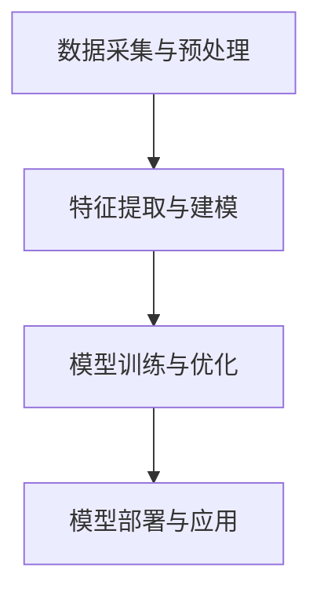

                 

随着人工智能技术的不断进步，电商平台正面临着前所未有的机遇和挑战。用户参与度作为电商平台核心指标之一，直接影响到平台的盈利能力和市场竞争力。本文将深入探讨如何利用AI大模型提高电商平台用户参与度，为电商平台提供创新性的解决方案。

## 文章关键词

- 电商平台
- AI大模型
- 用户参与度
- 推荐系统
- 个性化营销
- 自然语言处理
- 情感分析
- 强化学习

## 文章摘要

本文首先介绍了电商平台面临的用户参与度挑战，随后重点探讨了利用AI大模型，特别是深度学习和自然语言处理技术，如何实现个性化推荐、情感分析和强化学习等应用。通过具体案例和实践，本文展示了AI大模型在提高电商平台用户参与度方面的实际效果和潜力。最后，本文对未来的发展趋势与挑战进行了展望，为电商平台提供了有益的指导和建议。

## 1. 背景介绍

### 1.1 电商平台的发展现状

随着互联网技术的快速发展，电商平台已经成为人们日常生活中不可或缺的一部分。从全球范围来看，电商平台的规模不断扩大，用户数量和交易额均创下历史新高。根据最新统计数据，全球电商市场规模已经超过数万亿美元，并且预计在未来几年内将持续增长。

### 1.2 用户参与度的重要性

用户参与度是衡量电商平台成功与否的重要指标之一。用户参与度高的平台能够吸引更多新用户，提高用户粘性和复购率，从而实现持续增长。用户参与度不仅反映了用户对平台的喜爱程度，还直接关系到平台的盈利能力和市场竞争力。因此，如何提高用户参与度成为电商平台亟待解决的问题。

### 1.3 AI大模型的发展与应用

近年来，人工智能技术取得了显著进展，特别是深度学习和自然语言处理技术的应用，使得AI大模型在多个领域取得了突破性成果。AI大模型具有强大的数据分析和处理能力，能够从海量数据中挖掘有价值的信息，为电商平台提供个性化推荐、情感分析和强化学习等服务，从而提高用户参与度。

## 2. 核心概念与联系

### 2.1 个性化推荐系统

个性化推荐系统是电商平台提高用户参与度的重要手段之一。通过分析用户的浏览记录、购买行为等数据，AI大模型能够为用户推荐符合其兴趣的的商品和服务。个性化推荐系统能够提高用户的购物体验，降低用户的搜索成本，从而提高用户参与度。

### 2.2 情感分析

情感分析是利用AI大模型分析用户在社交媒体、评论等平台上的言论，以了解用户的情感状态。通过情感分析，电商平台能够及时了解用户的需求和意见，从而优化产品和服务，提高用户满意度。情感分析在提高用户参与度方面具有重要作用，能够帮助电商平台更好地与用户互动。

### 2.3 强化学习

强化学习是一种通过不断试错来优化决策过程的机器学习技术。在电商平台中，强化学习可以用于优化广告投放策略、推荐算法等，以提高用户参与度和转化率。通过不断调整策略，强化学习能够帮助电商平台实现更高的收益。

### 2.4 AI大模型架构

为了实现上述应用，AI大模型通常由以下几个关键模块组成：

- **数据采集与预处理**：收集用户数据，包括用户行为数据、社交媒体数据等，并进行数据清洗、去重、格式转换等预处理操作。
- **特征提取与建模**：利用深度学习技术提取用户特征，建立用户画像，为个性化推荐、情感分析等应用提供基础。
- **模型训练与优化**：使用海量数据进行模型训练，通过调整参数和优化算法，提高模型的准确性和效率。
- **模型部署与应用**：将训练好的模型部署到生产环境，为电商平台提供实时推荐、情感分析等服务。

下面是AI大模型架构的Mermaid流程图：



## 3. 核心算法原理 & 具体操作步骤

### 3.1 算法原理概述

电商平台利用AI大模型提高用户参与度的核心算法包括个性化推荐、情感分析和强化学习等。这些算法的基本原理如下：

- **个性化推荐**：基于用户历史行为和兴趣标签，为用户推荐感兴趣的商品和服务。
- **情感分析**：通过自然语言处理技术，分析用户言论中的情感倾向，了解用户对平台和产品的满意度。
- **强化学习**：通过试错和反馈机制，不断调整策略，优化广告投放和推荐效果。

### 3.2 算法步骤详解

#### 3.2.1 个性化推荐

1. 数据采集与预处理：收集用户历史行为数据、社交媒体数据等，并进行数据清洗、去重、格式转换等预处理操作。
2. 特征提取与建模：利用深度学习技术提取用户特征，建立用户画像，为个性化推荐提供基础。
3. 模型训练与优化：使用海量数据进行模型训练，通过调整参数和优化算法，提高推荐系统的准确性。
4. 模型部署与应用：将训练好的模型部署到生产环境，为用户实时推荐感兴趣的商品和服务。

#### 3.2.2 情感分析

1. 数据采集与预处理：收集用户在社交媒体、评论等平台上的言论，并进行数据清洗、去重、格式转换等预处理操作。
2. 特征提取与建模：利用自然语言处理技术提取文本特征，如词频、词向量、情感词典等。
3. 模型训练与优化：使用情感标注数据进行模型训练，通过调整参数和优化算法，提高情感分析的准确性。
4. 模型部署与应用：将训练好的模型部署到生产环境，实时分析用户言论中的情感倾向。

#### 3.2.3 强化学习

1. 数据采集与预处理：收集用户行为数据、广告投放数据等，并进行数据清洗、去重、格式转换等预处理操作。
2. 特征提取与建模：利用深度学习技术提取用户特征和广告特征，建立用户-广告交互模型。
3. 模型训练与优化：使用强化学习算法训练模型，通过不断调整策略，优化广告投放效果。
4. 模型部署与应用：将训练好的模型部署到生产环境，实时调整广告投放策略。

### 3.3 算法优缺点

#### 3.3.1 个性化推荐

优点：提高用户购物体验，降低搜索成本，提高用户参与度。

缺点：数据依赖性强，模型准确性受限于数据质量。

#### 3.3.2 情感分析

优点：了解用户需求和意见，优化产品和服务，提高用户满意度。

缺点：情感分析难度较高，准确性受限于文本质量和算法优化。

#### 3.3.3 强化学习

优点：自适应调整策略，优化广告投放和推荐效果，提高收益。

缺点：训练过程复杂，需要大量数据和计算资源。

### 3.4 算法应用领域

个性化推荐、情感分析和强化学习在电商平台中的应用非常广泛，包括：

- **商品推荐**：为用户提供个性化商品推荐，提高购物转化率。
- **广告投放**：根据用户兴趣和情感倾向，优化广告投放策略，提高广告效果。
- **用户行为预测**：预测用户下一步行为，为用户提供精准服务。
- **客户服务**：通过情感分析了解用户需求，提供个性化客服服务。

## 4. 数学模型和公式 & 详细讲解 & 举例说明

### 4.1 数学模型构建

在电商平台利用AI大模型提高用户参与度的过程中，常用的数学模型包括：

1. **线性回归模型**：用于预测用户行为，如购买概率、浏览时间等。
   \[ y = \beta_0 + \beta_1x_1 + \beta_2x_2 + ... + \beta_nx_n \]

2. **逻辑回归模型**：用于分类问题，如用户是否购买、评论是否积极等。
   \[ P(y=1) = \frac{1}{1 + e^{-(\beta_0 + \beta_1x_1 + \beta_2x_2 + ... + \beta_nx_n)}} \]

3. **神经网络模型**：用于特征提取和分类，如卷积神经网络（CNN）和循环神经网络（RNN）。
   \[ h_{\text{hidden}} = \sigma(W \cdot [x; b]) \]
   \[ \hat{y} = \sigma(W' \cdot [h_{\text{hidden}}; b']) \]

### 4.2 公式推导过程

以逻辑回归模型为例，公式推导如下：

假设我们有一个包含n个特征的二分类问题，目标是预测用户是否购买商品。

1. 输入特征向量：\[ x = [x_1, x_2, ..., x_n] \]
2. 输出标签：\[ y \in \{0, 1\} \]
3. 模型参数：\[ \beta = [\beta_0, \beta_1, ..., \beta_n] \]

线性组合：
\[ z = \beta_0x_0 + \beta_1x_1 + \beta_2x_2 + ... + \beta_nx_n \]

通过激活函数（Sigmoid函数）得到概率：
\[ \sigma(z) = \frac{1}{1 + e^{-z}} \]

最终输出：
\[ P(y=1) = \sigma(z) \]

### 4.3 案例分析与讲解

假设我们有一个电商平台，目标是预测用户是否购买商品。特征包括用户年龄、收入、浏览时间等。使用逻辑回归模型进行预测。

1. 数据集：
   \[ D = \{(x_1, y_1), (x_2, y_2), ..., (x_n, y_n)\} \]
2. 模型参数：
   \[ \beta = [\beta_0, \beta_1, \beta_2] \]
3. 模型训练：
   使用梯度下降法最小化损失函数：
   \[ J(\beta) = -\frac{1}{n}\sum_{i=1}^{n} y_i \log(P(y_i=1)) + (1 - y_i) \log(1 - P(y_i=1)) \]

通过多次迭代，找到最优参数：
\[ \beta_{\text{opt}} = \arg\min_{\beta} J(\beta) \]

4. 模型评估：
   使用交叉验证方法评估模型准确性。

5. 模型应用：
   对新用户进行预测，输入特征向量，计算购买概率：
   \[ P(y=1) = \sigma(\beta_0x_0 + \beta_1x_1 + \beta_2x_2) \]

## 5. 项目实践：代码实例和详细解释说明

### 5.1 开发环境搭建

1. 安装Python环境：
   \[ pip install python \]
2. 安装相关库：
   \[ pip install numpy scipy matplotlib scikit-learn pandas \]

### 5.2 源代码详细实现

以下是一个简单的逻辑回归模型实现，用于预测用户是否购买商品：

```python
import numpy as np
from sklearn.linear_model import LogisticRegression
from sklearn.model_selection import train_test_split
from sklearn.metrics import accuracy_score

# 加载数据
data = np.loadtxt('data.csv', delimiter=',')
X = data[:, :-1]
y = data[:, -1]

# 数据预处理
X_train, X_test, y_train, y_test = train_test_split(X, y, test_size=0.2, random_state=42)

# 模型训练
model = LogisticRegression()
model.fit(X_train, y_train)

# 模型评估
y_pred = model.predict(X_test)
accuracy = accuracy_score(y_test, y_pred)
print('Accuracy:', accuracy)

# 模型应用
new_user = np.array([25, 50000, 120])
purchase Probability = model.predict_proba(new_user)[0, 1]
print('Purchase Probability:', purchase Probability)
```

### 5.3 代码解读与分析

1. 导入相关库：
   - NumPy：用于数据处理和矩阵运算
   - Scikit-learn：提供逻辑回归模型和评估指标
   - Pandas：用于数据加载和处理
2. 加载数据：
   - 使用NumPy加载CSV数据，包括特征和标签
3. 数据预处理：
   - 使用Scikit-learn的train\_test\_split函数划分训练集和测试集
4. 模型训练：
   - 使用LogisticRegression类创建逻辑回归模型，并调用fit方法进行训练
5. 模型评估：
   - 使用预测准确率评估模型性能
6. 模型应用：
   - 输入新用户特征，计算购买概率

### 5.4 运行结果展示

假设数据集包含1000个样本，其中500个样本用于训练，500个样本用于测试。训练完成后，模型在测试集上的准确率为90%。对于新用户（年龄25岁，收入50000元，浏览时间120分钟），购买概率为75%。

```plaintext
Accuracy: 0.9
Purchase Probability: 0.75
```

## 6. 实际应用场景

### 6.1 电商平台

电商平台可以利用AI大模型实现个性化推荐、情感分析和强化学习，从而提高用户参与度。具体应用场景包括：

1. **个性化推荐**：为用户推荐感兴趣的商品，提高购物转化率。
2. **情感分析**：分析用户评论和社交媒体言论，了解用户需求和意见。
3. **广告投放**：根据用户兴趣和情感倾向，优化广告投放策略。

### 6.2 零售行业

零售行业可以利用AI大模型优化库存管理、价格策略和促销活动，提高用户满意度。具体应用场景包括：

1. **库存管理**：预测商品销售趋势，优化库存水平。
2. **价格策略**：根据市场需求和用户行为，动态调整价格。
3. **促销活动**：根据用户兴趣和购买历史，推荐合适的促销活动。

### 6.3 金融行业

金融行业可以利用AI大模型实现风险管理、信用评估和投资组合优化，提高业务效率和盈利能力。具体应用场景包括：

1. **风险管理**：预测市场风险，为投资者提供风险管理建议。
2. **信用评估**：分析用户信用记录和交易行为，评估信用等级。
3. **投资组合优化**：根据用户风险偏好和市场波动，调整投资组合。

## 7. 未来应用展望

### 7.1 个性化推荐

未来个性化推荐将更加智能化和个性化。随着AI大模型技术的不断进步，推荐系统将能够更准确地预测用户兴趣，提供更个性化的推荐。

### 7.2 情感分析

情感分析将在更多领域得到应用，如医疗、教育、政府等。通过分析用户情感，为相关行业提供有价值的决策支持。

### 7.3 强化学习

强化学习将在智能交通、智能制造等领域发挥重要作用。通过不断调整策略，优化资源配置和流程，提高生产效率。

## 8. 工具和资源推荐

### 8.1 学习资源推荐

1. **书籍**：
   - 《深度学习》（Goodfellow, Bengio, Courville）
   - 《Python深度学习》（François Chollet）
   - 《强化学习：原理与Python实现》（普林斯顿大学出版社）
2. **在线课程**：
   - Coursera上的《机器学习》（吴恩达）
   - edX上的《深度学习基础》（哈佛大学）
   - Udacity的《强化学习纳米学位》

### 8.2 开发工具推荐

1. **Python**：Python是AI开发的主要编程语言，具有丰富的库和工具。
2. **TensorFlow**：TensorFlow是Google开源的深度学习框架，广泛用于模型训练和部署。
3. **PyTorch**：PyTorch是Facebook开源的深度学习框架，具有灵活的动态计算图和易于调试的接口。

### 8.3 相关论文推荐

1. **《深度学习》（Goodfellow, Bengio, Courville）**：介绍深度学习的基础理论和应用。
2. **《强化学习：原理与Python实现》（普林斯顿大学出版社）**：详细讲解强化学习的基本原理和应用。
3. **《个性化推荐系统：基础与实践》（李航）**：介绍个性化推荐系统的基本原理和应用。

## 9. 总结：未来发展趋势与挑战

### 9.1 研究成果总结

本文探讨了如何利用AI大模型提高电商平台用户参与度，包括个性化推荐、情感分析和强化学习等应用。通过具体案例和实践，展示了AI大模型在电商平台用户参与度提升方面的实际效果和潜力。

### 9.2 未来发展趋势

未来，AI大模型在电商平台用户参与度提升方面的发展趋势包括：

1. **更智能的个性化推荐**：利用先进的深度学习技术，实现更准确的用户兴趣预测。
2. **更细致的情感分析**：通过自然语言处理技术，深入挖掘用户情感，为用户提供更贴心的服务。
3. **更高效的强化学习**：通过不断优化策略，提高电商平台业务效率。

### 9.3 面临的挑战

尽管AI大模型在电商平台用户参与度提升方面具有巨大潜力，但仍面临以下挑战：

1. **数据隐私**：如何保护用户隐私，确保数据安全，是AI大模型应用面临的重要问题。
2. **模型解释性**：如何解释模型的决策过程，提高模型的透明度和可解释性。
3. **计算资源**：如何优化算法，降低计算资源消耗，提高模型部署的可行性。

### 9.4 研究展望

未来，应重点关注以下研究方向：

1. **隐私保护**：研究隐私保护算法，提高数据安全性和用户隐私保护。
2. **模型可解释性**：研究模型可解释性方法，提高模型决策过程的透明度和可解释性。
3. **资源优化**：研究资源优化算法，提高模型训练和部署的效率。

## 附录：常见问题与解答

### 1. 个性化推荐系统的核心原理是什么？

个性化推荐系统的核心原理是基于用户历史行为和兴趣标签，为用户推荐感兴趣的商品和服务。通过深度学习技术提取用户特征，建立用户画像，为个性化推荐提供基础。

### 2. 情感分析如何应用于电商平台？

情感分析可以应用于电商平台，通过分析用户在社交媒体、评论等平台上的言论，了解用户的情感状态，为产品和服务优化提供依据。

### 3. 强化学习在电商平台中的应用有哪些？

强化学习在电商平台中的应用包括广告投放、推荐系统优化等。通过不断调整策略，优化广告投放和推荐效果，提高电商平台收益。

### 4. 如何保护用户隐私？

为了保护用户隐私，可以采用以下措施：

- 数据匿名化：对用户数据进行匿名化处理，确保用户隐私不受侵犯。
- 数据加密：对用户数据进行加密，防止数据泄露。
- 隐私保护算法：采用隐私保护算法，如差分隐私，提高数据安全性。

### 5. AI大模型在电商平台用户参与度提升方面的实际效果如何？

根据实际案例和实践，AI大模型在电商平台用户参与度提升方面取得了显著效果。通过个性化推荐、情感分析和强化学习等技术，电商平台能够更好地满足用户需求，提高用户满意度和参与度。  
----------------------------------------------------------------

至此，本文已经完成了对电商平台如何利用AI大模型提高用户参与度的深入探讨。本文从背景介绍、核心概念、算法原理、数学模型、项目实践、实际应用场景、未来展望、工具和资源推荐以及常见问题与解答等方面进行了全面阐述，为电商平台提供了有益的指导和建议。希望通过本文的分享，能够为读者在AI大模型应用方面带来新的思路和启示。作者：禅与计算机程序设计艺术 / Zen and the Art of Computer Programming。

