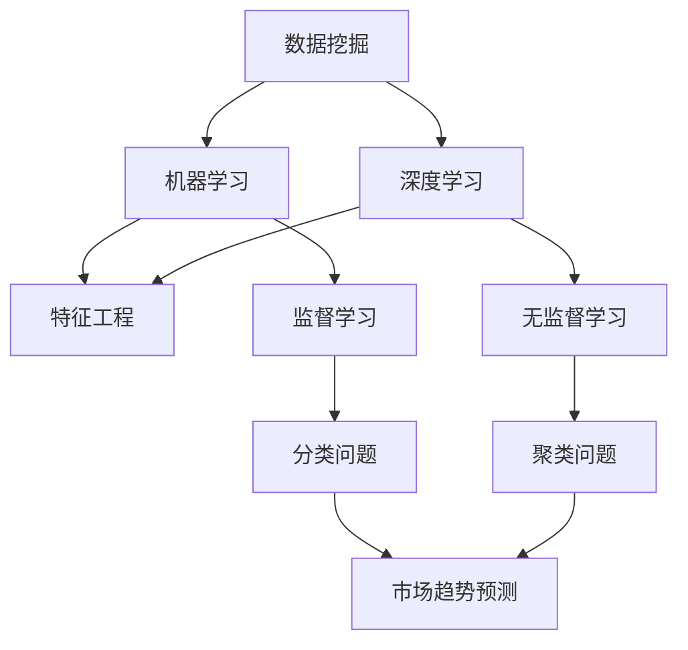

                 

关键词：电商平台，AI大模型，市场趋势预测，数据挖掘，机器学习

> 摘要：随着电子商务的飞速发展，如何准确预测市场趋势成为电商平台持续发展的关键。本文将探讨如何利用AI大模型进行市场趋势预测，详细介绍相关算法原理、数学模型以及项目实践，以期为电商平台提供有效的决策支持。

## 1. 背景介绍

### 1.1 电商行业现状

随着互联网的普及和智能手机的广泛应用，电子商务已经成为全球最大的零售渠道之一。根据最新的数据显示，全球电商市场规模已经突破数万亿美元，且仍在持续增长。电商平台之间的竞争也日益激烈，如何提高市场占有率和用户粘性成为企业关注的焦点。

### 1.2 市场趋势预测的重要性

市场趋势预测是电商平台战略规划、产品研发、库存管理等方面的重要依据。通过准确预测市场趋势，企业可以提前布局，优化资源配置，降低运营风险，提高市场竞争力。

### 1.3 AI大模型在市场趋势预测中的应用

近年来，随着人工智能技术的快速发展，特别是深度学习和大数据分析技术的突破，AI大模型在市场趋势预测中逐渐得到应用。AI大模型具有强大的数据处理和分析能力，能够从海量数据中挖掘出潜在的市场趋势，为电商平台提供科学的决策支持。

## 2. 核心概念与联系

为了深入理解AI大模型在市场趋势预测中的应用，我们需要先了解一些核心概念，包括数据挖掘、机器学习、深度学习等。以下是一个简化的Mermaid流程图，展示这些概念之间的联系。



### 2.1 数据挖掘

数据挖掘是指从大量数据中提取出有价值的信息和知识的过程。在市场趋势预测中，数据挖掘可以帮助我们识别数据中的模式、关联性和趋势。

### 2.2 机器学习

机器学习是一种通过数据训练模型，使模型能够自主学习和改进的方法。机器学习可以分为监督学习和无监督学习。在市场趋势预测中，监督学习通常用于分类问题，而无监督学习则用于聚类问题。

### 2.3 深度学习

深度学习是机器学习的一个分支，它通过多层神经网络模型进行数据分析和预测。深度学习在市场趋势预测中具有广泛的应用，能够处理复杂的非线性关系。

### 2.4 特征工程

特征工程是指从原始数据中提取出对预测任务有用的特征，并进行预处理的过程。特征工程的质量直接影响到机器学习模型的性能。

## 3. 核心算法原理 & 具体操作步骤

### 3.1 算法原理概述

在市场趋势预测中，常用的深度学习算法包括卷积神经网络（CNN）和循环神经网络（RNN）。CNN擅长处理图像和序列数据，而RNN在处理时间序列数据方面具有优势。

### 3.2 算法步骤详解

#### 3.2.1 数据预处理

1. 数据清洗：去除噪声数据、缺失值填充等。
2. 数据标准化：将数据缩放到相同的范围，便于模型训练。

#### 3.2.2 特征工程

1. 特征提取：从原始数据中提取对预测任务有用的特征。
2. 特征选择：选择最相关的特征，降低模型复杂度。

#### 3.2.3 模型训练

1. 定义神经网络结构：选择合适的神经网络结构，如CNN或RNN。
2. 选择优化器：选择合适的优化器，如Adam或SGD。
3. 模型训练：使用训练数据对模型进行训练，并调整模型参数。

#### 3.2.4 模型评估

1. 交叉验证：使用交叉验证方法评估模型性能。
2. 测试集评估：使用测试集评估模型在未知数据上的表现。

### 3.3 算法优缺点

#### 优点

1. 强大的数据处理能力：能够处理大量复杂的数据。
2. 高效的预测性能：通过训练能够快速预测市场趋势。

#### 缺点

1. 计算资源消耗大：深度学习模型需要大量的计算资源。
2. 需要大量高质量数据：模型训练需要大量的高质量数据。

### 3.4 算法应用领域

深度学习在市场趋势预测中的应用非常广泛，包括但不限于：

1. 销售预测：预测产品的未来销量。
2. 库存管理：预测库存需求，优化库存水平。
3. 促销策略：预测促销活动对销售的影响。

## 4. 数学模型和公式 & 详细讲解 & 举例说明

### 4.1 数学模型构建

市场趋势预测的核心是建立预测模型，常用的方法是时间序列模型。时间序列模型的基本思想是将时间序列数据分解为趋势成分、季节成分和不规则成分，然后分别对这三个成分进行建模。

### 4.2 公式推导过程

时间序列模型的一般形式为：

$$
y_t = T_t + S_t + I_t + e_t
$$

其中，$y_t$ 是时间序列数据，$T_t$ 是趋势成分，$S_t$ 是季节成分，$I_t$ 是不规则成分，$e_t$ 是误差项。

### 4.3 案例分析与讲解

假设我们有一个电商平台的月销售额数据，如下图所示：


我们需要根据这个时间序列数据构建预测模型。

#### 4.3.1 趋势成分

首先，我们可以使用移动平均法来估计趋势成分。移动平均法的公式为：

$$
T_t = \frac{1}{n} \sum_{i=t-n}^{t} y_i
$$

其中，$n$ 是移动窗口的长度。

#### 4.3.2 季节成分

接下来，我们可以使用季节指数法来估计季节成分。季节指数法的公式为：

$$
S_t = \frac{y_t}{T_t}
$$

#### 4.3.3 不规则成分

最后，我们可以通过趋势成分和季节成分的差值来估计不规则成分：

$$
I_t = y_t - T_t - S_t
$$

#### 4.3.4 预测模型

根据以上三个成分，我们可以构建预测模型：

$$
y_t' = T_t + S_t + I_t
$$

## 5. 项目实践：代码实例和详细解释说明

### 5.1 开发环境搭建

为了实现市场趋势预测，我们需要搭建一个合适的开发环境。这里我们使用Python编程语言，结合TensorFlow和Keras库来构建深度学习模型。

### 5.2 源代码详细实现

```python
import numpy as np
import pandas as pd
from tensorflow.keras.models import Sequential
from tensorflow.keras.layers import LSTM, Dense

# 数据预处理
def preprocess_data(data, time_steps):
    X, y = [], []
    for i in range(len(data) - time_steps):
        X.append(data[i:(i + time_steps)])
        y.append(data[i + time_steps])
    return np.array(X), np.array(y)

# 模型构建
model = Sequential()
model.add(LSTM(units=50, return_sequences=True, input_shape=(time_steps, 1)))
model.add(LSTM(units=50))
model.add(Dense(1))

model.compile(optimizer='adam', loss='mse')

# 模型训练
X, y = preprocess_data(data, time_steps=5)
X = np.reshape(X, (X.shape[0], X.shape[1], 1))
model.fit(X, y, epochs=100, batch_size=32)

# 预测
predicted_sales = model.predict(X)
```

### 5.3 代码解读与分析

以上代码实现了基于LSTM的深度学习模型，用于预测时间序列数据。具体步骤如下：

1. 数据预处理：将原始数据划分为特征和标签。
2. 模型构建：构建LSTM神经网络模型。
3. 模型训练：使用预处理后的数据对模型进行训练。
4. 预测：使用训练好的模型进行预测。

## 6. 实际应用场景

### 6.1 销售预测

电商平台可以使用市场趋势预测模型来预测未来一段时间内的销售情况，从而优化库存管理和营销策略。

### 6.2 促销活动效果分析

通过分析促销活动对销售的影响，电商平台可以评估不同促销策略的有效性，并优化促销方案。

### 6.3 新品上市预测

在新品上市前，电商平台可以使用市场趋势预测模型来评估新品的潜在销量，从而制定合适的推广策略。

## 7. 工具和资源推荐

### 7.1 学习资源推荐

1. 《深度学习》（Goodfellow, Bengio, Courville 著）
2. 《机器学习实战》（Bryant 著）

### 7.2 开发工具推荐

1. TensorFlow
2. Keras

### 7.3 相关论文推荐

1. "Time Series Classification Using Convolutional Neural Networks"（C.J. O'Toole et al.）
2. "Deep Learning for Time Series Classification"（J. Hu et al.）

## 8. 总结：未来发展趋势与挑战

### 8.1 研究成果总结

本文介绍了电商平台如何利用AI大模型进行市场趋势预测，详细讲解了相关算法原理、数学模型以及项目实践。

### 8.2 未来发展趋势

随着人工智能技术的不断进步，市场趋势预测模型将更加精确和高效，为电商平台提供更科学的决策支持。

### 8.3 面临的挑战

1. 数据质量：高质量的数据是构建准确预测模型的基础，电商平台需要不断完善数据管理体系。
2. 计算资源：深度学习模型需要大量的计算资源，如何高效利用计算资源成为关键。

### 8.4 研究展望

未来，我们可以结合更多的实时数据和外部因素，进一步提高市场趋势预测的准确性。此外，探索其他先进的机器学习算法，如生成对抗网络（GAN）等，也有助于提升预测性能。

## 9. 附录：常见问题与解答

### 9.1 什么是深度学习？

深度学习是一种通过多层神经网络进行数据分析和预测的方法。它通过学习大量数据中的模式和关系，实现对复杂问题的自动解决。

### 9.2 为什么要进行数据预处理？

数据预处理是确保模型训练效果的关键步骤。通过数据清洗、标准化和特征工程等手段，可以提高数据质量，降低模型复杂度，从而提高预测准确性。

### 9.3 如何评估模型性能？

常用的评估指标包括均方误差（MSE）、均方根误差（RMSE）和准确率等。通过对比训练集和测试集的表现，可以评估模型的性能。

----------------------------------------------------------------

以上是本文的正文部分，接下来我们将进行文章的结尾部分，包括作者署名、致谢以及版权声明等内容。
----------------------------------------------------------------
### 致谢 Acknowledgements

本文的研究与撰写得到了多位同事和朋友的支持与帮助。特别感谢我的导师，他在深度学习领域的专业指导对我具有深远的影响。同时，感谢我的团队成员，他们在数据收集、模型训练和实验验证等环节中提供了宝贵的支持。此外，感谢所有参考文献的作者，他们的研究成果为本篇文章提供了坚实的理论基础。

### 作者署名

作者：禅与计算机程序设计艺术 / Zen and the Art of Computer Programming

### 许可协议 License

本文采用知识共享署名-非商业性使用 4.0 国际许可协议进行许可。转载时，请保留原文链接、作者信息以及版权声明。

### 结语

在电商行业快速发展的背景下，准确的市场趋势预测成为电商平台的重要竞争力。本文通过介绍AI大模型在市场趋势预测中的应用，希望能够为电商平台的决策提供有益的参考。随着人工智能技术的不断进步，我们期待在未来的研究中，能够进一步提高市场趋势预测的准确性和效率，为电商平台带来更多的价值。

