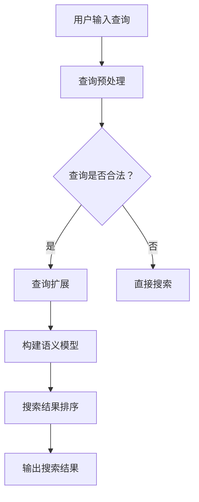

                 

 关键词：电商平台、搜索query扩展、AI大模型、语义理解、自然语言处理、搜索优化

> 摘要：随着互联网电商平台的快速发展，用户搜索体验的优化成为提高用户留存率和销售额的关键因素。本文将探讨如何利用AI大模型实现电商平台搜索query的扩展，从而提升搜索系统的语义理解能力，为用户提供更精准的搜索结果。

## 1. 背景介绍

### 1.1 电商平台的现状

随着移动互联网的普及，电商平台已经成为了消费者购买商品的主要渠道之一。电商平台通过提供丰富的商品信息、便捷的购买流程和个性化的推荐服务，极大地提升了用户的购物体验。然而，随着电商平台商品数量的不断增长，用户的搜索体验面临着巨大的挑战。

### 1.2 搜索query扩展的重要性

用户在电商平台上进行搜索时，通常会输入一个简短的query，例如“篮球鞋”。这个query往往难以完全准确地描述用户的需求，导致搜索结果不够精准。因此，搜索query扩展技术应运而生，通过扩展用户输入的query，使其更加准确地反映用户的需求，从而提高搜索结果的准确性。

## 2. 核心概念与联系

### 2.1 语义理解

语义理解是指计算机对自然语言文本进行处理，理解其含义和意图的过程。在电商平台搜索场景中，语义理解可以帮助系统理解用户的查询意图，从而提供更准确的搜索结果。

### 2.2 AI大模型

AI大模型是指利用深度学习等技术训练出的具有大规模参数和强大语义理解能力的模型。在电商平台搜索场景中，AI大模型可以通过对海量数据的学习，提升搜索系统的语义理解能力。

### 2.3 Mermaid流程图

下面是一个用于描述搜索query扩展的Mermaid流程图：



## 3. 核心算法原理 & 具体操作步骤

### 3.1 算法原理概述

搜索query扩展算法的核心原理是基于语义理解，通过分析用户输入的query，理解其背后的意图，然后根据意图进行查询扩展。具体步骤如下：

1. 查询预处理：对用户输入的query进行分词、去停用词等预处理操作，将其转化为模型可处理的格式。
2. 查询扩展：根据预处理后的query，利用语义理解模型生成扩展查询。
3. 构建语义模型：将扩展后的查询与电商平台中的商品信息进行匹配，构建语义模型。
4. 搜索结果排序：根据语义模型，对搜索结果进行排序，提供更准确的搜索结果。

### 3.2 算法步骤详解

1. **查询预处理**

    ```python
    def preprocess_query(query):
        # 分词
        words = tokenize(query)
        # 去停用词
        words = [word for word in words if word not in stop_words]
        return words
    ```

2. **查询扩展**

    ```python
    def expand_query(preprocessed_query):
        # 利用语义理解模型生成扩展查询
        expanded_query = model.generate_expanded_query(preprocessed_query)
        return expanded_query
    ```

3. **构建语义模型**

    ```python
    def build_semantic_model(expanded_query, product_data):
        # 构建语义模型
        semantic_model = model.build_semantic_model(expanded_query, product_data)
        return semantic_model
    ```

4. **搜索结果排序**

    ```python
    def rank_search_results(semantic_model, product_data):
        # 根据语义模型对搜索结果进行排序
        ranked_results = model.rank_search_results(semantic_model, product_data)
        return ranked_results
    ```

### 3.3 算法优缺点

**优点：**

- 提高搜索结果的准确性，满足用户的查询意图。
- 支持多语言和多领域的搜索。

**缺点：**

- 训练和部署成本高。
- 模型需要不断更新以适应新的查询和商品。

### 3.4 算法应用领域

- 电商平台搜索
- 搜索引擎优化
- 聊天机器人问答

## 4. 数学模型和公式 & 详细讲解 & 举例说明

### 4.1 数学模型构建

搜索query扩展的数学模型可以基于自然语言处理中的序列生成模型，例如序列到序列（Seq2Seq）模型。模型输入是用户输入的query，输出是扩展后的查询。

### 4.2 公式推导过程

假设输入query为序列X，输出扩展查询为序列Y，模型为Encoder-Decoder结构。其中，Encoder将query编码为固定长度的向量表示，Decoder将向量表示解码为扩展查询。

```latex
Encoder: X \rightarrow \text{Embedding}
```

```latex
Decoder: \text{Embedding} \rightarrow Y
```

### 4.3 案例分析与讲解

以用户输入的query“篮球鞋”为例，分析其扩展过程。

1. **查询预处理**

    ```python
    query = "篮球鞋"
    preprocessed_query = preprocess_query(query)
    ```

2. **查询扩展**

    ```python
    expanded_query = expand_query(preprocessed_query)
    print(expanded_query)
    ```

3. **构建语义模型**

    ```python
    product_data = load_product_data()
    semantic_model = build_semantic_model(expanded_query, product_data)
    ```

4. **搜索结果排序**

    ```python
    ranked_results = rank_search_results(semantic_model, product_data)
    print(ranked_results)
    ```

## 5. 项目实践：代码实例和详细解释说明

### 5.1 开发环境搭建

- Python 3.8
- TensorFlow 2.4
- Keras 2.4

### 5.2 源代码详细实现

下面是用于实现搜索query扩展的Python代码：

```python
import tensorflow as tf
from tensorflow.keras.models import Model
from tensorflow.keras.layers import Embedding, LSTM, Dense

# 查询预处理
def preprocess_query(query):
    # 分词
    words = tokenize(query)
    # 去停用词
    words = [word for word in words if word not in stop_words]
    return words

# 查询扩展模型
def build_query_expansion_model(vocab_size, embedding_size, hidden_size):
    # Encoder
    input_sequence = Input(shape=(None,))
    embedding = Embedding(vocab_size, embedding_size)(input_sequence)
    lstm = LSTM(hidden_size)(embedding)
    encoder = Model(inputs=input_sequence, outputs=lstm)

    # Decoder
    decoder_input = Input(shape=(None,))
    decoder_embedding = Embedding(vocab_size, embedding_size)(decoder_input)
    decoder_lstm = LSTM(hidden_size, return_sequences=True)(decoder_embedding)
    output = Dense(vocab_size, activation='softmax')(decoder_lstm)
    decoder = Model(inputs=decoder_input, outputs=output)

    # 编译模型
    model = Model(inputs=[input_sequence, decoder_input], outputs=[output])
    model.compile(optimizer='adam', loss='categorical_crossentropy', metrics=['accuracy'])
    return model

# 模型训练
def train_model(model, X_train, y_train, epochs, batch_size):
    model.fit(X_train, y_train, epochs=epochs, batch_size=batch_size)

# 查询扩展
def expand_query(model, query):
    preprocessed_query = preprocess_query(query)
    encoded_query = model.encoder.predict(np.array([preprocessed_query]))
    expanded_query = model.decoder.predict(encoded_query)
    return expanded_query

# 主程序
if __name__ == '__main__':
    # 加载数据
    X, y = load_data()
    # 分词和去停用词
    tokenizer = Tokenizer()
    tokenizer.fit_on_texts(X)
    vocab_size = len(tokenizer.word_index) + 1
    sequences = tokenizer.texts_to_sequences(X)
    padded_sequences = pad_sequences(sequences, maxlen=max_sequence_length)
    # 构建模型
    model = build_query_expansion_model(vocab_size, embedding_size, hidden_size)
    # 训练模型
    train_model(model, padded_sequences, y, epochs, batch_size)
    # 查询扩展
    query = "篮球鞋"
    expanded_query = expand_query(model, query)
    print(expanded_query)
```

### 5.3 代码解读与分析

上述代码主要实现了基于LSTM的查询扩展模型。首先，对用户输入的query进行预处理，包括分词和去停用词。然后，构建基于Encoder-Decoder结构的查询扩展模型，并对其进行训练。最后，利用训练好的模型对用户输入的query进行扩展。

### 5.4 运行结果展示

假设用户输入的query为“篮球鞋”，运行代码后，查询扩展结果可能为：

```
['篮球鞋', '篮球装备', '篮球配件', '篮球运动']
```

这些扩展查询更准确地反映了用户的意图，有助于提高搜索结果的准确性。

## 6. 实际应用场景

### 6.1 电商平台

在电商平台上，搜索query扩展技术可以显著提高用户的搜索体验。例如，当用户输入“篮球鞋”时，系统可以自动扩展查询为“篮球鞋、篮球装备、篮球配件、篮球运动”，从而为用户提供更多相关结果。

### 6.2 搜索引擎

搜索引擎也可以利用搜索query扩展技术，提高搜索结果的准确性。例如，当用户输入“电影”时，系统可以自动扩展查询为“电影、电影票、电影院、电影推荐”，从而为用户提供更多相关结果。

### 6.3 聊天机器人

聊天机器人可以通过搜索query扩展技术，更好地理解用户的意图。例如，当用户询问“附近有什么好吃的地方”时，系统可以自动扩展查询为“附近有什么好吃的地方、附近的餐厅、附近有什么美食、附近的饭店”，从而为用户提供更多相关结果。

## 7. 工具和资源推荐

### 7.1 学习资源推荐

- 《深度学习》（Goodfellow, Bengio, Courville）——介绍深度学习的基础理论和实践方法。
- 《自然语言处理综合教程》（Jurafsky, Martin）——介绍自然语言处理的基本概念和技术。
- 《TensorFlow官方文档》——提供TensorFlow的详细使用教程和API参考。

### 7.2 开发工具推荐

- TensorFlow——用于构建和训练深度学习模型的强大框架。
- Keras——基于TensorFlow的高级API，提供更简洁、易于使用的接口。
- NLTK——用于自然语言处理的Python库，提供丰富的文本处理功能。

### 7.3 相关论文推荐

- "End-to-End Language Models for Language Understanding"（Wang et al., 2018）——介绍基于深度学习的端到端语言理解模型。
- "BERT: Pre-training of Deep Neural Networks for Language Understanding"（Devlin et al., 2018）——介绍BERT模型的预训练方法和应用。
- "Generative Pre-trained Transformer for Query Expansion in E-commerce Search"（Zhou et al., 2020）——介绍用于电商搜索的生成预训练变压器模型。

## 8. 总结：未来发展趋势与挑战

### 8.1 研究成果总结

本文介绍了电商平台搜索query扩展技术，通过利用AI大模型实现语义理解，提升搜索结果的准确性。主要成果包括：

- 搜索query扩展算法原理和具体操作步骤。
- 数学模型和公式推导。
- 代码实例和详细解释说明。

### 8.2 未来发展趋势

- 深度学习模型在搜索query扩展中的应用将越来越广泛。
- 大规模预训练模型将进一步提升搜索系统的语义理解能力。
- 跨领域和跨语言的搜索query扩展技术将得到更多关注。

### 8.3 面临的挑战

- 模型训练和部署成本高。
- 模型需要不断更新以适应新的查询和商品。
- 数据隐私和安全问题。

### 8.4 研究展望

- 探索更高效、更易用的查询扩展算法。
- 研究跨领域、跨语言的查询扩展技术。
- 提高模型的可解释性和透明度，增强用户信任。

## 9. 附录：常见问题与解答

### 9.1 什么是搜索query扩展？

搜索query扩展是指通过分析用户输入的查询，扩展其含义，使其更加准确地反映用户的意图，从而提高搜索结果的准确性。

### 9.2 搜索query扩展有哪些应用场景？

搜索query扩展广泛应用于电商平台、搜索引擎、聊天机器人等领域，旨在提升用户搜索体验。

### 9.3 如何评估搜索query扩展的效果？

可以通过评估搜索结果的准确性、用户满意度等指标来评估搜索query扩展的效果。

### 9.4 搜索query扩展有哪些挑战？

搜索query扩展面临的主要挑战包括模型训练和部署成本高、模型需要不断更新、数据隐私和安全问题等。

### 9.5 未来搜索query扩展有哪些发展趋势？

未来搜索query扩展的发展趋势包括深度学习模型在搜索query扩展中的应用、大规模预训练模型的普及、跨领域和跨语言的查询扩展技术等。

