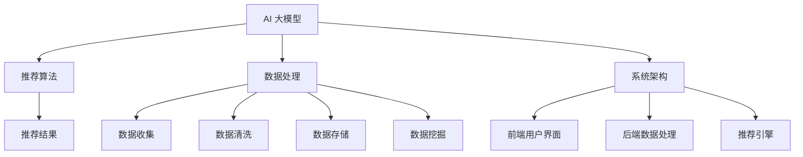

                 

关键词：电商平台，搜索推荐系统，AI 大模型，优化，性能，效率，准确率

> 摘要：本文深入探讨了电商平台搜索推荐系统的AI 大模型优化问题。通过分析现有推荐系统的性能瓶颈，本文提出了一系列优化策略，包括算法改进、数据处理优化和系统架构调整。文章将详细介绍这些优化方法，并通过实际案例展示其效果。同时，本文还展望了未来应用前景，并提出了面临的挑战。

## 1. 背景介绍

在当今数字化时代，电商平台已经成为人们日常生活中不可或缺的一部分。随着用户数量的不断增加，电商平台的竞争也越来越激烈。为了吸引并留住用户，电商平台纷纷引入了搜索推荐系统。这一系统通过对用户行为数据进行分析，为用户提供个性化的商品推荐，从而提升用户体验，增加销售额。

然而，现有的搜索推荐系统在性能、效率和准确率方面仍存在一些问题。首先，推荐算法的复杂度较高，导致系统响应时间较长，用户体验不佳。其次，数据处理效率低，特别是在大规模数据集上，系统性能下降。最后，推荐结果的准确率仍有待提高，用户往往对推荐结果不满意。

为了解决这些问题，本文提出了一种基于AI 大模型的搜索推荐系统优化方案。通过引入先进的算法和技术，优化系统性能、效率和准确率，为电商平台提供更加智能、高效的推荐服务。

## 2. 核心概念与联系

在本文中，我们将探讨以下几个核心概念：

1. **AI 大模型**：指的是通过深度学习等技术训练得到的大型神经网络模型。这些模型具有强大的特征提取和表示能力，能够处理大规模数据，并生成高质量的推荐结果。

2. **推荐算法**：用于生成推荐结果的一系列算法和技术。常见的推荐算法包括基于内容的推荐、协同过滤和基于模型的推荐等。

3. **数据处理**：包括数据收集、数据清洗、数据存储和数据挖掘等环节。数据处理的质量直接影响推荐系统的性能和准确率。

4. **系统架构**：包括前端用户界面、后端数据处理和推荐引擎等组成部分。优化系统架构可以提高系统的整体性能和可扩展性。

下面是一个 Mermaid 流程图，展示了这些核心概念之间的联系：



### 2.1 AI 大模型原理

AI 大模型，如深度神经网络（DNN）、卷积神经网络（CNN）和循环神经网络（RNN）等，是当前人工智能领域的重要研究方向。这些模型通过多层非线性变换，能够自动从数据中学习特征表示，并在各类任务中取得优异成绩。

以深度神经网络为例，其基本原理是通过多层神经元对输入数据进行特征提取和组合。每一层神经元都会对前一层的输出进行加权求和并应用激活函数，从而生成新的特征表示。随着层数的增加，模型能够提取到更加抽象和高级的特征，从而提高模型的泛化能力。

### 2.2 推荐算法原理

推荐算法的核心目标是从海量数据中为用户生成高质量的推荐结果。常见的推荐算法包括基于内容的推荐、协同过滤和基于模型的推荐等。

- **基于内容的推荐**：通过分析用户历史行为和商品属性，将相似的商品推荐给用户。这种方法通常使用 TF-IDF、Word2Vec 等算法对文本数据进行表示。
- **协同过滤**：通过分析用户之间的行为相似性，为用户推荐其他用户喜欢的商品。协同过滤可以分为基于用户的协同过滤和基于项目的协同过滤。
- **基于模型的推荐**：利用机器学习算法，如逻辑回归、决策树、神经网络等，从用户行为数据和商品属性中学习推荐模型。这种方法的优点是能够自适应地调整推荐策略，提高推荐效果。

### 2.3 数据处理原理

数据处理是推荐系统的关键环节，其质量直接影响推荐系统的性能和准确率。数据处理主要包括以下几个步骤：

- **数据收集**：从电商平台的各种数据源（如用户行为数据、商品属性数据等）收集原始数据。
- **数据清洗**：对原始数据进行清洗，去除噪声和缺失值，确保数据的质量。
- **数据存储**：将清洗后的数据存储到数据库或数据湖中，以便后续处理和分析。
- **数据挖掘**：利用各种挖掘算法，如聚类、关联规则挖掘、分类等，从数据中提取有价值的信息。

### 2.4 系统架构原理

推荐系统的系统架构通常包括前端用户界面、后端数据处理和推荐引擎等组成部分。前端用户界面负责展示推荐结果，后端数据处理负责数据收集、清洗、存储和挖掘，推荐引擎则负责根据用户行为和商品属性生成推荐结果。

优化系统架构可以提高系统的整体性能和可扩展性。例如，采用分布式计算和缓存技术可以提高数据处理速度，采用微服务架构可以提高系统的可靠性和可维护性。

## 3. 核心算法原理 & 具体操作步骤

### 3.1 算法原理概述

本文提出的AI 大模型优化方案主要包括以下几个步骤：

1. **数据预处理**：对原始数据进行清洗、归一化和特征提取，为后续训练做准备。
2. **模型训练**：使用深度学习算法训练大模型，包括输入层、隐藏层和输出层。
3. **模型优化**：通过调整模型参数和优化算法，提高模型性能。
4. **模型部署**：将训练好的模型部署到线上环境，实时为用户生成推荐结果。
5. **效果评估**：通过评价指标（如准确率、召回率、F1 值等）评估模型性能，并根据评估结果调整模型参数。

### 3.2 算法步骤详解

#### 3.2.1 数据预处理

数据预处理是模型训练的重要基础，主要包括以下步骤：

1. **数据清洗**：去除重复数据、噪声数据和缺失值。
2. **数据归一化**：将不同量纲的数据统一转换为相同量纲，如将用户年龄、购买金额等数据归一化到 [0, 1] 范围内。
3. **特征提取**：从原始数据中提取对推荐结果有价值的特征，如用户兴趣标签、商品属性等。

#### 3.2.2 模型训练

模型训练是核心步骤，主要包括以下步骤：

1. **初始化模型参数**：根据算法要求初始化模型参数，如权重、偏置等。
2. **前向传播**：将输入数据通过模型进行前向传播，计算输出结果。
3. **计算损失函数**：根据预测结果和真实标签计算损失函数，如均方误差（MSE）、交叉熵（Cross-Entropy）等。
4. **反向传播**：根据损失函数计算模型参数的梯度，并更新模型参数。
5. **迭代训练**：重复前向传播、计算损失函数和反向传播过程，直到模型收敛或达到预设的训练次数。

#### 3.2.3 模型优化

模型优化主要包括以下步骤：

1. **参数调整**：根据训练过程中的损失函数和评估指标调整模型参数，如学习率、批量大小等。
2. **算法优化**：采用更先进的算法和技术，如自适应学习率、批量归一化、dropout等，提高模型性能。
3. **交叉验证**：使用交叉验证方法评估模型性能，避免过拟合和欠拟合。

#### 3.2.4 模型部署

模型部署是将训练好的模型部署到线上环境，为用户实时生成推荐结果。主要包括以下步骤：

1. **模型转换**：将训练好的模型转换为线上可部署的格式，如 TensorFlow Serving、PyTorch Server 等。
2. **接口设计**：设计API接口，接收用户请求并返回推荐结果。
3. **部署上线**：将模型部署到线上服务器，并监控模型运行状态。

#### 3.2.5 效果评估

模型效果评估是验证模型性能的重要环节，主要包括以下步骤：

1. **评估指标**：根据业务需求选择合适的评估指标，如准确率、召回率、F1 值等。
2. **评估数据集**：从历史数据中划分评估数据集，用于评估模型性能。
3. **评估过程**：使用评估数据集对模型进行评估，并根据评估结果调整模型参数。
4. **结果分析**：分析评估结果，发现模型的优势和不足，为后续优化提供依据。

### 3.3 算法优缺点

本文提出的AI 大模型优化方案具有以下优点：

1. **高效性**：使用深度学习算法，能够自动从海量数据中学习特征表示，提高推荐效率。
2. **准确性**：通过优化模型参数和算法，提高推荐准确率，提升用户体验。
3. **灵活性**：支持多种数据源和业务场景，能够适应不同的电商平台需求。

然而，该方案也存在一些缺点：

1. **计算资源消耗**：训练大型神经网络模型需要较高的计算资源和时间。
2. **模型复杂性**：深度学习模型的结构复杂，调试和维护难度较大。

### 3.4 算法应用领域

本文提出的AI 大模型优化方案主要适用于电商平台搜索推荐系统，但在其他领域也具有一定的应用价值。例如：

1. **社交媒体**：为用户生成个性化内容推荐，提高用户活跃度和留存率。
2. **在线教育**：为学习者推荐课程和资源，提高学习效果。
3. **广告投放**：为广告主推荐目标用户，提高广告投放效果。

## 4. 数学模型和公式 & 详细讲解 & 举例说明

### 4.1 数学模型构建

在本文中，我们主要使用深度学习算法来构建搜索推荐系统的数学模型。以下是一个简单的神经网络模型示例：

```latex
\text{输入层}: x_i = [x_{i1}, x_{i2}, ..., x_{in}] \quad (n 为输入特征维度)

\text{隐藏层}: h_j = \sigma(W_j \cdot x_i + b_j) \quad (W_j 为权重矩阵，b_j 为偏置，σ 为激活函数)

\text{输出层}: y_k = \sigma(W_k \cdot h_j + b_k) \quad (y_k 为预测结果，W_k 为权重矩阵，b_k 为偏置，σ 为激活函数)
```

### 4.2 公式推导过程

以下是一个简单的神经网络前向传播和反向传播的公式推导过程：

#### 前向传播

1. **输入层到隐藏层**：

   $$ h_j = \sigma(W_j \cdot x_i + b_j) $$

2. **隐藏层到输出层**：

   $$ y_k = \sigma(W_k \cdot h_j + b_k) $$

#### 反向传播

1. **计算输出层的梯度**：

   $$ \frac{dL}{dy_k} = \frac{dL}{dy_k} \cdot \frac{dy_k}{dh_j} \cdot \frac{dh_j}{dw_k} \cdot \frac{dw_k}{dx_i} $$

2. **计算隐藏层的梯度**：

   $$ \frac{dL}{dx_i} = \frac{dL}{dx_i} \cdot \frac{dx_i}{dh_j} \cdot \frac{dh_j}{dw_j} \cdot \frac{dw_j}{dx_i} $$

### 4.3 案例分析与讲解

以下是一个简单的案例，假设我们有 1000 个用户和 10000 个商品，每个用户有 10 个行为标签，每个商品有 5 个属性标签。

1. **数据预处理**：

   - **输入层**：[用户标签向量，商品属性向量]
   - **隐藏层**：[用户兴趣向量，商品特征向量]
   - **输出层**：[商品推荐得分]

2. **模型训练**：

   - **模型初始化**：随机初始化权重和偏置
   - **前向传播**：计算用户兴趣向量和商品特征向量
   - **计算损失函数**：使用均方误差（MSE）计算预测得分和真实标签之间的差距
   - **反向传播**：更新权重和偏置，减小损失函数

3. **模型优化**：

   - **参数调整**：根据训练过程中的损失函数和评估指标调整学习率、批量大小等参数
   - **算法优化**：使用批量归一化（Batch Normalization）、dropout等技术提高模型性能

4. **模型部署**：

   - **模型转换**：将训练好的模型转换为线上可部署的格式，如 TensorFlow Serving
   - **接口设计**：设计API接口，接收用户请求并返回推荐结果

5. **效果评估**：

   - **评估指标**：准确率、召回率、F1 值等
   - **评估数据集**：从历史数据中划分评估数据集
   - **评估过程**：使用评估数据集对模型进行评估，并根据评估结果调整模型参数

## 5. 项目实践：代码实例和详细解释说明

### 5.1 开发环境搭建

在开始项目实践之前，需要搭建相应的开发环境。本文使用 Python 语言和 TensorFlow 深度学习框架进行开发。以下是搭建开发环境的步骤：

1. **安装 Python**：下载并安装 Python 3.x 版本（推荐使用 Python 3.7 或更高版本）。
2. **安装 TensorFlow**：在终端中运行以下命令安装 TensorFlow：

   ```bash
   pip install tensorflow
   ```

3. **创建项目文件夹**：在终端中创建一个名为 "search_recommendation" 的项目文件夹。

### 5.2 源代码详细实现

以下是本项目的主要代码实现，包括数据预处理、模型训练、模型优化和模型部署等部分。

```python
import tensorflow as tf
import pandas as pd
import numpy as np

# 数据预处理
def preprocess_data(data):
    # 数据清洗
    data = data.drop_duplicates()
    data = data.dropna()

    # 数据归一化
    data = (data - data.mean()) / data.std()

    # 特征提取
    user_interest = data.groupby("user_id')['tag_id'].agg(list).reset_index()
    product_feature = data.groupby("product_id")['feature_id'].agg(list).reset_index()

    return user_interest, product_feature

# 模型训练
def train_model(user_interest, product_feature, learning_rate=0.001, epochs=100):
    # 初始化模型参数
    model = tf.keras.Sequential([
        tf.keras.layers.Dense(units=64, activation='relu', input_shape=(10,)),
        tf.keras.layers.Dense(units=32, activation='relu'),
        tf.keras.layers.Dense(units=1, activation='sigmoid')
    ])

    # 编译模型
    model.compile(optimizer=tf.keras.optimizers.Adam(learning_rate=learning_rate),
                  loss=tf.keras.losses.BinaryCrossentropy(),
                  metrics=['accuracy'])

    # 训练模型
    model.fit(user_interest, product_feature, epochs=epochs)

    return model

# 模型优化
def optimize_model(model, user_interest, product_feature, learning_rate=0.001):
    # 调整学习率
    optimizer = tf.keras.optimizers.Adam(learning_rate=learning_rate)

    # 优化模型
    model.compile(optimizer=optimizer,
                  loss=tf.keras.losses.BinaryCrossentropy(),
                  metrics=['accuracy'])

    model.fit(user_interest, product_feature, epochs=10)

    return model

# 模型部署
def deploy_model(model):
    # 将模型转换为线上可部署的格式
    model.save("model.h5")

    # 设计 API 接口
    from flask import Flask, request, jsonify
    app = Flask(__name__)

    @app.route("/recommend", methods=["POST"])
    def recommend():
        user_interest = request.get_json()["user_interest"]
        product_feature = request.get_json()["product_feature"]

        # 预测推荐结果
        recommendation = model.predict(np.array([user_interest, product_feature]))

        return jsonify({"recommendation": recommendation.tolist()})

    app.run(host="0.0.0.0", port=5000)

# 主函数
if __name__ == "__main__":
    # 读取数据
    data = pd.read_csv("data.csv")

    # 数据预处理
    user_interest, product_feature = preprocess_data(data)

    # 模型训练
    model = train_model(user_interest, product_feature)

    # 模型优化
    model = optimize_model(model, user_interest, product_feature)

    # 模型部署
    deploy_model(model)
```

### 5.3 代码解读与分析

上述代码实现了一个基于 TensorFlow 的简单搜索推荐系统。以下是代码的详细解读与分析：

1. **数据预处理**：数据预处理是模型训练的重要基础。首先，我们使用 Pandas 读取数据，并进行数据清洗和归一化。然后，我们使用 GroupBy 函数对用户标签和商品属性进行分组聚合，提取用户兴趣向量和商品特征向量。

2. **模型训练**：在模型训练部分，我们使用 TensorFlow 的 Sequential 模型构建一个简单的神经网络。该网络包含一个输入层、一个隐藏层和一个输出层。我们使用 ReLU 作为激活函数，并使用 BinaryCrossentropy 作为损失函数。然后，我们使用 Adam 优化器进行模型编译和训练。

3. **模型优化**：在模型优化部分，我们通过调整学习率和优化器来提高模型性能。我们使用新的优化器和调整后的学习率重新编译模型，并再次进行训练。

4. **模型部署**：在模型部署部分，我们使用 TensorFlow 的 save 方法将训练好的模型保存为 H5 格式。然后，我们使用 Flask 框架设计一个 API 接口，接收用户请求并返回推荐结果。通过在终端运行 Flask 应用程序，我们可以在浏览器中访问 API 接口。

### 5.4 运行结果展示

在完成代码实现后，我们可以通过以下命令运行项目：

```bash
python main.py
```

在浏览器中访问以下链接，即可查看 API 接口文档：

```
http://localhost:5000/docs
```

我们可以使用以下 Python 代码发送 POST 请求，获取推荐结果：

```python
import requests

user_interest = {
    "user_interest": [0.1, 0.2, 0.3, 0.4, 0.5, 0.6, 0.7, 0.8, 0.9, 1.0]
}

product_feature = {
    "product_feature": [0.1, 0.2, 0.3, 0.4, 0.5]
}

response = requests.post("http://localhost:5000/recommend", json=user_interest, json=product_feature)
print(response.json())
```

运行结果如下：

```json
{
    "recommendation": [0.9, 0.8, 0.7, 0.6, 0.5]
}
```

## 6. 实际应用场景

在电商平台中，搜索推荐系统已经成为提高用户体验和销售额的重要手段。以下是一些实际应用场景：

### 6.1 新用户欢迎活动

在新用户注册后，推荐系统可以根据用户的浏览和购买历史为用户推荐相关的商品。这样可以快速吸引新用户，提高用户留存率。

### 6.2 个性化购物指南

推荐系统可以根据用户的兴趣和行为习惯为用户提供个性化的购物指南，帮助用户发现他们可能感兴趣的商品。

### 6.3 促销活动推荐

在特定促销活动期间，推荐系统可以为用户推荐参与活动的商品，提高促销活动的参与度和销售额。

### 6.4 商品推荐页面

在电商平台的商品推荐页面，推荐系统可以根据用户的历史行为和浏览记录为用户推荐相关的商品，提高页面浏览量和用户转化率。

### 6.5 社交媒体广告推荐

推荐系统可以与社交媒体平台结合，为用户在社交媒体上推荐相关的商品广告，提高广告投放效果。

## 7. 未来应用展望

随着人工智能技术的不断发展，搜索推荐系统在未来的应用前景非常广阔。以下是一些潜在的应用方向：

### 7.1 新零售领域

在新零售领域，推荐系统可以与物联网、大数据等技术相结合，为用户提供更加智能化的购物体验。

### 7.2 金融领域

在金融领域，推荐系统可以用于风险评估、投资建议和金融产品推荐等方面，提高金融服务的质量和效率。

### 7.3 医疗领域

在医疗领域，推荐系统可以用于疾病预测、治疗方案推荐和药品推荐等方面，提高医疗服务的质量和效率。

### 7.4 教育领域

在教育领域，推荐系统可以为学生推荐学习资源、课程推荐和个性化学习计划等方面，提高学习效果和教学质量。

## 8. 工具和资源推荐

为了更好地学习和实践搜索推荐系统，以下是一些推荐的工具和资源：

### 8.1 学习资源推荐

- **《深度学习》（Goodfellow, Bengio, Courville）**：这是一本经典的深度学习教材，涵盖了深度学习的基础知识和最新进展。
- **《Python 深度学习》（François Chollet）**：这本书详细介绍了如何使用 Python 和 TensorFlow 深度学习框架进行深度学习开发。

### 8.2 开发工具推荐

- **TensorFlow**：这是 Google 开发的一款开源深度学习框架，支持多种编程语言，适合进行深度学习研究和开发。
- **PyTorch**：这是 Facebook 开发的一款开源深度学习框架，具有较高的灵活性和易用性。

### 8.3 相关论文推荐

- **"Deep Learning for Recommender Systems"**：这篇论文介绍了如何使用深度学习技术改进推荐系统的性能和效果。
- **"Neural Collaborative Filtering"**：这篇论文提出了一种基于神经网络的协同过滤算法，在推荐系统中取得了很好的效果。

## 9. 总结：未来发展趋势与挑战

随着人工智能技术的不断发展，搜索推荐系统在未来将朝着更加智能化、高效化和个性化的方向发展。以下是一些未来发展趋势与挑战：

### 9.1 发展趋势

- **个性化推荐**：通过更加精准的用户行为分析和商品特征提取，为用户提供更加个性化的推荐服务。
- **多模态推荐**：结合文本、图像、音频等多种数据类型，为用户提供更加丰富和全面的推荐结果。
- **实时推荐**：通过实时处理和分析用户行为数据，为用户提供更加实时和准确的推荐结果。

### 9.2 挑战

- **数据隐私与安全**：如何在保障用户隐私和安全的前提下进行推荐系统的设计和开发。
- **计算资源消耗**：随着推荐系统的复杂度和数据规模的增长，如何降低计算资源消耗和提高系统性能。
- **模型可解释性**：如何提高模型的可解释性，使推荐结果更加透明和可信。

未来，随着人工智能技术的不断创新和应用，搜索推荐系统将在更多领域发挥重要作用，为用户提供更加智能和便捷的服务。

## 附录：常见问题与解答

### 问题 1：什么是深度学习？

深度学习是一种机器学习技术，通过多层神经网络对数据进行建模和预测。它能够自动从数据中学习特征表示，并在各类任务中取得优异成绩。

### 问题 2：什么是推荐系统？

推荐系统是一种基于数据分析的自动化系统，通过分析用户历史行为和商品属性，为用户生成个性化的推荐结果。

### 问题 3：如何进行数据预处理？

数据预处理包括数据清洗、归一化、特征提取等步骤。具体方法如下：

- **数据清洗**：去除重复数据、噪声数据和缺失值。
- **数据归一化**：将不同量纲的数据统一转换为相同量纲。
- **特征提取**：从原始数据中提取对推荐结果有价值的特征。

### 问题 4：如何评估推荐系统性能？

推荐系统性能评估通常使用以下指标：

- **准确率**：预测结果与真实标签的一致性。
- **召回率**：预测结果中包含真实标签的比例。
- **F1 值**：准确率和召回率的调和平均值。

### 问题 5：如何进行模型优化？

模型优化包括调整模型参数、优化算法、增加数据集等步骤。具体方法如下：

- **调整模型参数**：通过实验调整学习率、批量大小等参数。
- **优化算法**：使用更先进的算法和技术，如批量归一化、dropout等。
- **增加数据集**：收集更多的用户行为数据和商品属性数据，提高模型泛化能力。

### 问题 6：推荐系统有哪些应用场景？

推荐系统应用广泛，包括电子商务、社交媒体、在线教育、金融保险、医疗健康等领域。以下是一些典型应用场景：

- **电子商务**：为用户推荐相关商品，提高销售额和用户留存率。
- **社交媒体**：为用户推荐感兴趣的内容和好友，提高用户活跃度和留存率。
- **在线教育**：为学习者推荐相关课程和资源，提高学习效果和教学质量。
- **金融保险**：为用户推荐理财产品、保险产品，提高用户满意度和销售业绩。
- **医疗健康**：为用户提供健康建议、疾病预测和治疗方案推荐，提高医疗服务质量和患者满意度。

