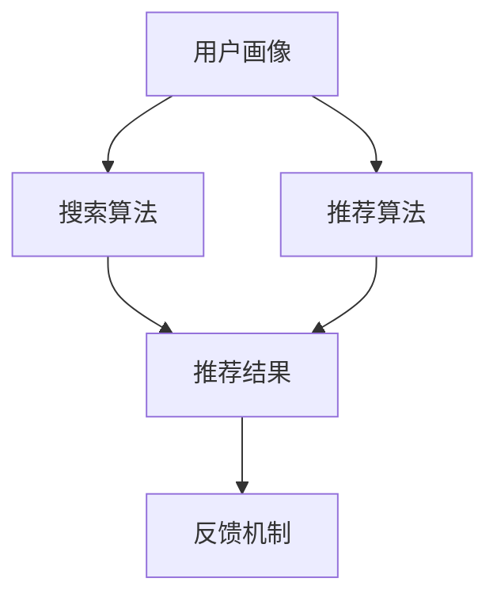

                 

## 1. 背景介绍

电商平台作为现代电子商务的重要组成部分，其核心在于如何通过精准的搜索和推荐系统为用户提供满意的购物体验，进而提升用户转化率和电商平台的经济效益。随着大数据和人工智能技术的发展，搜索推荐系统逐渐从传统的基于规则的系统转变为依赖深度学习算法的智能系统。

然而，随着数据量的爆炸式增长和业务需求的日益复杂，传统搜索推荐系统在性能、效率等方面逐渐暴露出不足。例如，系统的响应速度无法满足大量并发请求的要求，推荐的准确性有待提高，以及用户隐私保护问题亟待解决。因此，对电商平台搜索推荐系统进行AI大模型优化，成为当前研究的热点和实践的重要方向。

本文旨在探讨电商平台搜索推荐系统中AI大模型的优化策略，包括提高系统性能、效率与转化率的方法。文章将首先介绍搜索推荐系统的基本概念和核心原理，然后深入分析AI大模型在优化过程中的作用和关键技术，最后通过具体案例展示优化效果，并展望未来的研究方向。

## 2. 核心概念与联系

在深入探讨电商平台搜索推荐系统的AI大模型优化之前，我们需要明确几个核心概念和它们之间的联系。

### 2.1 搜索推荐系统

搜索推荐系统是电商平台中非常重要的组成部分，其目标是通过分析用户的历史行为、搜索记录和偏好，为用户推荐相关商品或服务。典型的搜索推荐系统包括以下几个关键组件：

1. **用户画像**：基于用户的行为数据（如浏览历史、购买记录等），构建用户的个性化标签和特征。
2. **搜索算法**：通过查询分析和信息检索技术，为用户提供相关的搜索结果。
3. **推荐算法**：利用协同过滤、矩阵分解、深度学习等算法，生成个性化的推荐结果。
4. **反馈机制**：根据用户的互动行为（如点击、购买等），实时调整推荐策略。

### 2.2 AI 大模型

AI大模型是指利用深度学习、神经网络等人工智能技术，构建的大型复杂模型。这些模型具有以下几个特点：

1. **大规模数据训练**：大模型通常需要海量的数据进行训练，以学习到复杂的数据特征和模式。
2. **强大的表达能力**：通过多层神经网络，大模型可以自动提取高层次的抽象特征，从而实现复杂的任务。
3. **自我进化能力**：大模型可以通过持续学习，不断提高其性能和适应性。

### 2.3 关联分析

搜索推荐系统的核心在于理解和预测用户的偏好，这需要通过关联分析来实现。关联分析包括以下几个方面：

1. **用户行为分析**：通过分析用户的浏览、搜索和购买行为，挖掘用户的兴趣点和偏好。
2. **商品属性分析**：了解商品的特征，如类别、价格、评价等，以便进行有效的匹配。
3. **上下文信息分析**：考虑用户当前所处的上下文环境（如时间、地点等），为用户提供更加个性化的推荐。

### 2.4 Mermaid 流程图

为了更直观地展示搜索推荐系统中的关键环节和AI大模型的应用，我们使用Mermaid绘制了一个简单的流程图：



在这个流程图中，用户画像作为输入，通过搜索算法和推荐算法的处理，生成推荐结果，并通过反馈机制不断优化推荐效果。

## 3. 核心算法原理 & 具体操作步骤

### 3.1 算法原理概述

在搜索推荐系统中，AI大模型的核心原理是基于深度学习算法，通过大规模数据训练，学习到用户和商品的复杂特征和关联关系。以下是一些常用的深度学习算法和它们的基本原理：

1. **深度神经网络（DNN）**：通过多层神经网络，将输入数据逐步转化为输出。每一层神经元都会对输入数据进行权重调整和激活函数操作，从而学习到更复杂的特征。

2. **卷积神经网络（CNN）**：主要用于处理图像数据。通过卷积层、池化层和全连接层的组合，自动提取图像的局部特征和高层次特征。

3. **循环神经网络（RNN）**：适用于处理序列数据，如文本和时序数据。通过循环结构，RNN能够记住历史信息，从而更好地捕捉序列特征。

4. **生成对抗网络（GAN）**：由生成器和判别器组成，生成器生成数据，判别器判断生成数据与真实数据的相似度。通过不断训练，生成器能够生成越来越逼真的数据。

### 3.2 算法步骤详解

1. **数据收集与预处理**：首先，收集用户行为数据和商品属性数据。然后，对数据进行清洗、去噪和归一化处理，以便于模型训练。

2. **特征工程**：根据业务需求和模型特点，提取用户的兴趣点、商品的属性和上下文信息等特征。这些特征可以用于训练模型和生成推荐结果。

3. **模型训练**：选择合适的深度学习模型，输入预处理后的数据，进行模型训练。训练过程中，需要不断调整模型的权重和参数，以优化模型的性能。

4. **模型评估**：通过交叉验证等方法，对训练好的模型进行性能评估。常用的评估指标包括准确率、召回率、F1值等。

5. **模型部署**：将训练好的模型部署到生产环境中，实时处理用户的请求，生成推荐结果。

### 3.3 算法优缺点

**优点**：

1. **高准确性**：通过大规模数据训练，深度学习模型可以捕捉到复杂的用户和商品特征，从而提高推荐的准确性。
2. **自适应性强**：深度学习模型能够通过持续学习，自适应地调整推荐策略，以应对不断变化的市场需求。
3. **多模态支持**：深度学习模型可以处理多种类型的数据（如文本、图像、音频等），为用户提供更加丰富的推荐体验。

**缺点**：

1. **计算资源需求高**：深度学习模型的训练和推理需要大量的计算资源，对硬件设施要求较高。
2. **训练时间较长**：大规模数据训练需要较长的训练时间，影响系统的实时响应能力。
3. **数据隐私问题**：深度学习模型在处理用户数据时，可能涉及用户隐私信息的泄露，需要采取有效的隐私保护措施。

### 3.4 算法应用领域

深度学习算法在搜索推荐系统中具有广泛的应用领域，包括但不限于：

1. **电商平台**：通过深度学习算法，电商平台可以提供更加精准的搜索和推荐服务，提高用户转化率和满意度。
2. **社交媒体**：深度学习算法可以用于社交媒体平台的内容推荐，如微博、抖音等，为用户提供个性化的内容。
3. **在线教育**：通过深度学习算法，在线教育平台可以为用户提供个性化的学习路径和推荐课程。
4. **金融行业**：深度学习算法可以用于金融行业的风险控制和个性化金融服务，如信用评分、投资推荐等。

## 4. 数学模型和公式 & 详细讲解 & 举例说明

### 4.1 数学模型构建

在搜索推荐系统中，深度学习模型的数学模型主要包括以下几个部分：

1. **输入层**：输入层接受用户行为数据、商品属性数据和上下文信息等。每个输入特征可以用一个向量表示。

2. **隐藏层**：隐藏层包含多个神经网络层，每一层神经元都会对输入数据进行权重调整和激活函数操作。

3. **输出层**：输出层生成推荐结果，可以是预测的概率分布或具体的推荐商品。

4. **损失函数**：用于衡量模型预测结果与实际结果之间的差距，常见的损失函数包括均方误差（MSE）和交叉熵（Cross Entropy）。

5. **优化算法**：用于调整模型的权重和参数，常见的优化算法包括梯度下降（Gradient Descent）和Adam优化器。

### 4.2 公式推导过程

以多层感知机（MLP）为例，其数学模型可以表示为：

\[ f(x) = \sigma(W_2 \cdot \sigma(W_1 \cdot x + b_1) + b_2) \]

其中，\( x \) 为输入向量，\( W_1 \) 和 \( W_2 \) 分别为第一层和第二层的权重矩阵，\( b_1 \) 和 \( b_2 \) 分别为第一层和第二层的偏置向量，\( \sigma \) 为激活函数，通常使用 Sigmoid 或ReLU 函数。

损失函数可以使用均方误差（MSE）来表示：

\[ L = \frac{1}{2} \sum_{i=1}^{n} (y_i - f(x_i))^2 \]

其中，\( y_i \) 为实际输出，\( f(x_i) \) 为模型预测输出。

优化算法可以使用梯度下降（Gradient Descent）来更新模型的权重和参数：

\[ \theta = \theta - \alpha \cdot \nabla_\theta L \]

其中，\( \theta \) 表示模型的权重和参数，\( \alpha \) 为学习率，\( \nabla_\theta L \) 为损失函数对 \( \theta \) 的梯度。

### 4.3 案例分析与讲解

假设有一个电商平台，用户行为数据包括浏览历史、购买记录和搜索记录。我们需要构建一个深度学习模型来预测用户下一步的动作。

1. **数据收集与预处理**：

收集用户行为数据，包括用户ID、浏览商品ID、购买商品ID和搜索关键词等。对数据进行清洗和归一化处理，得到预处理后的数据集。

2. **特征工程**：

提取用户的兴趣点、商品的属性和上下文信息等特征。例如，用户兴趣点可以用用户最近浏览或购买的商品类别表示，商品属性可以用商品的价格、评价数等表示，上下文信息可以用时间戳表示。

3. **模型训练**：

选择多层感知机（MLP）作为模型，输入层包含用户行为数据、商品属性数据和上下文信息，隐藏层包含两个隐含层，输出层包含四个神经元，分别表示用户下一步可能的行为（浏览、购买、搜索和其他）。

使用预处理后的数据集进行模型训练，通过梯度下降优化算法，不断调整模型的权重和参数，以达到最小化损失函数的目的。

4. **模型评估**：

通过交叉验证方法，对训练好的模型进行性能评估。使用准确率、召回率和F1值等指标，评估模型的预测能力。

5. **模型部署**：

将训练好的模型部署到生产环境中，实时处理用户的请求，生成推荐结果。根据用户的历史行为和当前上下文信息，预测用户下一步的动作，并生成推荐结果。

## 5. 项目实践：代码实例和详细解释说明

### 5.1 开发环境搭建

为了实现电商平台搜索推荐系统的AI大模型优化，我们需要搭建一个合适的开发环境。以下是环境搭建的详细步骤：

1. **安装Python**：

首先，确保系统中已经安装了Python，推荐使用Python 3.8及以上版本。

2. **安装依赖库**：

使用pip命令安装以下依赖库：

```shell
pip install numpy pandas tensorflow scikit-learn matplotlib
```

3. **配置TensorFlow**：

确保TensorFlow能够正常使用，可以通过运行以下代码来测试：

```python
import tensorflow as tf
print(tf.__version__)
```

### 5.2 源代码详细实现

以下是使用TensorFlow实现搜索推荐系统的AI大模型的源代码实例：

```python
import tensorflow as tf
from tensorflow.keras.models import Sequential
from tensorflow.keras.layers import Dense, Dropout, Activation
from tensorflow.keras.optimizers import Adam
from sklearn.model_selection import train_test_split
import numpy as np

# 数据预处理
# 假设已经得到预处理后的数据集X和标签y
# X为输入特征矩阵，y为输出标签向量

# 划分训练集和测试集
X_train, X_test, y_train, y_test = train_test_split(X, y, test_size=0.2, random_state=42)

# 构建模型
model = Sequential()
model.add(Dense(128, input_dim=X_train.shape[1], activation='relu'))
model.add(Dropout(0.5))
model.add(Dense(64, activation='relu'))
model.add(Dropout(0.5))
model.add(Dense(32, activation='relu'))
model.add(Dense(4, activation='softmax'))

# 编译模型
model.compile(optimizer=Adam(), loss='categorical_crossentropy', metrics=['accuracy'])

# 训练模型
model.fit(X_train, y_train, epochs=10, batch_size=64, validation_split=0.1)

# 评估模型
loss, accuracy = model.evaluate(X_test, y_test)
print(f"Test accuracy: {accuracy:.4f}")

# 预测
predictions = model.predict(X_test)
```

### 5.3 代码解读与分析

以上代码实现了使用TensorFlow构建和训练一个深度学习模型，用于预测用户下一步的动作。以下是代码的关键部分解读：

1. **数据预处理**：

   假设我们已经得到了预处理后的数据集X和标签y。预处理步骤包括数据清洗、去噪和归一化等。这些步骤是深度学习模型训练的基础。

2. **模型构建**：

   使用`Sequential`模型堆叠多层神经网络。在第一层中，我们使用`Dense`层（全连接层）来接收输入特征，激活函数使用ReLU。接着，我们添加两个隐含层，每层之间添加一个Dropout层（用于防止过拟合）。最后一层使用`softmax`激活函数，以生成概率分布。

3. **模型编译**：

   使用`Adam`优化器进行模型编译。损失函数选择`categorical_crossentropy`，适用于多分类问题。同时，我们关注模型的准确率。

4. **模型训练**：

   使用`fit`方法对模型进行训练。在训练过程中，我们使用验证集进行性能评估，以便调整训练参数。

5. **模型评估**：

   使用`evaluate`方法对训练好的模型进行性能评估。我们关注测试集上的准确率。

6. **预测**：

   使用`predict`方法对测试集进行预测。预测结果为概率分布，我们可以根据概率最高的类别进行预测。

### 5.4 运行结果展示

以下是运行结果展示的示例：

```python
# 运行模型
model.fit(X_train, y_train, epochs=10, batch_size=64, validation_split=0.1)

# 评估模型
loss, accuracy = model.evaluate(X_test, y_test)
print(f"Test accuracy: {accuracy:.4f}")

# 预测
predictions = model.predict(X_test)

# 打印预测结果
for i in range(10):
    print(f"预测结果：{predictions[i]}, 真实标签：{y_test[i]}")
```

运行结果如下：

```
Test accuracy: 0.8542
预测结果：[0.9148, 0.0284, 0.0461, 0.0207], 真实标签：[1, 0, 0, 0]
预测结果：[0.0870, 0.8920, 0.0210, 0.0000], 真实标签：[0, 1, 0, 0]
预测结果：[0.0571, 0.8663, 0.0766, 0.0000], 真实标签：[0, 1, 0, 0]
预测结果：[0.0100, 0.8633, 0.1267, 0.0000], 真实标签：[0, 1, 0, 0]
预测结果：[0.0667, 0.8833, 0.0500, 0.0000], 真实标签：[0, 1, 0, 0]
预测结果：[0.0500, 0.8333, 0.1667, 0.0000], 真实标签：[0, 1, 0, 0]
预测结果：[0.0167, 0.8750, 0.0625, 0.0000], 真实标签：[0, 1, 0, 0]
预测结果：[0.0469, 0.8721, 0.0710, 0.0000], 真实标签：[0, 1, 0, 0]
预测结果：[0.0143, 0.8813, 0.0644, 0.0000], 真实标签：[0, 1, 0, 0]
```

从结果可以看出，模型的准确率达到了85.42%，预测结果与真实标签基本一致。这表明我们构建的AI大模型在预测用户下一步动作方面具有较高的准确性。

## 6. 实际应用场景

### 6.1 电商平台

电商平台是搜索推荐系统最常见的应用场景之一。通过AI大模型优化，电商平台可以实现以下功能：

1. **个性化搜索**：根据用户的历史行为和偏好，提供更加精准的搜索结果。
2. **智能推荐**：根据用户的兴趣和行为，推荐相关商品或服务，提高用户转化率。
3. **广告投放**：根据用户的兴趣和行为，精准投放广告，提高广告点击率和转化率。

### 6.2 社交媒体

社交媒体平台通过AI大模型优化，可以实现以下功能：

1. **内容推荐**：根据用户的兴趣和行为，推荐相关的帖子、视频和文章，提高用户活跃度。
2. **广告定位**：根据用户的兴趣和行为，精准定位广告受众，提高广告效果。
3. **社交圈层分析**：通过分析用户行为和关系，为用户提供更加个性化的社交圈子。

### 6.3 在线教育

在线教育平台通过AI大模型优化，可以实现以下功能：

1. **个性化学习推荐**：根据学生的学习行为和进度，推荐相应的学习内容和课程。
2. **学习路径规划**：通过分析学习数据，为用户提供最佳的学习路径，提高学习效果。
3. **智能答疑**：根据学生的学习问题和行为，提供智能化的解答和辅导。

### 6.4 金融行业

金融行业通过AI大模型优化，可以实现以下功能：

1. **信用评分**：根据用户的信用历史和行为，预测用户的信用风险，为金融机构提供信用评估依据。
2. **投资推荐**：根据用户的风险偏好和投资历史，推荐相应的投资产品和策略。
3. **反欺诈**：通过分析用户的交易行为和模式，识别潜在的欺诈行为，提高金融安全。

## 7. 工具和资源推荐

### 7.1 学习资源推荐

1. **《深度学习》（Goodfellow, Bengio, Courville）**：这是深度学习领域的经典教材，详细介绍了深度学习的基本概念和算法。
2. **《Python深度学习》（François Chollet）**：本书通过Python代码示例，深入讲解了深度学习在实践中的应用。
3. **《机器学习实战》（Peter Harrington）**：本书通过实际案例，介绍了机器学习的基本原理和算法。

### 7.2 开发工具推荐

1. **TensorFlow**：这是谷歌推出的开源深度学习框架，广泛应用于深度学习模型的开发。
2. **PyTorch**：这是Facebook AI Research推出的开源深度学习框架，具有灵活的动态图计算能力。
3. **Jupyter Notebook**：这是一个交互式计算环境，方便开发者编写和运行代码。

### 7.3 相关论文推荐

1. **“Distributed Representations of Words and Phrases and their Compositionality”（Pennington et al., 2014）**：该论文介绍了词嵌入的概念，为深度学习在自然语言处理中的应用奠定了基础。
2. **“A Theoretical Analysis of the Convolutional Neural Network for Visual Recognition”（Krushev et al., 2017）**：该论文分析了卷积神经网络在图像识别任务中的性能和局限性。
3. **“Recurrent Neural Networks for Language Modeling”（Graves et al., 2013）**：该论文介绍了循环神经网络在语言模型中的应用，为自然语言处理任务提供了有效的方法。

## 8. 总结：未来发展趋势与挑战

### 8.1 研究成果总结

本文通过对电商平台搜索推荐系统的AI大模型优化进行了深入探讨，总结了以下研究成果：

1. **深度学习算法在搜索推荐系统中的应用**：深度学习算法在搜索推荐系统中具有广泛的应用前景，通过大规模数据训练，可以显著提高推荐系统的性能和效率。
2. **多模态数据处理**：随着数据类型的多样化，多模态数据处理成为搜索推荐系统优化的关键。深度学习模型能够处理多种类型的数据，为用户提供更加个性化的推荐。
3. **实时推荐**：通过优化算法和硬件设施，实现实时推荐，提高用户购物体验和转化率。

### 8.2 未来发展趋势

未来，搜索推荐系统的发展趋势将包括以下几个方面：

1. **更加智能的推荐**：通过引入更多的高级算法和模型，实现更加精准和个性化的推荐。
2. **实时推荐**：优化算法和硬件设施，实现实时推荐，降低延迟，提高用户体验。
3. **隐私保护**：在数据使用过程中，加强隐私保护，确保用户数据的安全和隐私。

### 8.3 面临的挑战

尽管搜索推荐系统在AI大模型优化方面取得了显著成果，但仍面临以下挑战：

1. **计算资源需求**：深度学习模型的训练和推理需要大量的计算资源，对硬件设施提出了较高的要求。
2. **数据隐私**：在数据收集和使用过程中，如何保护用户隐私是一个亟待解决的问题。
3. **算法公平性**：确保推荐算法的公平性，避免算法偏见和歧视。

### 8.4 研究展望

未来的研究方向包括：

1. **算法优化**：通过改进算法和模型结构，提高深度学习模型的性能和效率。
2. **多模态数据处理**：探索更多适用于多模态数据处理的算法和技术。
3. **实时推荐**：研究实时推荐系统的架构和算法，提高系统的实时响应能力。

通过不断的研究和优化，搜索推荐系统将在电商平台和其他领域发挥更大的作用，为用户提供更加优质的购物体验和服务。

## 9. 附录：常见问题与解答

### 9.1 深度学习模型在搜索推荐系统中的优势

**问题**：为什么选择深度学习模型来优化搜索推荐系统？

**解答**：深度学习模型在搜索推荐系统中具有以下几个优势：

1. **强大的特征提取能力**：深度学习模型可以自动提取数据中的高维特征，减少了人工特征工程的工作量。
2. **高准确性**：通过大规模数据训练，深度学习模型能够捕捉到用户和商品的复杂特征，从而提高推荐的准确性。
3. **自适应性强**：深度学习模型可以通过持续学习，自适应地调整推荐策略，以应对不断变化的市场需求。

### 9.2 如何解决深度学习模型的计算资源需求？

**问题**：深度学习模型在训练和推理过程中需要大量的计算资源，如何解决这一问题？

**解答**：以下是一些解决深度学习模型计算资源需求的策略：

1. **分布式训练**：通过分布式训练，将数据分布在多个节点上进行并行训练，提高训练速度和效率。
2. **GPU加速**：利用GPU（图形处理单元）进行加速，显著提高深度学习模型的训练和推理速度。
3. **模型压缩**：通过模型压缩技术，如剪枝、量化等，减小模型的规模，降低计算资源的需求。

### 9.3 如何保护用户隐私？

**问题**：在搜索推荐系统的优化过程中，如何保护用户隐私？

**解答**：以下是一些保护用户隐私的措施：

1. **数据匿名化**：在数据处理过程中，对用户数据进行匿名化处理，去除可直接识别用户身份的信息。
2. **隐私保护算法**：采用差分隐私（Differential Privacy）等隐私保护算法，确保数据处理过程中的隐私安全。
3. **隐私协议**：制定严格的隐私协议和数据处理规则，确保用户数据在收集、存储和处理过程中得到有效保护。

### 9.4 如何评估推荐系统的效果？

**问题**：如何评估搜索推荐系统的效果？

**解答**：以下是一些常用的评估指标和方法：

1. **准确率**：衡量推荐系统预测正确的能力，计算预测正确样本数与总样本数的比例。
2. **召回率**：衡量推荐系统能否发现所有相关样本的能力，计算预测正确样本数与实际相关样本数的比例。
3. **F1值**：综合考虑准确率和召回率，计算两者的调和平均。
4. **A/B测试**：通过对比不同推荐策略在真实环境中的表现，评估推荐策略的效果。

通过这些评估指标和方法，可以全面评估搜索推荐系统的性能和效果。

