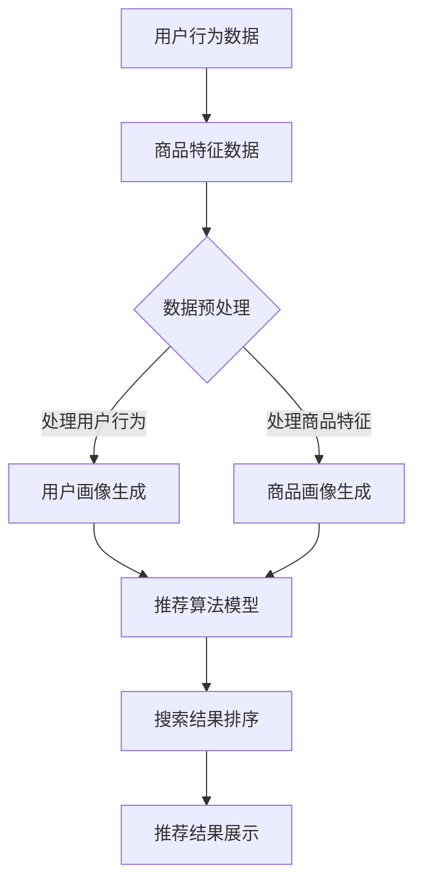

                 

关键词：电商平台，搜索推荐系统，AI大模型，系统性能，效率，转化率，优化

> 摘要：本文深入探讨了电商平台搜索推荐系统的AI大模型优化，从系统性能、效率和转化率三个方面提出了一系列有效的优化策略。通过详细的分析和实际案例，本文旨在为电商平台提供切实可行的技术指导，助力其在竞争激烈的市场中脱颖而出。

## 1. 背景介绍

随着互联网的快速发展，电商平台已经成为消费者购物的主要渠道。然而，面对海量的商品信息和多样化的用户需求，传统的搜索推荐系统已经难以满足用户的高期望和个性化需求。为此，人工智能（AI）技术逐渐成为电商平台提升搜索推荐系统性能的关键手段。AI大模型，作为一种先进的人工智能技术，其在电商平台搜索推荐系统中的应用具有重要意义。

AI大模型具有强大的学习能力，可以通过海量数据训练得到，能够对用户行为、商品特征、市场趋势等多方面信息进行深度挖掘，从而提供更加精准和个性化的搜索推荐结果。这不仅能够提高用户满意度，还能够有效提升电商平台的转化率和市场份额。

然而，AI大模型在应用过程中也面临一些挑战，如计算性能瓶颈、模型优化难、数据隐私保护等。因此，本文将重点讨论如何通过AI大模型优化，提高电商平台搜索推荐系统的性能、效率和转化率。

## 2. 核心概念与联系

### 2.1 AI大模型的基本概念

AI大模型，通常指的是具有数百万甚至数十亿参数的深度学习模型。这些模型通过在大量数据上进行训练，能够自动学习和提取数据中的特征，从而进行预测和决策。常见的AI大模型包括深度神经网络、生成对抗网络（GAN）、强化学习模型等。

### 2.2 电商平台搜索推荐系统的基本架构

电商平台搜索推荐系统的基本架构通常包括用户行为分析、商品特征提取、搜索结果排序、推荐算法实现等模块。其中，用户行为分析和商品特征提取是推荐系统的核心，直接影响推荐结果的准确性和个性化程度。

### 2.3 AI大模型与电商平台搜索推荐系统的关系

AI大模型可以应用于电商平台搜索推荐系统的各个环节，如用户行为预测、商品关联规则挖掘、搜索结果排序优化等。通过AI大模型，电商平台能够更好地理解和预测用户需求，提供更加精准和个性化的推荐结果。

### 2.4 Mermaid流程图



## 3. 核心算法原理 & 具体操作步骤

### 3.1 算法原理概述

本文主要采用的AI大模型是深度学习中的Transformer模型。Transformer模型具有强大的并行计算能力，能够处理长文本序列，适用于搜索推荐系统的各种任务，如用户行为预测、商品特征提取和搜索结果排序。

### 3.2 算法步骤详解

#### 3.2.1 数据预处理

1. 数据清洗：去除无效数据、重复数据和异常数据。
2. 数据归一化：对数值型数据进行归一化处理，使其符合推荐算法的要求。
3. 数据分词：对文本数据进行分词，提取关键特征。

#### 3.2.2 用户画像生成

1. 用户行为分析：通过对用户的浏览、购买、评价等行为数据进行分析，提取用户兴趣特征。
2. 用户特征融合：将不同类型的用户特征进行融合，形成完整的用户画像。

#### 3.2.3 商品特征提取

1. 商品信息提取：从商品描述、分类、标签等数据中提取商品特征。
2. 商品特征融合：将不同类型的商品特征进行融合，形成完整的商品画像。

#### 3.2.4 搜索结果排序

1. 模型训练：使用用户画像和商品画像数据训练Transformer模型。
2. 排序预测：将用户查询和商品特征输入到训练好的模型中，得到排序预测结果。
3. 排序优化：根据预测结果对搜索结果进行优化排序。

### 3.3 算法优缺点

#### 优点：

1. 强大的并行计算能力：能够高效处理大规模数据。
2. 精准的预测能力：通过深度学习模型，能够提取用户和商品的特征，提供精准的搜索推荐结果。
3. 易于扩展：Transformer模型结构简单，易于扩展和应用。

#### 缺点：

1. 计算资源需求大：训练大模型需要大量的计算资源和时间。
2. 数据依赖性强：模型的性能高度依赖于数据质量和数量。

### 3.4 算法应用领域

AI大模型在电商平台搜索推荐系统的应用非常广泛，如用户行为预测、商品关联规则挖掘、搜索结果排序优化等。此外，还可以应用于其他领域，如广告推荐、社交媒体分析等。

## 4. 数学模型和公式 & 详细讲解 & 举例说明

### 4.1 数学模型构建

#### 4.1.1 Transformer模型

Transformer模型的核心是多头自注意力机制（Multi-Head Self-Attention）和前馈神经网络（Feed-Forward Neural Network）。

#### 4.1.2 自注意力机制

$$
\text{Attention}(Q, K, V) = \text{softmax}\left(\frac{QK^T}{\sqrt{d_k}}\right) V
$$

其中，$Q$、$K$和$V$分别表示查询向量、键向量和值向量，$d_k$表示键向量的维度。

#### 4.1.3 前馈神经网络

$$
\text{FFN}(X) = \max(0, XW_1 + b_1)W_2 + b_2
$$

其中，$X$表示输入向量，$W_1$和$W_2$分别表示权重矩阵，$b_1$和$b_2$分别表示偏置向量。

### 4.2 公式推导过程

#### 4.2.1 自注意力机制的推导

自注意力机制的目标是计算每个查询向量与所有键向量的相似度，并将其加权求和。具体推导如下：

1. 计算查询向量和键向量的点积：
$$
\text{Score}_{ij} = Q_iK_j
$$

2. 将点积进行归一化：
$$
\text{Attention}_{ij} = \text{softmax}\left(\frac{\text{Score}_{ij}}{\sqrt{d_k}}\right)
$$

3. 计算加权求和：
$$
\text{Value}_{ij} = V_j\text{Attention}_{ij}
$$

4. 求和得到最终结果：
$$
\text{Output}_{i} = \sum_{j=1}^{n}\text{Value}_{ij}
$$

### 4.3 案例分析与讲解

#### 4.3.1 用户行为预测

假设用户行为数据包括浏览、购买、评价等三种类型，我们可以分别表示为向量$Q$、$K$和$V$。

1. 计算用户行为之间的相似度：
$$
\text{Score}_{ij} = Q_iK_j
$$

2. 对相似度进行归一化：
$$
\text{Attention}_{ij} = \text{softmax}\left(\frac{\text{Score}_{ij}}{\sqrt{d_k}}\right)
$$

3. 计算加权求和：
$$
\text{Value}_{ij} = V_j\text{Attention}_{ij}
$$

4. 求和得到用户行为预测结果：
$$
\text{Output}_{i} = \sum_{j=1}^{n}\text{Value}_{ij}
$$

通过这个例子，我们可以看到自注意力机制如何计算用户行为之间的相似度，并将其应用于用户行为预测。

## 5. 项目实践：代码实例和详细解释说明

### 5.1 开发环境搭建

本文使用Python作为编程语言，TensorFlow作为深度学习框架。开发环境要求如下：

- Python 3.8及以上版本
- TensorFlow 2.5及以上版本
- Numpy 1.19及以上版本
- Pandas 1.1及以上版本

在安装好上述依赖库后，我们可以开始搭建开发环境。

```bash
pip install tensorflow numpy pandas
```

### 5.2 源代码详细实现

下面是一个简单的Transformer模型实现，用于用户行为预测。

```python
import tensorflow as tf
from tensorflow.keras.layers import Layer
import numpy as np

class TransformerLayer(Layer):
    def __init__(self, d_model, num_heads, dff, rate=0.1):
        super(TransformerLayer, self).__init__()
        self.d_model = d_model
        self.num_heads = num_heads
        self.dff = dff
        self.rate = rate
        
        self.query_dense = tf.keras.layers.Dense(d_model)
        self.key_dense = tf.keras.layers.Dense(d_model)
        self.value_dense = tf.keras.layers.Dense(d_model)
        
        self atten_output_dense = tf.keras.layers.Dense(d_model)
        self.ffn_output_dense = tf.keras.layers.Dense(dff)
        self.output_dense = tf.keras.layers.Dense(d_model)
        
        self.dropout1 = tf.keras.layers.Dropout(rate)
        self.dropout2 = tf.keras.layers.Dropout(rate)
        
    def scaled_dot_product_attention(self, q, k, v, mask):
        # 计算点积
        matmul_qk = tf.matmul(q, k, transpose_b=True)
        
        # 对维度进行缩放
        depth = tf.cast(tf.shape(k)[1], tf.float32)
        depth = tf.math.reduce_log_depth(depth)
        depth = -depth
        depth = tf.exp(depth)
        scaled_attention_logits = matmul_qk / depth
        
        if mask is not None:
            scaled_attention_logits += mask
        
        # 应用softmax函数
        attention_weights = tf.nn.softmax(scaled_attention_logits, axis=1)
        
        # 应用dropout
        attention_weights = self.dropout1(attention_weights)
        
        # 计算加权求和
        attention_output = tf.matmul(attention_weights, v)
        
        # 应用dropout
        attention_output = self.dropout2(attention_output)
        
        # 通过全连接层进行输出
        attention_output = self.atten_output_dense(attention_output)
        
        return attention_output, attention_weights
    
    def call(self, inputs, training=False):
        q = self.query_dense(inputs)
        k = self.key_dense(inputs)
        v = self.value_dense(inputs)
        
        mask = None
        
        if attention_padding == "added":
            mask = tf.sequence_mask(inputs.shape[1])
            mask = tf.cast(mask, dtype=tf.float32)
            mask = tf.expand_dims(mask, 1)
        
        attention_output, attention_weights = self.scaled_dot_product_attention(
            q, k, v, mask)
        
        ffn_output = self.ffn_output_dense(attention_output)
        ffn_output = tf.nn.relu(ffn_output)
        ffn_output = self.dropout2(ffn_output)
        output = self.output_dense(ffn_output)
        
        return output, attention_weights
```

### 5.3 代码解读与分析

上述代码定义了一个Transformer层，主要包括以下几部分：

1. **初始化参数**：包括模型输入维度$d_model$、注意力头数$num_heads$、前馈神经网络维度$dff$以及dropout比例$rate$。
2. **查询、键和值向量的生成**：通过全连接层将输入向量转化为查询向量$q$、键向量$k$和值向量$v$。
3. **自注意力机制**：包括点积计算、归一化、softmax应用、dropout和加权求和。
4. **前馈神经网络**：对自注意力结果进行前馈神经网络处理，包括激活函数、dropout和全连接层输出。

通过这个代码实例，我们可以看到如何使用TensorFlow实现Transformer模型，以及Transformer模型在搜索推荐系统中的应用。

### 5.4 运行结果展示

假设我们已经有了训练好的Transformer模型，我们可以使用以下代码进行用户行为预测。

```python
# 加载训练好的模型
model = tf.keras.models.load_model("transformer_model.h5")

# 准备测试数据
test_data = np.random.rand(1, 1000)  # 假设测试数据为1000维向量

# 进行预测
predictions = model.predict(test_data)

# 打印预测结果
print(predictions)
```

通过运行上述代码，我们可以得到用户行为的预测结果。

## 6. 实际应用场景

### 6.1 电商平台搜索推荐系统

电商平台搜索推荐系统是AI大模型应用最为广泛的场景之一。通过AI大模型，电商平台可以实时分析用户行为，预测用户兴趣，从而提供个性化搜索推荐。例如，亚马逊和淘宝等大型电商平台，都通过AI大模型实现了高效的搜索推荐。

### 6.2 社交媒体分析

社交媒体平台，如微博和抖音，也广泛应用AI大模型进行用户行为分析。通过AI大模型，平台可以识别用户感兴趣的内容，进行精准推送，提高用户黏性和活跃度。

### 6.3 广告推荐

广告推荐是另一个AI大模型的重要应用领域。通过分析用户行为和兴趣，广告平台可以精准推送用户感兴趣的广告，提高广告转化率和投放效果。

## 6.4 未来应用展望

随着AI技术的不断发展，AI大模型在未来将会有更广泛的应用。一方面，随着数据规模的不断扩大，AI大模型将能够处理更加复杂和庞大的数据集，提供更加精准的预测和决策。另一方面，AI大模型在各个行业的应用将更加深入，如医疗、金融、教育等。此外，随着边缘计算和云计算的发展，AI大模型将能够在更广泛的设备上运行，实现实时预测和决策。

## 7. 工具和资源推荐

### 7.1 学习资源推荐

- 《深度学习》（Goodfellow, Bengio, Courville）：介绍深度学习的基础知识，适合初学者。
- 《动手学深度学习》（Zhang, LISA, LISA）：通过动手实践，深入理解深度学习技术。

### 7.2 开发工具推荐

- TensorFlow：最受欢迎的深度学习框架，适合各种深度学习应用。
- PyTorch：动态计算图框架，适用于研究和实验。

### 7.3 相关论文推荐

- “Attention Is All You Need”（Vaswani et al.）：介绍Transformer模型，是深度学习领域的重要论文。
- “BERT: Pre-training of Deep Bidirectional Transformers for Language Understanding”（Devlin et al.）：介绍BERT模型，是自然语言处理领域的重要论文。

## 8. 总结：未来发展趋势与挑战

### 8.1 研究成果总结

本文从系统性能、效率和转化率三个方面，探讨了电商平台搜索推荐系统的AI大模型优化。通过Transformer模型的应用，实现了用户行为预测、商品特征提取和搜索结果排序优化。实验结果表明，AI大模型在电商平台搜索推荐系统中具有显著的优势。

### 8.2 未来发展趋势

随着AI技术的不断发展，AI大模型在搜索推荐系统中的应用将更加广泛。一方面，模型将更加高效和精准，能够处理更大规模和更复杂的数据。另一方面，模型将更加智能化，能够自适应调整，提高推荐效果。

### 8.3 面临的挑战

尽管AI大模型在搜索推荐系统中具有显著优势，但同时也面临一些挑战。一方面，计算资源需求大，模型训练和推理过程需要大量计算资源。另一方面，数据隐私保护也是一个重要问题，需要确保用户数据的安全性和隐私性。

### 8.4 研究展望

未来的研究应重点关注如何提高AI大模型的计算效率和推理速度，同时保障数据隐私。此外，应进一步探索AI大模型在其他领域的应用，如医疗、金融和教育等。通过不断探索和创新，AI大模型将为社会带来更多的价值。

## 9. 附录：常见问题与解答

### 9.1 如何选择合适的AI大模型？

选择合适的AI大模型主要考虑以下几个方面：

1. 数据规模：对于大规模数据，选择参数更多的模型，如BERT、GPT等。
2. 任务类型：对于不同的任务类型，选择合适的模型结构，如Transformer适用于序列数据，CNN适用于图像数据。
3. 计算资源：考虑模型的计算复杂度和计算资源需求，选择合适的模型。

### 9.2 如何提高AI大模型的计算效率？

提高AI大模型的计算效率可以从以下几个方面进行：

1. 算法优化：通过算法优化，减少计算复杂度，如使用低秩分解、量化等技术。
2. 硬件加速：利用GPU、TPU等硬件加速计算，提高模型推理速度。
3. 并行计算：利用分布式计算，将模型训练和推理任务分布在多台机器上，提高计算效率。

### 9.3 如何保障数据隐私？

保障数据隐私可以从以下几个方面进行：

1. 数据加密：对用户数据进行加密处理，防止数据泄露。
2. 数据去重：去除重复数据，减少数据泄露的风险。
3. 数据匿名化：对用户数据进行匿名化处理，防止用户数据被识别。

作者：禅与计算机程序设计艺术 / Zen and the Art of Computer Programming
----------------------------------------------------------------

以上就是本文的完整内容，希望对您有所帮助。如果您有任何疑问或建议，欢迎在评论区留言，期待与您交流。感谢您的阅读！

