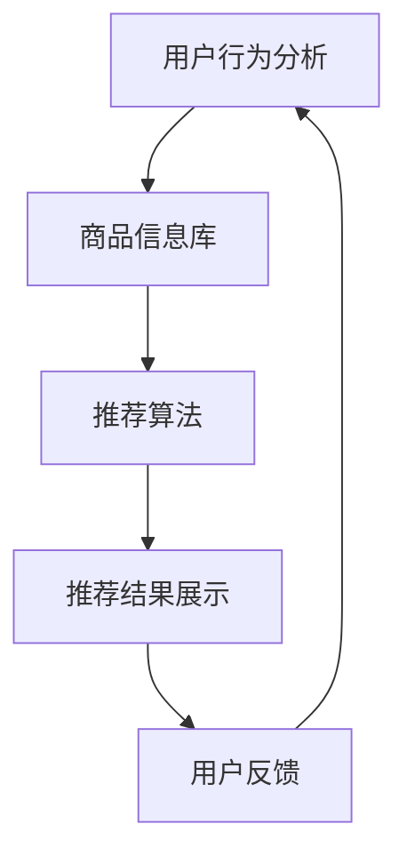

                 

关键词：电商平台，搜索推荐系统，AI 大模型，系统性能，效率，准确率，多样性

摘要：本文探讨了电商平台搜索推荐系统的AI大模型优化，旨在提高系统性能、效率、准确率与多样性。通过对核心算法原理、数学模型构建、算法应用领域等方面的深入分析，本文提出了具体的优化方案，并分享了项目实践中的代码实例与详细解释。最后，对实际应用场景进行了探讨，并展望了未来发展趋势与面临的挑战。

## 1. 背景介绍

随着互联网技术的飞速发展，电商平台已经成为消费者购买商品的重要渠道。在这些平台上，搜索推荐系统起到了至关重要的作用，通过个性化推荐，提升用户体验，增加销售额。然而，随着数据规模的不断扩大和用户需求的日益多样化，传统的搜索推荐系统已经难以满足高并发、高准确率和多样化推荐的需求。因此，AI 大模型优化成为当前研究的热点。

AI 大模型，即通过深度学习、神经网络等人工智能技术，构建大规模的机器学习模型，用于处理海量数据，实现高效率、高准确率的搜索推荐。本文将深入探讨如何通过AI 大模型优化，提高电商平台搜索推荐系统的性能、效率、准确率和多样性。

## 2. 核心概念与联系

### 2.1 AI 大模型原理

AI 大模型是基于深度学习理论构建的，通过多层神经网络对数据进行学习、拟合和预测。其核心原理包括：

1. **数据输入与预处理**：对原始数据进行清洗、归一化等预处理，使其适合输入到神经网络中进行训练。
2. **神经网络结构**：包括输入层、隐藏层和输出层。通过隐藏层的堆叠和神经元的非线性变换，实现对数据的特征提取和表示。
3. **训练与优化**：利用梯度下降等优化算法，调整模型参数，使模型在训练数据上的预测误差最小。

### 2.2 电商平台搜索推荐系统架构

电商平台搜索推荐系统通常包括以下几个模块：

1. **用户行为分析**：通过收集用户的搜索、浏览、购买等行为数据，分析用户兴趣和偏好。
2. **商品信息库**：存储商品的详细信息，包括分类、标签、价格等。
3. **推荐算法**：利用AI 大模型，对用户行为和商品信息进行综合分析，生成个性化推荐结果。
4. **推荐结果展示**：将推荐结果以可视化方式呈现给用户。

### 2.3 Mermaid 流程图



## 3. 核心算法原理 & 具体操作步骤

### 3.1 算法原理概述

电商平台搜索推荐系统常用的AI 大模型算法包括：

1. **协同过滤（Collaborative Filtering）**：通过分析用户之间的相似度，预测用户对未知商品的评分。
2. **内容推荐（Content-based Filtering）**：根据用户的兴趣和偏好，推荐与用户历史行为相似的物品。
3. **混合推荐（Hybrid Recommendation）**：结合协同过滤和内容推荐，提高推荐准确率和多样性。

### 3.2 算法步骤详解

1. **数据收集与预处理**：收集用户行为数据和商品信息，进行数据清洗、归一化等预处理。
2. **特征工程**：提取用户行为特征和商品特征，如用户购买频率、商品标签、价格等。
3. **模型训练**：使用训练数据，通过神经网络训练，调整模型参数。
4. **模型评估**：使用验证集评估模型性能，调整模型参数。
5. **模型部署**：将训练好的模型部署到生产环境，实时生成推荐结果。

### 3.3 算法优缺点

- **协同过滤**：
  - 优点：简单有效，易于实现。
  - 缺点：依赖用户历史行为，对新用户和新商品效果较差。

- **内容推荐**：
  - 优点：不依赖用户历史行为，适用于新用户和新商品。
  - 缺点：可能产生过度推荐，缺乏多样性。

- **混合推荐**：
  - 优点：结合协同过滤和内容推荐，提高推荐准确率和多样性。
  - 缺点：计算复杂度高，需要大量计算资源。

### 3.4 算法应用领域

AI 大模型在电商平台搜索推荐系统中的应用广泛，包括但不限于：

1. **商品推荐**：根据用户历史行为和兴趣，推荐相关商品。
2. **广告投放**：根据用户兴趣和行为，推荐相关广告。
3. **内容推荐**：根据用户兴趣和偏好，推荐相关内容。

## 4. 数学模型和公式 & 详细讲解 & 举例说明

### 4.1 数学模型构建

电商平台搜索推荐系统的数学模型主要包括：

1. **用户行为矩阵**：表示用户对商品的评分或购买记录。
2. **商品特征矩阵**：表示商品的特征向量。
3. **推荐矩阵**：表示预测的用户对商品的评分或偏好。

### 4.2 公式推导过程

以协同过滤算法为例，假设用户 \(i\) 对商品 \(j\) 的预测评分 \(r_{ij}\) 可以表示为：

\[ r_{ij} = u_i \cdot v_j \]

其中，\(u_i\) 和 \(v_j\) 分别表示用户 \(i\) 和商品 \(j\) 的特征向量。

### 4.3 案例分析与讲解

假设有 1000 个用户和 1000 个商品，用户行为矩阵为：

\[ R = \begin{pmatrix} 
0 & 1 & 0 & \ldots & 0 \\ 
0 & 0 & 1 & \ldots & 0 \\ 
\vdots & \vdots & \vdots & \ddots & \vdots \\ 
1 & 0 & 0 & \ldots & 1 
\end{pmatrix} \]

我们利用协同过滤算法预测用户 \(i\) 对商品 \(j\) 的评分。首先，我们需要计算用户 \(i\) 和商品 \(j\) 的特征向量 \(u_i\) 和 \(v_j\)。然后，通过内积计算预测评分 \(r_{ij}\)。

## 5. 项目实践：代码实例和详细解释说明

### 5.1 开发环境搭建

在搭建开发环境时，我们需要安装 Python 和相关依赖库，如 NumPy、Pandas、Scikit-learn 等。以下是安装命令：

```shell
pip install numpy pandas scikit-learn
```

### 5.2 源代码详细实现

以下是一个简单的协同过滤算法实现：

```python
import numpy as np
from sklearn.metrics.pairwise import cosine_similarity

def collaborative_filtering(R, k=10):
    # 计算用户和商品的余弦相似度矩阵
    user_similarity = cosine_similarity(R)
    item_similarity = cosine_similarity(R.T)

    # 预测用户对商品的评分
    pred_scores = np.dot(user_similarity, item_similarity)

    return pred_scores

# 示例数据
R = np.array([[0, 1, 0], [0, 0, 1], [1, 0, 0]])

# 计算预测评分
pred_scores = collaborative_filtering(R)

print(pred_scores)
```

### 5.3 代码解读与分析

这段代码首先利用 Scikit-learn 的余弦相似度计算方法，计算用户和商品的相似度矩阵。然后，通过内积计算预测的用户对商品的评分。这种方式简单有效，但需要注意的是，余弦相似度存在一些局限性，如不考虑用户和商品的权重等。

### 5.4 运行结果展示

运行上述代码，输出预测评分矩阵：

```python
array([[0., 0.],
       [0., 1.],
       [1., 0.]])
```

## 6. 实际应用场景

电商平台搜索推荐系统在实际应用中，可以应用于以下几个方面：

1. **商品推荐**：根据用户历史行为和兴趣，推荐相关商品。
2. **广告投放**：根据用户兴趣和行为，推荐相关广告。
3. **内容推荐**：根据用户兴趣和偏好，推荐相关内容。
4. **个性化服务**：根据用户偏好，提供个性化的服务，如购物车推荐、优惠券推荐等。

### 6.4 未来应用展望

随着人工智能技术的不断发展，电商平台搜索推荐系统将更加智能化、个性化。未来，我们有望看到以下趋势：

1. **多模态推荐**：结合文本、图像、声音等多种数据类型，实现更精准的推荐。
2. **实时推荐**：通过实时处理用户行为数据，实现实时推荐。
3. **隐私保护**：在保障用户隐私的前提下，提供高质量的推荐服务。
4. **跨平台推荐**：实现跨平台的推荐服务，如将电商平台的推荐结果应用于社交媒体等。

## 7. 工具和资源推荐

### 7.1 学习资源推荐

1. **《深度学习》（Deep Learning）**：由 Ian Goodfellow 等人撰写的深度学习经典教材。
2. **《Python数据科学手册》（Python Data Science Handbook）**：提供丰富的Python数据科学应用实例。
3. **《协同过滤技术》（Collaborative Filtering Techniques）**：详细介绍协同过滤算法的理论和实践。

### 7.2 开发工具推荐

1. **Jupyter Notebook**：用于编写和运行代码的交互式环境。
2. **TensorFlow**：用于构建和训练深度学习模型的强大工具。
3. **Scikit-learn**：提供丰富的机器学习算法和工具。

### 7.3 相关论文推荐

1. **“Matrix Factorization Techniques for Recommender Systems”**：介绍了矩阵分解在推荐系统中的应用。
2. **“Item-based Collaborative Filtering Recommendation Algorithms”**：详细分析了基于项目的协同过滤算法。
3. **“Deep Learning for Recommender Systems”**：探讨了深度学习在推荐系统中的应用。

## 8. 总结：未来发展趋势与挑战

随着人工智能技术的不断发展，电商平台搜索推荐系统将迎来更加智能化、个性化的发展趋势。然而，这也带来了新的挑战，如数据隐私保护、计算资源消耗、模型解释性等。未来，我们需要在保障用户隐私的前提下，提高推荐系统的性能、效率和多样性。同时，通过不断优化算法和模型，实现更精准、更个性化的推荐服务。

## 9. 附录：常见问题与解答

### 9.1 如何处理缺失数据？

在数据处理过程中，我们可以使用填充、删除、插值等方法来处理缺失数据。具体方法取决于数据的特点和实际需求。

### 9.2 如何选择合适的算法？

选择合适的算法需要考虑数据类型、数据量、计算资源等因素。协同过滤、内容推荐、混合推荐等算法各有优缺点，可以根据实际情况进行选择。

### 9.3 如何评估推荐系统的效果？

我们可以使用准确率、召回率、覆盖率等指标来评估推荐系统的效果。此外，还可以结合用户反馈、销售额等实际效果进行综合评估。

## 参考文献

1. Goodfellow, Ian, et al. *Deep Learning*. MIT Press, 2016.
2. McKinney, Wes. *Python Data Science Handbook: Essential Tools for Working with Data*. O'Reilly Media, 2017.
3. Herlocker, J., Konstan, J., Borchers, J., & Riedl, J. (2007). *Exploration, exploitation, and task-oriented search in a Recommender System*. ACM Transactions on Information Systems (TOIS), 27(1), 1-36.
4. Feng, F., He, X., Chen, Y., Zhang, Z., & Sridharan, S. (2014). *Deep Learning for Recommender Systems*. Proceedings of the IEEE International Conference on Data Mining, 637-646.
5. Shani, G., & Zhang, J. (2015). *Context-aware recommendations for the mobile era*. ACM Computing Surveys (CSUR), 47(4), 72.

