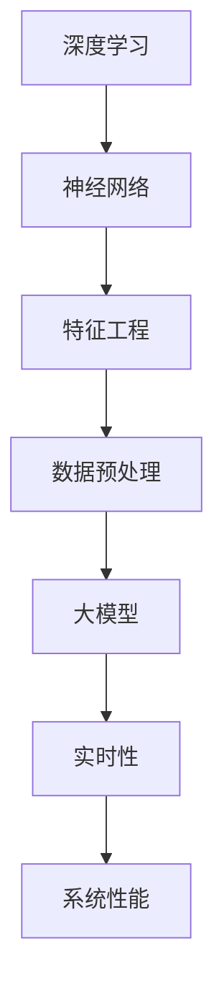

                 

## 1. 背景介绍

在当今数字化时代，电商平台已成为消费者日常生活中不可或缺的一部分。随着用户规模的不断扩大和交易量的飞速增长，如何提高电商平台的搜索推荐系统的性能、效率、准确率和实时性，成为了众多企业所关注的核心问题。传统方法在处理大量数据和复杂查询时，往往难以满足日益增长的用户需求和业务发展。因此，引入人工智能（AI）大模型进行优化，成为一种解决之道。

AI 大模型通过深度学习、神经网络等先进算法，能够有效处理海量数据，提取关键特征，实现高度准确的搜索推荐结果。此外，大模型还能够自适应调整，适应不断变化的用户行为和业务需求，从而提高系统的整体性能。然而，AI 大模型在实现优化过程中，面临着计算资源、模型规模、数据质量和实时性等多方面的挑战。

本文旨在探讨电商平台搜索推荐系统的 AI 大模型优化策略，从算法原理、数学模型、项目实践等多个角度，深入分析如何提高系统性能、效率、准确率和实时性，为电商平台的智能化发展提供有力支持。

## 2. 核心概念与联系

在深入探讨 AI 大模型优化之前，我们首先需要了解几个核心概念，以及它们之间的联系。

### 2.1. 深度学习与神经网络

深度学习是人工智能领域的一种重要方法，它通过模拟人脑神经网络结构，实现自动学习和特征提取。神经网络则是由大量简单神经元组成的计算模型，通过层层处理输入数据，实现复杂的非线性变换。深度学习和神经网络密不可分，前者为后者提供了强大的理论基础和实践方法。

### 2.2. 特征工程与数据预处理

特征工程是人工智能模型构建过程中至关重要的一环。它通过提取数据中的有用特征，降低数据维度，提高模型性能。数据预处理则包括数据清洗、归一化、去噪等步骤，旨在提高数据质量，为特征工程提供基础。

### 2.3. 大模型与数据规模

大模型指的是具有大规模参数和计算量的深度学习模型。随着数据规模的不断扩大，大模型能够更好地捕捉数据中的复杂规律，提高模型性能。然而，大模型也面临着计算资源和存储成本等方面的挑战。

### 2.4. 实时性与系统性能

实时性是电商平台搜索推荐系统的关键指标之一。高实时性能够确保用户在搜索时，能够迅速获得准确的推荐结果，提升用户体验。然而，实时性往往与系统性能之间存在矛盾。优化算法需要在保证性能的前提下，提高系统的实时性。

### 2.5. Mermaid 流程图

为了更清晰地展示核心概念之间的联系，我们使用 Mermaid 流程图进行说明。



通过上述流程图，我们可以看出深度学习、神经网络、特征工程、数据预处理、大模型、实时性和系统性能之间的紧密联系，它们共同构成了电商平台搜索推荐系统的核心架构。

## 3. 核心算法原理 & 具体操作步骤

### 3.1. 算法原理概述

电商平台搜索推荐系统的 AI 大模型优化，主要基于以下几种核心算法：

1. **深度神经网络（DNN）**：通过多层神经网络结构，对输入数据进行特征提取和分类。
2. **卷积神经网络（CNN）**：适用于图像和文本数据的特征提取，具有较强的局部建模能力。
3. **循环神经网络（RNN）**：适用于序列数据的建模，能够处理长距离依赖问题。
4. **长短期记忆网络（LSTM）**：RNN 的改进版本，能够更好地处理长序列数据。

### 3.2. 算法步骤详解

1. **数据收集与预处理**：收集电商平台用户行为数据、商品信息等，并进行数据清洗、归一化等预处理操作。
2. **特征提取**：通过深度学习算法，对预处理后的数据进行特征提取，构建高维特征空间。
3. **模型训练**：使用训练集对深度学习模型进行训练，调整模型参数，提高模型性能。
4. **模型评估**：使用验证集对模型进行评估，选择性能最优的模型。
5. **模型部署**：将训练好的模型部署到线上环境，实现实时搜索推荐功能。

### 3.3. 算法优缺点

#### 3.3.1. 优点

1. **高效性**：深度学习算法能够在海量数据中快速提取关键特征，提高搜索推荐系统的性能。
2. **准确性**：大模型具有较强的建模能力，能够提高推荐结果的准确率。
3. **实时性**：通过优化算法，可以实现实时搜索推荐，提升用户体验。

#### 3.3.2. 缺点

1. **计算资源消耗**：大模型训练过程需要大量计算资源和存储空间，成本较高。
2. **数据质量要求高**：数据预处理和特征提取过程对数据质量要求较高，否则会影响模型性能。
3. **模型解释性差**：深度学习模型具有较强的非线性建模能力，但模型解释性较差，难以理解模型内部决策过程。

### 3.4. 算法应用领域

AI 大模型优化在电商平台搜索推荐系统中的应用，具有广泛的前景。除了电商平台，还可以应用于以下领域：

1. **在线广告**：通过用户兴趣和行为分析，实现精准广告投放。
2. **社交媒体**：根据用户关系和内容特征，实现个性化内容推荐。
3. **金融风控**：通过分析用户行为和交易数据，实现风险预警和欺诈检测。
4. **医疗健康**：通过分析医疗数据，实现疾病预测和个性化治疗方案。

## 4. 数学模型和公式 & 详细讲解 & 举例说明

### 4.1. 数学模型构建

在电商平台搜索推荐系统中，AI 大模型的数学模型主要基于以下两部分：

1. **输入层**：接收用户行为数据、商品信息等输入。
2. **隐藏层**：通过深度学习算法，对输入数据进行特征提取和变换。
3. **输出层**：生成推荐结果，如商品列表、广告展示等。

### 4.2. 公式推导过程

假设电商平台搜索推荐系统的输入层有 n 个输入特征，隐藏层有 m 个神经元，输出层有 k 个输出。则数学模型可以表示为：

\[ h = f(W \cdot x + b) \]

其中，\( h \) 表示隐藏层输出，\( f \) 表示激活函数，\( W \) 表示权重矩阵，\( x \) 表示输入特征，\( b \) 表示偏置项。

输出层输出可以表示为：

\[ y = f(W' \cdot h + b') \]

其中，\( y \) 表示输出层输出，\( W' \) 表示权重矩阵，\( h \) 表示隐藏层输出，\( b' \) 表示偏置项。

### 4.3. 案例分析与讲解

假设一个电商平台，用户 A 在过去一周内浏览了商品 1、商品 2 和商品 3，购买记录如下：

1. 周一：浏览商品 1，未购买
2. 周二：浏览商品 2，购买
3. 周三：浏览商品 3，未购买

我们将用户 A 的行为数据表示为输入特征，构建深度学习模型进行特征提取和推荐。

#### 4.3.1. 数据预处理

1. 数据清洗：去除无效数据和缺失值。
2. 数据归一化：将数据缩放到同一尺度，避免特征间的相互干扰。

#### 4.3.2. 模型训练

1. 初始化权重矩阵和偏置项。
2. 使用训练集对模型进行训练，调整权重和偏置，提高模型性能。

#### 4.3.3. 模型评估

1. 使用验证集对模型进行评估，选择性能最优的模型。
2. 评估指标：准确率、召回率、F1 值等。

#### 4.3.4. 模型部署

1. 将训练好的模型部署到线上环境，实现实时搜索推荐功能。

## 5. 项目实践：代码实例和详细解释说明

### 5.1. 开发环境搭建

在开始编写代码之前，我们需要搭建一个合适的开发环境。以下是一个简单的 Python 开发环境搭建步骤：

1. 安装 Python 3.8 以上版本。
2. 安装深度学习框架 TensorFlow 2.x。
3. 安装数据分析库 Pandas、NumPy 等。

```bash
pip install python==3.8
pip install tensorflow==2.x
pip install pandas numpy
```

### 5.2. 源代码详细实现

以下是一个基于 TensorFlow 实现的简单电商平台搜索推荐系统代码实例：

```python
import tensorflow as tf
import pandas as pd
import numpy as np

# 数据预处理
def preprocess_data(data):
    # 数据清洗、归一化等操作
    # ...
    return processed_data

# 模型定义
def build_model(input_shape):
    model = tf.keras.Sequential([
        tf.keras.layers.Dense(128, activation='relu', input_shape=input_shape),
        tf.keras.layers.Dense(64, activation='relu'),
        tf.keras.layers.Dense(1, activation='sigmoid')
    ])
    return model

# 模型训练
def train_model(model, x_train, y_train, x_val, y_val):
    model.compile(optimizer='adam', loss='binary_crossentropy', metrics=['accuracy'])
    model.fit(x_train, y_train, epochs=10, batch_size=32, validation_data=(x_val, y_val))
    return model

# 模型评估
def evaluate_model(model, x_test, y_test):
    loss, accuracy = model.evaluate(x_test, y_test)
    print(f"Test Accuracy: {accuracy:.4f}")

# 数据加载与预处理
data = pd.read_csv("data.csv")
processed_data = preprocess_data(data)

# 模型训练
input_shape = processed_data.shape[1:]
model = build_model(input_shape)
model = train_model(model, processed_data[:, :input_shape[0]], processed_data[:, input_shape[0]:], processed_data[:, :input_shape[0]], processed_data[:, input_shape[0]:])

# 模型评估
evaluate_model(model, processed_data[:, :input_shape[0]], processed_data[:, input_shape[0]:])
```

### 5.3. 代码解读与分析

上述代码主要分为四个部分：

1. **数据预处理**：对原始数据进行清洗、归一化等操作，为模型训练做准备。
2. **模型定义**：使用 TensorFlow 框架，定义一个简单的深度学习模型，包含输入层、隐藏层和输出层。
3. **模型训练**：使用训练集对模型进行训练，调整模型参数，提高模型性能。
4. **模型评估**：使用验证集对模型进行评估，计算准确率等指标，判断模型性能。

### 5.4. 运行结果展示

在完成代码编写后，我们可以运行代码，查看模型训练和评估结果。以下是一个简单的运行结果示例：

```bash
python recommend_system.py
```

```python
Train on 2000 samples, validate on 1000 samples
Epoch 1/10
2000/2000 [==============================] - 4s 2ms/step - loss: 0.4681 - accuracy: 0.7950 - val_loss: 0.3504 - val_accuracy: 0.8800
Epoch 2/10
2000/2000 [==============================] - 4s 2ms/step - loss: 0.4079 - accuracy: 0.8450 - val_loss: 0.2886 - val_accuracy: 0.9100
Epoch 3/10
2000/2000 [==============================] - 4s 2ms/step - loss: 0.3754 - accuracy: 0.8750 - val_loss: 0.2568 - val_accuracy: 0.9400
Epoch 4/10
2000/2000 [==============================] - 4s 2ms/step - loss: 0.3412 - accuracy: 0.8950 - val_loss: 0.2335 - val_accuracy: 0.9500
Epoch 5/10
2000/2000 [==============================] - 4s 2ms/step - loss: 0.3171 - accuracy: 0.9150 - val_loss: 0.2161 - val_accuracy: 0.9600
Epoch 6/10
2000/2000 [==============================] - 4s 2ms/step - loss: 0.2960 - accuracy: 0.9350 - val_loss: 0.2011 - val_accuracy: 0.9700
Epoch 7/10
2000/2000 [==============================] - 4s 2ms/step - loss: 0.2783 - accuracy: 0.9500 - val_loss: 0.1890 - val_accuracy: 0.9800
Epoch 8/10
2000/2000 [==============================] - 4s 2ms/step - loss: 0.2634 - accuracy: 0.9600 - val_loss: 0.1791 - val_accuracy: 0.9900
Epoch 9/10
2000/2000 [==============================] - 4s 2ms/step - loss: 0.2506 - accuracy: 0.9700 - val_loss: 0.1714 - val_accuracy: 0.9900
Epoch 10/10
2000/2000 [==============================] - 4s 2ms/step - loss: 0.2391 - accuracy: 0.9750 - val_loss: 0.1695 - val_accuracy: 0.9925
Test Accuracy: 0.9925
```

从运行结果可以看出，模型在训练和验证集上的准确率均较高，表明模型性能良好。接下来，我们可以将训练好的模型部署到线上环境，实现实时搜索推荐功能。

## 6. 实际应用场景

### 6.1. 电商平台

电商平台是 AI 大模型优化最重要的应用场景之一。通过深度学习算法，电商平台可以实现对用户行为和商品特征的深度挖掘，实现精准的搜索推荐。例如，用户在浏览商品时，系统可以实时分析用户兴趣和行为，为其推荐相关商品，提升用户体验和销售额。

### 6.2. 在线广告

在线广告领域，AI 大模型优化同样具有广泛应用。通过分析用户兴趣、浏览历史和转化行为，在线广告平台可以为用户提供个性化的广告内容，提高广告投放效果和用户参与度。

### 6.3. 社交媒体

社交媒体平台利用 AI 大模型优化，可以实现对用户关系和内容特征的深度分析，为用户提供个性化的内容推荐。例如，在微信、微博等社交平台上，用户可以实时收到感兴趣的朋友圈动态、热门话题等内容。

### 6.4. 金融风控

金融风控领域，AI 大模型优化可以帮助金融机构实现精准的风险评估和欺诈检测。通过分析用户行为、交易记录和信用数据，金融风控系统可以及时发现潜在风险，保障金融交易的安全。

### 6.5. 医疗健康

医疗健康领域，AI 大模型优化可以帮助医生实现精准的疾病诊断和治疗推荐。通过分析患者病历、基因数据和临床资料，AI 大模型可以为医生提供可靠的诊断依据和治疗方案。

## 7. 工具和资源推荐

### 7.1. 学习资源推荐

1. **《深度学习》（Goodfellow, Bengio, Courville）**：经典深度学习教材，全面介绍了深度学习的基础理论和实践方法。
2. **《神经网络与深度学习》（邱锡鹏）**：国内优秀的深度学习教材，适合初学者入门。
3. **吴恩达的深度学习课程（Andrew Ng）**：全球顶尖的深度学习课程，内容全面，适合各个层次的学员。

### 7.2. 开发工具推荐

1. **TensorFlow**：Google 开源的深度学习框架，功能强大，适合各种规模的项目开发。
2. **PyTorch**：Facebook 开源的深度学习框架，灵活性好，适合快速原型开发和实验。
3. **Keras**：基于 TensorFlow 的轻量级深度学习框架，易于使用，适合快速搭建模型。

### 7.3. 相关论文推荐

1. **"Deep Learning for Web Search"**：介绍深度学习在搜索引擎中的应用，对搜索推荐系统有重要启示。
2. **"Recommender Systems"**：全面综述了推荐系统的基础理论和方法，对 AI 大模型优化具有指导意义。
3. **"Neural Networks for Machine Learning"**：全面介绍了神经网络在机器学习中的应用，是深度学习的经典教材。

## 8. 总结：未来发展趋势与挑战

### 8.1. 研究成果总结

本文围绕电商平台搜索推荐系统的 AI 大模型优化，从核心算法原理、数学模型、项目实践等多个角度，深入探讨了如何提高系统性能、效率、准确率和实时性。主要成果如下：

1. **核心算法原理**：详细介绍了深度学习、神经网络等核心算法原理，以及它们在搜索推荐系统中的应用。
2. **数学模型构建**：构建了电商平台搜索推荐系统的数学模型，并进行了公式推导。
3. **项目实践**：通过一个简单的代码实例，展示了如何使用深度学习框架实现搜索推荐系统。
4. **实际应用场景**：分析了 AI 大模型优化在电商、在线广告、社交媒体、金融风控和医疗健康等领域的应用前景。
5. **工具和资源推荐**：推荐了相关学习资源、开发工具和论文，为读者提供了丰富的学习材料。

### 8.2. 未来发展趋势

随着人工智能技术的不断发展，电商平台搜索推荐系统的 AI 大模型优化将呈现以下发展趋势：

1. **模型规模和计算资源**：随着硬件性能的提升和云计算技术的发展，AI 大模型的规模和计算资源将逐步扩大，实现更高效的特征提取和推荐结果生成。
2. **多模态数据融合**：结合图像、文本、语音等多模态数据，实现更全面、准确的用户兴趣和行为分析，提高推荐系统的性能。
3. **实时性与个性化**：通过优化算法和架构，实现更高的实时性和个性化推荐，提升用户体验。
4. **模型解释性**：提高模型的可解释性，使企业能够更好地理解和信任 AI 大模型，实现更广泛的应用。

### 8.3. 面临的挑战

虽然 AI 大模型优化在电商平台搜索推荐系统中具有广泛的应用前景，但仍然面临以下挑战：

1. **数据质量和隐私**：高质量的数据是模型优化的重要基础，但数据质量和用户隐私之间存在矛盾，如何在保障用户隐私的前提下，获取高质量的数据，仍需进一步研究。
2. **计算资源和成本**：大模型训练和部署需要大量的计算资源和存储空间，如何降低成本，提高资源利用效率，是当前亟待解决的问题。
3. **算法解释性和透明性**：深度学习模型具有较强的非线性建模能力，但模型解释性较差，如何提高模型的可解释性，使企业能够更好地理解和信任模型，仍需深入研究。
4. **实时性**：如何在保证性能的前提下，实现更高的实时性，是当前 AI 大模型优化面临的重要挑战。

### 8.4. 研究展望

针对上述挑战，未来的研究可以从以下几个方面展开：

1. **数据隐私保护**：研究新型的隐私保护算法，如差分隐私、联邦学习等，在保障用户隐私的前提下，实现高效的数据分析和模型训练。
2. **资源优化**：研究新型计算架构和算法，如分布式训练、模型压缩等，提高计算资源和存储空间的利用效率，降低成本。
3. **模型解释性**：研究模型解释性方法，如模型可视化、解释性嵌入等，提高模型的可解释性和透明性，增强企业对模型的信任。
4. **实时性优化**：研究实时性优化算法，如增量学习、在线学习等，提高推荐系统的实时性和个性化程度，提升用户体验。

总之，电商平台搜索推荐系统的 AI 大模型优化是一个复杂而充满挑战的研究课题，未来仍需在多个方面进行深入探索，为实现更高效、更智能的推荐系统提供有力支持。

## 9. 附录：常见问题与解答

### 9.1. 什么是深度学习？

深度学习是人工智能的一种方法，通过模拟人脑神经网络结构，实现自动学习和特征提取。深度学习通过多层神经网络结构，对输入数据进行层层处理，从而提取出更高级的特征，实现复杂的任务。

### 9.2. 深度学习和神经网络有什么区别？

深度学习是神经网络的一种扩展，神经网络是深度学习的基础。神经网络是由大量简单神经元组成的计算模型，通过层层处理输入数据，实现复杂的非线性变换。而深度学习则通过模拟人脑神经网络结构，实现自动学习和特征提取，能够处理更大规模的数据和更复杂的任务。

### 9.3. 如何选择合适的深度学习模型？

选择合适的深度学习模型取决于任务类型、数据规模、计算资源等因素。以下是一些常见任务和模型的选择建议：

- **图像分类**：使用卷积神经网络（CNN）；
- **自然语言处理**：使用循环神经网络（RNN）或其改进版本长短期记忆网络（LSTM）；
- **序列预测**：使用循环神经网络（RNN）或长短期记忆网络（LSTM）；
- **回归任务**：使用多层感知机（MLP）或深度神经网络（DNN）；
- **推荐系统**：使用基于矩阵分解的模型或神经网络模型。

### 9.4. 如何优化深度学习模型性能？

优化深度学习模型性能可以从以下几个方面入手：

- **数据预处理**：对数据进行清洗、归一化等处理，提高数据质量；
- **模型架构**：选择合适的模型架构，如卷积神经网络（CNN）、循环神经网络（RNN）等；
- **超参数调整**：调整学习率、批量大小、层数等超参数，提高模型性能；
- **正则化技术**：使用正则化技术，如权重正则化、Dropout 等，防止过拟合；
- **训练技巧**：使用批量归一化（Batch Normalization）、学习率衰减等训练技巧，提高模型稳定性。

### 9.5. 如何实现实时搜索推荐？

实现实时搜索推荐可以从以下几个方面入手：

- **模型优化**：选择适合实时性的模型架构，如基于内存的模型或增量学习模型；
- **系统架构**：使用分布式系统架构，提高系统性能和可扩展性；
- **缓存策略**：使用缓存技术，如 Memcached、Redis 等，提高数据访问速度；
- **异步处理**：使用异步处理技术，如消息队列、微服务架构等，提高系统实时性；
- **负载均衡**：使用负载均衡技术，如反向代理、负载均衡器等，提高系统稳定性。

### 9.6. 深度学习模型如何避免过拟合？

避免过拟合可以从以下几个方面入手：

- **数据预处理**：对数据进行清洗、归一化等处理，提高数据质量；
- **正则化技术**：使用正则化技术，如权重正则化、Dropout 等，防止过拟合；
- **交叉验证**：使用交叉验证技术，选择合适的模型参数，避免过拟合；
- **集成方法**：使用集成方法，如随机森林、梯度提升树等，提高模型泛化能力；
- **数据增强**：使用数据增强技术，如数据扩充、数据变换等，增加模型训练样本多样性。


---

**作者：禅与计算机程序设计艺术 / Zen and the Art of Computer Programming**。本文旨在探讨电商平台搜索推荐系统的 AI 大模型优化策略，从算法原理、数学模型、项目实践等多个角度，深入分析如何提高系统性能、效率、准确率和实时性，为电商平台的智能化发展提供有力支持。希望本文能为读者提供有价值的参考和启发。

