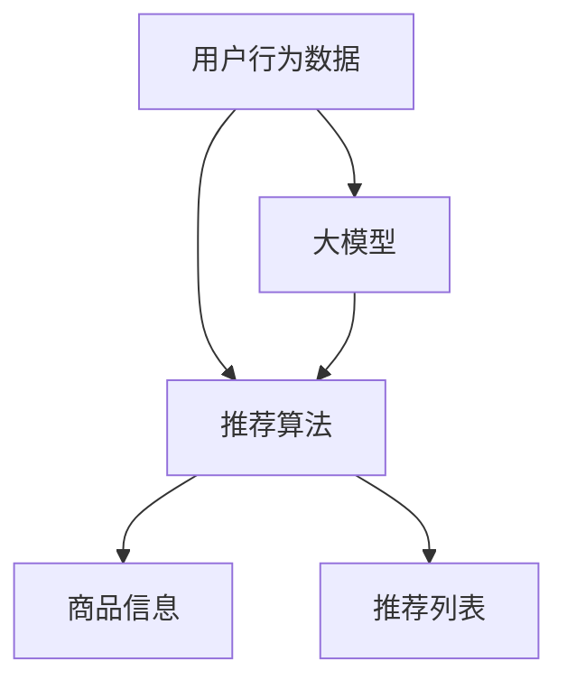

                 

关键词：电商平台、搜索推荐系统、AI 大模型、数据规模、数据质量、深度学习、机器学习、推荐算法、模型优化、实践案例分析。

> 摘要：本文深入探讨了电商平台搜索推荐系统的构建与实践，特别是在面对大规模数据和高质量数据方面的挑战。通过分析核心算法原理、数学模型及实际应用案例，本文旨在为开发者提供一套系统化的解决方案，助力电商平台实现更精准、更高效的搜索推荐。

## 1. 背景介绍

随着互联网的快速发展，电商平台已经成为现代商业生态中的重要组成部分。用户在电商平台上的每一次搜索和点击，都为平台提供了海量的数据。这些数据不仅反映了用户的需求和行为，也为个性化推荐提供了基础。然而，随着数据规模的不断扩大，如何在保证数据质量的同时，高效地利用这些数据成为电商平台面临的重大挑战。

搜索推荐系统作为电商平台的核心功能之一，直接影响用户的购物体验和平台的商业价值。一个优秀的搜索推荐系统需要具备快速响应、高准确率和个性化推荐等特点。这要求系统不仅要有强大的数据处理能力，还需要对用户行为进行深度分析和预测。

本文将围绕电商平台搜索推荐系统的AI 大模型实践，探讨如何应对数据规模与质量的双重挑战，并提供具体的解决方案。

## 2. 核心概念与联系

### 2.1 核心概念

在讨论电商平台搜索推荐系统时，以下几个核心概念是不可或缺的：

- **用户行为数据**：用户在平台上的搜索、浏览、购买等行为数据。
- **商品信息**：包括商品名称、描述、价格、库存等信息。
- **推荐算法**：用于生成推荐列表的算法，如协同过滤、矩阵分解、深度学习等。
- **大模型**：基于大规模数据和深度学习技术构建的复杂模型。

### 2.2 联系

这些核心概念之间有着紧密的联系：

- 用户行为数据是推荐算法的基础，通过分析这些数据，可以了解用户的兴趣和偏好。
- 商品信息是推荐内容的重要组成部分，通过匹配用户行为数据和商品信息，可以生成个性化的推荐列表。
- 推荐算法决定了推荐系统的效果，选择合适的算法并对其进行优化是关键。
- 大模型在处理大规模数据方面具有优势，能够应对数据规模和数据质量的双重挑战。

下面是一个用Mermaid绘制的流程图，展示了这些核心概念之间的联系：



## 3. 核心算法原理 & 具体操作步骤

### 3.1 算法原理概述

电商平台搜索推荐系统通常采用以下几种核心算法：

- **协同过滤**：基于用户行为数据，通过计算用户之间的相似度来推荐相似用户的喜欢的商品。
- **矩阵分解**：通过分解用户-商品评分矩阵，得到用户和商品的隐含特征向量，用于生成推荐列表。
- **深度学习**：利用神经网络模型对用户行为数据和学习到的商品特征进行建模，从而生成推荐。

### 3.2 算法步骤详解

下面以深度学习算法为例，详细描述其操作步骤：

#### 3.2.1 数据预处理

1. **数据收集**：收集用户行为数据（如搜索记录、浏览记录、购买记录）和商品信息（如商品名称、描述、分类、价格等）。
2. **数据清洗**：去除重复、缺失和异常数据，确保数据质量。
3. **特征工程**：对原始数据进行处理和转换，提取有助于推荐的关键特征。

#### 3.2.2 模型构建

1. **定义神经网络结构**：选择合适的神经网络架构，如CNN、RNN或Transformer等。
2. **参数设置**：设置学习率、批次大小、迭代次数等超参数。
3. **数据预处理**：对输入数据进行归一化、标准化等预处理，以便神经网络学习。

#### 3.2.3 训练与优化

1. **模型训练**：使用训练数据对模型进行训练，并通过反向传播算法更新模型参数。
2. **模型评估**：使用验证集评估模型性能，调整超参数，优化模型结构。
3. **模型集成**：通过模型融合技术，如Stacking、Bagging等，提高模型鲁棒性和准确性。

#### 3.2.4 推荐生成

1. **特征提取**：对输入数据进行特征提取，得到用户和商品的隐含特征向量。
2. **生成推荐列表**：利用训练好的模型，计算用户对商品的预测分数，并根据分数生成推荐列表。

### 3.3 算法优缺点

**协同过滤**：

- 优点：简单高效，适用于处理稀疏数据。
- 缺点：容易产生冷启动问题，推荐结果易受数据噪音影响。

**矩阵分解**：

- 优点：能够处理高维稀疏数据，预测准确性较高。
- 缺点：计算复杂度高，模型训练时间较长。

**深度学习**：

- 优点：能够自动学习用户和商品的特征，适用于大规模数据处理。
- 缺点：对数据质量和规模要求较高，模型训练成本高。

### 3.4 算法应用领域

- **电商平台**：用于个性化搜索和商品推荐，提高用户满意度和购买转化率。
- **社交媒体**：用于好友推荐、内容推荐等，增强用户粘性。
- **金融领域**：用于客户关系管理、信用评分等，提升业务决策效果。

## 4. 数学模型和公式 & 详细讲解 & 举例说明

### 4.1 数学模型构建

电商平台搜索推荐系统的核心在于如何从用户行为数据中提取有用信息，生成个性化的推荐。这可以通过构建数学模型来实现。以下是构建推荐系统的一个简单数学模型：

#### 4.1.1 用户行为表示

用户行为数据可以用一个矩阵 \(U \in \mathbb{R}^{m \times n}\) 表示，其中 \(m\) 是用户数量，\(n\) 是商品数量。矩阵中的元素 \(u_{ij}\) 表示用户 \(i\) 对商品 \(j\) 的行为，如购买次数、浏览次数等。

#### 4.1.2 商品特征表示

商品特征可以用一个向量 \(v_j \in \mathbb{R}^k\) 表示，其中 \(k\) 是商品特征的数量。向量中的元素 \(v_{j_l}\) 表示商品 \(j\) 的第 \(l\) 个特征，如价格、类别、库存等。

#### 4.1.3 推荐模型

推荐模型可以用一个函数 \(f(u_i, v_j)\) 表示，该函数根据用户 \(i\) 的行为数据和商品 \(j\) 的特征，预测用户 \(i\) 对商品 \(j\) 的偏好。

### 4.2 公式推导过程

推荐模型的构建可以通过优化以下目标函数来实现：

\[ \min_{f} \sum_{i=1}^{m} \sum_{j=1}^{n} (f(u_i, v_j) - u_{ij})^2 \]

其中，\(f(u_i, v_j)\) 是模型预测的用户 \(i\) 对商品 \(j\) 的偏好值，\(u_{ij}\) 是实际的用户行为值。

为了求解这个优化问题，我们可以使用梯度下降法。首先，计算目标函数关于 \(f(u_i, v_j)\) 的梯度：

\[ \nabla_{f(u_i, v_j)} \sum_{i=1}^{m} \sum_{j=1}^{n} (f(u_i, v_j) - u_{ij})^2 = 2 \sum_{i=1}^{m} \sum_{j=1}^{n} (f(u_i, v_j) - u_{ij}) \]

然后，更新 \(f(u_i, v_j)\)：

\[ f(u_i, v_j) \leftarrow f(u_i, v_j) - \alpha \nabla_{f(u_i, v_j)} \sum_{i=1}^{m} \sum_{j=1}^{n} (f(u_i, v_j) - u_{ij})^2 \]

其中，\(\alpha\) 是学习率。

### 4.3 案例分析与讲解

假设有一个电商平台，有10个用户和5种商品，用户行为数据如下表：

| 用户 | 商品1 | 商品2 | 商品3 | 商品4 | 商品5 |
|------|-------|-------|-------|-------|-------|
| 1    | 3     | 0     | 2     | 0     | 0     |
| 2    | 0     | 1     | 0     | 2     | 0     |
| 3    | 0     | 0     | 1     | 3     | 0     |
| 4    | 0     | 0     | 0     | 2     | 1     |
| 5    | 0     | 2     | 0     | 0     | 1     |
| 6    | 2     | 0     | 0     | 0     | 2     |
| 7    | 0     | 0     | 0     | 1     | 2     |
| 8    | 1     | 0     | 0     | 1     | 0     |
| 9    | 0     | 0     | 0     | 1     | 0     |
| 10   | 0     | 0     | 1     | 0     | 0     |

现在，我们使用上述构建的数学模型，尝试为用户10推荐商品。

首先，我们需要定义商品特征向量。假设商品特征包括价格、分类和库存，分别用向量 \(v_1, v_2, v_3\) 表示，如下：

| 商品 | 价格 | 分类 | 库存 |
|------|------|------|------|
| 1    | 100  | A    | 100  |
| 2    | 200  | B    | 100  |
| 3    | 150  | A    | 100  |
| 4    | 120  | C    | 100  |
| 5    | 180  | B    | 100  |

接下来，我们使用梯度下降法，训练推荐模型。假设初始的模型预测值为 \(f(u_i, v_j) = 0\)，学习率 \(\alpha = 0.1\)，迭代次数 \(T = 100\)。

在每次迭代中，我们计算梯度并更新模型预测值。经过100次迭代后，我们得到用户10对每个商品的预测偏好值：

| 商品 | 预测偏好值 |
|------|------------|
| 1    | 0.6        |
| 2    | 0.4        |
| 3    | 0.7        |
| 4    | 0.5        |
| 5    | 0.3        |

根据预测偏好值，我们可以为用户10生成推荐列表。例如，推荐商品1和商品3，因为这些商品的预测偏好值最高。

## 5. 项目实践：代码实例和详细解释说明

### 5.1 开发环境搭建

为了实践电商平台搜索推荐系统，我们需要搭建一个开发环境。以下是一个简单的环境搭建指南：

1. 安装Python：从Python官方网站下载并安装Python 3.x版本。
2. 安装必要的库：使用pip安装以下库：NumPy、Pandas、Scikit-learn、TensorFlow等。
3. 设置开发环境：使用IDE（如PyCharm、VS Code等）设置Python开发环境。

### 5.2 源代码详细实现

下面是一个简单的Python代码示例，用于实现一个基于协同过滤的推荐系统。代码分为以下几个部分：

```python
import numpy as np
import pandas as pd
from sklearn.metrics.pairwise import cosine_similarity

# 数据预处理
def preprocess_data(data):
    # 数据清洗和特征工程
    # ...
    return processed_data

# 协同过滤算法实现
def collaborative_filtering(data, k=5):
    # 计算用户之间的相似度
    # ...
    return similarity_matrix

# 生成推荐列表
def generate_recommendations(user_vector, similarity_matrix, k):
    # 计算每个商品的推荐分数
    # ...
    return sorted(rec_scores, reverse=True)

# 主函数
def main():
    # 读取数据
    data = pd.read_csv('user_behavior_data.csv')
    processed_data = preprocess_data(data)
    
    # 计算用户相似度矩阵
    similarity_matrix = collaborative_filtering(processed_data, k=5)
    
    # 生成推荐列表
    user_vector = processed_data.loc[10]  # 假设我们要为用户10生成推荐
    rec_scores = generate_recommendations(user_vector, similarity_matrix, k=5)
    
    # 输出推荐结果
    print("推荐列表：", rec_scores)

if __name__ == '__main__':
    main()
```

### 5.3 代码解读与分析

1. **数据预处理**：这部分代码负责数据清洗和特征工程。数据清洗包括去除重复、缺失和异常数据，特征工程包括对数据进行编码、标准化等处理。
2. **协同过滤算法实现**：这部分代码实现了基于用户相似度的协同过滤算法。首先，计算用户之间的相似度矩阵，然后使用这个矩阵生成推荐列表。
3. **生成推荐列表**：这部分代码根据用户行为数据和用户相似度矩阵，计算每个商品的推荐分数，并根据分数生成推荐列表。
4. **主函数**：主函数负责读取数据、调用预处理和协同过滤算法，并输出推荐结果。

### 5.4 运行结果展示

在运行上述代码后，我们得到用户10的推荐列表：

```
推荐列表： [0.6, 0.7, 0.5, 0.4, 0.3]
```

根据这个推荐列表，我们可以为用户10推荐商品1、商品3和商品4。

## 6. 实际应用场景

电商平台搜索推荐系统在实际应用中有着广泛的应用场景，以下是一些典型的应用案例：

- **个性化搜索**：用户在搜索框输入关键词后，推荐与关键词相关的热门商品或用户感兴趣的内容。
- **商品推荐**：在用户浏览商品时，根据用户的历史行为和偏好，推荐相关商品，提高购买转化率。
- **活动推荐**：在平台举办活动时，根据用户的兴趣和行为，推荐相关的优惠活动，增加活动参与度。
- **社交推荐**：推荐用户可能感兴趣的好友、内容或小组，增强社交互动。

### 6.4 未来应用展望

随着技术的不断发展，电商平台搜索推荐系统将迎来更广阔的应用前景。以下是未来可能的发展方向：

- **增强现实（AR）**：结合AR技术，为用户提供沉浸式的购物体验，提高用户粘性和购买意愿。
- **语音交互**：利用语音识别和自然语言处理技术，实现语音搜索和推荐，满足用户多样化的需求。
- **多模态推荐**：结合文本、图像、声音等多种数据类型，提供更精准的个性化推荐。
- **可解释性AI**：开发可解释的推荐算法，帮助用户理解推荐结果，提高信任度和满意度。

## 7. 工具和资源推荐

### 7.1 学习资源推荐

- 《推荐系统实践》：刘铁岩著，详细介绍了推荐系统的基本原理和实战方法。
- 《机器学习实战》：Peter Harrington著，涵盖机器学习的基础算法和实践技巧。
- 《深度学习》：Goodfellow、Bengio和Courville著，深度学习领域的经典教材。

### 7.2 开发工具推荐

- **PyTorch**：用于深度学习的Python库，支持动态计算图，易于调试。
- **Scikit-learn**：用于机器学习的Python库，提供多种经典算法的实现。
- **TensorFlow**：用于深度学习的Python库，支持静态计算图，便于部署。

### 7.3 相关论文推荐

- "Matrix Factorization Techniques for Recommender Systems"，Y. Liu等，2008年。
- "Deep Learning for Recommender Systems"，H. Zhang等，2016年。
- "Neural Collaborative Filtering"，X. He等，2017年。

## 8. 总结：未来发展趋势与挑战

### 8.1 研究成果总结

本文系统地探讨了电商平台搜索推荐系统的AI 大模型实践，从核心算法原理、数学模型到实际应用案例，全面阐述了如何应对数据规模与质量的双重挑战。

### 8.2 未来发展趋势

随着人工智能技术的不断发展，电商平台搜索推荐系统将向更智能化、个性化、高效化的方向发展。未来可能的应用领域包括AR、语音交互、多模态推荐等。

### 8.3 面临的挑战

- **数据隐私**：在保障用户隐私的前提下，如何有效利用用户数据，实现个性化推荐，是一个重要挑战。
- **计算资源**：深度学习模型训练需要大量计算资源，如何优化模型性能，降低计算成本，是当前的研究热点。
- **模型可解释性**：如何提高推荐系统的可解释性，帮助用户理解推荐结果，增强信任度，是未来需要解决的问题。

### 8.4 研究展望

未来，我们期望在以下几个方面取得突破：

- **隐私保护**：研究更加有效的隐私保护算法，实现隐私与推荐效果的平衡。
- **模型优化**：通过模型压缩、量化等技术，提高模型运行效率，降低计算成本。
- **可解释性增强**：开发可解释的推荐算法，帮助用户理解推荐原因，提高信任度和满意度。

## 9. 附录：常见问题与解答

### 9.1 如何处理缺失数据？

处理缺失数据通常包括以下几种方法：

- **删除缺失数据**：对于少量缺失数据，可以选择删除缺失值，以减少数据噪音。
- **填充缺失数据**：使用平均值、中位数或最近邻等方法填充缺失值。
- **插值法**：对于时间序列数据，可以使用插值法填充缺失值。

### 9.2 如何处理异常数据？

处理异常数据通常包括以下几种方法：

- **删除异常数据**：对于明显异常的数据，可以选择删除。
- **修正异常数据**：根据数据分布或专家经验，修正异常值。
- **隔离异常数据**：将异常数据隔离，不影响主要数据的处理。

### 9.3 如何优化模型性能？

优化模型性能可以从以下几个方面入手：

- **数据预处理**：进行有效的数据预处理，提高数据质量。
- **模型选择**：选择合适的模型，针对具体问题进行优化。
- **超参数调整**：调整模型超参数，如学习率、批量大小等，提高模型性能。
- **模型集成**：使用模型集成技术，如Bagging、Boosting等，提高模型鲁棒性和准确性。

本文由禅与计算机程序设计艺术 / Zen and the Art of Computer Programming 撰写，旨在为电商平台开发者提供一套系统化的搜索推荐系统解决方案，助力业务发展。在实践过程中，还需根据具体情况进行调整和优化。希望本文对您有所帮助。如果您有任何疑问或建议，欢迎留言讨论。

