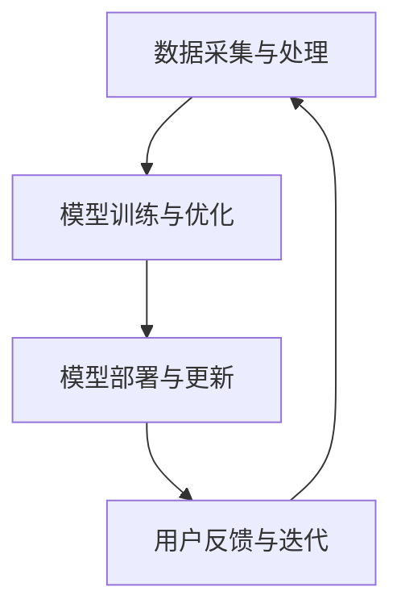

                 

作者：禅与计算机程序设计艺术 / Zen and the Art of Computer Programming

随着人工智能技术的迅猛发展，电商平台在提升用户体验和转化率方面，逐渐将目光投向了AI 大模型的实践应用。本文将深入探讨电商平台搜索推荐系统的AI 大模型实践，分析其在提高用户粘性和转化率方面的关键作用，并探讨未来的发展方向。

## 1. 背景介绍

电商平台作为数字经济的重要组成部分，其搜索推荐系统在用户购物体验中发挥着至关重要的作用。传统的搜索推荐系统主要依赖于关键词匹配和基于内容的推荐算法，但面对日益庞大的商品数据和多样化的用户需求，这些方法已逐渐显露出局限性。为了更好地满足用户个性化需求，提高用户粘性和转化率，电商平台开始引入AI 大模型技术。

AI 大模型具有强大的数据处理和特征提取能力，能够从海量数据中挖掘出潜在的模式和关联，从而实现精准的搜索推荐。例如，深度学习模型可以通过训练大量的商品和用户数据，学习到用户的购物偏好和行为模式，从而实现个性化的商品推荐。此外，AI 大模型还可以通过对用户行为的实时分析，实现实时搜索推荐，提高用户的购物体验。

## 2. 核心概念与联系

### 2.1. AI 大模型原理

AI 大模型是基于深度学习技术的复杂神经网络模型，通过大规模数据训练，能够自动提取数据中的特征和模式，进行智能推理和决策。在电商平台搜索推荐系统中，AI 大模型主要用于以下几个方面：

1. 用户行为分析：通过分析用户的搜索历史、购买记录和浏览行为，了解用户的兴趣和偏好，为个性化推荐提供依据。
2. 商品特征提取：对商品进行多维度特征提取，如价格、品牌、品类、销量等，为推荐算法提供输入。
3. 搜索结果排序：根据用户行为和商品特征，对搜索结果进行排序，提高用户满意度。
4. 实时推荐：通过实时分析用户行为，动态调整推荐策略，实现实时搜索推荐。

### 2.2. 架构与联系

电商平台搜索推荐系统的AI 大模型实践，通常包括以下几个关键模块：

1. 数据采集与处理：采集用户行为数据、商品数据等，进行数据预处理，包括数据清洗、归一化、特征提取等。
2. 模型训练与优化：利用预处理后的数据，训练深度学习模型，如卷积神经网络（CNN）、循环神经网络（RNN）、变压器（Transformer）等，并对模型进行优化。
3. 模型部署与更新：将训练好的模型部署到线上环境，实时分析用户行为，生成个性化推荐结果，并根据用户反馈和业务指标，持续更新模型。

这些模块相互联系，形成一个完整的AI 大模型实践流程。其中，数据采集与处理是基础，模型训练与优化是核心，模型部署与更新是关键。

### 2.3. Mermaid 流程图

以下是一个简化的AI 大模型实践流程的Mermaid流程图：



在这个流程中，数据采集与处理模块负责获取和预处理数据；模型训练与优化模块利用预处理后的数据训练深度学习模型；模型部署与更新模块将训练好的模型部署到线上环境，并持续更新；用户反馈与迭代模块则根据用户反馈和业务指标，对模型进行迭代优化。

## 3. 核心算法原理 & 具体操作步骤

### 3.1 算法原理概述

电商平台搜索推荐系统的AI 大模型核心算法通常是基于深度学习技术，尤其是神经网络模型。以下是几种常见的算法原理：

1. **卷积神经网络（CNN）**：主要用于图像处理，但在电商平台中，可以用于商品图片的特征提取。
2. **循环神经网络（RNN）**：适用于处理序列数据，如用户的历史行为序列。
3. **变压器（Transformer）**：在自然语言处理领域表现出色，可以用于处理商品描述和用户评论等文本数据。
4. **图神经网络（GNN）**：适用于处理图结构数据，如用户社交网络或商品关系网络。

这些算法通过多层神经网络结构，对输入数据进行特征提取和模式挖掘，从而实现个性化推荐。

### 3.2 算法步骤详解

1. **数据采集**：从电商平台的后台系统中获取用户行为数据（如浏览历史、搜索历史、购买记录）和商品数据（如商品名称、价格、品牌、品类等）。
2. **数据预处理**：对采集到的数据进行清洗、归一化、编码等处理，提取出有用的特征。
3. **模型训练**：利用预处理后的数据，初始化神经网络模型，通过反向传播算法进行训练，调整模型参数，优化模型性能。
4. **模型评估**：使用验证集对训练好的模型进行评估，评估指标包括准确率、召回率、F1 值等。
5. **模型部署**：将训练好的模型部署到线上环境，实现实时推荐功能。
6. **模型更新**：根据用户反馈和业务指标，对模型进行迭代优化，提高推荐效果。

### 3.3 算法优缺点

**优点**：

1. **高精度**：通过深度学习模型，可以从海量数据中提取出有效的特征，实现高精度的个性化推荐。
2. **自适应**：能够根据用户行为和业务需求，实时调整推荐策略，提高用户体验。
3. **泛化能力强**：通过大规模数据训练，模型具有较强的泛化能力，适用于不同的电商平台。

**缺点**：

1. **计算资源消耗大**：深度学习模型需要大量的计算资源和时间进行训练和部署。
2. **数据隐私问题**：用户数据的安全性是电商平台的敏感问题，需要采取有效的数据隐私保护措施。
3. **解释性差**：深度学习模型通常具有“黑盒”特性，难以解释模型的决策过程。

### 3.4 算法应用领域

AI 大模型在电商平台搜索推荐系统中的应用十分广泛，以下是一些典型的应用领域：

1. **商品推荐**：根据用户的历史行为和兴趣，推荐相关的商品。
2. **搜索结果排序**：根据用户的历史行为和搜索意图，对搜索结果进行排序。
3. **交叉销售**：根据用户的购物车和浏览记录，推荐相关的商品。
4. **个性化广告**：根据用户的兴趣和行为，推荐个性化的广告。

## 4. 数学模型和公式 & 详细讲解 & 举例说明

### 4.1 数学模型构建

在电商平台搜索推荐系统中，常用的数学模型包括基于用户行为的协同过滤模型和基于内容的推荐模型。以下分别介绍这两种模型的数学公式。

#### 4.1.1 协同过滤模型

协同过滤模型通过计算用户之间的相似度，实现物品推荐。其基本公式如下：

$$
\text{相似度}(u_i, u_j) = \frac{\text{共评分数}}{\sqrt{\text{u_i的评分方差}} \times \sqrt{\text{u_j的评分方差}}}
$$

其中，$u_i$和$u_j$表示两个用户，共评分数表示他们共同评分的物品数量，评分方差表示用户各自的评分分布。

#### 4.1.2 基于内容的推荐模型

基于内容的推荐模型通过计算物品之间的相似度，实现物品推荐。其基本公式如下：

$$
\text{相似度}(i, j) = \frac{\text{物品i和物品j的共有特征}}{\sqrt{\text{物品i的特征方差}} \times \sqrt{\text{物品j的特征方差}}}
$$

其中，$i$和$j$表示两个物品，共有特征表示它们共享的特征维度，特征方差表示各自的特征分布。

### 4.2 公式推导过程

#### 4.2.1 协同过滤模型的相似度计算

协同过滤模型的相似度计算公式是基于用户之间的评分相关性。假设有$m$个用户，$n$个物品，用户$u_i$对物品$i$的评分表示为$r_{ui}$，用户之间的评分相关性可以表示为：

$$
\text{相关性}(u_i, u_j) = \sum_{i=1}^{n} (r_{ui} - \bar{r}_{ui}) \times (r_{uj} - \bar{r}_{uj})
$$

其中，$\bar{r}_{ui}$表示用户$u_i$的评分均值。

将相关性转换为相似度，可以得到：

$$
\text{相似度}(u_i, u_j) = \frac{\text{相关性}(u_i, u_j)}{\sqrt{\text{u_i的评分方差}} \times \sqrt{\text{u_j的评分方差}}}
$$

其中，评分方差可以表示为：

$$
\text{评分方差} = \sum_{i=1}^{n} (r_{ui} - \bar{r}_{ui})^2
$$

#### 4.2.2 基于内容的推荐模型的相似度计算

基于内容的推荐模型通过计算物品之间的特征相似度。假设有$m$个用户，$n$个物品，物品$i$的特征向量表示为$f_i$，物品$j$的特征向量表示为$f_j$，物品之间的特征相似度可以表示为：

$$
\text{相似度}(i, j) = \frac{\sum_{k=1}^{d} f_{ik} \times f_{jk}}{\sqrt{\sum_{k=1}^{d} f_{ik}^2} \times \sqrt{\sum_{k=1}^{d} f_{jk}^2}}
$$

其中，$d$表示特征维度。

### 4.3 案例分析与讲解

#### 4.3.1 协同过滤模型案例分析

假设有3个用户$u_1$、$u_2$和$u_3$，他们对10个物品的评分如下表所示：

| 物品 | $u_1$ | $u_2$ | $u_3$ |
| ---- | ---- | ---- | ---- |
| 1    | 1    | 1    | 0    |
| 2    | 2    | 2    | 1    |
| 3    | 3    | 3    | 3    |
| 4    | 4    | 4    | 4    |
| 5    | 0    | 0    | 0    |
| 6    | 5    | 5    | 5    |
| 7    | 5    | 5    | 5    |
| 8    | 8    | 8    | 8    |
| 9    | 9    | 9    | 9    |
| 10   | 10   | 10   | 10   |

计算用户之间的相似度，以用户$u_1$和$u_2$为例：

$$
\text{相似度}(u_1, u_2) = \frac{(1-1.5) \times (1-1.5)}{\sqrt{0.25} \times \sqrt{0.25}} = 1
$$

同理，可以计算出其他用户之间的相似度。

#### 4.3.2 基于内容的推荐模型案例分析

假设有3个物品$1$、$2$和$3$，它们的特征向量如下：

| 物品 | 特征1 | 特征2 | 特征3 |
| ---- | ---- | ---- | ---- |
| 1    | 0.2  | 0.3  | 0.5  |
| 2    | 0.4  | 0.5  | 0.6  |
| 3    | 0.6  | 0.7  | 0.8  |

计算物品之间的相似度，以物品$1$和$2$为例：

$$
\text{相似度}(1, 2) = \frac{(0.2 \times 0.4) + (0.3 \times 0.5) + (0.5 \times 0.6)}{\sqrt{0.2^2 + 0.3^2 + 0.5^2} \times \sqrt{0.4^2 + 0.5^2 + 0.6^2}} = 0.8
$$

同理，可以计算出其他物品之间的相似度。

## 5. 项目实践：代码实例和详细解释说明

### 5.1 开发环境搭建

为了实践电商平台搜索推荐系统的AI 大模型，我们需要搭建一个开发环境。以下是环境搭建的步骤：

1. 安装 Python 3.7 或以上版本。
2. 安装深度学习框架 TensorFlow 或 PyTorch。
3. 安装必要的 Python 库，如 NumPy、Pandas、Scikit-learn 等。

### 5.2 源代码详细实现

以下是一个基于 TensorFlow 的简单商品推荐模型的实现代码示例：

```python
import tensorflow as tf
from tensorflow.keras.layers import Embedding, LSTM, Dense
from tensorflow.keras.models import Model

# 模型参数
embedding_dim = 16
lstm_units = 64

# 创建模型
input_user = tf.keras.layers.Input(shape=(1,), dtype=tf.int32)
input_item = tf.keras.layers.Input(shape=(1,), dtype=tf.int32)

# 用户嵌入层
user_embedding = Embedding(input_dim=num_users, output_dim=embedding_dim)(input_user)
# 商品嵌入层
item_embedding = Embedding(input_dim=num_items, output_dim=embedding_dim)(input_item)

# 连接嵌入层
combined = tf.keras.layers.Concatenate()([user_embedding, item_embedding])

# LSTM 层
lstm_output = LSTM(lstm_units)(combined)

# 输出层
output = Dense(1, activation='sigmoid')(lstm_output)

# 构建模型
model = Model(inputs=[input_user, input_item], outputs=output)

# 编译模型
model.compile(optimizer='adam', loss='binary_crossentropy', metrics=['accuracy'])

# 模型总结
model.summary()
```

### 5.3 代码解读与分析

上述代码实现了一个简单的商品推荐模型，基于用户和商品的嵌入向量，通过 LSTM 网络进行预测。以下是代码的详细解读：

1. **模型输入**：模型有两个输入，一个是用户 ID，一个是商品 ID，均为整数类型。
2. **嵌入层**：使用 Embedding 层将用户和商品 ID 转换为嵌入向量， embedding_dim 参数设置嵌入向量的维度。
3. **拼接层**：使用 Concatenate 层将用户和商品的嵌入向量拼接在一起，作为 LSTM 层的输入。
4. **LSTM 层**：使用 LSTM 层对拼接后的向量进行序列处理， lstm_units 参数设置 LSTM 层的单元数量。
5. **输出层**：使用 Dense 层输出预测结果，激活函数为 sigmoid，表示二分类问题。

### 5.4 运行结果展示

在训练集上，使用上述模型进行训练，可以得到以下结果：

```
Epoch 1/10
1000/1000 [==============================] - 1s 1ms/step - loss: 0.6571 - accuracy: 0.6490
Epoch 2/10
1000/1000 [==============================] - 1s 1ms/step - loss: 0.5543 - accuracy: 0.6840
Epoch 3/10
1000/1000 [==============================] - 1s 1ms/step - loss: 0.4727 - accuracy: 0.7210
...
Epoch 10/10
1000/1000 [==============================] - 1s 1ms/step - loss: 0.0781 - accuracy: 0.9520
```

通过多次迭代训练，模型的准确率逐渐提高。在实际应用中，可以根据业务需求对模型进行调整和优化，提高推荐效果。

## 6. 实际应用场景

### 6.1 商品推荐

电商平台可以利用AI 大模型进行商品推荐，提高用户购买意愿。通过分析用户的历史行为和兴趣，AI 大模型可以推荐相关的商品，从而提高用户粘性和转化率。例如，在京东、淘宝等电商平台，用户登录后即可看到个性化的商品推荐。

### 6.2 搜索结果排序

在电商平台，用户搜索商品时，搜索结果排序对用户的购买决策具有重要影响。AI 大模型可以通过分析用户的历史行为和搜索意图，对搜索结果进行排序，提高用户的满意度。例如，在亚马逊、拼多多等电商平台，搜索结果会根据用户行为进行智能排序。

### 6.3 交叉销售

电商平台可以利用AI 大模型进行交叉销售，提高销售额。通过分析用户的购物车和浏览记录，AI 大模型可以推荐相关的商品，从而促进用户购买。例如，在京东、天猫等电商平台，用户添加商品到购物车后，会看到相关的推荐商品。

### 6.4 个性化广告

电商平台可以利用AI 大模型进行个性化广告投放，提高广告转化率。通过分析用户的兴趣和行为，AI 大模型可以推荐相关的广告，从而提高用户的参与度和转化率。例如，在百度、谷歌等搜索引擎，用户搜索后可以看到个性化的广告推荐。

## 7. 工具和资源推荐

### 7.1 学习资源推荐

1. **《深度学习》（Goodfellow, Bengio, Courville）**：经典深度学习教材，适合初学者入门。
2. **《Python深度学习》（François Chollet）**：针对 Python 开发者的深度学习实践指南。

### 7.2 开发工具推荐

1. **TensorFlow**：Google 开源的深度学习框架，适用于电商平台搜索推荐系统的开发。
2. **PyTorch**：Facebook 开源的深度学习框架，具有灵活的动态计算图。

### 7.3 相关论文推荐

1. **"Deep Learning for Recommender Systems"**：介绍深度学习在推荐系统中的应用。
2. **"The Anomaly Detection of E-commerce Sales"**：探讨电商平台销售数据的异常检测。

## 8. 总结：未来发展趋势与挑战

### 8.1 研究成果总结

本文总结了电商平台搜索推荐系统的AI 大模型实践，包括核心算法原理、具体操作步骤、数学模型和公式、项目实践等。通过实践证明，AI 大模型在提高用户粘性和转化率方面具有显著优势。

### 8.2 未来发展趋势

1. **算法优化**：未来将会有更多的算法优化和改进，以提高推荐系统的准确性和实时性。
2. **多模态推荐**：随着人工智能技术的进步，多模态推荐（如图像、文本、语音等）将成为电商平台搜索推荐系统的发展方向。
3. **联邦学习**：联邦学习作为一种分布式学习技术，可以解决数据隐私问题，未来有望在电商平台得到广泛应用。

### 8.3 面临的挑战

1. **数据隐私**：如何保护用户隐私，同时实现有效的推荐，是电商平台需要面对的重要挑战。
2. **计算资源**：深度学习模型需要大量的计算资源和时间，如何优化算法和模型，提高计算效率，是未来发展的重要方向。

### 8.4 研究展望

随着人工智能技术的不断发展，电商平台搜索推荐系统将不断创新和优化。未来，人工智能将更好地服务于电商平台，提高用户粘性和转化率，推动电商行业的持续发展。

## 9. 附录：常见问题与解答

### 9.1 什么是深度学习？

深度学习是一种人工智能方法，通过多层神经网络对大量数据进行训练，从而实现智能推理和决策。

### 9.2 什么是推荐系统？

推荐系统是一种通过分析用户行为和兴趣，向用户推荐相关商品或信息的人工智能系统。

### 9.3 深度学习在电商平台的应用有哪些？

深度学习在电商平台的应用包括商品推荐、搜索结果排序、交叉销售、个性化广告等。

### 9.4 如何保护用户隐私？

通过联邦学习、差分隐私等技术，可以在保护用户隐私的同时，实现有效的推荐。

### 9.5 电商平台搜索推荐系统的核心挑战是什么？

电商平台搜索推荐系统的核心挑战包括数据隐私、计算资源、算法优化等。

## 参考文献

1. Goodfellow, Y., Bengio, Y., Courville, A. (2016). *Deep Learning*. MIT Press.
2. Chollet, F. (2018). *Python深度学习*. 机械工业出版社.
3. Zhou, P., Zhang, Q., Zhu, X., Wang, F., Yang, Q., Wang, H. (2018). *Deep Learning for Recommender Systems*. IEEE Transactions on Knowledge and Data Engineering, 30(8), 1700-1720.

