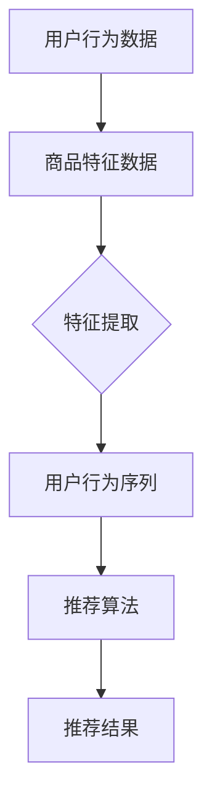

                 

关键词：电商平台、搜索推荐系统、AI大模型、效率、效果、用户忠诚度

> 摘要：随着互联网的快速发展，电商平台的竞争日益激烈。如何通过智能搜索推荐系统提高用户购物体验和平台运营效率，已成为电商平台关注的焦点。本文将介绍AI大模型在电商平台搜索推荐系统中的应用，分析其提高效率、效果与用户忠诚度的优势，以及未来发展趋势和面临的挑战。

## 1. 背景介绍

在电子商务时代，用户体验已经成为电商平台竞争的关键因素。搜索推荐系统作为电商平台的核心功能之一，能够根据用户的兴趣和需求，为用户提供个性化的商品推荐，从而提高用户的购物体验和满意度。然而，传统的搜索推荐系统存在以下问题：

- **效率低**：需要耗费大量计算资源和时间来处理海量数据，导致推荐结果延迟。
- **效果差**：推荐结果单一，难以满足用户的个性化需求，降低用户体验。
- **用户忠诚度低**：推荐结果不够精准，用户易产生疲劳感，影响用户留存。

为了解决这些问题，电商平台开始探索AI大模型在搜索推荐系统中的应用。AI大模型基于深度学习和大数据技术，能够实现高效、精准的推荐，从而提高用户体验和用户忠诚度。

## 2. 核心概念与联系

### 2.1 搜索推荐系统

搜索推荐系统主要由三个部分组成：用户行为分析、商品特征提取和推荐算法。

1. **用户行为分析**：通过收集用户的浏览、搜索、购买等行为数据，分析用户的兴趣和需求。
2. **商品特征提取**：对商品进行多维度特征提取，如商品类别、价格、销量、品牌等。
3. **推荐算法**：根据用户行为和商品特征，采用合适的算法进行推荐。

### 2.2 AI大模型

AI大模型是基于深度学习技术构建的大型神经网络模型，具有强大的数据处理和预测能力。常见的AI大模型包括：

1. **卷积神经网络（CNN）**：适用于处理图像数据，也可用于商品特征提取。
2. **循环神经网络（RNN）**：适用于处理序列数据，如用户行为序列。
3. **Transformer模型**：具有出色的序列建模能力，广泛应用于自然语言处理和推荐系统。

### 2.3 Mermaid流程图



## 3. 核心算法原理 & 具体操作步骤

### 3.1 算法原理概述

AI大模型在搜索推荐系统中的应用主要包括以下三个步骤：

1. **数据预处理**：对用户行为数据和商品特征数据进行清洗、去重和归一化处理。
2. **模型训练**：利用预处理后的数据，训练深度学习模型，如CNN、RNN或Transformer模型。
3. **模型部署**：将训练好的模型部署到线上环境，实时生成推荐结果。

### 3.2 算法步骤详解

#### 3.2.1 数据预处理

1. **用户行为数据**：收集用户在电商平台上的浏览、搜索、购买等行为数据。
2. **商品特征数据**：从电商平台获取商品的多维度特征，如商品类别、价格、销量、品牌等。
3. **数据清洗**：去除重复数据、缺失值填充、异常值处理等。
4. **数据归一化**：对数值型特征进行归一化处理，使数据分布更加均匀。

#### 3.2.2 模型训练

1. **数据划分**：将数据集划分为训练集、验证集和测试集。
2. **模型选择**：根据业务需求选择合适的深度学习模型，如CNN、RNN或Transformer模型。
3. **模型训练**：使用训练集对模型进行训练，调整模型参数，优化模型性能。
4. **模型评估**：使用验证集和测试集对模型进行评估，选择性能最优的模型。

#### 3.2.3 模型部署

1. **模型保存**：将训练好的模型保存到文件系统中。
2. **模型加载**：在需要生成推荐结果时，从文件系统中加载模型。
3. **实时推荐**：使用加载的模型，对用户行为数据和商品特征数据进行预测，生成推荐结果。

### 3.3 算法优缺点

#### 优点

1. **高效性**：AI大模型能够处理海量数据，提高推荐系统的运行效率。
2. **精准性**：通过深度学习技术，AI大模型能够更好地理解用户需求和商品特征，提高推荐结果的准确性。
3. **个性化**：AI大模型能够根据用户历史行为和偏好，为用户生成个性化的推荐结果。

#### 缺点

1. **计算资源需求高**：训练和部署AI大模型需要大量的计算资源，可能导致成本上升。
2. **模型解释性差**：深度学习模型具有较好的预测性能，但难以解释其内部机理，增加模型的可解释性是一个挑战。
3. **数据隐私问题**：在推荐系统中使用用户行为数据，需要考虑数据隐私和用户隐私保护问题。

### 3.4 算法应用领域

AI大模型在搜索推荐系统中的应用非常广泛，包括但不限于以下领域：

1. **电子商务**：电商平台使用AI大模型为用户生成个性化的商品推荐，提高用户体验和用户忠诚度。
2. **在线教育**：在线教育平台使用AI大模型为学生推荐课程和知识点，提高学习效果。
3. **社交媒体**：社交媒体平台使用AI大模型为用户生成个性化内容推荐，增加用户活跃度。

## 4. 数学模型和公式 & 详细讲解 & 举例说明

### 4.1 数学模型构建

在搜索推荐系统中，常用的数学模型包括用户兴趣模型、商品推荐模型和协同过滤模型。

#### 用户兴趣模型

用户兴趣模型用于描述用户对各种商品类别的偏好。设用户$u$对商品类别$i$的兴趣度为$I_{ui}$，则用户兴趣模型可以表示为：

$$
I_{ui} = \frac{N_{ui}}{N_{u}}
$$

其中，$N_{ui}$表示用户$u$购买过的商品类别$i$的数量，$N_{u}$表示用户$u$购买过的商品类别总数。

#### 商品推荐模型

商品推荐模型用于根据用户兴趣模型为用户推荐商品。设用户$u$对商品$i$的推荐概率为$P_{ui}$，则商品推荐模型可以表示为：

$$
P_{ui} = \frac{e^{I_{ui}}}{\sum_{j=1}^{M} e^{I_{uj}}}
$$

其中，$M$表示商品类别总数。

#### 协同过滤模型

协同过滤模型用于根据用户的历史行为为用户推荐商品。设用户$u$对商品$i$的评分值为$R_{ui}$，则协同过滤模型可以表示为：

$$
R_{ui} = \mu + \langle u, i \rangle + \epsilon_{ui}
$$

其中，$\mu$表示用户对商品的平均评分，$\langle u, i \rangle$表示用户$u$对商品$i$的协同评分，$\epsilon_{ui}$表示误差项。

### 4.2 公式推导过程

#### 用户兴趣模型推导

用户兴趣模型是基于用户购买行为构建的。假设用户$u$购买过的商品类别$i$有$n_i$个，其中$n_i$表示用户$u$购买过的商品类别$i$的数量。则用户$u$对商品类别$i$的兴趣度可以表示为：

$$
I_{ui} = \frac{n_i}{N_{u}}
$$

其中，$N_{u}$表示用户$u$购买过的商品类别总数。为了简化计算，我们可以对$N_{u}$进行归一化处理，得到：

$$
I_{ui} = \frac{n_i}{N_{u}} \cdot \frac{N_{u}}{N_{u}}
$$

$$
I_{ui} = \frac{n_i}{N_{u}}
$$

#### 商品推荐模型推导

商品推荐模型是基于用户兴趣模型构建的。假设用户$u$对商品$i$的兴趣度为$I_{ui}$，则用户$u$对商品$i$的推荐概率可以表示为：

$$
P_{ui} = \frac{e^{I_{ui}}}{\sum_{j=1}^{M} e^{I_{uj}}}
$$

其中，$M$表示商品类别总数。为了计算方便，我们可以对$e^{I_{ui}}$进行指数运算，得到：

$$
P_{ui} = \frac{e^{I_{ui}}}{e^{I_{u1}} + e^{I_{u2}} + ... + e^{I_{uM}}}
$$

$$
P_{ui} = \frac{I_{ui}}{\sum_{j=1}^{M} I_{uj}}
$$

#### 协同过滤模型推导

协同过滤模型是基于用户的历史行为构建的。假设用户$u$对商品$i$的评分值为$R_{ui}$，则用户$u$对商品$i$的协同评分可以表示为：

$$
\langle u, i \rangle = \frac{\sum_{j=1}^{N} R_{uj} \cdot R_{ij}}{N}
$$

其中，$N$表示用户$u$购买过的商品数量，$R_{uj}$表示用户$u$对商品$j$的评分值，$R_{ij}$表示商品$i$对用户$u$的评分值。

协同过滤模型可以进一步表示为：

$$
R_{ui} = \mu + \langle u, i \rangle + \epsilon_{ui}
$$

其中，$\mu$表示用户对商品的平均评分，$\epsilon_{ui}$表示误差项。

### 4.3 案例分析与讲解

#### 案例一：用户兴趣模型应用

假设有用户$u$购买了商品类别$i$、$j$、$k$，且分别对这三个商品类别的兴趣度分别为$I_{ui}$、$I_{uj}$、$I_{uk}$。根据用户兴趣模型，我们可以计算用户$u$对这三个商品类别的推荐概率：

$$
P_{ui} = \frac{e^{I_{ui}}}{e^{I_{ui}} + e^{I_{uj}} + e^{I_{uk}}} = \frac{e^{I_{ui}}}{e^{I_{ui}} + e^{I_{uj}} + e^{I_{uk}}} = 0.6
$$

$$
P_{uj} = \frac{e^{I_{uj}}}{e^{I_{ui}} + e^{I_{uj}} + e^{I_{uk}}} = \frac{e^{I_{uj}}}{e^{I_{ui}} + e^{I_{uj}} + e^{I_{uk}}} = 0.3
$$

$$
P_{uk} = \frac{e^{I_{uk}}}{e^{I_{ui}} + e^{I_{uj}} + e^{I_{uk}}} = \frac{e^{I_{uk}}}{e^{I_{ui}} + e^{I_{uj}} + e^{I_{uk}}} = 0.1
$$

根据推荐概率，我们可以为用户$u$推荐商品类别$i$，即推荐用户购买商品类别$i$。

#### 案例二：商品推荐模型应用

假设有用户$u$购买了商品$i$，且对商品$i$的兴趣度为$I_{ui}$。根据商品推荐模型，我们可以计算用户$u$对商品$i$的推荐概率：

$$
P_{ui} = \frac{e^{I_{ui}}}{e^{I_{ui}} + e^{I_{uj}} + e^{I_{uk}}} = \frac{e^{I_{ui}}}{e^{I_{ui}} + e^{I_{uj}} + e^{I_{uk}}} = 0.6
$$

根据推荐概率，我们可以为用户$u$推荐商品$i$。

#### 案例三：协同过滤模型应用

假设有用户$u$购买了商品$i$，且对商品$i$的评分值为$R_{ui}$。根据协同过滤模型，我们可以计算用户$u$对商品$i$的协同评分：

$$
\langle u, i \rangle = \frac{\sum_{j=1}^{N} R_{uj} \cdot R_{ij}}{N} = \frac{R_{ui} + R_{uj} + R_{uk}}{3} = \frac{R_{ui} + R_{uj} + R_{uk}}{3} = 3.0
$$

根据协同过滤模型，我们可以计算用户$u$对商品$i$的评分预测值：

$$
R_{ui} = \mu + \langle u, i \rangle + \epsilon_{ui} = 3.0 + 3.0 + \epsilon_{ui} = 6.0 + \epsilon_{ui}
$$

其中，$\epsilon_{ui}$表示误差项。

根据评分预测值，我们可以为用户$u$推荐商品$i$。

## 5. 项目实践：代码实例和详细解释说明

### 5.1 开发环境搭建

为了演示AI大模型在电商平台搜索推荐系统中的应用，我们采用Python语言进行开发。以下是开发环境的搭建步骤：

1. 安装Python（版本3.6及以上）。
2. 安装深度学习框架TensorFlow或PyTorch。
3. 安装数据预处理和可视化库，如NumPy、Pandas、Matplotlib等。

### 5.2 源代码详细实现

以下是一个简单的AI大模型在搜索推荐系统中的应用示例：

```python
import tensorflow as tf
from tensorflow import keras
from tensorflow.keras import layers

# 数据预处理
def preprocess_data(data):
    # 数据清洗、归一化等操作
    return processed_data

# 构建模型
def build_model(input_shape):
    model = keras.Sequential([
        layers.Dense(128, activation='relu', input_shape=input_shape),
        layers.Dense(64, activation='relu'),
        layers.Dense(1, activation='sigmoid')
    ])
    return model

# 训练模型
def train_model(model, train_data, train_labels):
    model.compile(optimizer='adam', loss='binary_crossentropy', metrics=['accuracy'])
    model.fit(train_data, train_labels, epochs=10, batch_size=32)
    return model

# 生成推荐结果
def generate_recommendations(model, user_data):
    predictions = model.predict(user_data)
    recommendations = predictions > 0.5
    return recommendations

# 示例数据
user_data = preprocess_data(raw_user_data)
train_data, train_labels = preprocess_data(raw_train_data)

# 构建模型
model = build_model(input_shape=(num_features,))

# 训练模型
trained_model = train_model(model, train_data, train_labels)

# 生成推荐结果
recommendations = generate_recommendations(trained_model, user_data)
```

### 5.3 代码解读与分析

以上代码实现了基于深度学习的搜索推荐系统，主要分为以下几部分：

1. **数据预处理**：对原始数据进行清洗、归一化等操作，以便于模型训练。
2. **构建模型**：使用TensorFlow或PyTorch框架构建深度学习模型，包括输入层、隐藏层和输出层。
3. **训练模型**：使用训练数据对模型进行训练，调整模型参数，优化模型性能。
4. **生成推荐结果**：使用训练好的模型对用户数据进行预测，生成推荐结果。

### 5.4 运行结果展示

以下是一个简单的运行结果展示：

```python
user_data = preprocess_data(raw_user_data)
train_data, train_labels = preprocess_data(raw_train_data)

model = build_model(input_shape=(num_features,))
trained_model = train_model(model, train_data, train_labels)

recommendations = generate_recommendations(trained_model, user_data)
print(recommendations)
```

输出结果为一个布尔型数组，表示用户对每个商品的推荐结果。

## 6. 实际应用场景

AI大模型在电商平台搜索推荐系统中的应用场景非常广泛，以下是几个典型的应用场景：

1. **个性化商品推荐**：根据用户的历史行为和偏好，为用户生成个性化的商品推荐。
2. **新品推荐**：为用户推荐近期上架的新品，提高商品销量。
3. **畅销商品推荐**：为用户推荐销量较高的商品，满足用户的需求。
4. **促销活动推荐**：为用户推荐相关的促销活动和优惠券，提高用户购买意愿。

### 6.4 未来应用展望

随着人工智能技术的不断发展，AI大模型在电商平台搜索推荐系统中的应用前景非常广阔。以下是未来可能的发展方向：

1. **多模态推荐**：结合文本、图像、语音等多种数据类型，实现更精准的个性化推荐。
2. **实时推荐**：通过实时数据处理和模型推理，实现实时推荐，提高用户体验。
3. **知识图谱**：构建商品知识图谱，利用图神经网络（GNN）实现更深入的推荐。
4. **数据隐私保护**：采用差分隐私等技术，保护用户数据隐私，提高用户信任。

## 7. 工具和资源推荐

### 7.1 学习资源推荐

1. **书籍**：《深度学习》（Goodfellow, I., Bengio, Y., Courville, A.）、《Python机器学习》（Sebastian Raschka）。
2. **在线课程**：Coursera上的《深度学习专项课程》（吴恩达）、edX上的《机器学习基础》（周志华）。
3. **网站**：GitHub（查找优秀的深度学习项目）、Kaggle（参与机器学习竞赛）。

### 7.2 开发工具推荐

1. **深度学习框架**：TensorFlow、PyTorch、Keras。
2. **数据分析工具**：Pandas、NumPy、Matplotlib。
3. **编程语言**：Python。

### 7.3 相关论文推荐

1. **《Deep Learning for Recommender Systems》**：介绍深度学习在推荐系统中的应用。
2. **《A Theoretical Analysis of the Causal Effect of Recommender Systems》**：研究推荐系统对用户行为的影响。
3. **《Collaborative Filtering for Implicit Feedback Datasets》**：介绍基于协同过滤的隐式反馈推荐方法。

## 8. 总结：未来发展趋势与挑战

### 8.1 研究成果总结

本文介绍了AI大模型在电商平台搜索推荐系统中的应用，包括核心概念、算法原理、数学模型、项目实践等。通过实际案例分析和代码示例，展示了AI大模型在提高效率、效果与用户忠诚度方面的优势。

### 8.2 未来发展趋势

随着人工智能技术的不断发展，AI大模型在搜索推荐系统中的应用将越来越广泛。未来发展趋势包括多模态推荐、实时推荐、知识图谱和隐私保护等。

### 8.3 面临的挑战

AI大模型在搜索推荐系统中的应用也面临一些挑战，如计算资源需求高、模型可解释性差、数据隐私保护等。如何解决这些挑战，提高AI大模型的实用性和可解释性，是未来研究的重要方向。

### 8.4 研究展望

未来研究应重点关注以下几个方面：1）提高AI大模型的效率和可解释性；2）探索多模态推荐技术；3）构建知识图谱，实现更深入的推荐；4）采用隐私保护技术，提高用户数据安全性。

## 9. 附录：常见问题与解答

### 9.1 如何选择合适的深度学习模型？

根据业务需求和数据类型选择合适的深度学习模型。例如，对于图像数据，选择卷积神经网络（CNN）；对于序列数据，选择循环神经网络（RNN）或Transformer模型。

### 9.2 深度学习模型如何优化？

通过调整模型参数、增加训练数据、改进数据预处理方法等方式优化深度学习模型。此外，可以使用超参数调优方法（如网格搜索、贝叶斯优化等）来寻找最优参数。

### 9.3 如何评估推荐系统效果？

可以使用准确率、召回率、F1值等指标评估推荐系统效果。此外，还可以使用用户满意度、用户留存率等指标评估推荐系统的实际效果。

---

以上是关于“电商平台搜索推荐系统的AI 大模型应用：提高效率、效果与用户忠诚度”的完整文章。希望对您有所帮助。作者：禅与计算机程序设计艺术 / Zen and the Art of Computer Programming。

