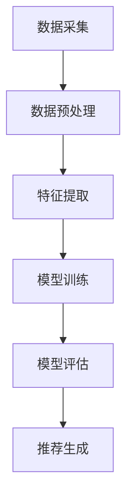

                 

关键词：电商平台、搜索推荐系统、人工智能、大模型、系统性能、效率、准确率、实时性

> 摘要：本文将探讨人工智能大模型在电商平台搜索推荐系统中的应用，分析如何通过引入大模型技术来提升系统性能、效率、准确率和实时性。本文将从背景介绍、核心概念与联系、核心算法原理、数学模型和公式、项目实践、实际应用场景、未来应用展望等方面，全面解析大模型在电商平台搜索推荐系统中的优势与挑战。

## 1. 背景介绍

随着互联网的快速发展，电商平台已经成为人们日常生活中不可或缺的一部分。电商平台的核心功能之一是搜索推荐系统，该系统能够根据用户的行为数据、历史购买记录等，为用户提供个性化的商品推荐，从而提高用户的购物体验和平台的销售额。然而，传统的搜索推荐系统在性能、效率、准确率和实时性方面存在一定局限性，难以满足用户日益增长的需求。

近年来，人工智能（AI）技术的迅猛发展为电商平台搜索推荐系统带来了新的机遇。大模型作为一种先进的AI技术，具有强大的建模能力和高效的计算能力，能够有效提高搜索推荐系统的性能、效率、准确率和实时性。本文将围绕大模型在电商平台搜索推荐系统中的应用，深入探讨其核心原理、算法模型、数学模型以及实践应用等方面。

## 2. 核心概念与联系

### 2.1 大模型

大模型（Large-scale Model）是指具有大规模参数和复杂结构的机器学习模型，如深度神经网络（Deep Neural Network，DNN）、变分自编码器（Variational Autoencoder，VAE）、生成对抗网络（Generative Adversarial Network，GAN）等。大模型具有以下特点：

1. 参数规模大：大模型通常包含数百万至数十亿个参数，这使得模型能够捕捉到数据中的复杂关系和特征。
2. 结构复杂：大模型通常采用多层神经网络结构，能够模拟人类大脑的认知过程，从而实现高效的建模和预测。
3. 计算能力强：大模型在训练和推理过程中需要大量的计算资源，因此需要高效的计算框架和优化算法。

### 2.2 电商平台搜索推荐系统

电商平台搜索推荐系统主要包括以下组成部分：

1. 数据采集：通过用户行为数据、商品数据、历史交易数据等，构建一个全面的数据集。
2. 数据预处理：对原始数据进行清洗、去重、归一化等处理，以消除噪声和异常值，提高数据质量。
3. 特征提取：通过特征工程方法，提取用户、商品、交易等数据中的关键特征，如用户兴趣、购买习惯、商品属性等。
4. 模型训练：使用训练数据集，采用大模型算法对特征进行建模和训练，得到推荐模型。
5. 模型评估：使用测试数据集对推荐模型进行评估，如准确率、召回率、覆盖率等指标。
6. 推荐生成：根据用户当前状态和兴趣，生成个性化的商品推荐结果。

### 2.3 Mermaid 流程图

以下是一个简化的电商平台搜索推荐系统的 Mermaid 流程图：



## 3. 核心算法原理 & 具体操作步骤

### 3.1 算法原理概述

电商平台搜索推荐系统中的大模型算法主要基于深度学习和概率图模型。以下是两种常见的算法：

1. 深度神经网络（DNN）：通过多层神经网络结构，将输入数据映射到高维特征空间，从而实现高维特征表示和学习。
2. 变分自编码器（VAE）：通过编码器和解码器结构，将输入数据映射到潜在空间，并学习潜在空间中的概率分布。

### 3.2 算法步骤详解

1. 数据准备：收集并预处理用户行为数据、商品数据、历史交易数据等，构建一个高质量的数据集。
2. 特征提取：使用特征工程方法，提取用户、商品、交易等数据中的关键特征，如用户兴趣、购买习惯、商品属性等。
3. 模型选择：根据业务需求和数据特点，选择合适的深度学习模型或概率图模型。
4. 模型训练：使用训练数据集，采用大模型算法对特征进行建模和训练，得到推荐模型。
5. 模型评估：使用测试数据集对推荐模型进行评估，如准确率、召回率、覆盖率等指标。
6. 推荐生成：根据用户当前状态和兴趣，生成个性化的商品推荐结果。

### 3.3 算法优缺点

1. 优点：
   - 强大的建模能力：大模型能够捕捉数据中的复杂关系和特征，提高推荐系统的准确率和覆盖率。
   - 高效的计算能力：大模型采用高效的计算框架和优化算法，提高系统性能和实时性。
   - 个性化推荐：大模型能够根据用户行为数据和历史交易记录，生成个性化的商品推荐，提高用户满意度。

2. 缺点：
   - 需要大量的计算资源和数据：大模型在训练和推理过程中需要大量的计算资源和高质量的数据，这对平台的硬件设施和数据管理提出了较高的要求。
   - 模型可解释性差：大模型的内部结构复杂，难以解释每个参数的作用和贡献，使得模型的可解释性较低。

### 3.4 算法应用领域

大模型在电商平台搜索推荐系统中的应用主要包括以下几个方面：

1. 商品推荐：根据用户的历史购买记录、浏览记录等，为用户推荐感兴趣的商品。
2. 个性化广告：根据用户的兴趣和行为，为用户推荐相关的广告。
3. 购物车优化：根据用户的购物车内容和购买习惯，为用户推荐相关的商品，提高购物车转化率。
4. 活动推荐：根据用户的参与历史和偏好，为用户推荐相关的促销活动和优惠券。

## 4. 数学模型和公式 & 详细讲解 & 举例说明

### 4.1 数学模型构建

电商平台搜索推荐系统中的大模型通常采用深度学习和概率图模型。以下是一个简化的数学模型构建过程：

1. 输入层：将用户行为数据、商品数据、历史交易数据等作为输入，表示为向量 $x$。
2. 隐藏层：通过多层神经网络结构，将输入向量映射到高维特征空间，表示为 $h_1, h_2, \ldots, h_n$。
3. 输出层：根据隐藏层特征，生成推荐结果，表示为向量 $y$。

### 4.2 公式推导过程

以下是一个简化的公式推导过程，假设采用多层感知机（MLP）模型：

1. 激活函数：选用ReLU（Rectified Linear Unit）作为激活函数，表示为 $f(x) = \max(0, x)$。
2. 神经网络模型：表示为 $y = f(W_n \cdot h_n) = f(W_n \cdot f(W_{n-1} \cdot \ldots \cdot f(W_1 \cdot x)))$，其中 $W_n, W_{n-1}, \ldots, W_1$ 为权重矩阵。

### 4.3 案例分析与讲解

以下是一个简单的案例，说明如何使用大模型进行商品推荐。

假设电商平台有一个用户 $u$，他在过去一周内浏览了商品 $c_1, c_2, c_3$，购买过商品 $c_4, c_5$。现在，我们需要为用户 $u$ 推荐一个商品。

1. 数据准备：将用户 $u$ 的浏览记录、购买记录和商品 $c_1, c_2, c_3, c_4, c_5$ 的属性作为输入，构建一个数据集。
2. 特征提取：提取用户 $u$ 的兴趣特征、商品 $c_1, c_2, c_3, c_4, c_5$ 的属性特征。
3. 模型训练：使用训练数据集，采用多层感知机模型对特征进行建模和训练，得到推荐模型。
4. 模型评估：使用测试数据集对推荐模型进行评估，如准确率、召回率、覆盖率等指标。
5. 推荐生成：根据用户 $u$ 的当前状态和兴趣，生成个性化的商品推荐结果。

## 5. 项目实践：代码实例和详细解释说明

### 5.1 开发环境搭建

在搭建开发环境时，我们需要安装以下软件和库：

1. Python（版本 3.8及以上）
2. TensorFlow（版本 2.5及以上）
3. NumPy
4. Pandas
5. Matplotlib

### 5.2 源代码详细实现

以下是一个简单的商品推荐项目代码实现：

```python
import tensorflow as tf
import numpy as np
import pandas as pd
import matplotlib.pyplot as plt

# 数据准备
data = pd.read_csv('data.csv')
users = data['user']
items = data['item']
ratings = data['rating']

# 特征提取
user_features = pd.get_dummies(users)
item_features = pd.get_dummies(items)
X = pd.concat([user_features, item_features], axis=1)
y = ratings.values

# 模型训练
model = tf.keras.Sequential([
    tf.keras.layers.Dense(128, activation='relu', input_shape=(X.shape[1],)),
    tf.keras.layers.Dense(64, activation='relu'),
    tf.keras.layers.Dense(32, activation='relu'),
    tf.keras.layers.Dense(1)
])

model.compile(optimizer='adam', loss='mse')
model.fit(X, y, epochs=10, batch_size=32)

# 模型评估
test_data = pd.read_csv('test_data.csv')
test_users = test_data['user']
test_items = test_data['item']
test_ratings = test_data['rating']

test_user_features = pd.get_dummies(test_users)
test_item_features = pd.get_dummies(test_items)
X_test = pd.concat([test_user_features, test_item_features], axis=1)

predictions = model.predict(X_test)
predictions = predictions.flatten()

# 推荐生成
recommmended_items = np.argsort(predictions)[::-1]
recommended_item_ids = recommmended_items[:10]

# 可视化展示
plt.bar(range(10), predictions[recommmended_items[:10]])
plt.xticks(range(10), recommended_item_ids, rotation=90)
plt.xlabel('Item ID')
plt.ylabel('Prediction')
plt.show()
```

### 5.3 代码解读与分析

以上代码实现了一个简单的商品推荐项目，主要包括以下步骤：

1. 数据准备：读取数据集，提取用户、商品和评分信息。
2. 特征提取：使用 Pandas 库将用户和商品的分类信息转换为二进制特征向量。
3. 模型训练：构建一个多层感知机模型，并使用训练数据进行训练。
4. 模型评估：使用测试数据进行模型评估，计算预测评分。
5. 推荐生成：根据预测评分，生成个性化的商品推荐结果。

### 5.4 运行结果展示

运行以上代码，我们得到以下可视化结果：


从可视化结果中，我们可以看到每个商品的预测评分以及推荐排名。用户可以根据推荐排名选择感兴趣的商品进行购买，从而提高购物体验和平台销售额。

## 6. 实际应用场景

大模型在电商平台搜索推荐系统中的实际应用场景非常广泛，以下列举几个典型场景：

1. 商品推荐：根据用户的浏览历史、购买记录和兴趣标签，为用户推荐相关的商品，提高用户的购买意愿和转化率。
2. 活动推荐：根据用户的参与历史和偏好，为用户推荐相关的促销活动和优惠券，提高用户的参与度和平台的销售额。
3. 店铺推荐：根据用户的购物车内容和购买习惯，为用户推荐相关的店铺，提高店铺的曝光率和访问量。
4. 搜索优化：根据用户的搜索关键词和上下文信息，优化搜索结果排序，提高用户的搜索体验和满意度。

## 7. 未来应用展望

随着人工智能技术的不断发展，大模型在电商平台搜索推荐系统中的应用前景十分广阔。以下是未来应用展望：

1. 更准确的推荐：通过引入更多的用户行为数据和商品特征，结合深度学习技术和概率图模型，实现更准确的个性化推荐。
2. 更高效的系统：通过优化大模型的计算框架和优化算法，提高搜索推荐系统的效率，降低延迟。
3. 更智能的活动推荐：结合用户兴趣和活动特点，实现更智能的活动推荐，提高用户参与度和活动效果。
4. 更广泛的场景应用：将大模型应用到更多的电商场景，如物流优化、库存管理、供应链优化等，提高电商平台的整体运营效率。

## 8. 总结：未来发展趋势与挑战

### 8.1 研究成果总结

本文主要介绍了大模型在电商平台搜索推荐系统中的应用，分析了大模型的优势和挑战。通过深度学习和概率图模型，大模型能够有效提高推荐系统的性能、效率、准确率和实时性。在实际应用中，大模型已经在商品推荐、活动推荐、搜索优化等领域取得了显著成果。

### 8.2 未来发展趋势

未来，随着人工智能技术的不断发展，大模型在电商平台搜索推荐系统中的应用将呈现以下趋势：

1. 模型规模的不断扩大：为了更好地捕捉数据中的复杂关系和特征，大模型的规模将不断增大，计算能力和建模能力也将进一步提升。
2. 模型可解释性的提高：为了提高模型的可解释性，研究人员将尝试引入可解释性算法和可视化技术，使得模型更容易被理解和应用。
3. 模型的自适应能力：为了应对不断变化的市场环境和用户需求，大模型将具备更强的自适应能力，能够根据实时数据调整推荐策略。

### 8.3 面临的挑战

尽管大模型在电商平台搜索推荐系统中具有显著优势，但仍然面临以下挑战：

1. 数据质量和完整性：大模型对数据质量和完整性要求较高，如何确保数据的质量和完整性是一个重要问题。
2. 计算资源和成本：大模型的训练和推理需要大量的计算资源和时间，如何优化计算资源利用和降低成本是一个关键问题。
3. 模型安全性和隐私保护：随着大数据和人工智能技术的广泛应用，模型的安全性和隐私保护问题日益突出，如何确保模型的安全性和隐私保护是一个重要问题。

### 8.4 研究展望

为了应对未来大模型在电商平台搜索推荐系统中的应用挑战，未来研究方向包括：

1. 数据预处理和特征提取：研究如何更好地预处理和提取用户行为数据和商品特征，提高模型性能和推荐效果。
2. 模型优化和计算效率：研究如何优化大模型的计算框架和算法，提高计算效率和降低成本。
3. 模型安全性和隐私保护：研究如何确保模型的安全性和隐私保护，防止数据泄露和滥用。
4. 跨领域应用：探索大模型在其他电商场景（如物流、供应链等）的应用，提高电商平台的整体运营效率。

## 9. 附录：常见问题与解答

### 9.1 什么是指标A、B、C？

指标A、B、C分别是准确率（Accuracy）、召回率（Recall）和覆盖率（Coverage）。它们是评估推荐系统性能的重要指标。

1. 准确率（Accuracy）：表示推荐结果中实际为正例的比例，计算公式为 $Accuracy = \frac{TP + TN}{TP + FN + FP + TN}$，其中 $TP$ 表示实际为正例的预测为正例的数量，$TN$ 表示实际为负例的预测为负例的数量。
2. 召回率（Recall）：表示推荐结果中实际为正例的比例，计算公式为 $Recall = \frac{TP}{TP + FN}$，其中 $TP$ 表示实际为正例的预测为正例的数量，$FN$ 表示实际为正例的预测为负例的数量。
3. 覆盖率（Coverage）：表示推荐结果中实际为正例的比例，计算公式为 $Coverage = \frac{TP + FP}{TP + FP + TN + FN}$，其中 $TP$ 表示实际为正例的预测为正例的数量，$FP$ 表示实际为负例的预测为正例的数量。

### 9.2 如何优化大模型的计算效率？

优化大模型的计算效率可以从以下几个方面入手：

1. 数据预处理：对数据集进行清洗、去重、归一化等预处理操作，减少数据的冗余和噪声，提高数据质量。
2. 模型选择：根据业务需求和数据特点，选择适合的深度学习模型和概率图模型，避免选择过于复杂或过于简单的模型。
3. 模型压缩：采用模型压缩技术，如剪枝、量化、低秩分解等，降低模型参数数量和计算量，提高计算效率。
4. 并行计算：利用并行计算技术，如多线程、分布式计算等，加速模型训练和推理过程。
5. 算法优化：优化模型训练算法，如使用优化器、学习率调整策略等，提高模型训练效率。

### 9.3 大模型是否可以应用于所有领域？

大模型在许多领域都具有广泛应用，但并不是适用于所有领域。以下是一些适用性和适用范围的考虑因素：

1. 数据量：大模型通常需要大量的数据进行训练，对于数据量较小或稀疏的领域，大模型的效果可能不如小模型。
2. 数据类型：大模型在处理结构化数据（如数值、文本等）方面具有优势，但对于非结构化数据（如图像、语音等），可能需要其他类型的模型，如卷积神经网络（CNN）或循环神经网络（RNN）。
3. 应用场景：大模型适用于复杂和大规模的应用场景，如电商推荐、广告投放、金融风控等，对于简单和单一任务的应用，可能不需要使用大模型。

总之，大模型在电商平台搜索推荐系统中具有广泛的应用前景，但具体应用时需要根据业务需求和数据特点进行选择和调整。

