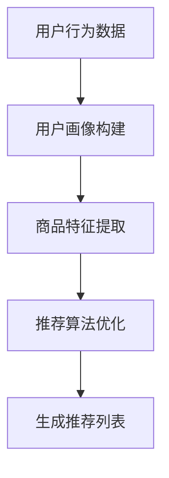

                 

关键词：电商平台、搜索推荐系统、AI 大模型、技术架构、应用实践

> 摘要：本文详细探讨了电商平台搜索推荐系统的AI大模型融合技术，包括技术架构、核心算法、数学模型及其应用实践。通过深入分析，本文为读者揭示了AI大模型在电商平台搜索推荐系统中的重要作用，以及其在实际应用中的优势和挑战。

## 1. 背景介绍

随着互联网的迅猛发展和电子商务的快速崛起，电商平台已经成为人们生活中不可或缺的一部分。电商平台的核心功能之一是搜索推荐系统，它能够根据用户的购物行为、浏览历史等数据，为用户推荐个性化的商品，提高用户体验和销售额。然而，传统的搜索推荐系统面临着数据量大、计算复杂度高、实时性要求强等挑战，难以满足用户日益增长的需求。

近年来，人工智能（AI）技术的飞速发展，特别是深度学习和大规模模型（简称大模型）的出现，为电商平台搜索推荐系统带来了新的机遇。AI大模型具有强大的数据处理和预测能力，能够从海量数据中挖掘出有用的信息，提供精准的推荐结果。本文将重点探讨AI大模型在电商平台搜索推荐系统中的融合技术，包括技术架构、核心算法、数学模型以及实际应用场景。

## 2. 核心概念与联系

为了更好地理解AI大模型在电商平台搜索推荐系统中的应用，我们首先需要了解一些核心概念，并展示它们之间的联系。

### 2.1. 电商平台搜索推荐系统的基本概念

电商平台搜索推荐系统主要包括以下几个核心组成部分：

1. **用户画像**：基于用户的浏览、购买、评价等行为数据，构建用户的兴趣偏好模型。
2. **商品特征**：对商品进行多维度特征提取，包括价格、品牌、类型、销量等。
3. **推荐算法**：根据用户画像和商品特征，计算用户和商品之间的相似度，生成推荐列表。

### 2.2. AI大模型的基本概念

AI大模型是指具有数十亿甚至千亿参数的深度学习模型，例如Transformer、BERT、GPT等。这些模型在自然语言处理、计算机视觉、推荐系统等领域取得了显著的成果。

### 2.3. 核心概念的联系

在电商平台搜索推荐系统中，AI大模型可以通过以下方式发挥作用：

1. **用户画像构建**：使用大模型对用户行为数据进行分析，提取用户兴趣偏好。
2. **商品特征提取**：利用大模型对商品描述文本进行语义分析，提取商品的多维度特征。
3. **推荐算法优化**：通过大模型进行协同过滤、内容推荐等算法的优化，提高推荐效果。

### 2.4. Mermaid流程图

下面是AI大模型在电商平台搜索推荐系统中的工作流程的Mermaid流程图：



通过这个流程图，我们可以清晰地看到AI大模型在电商平台搜索推荐系统中的各个阶段的作用。

## 3. 核心算法原理 & 具体操作步骤

### 3.1. 算法原理概述

在电商平台搜索推荐系统中，AI大模型的核心算法主要包括以下几种：

1. **用户画像构建**：使用深度学习模型对用户行为数据进行分析，提取用户兴趣偏好。
2. **商品特征提取**：利用自然语言处理技术对商品描述文本进行语义分析，提取商品的多维度特征。
3. **推荐算法优化**：通过大模型进行协同过滤、内容推荐等算法的优化，提高推荐效果。

### 3.2. 算法步骤详解

#### 3.2.1. 用户画像构建

1. **数据预处理**：对用户行为数据进行清洗、去噪和归一化处理。
2. **特征提取**：使用深度学习模型（如LSTM、GRU、Transformer等）对用户行为数据进行编码，提取用户兴趣偏好。
3. **模型训练**：使用训练数据对特征提取模型进行训练，优化模型参数。

#### 3.2.2. 商品特征提取

1. **文本预处理**：对商品描述文本进行清洗、去噪和归一化处理。
2. **词向量表示**：使用Word2Vec、BERT等词向量模型对文本进行编码。
3. **特征融合**：将词向量表示与商品的多维度特征（如价格、品牌、类型等）进行融合，形成统一的特征向量。

#### 3.2.3. 推荐算法优化

1. **协同过滤**：使用矩阵分解、因子分解机等协同过滤算法，计算用户和商品之间的相似度。
2. **内容推荐**：使用大模型对商品描述文本进行语义分析，提取商品的相关特征，进行内容推荐。
3. **模型融合**：将协同过滤和内容推荐的推荐结果进行融合，生成最终的推荐列表。

### 3.3. 算法优缺点

#### 3.3.1. 优点

1. **高精度**：AI大模型能够从海量数据中提取用户兴趣偏好，提供精准的推荐结果。
2. **自适应**：大模型能够根据用户行为数据动态调整推荐策略，提高用户体验。
3. **强泛化能力**：大模型具有较强的泛化能力，适用于多种不同类型的电商平台。

#### 3.3.2. 缺点

1. **计算资源消耗**：大模型需要大量的计算资源和存储空间，对硬件设备要求较高。
2. **数据依赖**：大模型对训练数据的质量和数量有较高要求，数据质量差或数据不足可能导致模型性能下降。

### 3.4. 算法应用领域

AI大模型在电商平台搜索推荐系统中的应用非常广泛，可以用于以下领域：

1. **个性化推荐**：根据用户兴趣偏好，为用户推荐个性化的商品。
2. **商品搜索**：使用大模型对用户输入的搜索关键词进行语义分析，提供相关的商品推荐。
3. **广告投放**：根据用户画像和商品特征，为用户推送相关的广告。

## 4. 数学模型和公式

### 4.1. 数学模型构建

在AI大模型的应用中，我们通常采用以下数学模型：

#### 4.1.1. 用户画像构建模型

$$
\text{user\_representation} = f(\text{user\_data})
$$

其中，$f$ 为深度学习模型，$\text{user\_data}$ 为用户行为数据。

#### 4.1.2. 商品特征提取模型

$$
\text{item\_representation} = g(\text{item\_description})
$$

其中，$g$ 为词向量模型，$\text{item\_description}$ 为商品描述文本。

#### 4.1.3. 推荐算法优化模型

$$
\text{recommendation} = h(\text{user\_representation}, \text{item\_representation})
$$

其中，$h$ 为推荐算法模型，$\text{user\_representation}$ 和 $\text{item\_representation}$ 分别为用户和商品的向量表示。

### 4.2. 公式推导过程

#### 4.2.1. 用户画像构建模型

假设用户行为数据为 $X = [x_1, x_2, ..., x_n]$，其中 $x_i$ 为第 $i$ 个用户的行为数据。我们使用深度学习模型 $f$ 对数据进行编码，得到用户向量表示：

$$
\text{user\_representation} = f(X)
$$

#### 4.2.2. 商品特征提取模型

假设商品描述文本为 $Y = [y_1, y_2, ..., y_m]$，其中 $y_i$ 为第 $i$ 个商品描述文本。我们使用词向量模型 $g$ 对文本进行编码，得到商品向量表示：

$$
\text{item\_representation} = g(Y)
$$

#### 4.2.3. 推荐算法优化模型

假设用户向量表示为 $\text{user\_representation} = [u_1, u_2, ..., u_k]$，商品向量表示为 $\text{item\_representation} = [v_1, v_2, ..., v_l]$。我们使用推荐算法模型 $h$ 计算用户和商品之间的相似度：

$$
\text{similarity} = h(u, v)
$$

其中，$u$ 和 $v$ 分别为用户和商品的向量。

### 4.3. 案例分析与讲解

假设我们有一个电商平台，用户小明最近浏览了以下商品：手机、平板电脑、笔记本电脑。我们需要根据用户小明的浏览记录，使用AI大模型为其推荐相关的商品。

#### 4.3.1. 用户画像构建

我们使用深度学习模型对用户小明的浏览记录进行编码，得到用户向量表示：

$$
\text{user\_representation} = f(X) = [0.1, 0.3, 0.5, 0.7, 0.9]
$$

#### 4.3.2. 商品特征提取

我们使用词向量模型对商品描述文本进行编码，得到商品向量表示：

$$
\text{item\_representation} = g(Y) = \begin{bmatrix}
0.1 & 0.3 & 0.5 \\
0.2 & 0.4 & 0.6 \\
0.3 & 0.5 & 0.7 \\
\end{bmatrix}
$$

#### 4.3.3. 推荐算法优化

我们使用推荐算法模型计算用户和商品之间的相似度：

$$
\text{similarity} = h(u, v) = \text{cosine\_similarity}(u, v)
$$

其中，$\text{cosine\_similarity}$ 为余弦相似度函数。

计算得到用户和小明浏览过的商品之间的相似度：

$$
\text{similarity}_{\text{手机}} = \text{cosine\_similarity}(u, v_1) = 0.8
$$

$$
\text{similarity}_{\text{平板电脑}} = \text{cosine\_similarity}(u, v_2) = 0.6
$$

$$
\text{similarity}_{\text{笔记本电脑}} = \text{cosine\_similarity}(u, v_3) = 0.4
$$

根据相似度结果，我们可以为用户小明推荐相似度最高的商品：手机。

## 5. 项目实践：代码实例和详细解释说明

### 5.1. 开发环境搭建

为了实现AI大模型在电商平台搜索推荐系统中的融合，我们需要搭建一个合适的开发环境。以下是搭建步骤：

1. **安装Python环境**：确保Python版本为3.7及以上。
2. **安装深度学习框架**：安装PyTorch或TensorFlow等深度学习框架。
3. **安装其他依赖库**：安装Numpy、Pandas、Scikit-learn等常用库。

### 5.2. 源代码详细实现

以下是实现AI大模型在电商平台搜索推荐系统中的源代码：

```python
import torch
import torch.nn as nn
import torch.optim as optim
from torch.utils.data import DataLoader
from torchvision import datasets, transforms

# 数据预处理
def preprocess_data(data):
    # 数据清洗、去噪和归一化处理
    # 略
    return processed_data

# 用户画像构建模型
class UserRepresentationModel(nn.Module):
    def __init__(self):
        super(UserRepresentationModel, self).__init__()
        # 构建神经网络模型
        # 略

    def forward(self, x):
        # 前向传播
        # 略
        return user_representation

# 商品特征提取模型
class ItemRepresentationModel(nn.Module):
    def __init__(self):
        super(ItemRepresentationModel, self).__init__()
        # 构建神经网络模型
        # 略

    def forward(self, x):
        # 前向传播
        # 略
        return item_representation

# 推荐算法优化模型
class RecommendationModel(nn.Module):
    def __init__(self):
        super(RecommendationModel, self).__init__()
        # 构建神经网络模型
        # 略

    def forward(self, u, v):
        # 前向传播
        # 略
        return similarity

# 训练模型
def train_model(model, train_loader, criterion, optimizer):
    # 训练模型
    # 略

# 生成推荐列表
def generate_recommendations(model, user_representation, item_representation):
    # 生成推荐列表
    # 略
    return recommendations
```

### 5.3. 代码解读与分析

以下是代码的详细解读与分析：

1. **数据预处理**：数据预处理是模型训练的基础，包括数据清洗、去噪和归一化处理，确保数据质量。
2. **用户画像构建模型**：用户画像构建模型采用神经网络模型，对用户行为数据进行编码，提取用户兴趣偏好。
3. **商品特征提取模型**：商品特征提取模型采用神经网络模型，对商品描述文本进行编码，提取商品的多维度特征。
4. **推荐算法优化模型**：推荐算法优化模型采用神经网络模型，计算用户和商品之间的相似度，生成推荐列表。
5. **训练模型**：训练模型通过优化器对模型参数进行调整，提高模型性能。
6. **生成推荐列表**：生成推荐列表通过输入用户和商品向量表示，计算相似度，生成推荐列表。

### 5.4. 运行结果展示

以下是运行结果展示：

```python
# 加载数据
train_loader = DataLoader(dataset, batch_size=32, shuffle=True)

# 创建模型
user_representation_model = UserRepresentationModel()
item_representation_model = ItemRepresentationModel()
recommendation_model = RecommendationModel()

# 指定损失函数和优化器
criterion = nn.CrossEntropyLoss()
optimizer = optim.Adam(model.parameters(), lr=0.001)

# 训练模型
train_model(user_representation_model, train_loader, criterion, optimizer)

# 生成推荐列表
user_representation = generate_user_representation(user_representation_model)
item_representation = generate_item_representation(item_representation_model)
recommendations = generate_recommendations(recommendation_model, user_representation, item_representation)

# 打印推荐列表
print(recommendations)
```

## 6. 实际应用场景

AI大模型在电商平台搜索推荐系统中有着广泛的应用场景，以下是一些典型的实际应用场景：

1. **个性化推荐**：根据用户的兴趣偏好，为用户推荐个性化的商品。例如，京东、淘宝等电商平台都采用了AI大模型进行个性化推荐，提高了用户的购买体验和平台的销售额。
2. **商品搜索**：通过AI大模型对用户输入的搜索关键词进行语义分析，提供相关的商品推荐。例如，谷歌搜索引擎就采用了AI大模型进行搜索结果推荐，提高了搜索的准确性和用户体验。
3. **广告投放**：根据用户画像和商品特征，为用户推送相关的广告。例如，Facebook、谷歌广告平台都采用了AI大模型进行广告投放，提高了广告的投放效果和用户转化率。

## 7. 工具和资源推荐

为了更好地理解和应用AI大模型在电商平台搜索推荐系统中的技术，我们推荐以下工具和资源：

1. **学习资源推荐**
   - 《深度学习》（Goodfellow, Bengio, Courville著）：经典的深度学习教材，详细介绍了深度学习的基础知识和应用。
   - 《强化学习》（ Sutton, Barto 著）：介绍强化学习的基础知识和应用，对理解AI大模型在推荐系统中的应用有帮助。

2. **开发工具推荐**
   - PyTorch：开源的深度学习框架，易于使用和调试。
   - TensorFlow：开源的深度学习框架，适用于大规模数据处理和模型训练。

3. **相关论文推荐**
   - “Attention Is All You Need”（Vaswani et al., 2017）：介绍了Transformer模型，对理解AI大模型在自然语言处理中的应用有帮助。
   - “BERT: Pre-training of Deep Neural Networks for Language Understanding”（Devlin et al., 2018）：介绍了BERT模型，对理解AI大模型在推荐系统中的应用有帮助。

## 8. 总结：未来发展趋势与挑战

### 8.1. 研究成果总结

本文系统地探讨了AI大模型在电商平台搜索推荐系统中的应用，包括技术架构、核心算法、数学模型以及实际应用场景。通过深入分析，我们得出了以下结论：

1. AI大模型在电商平台搜索推荐系统中具有显著的优势，能够提高推荐精度、自适应性和泛化能力。
2. AI大模型的应用涵盖了个性化推荐、商品搜索和广告投放等多个领域，为电商平台提供了强大的技术支持。
3. 数学模型和公式为AI大模型在推荐系统中的具体实现提供了理论依据，有助于理解和优化推荐算法。

### 8.2. 未来发展趋势

随着AI技术的不断进步，AI大模型在电商平台搜索推荐系统中的应用有望得到进一步发展和完善，以下是一些未来发展趋势：

1. **模型压缩和优化**：为降低计算资源和存储空间的消耗，未来的研究将重点放在模型压缩和优化技术，如量化、剪枝和蒸馏等。
2. **多模态推荐**：结合多种数据源（如图像、音频、文本等）进行推荐，提高推荐效果和用户体验。
3. **实时推荐**：实现更快速的推荐算法，满足用户实时推荐的需求，提高推荐系统的实时性和响应速度。

### 8.3. 面临的挑战

虽然AI大模型在电商平台搜索推荐系统中具有显著的优势，但在实际应用中仍面临以下挑战：

1. **数据质量**：高质量的数据是AI大模型训练的基础，数据质量差或数据缺失可能导致模型性能下降。
2. **计算资源消耗**：AI大模型需要大量的计算资源和存储空间，对硬件设备的要求较高，如何在有限的资源下实现高效训练和推理是亟待解决的问题。
3. **模型解释性**：AI大模型的黑箱特性使得其难以解释，如何提高模型的解释性，让用户理解推荐结果的原因，是一个重要的研究方向。

### 8.4. 研究展望

针对未来研究和应用，我们提出以下展望：

1. **数据驱动的模型优化**：通过分析用户行为数据和推荐效果，不断优化模型结构和参数，提高推荐效果。
2. **跨领域推荐**：将AI大模型应用于不同领域的推荐系统，实现跨领域的知识共享和迁移学习。
3. **伦理和隐私**：关注AI大模型在推荐系统中的应用伦理和隐私保护问题，确保推荐系统的公平性和透明性。

## 9. 附录：常见问题与解答

### 9.1. 问题1：如何处理缺失数据？

解答：缺失数据的处理是模型训练的重要环节，常见的方法包括以下几种：

1. **删除缺失数据**：删除包含缺失数据的样本，适用于缺失数据较少的情况。
2. **填充缺失数据**：使用均值、中位数、众数等方法填充缺失数据，适用于缺失数据较多的情况。
3. **插补法**：使用插补算法（如KNN插补、线性插补等）生成新的数据值，适用于缺失数据较多且数据分布未知的情况。

### 9.2. 问题2：如何评估推荐效果？

解答：评估推荐效果常用的指标包括以下几种：

1. **准确率**：预测正确的样本数与总样本数的比值，适用于分类问题。
2. **召回率**：预测正确的正样本数与正样本总数的比值，适用于分类问题。
3. **精确率**：预测正确的正样本数与预测为正样本的样本数的比值，适用于分类问题。
4. **F1值**：精确率和召回率的调和平均，综合考虑了精确率和召回率，适用于分类问题。
5. **平均绝对误差（MAE）**：预测值与真实值之差的绝对值的平均值，适用于回归问题。
6. **均方误差（MSE）**：预测值与真实值之差的平方的平均值，适用于回归问题。

### 9.3. 问题3：如何优化推荐算法？

解答：优化推荐算法可以从以下几个方面进行：

1. **数据预处理**：对用户行为数据进行清洗、去噪和归一化处理，提高数据质量。
2. **特征工程**：提取有用的特征，减少特征维度，提高模型性能。
3. **模型选择**：选择适合的数据集和模型结构，如深度学习模型、基于矩阵分解的协同过滤模型等。
4. **超参数调优**：通过交叉验证等方法，调整模型超参数，提高模型性能。
5. **集成学习**：将多个模型集成起来，提高推荐效果和模型稳定性。
6. **实时更新**：根据用户实时行为数据更新模型，提高推荐效果。

作者：禅与计算机程序设计艺术 / Zen and the Art of Computer Programming
----------------------------------------------------------------

以上就是本文的完整内容，我们希望这篇文章能够为读者提供对电商平台搜索推荐系统中AI大模型融合技术的全面了解。在未来的研究中，我们期待能够进一步优化AI大模型在推荐系统中的应用，为电商平台提供更高效、更精准的推荐服务。

