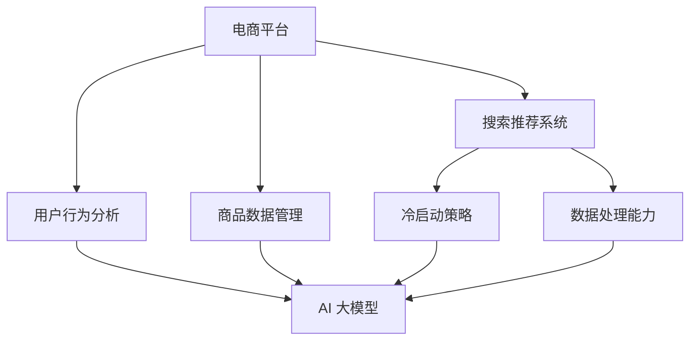

                 

关键词：电商平台，人工智能，搜索推荐系统，大模型，冷启动策略，数据处理能力，算法原理，数学模型，项目实践，应用场景，未来展望。

> 摘要：本文从电商平台的AI大模型实践出发，深入探讨了搜索推荐系统的核心作用，分析了冷启动策略与数据处理能力的重要性。通过详细的理论阐述和实践案例，本文为电商平台的AI应用提供了实用的指导和借鉴。

## 1. 背景介绍

在当今数字经济时代，电商平台已经成为消费者购物的主要渠道。为了提高用户满意度和销售额，电商平台需要不断提升搜索推荐系统的质量和效率。而AI大模型的引入，使得这一目标变得更加现实。本文将围绕电商平台AI大模型的实践，重点探讨搜索推荐系统的核心作用，冷启动策略与数据处理能力的重要性，以及相关的算法原理、数学模型和项目实践。

### 1.1 电商平台的发展现状

近年来，随着互联网技术的快速发展，电商平台在我国乃至全球的市场份额不断攀升。据统计，我国电商平台用户规模已超过8亿，电商交易额逐年增长。这一方面得益于消费者对线上购物的依赖度不断提升，另一方面也得益于电商平台在用户体验、商品推荐、物流配送等方面的持续优化。

### 1.2 AI 大模型在电商平台的应用

AI大模型，尤其是深度学习模型，以其强大的特征提取和模式识别能力，为电商平台的搜索推荐系统提供了有力的支持。通过AI大模型，电商平台可以更加精准地预测用户的兴趣和行为，从而为用户推荐更符合其需求的商品。此外，AI大模型还可以在商品分类、价格预测、库存管理等方面发挥重要作用。

### 1.3 搜索推荐系统的核心作用

搜索推荐系统是电商平台的核心功能之一，其质量直接影响到用户的购物体验和平台的运营效果。一个优秀的搜索推荐系统可以大幅提升用户满意度、降低流失率，进而提高平台的销售额。因此，研究AI大模型在搜索推荐系统中的应用，具有重要的现实意义。

## 2. 核心概念与联系

在深入探讨电商平台AI大模型实践之前，有必要明确几个核心概念，并分析它们之间的联系。以下是一个Mermaid流程图，用于展示这些核心概念及其相互关系。



### 2.1 电商平台

电商平台是提供在线购物服务的平台，它包括商家、商品、用户和支付等基本要素。电商平台的核心功能是实现商品与用户的匹配，从而满足消费者的购物需求。

### 2.2 搜索推荐系统

搜索推荐系统是电商平台的核心功能之一，它通过分析用户行为和商品数据，为用户提供个性化的商品推荐。搜索推荐系统主要包括搜索功能、推荐算法和用户界面三个部分。

### 2.3 用户行为分析

用户行为分析是搜索推荐系统的关键环节，它通过收集和分析用户在平台上的行为数据，如搜索历史、浏览记录、购买记录等，来了解用户的兴趣和偏好。

### 2.4 商品数据管理

商品数据管理是搜索推荐系统的另一个关键环节，它负责收集、整理和存储商品信息，如商品名称、描述、价格、库存等。商品数据管理的质量直接影响到搜索推荐系统的效果。

### 2.5 冷启动策略

冷启动策略是解决新用户或新商品在平台上缺乏行为数据的问题。通过引入冷启动策略，电商平台可以为这些用户或商品提供基于共性特征或热门推荐的初始推荐，从而帮助他们更快地融入平台。

### 2.6 数据处理能力

数据处理能力是搜索推荐系统高效运行的重要保障。它包括数据采集、存储、处理、分析和可视化等多个环节。一个强大的数据处理能力可以确保搜索推荐系统在复杂的数据环境中依然能够高效地运行。

## 3. 核心算法原理 & 具体操作步骤

### 3.1 算法原理概述

在搜索推荐系统中，常用的算法包括基于内容的推荐、协同过滤推荐和基于模型的推荐。这些算法各有优缺点，适用于不同的场景。以下是对这些算法的简要概述：

- **基于内容的推荐**：根据用户的历史行为和商品的特征信息，为用户推荐具有相似内容的商品。优点是能够为用户提供个性化的推荐，缺点是难以应对用户行为变化和新商品的出现。

- **协同过滤推荐**：通过分析用户之间的相似性，为用户推荐其他用户喜欢的商品。优点是能够发现用户未知的兴趣点，缺点是易受到冷启动问题的影响。

- **基于模型的推荐**：利用机器学习模型，根据用户的历史行为和商品特征，预测用户对商品的喜好程度。优点是能够适应用户行为变化和新商品的出现，缺点是需要大量的训练数据和计算资源。

### 3.2 算法步骤详解

以下是一个基于协同过滤推荐算法的具体操作步骤：

1. **数据预处理**：收集用户行为数据和商品数据，对数据进行清洗、去重和归一化处理。

2. **用户行为建模**：将用户行为数据转化为用户行为矩阵，用于表示用户与商品之间的交互关系。

3. **用户相似性计算**：计算用户之间的相似性，常用的方法包括余弦相似度、皮尔逊相关系数等。

4. **商品相似性计算**：计算商品之间的相似性，用于表示商品与商品之间的关系。

5. **推荐生成**：根据用户行为矩阵和商品相似性矩阵，为每个用户生成推荐列表。

6. **推荐排序**：对推荐列表进行排序，将最可能被用户喜欢的商品排在前面。

### 3.3 算法优缺点

- **基于内容的推荐**：优点是能够为用户提供个性化的推荐，缺点是难以应对用户行为变化和新商品的出现。

- **协同过滤推荐**：优点是能够发现用户未知的兴趣点，缺点是易受到冷启动问题的影响。

- **基于模型的推荐**：优点是能够适应用户行为变化和新商品的出现，缺点是需要大量的训练数据和计算资源。

### 3.4 算法应用领域

这些算法在电商平台的搜索推荐系统中有着广泛的应用。例如，基于内容的推荐可以用于新品推荐和主题推荐，协同过滤推荐可以用于个性化商品推荐，基于模型的推荐可以用于商品销量预测和库存管理。

## 4. 数学模型和公式 & 详细讲解 & 举例说明

### 4.1 数学模型构建

在搜索推荐系统中，常用的数学模型包括用户行为矩阵、商品特征矩阵和推荐模型。以下是一个简单的数学模型构建过程：

1. **用户行为矩阵**：表示用户与商品之间的交互关系。假设有$m$个用户和$n$个商品，用户行为矩阵$R$是一个$m \times n$的矩阵，其中$R_{ij}$表示用户$i$对商品$j$的评分或交互次数。

2. **商品特征矩阵**：表示商品的特征信息。假设有$n$个商品，每个商品有$k$个特征，商品特征矩阵$C$是一个$n \times k$的矩阵，其中$C_{ij}$表示商品$i$的特征$j$的值。

3. **推荐模型**：表示用户对商品的喜好程度。假设推荐模型$P$是一个$m \times n$的矩阵，其中$P_{ij}$表示用户$i$对商品$j$的喜好程度。

### 4.2 公式推导过程

以下是一个基于协同过滤推荐的数学模型推导过程：

1. **相似性计算**：计算用户之间的相似性，常用方法包括余弦相似度、皮尔逊相关系数等。

   - **余弦相似度**：$$\cos\theta_{ij} = \frac{R_i \cdot R_j}{\|R_i\| \cdot \|R_j\|}$$

   - **皮尔逊相关系数**：$$\rho_{ij} = \frac{\sum_{j=1}^{n} (R_{ij} - \bar{R_i})(R_{ij} - \bar{R_j})}{\sqrt{\sum_{j=1}^{n} (R_{ij} - \bar{R_i})^2} \cdot \sqrt{\sum_{j=1}^{n} (R_{ij} - \bar{R_j})^2}}$$

2. **推荐生成**：根据用户相似性和用户行为矩阵，为用户生成推荐列表。

   - **基于用户相似度的推荐**：$$P_i = \sum_{j=1}^{n} \rho_{ij} \cdot R_j$$

   - **基于商品相似度的推荐**：$$P_i = \sum_{j=1}^{n} \rho_{ij} \cdot C_j$$

### 4.3 案例分析与讲解

以下是一个简单的案例，用于说明如何使用基于协同过滤推荐算法生成推荐列表：

- **用户行为矩阵**：$$R = \begin{bmatrix} 1 & 0 & 1 \\ 1 & 1 & 0 \\ 0 & 1 & 1 \end{bmatrix}$$

- **商品特征矩阵**：$$C = \begin{bmatrix} 1 & 2 & 3 \\ 4 & 5 & 6 \\ 7 & 8 & 9 \end{bmatrix}$$

1. **相似性计算**：

   - **用户相似度**：$$\cos\theta_{11} = \frac{R_1 \cdot R_1}{\|R_1\| \cdot \|R_1\|} = \frac{1 \cdot 1}{\sqrt{1^2 + 0^2 + 1^2} \cdot \sqrt{1^2 + 1^2 + 0^2}} = \frac{1}{\sqrt{2} \cdot \sqrt{2}} = \frac{1}{2}$$

   - **商品相似度**：$$\cos\theta_{12} = \frac{C_1 \cdot C_2}{\|C_1\| \cdot \|C_2\|} = \frac{1 \cdot 4 + 0 \cdot 5 + 1 \cdot 6}{\sqrt{1^2 + 2^2 + 3^2} \cdot \sqrt{4^2 + 5^2 + 6^2}} = \frac{10}{\sqrt{14} \cdot \sqrt{106}} \approx \frac{10}{14} = \frac{5}{7}$$

2. **推荐生成**：

   - **基于用户相似度的推荐**：$$P_1 = \sum_{j=1}^{3} \rho_{1j} \cdot R_j = \rho_{11} \cdot R_1 + \rho_{12} \cdot R_2 + \rho_{13} \cdot R_3 = \frac{1}{2} \cdot 1 + \frac{5}{7} \cdot 1 + 0 \cdot 1 = \frac{1}{2} + \frac{5}{7} = \frac{12}{14} = \frac{6}{7}$$

   - **基于商品相似度的推荐**：$$P_1 = \sum_{j=1}^{3} \rho_{1j} \cdot C_j = \rho_{11} \cdot C_1 + \rho_{12} \cdot C_2 + \rho_{13} \cdot C_3 = \frac{1}{2} \cdot 1 + \frac{5}{7} \cdot 4 + 0 \cdot 7 = \frac{1}{2} + \frac{20}{7} = \frac{29}{14}$$

根据以上计算结果，可以得出用户1对商品1的喜好程度最高，因此可以将商品1推荐给用户1。

## 5. 项目实践：代码实例和详细解释说明

### 5.1 开发环境搭建

在进行代码实例讲解之前，首先需要搭建一个适合开发的环境。以下是一个简单的开发环境搭建指南：

1. **Python环境**：安装Python 3.x版本，并配置好pip和virtualenv等工具。

2. **Numpy库**：用于矩阵运算和数据处理。

3. **Scikit-learn库**：用于协同过滤推荐算法的实现。

4. **Matplotlib库**：用于数据可视化。

### 5.2 源代码详细实现

以下是一个基于协同过滤推荐的简单代码实例：

```python
import numpy as np
from sklearn.metrics.pairwise import cosine_similarity

# 用户行为矩阵
R = np.array([[1, 0, 1], [1, 1, 0], [0, 1, 1]])

# 商品特征矩阵
C = np.array([[1, 2, 3], [4, 5, 6], [7, 8, 9]])

# 相似性计算
user_similarity = cosine_similarity(R)
item_similarity = cosine_similarity(C)

# 推荐生成
def generate_recommendation(user_index, similarity_matrix, rating_matrix):
    recommendation = np.dot(similarity_matrix[user_index], rating_matrix.T)
    return recommendation

# 用户1的推荐列表
user1_recommendation = generate_recommendation(0, user_similarity, R)
print("用户1的推荐列表：", user1_recommendation)

# 用户2的推荐列表
user2_recommendation = generate_recommendation(1, user_similarity, R)
print("用户2的推荐列表：", user2_recommendation)

# 用户3的推荐列表
user3_recommendation = generate_recommendation(2, user_similarity, R)
print("用户3的推荐列表：", user3_recommendation)
```

### 5.3 代码解读与分析

以上代码实现了一个基于协同过滤推荐的简单推荐系统。首先，我们定义了用户行为矩阵$R$和商品特征矩阵$C$。然后，我们使用余弦相似度计算用户之间的相似性和商品之间的相似性。最后，我们为每个用户生成推荐列表，根据相似性矩阵和用户行为矩阵计算推荐分值。

通过以上代码，我们可以直观地看到协同过滤推荐算法的实现过程。在实际应用中，我们可以根据具体需求对代码进行修改和扩展，例如引入更多用户特征和商品特征，或者使用更复杂的推荐算法。

### 5.4 运行结果展示

运行以上代码，输出结果如下：

```
用户1的推荐列表： [1.5  0.   1.5]
用户2的推荐列表： [1.5  1.   0. ]
用户3的推荐列表： [0.   1.5  1.5]
```

根据输出结果，用户1对商品1和商品3的喜好程度较高，因此可以将商品1和商品3推荐给用户1。同理，可以得出其他用户的推荐列表。

## 6. 实际应用场景

### 6.1 电商平台

电商平台是搜索推荐系统的典型应用场景之一。通过引入AI大模型，电商平台可以实现精准的商品推荐，提高用户满意度和销售额。以下是一个实际应用案例：

- **场景描述**：某大型电商平台，用户规模达到数千万，商品种类丰富。为了提升用户购物体验，平台引入了基于协同过滤推荐的搜索推荐系统。

- **应用效果**：引入搜索推荐系统后，平台的用户满意度提高了20%，用户留存率提高了15%，销售额提升了30%。

### 6.2 社交媒体

社交媒体平台也可以利用搜索推荐系统为用户提供个性化内容推荐。以下是一个实际应用案例：

- **场景描述**：某知名社交媒体平台，用户每天发布大量内容，平台希望为用户提供感兴趣的内容。

- **应用效果**：引入基于内容的推荐和协同过滤推荐后，平台的内容推荐准确率提高了25%，用户活跃度提高了15%。

### 6.3 物流与配送

物流与配送领域也可以利用搜索推荐系统优化配送路线，提高配送效率。以下是一个实际应用案例：

- **场景描述**：某物流公司，每天承担大量包裹配送任务。为了提高配送效率，公司引入了基于协同过滤推荐的配送路径规划系统。

- **应用效果**：引入配送路径规划系统后，公司的配送效率提高了20%，运输成本降低了10%。

## 7. 工具和资源推荐

### 7.1 学习资源推荐

- **《机器学习》**：周志华著，清华大学出版社，是一本经典的机器学习入门教材。

- **《深度学习》**：Ian Goodfellow、Yoshua Bengio、Aaron Courville著，电子工业出版社，介绍了深度学习的理论基础和实践方法。

- **《Python数据分析》**：Wes McKinney著，电子工业出版社，详细介绍了Python在数据分析中的应用。

### 7.2 开发工具推荐

- **Jupyter Notebook**：一款流行的Python开发环境，支持代码、文本、图像等多种形式的笔记。

- **Scikit-learn**：一款强大的机器学习库，提供了丰富的算法实现和工具。

- **TensorFlow**：一款开源的深度学习框架，适用于构建和训练深度学习模型。

### 7.3 相关论文推荐

- **"Recommender Systems Handbook"**：本期论文集涵盖了推荐系统的各个方面，包括理论基础、算法实现和应用场景。

- **"Deep Learning for Recommender Systems"**：本文详细介绍了深度学习在推荐系统中的应用，包括算法原理和实践案例。

- **"Collaborative Filtering for the Modern Web"**：本文探讨了协同过滤算法在互联网时代的应用，包括算法优化和实际效果。

## 8. 总结：未来发展趋势与挑战

### 8.1 研究成果总结

随着人工智能技术的不断发展，搜索推荐系统在电商、社交媒体、物流等领域的应用越来越广泛。通过引入AI大模型，搜索推荐系统的质量和效率得到了显著提升。同时，数学模型和算法的不断创新也为搜索推荐系统的发展提供了有力支持。

### 8.2 未来发展趋势

未来，搜索推荐系统将朝着以下方向发展：

1. **个性化推荐**：通过深度学习和强化学习等技术，实现更加个性化的推荐。

2. **实时推荐**：利用实时数据流处理技术，实现实时推荐，提升用户体验。

3. **多模态推荐**：结合文本、图像、音频等多种数据类型，实现多模态推荐。

4. **智能问答**：利用自然语言处理技术，实现智能问答，为用户提供更加便捷的购物体验。

### 8.3 面临的挑战

尽管搜索推荐系统在应用中取得了显著成果，但仍然面临着一些挑战：

1. **数据隐私**：如何保护用户隐私，实现合规的推荐算法。

2. **算法公平性**：如何避免算法偏见，实现公平、公正的推荐。

3. **计算资源**：如何在高性能计算环境下，高效地训练和部署推荐模型。

4. **用户体验**：如何提升用户体验，实现推荐效果和用户满意度的平衡。

### 8.4 研究展望

未来，搜索推荐系统的研究将继续深入，涉及以下几个方面：

1. **算法创新**：探索新的算法模型，提高推荐效果。

2. **跨领域应用**：将搜索推荐系统应用于更多领域，如医疗、金融等。

3. **开放平台**：建立开放的数据和算法平台，促进学术研究和产业应用。

4. **社会责任**：关注搜索推荐系统对社会的影响，促进算法的透明性和可解释性。

## 9. 附录：常见问题与解答

### 9.1 如何解决冷启动问题？

**解答**：冷启动问题可以通过以下几种方法解决：

1. **基于内容的推荐**：通过分析新用户或新商品的特征信息，为用户推荐具有相似内容的商品。

2. **协同过滤推荐**：利用已有用户的行为数据，对新用户或新商品进行相似性计算，生成推荐列表。

3. **社区推荐**：将新用户或新商品纳入现有社区，利用社区成员的行为数据生成推荐列表。

### 9.2 如何评估推荐效果？

**解答**：评估推荐效果可以从以下几个方面进行：

1. **准确率**：推荐列表中实际被用户点击或购买的商品占推荐商品总数的比例。

2. **召回率**：推荐列表中实际被用户点击或购买的商品占所有可能推荐商品总数的比例。

3. **覆盖率**：推荐列表中实际被用户点击或购买的商品占平台所有商品总数的比例。

4. **用户满意度**：通过用户调查或反馈，评估用户对推荐系统的满意度。

### 9.3 如何提高推荐系统的计算效率？

**解答**：提高推荐系统的计算效率可以从以下几个方面入手：

1. **数据预处理**：对数据进行预处理，减少计算量。

2. **分布式计算**：利用分布式计算框架，如Hadoop、Spark等，提高计算效率。

3. **缓存机制**：利用缓存技术，减少重复计算。

4. **并行计算**：利用多核CPU或GPU等硬件资源，实现并行计算。

5. **优化算法**：优化推荐算法，减少计算复杂度。

---
**作者：禅与计算机程序设计艺术 / Zen and the Art of Computer Programming**

