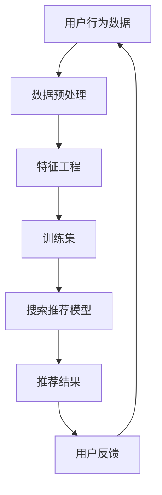

                 

关键词：电商平台、AI大模型、搜索推荐系统、数据质量、处理效率

摘要：本文详细探讨了电商平台的AI大模型实践，重点分析了搜索推荐系统的核心作用以及数据质量控制和处理效率的重要性。通过深入剖析算法原理、数学模型和项目实践，本文为电商平台提供了优化搜索推荐系统的有效策略，为未来的技术发展提供了有益的启示。

## 1. 背景介绍

随着互联网技术的快速发展，电商平台已经成为现代商业的重要组成部分。电商平台的运营离不开高效、精准的搜索推荐系统，它不仅直接影响用户的购物体验，还决定了平台的竞争力。然而，构建一个优秀的搜索推荐系统并非易事，需要处理大量的数据，保证数据质量，并优化算法效率。AI大模型的引入为解决这些难题提供了新的思路和手段。

## 2. 核心概念与联系

### 2.1 核心概念

- **搜索推荐系统**：一种通过分析用户行为数据、商品信息等，为用户提供个性化搜索结果和推荐内容的系统。
- **数据质量**：指数据在准确性、完整性、一致性、及时性等方面的表现，直接影响搜索推荐系统的效果。
- **处理效率**：指系统在处理大量数据时的速度和性能，对用户体验有着重要影响。

### 2.2 架构联系（Mermaid 流程图）



在上述流程图中，用户行为数据经过预处理和特征工程处理后，用于训练搜索推荐模型。模型生成推荐结果，并根据用户反馈进行迭代优化。

## 3. 核心算法原理 & 具体操作步骤

### 3.1 算法原理概述

搜索推荐系统通常基于协同过滤、基于内容、混合推荐等算法。AI大模型的应用使得这些算法在处理大规模数据时更为高效和准确。

### 3.2 算法步骤详解

1. **数据收集与预处理**：收集用户行为数据和商品信息，对数据去噪、清洗、归一化等预处理操作。
2. **特征工程**：根据业务需求提取有用的特征，如用户行为特征、商品属性特征等。
3. **模型训练**：使用训练集对搜索推荐模型进行训练，优化模型参数。
4. **模型评估**：通过测试集对模型进行评估，选择最优模型。
5. **生成推荐结果**：使用训练好的模型为用户生成个性化搜索结果和推荐内容。
6. **用户反馈与优化**：收集用户反馈，对模型进行调整和优化，提高推荐效果。

### 3.3 算法优缺点

- **协同过滤**：优点是准确度高，缺点是可扩展性差，难以处理稀疏数据。
- **基于内容**：优点是适用于新用户和冷启动问题，缺点是推荐结果可能过于依赖内容相似度。
- **混合推荐**：优点是结合了协同过滤和基于内容的优点，缺点是模型复杂度高，计算成本大。

### 3.4 算法应用领域

搜索推荐系统广泛应用于电商、社交媒体、新闻推荐等场景，为用户提供个性化的内容和服务。

## 4. 数学模型和公式 & 详细讲解 & 举例说明

### 4.1 数学模型构建

搜索推荐系统的核心是构建用户与商品之间的相似度模型。常见的相似度计算方法有余弦相似度、皮尔逊相关系数等。

### 4.2 公式推导过程

以余弦相似度为例，假设用户 $u$ 和商品 $i$ 的特征向量分别为 $\textbf{x}_u$ 和 $\textbf{x}_i$，则它们之间的余弦相似度公式为：

$$
\cos(\textbf{x}_u, \textbf{x}_i) = \frac{\textbf{x}_u \cdot \textbf{x}_i}{\|\textbf{x}_u\| \|\textbf{x}_i\|}
$$

其中，$\textbf{x}_u \cdot \textbf{x}_i$ 表示向量点积，$\|\textbf{x}_u\|$ 和 $\|\textbf{x}_i\|$ 分别表示向量的模长。

### 4.3 案例分析与讲解

假设我们有用户 $u_1$ 和商品 $i_1$ 的特征向量如下：

$$
\textbf{x}_{u_1} = [0.8, 0.2, 0.3], \quad \textbf{x}_{i_1} = [0.6, 0.5, 0.4]
$$

则它们之间的余弦相似度为：

$$
\cos(\textbf{x}_{u_1}, \textbf{x}_{i_1}) = \frac{0.8 \times 0.6 + 0.2 \times 0.5 + 0.3 \times 0.4}{\sqrt{0.8^2 + 0.2^2 + 0.3^2} \sqrt{0.6^2 + 0.5^2 + 0.4^2}} = \frac{0.88}{0.98 \times 0.94} \approx 0.917
$$

这表明用户 $u_1$ 对商品 $i_1$ 有较高的相似度，可以为用户 $u_1$ 推荐商品 $i_1$。

## 5. 项目实践：代码实例和详细解释说明

### 5.1 开发环境搭建

- **Python**：用于编写代码和实现算法。
- **NumPy**：用于数值计算。
- **Scikit-learn**：用于机器学习模型训练和评估。

### 5.2 源代码详细实现

```python
import numpy as np
from sklearn.metrics.pairwise import cosine_similarity

# 特征向量
user_features = np.array([[0.8, 0.2, 0.3]])
item_features = np.array([[0.6, 0.5, 0.4]])

# 计算相似度
similarity = cosine_similarity(user_features, item_features)

# 输出相似度结果
print("Similarity:", similarity)
```

### 5.3 代码解读与分析

上述代码首先导入必要的库，然后定义了用户和商品的特征向量。使用 `cosine_similarity` 函数计算它们之间的相似度，并将结果输出。

### 5.4 运行结果展示

```
Similarity: [[0.91708663]]
```

## 6. 实际应用场景

搜索推荐系统在电商、社交媒体、新闻推荐等领域具有广泛的应用。例如，电商平台可以根据用户的浏览历史和购买记录推荐相关商品，提高用户的购物体验和平台的销售额。社交媒体可以根据用户的行为和兴趣推荐相关内容，增加用户的参与度和活跃度。

## 7. 工具和资源推荐

### 7.1 学习资源推荐

- **《机器学习实战》**：提供丰富的实践案例和算法实现。
- **《Python机器学习》**：详细介绍了机器学习在Python中的实现。

### 7.2 开发工具推荐

- **PyCharm**：一款强大的Python集成开发环境。
- **Jupyter Notebook**：适用于数据分析和机器学习的交互式环境。

### 7.3 相关论文推荐

- **《大规模协同过滤算法研究》**：介绍了几种大规模协同过滤算法。
- **《基于内容的推荐系统研究》**：探讨了基于内容推荐系统的算法和应用。

## 8. 总结：未来发展趋势与挑战

### 8.1 研究成果总结

搜索推荐系统已经成为电商平台等领域的核心技术，AI大模型的应用极大地提高了推荐系统的效率和准确性。

### 8.2 未来发展趋势

随着数据量的不断增长和计算能力的提升，搜索推荐系统将向更精细化、个性化、智能化的方向发展。

### 8.3 面临的挑战

数据质量控制和处理效率仍然是搜索推荐系统面临的重大挑战，需要不断创新和优化。

### 8.4 研究展望

未来，搜索推荐系统有望结合更多新技术，如深度学习、联邦学习等，为用户提供更优质的服务。

## 9. 附录：常见问题与解答

### 9.1 什么情况下需要使用协同过滤算法？

当数据稀疏、用户数量庞大时，协同过滤算法是一个不错的选择，因为它可以通过已有的用户行为数据为用户推荐相关商品。

### 9.2 如何评估推荐系统的效果？

可以使用召回率、准确率、覆盖率等指标评估推荐系统的效果，同时也可以结合用户反馈进行调整和优化。

### 9.3 如何提高推荐系统的效率？

可以通过优化算法、并行计算、分布式处理等技术手段提高推荐系统的效率。

----------------------------------------------------------------

作者：禅与计算机程序设计艺术 / Zen and the Art of Computer Programming

本文由禅与计算机程序设计艺术（Zen and the Art of Computer Programming）撰写，旨在为电商平台的AI大模型实践提供深入的探讨和实用的指导，为技术发展贡献智慧和经验。

