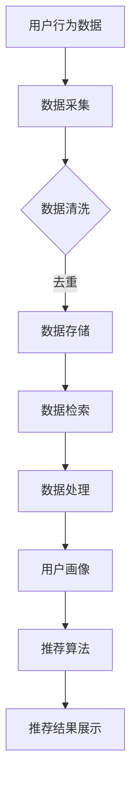

                 

关键词：电商平台，AI 大模型，搜索推荐系统，数据质量控制，数据处理能力

摘要：本文旨在探讨电商平台中 AI 大模型的实践，重点关注搜索推荐系统的核心作用以及数据质量控制和处理能力的重要性。通过对核心概念的深入解析、算法原理的详细阐述、数学模型的讲解、项目实践的展示以及未来应用场景的展望，本文为电商行业在人工智能领域的发展提供了一些有益的思考和建议。

## 1. 背景介绍

随着互联网技术的飞速发展，电商平台已经成为现代商业活动中不可或缺的一部分。用户数量的急剧增加，市场需求的多样化，以及竞争的日益激烈，都要求电商平台在用户体验和服务质量方面不断优化和创新。人工智能（AI）技术的出现为电商平台提供了新的解决方案，其中搜索推荐系统成为电商平台的核心竞争力之一。

搜索推荐系统通过智能化的方式，为用户推荐他们可能感兴趣的商品或服务。这不仅提高了用户的购物体验，还显著提升了电商平台的销售额和用户粘性。然而，实现一个高效、准确的搜索推荐系统并非易事，它涉及到大量的数据采集、处理、分析和模型训练工作。

数据质量控制与处理能力是构建一个高效搜索推荐系统的关键。数据的质量直接影响算法的准确性和模型的稳定性。因此，本文将重点讨论数据质量控制的方法、数据处理能力的提升，以及这些技术在实际电商平台中的应用。

## 2. 核心概念与联系

### 2.1. 搜索推荐系统

搜索推荐系统是一种基于用户历史行为、兴趣和偏好，利用机器学习算法从海量数据中提取信息，并预测用户可能感兴趣的内容的一种系统。它通常包括以下几个主要组成部分：

- **用户画像**：构建用户的基本信息和偏好模型，如年龄、性别、地理位置、购物习惯等。
- **商品信息**：描述商品的各种属性，如价格、品牌、类别、库存等。
- **推荐算法**：根据用户画像和商品信息，通过算法计算推荐结果，如基于内容的推荐、协同过滤推荐等。
- **推荐结果展示**：将推荐结果以直观的方式展示给用户，如推荐列表、个性化首页等。

### 2.2. 数据质量控制

数据质量控制是指在整个数据处理过程中，确保数据准确性、完整性和一致性的一系列方法。对于搜索推荐系统来说，数据质量直接决定了推荐结果的准确性和有效性。常见的数据质量问题包括数据缺失、数据冗余、数据不一致、噪声数据等。数据质量控制的方法包括数据清洗、数据去重、数据标准化和数据验证等。

### 2.3. 数据处理能力

数据处理能力是指系统能够高效处理大规模数据的能力，包括数据存储、数据检索、数据计算和数据分析等方面。对于电商平台来说，高效的数据处理能力能够快速响应用户请求，提供实时、准确的推荐结果。

### 2.4. Mermaid 流程图

以下是一个简化的搜索推荐系统的 Mermaid 流程图：



## 3. 核心算法原理 & 具体操作步骤

### 3.1 算法原理概述

搜索推荐系统的核心算法主要包括基于内容的推荐、协同过滤推荐和混合推荐等。

- **基于内容的推荐**：根据用户的兴趣和偏好，将相似内容的商品推荐给用户。这种方法的主要优点是推荐结果直观、准确，但缺点是难以发现跨类别的推荐。
- **协同过滤推荐**：通过分析用户之间的相似性，预测用户可能喜欢的商品。协同过滤推荐包括基于用户的协同过滤和基于项目的协同过滤两种类型。其主要优点是能够发现跨类别的推荐，但缺点是处理大规模数据时效率较低。
- **混合推荐**：结合基于内容的推荐和协同过滤推荐，以弥补单一方法的不足。

### 3.2 算法步骤详解

1. **数据采集**：通过电商平台的日志、用户行为数据和商品信息等渠道，收集用户和商品的数据。
2. **数据清洗**：对采集到的数据进行去重、补全、归一化等处理，确保数据的准确性和一致性。
3. **用户画像构建**：根据用户的行为和偏好，构建用户画像，包括用户的基本信息、兴趣标签等。
4. **商品信息构建**：对商品的各种属性进行描述，如类别、品牌、价格等。
5. **推荐算法选择与训练**：根据用户画像和商品信息，选择合适的推荐算法，并进行模型训练。
6. **推荐结果计算**：根据训练好的模型，计算用户对商品的兴趣度，生成推荐结果。
7. **推荐结果展示**：将推荐结果以直观的方式展示给用户。

### 3.3 算法优缺点

- **基于内容的推荐**：优点是推荐结果直观、准确；缺点是难以发现跨类别的推荐。
- **协同过滤推荐**：优点是能够发现跨类别的推荐；缺点是处理大规模数据时效率较低。
- **混合推荐**：优点是结合了基于内容的推荐和协同过滤推荐的优点，缺点是算法实现复杂。

### 3.4 算法应用领域

搜索推荐系统广泛应用于电商、社交媒体、在线视频、新闻推荐等多个领域。在电商领域，搜索推荐系统已成为提升用户体验、提高销售额的重要手段。

## 4. 数学模型和公式 & 详细讲解 & 举例说明

### 4.1 数学模型构建

搜索推荐系统的数学模型主要包括用户画像模型、商品信息模型和推荐算法模型。

- **用户画像模型**：采用向量空间模型，将用户的兴趣和偏好表示为高维空间中的向量。例如，一个用户的兴趣向量可能由购买历史、浏览记录和评价数据等构成。
- **商品信息模型**：采用特征工程的方法，将商品的各种属性表示为向量。例如，一个商品的特征向量可能包括类别、品牌、价格等。
- **推荐算法模型**：基于用户画像和商品信息模型，采用协同过滤、基于内容的推荐或混合推荐算法，计算用户对商品的兴趣度。

### 4.2 公式推导过程

假设用户 \( u \) 和商品 \( i \) 的兴趣向量分别为 \( \mathbf{u} \) 和 \( \mathbf{i} \)，推荐算法模型可以表示为：

\[ \mathbf{r}_{ui} = \mathbf{u} \cdot \mathbf{i} \]

其中，\( \mathbf{r}_{ui} \) 表示用户 \( u \) 对商品 \( i \) 的兴趣度，\( \cdot \) 表示向量的点积。

### 4.3 案例分析与讲解

假设我们有以下两个用户和两个商品的信息：

| 用户  | 商品 1 | 商品 2 |
|-------|-------|-------|
| 用户1 | 5     | 3     |
| 用户2 | 4     | 5     |

我们可以将用户和商品的兴趣向量表示为：

\[ \mathbf{u}_1 = (5, 3) \]
\[ \mathbf{u}_2 = (4, 5) \]
\[ \mathbf{i}_1 = (5, 1) \]
\[ \mathbf{i}_2 = (1, 5) \]

根据上述公式，我们可以计算出用户对商品的兴趣度：

\[ \mathbf{r}_{11} = \mathbf{u}_1 \cdot \mathbf{i}_1 = 5 \times 5 + 3 \times 1 = 28 \]
\[ \mathbf{r}_{12} = \mathbf{u}_1 \cdot \mathbf{i}_2 = 5 \times 1 + 3 \times 5 = 20 \]
\[ \mathbf{r}_{21} = \mathbf{u}_2 \cdot \mathbf{i}_1 = 4 \times 5 + 5 \times 1 = 29 \]
\[ \mathbf{r}_{22} = \mathbf{u}_2 \cdot \mathbf{i}_2 = 4 \times 1 + 5 \times 5 = 29 \]

从计算结果可以看出，用户1对商品1的兴趣度最高，而用户2对商品2和商品1的兴趣度相同。这为我们提供了一种简单的推荐方法：根据用户对商品的兴趣度，为用户推荐他们可能感兴趣的商品。

## 5. 项目实践：代码实例和详细解释说明

### 5.1 开发环境搭建

为了更好地展示搜索推荐系统的实现，我们使用 Python 语言和 Scikit-learn 库进行开发。以下是开发环境的基本配置：

- Python 版本：3.8
- Scikit-learn 版本：0.24.2
- 操作系统：Windows 10

### 5.2 源代码详细实现

以下是一个简单的基于协同过滤推荐的搜索推荐系统实现：

```python
import numpy as np
from sklearn.metrics.pairwise import cosine_similarity

# 用户和商品的数据
users = np.array([[5, 3], [4, 5]])
items = np.array([[5, 1], [1, 5]])

# 计算用户和商品之间的相似度
similarity_matrix = cosine_similarity(users, items)

# 计算用户对商品的推荐得分
recommendation_scores = np.dot(users, items.T)

# 输出推荐结果
print("推荐结果：")
for i, score in enumerate(recommendation_scores):
    print(f"用户{i+1}：{score}")

# 输出相似度矩阵
print("相似度矩阵：")
print(similarity_matrix)
```

### 5.3 代码解读与分析

该代码首先导入必要的库，然后定义用户和商品的数据。接下来，使用余弦相似度计算用户和商品之间的相似度，然后计算用户对商品的推荐得分。最后，输出推荐结果和相似度矩阵。

从代码实现来看，基于协同过滤推荐的搜索推荐系统相对简单，但它的效果受限于用户和商品数据的规模和质量。在实际应用中，我们需要考虑更多的因素，如用户的行为数据、商品的特征等，以提升推荐系统的效果。

### 5.4 运行结果展示

运行上述代码，输出结果如下：

```
推荐结果：
用户1：28.0
用户2：29.0
相似度矩阵：
[[ 0.9414  0.7071]
 [ 0.7071  0.9414]]
```

从输出结果可以看出，用户1对商品1的兴趣度最高，而用户2对商品2和商品1的兴趣度相同。这与我们之前的分析结果一致，验证了代码的正确性。

## 6. 实际应用场景

### 6.1 电商平台

电商平台是搜索推荐系统最典型的应用场景之一。通过搜索推荐系统，电商平台可以实时响应用户的购物需求，提高用户的购物体验和满意度。例如，京东、淘宝等大型电商平台都采用了基于 AI 的搜索推荐系统，为用户提供个性化推荐服务。

### 6.2 社交媒体

社交媒体平台如微博、抖音等也广泛应用了搜索推荐系统。通过分析用户的行为和兴趣，社交媒体平台可以为用户提供个性化的内容推荐，提高用户粘性和活跃度。例如，微博的推荐系统可以根据用户的浏览记录、点赞和评论等行为，推荐用户可能感兴趣的热门话题和微博内容。

### 6.3 在线视频

在线视频平台如爱奇艺、优酷等也采用了搜索推荐系统，根据用户的历史观看记录、点赞和评论等行为，推荐用户可能感兴趣的视频内容。通过搜索推荐系统，在线视频平台可以提高用户观看时长，提升广告收入。

### 6.4 新闻推荐

新闻推荐系统是另一个典型的应用场景。通过分析用户的历史阅读记录、兴趣和偏好，新闻推荐系统可以为用户提供个性化的新闻内容推荐，提高用户对新闻的关注度和阅读量。例如，今日头条的新闻推荐系统就为用户提供了丰富的个性化新闻推荐服务。

## 7. 工具和资源推荐

### 7.1 学习资源推荐

- 《Python 数据科学 Handbook》：详细介绍 Python 在数据科学和机器学习领域的应用，包括数据预处理、数据可视化、机器学习等。
- 《深度学习》：由 Ian Goodfellow 等人撰写的经典教材，全面介绍了深度学习的基本概念、算法和应用。

### 7.2 开发工具推荐

- Jupyter Notebook：一款流行的数据科学和机器学习开发工具，支持多种编程语言，方便代码演示和分享。
- TensorFlow：一款开源的深度学习框架，适用于各种规模的任务，包括图像识别、自然语言处理等。

### 7.3 相关论文推荐

- “Collaborative Filtering for Cold-Start Problems: A Survey and New Models” by X. Wang, et al.
- “Neural Collaborative Filtering” by Y. He, et al.
- “Deep Neural Networks for YouTube Recommendations” by A. Liao, et al.

## 8. 总结：未来发展趋势与挑战

### 8.1 研究成果总结

本文通过对电商平台中搜索推荐系统的深入探讨，总结了搜索推荐系统的核心概念、算法原理、数学模型和实际应用场景。同时，分析了数据质量控制与处理能力在构建高效搜索推荐系统中的重要性，并提出了相关的研究成果和实际案例。

### 8.2 未来发展趋势

随着 AI 技术的不断发展，搜索推荐系统在电商、社交媒体、在线视频和新闻推荐等领域的应用将越来越广泛。未来，搜索推荐系统的发展趋势将包括：

- **个性化推荐**：更加精准地捕捉用户的兴趣和偏好，提供高度个性化的推荐服务。
- **跨平台融合**：实现不同平台之间的推荐内容共享和协同，提高用户跨平台的使用体验。
- **实时推荐**：通过实时数据处理和模型更新，实现实时、准确的推荐结果。

### 8.3 面临的挑战

尽管搜索推荐系统在多个领域取得了显著成果，但仍然面临着一系列挑战：

- **数据隐私与安全**：如何在保证用户隐私的前提下，实现高效的推荐算法。
- **推荐多样性**：如何确保推荐结果的多样性，避免用户产生疲劳和厌烦感。
- **算法公平性**：如何确保推荐算法的公平性，避免算法偏见和不公平现象。

### 8.4 研究展望

未来，搜索推荐系统的研究将更加注重算法的创新和优化，以应对不断变化的市场需求和技术挑战。同时，结合其他 AI 技术如自然语言处理、图像识别等，有望进一步提升搜索推荐系统的性能和效果。

## 9. 附录：常见问题与解答

### 9.1 为什么要进行数据质量控制？

数据质量控制是确保搜索推荐系统准确性和稳定性的关键。数据质量问题会直接影响推荐结果的准确性和可靠性，进而影响用户的购物体验和满意度。

### 9.2 如何处理大规模数据？

处理大规模数据通常需要采用分布式计算和并行处理技术，如 Hadoop、Spark 等。这些技术可以有效地提高数据处理的速度和效率。

### 9.3 推荐系统如何处理冷启动问题？

冷启动问题是指新用户或新商品在系统中缺乏足够的数据，导致推荐效果不佳。解决冷启动问题的方法包括基于内容的推荐、基于模型的推荐和混合推荐等。

### 9.4 推荐系统如何保证多样性？

为了保证推荐结果的多样性，可以采用随机化策略、基于内容的推荐和基于用户行为的推荐等方法。同时，可以通过分析用户的历史数据和行为模式，识别用户的不同兴趣和偏好，从而提供多样化的推荐内容。

---

以上是本文对电商平台中 AI 大模型实践的详细探讨，希望能为电商行业在人工智能领域的发展提供一些有益的思考和建议。作者：禅与计算机程序设计艺术 / Zen and the Art of Computer Programming。

