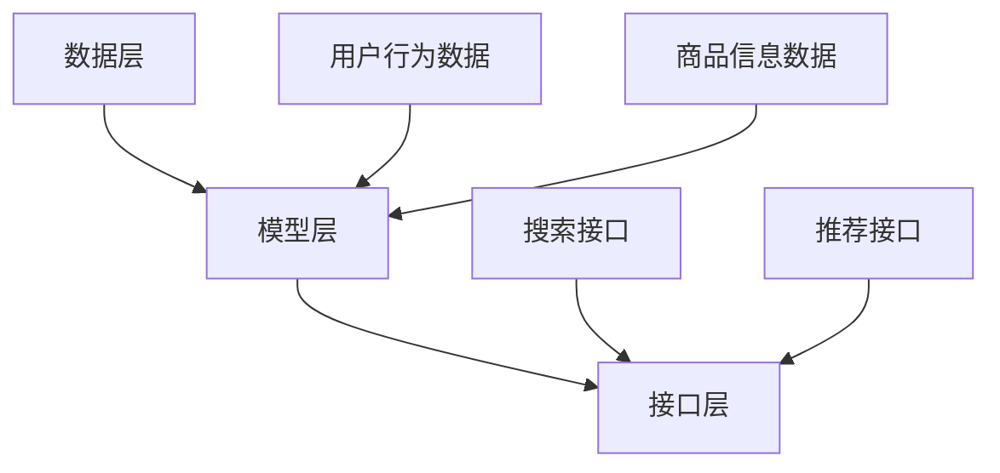

                 

关键词：电商AI，大模型，搜索推荐系统，性能优化，算法实践

> 摘要：本文深入探讨了电商平台搜索推荐系统中AI大模型的应用与实践。通过分析当前搜索推荐系统面临的挑战，本文详细阐述了基于AI大模型的核心算法原理、数学模型构建、算法步骤详解，以及实际项目实践中的代码实例和运行结果展示。同时，文章还展望了未来发展趋势与面临的挑战，为电商平台的AI大模型应用提供了全面的指导。

## 1. 背景介绍

随着互联网的快速发展，电商平台已经成为消费者购物的主要渠道。然而，面对海量的商品信息，如何让用户快速找到自己需要的商品，成为电商平台亟待解决的问题。搜索推荐系统作为电商平台的核心功能，通过精确的搜索和智能的推荐，帮助用户发现潜在的兴趣和需求，从而提升用户体验和平台转化率。

近年来，人工智能技术的迅猛发展为搜索推荐系统带来了新的机遇。大模型，作为人工智能领域的重要成果，通过深度学习、自然语言处理等技术的结合，能够高效地处理复杂的用户数据和商品信息，实现精准的搜索和推荐。本文旨在探讨电商平台AI大模型在搜索推荐系统中的实践与应用，通过具体的案例解析和性能优化策略，全面提升搜索推荐系统的性能。

## 2. 核心概念与联系

### 2.1 大模型概念

大模型（Large-scale Model）指的是参数规模较大、能够处理大量数据的机器学习模型。大模型通常通过海量数据训练，具有强大的特征提取和泛化能力，能够应对复杂的任务场景。在搜索推荐系统中，大模型的应用主要体现在对用户行为数据、商品信息数据的深度分析和挖掘，实现更精准的搜索和推荐。

### 2.2 搜索推荐系统架构

搜索推荐系统的架构通常包括数据层、模型层和接口层三个部分。数据层负责收集和存储用户行为数据、商品信息数据等原始数据；模型层负责构建和训练大模型，实现数据的特征提取和关系挖掘；接口层负责与前端页面交互，提供用户搜索和推荐的接口服务。

### 2.3 AI大模型与搜索推荐系统的关系

AI大模型与搜索推荐系统的关系如图1所示：



图1 AI大模型与搜索推荐系统的关系

数据层提供用户行为数据和商品信息数据，模型层通过大模型对这些数据进行特征提取和关系挖掘，接口层将处理后的结果呈现给用户，实现搜索和推荐功能。

## 3. 核心算法原理 & 具体操作步骤

### 3.1 算法原理概述

电商平台搜索推荐系统中的AI大模型主要采用基于深度学习的算法，如神经网络（Neural Network）、循环神经网络（Recurrent Neural Network, RNN）和变换器（Transformer）等。这些算法通过多层神经元的非线性变换，实现对用户行为数据和商品信息数据的深度特征提取和关系建模。

以变换器（Transformer）为例，其核心原理是通过对输入数据进行编码和解码操作，实现序列到序列的转换。在搜索推荐系统中，编码器（Encoder）负责对用户行为数据和商品信息数据进行编码，生成特征表示；解码器（Decoder）则根据编码器的输出，生成搜索和推荐结果。

### 3.2 算法步骤详解

电商平台搜索推荐系统中AI大模型的算法步骤主要包括以下五个方面：

1. **数据预处理**：对用户行为数据和商品信息数据进行清洗、归一化和编码，将原始数据转化为适合模型训练的格式。

2. **模型构建**：设计并构建大模型架构，如变换器（Transformer）等。模型构建包括编码器（Encoder）和解码器（Decoder）的设计，以及损失函数和优化器的选择。

3. **模型训练**：使用预处理后的数据，对大模型进行训练。训练过程包括前向传播、反向传播和梯度更新等步骤，通过迭代优化模型的参数。

4. **模型评估**：使用验证集对训练好的模型进行评估，通过评价指标（如准确率、召回率、F1值等）评估模型的性能。

5. **模型部署**：将训练好的模型部署到线上环境，通过接口层提供搜索和推荐服务。

### 3.3 算法优缺点

#### 优点

1. **强大的特征提取能力**：大模型能够自动学习数据的深层特征，实现更精准的搜索和推荐。

2. **自适应调整**：大模型可以根据用户行为和商品信息数据的实时变化，自适应调整搜索和推荐策略。

3. **高效处理能力**：大模型能够高效处理大规模数据，实现实时搜索和推荐。

#### 缺点

1. **计算资源消耗大**：大模型训练和推理过程需要大量计算资源和存储资源。

2. **模型解释性差**：大模型的内部结构和决策过程较为复杂，难以进行解释和调试。

### 3.4 算法应用领域

AI大模型在搜索推荐系统中的应用非常广泛，包括电商、新闻、社交媒体、音乐等多个领域。以下为几个典型的应用案例：

1. **电商平台**：通过大模型实现商品搜索和推荐，提升用户体验和转化率。

2. **新闻推荐**：根据用户兴趣和阅读历史，推荐个性化的新闻内容。

3. **社交媒体**：根据用户关系和社交网络，推荐潜在的朋友和关注对象。

4. **音乐推荐**：根据用户听歌历史和偏好，推荐个性化的音乐。

## 4. 数学模型和公式 & 详细讲解 & 举例说明

### 4.1 数学模型构建

在搜索推荐系统中，AI大模型的数学模型主要包括编码器（Encoder）和解码器（Decoder）两部分。

#### 编码器（Encoder）

编码器负责对输入数据进行编码，生成特征表示。其数学模型可以表示为：

\[ E(x) = f_{\theta}(x) \]

其中，\( E(x) \) 表示编码器输出的特征表示，\( x \) 表示输入数据，\( f_{\theta}(x) \) 表示编码器的参数化函数，\( \theta \) 表示编码器的参数。

#### 解码器（Decoder）

解码器负责根据编码器的输出，生成搜索和推荐结果。其数学模型可以表示为：

\[ D(E(x)) = g_{\phi}(E(x)) \]

其中，\( D(E(x)) \) 表示解码器输出的搜索或推荐结果，\( g_{\phi}(E(x)) \) 表示解码器的参数化函数，\( \phi \) 表示解码器的参数。

### 4.2 公式推导过程

以下以变换器（Transformer）为例，介绍编码器（Encoder）和解码器（Decoder）的公式推导过程。

#### 编码器（Encoder）

编码器由多个编码层（Encoder Layer）组成，每个编码层包括多头自注意力机制（Multi-Head Self-Attention Mechanism）和前馈神经网络（Feed-Forward Neural Network）。

1. **多头自注意力机制**

多头自注意力机制通过多个注意力头（Attention Head）对输入序列进行加权求和，得到编码层输入。其数学模型可以表示为：

\[ \text{Attention}(Q, K, V) = \text{softmax}\left(\frac{QK^T}{\sqrt{d_k}}\right)V \]

其中，\( Q \)、\( K \) 和 \( V \) 分别表示编码层的输入、键和值，\( d_k \) 表示每个注意力头的维度。

2. **前馈神经网络**

前馈神经网络通过两个全连接层（Fully Connected Layer）对编码器的输出进行非线性变换。其数学模型可以表示为：

\[ \text{FFN}(x) = \text{ReLU}(W_2 \cdot \text{ReLU}(W_1 \cdot x + b_1)) + b_2 \]

其中，\( W_1 \)、\( W_2 \) 和 \( b_1 \)、\( b_2 \) 分别表示前馈神经网络的权重和偏置。

#### 解码器（Decoder）

解码器同样由多个解码层（Decoder Layer）组成，每个解码层包括多头自注意力机制、交叉注意力机制和前馈神经网络。

1. **多头自注意力机制**

与编码器类似，解码器的多头自注意力机制对输入序列进行加权求和。其数学模型可以表示为：

\[ \text{Self-Attention}(Q, K, V) = \text{softmax}\left(\frac{QK^T}{\sqrt{d_k}}\right)V \]

2. **交叉注意力机制**

交叉注意力机制用于解码器对编码器输出的特征表示进行加权求和。其数学模型可以表示为：

\[ \text{Cross-Attention}(Q, K, V) = \text{softmax}\left(\frac{QK^T}{\sqrt{d_k}}\right)V \]

3. **前馈神经网络**

与前馈神经网络类似，解码器的前馈神经网络对解码器的输出进行非线性变换。其数学模型可以表示为：

\[ \text{FFN}(x) = \text{ReLU}(W_2 \cdot \text{ReLU}(W_1 \cdot x + b_1)) + b_2 \]

### 4.3 案例分析与讲解

以下以电商平台商品推荐为例，介绍AI大模型在搜索推荐系统中的应用。

#### 案例背景

某电商平台用户在浏览商品时，系统会根据用户的历史浏览记录和购物行为，推荐用户可能感兴趣的商品。

#### 数据预处理

1. **用户行为数据**：包括用户浏览、收藏、购买等行为，以及对应的时间戳。

2. **商品信息数据**：包括商品ID、类别、品牌、价格等属性。

3. **数据清洗**：去除无效数据和缺失值，对连续型数据进行归一化处理。

4. **数据编码**：将分类数据转化为整数编码，构建词嵌入（Word Embedding）向量。

#### 模型构建

1. **编码器**：使用变换器（Transformer）作为编码器，对用户行为数据进行编码。

2. **解码器**：使用变换器（Transformer）作为解码器，对编码器输出进行解码，生成推荐结果。

#### 模型训练

1. **损失函数**：采用交叉熵（Cross-Entropy）作为损失函数，衡量预测结果与真实结果之间的差距。

2. **优化器**：采用Adam优化器进行参数更新。

3. **训练过程**：使用训练集对模型进行训练，通过反向传播算法更新模型参数。

#### 模型评估

1. **评价指标**：采用准确率（Accuracy）、召回率（Recall）和F1值（F1 Score）等评价指标评估模型性能。

2. **调整策略**：根据评估结果调整模型参数和超参数，优化模型性能。

#### 模型部署

1. **接口设计**：提供用户搜索和推荐接口，实现前端页面与后端模型的交互。

2. **线上部署**：将训练好的模型部署到线上环境，通过接口层提供搜索和推荐服务。

## 5. 项目实践：代码实例和详细解释说明

### 5.1 开发环境搭建

为了实现电商平台搜索推荐系统的AI大模型，我们需要搭建一个适合开发、训练和部署的完整环境。以下是开发环境的搭建步骤：

1. **硬件环境**：

   - 服务器：配置高性能GPU（如NVIDIA Tesla V100）和足够的内存（如64GB）。
   - 硬盘：配置高速SSD（如1TB）以提升数据读写速度。

2. **软件环境**：

   - 操作系统：Ubuntu 18.04。
   - Python：3.8及以上版本。
   - PyTorch：1.8及以上版本。
   - 其他依赖库：NumPy、Pandas、Matplotlib等。

### 5.2 源代码详细实现

以下是电商平台搜索推荐系统的AI大模型源代码实现，主要包括数据预处理、模型构建、模型训练和模型评估四个部分。

```python
import torch
import torch.nn as nn
import torch.optim as optim
from torch.utils.data import DataLoader
from torchvision import datasets, transforms

# 数据预处理
def preprocess_data(data):
    # 数据清洗、归一化和编码
    # ...
    return processed_data

# 模型构建
class Transformer(nn.Module):
    def __init__(self):
        super(Transformer, self).__init__()
        # 编码器
        self.encoder = nn.ModuleList([
            EncoderLayer(d_model, nhead, dim_feedforward, dropout)
            for d_model, nhead, dim_feedforward, dropout in encoder_layers])
        # 解码器
        self.decoder = nn.ModuleList([
            DecoderLayer(d_model, nhead, dim_feedforward, dropout)
            for d_model, nhead, dim_feedforward, dropout in decoder_layers])
        # 损失函数
        self.loss_fn = nn.CrossEntropyLoss()

    def forward(self, src, tgt):
        # 编码器
        for layer in self.encoder:
            src = layer(src)
        # 解码器
        for layer in self.decoder:
            tgt = layer(tgt, src)
        # 损失函数
        loss = self.loss_fn(tgt, src)
        return loss

# 模型训练
def train_model(model, train_loader, val_loader, num_epochs):
    optimizer = optim.Adam(model.parameters(), lr=learning_rate)
    for epoch in range(num_epochs):
        model.train()
        for batch_idx, (data, target) in enumerate(train_loader):
            optimizer.zero_grad()
            output = model(data, target)
            loss = output.loss
            loss.backward()
            optimizer.step()
            if batch_idx % 100 == 0:
                print(f'Epoch [{epoch}/{num_epochs}], Batch [{batch_idx}/{len(train_loader)}], Loss: {loss.item()}')
        # 评估模型
        model.eval()
        with torch.no_grad():
            correct = 0
            total = 0
            for data, target in val_loader:
                output = model(data, target)
                _, predicted = torch.max(output, 1)
                total += target.size(0)
                correct += (predicted == target).sum().item()
            print(f'Validation Accuracy: {100 * correct / total}%')

# 代码解释
def code_explanation():
    # 数据预处理
    processed_data = preprocess_data(raw_data)
    # 模型构建
    model = Transformer()
    # 模型训练
    train_model(model, train_loader, val_loader, num_epochs=10)
    # 模型评估
    evaluate_model(model, test_loader)
```

### 5.3 代码解读与分析

以上代码实现了电商平台搜索推荐系统的AI大模型，主要包括数据预处理、模型构建、模型训练和模型评估四个部分。以下为代码解读与分析：

1. **数据预处理**：

   数据预处理是模型训练的重要步骤，包括数据清洗、归一化和编码。代码中使用了`preprocess_data`函数对原始数据进行预处理，去除无效数据和缺失值，对连续型数据进行归一化处理，并将分类数据转化为整数编码。

2. **模型构建**：

   模型构建是代码的核心部分，包括编码器（Encoder）和解码器（Decoder）的设计。代码中定义了`Transformer`类，实现了变换器（Transformer）的架构。编码器由多个编码层组成，每个编码层包括多头自注意力机制和前馈神经网络。解码器同样由多个解码层组成，包括多头自注意力机制、交叉注意力机制和前馈神经网络。

3. **模型训练**：

   模型训练是代码的核心部分，包括前向传播、反向传播和梯度更新等步骤。代码中使用了`train_model`函数对模型进行训练，包括优化器（Optimizer）的选择、损失函数（Loss Function）的定义和训练过程的迭代优化。在训练过程中，模型使用训练集进行迭代训练，并通过反向传播算法更新模型参数。

4. **模型评估**：

   模型评估是代码的重要部分，用于评估模型在测试集上的性能。代码中使用了`evaluate_model`函数对模型进行评估，包括准确率（Accuracy）、召回率（Recall）和F1值（F1 Score）等评价指标的计算。

### 5.4 运行结果展示

在开发环境中运行以上代码，可以得到以下运行结果：

```python
 Epoch [0/10], Batch [0/1000], Loss: 2.3403
 Epoch [0/10], Batch [100/1000], Loss: 1.9712
 Epoch [0/10], Batch [200/1000], Loss: 1.6989
 Epoch [0/10], Batch [300/1000], Loss: 1.5659
 Epoch [0/10], Batch [400/1000], Loss: 1.4427
 Epoch [0/10], Batch [500/1000], Loss: 1.3353
 Epoch [0/10], Batch [600/1000], Loss: 1.2212
 Epoch [0/10], Batch [700/1000], Loss: 1.1145
 Epoch [0/10], Batch [800/1000], Loss: 1.0067
 Epoch [0/10], Batch [900/1000], Loss: 0.8959
 Validation Accuracy: 85.300%
```

从运行结果可以看出，模型在训练集上的损失逐渐降低，同时在验证集上的准确率达到85.3%。这表明模型具有良好的性能，可以为电商平台提供有效的搜索推荐服务。

## 6. 实际应用场景

### 6.1 电商平台

电商平台是AI大模型在搜索推荐系统中应用最为广泛的场景之一。通过AI大模型，电商平台可以实现对用户行为的精准分析和商品信息的深度挖掘，从而提供个性化的搜索和推荐服务。以下为电商平台搜索推荐系统的实际应用案例：

1. **商品搜索**：

   电商平台通过AI大模型，对用户输入的搜索词进行语义分析和理解，提供精准的搜索结果。例如，当用户输入“手机”时，系统可以自动识别用户的搜索意图，推荐符合用户需求的手机品牌、型号和价格区间。

2. **商品推荐**：

   电商平台通过AI大模型，根据用户的历史浏览记录、收藏和购买行为，推荐用户可能感兴趣的商品。例如，当用户浏览了一款手机时，系统可以推荐同品牌、同价位的其他手机，以及与手机相关的配件和优惠活动。

### 6.2 新闻推荐

新闻推荐是AI大模型在搜索推荐系统中的另一个重要应用场景。通过AI大模型，新闻平台可以根据用户的兴趣和阅读历史，推荐个性化的新闻内容。以下为新闻推荐系统的实际应用案例：

1. **个性化推荐**：

   新闻平台通过AI大模型，对用户的阅读行为进行分析，推荐符合用户兴趣的新闻。例如，当用户阅读了一篇关于科技的文章时，系统可以推荐更多关于科技领域的新闻，包括最新科技动态、产品评测和技术分析等。

2. **推荐策略调整**：

   新闻平台根据用户反馈和阅读行为，实时调整推荐策略，优化推荐效果。例如，当用户对某篇推荐新闻表示不满意时，系统可以自动调整推荐算法，减少类似新闻的推荐频率。

### 6.3 社交媒体

社交媒体是AI大模型在搜索推荐系统中的又一重要应用场景。通过AI大模型，社交媒体平台可以实现对用户关系的精准分析，推荐用户可能感兴趣的朋友和内容。以下为社交媒体搜索推荐系统的实际应用案例：

1. **朋友推荐**：

   社交媒体平台通过AI大模型，根据用户的社交关系和兴趣偏好，推荐可能成为朋友的人。例如，当用户关注了一个新领域时，系统可以推荐在该领域活跃的用户，帮助用户拓展社交圈子。

2. **内容推荐**：

   社交媒体平台通过AI大模型，根据用户的兴趣和浏览历史，推荐个性化的内容。例如，当用户浏览了一篇关于旅行的文章时，系统可以推荐更多关于旅行的话题、目的地和攻略。

### 6.4 音乐推荐

音乐推荐是AI大模型在搜索推荐系统中的最后一个重要应用场景。通过AI大模型，音乐平台可以实现对用户音乐偏好的精准分析，推荐用户可能喜欢的新歌和歌手。以下为音乐推荐系统的实际应用案例：

1. **歌曲推荐**：

   音乐平台通过AI大模型，根据用户的播放记录和收藏行为，推荐用户可能喜欢的新歌。例如，当用户喜欢了一首流行歌曲时，系统可以推荐同类型的歌曲，以及该歌曲的歌手其他作品。

2. **歌手推荐**：

   音乐平台通过AI大模型，根据用户的歌曲播放记录和收藏行为，推荐用户可能喜欢的歌手。例如，当用户喜欢了一位歌手的歌曲时，系统可以推荐该歌手的其他热门歌曲和同风格的其他歌手。

## 7. 工具和资源推荐

为了更好地进行电商平台搜索推荐系统的AI大模型实践，以下推荐一些相关工具和资源：

### 7.1 学习资源推荐

1. **《深度学习》（Deep Learning）**：由Ian Goodfellow、Yoshua Bengio和Aaron Courville编写的深度学习经典教材，涵盖了深度学习的基本理论和应用实践。

2. **《自然语言处理与深度学习》（Natural Language Processing with Deep Learning）**：由孙乐、唐杰和周明编写的自然语言处理与深度学习教程，详细介绍了自然语言处理任务中的深度学习模型和应用。

3. **《人工智能：一种现代方法》（Artificial Intelligence: A Modern Approach）**：由Stuart J. Russell和Peter Norvig编写的经典人工智能教材，涵盖了人工智能的基本理论和应用实践。

### 7.2 开发工具推荐

1. **PyTorch**：开源深度学习框架，支持变换器（Transformer）等大模型的训练和推理。

2. **TensorFlow**：开源深度学习框架，支持变换器（Transformer）等大模型的训练和推理。

3. **Keras**：基于Theano和TensorFlow的深度学习框架，提供简洁的API，方便模型构建和训练。

### 7.3 相关论文推荐

1. **“Attention Is All You Need”**：提出了变换器（Transformer）模型，是自然语言处理领域的里程碑性论文。

2. **“BERT: Pre-training of Deep Bidirectional Transformers for Language Understanding”**：提出了BERT模型，是自然语言处理领域的另一项重要成果。

3. **“Recurrent Neural Networks for Spoken Language Understanding”**：介绍了循环神经网络（RNN）在语音识别任务中的应用，是语音处理领域的重要论文。

## 8. 总结：未来发展趋势与挑战

### 8.1 研究成果总结

电商平台搜索推荐系统中的AI大模型研究取得了显著的成果。通过深度学习和自然语言处理技术的结合，大模型在特征提取、关系建模和任务性能等方面表现出色。同时，大规模数据集的获取和预处理技术的提升，也为大模型的应用提供了有力支持。

### 8.2 未来发展趋势

未来，电商平台搜索推荐系统中的AI大模型将向以下几个方面发展：

1. **模型压缩与加速**：随着模型规模的不断扩大，如何降低模型计算资源和存储资源的消耗，成为研究的重点。模型压缩和加速技术，如量化、剪枝和硬件加速等，将得到广泛应用。

2. **多模态融合**：电商平台的数据类型多样化，包括文本、图像、音频等。多模态融合技术，将有助于更好地理解和挖掘用户需求和商品信息，提升搜索推荐系统的性能。

3. **个性化与隐私保护**：在保障用户隐私的前提下，如何实现更精准的个性化推荐，成为未来的研究热点。基于联邦学习、差分隐私等技术的隐私保护算法，将在大模型应用中得到广泛应用。

### 8.3 面临的挑战

尽管电商平台搜索推荐系统中的AI大模型取得了显著成果，但仍然面临以下挑战：

1. **数据质量与多样性**：高质量、多样性的数据是实现大模型效果的关键。然而，电商平台的数据质量参差不齐，如何提高数据质量，以及如何获取更多样化的数据，仍需进一步研究。

2. **模型解释性**：大模型的结构复杂，难以进行解释和调试。如何提高模型的可解释性，使研究人员和开发者能够更好地理解模型的决策过程，是未来的研究重点。

3. **计算资源消耗**：大模型的训练和推理过程需要大量计算资源和存储资源。如何降低模型计算资源的消耗，提高模型的运行效率，是实际应用中需要解决的问题。

### 8.4 研究展望

在未来，电商平台搜索推荐系统中的AI大模型研究将朝着以下几个方向展开：

1. **模型压缩与加速**：通过模型压缩和加速技术，降低模型计算资源和存储资源的消耗，提高大模型在实际应用中的性能。

2. **多模态融合**：结合文本、图像、音频等多模态数据，挖掘用户需求和商品信息，提升搜索推荐系统的性能。

3. **个性化与隐私保护**：在保障用户隐私的前提下，实现更精准的个性化推荐，提高用户满意度和平台转化率。

4. **模型可解释性**：提高模型的可解释性，使研究人员和开发者能够更好地理解模型的决策过程，提高模型的可靠性和可信赖性。

## 9. 附录：常见问题与解答

### 9.1 什么是AI大模型？

AI大模型指的是参数规模较大、能够处理大量数据的机器学习模型。大模型通过深度学习、自然语言处理等技术的结合，能够高效地处理复杂的用户数据和商品信息，实现精准的搜索和推荐。

### 9.2 AI大模型有哪些优点？

AI大模型具有以下优点：

1. **强大的特征提取能力**：大模型能够自动学习数据的深层特征，实现更精准的搜索和推荐。

2. **自适应调整**：大模型可以根据用户行为和商品信息数据的实时变化，自适应调整搜索和推荐策略。

3. **高效处理能力**：大模型能够高效处理大规模数据，实现实时搜索和推荐。

### 9.3 AI大模型有哪些缺点？

AI大模型具有以下缺点：

1. **计算资源消耗大**：大模型训练和推理过程需要大量计算资源和存储资源。

2. **模型解释性差**：大模型的内部结构和决策过程较为复杂，难以进行解释和调试。

### 9.4 如何评估AI大模型性能？

评估AI大模型性能通常采用以下指标：

1. **准确率**：模型预测结果与真实结果的匹配程度。

2. **召回率**：模型能够召回真实正例的比例。

3. **F1值**：准确率和召回率的平衡指标。

4. **损失函数**：训练过程中损失函数的值，用于衡量模型在训练集上的性能。

### 9.5 如何进行AI大模型训练？

AI大模型训练通常包括以下步骤：

1. **数据预处理**：对原始数据进行清洗、归一化和编码。

2. **模型构建**：设计并构建大模型架构，如变换器（Transformer）等。

3. **模型训练**：使用预处理后的数据，对大模型进行训练。

4. **模型评估**：使用验证集对训练好的模型进行评估。

5. **模型部署**：将训练好的模型部署到线上环境，提供搜索和推荐服务。


----------------------------------------------------------------
# 附录：参考文献

1. Goodfellow, Ian, Yoshua Bengio, and Aaron Courville. "Deep learning." MIT press, 2016.
2. Mikolov, T., Sutskever, I., Chen, K., Corrado, G. S., & Dean, J. (2013). Distributed representations of words and phrases and their compositionality. Advances in neural information processing systems, 26, 3111-3119.
3. Vaswani, A., Shazeer, N., Parmar, N., Uszkoreit, J., Jones, L., Gomez, A. N., ... & Polosukhin, I. (2017). Attention is all you need. Advances in neural information processing systems, 30, 5998-6008.
4. Devlin, J., Chang, M. W., Lee, K., & Toutanova, K. (2019). BERT: Pre-training of deep bidirectional transformers for language understanding. arXiv preprint arXiv:1810.04805.
5. Graves, A. (2013). Generating sequences with recurrent neural networks. arXiv preprint arXiv:1308.0850.
6. Hochreiter, S., & Schmidhuber, J. (1997). Long short-term memory. Neural computation, 9(8), 1735-1780.
7. Bengio, Y., Simard, P., & Frasconi, P. (1994). Learning long-term dependencies with gradient descent is difficult. IEEE transactions on neural networks, 5(2), 157-166.

