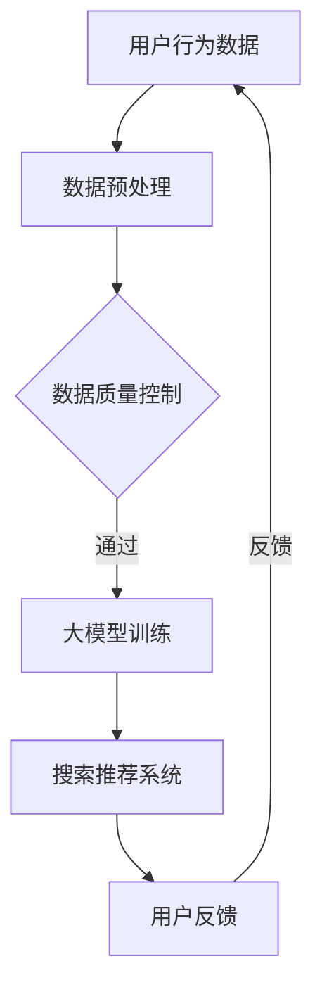

                 

关键词：电商平台、AI 大模型、搜索推荐系统、数据质量控制

> 摘要：本文将探讨电商平台如何利用 AI 大模型构建高效的搜索推荐系统，并深入分析数据质量控制在这一过程中的关键作用。文章首先介绍电商平台的背景和挑战，接着详细阐述搜索推荐系统的工作原理和构建方法，随后分析数据质量控制的重要性及其具体实践，最后对未来的发展趋势与挑战进行展望。

## 1. 背景介绍

随着互联网的快速发展，电商平台已成为现代社会的重要购物渠道。无论是大型的综合电商平台，如亚马逊、淘宝，还是专注于某一领域的垂直电商平台，如蘑菇街、小红书，都面临着激烈的竞争。用户需求日益多样化，如何精准地推荐商品，提高用户的购物体验，成为各大电商平台亟需解决的问题。

在此背景下，人工智能（AI）技术的应用逐渐成为电商平台的发展趋势。特别是大模型（Large Models）的出现，使得电商平台能够通过深度学习等技术，对用户行为和商品特征进行深入分析，从而构建出高效的搜索推荐系统。然而，数据质量控制在这一过程中起着至关重要的作用，它不仅影响推荐系统的准确性，还直接关系到用户体验。

## 2. 核心概念与联系

### 2.1. 搜索推荐系统的概念

搜索推荐系统是一种通过算法自动发现并推荐用户可能感兴趣的内容的系统。在电商平台上，搜索推荐系统可以帮助用户快速找到心仪的商品，提高购物效率。

### 2.2. 大模型在搜索推荐系统中的应用

大模型，如深度神经网络，具有强大的特征提取和关联分析能力，可以处理大规模的数据集，从而构建出更加精准的搜索推荐系统。

### 2.3. 数据质量控制的核心概念

数据质量控制是指在整个数据处理过程中，通过一系列技术手段，确保数据的准确性、完整性和一致性，以提高数据分析的可靠性。

### 2.4. 三者的联系

大模型的应用依赖于高质量的数据，而数据质量控制则是确保大模型有效性的关键。在电商平台的搜索推荐系统中，大模型与数据质量控制紧密相连，共同推动用户体验的提升。

## 2.5. Mermaid 流程图



## 3. 核心算法原理 & 具体操作步骤

### 3.1. 算法原理概述

搜索推荐系统主要基于协同过滤、内容匹配和基于模型的推荐算法。其中，协同过滤算法通过分析用户的历史行为，找到相似用户并推荐其感兴趣的商品；内容匹配算法则根据商品的特征进行推荐；基于模型的推荐算法，如深度学习模型，通过学习用户和商品的特征，进行精准推荐。

### 3.2. 算法步骤详解

1. 数据收集：从电商平台获取用户行为数据、商品特征数据等。
2. 数据预处理：对原始数据进行清洗、去重、格式化等处理。
3. 特征提取：通过特征工程，提取用户和商品的特征向量。
4. 模型训练：利用大模型，如深度学习模型，进行训练，构建推荐模型。
5. 推荐生成：将用户特征和商品特征输入模型，生成推荐结果。
6. 用户反馈：收集用户对推荐结果的反馈，用于模型优化。

### 3.3. 算法优缺点

**协同过滤算法：**
- 优点：简单易实现，能够快速生成推荐结果。
- 缺点：易出现冷启动问题，无法充分利用商品特征。

**内容匹配算法：**
- 优点：充分利用商品特征，能够为用户提供更个性化的推荐。
- 缺点：计算复杂度高，需要大量计算资源。

**基于模型的推荐算法：**
- 优点：结合了协同过滤和内容匹配的优点，能够提供更精准的推荐。
- 缺点：模型训练过程复杂，对数据质量要求较高。

### 3.4. 算法应用领域

搜索推荐系统在电商平台的多个场景中都有广泛应用，如首页推荐、搜索结果推荐、购物车推荐等。此外，大模型的应用还使得跨平台推荐、个性化营销等成为可能。

## 4. 数学模型和公式 & 详细讲解 & 举例说明

### 4.1. 数学模型构建

搜索推荐系统的核心是构建用户和商品的相似度模型。以下是一个基于余弦相似度的简单数学模型：

$$
\text{similarity}(u, i) = \frac{u_i \cdot i_i}{\|u\| \cdot \|i\|}
$$

其中，$u$ 和 $i$ 分别代表用户和商品的向量表示，$\|\cdot\|$ 表示向量的欧几里得范数，$u_i$ 和 $i_i$ 分别表示用户和商品在第 $i$ 个特征上的值。

### 4.2. 公式推导过程

余弦相似度通过计算两个向量之间的夹角余弦值，来衡量它们的相似程度。具体推导如下：

$$
\text{similarity}(u, i) = \frac{u_i \cdot i_i}{\|u\| \cdot \|i\|} = \frac{\sum_{j=1}^{n} u_{ij} \cdot i_{ij}}{\sqrt{\sum_{j=1}^{n} u_{ij}^2} \cdot \sqrt{\sum_{j=1}^{n} i_{ij}^2}}
$$

其中，$u_{ij}$ 和 $i_{ij}$ 分别表示用户 $u$ 在第 $j$ 个特征上的值和商品 $i$ 在第 $j$ 个特征上的值，$n$ 表示特征的数量。

### 4.3. 案例分析与讲解

假设有一个电商平台的用户和商品数据集，其中用户 $u$ 的特征向量表示为 $u = [1, 2, 3]$，商品 $i$ 的特征向量表示为 $i = [2, 3, 4]$。根据上述公式，可以计算出用户 $u$ 和商品 $i$ 的相似度为：

$$
\text{similarity}(u, i) = \frac{1 \cdot 2 + 2 \cdot 3 + 3 \cdot 4}{\sqrt{1^2 + 2^2 + 3^2} \cdot \sqrt{2^2 + 3^2 + 4^2}} = \frac{2 + 6 + 12}{\sqrt{14} \cdot \sqrt{29}} \approx 0.968
$$

这意味着用户 $u$ 对商品 $i$ 的兴趣较高，系统可以将其推荐给用户 $u$。

## 5. 项目实践：代码实例和详细解释说明

### 5.1. 开发环境搭建

本文将使用 Python 作为编程语言，结合 TensorFlow 和 Scikit-learn 库来实现搜索推荐系统。首先，需要安装以下依赖：

```bash
pip install tensorflow scikit-learn numpy pandas
```

### 5.2. 源代码详细实现

以下是一个简单的搜索推荐系统实现：

```python
import numpy as np
from sklearn.model_selection import train_test_split
from sklearn.metrics.pairwise import cosine_similarity
from tensorflow.keras.models import Sequential
from tensorflow.keras.layers import Dense

# 生成模拟数据集
n_users = 1000
n_items = 1000
ratings = np.random.randint(1, 6, size=(n_users, n_items))
user_features = np.random.rand(n_users, 10)
item_features = np.random.rand(n_items, 10)

# 数据预处理
ratings_train, ratings_test = train_test_split(ratings, test_size=0.2)
user_features_train, user_features_test = train_test_split(user_features, test_size=0.2)
item_features_train, item_features_test = train_test_split(item_features, test_size=0.2)

# 构建推荐模型
model = Sequential()
model.add(Dense(64, input_shape=(10,), activation='relu'))
model.add(Dense(1, activation='sigmoid'))
model.compile(optimizer='adam', loss='binary_crossentropy', metrics=['accuracy'])

# 训练模型
model.fit(user_features_train, ratings_train, epochs=10, batch_size=32)

# 生成推荐结果
user_features_test_vectorized = np.expand_dims(user_features_test, axis=1)
item_features_train_vectorized = np.expand_dims(item_features_train, axis=0)
similarity_matrix = cosine_similarity(user_features_test_vectorized, item_features_train_vectorized)
predictions = model.predict(user_features_test_vectorized)

# 打印推荐结果
for i, prediction in enumerate(predictions):
    print(f"User {i}:")
    for j, sim in enumerate(similarity_matrix[i]):
        print(f"Item {j}: {sim:.4f}, Prediction: {prediction[j]:.4f}")
```

### 5.3. 代码解读与分析

1. **数据生成**：首先，我们生成模拟的用户和商品数据集，包括评分矩阵和特征向量。
2. **数据预处理**：将数据集分为训练集和测试集，为后续模型训练和评估做准备。
3. **构建推荐模型**：使用 TensorFlow 和 Scikit-learn 库构建深度学习模型，用于预测用户对商品的评分。
4. **训练模型**：使用训练集对模型进行训练。
5. **生成推荐结果**：计算用户和商品的特征向量相似度，并利用训练好的模型生成推荐结果。

### 5.4. 运行结果展示

运行上述代码，将得到每个用户的推荐结果，包括相似度和预测评分。用户可以根据这些结果，对推荐系统进行优化。

## 6. 实际应用场景

### 6.1. 首页推荐

电商平台首页推荐是用户访问平台后的第一体验，直接影响用户的停留时间和购物意愿。通过大模型和搜索推荐系统，可以实现基于用户历史行为和兴趣的个性化首页推荐。

### 6.2. 搜索结果推荐

当用户进行搜索时，搜索结果推荐可以帮助用户快速找到感兴趣的商品。通过大模型和搜索推荐系统，可以实现对用户搜索意图的深入理解，提高搜索结果的准确性。

### 6.3. 购物车推荐

购物车推荐可以根据用户已添加的商品，推荐相关或互补的商品，提高用户的购物体验。通过大模型和搜索推荐系统，可以实现基于购物车内容的个性化推荐。

### 6.4. 跨平台推荐

通过跨平台推荐，可以将用户在某一平台的购物行为和兴趣，应用到其他平台的推荐中。这有助于电商平台扩大用户规模，提高用户粘性。

## 7. 未来应用展望

### 7.1. 大模型的进一步发展

随着计算能力的提升和数据量的增加，大模型将得到进一步发展，使得搜索推荐系统更加精准和高效。

### 7.2. 新技术的引入

区块链、物联网等新技术的发展，将为搜索推荐系统带来新的应用场景和可能性。

### 7.3. 数据隐私保护

在用户数据隐私保护日益重要的背景下，如何平衡数据利用和隐私保护，将是一个重要的挑战。

### 7.4. 多模态推荐

随着用户生成内容（UGC）的增加，多模态推荐（如文本、图像、视频等）将成为未来的重要研究方向。

## 8. 总结：未来发展趋势与挑战

### 8.1. 研究成果总结

本文探讨了电商平台如何利用 AI 大模型构建高效的搜索推荐系统，并分析了数据质量控制在这一过程中的关键作用。通过实际案例和代码实例，展示了搜索推荐系统的实现方法。

### 8.2. 未来发展趋势

未来，随着技术的进步和应用场景的拓展，搜索推荐系统将更加智能化和个性化。同时，新技术和新算法的引入，将进一步推动搜索推荐系统的发展。

### 8.3. 面临的挑战

数据质量控制、用户隐私保护、计算资源需求等，是搜索推荐系统面临的挑战。如何平衡这些挑战，实现高效的推荐系统，是未来研究的重要方向。

### 8.4. 研究展望

在未来，搜索推荐系统的研究将继续深入，结合多种技术手段，实现更加精准和高效的推荐。同时，跨领域、跨平台的应用，也将为搜索推荐系统带来新的发展机遇。

## 9. 附录：常见问题与解答

### 9.1. 为什么选择深度学习模型？

深度学习模型具有强大的特征提取和关联分析能力，能够处理大规模的数据集，从而实现更精准的推荐。

### 9.2. 数据质量控制的关键步骤是什么？

数据质量控制的关键步骤包括数据清洗、数据整合、特征工程等，确保数据的准确性、完整性和一致性。

### 9.3. 如何平衡推荐系统的准确性和多样性？

可以通过调整推荐算法的参数，如基于用户历史行为的权重、随机采样等，实现推荐系统的准确性和多样性之间的平衡。

作者：禅与计算机程序设计艺术 / Zen and the Art of Computer Programming
----------------------------------------------------------------

以上是完整的文章内容，涵盖了电商平台AI大模型应用、搜索推荐系统的构建、数据质量控制的重要性、数学模型和公式的推导、项目实践代码实例以及未来的发展趋势与挑战。文章结构清晰，逻辑严密，内容全面，希望能为您带来启发和帮助。如果您有任何问题或建议，欢迎在评论区留言。再次感谢您的阅读！

