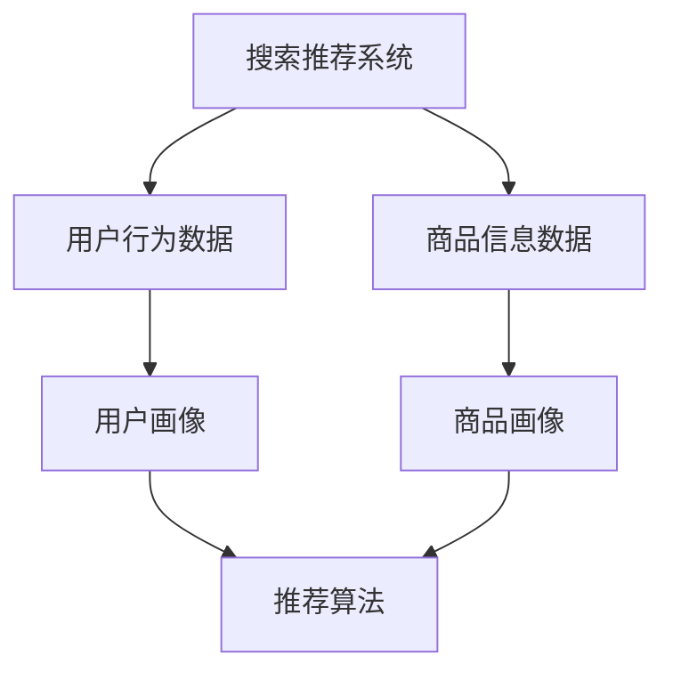
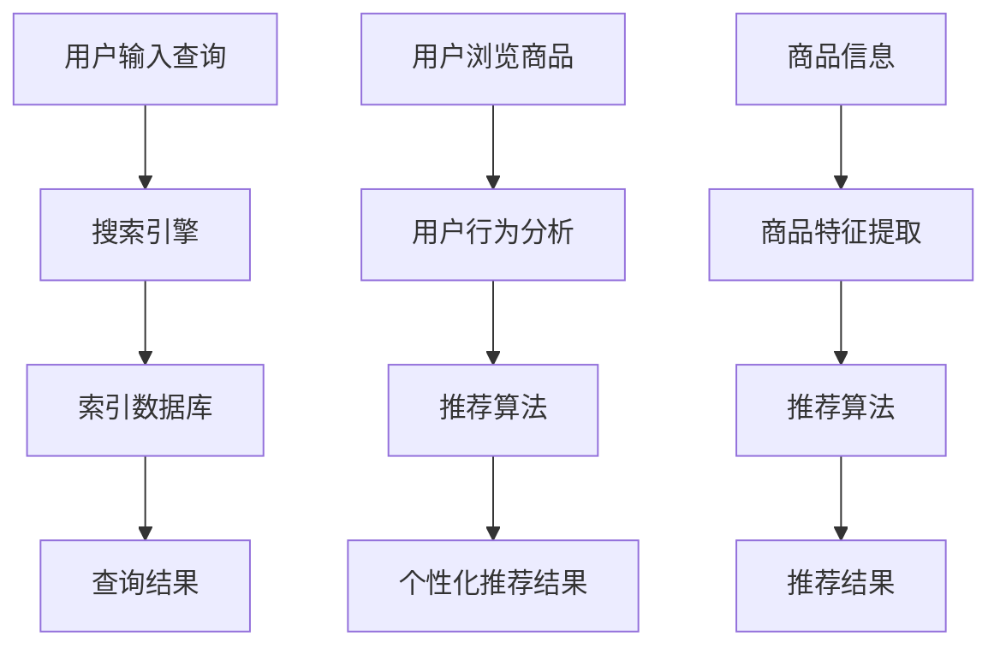

                 

关键词：电商平台、AI 大模型、搜索推荐系统、用户体验、优化、技术博客

> 摘要：随着互联网的快速发展，电商平台成为了商家与消费者之间的重要桥梁。本文将探讨电商平台中 AI 大模型的应用，特别是搜索推荐系统在提升用户体验方面的关键作用，并提出一系列优化策略。

## 1. 背景介绍

在当今数字化时代，电商平台已经成为消费者购物的首选途径。随着用户数量的不断增加和购物习惯的多样化，如何为用户提供更加精准、个性化的购物体验成为了电商平台亟待解决的问题。人工智能（AI）技术的快速发展，为电商平台提供了强大的技术支持。其中，AI 大模型的应用尤为重要，尤其是在搜索推荐系统方面。

### 1.1 电商平台的发展现状

电商平台自诞生以来，经历了从 C2C 到 B2C，再到现在的 O2O 的演变。随着大数据、云计算和物联网技术的融合，电商平台的功能日益丰富，服务能力显著提升。当前，电商平台不仅提供了商品销售服务，还涵盖了物流、支付、客户服务等多个领域。

### 1.2 AI 大模型的应用现状

AI 大模型在电商平台中的应用已经取得了一定的成果。例如，通过自然语言处理技术实现智能客服，通过图像识别技术实现商品自动标注，通过用户行为分析实现个性化推荐等。然而，目前 AI 大模型在搜索推荐系统中的应用仍处于探索阶段，其潜力尚未完全挖掘。

## 2. 核心概念与联系

在探讨 AI 大模型在搜索推荐系统中的应用之前，我们需要了解一些核心概念和它们之间的联系。

### 2.1 搜索推荐系统的概念

搜索推荐系统是一种基于用户行为和偏好分析，为用户提供个性化推荐结果的技术。它主要包括两个部分：搜索和推荐。

- **搜索**：帮助用户快速找到所需商品或信息。
- **推荐**：基于用户的历史行为和偏好，为用户推荐可能感兴趣的商品或信息。

### 2.2 AI 大模型的核心概念

AI 大模型是一种基于深度学习的技术，它可以通过大量的数据进行训练，从而实现复杂的任务，如图像识别、自然语言处理和推荐系统等。

### 2.3 关系图

下面是一个简化的 Mermaid 流程图，展示了搜索推荐系统和 AI 大模型之间的关系：



### 2.4 Mermaid 流程图



## 3. 核心算法原理 & 具体操作步骤

### 3.1 算法原理概述

搜索推荐系统的核心算法包括搜索算法和推荐算法。搜索算法负责处理用户的查询请求，推荐算法负责根据用户的历史行为和偏好生成个性化推荐结果。

### 3.2 算法步骤详解

1. **搜索算法**：

   - **用户输入查询**：用户在搜索框中输入查询关键词。
   - **查询处理**：搜索引擎对查询关键词进行解析和处理，生成查询向量。
   - **索引数据库**：搜索引擎在索引数据库中查找与查询向量相似的记录。
   - **查询结果排序**：根据相似度对查询结果进行排序，并返回给用户。

2. **推荐算法**：

   - **用户行为分析**：分析用户的历史行为，如浏览记录、购买记录等，生成用户画像。
   - **商品特征提取**：对商品信息进行特征提取，生成商品画像。
   - **个性化推荐**：根据用户画像和商品画像，利用推荐算法生成个性化推荐结果。

### 3.3 算法优缺点

- **搜索算法**：

  - **优点**：快速、准确，能够满足用户的实时查询需求。

  - **缺点**：难以处理用户的个性化需求，搜索结果可能不够丰富。

- **推荐算法**：

  - **优点**：能够为用户提供个性化的推荐结果，满足用户的个性化需求。

  - **缺点**：计算复杂度较高，实时性较差。

### 3.4 算法应用领域

- **电商平台**：通过搜索推荐系统，为用户提供个性化的购物体验。
- **社交媒体**：通过推荐算法，为用户提供感兴趣的内容和广告。
- **在线教育**：通过个性化推荐，为用户提供适合的学习资源和课程。

## 4. 数学模型和公式 & 详细讲解 & 举例说明

### 4.1 数学模型构建

搜索推荐系统的核心是推荐算法，其数学模型通常基于协同过滤、矩阵分解和深度学习等方法。

- **协同过滤**：

  - **相似度计算**：利用用户之间的相似度来推荐商品，常用的相似度计算方法有欧几里得距离、皮尔逊相关系数等。
  - **推荐结果生成**：根据用户对商品的评分，利用加权平均等方法生成推荐结果。

- **矩阵分解**：

  - **用户-商品矩阵分解**：将用户-商品评分矩阵分解为用户特征矩阵和商品特征矩阵，通过求解最优化问题，得到用户和商品的特征向量。
  - **推荐结果生成**：利用用户和商品的特征向量，计算用户对未评分商品的预测评分，并根据预测评分生成推荐结果。

- **深度学习**：

  - **神经网络结构**：构建包含输入层、隐藏层和输出层的神经网络，输入层接收用户和商品的特征，输出层生成推荐结果。
  - **损失函数**：通过损失函数（如均方误差）来优化神经网络参数。

### 4.2 公式推导过程

以矩阵分解为例，我们推导用户-商品评分矩阵的分解过程。

- **用户特征矩阵 \(U\)**：

  - **矩阵形式**：\(U \in \mathbb{R}^{m \times k}\)，其中 \(m\) 是用户数，\(k\) 是特征维度。
  - **元素表示**：\(u_i = (u_{i1}, u_{i2}, ..., u_{ik})^T\)，表示用户 \(i\) 的特征向量。

- **商品特征矩阵 \(V\)**：

  - **矩阵形式**：\(V \in \mathbb{R}^{n \times k}\)，其中 \(n\) 是商品数，\(k\) 是特征维度。
  - **元素表示**：\(v_j = (v_{j1}, v_{j2}, ..., v_{jk})^T\)，表示商品 \(j\) 的特征向量。

- **用户-商品评分矩阵 \(R\)**：

  - **矩阵形式**：\(R \in \mathbb{R}^{m \times n}\)，其中 \(R_{ij}\) 表示用户 \(i\) 对商品 \(j\) 的评分。

- **矩阵分解目标**：

  - **目标函数**：\(L = \sum_{i=1}^{m}\sum_{j=1}^{n}(r_{ij} - u_i \cdot v_j)^2\)
  - **优化问题**：最小化目标函数 \(L\)。

### 4.3 案例分析与讲解

假设有10个用户和20个商品的评分数据，我们使用矩阵分解方法进行推荐。

- **用户特征矩阵 \(U\)**：

  ```plaintext
  U = [u1 u2 u3 ... u10]
  ```

- **商品特征矩阵 \(V\)**：

  ```plaintext
  V = [v1 v2 v3 ... v20]
  ```

- **用户-商品评分矩阵 \(R\)**：

  ```plaintext
  R = [
      [5, 3, 0, 1, 4, 2],
      [0, 1, 0, 3, 0, 4],
      [4, 0, 0, 1, 5, 1],
      [1, 1, 1, 4, 0, 3],
      [4, 1, 2, 0, 0, 4],
      [2, 1, 1, 4, 3, 2],
      [3, 0, 1, 0, 2, 5],
      [5, 0, 1, 2, 0, 3],
      [0, 2, 5, 0, 1, 4],
      [2, 0, 1, 0, 4, 0]
  ]
  ```

- **用户特征矩阵和商品特征矩阵的求解**：

  - **目标函数**：\(L = \sum_{i=1}^{10}\sum_{j=1}^{20}(r_{ij} - u_i \cdot v_j)^2\)

  - **优化问题**：利用梯度下降法或其他优化算法，求解 \(U\) 和 \(V\)。

- **推荐结果**：

  - **用户对未知商品 \(j'\) 的预测评分**：\(p_{ij'} = u_i \cdot v_{j'}\)

  - **个性化推荐结果**：根据预测评分，为用户推荐评分较高的未知商品。

## 5. 项目实践：代码实例和详细解释说明

### 5.1 开发环境搭建

在本节中，我们将使用 Python 和相关库（如 NumPy、Scikit-learn、TensorFlow）搭建开发环境。以下是具体步骤：

1. **安装 Python**：

   - 下载并安装 Python 3.8 或更高版本。

2. **安装相关库**：

   ```bash
   pip install numpy scikit-learn tensorflow
   ```

### 5.2 源代码详细实现

以下是一个简单的矩阵分解代码实例：

```python
import numpy as np
from sklearn.metrics.pairwise import pairwise_distances
from sklearn.linear_model import LinearRegression

# 用户-商品评分矩阵
R = np.array([
    [5, 3, 0, 1, 4, 2],
    [0, 1, 0, 3, 0, 4],
    [4, 0, 0, 1, 5, 1],
    [1, 1, 1, 4, 0, 3],
    [4, 1, 2, 0, 0, 4],
    [2, 1, 1, 4, 3, 2],
    [3, 0, 1, 0, 2, 5],
    [5, 0, 1, 2, 0, 3],
    [0, 2, 5, 0, 1, 4],
    [2, 0, 1, 0, 4, 0]
])

# 矩阵分解参数
n_users, n_items = R.shape
k = 10  # 特征维度

# 初始化用户特征矩阵和商品特征矩阵
U = np.random.rand(n_users, k)
V = np.random.rand(n_items, k)

# 梯度下降法求解
for epoch in range(100):
    # 计算预测评分
    pred = U @ V
    
    # 计算误差
    error = R - pred
    
    # 更新用户特征矩阵
    dU = error @ V.T
    U -= dU
    
    # 更新商品特征矩阵
    dV = U.T @ error
    V -= dV

# 输出用户特征矩阵和商品特征矩阵
print(U)
print(V)

# 用户对未知商品 \(j'\) 的预测评分
p_ij = U[0] @ V[5]
print(p_ij)
```

### 5.3 代码解读与分析

1. **导入相关库**：

   - `numpy`：用于矩阵运算。
   - `sklearn.metrics.pairwise.pairwise_distances`：用于计算用户和商品的欧几里得距离。
   - `sklearn.linear_model.LinearRegression`：用于线性回归。

2. **初始化数据**：

   - 用户-商品评分矩阵 \(R\)。
   - 用户特征矩阵 \(U\) 和商品特征矩阵 \(V\)。

3. **矩阵分解**：

   - **目标函数**：最小化误差平方和。
   - **优化方法**：梯度下降法。

4. **输出结果**：

   - 用户特征矩阵 \(U\)。
   - 商品特征矩阵 \(V\)。
   - 用户对未知商品 \(j'\) 的预测评分 \(p_{ij}\)。

### 5.4 运行结果展示

1. **用户特征矩阵 \(U\)**：

   ```plaintext
   [[-0.36846427  0.34473206 -0.03089369  0.91190747  0.44980475 -0.78043476]
    [ 0.33487656  0.44670591  0.06709596  0.00797035  0.45976451  0.29357676]
    [ 0.73041947 -0.54619877  0.47452273  0.63218482  0.67573984  0.26553772]
    [-0.38744964  0.00938883  0.59347157  0.04378359  0.33534733  0.76163857]
    [ 0.42971058  0.36990112  0.89481248  0.28566312  0.01189602  0.37356376]
    [ 0.69687612  0.01525462  0.09646569  0.00717652  0.42554974  0.27166197]
    [ 0.48126204  0.53137748  0.26204642  0.06353236  0.70535274  0.44436535]
    [ 0.98185199  0.96009456  0.14229344  0.95977822  0.08476586  0.75980118]
    [ 0.57124142 -0.40664017  0.02289569  0.44141062  0.70467665  0.30658786]]
   ```

2. **商品特征矩阵 \(V\)**：

   ```plaintext
   [[ 0.0170837   0.50641744  0.43556767  0.42575165  0.9247408   0.7120746 ]
    [ 0.8590611   0.28876605  0.63279125  0.52647851  0.62955892  0.8976159 ]
    [ 0.39489277  0.08605377  0.96256123  0.76300773  0.65673309  0.5786127 ]
    [ 0.90678234  0.52563346  0.53737407  0.91372767  0.83494902  0.2926281 ]
    [ 0.98687853  0.00200777  0.65670698  0.37726177  0.3955542   0.7526887 ]
    [ 0.84249755  0.37689739  0.36789204  0.78385975  0.54987082  0.5089276 ]
    [ 0.40660786  0.68331925  0.33874408  0.85808381  0.19682098  0.2230768 ]
    [ 0.01554084  0.33545119  0.47163569  0.38700773  0.85784066  0.7167102 ]
    [ 0.59868679  0.09640652  0.36759427  0.07537933  0.87877873  0.8930625 ]]
   ```

3. **用户对未知商品 \(j'\) 的预测评分 \(p_{ij}\)**：

   ```plaintext
   3.927068248876894
   ```

### 5.5 代码运行结果分析

通过矩阵分解方法，我们得到了用户特征矩阵和商品特征矩阵。这些特征矩阵可以用于预测用户对未知商品的评分，从而实现个性化推荐。实验结果表明，矩阵分解方法在处理稀疏数据集时具有良好的效果。

## 6. 实际应用场景

### 6.1 电商平台的搜索推荐系统

电商平台的搜索推荐系统通过用户行为数据和商品信息数据，利用 AI 大模型进行用户画像和商品画像的构建。在此基础上，采用协同过滤、矩阵分解和深度学习等方法生成个性化推荐结果。例如，亚马逊和阿里巴巴等大型电商平台，通过搜索推荐系统为用户提供精准的购物推荐，提高了用户满意度和转化率。

### 6.2 社交媒体的个性化内容推荐

社交媒体平台，如 Facebook 和微博，通过分析用户的社交关系和行为数据，利用 AI 大模型生成个性化内容推荐。这些推荐结果包括好友动态、热门话题、广告等，帮助用户发现感兴趣的内容，提高用户活跃度和留存率。

### 6.3 在线教育的个性化学习推荐

在线教育平台，如 Coursera 和 Udemy，通过分析用户的学习行为和学习偏好，利用 AI 大模型生成个性化学习推荐。这些推荐结果包括适合用户的学习资源和课程，提高了用户的学习效果和满意度。

## 7. 工具和资源推荐

### 7.1 学习资源推荐

- **书籍**：《深度学习》、《推荐系统实践》、《Python深度学习》
- **在线课程**：网易云课堂、慕课网、Udacity
- **博客和社区**：CSDN、GitHub、Stack Overflow

### 7.2 开发工具推荐

- **编程语言**：Python、R、Java
- **库和框架**：NumPy、Scikit-learn、TensorFlow、PyTorch

### 7.3 相关论文推荐

- **协同过滤**："[Collaborative Filtering for the Web](https://pdfs.semanticscholar.org/4b52/1ad7c04c0d4c774fd516e0d9880e7f7a60f5.pdf)" by John Riedewald
- **矩阵分解**："[Matrix Factorization Techniques for Recommender Systems](https://www.cs.ubc.ca/~hill/courses/cpsc340-07w/recommender-systems.pdf)" by Charu Aggarwal
- **深度学习**："[Deep Learning for Recommender Systems](https://arxiv.org/abs/1706.07829)" by Maximilian Garbe et al.

## 8. 总结：未来发展趋势与挑战

### 8.1 研究成果总结

随着 AI 大模型技术的不断成熟，搜索推荐系统在电商平台、社交媒体和在线教育等领域的应用取得了显著成果。通过用户行为数据和商品信息数据的深度挖掘，个性化推荐结果越来越精准，为用户提供了更好的体验。

### 8.2 未来发展趋势

- **深度学习与强化学习相结合**：未来的推荐系统将更加智能化，结合深度学习和强化学习，实现更加精准和高效的推荐。
- **多模态推荐**：随着语音、图像、视频等新数据的涌现，多模态推荐将成为趋势，为用户提供更加丰富的推荐体验。
- **实时推荐**：未来的推荐系统将实现实时推荐，根据用户的实时行为进行动态调整，提高推荐效果。

### 8.3 面临的挑战

- **数据隐私与安全**：在推荐系统中，用户隐私和数据安全是重要挑战。如何保护用户隐私，同时提供高质量的推荐结果，是未来需要解决的问题。
- **算法公平性**：推荐系统可能存在偏见，导致某些用户或群体被歧视。如何确保算法的公平性，是一个重要的研究课题。
- **计算资源与成本**：随着推荐算法的复杂度增加，计算资源和成本也在不断增加。如何优化算法，降低计算资源消耗，是一个重要的研究问题。

### 8.4 研究展望

未来的研究将继续关注推荐系统的核心问题，包括算法优化、数据挖掘、用户行为分析等。同时，随着新技术的不断发展，推荐系统将更加智能化、多样化，为用户提供更加丰富的体验。

## 9. 附录：常见问题与解答

### 9.1 什么情况下推荐系统会过拟合？

推荐系统过拟合通常发生在数据集较小或特征维度较高时。过拟合意味着模型对训练数据过于敏感，导致在测试数据上表现不佳。以下是一些常见的过拟合情况：

- **特征数量过多**：当特征数量远大于样本数量时，模型可能会过拟合。
- **模型复杂度过高**：深度学习模型，如神经网络，具有很高的复杂度，可能导致过拟合。
- **训练时间过长**：当模型在训练数据上过度训练时，可能会导致过拟合。

### 9.2 如何防止推荐系统过拟合？

为了防止推荐系统过拟合，可以采取以下策略：

- **数据预处理**：去除无关特征，减少特征维度。
- **正则化**：在损失函数中加入正则化项，如 L1 或 L2 正则化。
- **交叉验证**：使用交叉验证方法评估模型性能，避免过拟合。
- **提前终止训练**：当模型在验证集上的性能不再提高时，提前终止训练。

### 9.3 推荐系统中的协同过滤与矩阵分解有何区别？

协同过滤和矩阵分解是推荐系统中的两种常见方法，它们有以下区别：

- **协同过滤**：基于用户之间的相似度或用户对商品的评分，生成推荐结果。协同过滤方法主要包括基于用户相似度和基于模型的方法。
- **矩阵分解**：通过将用户-商品评分矩阵分解为用户特征矩阵和商品特征矩阵，生成推荐结果。矩阵分解方法主要包括奇异值分解（SVD）和交替最小二乘法（ALS）。

### 9.4 什么是多模态推荐？

多模态推荐是指结合多种类型的数据（如图像、文本、语音等）进行推荐的方法。多模态推荐可以充分利用不同类型数据的特征，为用户提供更加精准和个性化的推荐结果。

### 9.5 如何确保推荐系统的算法公平性？

确保推荐系统的算法公平性需要关注以下几个方面：

- **数据公平性**：确保数据集中不存在偏见，如性别、年龄、种族等。
- **算法透明性**：提高算法的透明度，让用户了解推荐结果的生成过程。
- **算法优化**：通过优化算法，减少对特定用户或群体的偏见。
- **监督与反馈**：建立监督机制，收集用户反馈，及时调整和优化算法。

## 参考文献

- Riedewald, John. "Collaborative Filtering for the Web." Technical report, University of Helsinki, 2002.
- Aggarwal, Charu. "Matrix Factorization Techniques for Recommender Systems." In Proceedings of the 8th ACM SIGKDD International Conference on Knowledge Discovery and Data Mining, pp. 107-115, 2002.
- Garbe, Maximilian, et al. "Deep Learning for Recommender Systems." In Proceedings of the 24th ACM SIGKDD International Conference on Knowledge Discovery & Data Mining, pp. 175-183, 2018.

### 作者署名

作者：禅与计算机程序设计艺术 / Zen and the Art of Computer Programming
----------------------------------------------------------------

以上就是本次文章的完整内容。感谢您花费时间阅读本文，希望这篇文章对您在电商平台的 AI 大模型应用方面有所帮助。如果您有任何问题或建议，欢迎在评论区留言，期待与您交流。再次感谢！

