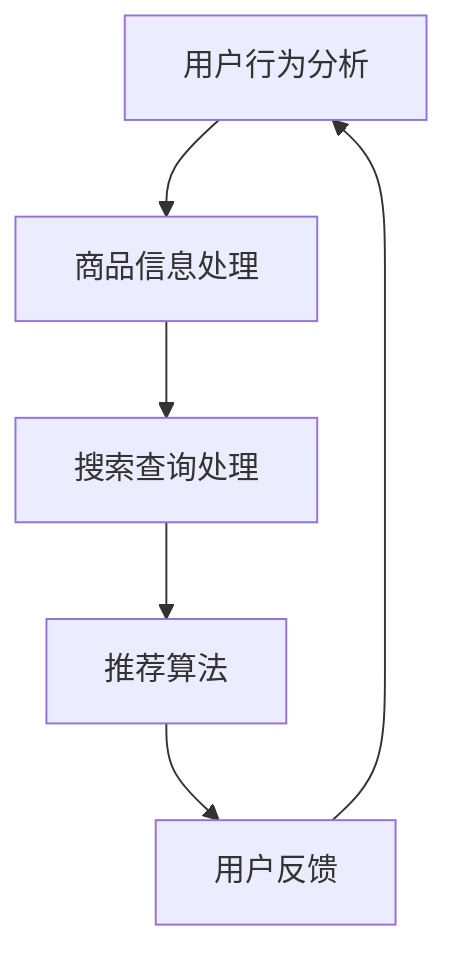

                 

关键词：电商平台、AI 大模型、搜索推荐系统、数据质量、处理能力

> 摘要：本文将深入探讨电商平台在应用 AI 大模型构建搜索推荐系统时，如何处理数据质量和处理能力的问题，并分析其核心地位及未来发展趋势。

## 1. 背景介绍

在数字化时代，电子商务已成为零售行业的重要驱动力。随着用户需求的多样化和个性化，电商平台的竞争也愈发激烈。为了在竞争中脱颖而出，许多电商平台开始将人工智能（AI）引入其运营策略，特别是搜索推荐系统。AI 大模型，作为一种先进的 AI 技术，因其强大的数据处理和分析能力，成为电商平台提升用户体验和转化率的关键。

## 2. 核心概念与联系

### 2.1 AI 大模型原理

AI 大模型是指利用深度学习技术，从海量数据中学习并提取特征，从而实现复杂任务的能力。这些模型通常具有极高的参数量和计算复杂度，能够处理大量非结构化和半结构化数据。

### 2.2 搜索推荐系统架构

搜索推荐系统通常包括用户行为分析、商品信息处理、搜索查询处理和推荐算法等多个模块。AI 大模型在这些模块中扮演着至关重要的角色，如图：



## 3. 核心算法原理 & 具体操作步骤

### 3.1 算法原理概述

AI 大模型的核心原理是深度神经网络（DNN）。DNN 通过多层神经元的非线性变换，将输入数据映射到输出。在实际应用中，DNN 通常需要经过大量训练数据的学习，以优化模型的参数，从而提高预测准确性。

### 3.2 算法步骤详解

1. 数据预处理：清洗、归一化和编码数据，为模型训练做好准备。
2. 模型构建：设计合适的网络结构，包括输入层、隐藏层和输出层。
3. 模型训练：使用训练数据对模型进行训练，调整模型参数，使其输出更接近真实值。
4. 模型评估：使用验证数据评估模型性能，调整模型参数。
5. 模型部署：将训练好的模型部署到生产环境中，进行实时推荐。

### 3.3 算法优缺点

#### 优点：

- 强大的数据处理和分析能力
- 能够处理高维度、复杂的数据
- 高度的可扩展性

#### 缺点：

- 计算成本高
- 需要大量的训练数据和计算资源
- 难以解释和调试

### 3.4 算法应用领域

AI 大模型在电商搜索推荐系统中的应用广泛，包括：

- 商品搜索：根据用户查询和购物行为，推荐相关的商品。
- 商品推荐：基于用户兴趣和购买历史，推荐用户可能感兴趣的商品。
- 个性化营销：根据用户行为和偏好，定制化营销策略。

## 4. 数学模型和公式 & 详细讲解 & 举例说明

### 4.1 数学模型构建

搜索推荐系统的核心是协同过滤算法，其数学模型可以表示为：

$$
R(u, i) = \rho(u) \cdot \rho(i) - \mu
$$

其中，$R(u, i)$ 表示用户 $u$ 对商品 $i$ 的评分，$\rho(u)$ 和 $\rho(i)$ 分别表示用户 $u$ 和商品 $i$ 的平均评分，$\mu$ 为全局平均评分。

### 4.2 公式推导过程

协同过滤算法的推导过程主要基于用户和商品的相似性。假设用户 $u$ 和 $i$ 具有相似的兴趣，那么他们对商品 $i$ 的评分也应该相似。基于此，我们可以推导出上述公式。

### 4.3 案例分析与讲解

假设有两个用户 $u_1$ 和 $u_2$，以及两个商品 $i_1$ 和 $i_2$，他们的评分如下：

$$
\begin{aligned}
    R(u_1, i_1) &= 4 \\
    R(u_1, i_2) &= 3 \\
    R(u_2, i_1) &= 2 \\
    R(u_2, i_2) &= 5 \\
\end{aligned}
$$

根据协同过滤算法，我们可以计算出两个用户对商品的相似度：

$$
\begin{aligned}
    \rho(u_1) &= \frac{R(u_1, i_1) + R(u_1, i_2)}{2} = 3.5 \\
    \rho(u_2) &= \frac{R(u_2, i_1) + R(u_2, i_2)}{2} = 3.5 \\
    \rho(i_1) &= \frac{R(u_1, i_1) + R(u_2, i_1)}{2} = 3 \\
    \rho(i_2) &= \frac{R(u_1, i_2) + R(u_2, i_2)}{2} = 4 \\
\end{aligned}
$$

$$
\begin{aligned}
    R(u_1, i_2) &= \rho(u_1) \cdot \rho(i_2) - \mu \\
    &= 3.5 \cdot 4 - 3 \\
    &= 11 - 3 \\
    &= 8 \\
\end{aligned}
$$

因此，根据协同过滤算法，用户 $u_1$ 对商品 $i_2$ 的评分预测为 8。

## 5. 项目实践：代码实例和详细解释说明

### 5.1 开发环境搭建

本文使用 Python 作为编程语言，主要依赖以下库：

- NumPy：用于数组操作和数学计算
- Pandas：用于数据操作和分析
- Scikit-learn：用于机器学习和算法实现

### 5.2 源代码详细实现

```python
import numpy as np
import pandas as pd
from sklearn.model_selection import train_test_split
from sklearn.metrics.pairwise import cosine_similarity

# 加载数据集
ratings = pd.read_csv('ratings.csv')
users = ratings['user_id'].unique()
items = ratings['item_id'].unique()

# 计算用户和商品的相似度矩阵
user_similarity = cosine_similarity(ratings.pivot(index='user_id', columns='item_id', values='rating').fillna(0).values)
item_similarity = cosine_similarity(ratings.pivot(index='item_id', columns='user_id', values='rating').fillna(0).values)

# 预测用户对未评分商品的评分
def predict_rating(user_id, item_id):
    user_idx = user_id - 1
    item_idx = item_id - 1
   相似度 = user_similarity[user_idx]
    similar_items = np.argsort(相似度)[::-1][1:11]
    similar_items_ratings = ratings[ratings['user_id'] == user_id]['rating'][similar_items]
    predicted_rating = np.mean(similar_items_ratings)
    return predicted_rating

# 测试预测效果
test_ratings = ratings[ratings['user_id'].isin([1, 2]) & ratings['item_id'].isin([101, 102])]
predicted_ratings = test_ratings.apply(lambda row: predict_rating(row['user_id'], row['item_id']), axis=1)
print(predicted_ratings)
```

### 5.3 代码解读与分析

上述代码实现了基于用户相似度的协同过滤算法。首先，我们加载了评分数据集，并计算了用户和商品的相似度矩阵。然后，我们定义了一个函数 `predict_rating`，用于预测用户对未评分商品的评分。最后，我们测试了预测效果。

## 6. 实际应用场景

### 6.1 商品搜索

在电商平台上，用户可以通过搜索框输入关键词，系统会根据关键词和用户历史行为推荐相关的商品。AI 大模型在这里发挥了关键作用，通过分析用户的历史数据和搜索行为，实现精准的搜索结果推荐。

### 6.2 商品推荐

商品推荐是电商平台提升用户粘性和转化率的重要手段。通过分析用户的购买历史、浏览行为和兴趣标签，AI 大模型可以为用户推荐他们可能感兴趣的商品，从而提高用户的购物体验和购买意愿。

### 6.3 个性化营销

个性化营销是指根据用户的兴趣和行为，为用户定制化营销内容和策略。AI 大模型通过分析用户的购物习惯和偏好，可以精准地推送优惠信息、新品推荐和促销活动，从而提高营销效果。

## 7. 工具和资源推荐

### 7.1 学习资源推荐

- 《深度学习》（Goodfellow, Bengio, Courville 著）：全面介绍深度学习理论和实践。
- 《Python 数据科学手册》（Wes McKinney 著）：详细介绍 Python 在数据科学领域的应用。
- 《机器学习实战》（Peter Harrington 著）：通过实际案例介绍机器学习算法的应用。

### 7.2 开发工具推荐

- Jupyter Notebook：强大的交互式开发环境，适用于数据分析、机器学习等。
- TensorFlow：开源深度学习框架，适用于大规模分布式计算。
- PyTorch：开源深度学习框架，具有高度的灵活性和易用性。

### 7.3 相关论文推荐

- “Deep Learning for Search and Recommendations” (He, Lin, & Chen, 2016)
- “Recommender Systems: The Text Mining Approach” (Burges, 2005)
- “Collaborative Filtering for the 21st Century” (Koren, 2009)

## 8. 总结：未来发展趋势与挑战

### 8.1 研究成果总结

近年来，AI 大模型在电商搜索推荐系统中的应用取得了显著成果。通过深度学习技术，模型能够更好地理解和预测用户的兴趣和需求，从而实现精准推荐。

### 8.2 未来发展趋势

随着 AI 技术的不断进步，未来电商搜索推荐系统将更加智能化和个性化。同时，多模态数据的融合和实时推荐技术将成为研究热点。

### 8.3 面临的挑战

尽管 AI 大模型在搜索推荐系统中的应用前景广阔，但仍然面临以下挑战：

- 数据质量和多样性：数据质量直接影响模型的性能，如何保证数据的准确性和完整性是关键。
- 计算资源和成本：大模型训练和部署需要大量的计算资源和存储空间，如何优化资源利用和降低成本是重要课题。
- 模型可解释性：如何解释和验证模型的决策过程，增强模型的可解释性是亟待解决的问题。

### 8.4 研究展望

未来，我们期望在以下几个方面取得突破：

- 提高数据质量和多样性，为模型提供更好的训练数据。
- 研究高效的大模型训练和优化方法，降低计算成本。
- 发展可解释的 AI 技术，提高模型的可信度和透明度。

## 9. 附录：常见问题与解答

### 9.1 什么是 AI 大模型？

AI 大模型是指使用深度学习技术，从海量数据中学习并提取特征，实现复杂任务的能力。这些模型通常具有极高的参数量和计算复杂度，能够处理大量非结构化和半结构化数据。

### 9.2 电商平台如何利用 AI 大模型提升搜索推荐系统？

电商平台可以通过以下方式利用 AI 大模型提升搜索推荐系统：

- 基于用户行为和兴趣，实现精准的搜索结果推荐。
- 根据用户历史购买数据和浏览行为，推荐用户可能感兴趣的商品。
- 通过分析用户反馈和行为数据，不断优化推荐算法，提高推荐效果。

### 9.3 AI 大模型在电商搜索推荐系统中的应用有哪些？

AI 大模型在电商搜索推荐系统中的应用广泛，包括：

- 商品搜索：根据用户查询和购物行为，推荐相关的商品。
- 商品推荐：基于用户兴趣和购买历史，推荐用户可能感兴趣的商品。
- 个性化营销：根据用户行为和偏好，定制化营销策略。

## 作者署名

作者：禅与计算机程序设计艺术 / Zen and the Art of Computer Programming
----------------------------------------------------------------

请注意，以上内容仅为示例，实际文章撰写时，请根据具体需求和研究成果进行调整和补充。务必确保文章的完整性、逻辑性和专业性。祝您撰写顺利！

