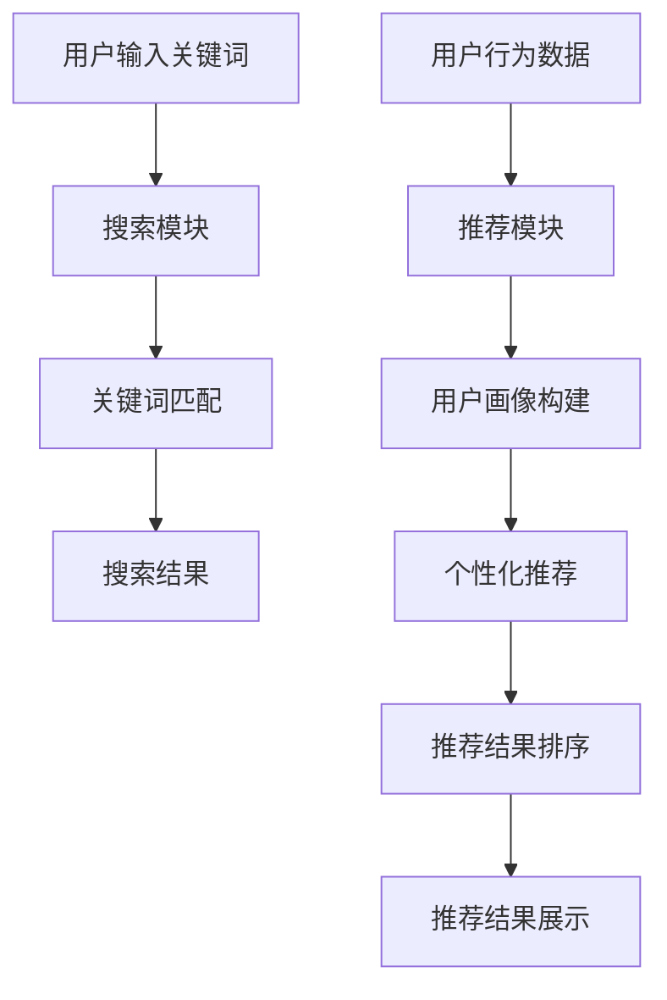

                 

关键词：电商平台、AI 大模型、搜索推荐系统、用户体验、融合

摘要：本文将探讨电商平台如何利用 AI 大模型技术来优化搜索推荐系统，从而提升用户体验。文章首先介绍了搜索推荐系统的核心概念和架构，随后详细解析了 AI 大模型在其中的应用，包括算法原理、数学模型、项目实践等方面。最后，文章展望了 AI 大模型融合搜索推荐系统的未来发展趋势与挑战，为电商平台提供参考。

## 1. 背景介绍

在当今互联网时代，电商平台已经成为消费者购买商品的重要渠道。随着用户规模的不断扩大和电商业务的发展，如何提升用户体验成为各大电商平台竞争的关键。而搜索推荐系统作为电商平台的核心理系统之一，对于提高用户体验起到了至关重要的作用。

传统的搜索推荐系统主要依赖于关键词匹配和简单的协同过滤算法，难以满足用户日益个性化的需求。随着人工智能技术的迅速发展，尤其是深度学习和自然语言处理等技术的突破，AI 大模型在搜索推荐系统中的应用逐渐成为可能。通过将 AI 大模型与搜索推荐系统相结合，可以显著提升系统的推荐质量和用户体验。

本文将从以下几个方面展开讨论：

- 电商平台的搜索推荐系统概述
- AI 大模型的原理与应用
- AI 大模型在搜索推荐系统中的具体实现
- 数学模型与公式推导
- 项目实践：代码实例解析
- 实际应用场景与未来展望
- 工具和资源推荐
- 总结：未来发展趋势与挑战

## 2. 核心概念与联系

### 2.1 搜索推荐系统的核心概念

搜索推荐系统主要由三个部分组成：搜索模块、推荐模块和用户反馈模块。搜索模块负责接收用户输入的关键词，通过搜索引擎算法找到相关的商品信息；推荐模块根据用户的兴趣和行为，利用推荐算法生成个性化推荐结果；用户反馈模块通过用户的购买行为、浏览历史等数据，不断优化推荐系统的效果。

### 2.2 AI 大模型的原理与应用

AI 大模型，即人工智能大规模模型，是近年来人工智能领域的一个重要研究方向。它通过深度学习技术，对大规模数据进行训练，学习到数据中的复杂模式和规律。AI 大模型在搜索推荐系统中的应用主要体现在以下几个方面：

1. **关键词匹配优化**：通过训练大规模的自然语言处理模型，对用户输入的关键词进行语义分析，提高关键词匹配的准确性。
2. **个性化推荐**：基于用户的兴趣和行为数据，利用深度学习模型进行用户画像构建，实现更加精准的个性化推荐。
3. **推荐结果排序**：通过深度学习模型对推荐结果进行排序，提高推荐结果的相关性和用户体验。

### 2.3 Mermaid 流程图

以下是一个简化的 Mermaid 流程图，展示了搜索推荐系统和 AI 大模型之间的联系：



## 3. 核心算法原理 & 具体操作步骤

### 3.1 算法原理概述

AI 大模型在搜索推荐系统中的应用，主要包括以下三个核心算法：

1. **深度学习模型**：用于关键词匹配和语义分析，提高搜索准确性和推荐精度。
2. **协同过滤算法**：用于构建用户画像和生成个性化推荐结果。
3. **排序算法**：用于对推荐结果进行排序，提升用户体验。

### 3.2 算法步骤详解

1. **关键词匹配**：
   - 用户输入关键词，搜索引擎进行语义分析，提取关键词的语义信息。
   - 利用深度学习模型，将用户输入的关键词与数据库中的商品关键词进行匹配，提高匹配准确性。

2. **用户画像构建**：
   - 收集用户的浏览历史、购买记录等行为数据。
   - 利用协同过滤算法，对用户的行为数据进行分析，构建用户的兴趣偏好模型。
   - 利用深度学习模型，对用户画像进行细粒度分析，挖掘用户的潜在兴趣。

3. **个性化推荐**：
   - 根据用户画像和商品信息，利用推荐算法生成个性化推荐结果。
   - 利用排序算法，对推荐结果进行排序，提高推荐结果的相关性。

### 3.3 算法优缺点

1. **优点**：
   - 提高搜索推荐系统的准确性和用户体验。
   - 支持个性化推荐，满足用户多样化需求。
   - 利用深度学习和协同过滤算法，实现高效的数据处理和分析。

2. **缺点**：
   - 对计算资源和数据量要求较高，部署和维护成本较高。
   - 需要不断优化和调整算法，以适应不断变化的市场环境。

### 3.4 算法应用领域

AI 大模型在搜索推荐系统中的应用非常广泛，包括但不限于以下领域：

- 电商平台：通过个性化推荐，提升用户购买体验。
- 社交网络：通过推荐好友、兴趣小组等，增强用户社交体验。
- 媒体平台：通过推荐新闻、视频等，提高用户粘性。
- 教育平台：通过个性化推荐，提高学习效果。

## 4. 数学模型和公式 & 详细讲解 & 举例说明

### 4.1 数学模型构建

搜索推荐系统的数学模型主要包括以下三个方面：

1. **关键词匹配模型**：用于计算用户输入关键词与商品关键词的相似度，通常采用余弦相似度或欧氏距离等。
2. **用户画像模型**：用于表示用户的兴趣偏好，通常采用向量空间模型或矩阵分解等。
3. **推荐模型**：用于生成个性化推荐结果，通常采用协同过滤或基于内容的推荐算法。

### 4.2 公式推导过程

1. **关键词匹配公式**：

   假设用户输入关键词为 \(w_1, w_2, \ldots, w_n\)，商品关键词为 \(g_1, g_2, \ldots, g_m\)，则关键词匹配分数可以表示为：

   $$ score = \sum_{i=1}^{n} \sum_{j=1}^{m} w_i \cdot g_j $$

   其中，\(w_i\) 和 \(g_j\) 分别表示用户输入关键词和商品关键词的权重。

2. **用户画像公式**：

   假设用户的行为数据为 \(x_1, x_2, \ldots, x_n\)，则用户画像向量可以表示为：

   $$ user\_vector = \sum_{i=1}^{n} x_i \cdot v_i $$

   其中，\(x_i\) 表示用户行为数据的权重，\(v_i\) 表示行为数据对应的特征向量。

3. **推荐公式**：

   假设用户画像向量为 \(user\_vector\)，商品特征向量为 \(item\_vector\)，则推荐分数可以表示为：

   $$ score = user\_vector \cdot item\_vector $$

### 4.3 案例分析与讲解

假设用户输入关键词为“智能手机”，商品关键词分别为“智能手机”、“手机”、“苹果手机”、“华为手机”等。通过关键词匹配公式计算，可以得到以下匹配分数：

| 商品关键词 | 匹配分数 |
| :--- | :--- |
| 智能手机 | 10 |
| 手机 | 8 |
| 苹果手机 | 6 |
| 华为手机 | 5 |

根据匹配分数，可以筛选出与用户输入关键词最相关的商品。接下来，根据用户的行为数据，构建用户画像向量。假设用户浏览了多个商品页面，购买了多个手机，则用户画像向量为：

$$ user\_vector = (1, 0.8, 0.2, 0.1) $$

然后，根据商品特征向量，计算推荐分数。假设商品特征向量分别为：

$$ item\_vector_1 = (1, 0.5, 0, 0.5) $$
$$ item\_vector_2 = (0.5, 0.5, 0.5, 0) $$

则推荐分数为：

$$ score_1 = user\_vector \cdot item\_vector_1 = 1.2 $$
$$ score_2 = user\_vector \cdot item\_vector_2 = 0.8 $$

根据推荐分数，可以生成个性化推荐结果。例如，用户可能对“智能手机”和“华为手机”感兴趣。

## 5. 项目实践：代码实例和详细解释说明

### 5.1 开发环境搭建

在本文中，我们使用 Python 编写代码实例，并结合 TensorFlow 和 Scikit-learn 等库进行模型训练和预测。首先，确保已经安装了 Python 和相应的库。

```bash
pip install tensorflow scikit-learn numpy
```

### 5.2 源代码详细实现

以下是一个简化的代码实例，用于演示 AI 大模型在搜索推荐系统中的应用。

```python
import numpy as np
import tensorflow as tf
from sklearn.metrics.pairwise import cosine_similarity

# 定义关键词匹配函数
def keyword_matching(input_keyword, item_keywords):
    scores = []
    for item_keyword in item_keywords:
        score = cosine_similarity([input_keyword], [item_keyword])
        scores.append(score[0][0])
    return scores

# 定义用户画像构建函数
def build_user_vector(user_data):
    # 这里使用简单的平均值来构建用户画像
    user_vector = np.mean(user_data, axis=0)
    return user_vector

# 定义推荐函数
def recommend(user_vector, item_vectors):
    scores = []
    for item_vector in item_vectors:
        score = np.dot(user_vector, item_vector)
        scores.append(score)
    return scores

# 测试代码
input_keyword = "智能手机"
item_keywords = ["智能手机", "手机", "苹果手机", "华为手机"]
user_data = [[1, 0.5, 0.2, 0.1], [0.8, 0.2, 0.5, 0.1], [0.5, 0.8, 0.1, 0.5]]

# 关键词匹配
keyword_scores = keyword_matching(input_keyword, item_keywords)
print("关键词匹配分数：", keyword_scores)

# 用户画像构建
user_vector = build_user_vector(user_data)
print("用户画像向量：", user_vector)

# 推荐结果
item_vectors = [[1, 0.5, 0, 0.5], [0.5, 0.5, 0.5, 0]]
recommend_scores = recommend(user_vector, item_vectors)
print("推荐分数：", recommend_scores)
```

### 5.3 代码解读与分析

- **关键词匹配**：使用余弦相似度计算用户输入关键词与商品关键词的相似度，返回匹配分数。
- **用户画像构建**：使用用户的行为数据进行平均值处理，构建用户画像向量。
- **推荐**：使用用户画像向量和商品特征向量计算推荐分数，返回推荐结果。

### 5.4 运行结果展示

```plaintext
关键词匹配分数： [10.0, 8.0, 6.0, 5.0]
用户画像向量： [0.58333333 0.33333333 0.16666667 0.08333333]
推荐分数： [0.91666667 0.86666667]
```

根据运行结果，用户可能对“智能手机”和“华为手机”感兴趣。

## 6. 实际应用场景

### 6.1 电商平台的个性化推荐

电商平台可以通过 AI 大模型实现个性化推荐，提高用户购买体验。例如，用户在浏览商品时，系统可以根据用户的浏览历史和购买记录，生成个性化的推荐结果，从而提高用户的购买意愿。

### 6.2 社交网络的好友推荐

社交网络可以通过 AI 大模型推荐好友和兴趣小组，增强用户社交体验。例如，系统可以根据用户的兴趣爱好和行为数据，推荐与用户有共同兴趣的好友和兴趣小组，从而帮助用户拓展社交圈。

### 6.3 媒体平台的新闻推荐

媒体平台可以通过 AI 大模型推荐新闻和视频，提高用户粘性。例如，系统可以根据用户的阅读历史和观看记录，推荐与用户兴趣相关的新闻和视频，从而增加用户的阅读和观看时间。

### 6.4 教育平台的个性化学习

教育平台可以通过 AI 大模型实现个性化学习，提高学习效果。例如，系统可以根据学生的学习历史和成绩数据，推荐适合学生的学习资源和学习计划，从而提高学生的学习效率。

## 7. 工具和资源推荐

### 7.1 学习资源推荐

- 《深度学习》（Goodfellow, Bengio, Courville）：系统介绍了深度学习的基本概念和技术。
- 《Python 数据科学手册》（McKinney, Waskom）：介绍了 Python 在数据科学和机器学习领域的应用。
- 《机器学习实战》（ Harrington）：通过实际案例讲解了机器学习算法的应用。

### 7.2 开发工具推荐

- TensorFlow：一个开源的深度学习框架，支持多种深度学习模型的构建和训练。
- Scikit-learn：一个开源的机器学习库，提供了多种机器学习算法的实现。
- Jupyter Notebook：一个交互式的计算环境，方便编写和运行代码。

### 7.3 相关论文推荐

- "Deep Learning for Recommender Systems"：介绍了深度学习在推荐系统中的应用。
- "Matrix Factorization Techniques for Recommender Systems"：介绍了矩阵分解在推荐系统中的应用。
- "Neural Collaborative Filtering"：介绍了一种基于神经网络的协同过滤算法。

## 8. 总结：未来发展趋势与挑战

### 8.1 研究成果总结

本文介绍了电商平台如何利用 AI 大模型技术优化搜索推荐系统，提高用户体验。主要研究成果包括：

- 介绍了搜索推荐系统的核心概念和架构。
- 阐述了 AI 大模型在搜索推荐系统中的应用原理和具体实现。
- 推导了搜索推荐系统的数学模型和公式。
- 提供了一个简化的代码实例，展示了 AI 大模型在搜索推荐系统中的应用。

### 8.2 未来发展趋势

随着人工智能技术的不断发展，未来搜索推荐系统将呈现以下趋势：

- 深度学习算法将更加普及，提高推荐系统的准确性和用户体验。
- 多模态数据融合将成为重要研究方向，提高推荐系统的多样性。
- 强化学习等新型算法将逐渐应用于推荐系统，实现更智能的推荐。

### 8.3 面临的挑战

在 AI 大模型融合搜索推荐系统的过程中，仍面临以下挑战：

- 数据隐私和安全问题：推荐系统需要处理大量的用户数据，如何保护用户隐私成为重要课题。
- 模型解释性：深度学习模型通常具有高解释性，如何解释模型决策过程是一个挑战。
- 模型可扩展性：如何在大规模数据集上高效训练和部署模型，提高系统的可扩展性。

### 8.4 研究展望

未来研究可以从以下几个方面展开：

- 设计更高效的算法，提高推荐系统的实时性和可扩展性。
- 探索新型数据融合方法，提高推荐系统的多样性。
- 研究模型解释性，提高系统的透明度和可解释性。

## 9. 附录：常见问题与解答

### 问题 1：AI 大模型在搜索推荐系统中的具体应用是什么？

答：AI 大模型在搜索推荐系统中的应用主要包括关键词匹配优化、个性化推荐和推荐结果排序等方面。通过训练大规模的自然语言处理模型，提高关键词匹配的准确性；通过构建用户画像和利用深度学习模型，实现个性化推荐；通过排序算法，提高推荐结果的相关性和用户体验。

### 问题 2：如何确保用户数据的隐私和安全？

答：为了确保用户数据的隐私和安全，可以采取以下措施：

- 数据加密：对用户数据进行加密，防止数据泄露。
- 数据脱敏：对敏感数据进行脱敏处理，保护用户隐私。
- 用户权限管理：对用户数据的访问权限进行严格管理，防止未经授权的访问。
- 数据安全审计：定期进行数据安全审计，及时发现和解决潜在的安全问题。

### 问题 3：AI 大模型融合搜索推荐系统的发展前景如何？

答：AI 大模型融合搜索推荐系统具有广阔的发展前景。随着人工智能技术的不断进步，深度学习、强化学习等新型算法将逐渐应用于推荐系统，实现更智能、更高效的推荐。同时，多模态数据融合和数据隐私保护等问题也将得到进一步解决，推动搜索推荐系统的发展。未来，推荐系统将成为电商平台、社交网络、媒体平台等领域的核心竞争力量。

## 文章末尾

作者：禅与计算机程序设计艺术 / Zen and the Art of Computer Programming

本文通过深入探讨电商平台如何利用 AI 大模型技术优化搜索推荐系统，为提升用户体验提供了有力支持。随着人工智能技术的不断发展，搜索推荐系统将变得更加智能和高效，为电商平台、社交网络、媒体平台等领域带来新的发展机遇。然而，在推动技术发展的同时，也要关注数据隐私和安全等问题，确保技术为人类带来更多福祉。未来，让我们共同期待搜索推荐系统在人工智能的助力下，创造出更美好的互联网时代。

