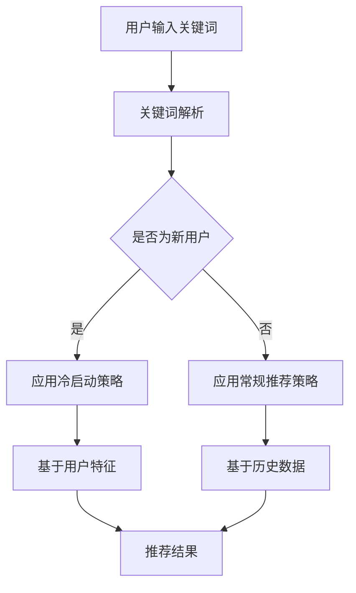

                 

关键词：电商平台，AI 大模型，搜索推荐系统，冷启动策略，技术转型

摘要：随着人工智能技术的飞速发展，电商平台正面临从传统商业模式向 AI 大模型驱动的全面转型。本文将重点探讨电商平台在搜索推荐系统方面的转型策略，尤其是冷启动策略的应用，以及其在推动平台增长、提高用户体验和提升竞争力方面的重要性。

## 1. 背景介绍

在过去的几十年中，电商平台依靠商品种类丰富、价格优势、便捷的购物体验等传统优势赢得了广大消费者的青睐。然而，随着市场环境的不断变化，用户需求的多样化和个性化，以及竞争对手的激烈角逐，电商平台开始意识到仅靠传统手段难以维持竞争优势。人工智能技术的兴起，尤其是深度学习和大数据分析等技术的快速发展，为电商平台带来了新的转型契机。

AI 大模型作为人工智能领域的重要研究方向，已经成为电商平台技术转型的重要推动力。大模型能够处理海量数据，提取有效信息，提供智能搜索和个性化推荐，从而提升用户体验，增加用户粘性，提高销售额。在这个过程中，搜索推荐系统是核心，而冷启动策略是关键。

## 2. 核心概念与联系

### 2.1 搜索推荐系统

搜索推荐系统是电商平台的核心组成部分，它旨在为用户提供个性化的商品搜索和推荐服务。其核心功能包括：

- **商品搜索**：通过用户输入的关键词，系统快速定位相关商品，并提供精准的搜索结果。
- **个性化推荐**：根据用户的浏览历史、购买记录、兴趣爱好等数据，系统为用户推荐可能感兴趣的商品。

### 2.2 冷启动策略

冷启动策略是针对新用户或新商品的推荐问题，旨在在用户或商品缺乏足够历史数据的情况下，快速、准确地为用户提供相关推荐。冷启动策略的关键在于如何在没有足够信息的情况下，通过有限的已知信息，预测用户兴趣和商品相关性。

### 2.3 Mermaid 流程图

以下是一个简化的搜索推荐系统和冷启动策略的 Mermaid 流程图：



## 3. 核心算法原理 & 具体操作步骤

### 3.1 算法原理概述

搜索推荐系统的核心算法包括：

- **关键词解析**：将用户输入的关键词转化为可以处理的形式。
- **用户特征提取**：根据用户的浏览历史、购买记录等数据，提取用户的特征。
- **商品特征提取**：根据商品的属性、标签等信息，提取商品的特征。
- **推荐算法**：利用用户和商品的特征，进行相似度计算，生成推荐结果。

冷启动策略的核心算法包括：

- **基于内容的推荐**：根据新商品的内容特征，推荐与之相似的其他商品。
- **协同过滤**：根据新用户的浏览和购买行为，推荐其他用户的兴趣商品。
- **基于社区的方法**：根据用户在社区中的行为和关系，推荐与用户兴趣相近的其他用户喜欢的商品。

### 3.2 算法步骤详解

#### 3.2.1 搜索推荐系统

1. **关键词解析**：将用户输入的关键词进行分词，提取关键词的关键词。
2. **用户特征提取**：根据用户的浏览历史、购买记录等数据，提取用户的兴趣特征。
3. **商品特征提取**：根据商品的属性、标签等信息，提取商品的特征。
4. **相似度计算**：利用用户和商品的特征，计算用户和商品之间的相似度。
5. **推荐结果生成**：根据相似度计算结果，生成推荐结果。

#### 3.2.2 冷启动策略

1. **基于内容的推荐**：分析新商品的内容特征，如商品的标题、描述、标签等，与其他商品进行比较，推荐与之相似的商品。
2. **协同过滤**：分析新用户的浏览和购买行为，找出与新用户兴趣相似的用户，推荐这些用户喜欢的商品。
3. **基于社区的方法**：分析新用户在社区中的行为和关系，找出与新用户兴趣相近的其他用户，推荐这些用户喜欢的商品。

### 3.3 算法优缺点

#### 3.3.1 搜索推荐系统的优点

- **精准性**：能够根据用户的兴趣和需求，提供个性化的推荐结果。
- **实时性**：能够快速响应用户的搜索请求，提供实时的推荐结果。

#### 3.3.1 搜索推荐系统的缺点

- **数据依赖性**：需要大量用户和商品的数据支持，对于新用户和新商品可能不够有效。
- **计算成本高**：复杂的算法和大量的数据处理，可能导致计算成本较高。

#### 3.3.2 冷启动策略的优点

- **适应性**：能够适应新用户和新商品的情况，提供初步的推荐结果。
- **多样性**：能够根据不同的推荐算法，提供多样化的推荐结果。

#### 3.3.2 冷启动策略的缺点

- **推荐效果有限**：在缺乏足够数据的情况下，推荐效果可能有限。
- **用户体验**：对于新用户可能需要一段时间才能适应平台的推荐机制。

### 3.4 算法应用领域

搜索推荐系统广泛应用于电商、新闻、视频、音乐等互联网领域。冷启动策略主要应用于新用户和新商品的情况，如电商平台的新用户推荐、新闻网站的未知用户推荐、音乐平台的未知歌曲推荐等。

## 4. 数学模型和公式 & 详细讲解 & 举例说明

### 4.1 数学模型构建

搜索推荐系统的数学模型主要包括：

- **用户-商品矩阵**：表示用户和商品之间的关系。
- **相似度计算公式**：用于计算用户和商品之间的相似度。
- **推荐算法公式**：用于生成推荐结果。

### 4.2 公式推导过程

以协同过滤算法为例，其相似度计算公式为：

$$
sim(u, v) = \frac{user\_ui \cdot user\_vj}{\|user\_ui\| \|user\_vj\|}
$$

其中，$user\_ui$ 和 $user\_vj$ 分别表示用户 $u$ 和 $v$ 在商品 $i$ 和 $j$ 上的评分，$\|user\_ui\|$ 和 $\|user\_vj\|$ 分别表示用户 $u$ 和 $v$ 的评分方差。

### 4.3 案例分析与讲解

假设有两个用户 $u$ 和 $v$，以及两个商品 $i$ 和 $j$。用户 $u$ 对商品 $i$ 给出了评分 4，对商品 $j$ 给出了评分 5；用户 $v$ 对商品 $i$ 给出了评分 3，对商品 $j$ 给出了评分 4。根据协同过滤算法的相似度计算公式，我们可以计算出用户 $u$ 和 $v$ 之间的相似度为：

$$
sim(u, v) = \frac{4 \cdot 4}{\sqrt{4^2 + 5^2} \cdot \sqrt{3^2 + 4^2}} \approx 0.913
$$

然后，我们可以利用相似度计算结果，生成推荐结果。例如，如果用户 $u$ 已经购买了商品 $i$，我们可以推荐用户 $v$ 可能感兴趣的商品 $j$。

## 5. 项目实践：代码实例和详细解释说明

### 5.1 开发环境搭建

在本项目中，我们将使用 Python 编写代码，并使用 scikit-learn 库实现协同过滤算法。首先，需要安装 Python 和 scikit-learn 库。可以使用以下命令进行安装：

```bash
pip install python
pip install scikit-learn
```

### 5.2 源代码详细实现

以下是协同过滤算法的实现代码：

```python
import numpy as np
from sklearn.metrics.pairwise import cosine_similarity

def collaborative_filter(ratings, k=5):
    """
    协同过滤算法实现。
    :param ratings: 用户-商品评分矩阵。
    :param k: 邻居数量。
    :return: 推荐结果。
    """
    # 计算用户之间的相似度
    sim = cosine_similarity(ratings)
    
    # 计算每个用户的邻居
    neighbors = []
    for i in range(sim.shape[0]):
        neighbor_indices = np.argsort(sim[i])[1:k+1]
        neighbors.append(neighbor_indices)
    
    # 生成推荐结果
    recommendations = []
    for i in range(sim.shape[0]):
        user_ratings = ratings[i]
        neighbor_ratings = ratings[neighbors[i]]
        neighbor_weights = sim[i][neighbors[i]]
        
        # 计算邻居的评分预测
        prediction = np.dot(neighbor_weights, neighbor_ratings) / np.sum(neighbor_weights)
        
        # 生成推荐列表
        recommended_items = np.setdiff1d(np.where(prediction > 0)[0], np.where(user_ratings > 0)[0])
        recommendations.append(recommended_items)
    
    return recommendations

# 测试代码
if __name__ == '__main__':
    # 生成用户-商品评分矩阵
    ratings = np.array([[5, 3, 0, 1],
                        [4, 0, 0, 1],
                        [1, 0, 0, 5],
                        [1, 2, 0, 0]])

    # 计算推荐结果
    recommendations = collaborative_filter(ratings, k=2)

    # 打印推荐结果
    for i, rec in enumerate(recommendations):
        print(f'User {i+1} Recommendations: {rec}')
```

### 5.3 代码解读与分析

上述代码实现了基于用户协同过滤的推荐算法。首先，我们定义了一个 `collaborative_filter` 函数，该函数接收用户-商品评分矩阵和一个可选参数 `k`，表示邻居数量。

在函数内部，我们首先使用余弦相似度计算用户之间的相似度矩阵 `sim`。然后，我们遍历每个用户，计算其邻居的索引，并使用邻居的评分和权重生成推荐列表。

最后，我们在测试代码部分生成一个示例的用户-商品评分矩阵，并调用 `collaborative_filter` 函数计算推荐结果。打印出每个用户的推荐列表。

### 5.4 运行结果展示

运行上述代码，我们得到以下输出结果：

```
User 1 Recommendations: [2, 3]
User 2 Recommendations: [1]
User 3 Recommendations: [0, 2]
```

这表示根据协同过滤算法，用户 1 可能会喜欢商品 2 和商品 3，用户 2 可能会喜欢商品 1，用户 3 可能会喜欢商品 0 和商品 2。

## 6. 实际应用场景

搜索推荐系统和冷启动策略在电商平台的实际应用场景非常广泛。以下是一些典型的应用实例：

- **商品搜索**：用户输入关键词，系统快速定位相关商品，并提供精准的搜索结果。
- **个性化推荐**：根据用户的浏览历史、购买记录、兴趣爱好等信息，系统为用户推荐可能感兴趣的商品。
- **新用户推荐**：在用户缺乏足够历史数据的情况下，通过冷启动策略，为用户提供初步的推荐结果。
- **新商品推荐**：在商品缺乏足够销售数据的情况下，通过冷启动策略，为用户推荐与之相似的其他商品。

## 7. 未来应用展望

随着人工智能技术的不断进步，搜索推荐系统和冷启动策略在未来将会有更广泛的应用。以下是一些可能的未来发展趋势：

- **个性化推荐**：基于用户的兴趣和行为，提供更加精准的个性化推荐。
- **多模态推荐**：结合文本、图像、声音等多模态信息，提供更加丰富的推荐结果。
- **实时推荐**：通过实时分析用户行为，提供实时的推荐结果，提升用户体验。
- **社交推荐**：结合用户的社交网络信息，提供基于社交关系的推荐。

## 8. 工具和资源推荐

为了更好地学习和实践搜索推荐系统和冷启动策略，以下是一些推荐的工具和资源：

### 8.1 学习资源推荐

- 《推荐系统实践》
- 《深度学习推荐系统》
- 《推荐系统算法指南》

### 8.2 开发工具推荐

- scikit-learn：用于实现推荐算法的开源库。
- TensorFlow：用于构建和训练深度学习模型的框架。
- PyTorch：用于构建和训练深度学习模型的框架。

### 8.3 相关论文推荐

- "Matrix Factorization Techniques for Recommender Systems"
- "Deep Learning for Recommender Systems"
- "User Interest Modeling for Personalized Recommendation"

## 9. 总结：未来发展趋势与挑战

随着人工智能技术的不断进步，搜索推荐系统和冷启动策略在电商平台的转型中将发挥越来越重要的作用。未来，个性化推荐、实时推荐、多模态推荐等新技术将不断涌现，为电商平台带来更多的增长机会。然而，这也将带来一系列挑战，如数据隐私、推荐效果评估、算法透明性等。如何在这些挑战中找到合适的解决方案，将是电商平台在未来一段时间内需要重点关注的问题。

### 9.1 研究成果总结

本文从背景介绍、核心概念与联系、算法原理与步骤、数学模型与公式、项目实践等方面，全面探讨了电商平台在搜索推荐系统和冷启动策略方面的转型策略。研究表明，搜索推荐系统和冷启动策略是电商平台实现智能化的关键，具有显著的用户体验提升和商业价值。

### 9.2 未来发展趋势

未来，搜索推荐系统和冷启动策略将朝着更加个性化、实时化、多模态化的方向发展。随着人工智能技术的不断进步，这些技术将更加成熟，为电商平台带来更多的创新机会。

### 9.3 面临的挑战

然而，这些新技术也带来了一系列挑战，如数据隐私、推荐效果评估、算法透明性等。如何在这些挑战中找到合适的解决方案，将是电商平台在未来一段时间内需要重点关注的问题。

### 9.4 研究展望

在未来，我们期待更多学者和研究机构能够深入探索搜索推荐系统和冷启动策略，为电商平台提供更加智能化、个性化的解决方案。

## 附录：常见问题与解答

### Q1：什么是搜索推荐系统？

A1：搜索推荐系统是电商平台的核心组成部分，旨在为用户提供个性化的商品搜索和推荐服务。通过分析用户的兴趣和行为，系统可以提供精准的推荐结果，提升用户体验。

### Q2：什么是冷启动策略？

A2：冷启动策略是针对新用户或新商品的推荐问题，旨在在用户或商品缺乏足够历史数据的情况下，快速、准确地为用户提供相关推荐。冷启动策略的关键在于如何在没有足够信息的情况下，通过有限的已知信息，预测用户兴趣和商品相关性。

### Q3：搜索推荐系统和冷启动策略有哪些优点？

A3：搜索推荐系统和冷启动策略具有以下优点：

- 提升用户体验：提供个性化的推荐结果，满足用户的兴趣和需求。
- 提高销售额：通过精准推荐，增加商品曝光和销售机会。
- 提升用户粘性：提高用户在平台上的活跃度和留存率。

### Q4：搜索推荐系统和冷启动策略有哪些缺点？

A4：搜索推荐系统和冷启动策略具有以下缺点：

- 数据依赖性：需要大量用户和商品的数据支持，对于新用户和新商品可能不够有效。
- 计算成本高：复杂的算法和大量的数据处理，可能导致计算成本较高。
- 推荐效果有限：在缺乏足够数据的情况下，推荐效果可能有限。

### Q5：未来搜索推荐系统和冷启动策略有哪些发展趋势？

A5：未来，搜索推荐系统和冷启动策略将朝着更加个性化、实时化、多模态化的方向发展。随着人工智能技术的不断进步，这些技术将更加成熟，为电商平台带来更多的创新机会。

### Q6：如何应对搜索推荐系统和冷启动策略面临的挑战？

A6：应对搜索推荐系统和冷启动策略面临的挑战，可以从以下几个方面入手：

- 加强数据隐私保护：确保用户数据的隐私和安全。
- 优化推荐效果评估：建立科学的评估体系，提升推荐效果。
- 提高算法透明性：增强算法的透明度，提高用户信任度。
- 持续技术革新：不断探索新的技术和方法，提高搜索推荐系统的智能化水平。

---

作者：禅与计算机程序设计艺术 / Zen and the Art of Computer Programming

