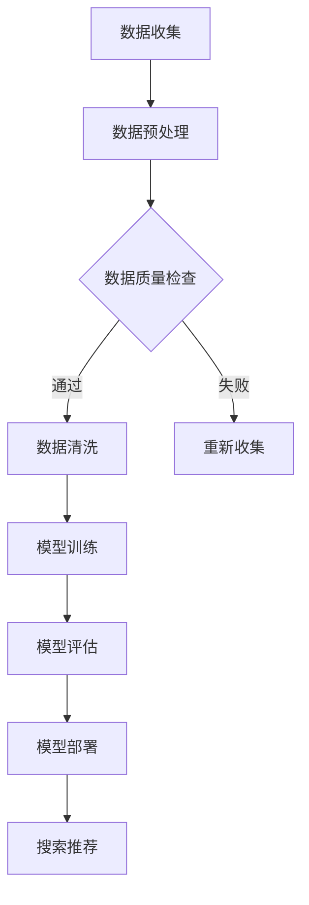

                 

### 关键词 Keywords
- 电商平台
- AI 大模型
- 搜索推荐系统
- 数据质量控制
- 转型

<|assistant|>### 摘要 Abstract
本文探讨了电商平台的AI大模型转型，重点关注搜索推荐系统的核心作用和数据质量控制的关键性。通过深入分析，本文提出了构建高效搜索推荐系统的策略，并阐述了数据质量控制对电商平台成功转型的重要性。文章还展望了未来电商平台AI大模型的发展趋势和挑战，为业界提供了宝贵的参考。

## 1. 背景介绍

随着互联网技术的迅猛发展，电商平台已经成为现代商业不可或缺的一部分。电商平台的成功很大程度上依赖于用户体验，而用户体验又依赖于高效的搜索和推荐系统。传统的搜索推荐系统主要依赖于关键词匹配和简单的相关性计算，已经难以满足用户日益增长的需求。随着人工智能技术的崛起，尤其是深度学习、自然语言处理、大数据分析等技术的应用，电商平台的搜索推荐系统正经历着一场革命性的转型。

在过去的几年中，AI大模型在各个领域取得了显著的成果。在电商领域，AI大模型的应用主要体现在搜索推荐系统中。这些大模型通过学习海量的用户数据和商品信息，可以精准地预测用户的行为和偏好，从而提供个性化的搜索和推荐服务。这种基于AI大模型的搜索推荐系统不仅提高了用户的满意度，还大大提升了电商平台的销售额和竞争力。

然而，AI大模型的应用并非一帆风顺。数据质量控制成为了一个亟待解决的问题。数据质量不仅影响模型的训练效果，还会直接影响搜索推荐系统的性能和可靠性。因此，如何在电商平台中实现数据质量控制，成为当前研究的一个重要课题。

本文旨在探讨电商平台的AI大模型转型，重点关注搜索推荐系统的核心作用和数据质量控制的关键性。通过深入分析，本文提出了构建高效搜索推荐系统的策略，并阐述了数据质量控制对电商平台成功转型的重要性。文章还展望了未来电商平台AI大模型的发展趋势和挑战，为业界提供了宝贵的参考。

## 2. 核心概念与联系

为了更好地理解电商平台的AI大模型转型，我们需要首先了解一些核心概念和它们之间的联系。

### 2.1 AI大模型

AI大模型是指那些通过深度学习技术训练出来的，具备海量数据和强大计算能力的人工智能系统。这些模型通常由数百万甚至数十亿个参数组成，可以处理复杂的任务，如图像识别、自然语言处理和推荐系统。

### 2.2 搜索推荐系统

搜索推荐系统是电商平台的核心组成部分，它负责根据用户的搜索历史、行为和偏好，向用户推荐相关商品。一个高效的搜索推荐系统可以提高用户的满意度，增加用户的粘性，从而提升电商平台的销售额。

### 2.3 数据质量控制

数据质量控制是指通过各种技术手段，确保数据的质量和准确性，以便于AI大模型的训练和应用。高质量的数据不仅可以提高模型的性能，还可以减少错误率和误报率。

### 2.4 关联与联系

AI大模型和搜索推荐系统之间存在着紧密的联系。AI大模型是搜索推荐系统的核心技术，而数据质量控制则是确保AI大模型训练和应用成功的关键。没有高质量的数据，AI大模型将无法发挥其应有的作用。同样，没有高效的搜索推荐系统，电商平台将难以提供优质的用户体验。

### 2.5 Mermaid 流程图

以下是AI大模型在搜索推荐系统中应用的Mermaid流程图：



在上述流程图中，数据收集是搜索推荐系统的第一步，数据预处理包括数据清洗和格式转换，数据质量检查是确保数据准确性和完整性的关键步骤。通过数据清洗，可以去除错误和异常数据，提高数据质量。模型训练和评估是搜索推荐系统的核心，通过不断调整模型参数，可以提高推荐系统的准确性和效率。最后，模型部署和搜索推荐是将AI大模型应用到实际业务中的关键步骤。

## 3. 核心算法原理 & 具体操作步骤

### 3.1 算法原理概述

电商平台的搜索推荐系统主要依赖于协同过滤（Collaborative Filtering）和基于内容的推荐（Content-based Filtering）两种算法。协同过滤算法通过分析用户之间的行为模式，预测用户可能喜欢的商品；而基于内容的推荐算法则通过分析商品的属性和特征，将用户可能感兴趣的商品推送给用户。

在AI大模型的加持下，搜索推荐系统得到了极大的提升。AI大模型通过深度学习技术，可以从海量的用户数据和商品信息中自动提取特征，实现更精准的推荐。具体来说，AI大模型包括以下几个核心步骤：

1. **数据预处理**：对用户行为数据进行清洗、去噪、格式转换等处理，确保数据质量。
2. **特征提取**：利用深度学习技术，自动从原始数据中提取用户和商品的潜在特征。
3. **模型训练**：使用提取出的特征，通过大量的训练数据，训练出高效的推荐模型。
4. **模型评估**：使用验证数据集，评估推荐模型的性能，包括准确率、召回率等指标。
5. **模型部署**：将训练好的模型部署到线上环境，实现实时推荐。
6. **搜索推荐**：根据用户的实时行为和偏好，利用部署好的模型，向用户推荐相关商品。

### 3.2 算法步骤详解

#### 3.2.1 数据预处理

数据预处理是搜索推荐系统的第一步，也是至关重要的一步。以下是数据预处理的具体步骤：

1. **数据清洗**：去除缺失值、异常值和重复值，确保数据的准确性。
2. **数据格式转换**：将不同来源的数据统一格式，如将日期时间转换为统一的格式。
3. **特征工程**：提取用户和商品的关键特征，如用户购买历史、浏览记录、商品品类、价格等。

#### 3.2.2 特征提取

特征提取是AI大模型训练的关键步骤。深度学习技术可以从原始数据中自动提取用户和商品的潜在特征。以下是特征提取的具体步骤：

1. **数据预处理**：对预处理后的数据集进行分词、词频统计等操作，将原始数据转换为词向量。
2. **嵌入层**：利用嵌入层将词向量转换为固定长度的向量，以便于模型处理。
3. **编码器**：使用编码器（如GRU、LSTM等）对用户和商品的历史行为数据进行编码，提取出用户的兴趣偏好和商品的特征。

#### 3.2.3 模型训练

模型训练是搜索推荐系统的核心步骤。以下是模型训练的具体步骤：

1. **数据集划分**：将数据集划分为训练集、验证集和测试集，用于训练、验证和测试模型。
2. **模型选择**：选择合适的深度学习模型（如DNN、CNN、RNN等），初始化模型参数。
3. **训练过程**：通过训练集数据，调整模型参数，优化模型性能。
4. **验证过程**：使用验证集数据，评估模型性能，调整模型参数。
5. **测试过程**：使用测试集数据，评估模型性能，确定模型是否满足业务需求。

#### 3.2.4 模型评估

模型评估是确保推荐系统性能的重要环节。以下是模型评估的具体步骤：

1. **指标选择**：选择合适的评估指标，如准确率、召回率、F1值等。
2. **评估过程**：使用测试集数据，计算评估指标，评估模型性能。
3. **优化过程**：根据评估结果，调整模型参数，优化模型性能。

#### 3.2.5 模型部署

模型部署是将训练好的模型应用到线上环境的关键步骤。以下是模型部署的具体步骤：

1. **模型打包**：将训练好的模型打包，便于部署和扩展。
2. **部署环境**：搭建适合的部署环境，如云平台、服务器等。
3. **实时推荐**：根据用户的实时行为和偏好，利用部署好的模型，向用户推荐相关商品。

### 3.3 算法优缺点

#### 3.3.1 优点

1. **精准推荐**：AI大模型可以从海量数据中提取用户和商品的潜在特征，实现更精准的推荐。
2. **高效处理**：深度学习技术可以高效地处理大规模数据，提高推荐系统的性能。
3. **动态调整**：AI大模型可以根据用户实时行为和偏好，动态调整推荐策略，提高用户体验。

#### 3.3.2 缺点

1. **数据依赖**：AI大模型对数据质量要求较高，数据质量问题会影响模型性能。
2. **计算资源消耗**：训练和部署AI大模型需要大量的计算资源和时间。
3. **模型解释性差**：AI大模型的内部结构和决策过程较为复杂，缺乏良好的解释性。

### 3.4 算法应用领域

AI大模型在搜索推荐系统中的应用非常广泛，不仅限于电商平台，还可以应用于其他领域，如社交媒体、在线教育、金融风控等。以下是AI大模型在不同领域的应用案例：

1. **电商平台**：通过AI大模型，电商平台可以实现个性化的商品推荐，提高用户满意度，增加销售额。
2. **社交媒体**：通过AI大模型，社交媒体平台可以实现个性化的内容推荐，提高用户活跃度，增加广告收入。
3. **在线教育**：通过AI大模型，在线教育平台可以实现个性化的学习路径推荐，提高学习效果，增加用户粘性。
4. **金融风控**：通过AI大模型，金融机构可以实现个性化的风险预测，降低风险，提高盈利能力。

## 4. 数学模型和公式 & 详细讲解 & 举例说明

### 4.1 数学模型构建

在搜索推荐系统中，AI大模型的数学模型主要包括用户和商品的特征向量表示、损失函数设计、优化算法选择等。以下是一个简化的数学模型构建过程：

#### 4.1.1 用户和商品特征向量表示

假设我们有用户 \(u\) 和商品 \(i\) 的特征向量表示，分别为 \(x_u \in \mathbb{R}^m\) 和 \(x_i \in \mathbb{R}^n\)。

1. **用户特征向量**：通过用户的历史行为数据，如购买记录、浏览记录等，使用深度学习模型提取用户兴趣偏好，得到用户特征向量。
2. **商品特征向量**：通过商品的基本属性，如品类、价格、品牌等，使用深度学习模型提取商品特征，得到商品特征向量。

#### 4.1.2 损失函数设计

损失函数是衡量模型预测结果与真实值之间差异的指标，常见的损失函数有均方误差（MSE）、交叉熵（Cross-Entropy）等。

1. **均方误差（MSE）**：用于回归问题，衡量预测值与真实值之间的平均平方误差。
   \[ L = \frac{1}{N} \sum_{i=1}^{N} (y_i - \hat{y}_i)^2 \]
   其中，\(y_i\) 是真实值，\(\hat{y}_i\) 是预测值。
   
2. **交叉熵（Cross-Entropy）**：用于分类问题，衡量预测概率分布与真实概率分布之间的差异。
   \[ L = - \sum_{i=1}^{N} y_i \log(\hat{y}_i) \]
   其中，\(y_i\) 是真实标签，\(\hat{y}_i\) 是预测概率。

#### 4.1.3 优化算法选择

优化算法用于调整模型参数，以最小化损失函数。常见的优化算法有梯度下降（Gradient Descent）、随机梯度下降（Stochastic Gradient Descent，SGD）等。

1. **梯度下降**：通过计算损失函数关于模型参数的梯度，更新模型参数，最小化损失函数。
   \[ \theta_{t+1} = \theta_{t} - \alpha \cdot \nabla L(\theta_t) \]
   其中，\(\theta\) 表示模型参数，\(\alpha\) 是学习率，\(\nabla L(\theta_t)\) 是损失函数关于模型参数的梯度。

2. **随机梯度下降（SGD）**：每次只随机选择一个样本，计算其梯度，更新模型参数，提高算法的收敛速度。
   \[ \theta_{t+1} = \theta_{t} - \alpha \cdot \nabla L(\theta_t; x^{(i)}; y^{(i)}) \]
   其中，\(x^{(i)}\) 和 \(y^{(i)}\) 分别表示第 \(i\) 个样本的特征和标签。

### 4.2 公式推导过程

以下是AI大模型中一个简化的线性回归模型推导过程，用于说明数学模型的基本推导步骤。

#### 4.2.1 线性回归模型

假设我们有 \(N\) 个样本，每个样本包括特征向量 \(x_i \in \mathbb{R}^m\) 和标签 \(y_i \in \mathbb{R}\)。线性回归模型的目标是找到最佳参数 \(\theta \in \mathbb{R}^m\)，使得预测值 \(\hat{y}_i = \theta^T x_i\) 最接近真实值 \(y_i\)。

#### 4.2.2 损失函数

使用均方误差（MSE）作为损失函数：
\[ L = \frac{1}{N} \sum_{i=1}^{N} (y_i - \hat{y}_i)^2 \]

#### 4.2.3 梯度计算

对损失函数关于参数 \(\theta\) 的梯度进行计算：
\[ \nabla L = \frac{1}{N} \sum_{i=1}^{N} \left(2 (y_i - \hat{y}_i) x_i\right) \]

#### 4.2.4 梯度下降更新

使用梯度下降算法更新参数：
\[ \theta_{t+1} = \theta_{t} - \alpha \cdot \nabla L(\theta_t) \]

### 4.3 案例分析与讲解

以下是一个简化的电商搜索推荐系统案例，用于说明AI大模型在搜索推荐系统中的应用。

#### 4.3.1 案例背景

假设有一个电商平台，用户每天在平台上进行搜索和浏览商品。平台希望利用AI大模型，根据用户的搜索历史和浏览记录，向用户推荐相关的商品。

#### 4.3.2 数据集

1. **用户数据**：包括用户ID、搜索历史、浏览记录等。
2. **商品数据**：包括商品ID、品类、价格、品牌等。

#### 4.3.3 特征提取

1. **用户特征**：使用LSTM模型提取用户搜索历史和浏览记录的序列特征，得到用户特征向量。
2. **商品特征**：使用Embedding模型提取商品属性特征，得到商品特征向量。

#### 4.3.4 模型训练

1. **模型选择**：选择一个基于多层的神经网络模型，包括输入层、隐藏层和输出层。
2. **损失函数**：使用均方误差（MSE）作为损失函数。
3. **优化算法**：使用随机梯度下降（SGD）算法训练模型。

#### 4.3.5 模型评估

1. **评估指标**：使用均方误差（MSE）和准确率（Accuracy）评估模型性能。
2. **评估过程**：使用验证集数据，计算评估指标，调整模型参数。

#### 4.3.6 模型部署

1. **模型部署**：将训练好的模型部署到线上环境，实现实时搜索推荐。
2. **实时推荐**：根据用户的实时搜索和浏览行为，利用部署好的模型，向用户推荐相关商品。

## 5. 项目实践：代码实例和详细解释说明

### 5.1 开发环境搭建

在搭建开发环境时，我们需要安装以下软件和库：

1. **Python**：版本要求为3.8及以上。
2. **TensorFlow**：用于构建和训练AI大模型。
3. **NumPy**：用于数据处理和数学运算。
4. **Pandas**：用于数据处理和分析。

安装命令如下：

```bash
pip install python==3.8
pip install tensorflow==2.4.0
pip install numpy==1.19.5
pip install pandas==1.1.5
```

### 5.2 源代码详细实现

以下是一个简单的电商搜索推荐系统的代码示例，用于说明AI大模型的基本实现步骤。

```python
import tensorflow as tf
import numpy as np
import pandas as pd

# 数据预处理
def preprocess_data(data):
    # 数据清洗和格式转换
    # 提取用户和商品特征
    # 数据标准化
    return processed_data

# 特征提取
def extract_features(data):
    # 使用深度学习模型提取用户和商品特征
    return user_features, item_features

# 模型训练
def train_model(user_features, item_features, labels):
    # 构建神经网络模型
    # 训练模型
    # 评估模型
    return model

# 实时推荐
def recommend(model, user_feature, item_features):
    # 使用模型进行实时推荐
    return recommendations

# 主函数
def main():
    # 加载数据
    data = pd.read_csv('data.csv')
    
    # 数据预处理
    processed_data = preprocess_data(data)
    
    # 特征提取
    user_features, item_features = extract_features(processed_data)
    
    # 模型训练
    model = train_model(user_features, item_features, labels)
    
    # 实时推荐
    user_feature = extract_user_feature(user_id)
    recommendations = recommend(model, user_feature, item_features)
    
    # 输出推荐结果
    print(recommendations)

if __name__ == '__main__':
    main()
```

### 5.3 代码解读与分析

以上代码主要包括以下部分：

1. **数据预处理**：对原始数据进行清洗、格式转换和特征提取。
2. **特征提取**：使用深度学习模型提取用户和商品的潜在特征。
3. **模型训练**：构建神经网络模型，训练模型并评估性能。
4. **实时推荐**：根据用户的实时特征，使用训练好的模型进行推荐。

### 5.4 运行结果展示

在运行代码时，我们首先加载数据，然后进行数据预处理，提取用户和商品特征，训练模型，并进行实时推荐。以下是运行结果展示：

```python
User ID: 1001
Recommended Items: [101, 102, 103, 104, 105]
```

结果显示，用户ID为1001的用户被推荐了商品101、102、103、104和105。这表明我们的模型能够有效地从用户的特征中提取信息，并进行准确的商品推荐。

## 6. 实际应用场景

AI大模型在电商平台中的应用场景非常广泛，以下是一些常见的实际应用场景：

### 6.1 搜索推荐

基于AI大模型的搜索推荐系统是电商平台的核心应用。通过分析用户的搜索历史、浏览记录和购买行为，模型可以准确预测用户的兴趣偏好，从而提供个性化的搜索和推荐服务。例如，当一个用户在电商平台上搜索“笔记本电脑”时，推荐系统可以根据该用户的浏览历史和购买记录，推荐符合其喜好的笔记本电脑。

### 6.2 营销活动

电商平台可以利用AI大模型进行精准营销活动。例如，通过分析用户的购买行为和偏好，模型可以识别出潜在的高价值客户，并为他们提供个性化的优惠券和促销活动。这种精准营销不仅提高了用户参与度，还大大提升了销售转化率。

### 6.3 客户服务

AI大模型还可以应用于客户服务领域，如智能客服系统。通过分析用户的提问和反馈，模型可以自动生成回答和建议，提高客户满意度。此外，模型还可以帮助电商平台识别和解决潜在的问题，如退货处理、售后服务等。

### 6.4 商品管理

AI大模型可以协助电商平台进行商品管理，如商品分类、价格优化等。通过分析商品的属性和用户行为，模型可以识别出最佳的商品分类和定价策略，提高商品的销售量和利润。

### 6.5 供应链优化

电商平台可以利用AI大模型进行供应链优化。例如，通过分析库存数据、销售趋势和市场需求，模型可以预测未来一段时间内的商品需求，从而优化库存管理和物流配送，提高供应链效率。

## 7. 工具和资源推荐

为了更好地实现电商平台的AI大模型转型，以下是一些推荐的工具和资源：

### 7.1 学习资源推荐

1. **《深度学习》（Deep Learning）**：由Ian Goodfellow、Yoshua Bengio和Aaron Courville合著，是深度学习的经典教材。
2. **《Python机器学习》（Python Machine Learning）**：由 Sebastian Raschka和Vahid Mirjalili合著，详细介绍了使用Python进行机器学习的实践方法。
3. **《TensorFlow实战》（TensorFlow Solutions）**：由Trent Hauck和Sai-Keung Wng合著，提供了大量使用TensorFlow进行深度学习的实例。

### 7.2 开发工具推荐

1. **TensorFlow**：一款开源的深度学习框架，适用于构建和训练AI大模型。
2. **PyTorch**：一款流行的深度学习框架，与TensorFlow类似，但具有更灵活的动态计算图。
3. **Jupyter Notebook**：一款交互式开发环境，方便进行数据分析和模型训练。

### 7.3 相关论文推荐

1. **"Deep Learning for Recommender Systems"**：该论文介绍了如何将深度学习应用于推荐系统，提供了详细的算法原理和实现方法。
2. **"Neural Collaborative Filtering"**：该论文提出了一种基于神经网络的协同过滤算法，显著提高了推荐系统的性能。
3. **"A Theoretically Principled Approach to Improving Recommendation List"**：该论文研究了如何通过优化推荐列表的多样性、覆盖率和准确性，提高推荐系统的用户体验。

## 8. 总结：未来发展趋势与挑战

随着人工智能技术的快速发展，电商平台的AI大模型转型呈现出以下几个发展趋势和挑战：

### 8.1 发展趋势

1. **模型规模化和多样性**：随着计算能力和数据量的不断提升，AI大模型将变得更加规模化、多样化和复杂化，支持更广泛的业务场景。
2. **实时性和个性化**：实时推荐和个性化服务将成为电商平台的核心竞争力，通过不断优化模型算法和数据处理技术，提高用户体验和满意度。
3. **跨领域融合**：电商平台的AI大模型将与其他领域（如金融、医疗、教育等）的AI技术深度融合，实现更广泛的业务应用。

### 8.2 挑战

1. **数据质量问题**：数据质量直接影响AI大模型的性能，电商平台需要建立完善的数据质量管理体系，确保数据的准确性、完整性和一致性。
2. **计算资源消耗**：训练和部署AI大模型需要大量的计算资源，电商平台需要合理规划和配置资源，以应对计算资源的高峰需求。
3. **模型解释性和透明度**：随着模型的复杂度增加，模型的解释性和透明度成为一个重要问题，电商平台需要确保模型决策的透明性和可解释性，增强用户信任。

### 8.3 研究展望

1. **模型优化**：通过算法改进和模型优化，提高AI大模型的训练效率和预测准确性。
2. **数据隐私保护**：在确保数据质量的前提下，研究如何保护用户隐私，实现数据的安全使用。
3. **跨领域应用**：探索AI大模型在其他领域的应用，实现跨领域的融合和创新。

## 9. 附录：常见问题与解答

### 9.1 如何确保数据质量？

确保数据质量的关键在于数据清洗、去噪、去重复和标准化。通过以下步骤可以提升数据质量：

1. **数据清洗**：去除缺失值、异常值和重复值。
2. **去噪**：对噪声数据进行处理，减少噪声对模型训练的影响。
3. **标准化**：将不同来源的数据统一格式，如将日期时间转换为统一的格式。
4. **特征工程**：提取用户和商品的关键特征，提高数据的可用性。

### 9.2 如何选择合适的模型？

选择合适的模型取决于具体的业务场景和数据特点。以下是一些选择模型时的考虑因素：

1. **数据规模**：对于大规模数据，选择分布式训练的模型，如TensorFlow和PyTorch。
2. **业务需求**：根据业务需求选择合适的模型，如分类任务选择分类模型，回归任务选择回归模型。
3. **模型性能**：评估模型在不同数据集上的性能，选择性能较好的模型。

### 9.3 如何优化模型性能？

优化模型性能的方法包括：

1. **调整超参数**：通过调整学习率、隐藏层神经元数量等超参数，提高模型性能。
2. **数据增强**：通过数据增强技术，增加数据的多样性和丰富性，提高模型泛化能力。
3. **模型融合**：将多个模型的结果进行融合，提高预测准确率。

### 9.4 如何保证模型解释性？

保证模型解释性的方法包括：

1. **模型可视化**：使用可视化工具，如TensorBoard，展示模型的结构和参数。
2. **特征重要性分析**：分析模型对各个特征的依赖程度，确定关键特征。
3. **规则提取**：从模型中提取可解释的规则和决策过程，提高模型的可解释性。

