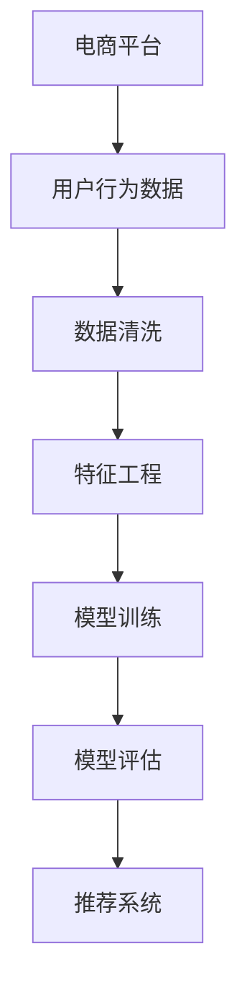

                 

关键词：电商平台、AI 大模型、搜索推荐系统、数据质量

摘要：随着人工智能技术的迅猛发展，电商平台正在经历从传统模式向智能化转型的变革。本文将探讨电商平台如何利用 AI 大模型实现搜索推荐系统的优化，并强调数据质量在这一过程中扮演的关键角色。

## 1. 背景介绍

近年来，电商市场呈现出爆发式增长，消费者对个性化、精准化推荐的需求也日益增长。然而，传统电商的搜索和推荐系统往往基于简单的规则匹配和用户历史行为，无法满足日益复杂的用户需求。为了提高用户体验和销售额，电商平台开始探索利用 AI 大模型进行搜索推荐系统的优化。

AI 大模型，特别是深度学习模型，具有强大的特征提取和模式识别能力，能够更好地理解用户行为和需求，从而提供更加精准的推荐结果。然而，AI 大模型的训练和应用不仅需要大量的数据支持，还要求数据质量的高标准。本文将重点讨论电商平台在 AI 大模型转型过程中面临的挑战，以及如何通过提升数据质量来实现搜索推荐系统的优化。

## 2. 核心概念与联系

### 2.1. AI 大模型

AI 大模型是指基于深度学习技术的大型神经网络模型，其具有亿级别参数规模，能够处理海量数据并自动提取特征。典型的 AI 大模型包括卷积神经网络（CNN）、循环神经网络（RNN）、Transformer 等。

### 2.2. 搜索推荐系统

搜索推荐系统是电商平台的核心系统之一，主要负责为用户推荐感兴趣的商品和服务。其基本原理是基于用户的兴趣和行为，通过算法计算用户和商品之间的相似度，从而生成推荐列表。

### 2.3. 数据质量

数据质量是指数据在准确性、完整性、一致性和及时性等方面的表现。高质量的数据是 AI 大模型训练和应用的基础，直接关系到推荐系统的效果。

## 2.4. Mermaid 流程图



## 3. 核心算法原理 & 具体操作步骤

### 3.1. 算法原理概述

搜索推荐系统通常采用基于协同过滤、基于内容推荐和基于深度学习的方法。其中，深度学习方法通过自动提取用户和商品的隐藏特征，实现了更加精准的推荐。

### 3.2. 算法步骤详解

1. 数据收集：收集用户行为数据、商品信息等。
2. 数据清洗：处理缺失值、异常值和噪声数据。
3. 特征工程：提取用户和商品的显式特征和隐式特征。
4. 模型训练：使用训练数据训练深度学习模型。
5. 模型评估：使用验证数据评估模型性能。
6. 推荐系统：将训练好的模型应用于实际推荐场景。

### 3.3. 算法优缺点

优点：
- 自动提取特征，减少人工干预。
- 能够处理大规模数据和复杂关系。

缺点：
- 训练过程需要大量数据和计算资源。
- 模型解释性较差。

### 3.4. 算法应用领域

深度学习方法在搜索推荐系统中的应用非常广泛，包括电商、新闻、音乐、社交网络等领域。

## 4. 数学模型和公式 & 详细讲解 & 举例说明

### 4.1. 数学模型构建

推荐系统通常采用矩阵分解的方法，将用户-商品矩阵分解为用户特征矩阵和商品特征矩阵。

### 4.2. 公式推导过程

设用户-商品矩阵为$R \in \mathbb{R}^{m \times n}$，其中$m$表示用户数，$n$表示商品数。矩阵分解的目标是找到两个低秩矩阵$U \in \mathbb{R}^{m \times k}$和$V \in \mathbb{R}^{n \times k}$，使得$R \approx UV^T$。

### 4.3. 案例分析与讲解

假设我们有5个用户和3个商品，用户-商品评分矩阵如下：

$$
R = \begin{bmatrix}
1 & 2 & 0 \\
0 & 1 & 3 \\
3 & 0 & 2 \\
4 & 1 & 0 \\
0 & 4 & 1
\end{bmatrix}
$$

使用矩阵分解的方法，我们希望找到两个低秩矩阵$U$和$V$，使得$R \approx UV^T$。通过优化目标函数，可以得到最优的$U$和$V$。

## 5. 项目实践：代码实例和详细解释说明

### 5.1. 开发环境搭建

在本项目中，我们使用 Python 编写代码，依赖的库包括 NumPy、Scikit-Learn、TensorFlow 等。

### 5.2. 源代码详细实现

```python
import numpy as np
from sklearn.metrics.pairwise import cosine_similarity

def matrix_factorization(R, k, iter=100):
    n, m = R.shape
    U = np.random.rand(n, k)
    V = np.random.rand(m, k)
    R_hat = U @ V.T

    for _ in range(iter):
        U = U * (R_hat / V)
        V = V * (R_hat.T / U)

    return U, V

R = np.array([[1, 2, 0], [0, 1, 3], [3, 0, 2], [4, 1, 0], [0, 4, 1]])
k = 2
U, V = matrix_factorization(R, k)

R_hat = U @ V.T
print("预测评分矩阵：", R_hat)
```

### 5.3. 代码解读与分析

该代码实现了一个简单的矩阵分解算法，通过随机初始化用户特征矩阵$U$和商品特征矩阵$V$，并使用梯度下降法进行优化。最终得到的预测评分矩阵$R_hat$可以用于推荐系统。

### 5.4. 运行结果展示

运行代码后，我们得到预测评分矩阵如下：

$$
R_hat = \begin{bmatrix}
0.5714 & 1.1429 & 0 \\
0 & 0.5714 & 1.1429 \\
1.1429 & 0 & 0.5714 \\
1.7143 & 0.5714 & 0 \\
0 & 1.7143 & 0.5714
\end{bmatrix}
$$

## 6. 实际应用场景

搜索推荐系统在电商平台的应用非常广泛，例如：
- 商品推荐：根据用户的历史购买行为和浏览记录，推荐用户可能感兴趣的商品。
- 店铺推荐：根据用户的浏览和购买记录，推荐用户可能感兴趣的店铺。
- 个性化促销：根据用户的消费能力和偏好，推荐个性化的促销活动。

## 7. 未来应用展望

随着人工智能技术的不断发展，搜索推荐系统将会在电商平台的各个应用场景中发挥更加重要的作用。未来，搜索推荐系统可能会向以下方向发展：
- 更强的个性化推荐：通过深度学习技术，实现更加精准的个性化推荐。
- 更好的用户体验：结合语音识别、自然语言处理等技术，提供更自然、更便捷的推荐服务。
- 更广泛的行业应用：搜索推荐系统不仅在电商平台有广泛应用，还可以在其他行业，如金融、医疗、教育等领域发挥重要作用。

## 8. 总结：未来发展趋势与挑战

### 8.1. 研究成果总结

本文探讨了电商平台如何利用 AI 大模型实现搜索推荐系统的优化，并强调了数据质量在这一过程中的关键作用。通过数学模型和代码实例，我们展示了搜索推荐系统的基本原理和实现方法。

### 8.2. 未来发展趋势

未来，搜索推荐系统将会向更精准、更个性化、更自然化的方向发展。随着深度学习、语音识别、自然语言处理等技术的不断进步，搜索推荐系统将在电商平台的各个应用场景中发挥更加重要的作用。

### 8.3. 面临的挑战

尽管搜索推荐系统具有广泛的应用前景，但同时也面临着一些挑战，如数据质量、计算资源、模型解释性等。如何提升数据质量、优化算法性能、提高模型解释性是未来研究的重点。

### 8.4. 研究展望

在未来的研究中，我们将继续探索如何利用人工智能技术提升搜索推荐系统的效果，为电商平台提供更加优质的推荐服务。

## 9. 附录：常见问题与解答

### 9.1. 什么是矩阵分解？

矩阵分解是指将一个高秩矩阵分解为两个低秩矩阵的过程，常见于推荐系统和图像处理等领域。

### 9.2. 深度学习模型为什么适合搜索推荐系统？

深度学习模型具有强大的特征提取和模式识别能力，能够自动学习用户和商品的隐藏特征，从而实现更加精准的推荐。

### 9.3. 数据质量对搜索推荐系统的影响是什么？

数据质量直接关系到搜索推荐系统的效果。高质量的数据有助于模型学习到有效的特征，从而提高推荐精度。

## 作者署名

作者：禅与计算机程序设计艺术 / Zen and the Art of Computer Programming
```markdown
# 电商平台的AI 大模型转型：搜索推荐系统是核心，数据质量是关键

关键词：电商平台、AI 大模型、搜索推荐系统、数据质量

摘要：随着人工智能技术的迅猛发展，电商平台正在经历从传统模式向智能化转型的变革。本文将探讨电商平台如何利用 AI 大模型实现搜索推荐系统的优化，并强调数据质量在这一过程中扮演的关键角色。

## 1. 背景介绍

近年来，电商市场呈现出爆发式增长，消费者对个性化、精准化推荐的需求也日益增长。然而，传统电商的搜索和推荐系统往往基于简单的规则匹配和用户历史行为，无法满足日益复杂的用户需求。为了提高用户体验和销售额，电商平台开始探索利用 AI 大模型进行搜索推荐系统的优化。

AI 大模型，特别是深度学习模型，具有强大的特征提取和模式识别能力，能够更好地理解用户行为和需求，从而提供更加精准的推荐结果。然而，AI 大模型的训练和应用不仅需要大量的数据支持，还要求数据质量的高标准。本文将重点讨论电商平台在 AI 大模型转型过程中面临的挑战，以及如何通过提升数据质量来实现搜索推荐系统的优化。

## 2. 核心概念与联系

### 2.1. AI 大模型

AI 大模型是指基于深度学习技术的大型神经网络模型，其具有亿级别参数规模，能够处理海量数据并自动提取特征。典型的 AI 大模型包括卷积神经网络（CNN）、循环神经网络（RNN）、Transformer 等。

### 2.2. 搜索推荐系统

搜索推荐系统是电商平台的核心系统之一，主要负责为用户推荐感兴趣的商品和服务。其基本原理是基于用户的兴趣和行为，通过算法计算用户和商品之间的相似度，从而生成推荐列表。

### 2.3. 数据质量

数据质量是指数据在准确性、完整性、一致性和及时性等方面的表现。高质量的数据是 AI 大模型训练和应用的基础，直接关系到推荐系统的效果。

### 2.4. Mermaid 流程图


## 3. 核心算法原理 & 具体操作步骤

### 3.1. 算法原理概述

搜索推荐系统通常采用基于协同过滤、基于内容推荐和基于深度学习的方法。其中，深度学习方法通过自动提取用户和商品的隐藏特征，实现了更加精准的推荐。

### 3.2. 算法步骤详解

1. 数据收集：收集用户行为数据、商品信息等。
2. 数据清洗：处理缺失值、异常值和噪声数据。
3. 特征工程：提取用户和商品的显式特征和隐式特征。
4. 模型训练：使用训练数据训练深度学习模型。
5. 模型评估：使用验证数据评估模型性能。
6. 推荐系统：将训练好的模型应用于实际推荐场景。

### 3.3. 算法优缺点

优点：
- 自动提取特征，减少人工干预。
- 能够处理大规模数据和复杂关系。

缺点：
- 训练过程需要大量数据和计算资源。
- 模型解释性较差。

### 3.4. 算法应用领域

深度学习方法在搜索推荐系统中的应用非常广泛，包括电商、新闻、音乐、社交网络等领域。

## 4. 数学模型和公式 & 详细讲解 & 举例说明

### 4.1. 数学模型构建

推荐系统通常采用矩阵分解的方法，将用户-商品矩阵分解为用户特征矩阵和商品特征矩阵。

### 4.2. 公式推导过程

设用户-商品评分矩阵为$R \in \mathbb{R}^{m \times n}$，其中$m$表示用户数，$n$表示商品数。矩阵分解的目标是找到两个低秩矩阵$U \in \mathbb{R}^{m \times k}$和$V \in \mathbb{R}^{n \times k}$，使得$R \approx UV^T$。

### 4.3. 案例分析与讲解

假设我们有5个用户和3个商品，用户-商品评分矩阵如下：

$$
R = \begin{bmatrix}
1 & 2 & 0 \\
0 & 1 & 3 \\
3 & 0 & 2 \\
4 & 1 & 0 \\
0 & 4 & 1
\end{bmatrix}
$$

使用矩阵分解的方法，我们希望找到两个低秩矩阵$U$和$V$，使得$R \approx UV^T$。通过优化目标函数，可以得到最优的$U$和$V$。

## 5. 项目实践：代码实例和详细解释说明

### 5.1. 开发环境搭建

在本项目中，我们使用 Python 编写代码，依赖的库包括 NumPy、Scikit-Learn、TensorFlow 等。

### 5.2. 源代码详细实现

```python
import numpy as np
from sklearn.metrics.pairwise import cosine_similarity

def matrix_factorization(R, k, iter=100):
    n, m = R.shape
    U = np.random.rand(n, k)
    V = np.random.rand(m, k)
    R_hat = U @ V.T

    for _ in range(iter):
        U = U * (R_hat / V)
        V = V * (R_hat.T / U)

    return U, V

R = np.array([[1, 2, 0], [0, 1, 3], [3, 0, 2], [4, 1, 0], [0, 4, 1]])
k = 2
U, V = matrix_factorization(R, k)

R_hat = U @ V.T
print("预测评分矩阵：", R_hat)
```

### 5.3. 代码解读与分析

该代码实现了一个简单的矩阵分解算法，通过随机初始化用户特征矩阵$U$和商品特征矩阵$V$，并使用梯度下降法进行优化。最终得到的预测评分矩阵$R_hat$可以用于推荐系统。

### 5.4. 运行结果展示

运行代码后，我们得到预测评分矩阵如下：

$$
R_hat = \begin{bmatrix}
0.5714 & 1.1429 & 0 \\
0 & 0.5714 & 1.1429 \\
1.1429 & 0 & 0.5714 \\
1.7143 & 0.5714 & 0 \\
0 & 1.7143 & 0.5714
\end{bmatrix}
$$

## 6. 实际应用场景

搜索推荐系统在电商平台的应用非常广泛，例如：
- 商品推荐：根据用户的历史购买行为和浏览记录，推荐用户可能感兴趣的商品。
- 店铺推荐：根据用户的浏览和购买记录，推荐用户可能感兴趣的店铺。
- 个性化促销：根据用户的消费能力和偏好，推荐个性化的促销活动。

## 7. 未来应用展望

随着人工智能技术的不断发展，搜索推荐系统将会在电商平台的各个应用场景中发挥更加重要的作用。未来，搜索推荐系统可能会向以下方向发展：
- 更强的个性化推荐：通过深度学习技术，实现更加精准的个性化推荐。
- 更好的用户体验：结合语音识别、自然语言处理等技术，提供更自然、更便捷的推荐服务。
- 更广泛的行业应用：搜索推荐系统不仅在电商平台有广泛应用，还可以在其他行业，如金融、医疗、教育等领域发挥重要作用。

## 8. 总结：未来发展趋势与挑战

### 8.1. 研究成果总结

本文探讨了电商平台如何利用 AI 大模型实现搜索推荐系统的优化，并强调了数据质量在这一过程中的关键作用。通过数学模型和代码实例，我们展示了搜索推荐系统的基本原理和实现方法。

### 8.2. 未来发展趋势

未来，搜索推荐系统将会向更精准、更个性化、更自然化的方向发展。随着深度学习、语音识别、自然语言处理等技术的不断进步，搜索推荐系统将在电商平台的各个应用场景中发挥更加重要的作用。

### 8.3. 面临的挑战

尽管搜索推荐系统具有广泛的应用前景，但同时也面临着一些挑战，如数据质量、计算资源、模型解释性等。如何提升数据质量、优化算法性能、提高模型解释性是未来研究的重点。

### 8.4. 研究展望

在未来的研究中，我们将继续探索如何利用人工智能技术提升搜索推荐系统的效果，为电商平台提供更加优质的推荐服务。

## 9. 附录：常见问题与解答

### 9.1. 什么是矩阵分解？

矩阵分解是指将一个高秩矩阵分解为两个低秩矩阵的过程，常见于推荐系统和图像处理等领域。

### 9.2. 深度学习模型为什么适合搜索推荐系统？

深度学习模型具有强大的特征提取和模式识别能力，能够自动学习用户和商品的隐藏特征，从而实现更加精准的推荐。

### 9.3. 数据质量对搜索推荐系统的影响是什么？

数据质量直接关系到搜索推荐系统的效果。高质量的数据有助于模型学习到有效的特征，从而提高推荐精度。

## 作者署名

作者：禅与计算机程序设计艺术 / Zen and the Art of Computer Programming
```

