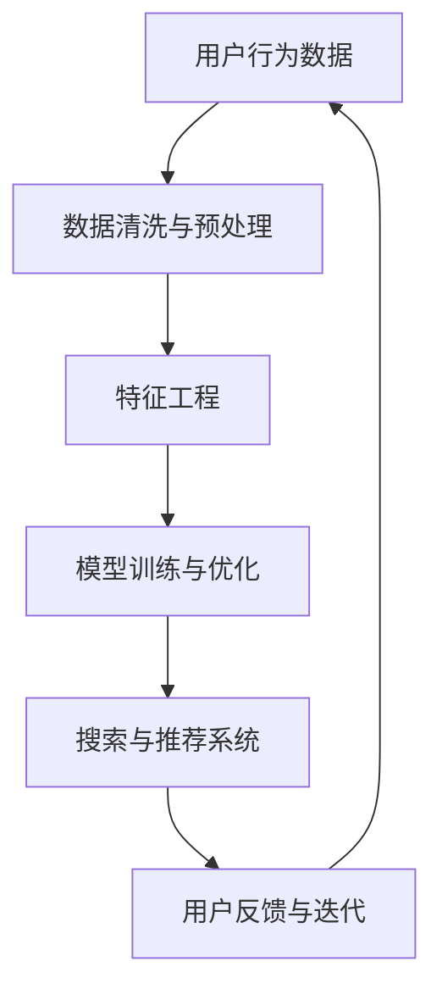

                 

关键词：电商AI大模型、搜索推荐系统、用户体验优化、数据质量、转型策略

> 摘要：随着人工智能技术的飞速发展，电商平台正在经历一场以AI大模型为核心的转型。本文将深入探讨电商搜索推荐系统在这一变革中的重要性，以及如何通过优化用户体验和数据质量来推动这一转型的成功。

## 1. 背景介绍

在过去的几年里，人工智能（AI）技术逐渐渗透到电商平台的各个层面，从产品推荐、搜索优化到个性化服务，AI的应用正在改变电商行业的运作方式。特别是大模型的兴起，如深度学习模型、生成对抗网络（GANs）等，使得电商平台能够以更精准、更高效的方式服务用户。

然而，尽管AI技术带来了诸多优势，电商平台的转型并非一帆风顺。用户对个性化体验的期望越来越高，同时数据质量成为系统性能的关键因素。在这一背景下，搜索推荐系统的优化显得尤为重要。

### 1.1 AI在电商平台的应用现状

AI技术已经在电商平台的多个方面得到了广泛应用：

- **产品推荐**：通过分析用户的历史行为和偏好，AI算法能够为用户推荐可能感兴趣的商品，从而提高转化率和用户满意度。
- **搜索优化**：利用自然语言处理（NLP）技术，AI能够更准确地理解用户的搜索意图，并提供更加相关和个性化的搜索结果。
- **个性化服务**：通过用户画像和数据分析，AI可以提供个性化的购物建议、促销信息等，增强用户粘性。
- **欺诈检测**：AI模型可以识别和预防欺诈行为，保障交易安全。

### 1.2 搜索推荐系统的挑战与机遇

随着用户数据的爆炸性增长和算法的日益复杂，搜索推荐系统面临着一系列挑战：

- **数据质量**：数据不准确或不完整会直接影响推荐系统的性能，因此数据清洗和预处理至关重要。
- **算法选择**：如何在多种算法中选出最适合当前业务需求的方案，是一个需要深入思考的问题。
- **用户体验**：用户对推荐结果的质量和个性化程度有很高的期望，如何满足这些期望是电商平台的挑战。
- **可解释性**：AI模型往往被视为“黑箱”，用户难以理解推荐结果的产生过程，提高算法的可解释性成为一大难题。

然而，这些挑战也带来了机遇。通过不断优化搜索推荐系统，电商平台可以在激烈的市场竞争中脱颖而出，提升用户满意度和品牌忠诚度。

## 2. 核心概念与联系

### 2.1 大模型与搜索推荐系统

大模型是指那些参数规模巨大的神经网络模型，如Transformer、BERT等。这些模型在处理大规模数据时具有出色的性能，能够捕获复杂的模式和关系。在搜索推荐系统中，大模型的应用使得个性化推荐和搜索结果的相关性得到了显著提升。


**图 1：大模型与搜索推荐系统的关系**

- **个性化推荐**：大模型可以处理用户的个性化数据，从而提供更精准的推荐结果。
- **搜索优化**：大模型能够更好地理解用户的搜索意图，提供更加相关的搜索结果。

### 2.2 用户体验优化

用户体验（UX）优化是指通过改进产品和服务的设计，提升用户在使用过程中的满意度和参与度。在电商平台，用户体验优化的关键在于提供个性化、便捷、流畅的购物体验。


**图 2：用户体验优化的关键要素**

- **个性化**：根据用户的历史行为和偏好，提供个性化的内容和推荐。
- **便捷性**：简化购物流程，减少用户操作步骤，提高购物效率。
- **流畅性**：优化页面加载速度和交互体验，确保用户顺畅地使用电商平台。

### 2.3 数据质量

数据质量是指数据在准确性、完整性、一致性、及时性和可用性等方面的表现。在搜索推荐系统中，数据质量直接关系到系统的性能和可靠性。


**图 3：数据质量的重要性**

- **准确性**：数据应真实反映用户的行为和偏好。
- **完整性**：数据应包含所有必要的字段和维度。
- **一致性**：数据在不同来源和系统中应保持一致。
- **及时性**：数据应能够及时更新，以反映最新的用户行为。
- **可用性**：数据应易于访问和查询，支持系统的快速迭代和优化。

### 2.4 Mermaid 流程图

以下是一个用于展示大模型在搜索推荐系统中应用的 Mermaid 流程图：



**图 4：大模型在搜索推荐系统中的应用流程图**

## 3. 核心算法原理 & 具体操作步骤

### 3.1 算法原理概述

搜索推荐系统的核心算法通常是基于协同过滤、基于内容的推荐以及深度学习等方法。以下将对这些算法进行简要概述：

- **协同过滤（Collaborative Filtering）**：通过分析用户的历史行为，发现相似的用户或物品，从而进行推荐。
- **基于内容的推荐（Content-Based Filtering）**：根据用户的历史行为和偏好，推荐具有相似属性或内容的商品。
- **深度学习（Deep Learning）**：利用神经网络模型，从大规模数据中学习复杂的模式和关系，进行精准的推荐。

### 3.2 算法步骤详解

#### 3.2.1 协同过滤算法

1. **用户相似度计算**：计算用户之间的相似度，通常使用余弦相似度、皮尔逊相关系数等方法。
2. **物品相似度计算**：计算物品之间的相似度，同样使用余弦相似度、皮尔逊相关系数等方法。
3. **推荐列表生成**：根据用户的历史行为和物品的相似度，生成推荐列表。

#### 3.2.2 基于内容的推荐算法

1. **特征提取**：提取物品的属性特征，如类别、品牌、价格等。
2. **用户偏好建模**：根据用户的历史行为，建立用户偏好模型。
3. **推荐列表生成**：根据用户偏好模型和物品特征，生成推荐列表。

#### 3.2.3 深度学习算法

1. **数据预处理**：对用户行为数据进行清洗和预处理，包括缺失值处理、异常值检测等。
2. **特征工程**：提取用户和物品的特征，包括用户行为特征、物品属性特征等。
3. **模型训练与优化**：使用神经网络模型，对预处理后的数据进行训练，并通过优化算法调整模型参数。
4. **推荐列表生成**：根据训练好的模型，生成推荐列表。

### 3.3 算法优缺点

#### 协同过滤算法

- **优点**：简单、易实现，能够根据用户的历史行为进行推荐。
- **缺点**：容易产生冷启动问题，即新用户或新物品无法进行推荐；推荐结果往往受限于用户历史行为，缺乏多样性。

#### 基于内容的推荐算法

- **优点**：能够根据物品的属性进行推荐，推荐结果更加多样化。
- **缺点**：依赖于物品的属性特征，对于新物品或属性不丰富的物品，推荐效果较差。

#### 深度学习算法

- **优点**：能够从大规模数据中学习复杂的模式和关系，推荐结果更精准。
- **缺点**：模型复杂度高，训练时间较长；模型的可解释性较差。

### 3.4 算法应用领域

- **协同过滤算法**：常用于推荐系统中的初期推荐，适合于拥有大量用户和物品的数据集。
- **基于内容的推荐算法**：适合于具有丰富属性特征的物品，如图书、音乐、电影等。
- **深度学习算法**：适合于大规模、高维度数据集，如电商、社交媒体等领域。

## 4. 数学模型和公式 & 详细讲解 & 举例说明

### 4.1 数学模型构建

在搜索推荐系统中，常用的数学模型包括协同过滤模型、基于内容的推荐模型以及深度学习模型。以下分别介绍这些模型的构建过程。

#### 4.1.1 协同过滤模型

协同过滤模型的核心是计算用户之间的相似度和物品之间的相似度。假设用户集合为 \(U\)，物品集合为 \(I\)，用户-物品评分矩阵为 \(R \in \mathbb{R}^{m \times n}\)，其中 \(m\) 为用户数量，\(n\) 为物品数量。

1. **用户相似度计算**：

   \[ \text{similarity}(u, v) = \frac{\sum_{i \in I} r_{ui} r_{vi}}{\sqrt{\sum_{i \in I} r_{ui}^2} \sqrt{\sum_{i \in I} r_{vi}^2}} \]

2. **物品相似度计算**：

   \[ \text{similarity}(i, j) = \frac{\sum_{u \in U} r_{ui} r_{uj}}{\sqrt{\sum_{u \in U} r_{ui}^2} \sqrt{\sum_{u \in U} r_{uj}^2}} \]

3. **预测评分**：

   \[ r_{uv} = r_{u\cdot} + \sum_{i \in I} \text{similarity}(u, v) \cdot (r_{iv} - r_{v\cdot}) \]

   其中，\( r_{u\cdot} \) 和 \( r_{v\cdot} \) 分别为用户 \( u \) 和用户 \( v \) 的平均评分。

#### 4.1.2 基于内容的推荐模型

基于内容的推荐模型主要通过计算物品的特征相似度来进行推荐。假设物品集合为 \(I\)，物品 \(i\) 的特征向量为 \(x_i \in \mathbb{R}^d\)，用户 \(u\) 的特征向量为 \(x_u \in \mathbb{R}^d\)。

1. **物品特征相似度计算**：

   \[ \text{similarity}(i, j) = \frac{\sum_{k=1}^{d} x_{ik} x_{jk}}{\sqrt{\sum_{k=1}^{d} x_{ik}^2} \sqrt{\sum_{k=1}^{d} x_{jk}^2}} \]

2. **预测评分**：

   \[ r_{uv} = \sum_{i \in I} \text{similarity}(i, j) \cdot r_{iv} \]

#### 4.1.3 深度学习模型

深度学习模型通常采用神经网络结构来学习用户和物品的特征关系。一个简单的深度学习推荐模型可以采用以下结构：

\[ r_{uv} = \sigma(W_1 x_u + W_2 x_v + b) \]

   其中，\( \sigma \) 为激活函数，\( W_1 \) 和 \( W_2 \) 分别为用户和物品的权重矩阵，\( b \) 为偏置项。

### 4.2 公式推导过程

在本节中，我们将详细推导协同过滤模型和基于内容的推荐模型的预测评分公式。

#### 4.2.1 协同过滤模型

协同过滤模型的预测评分公式如下：

\[ r_{uv} = r_{u\cdot} + \sum_{i \in I} \text{similarity}(u, v) \cdot (r_{iv} - r_{v\cdot}) \]

   该公式的推导过程如下：

1. **用户相似度计算**：

   \[ \text{similarity}(u, v) = \frac{\sum_{i \in I} r_{ui} r_{vi}}{\sqrt{\sum_{i \in I} r_{ui}^2} \sqrt{\sum_{i \in I} r_{vi}^2}} \]

2. **物品相似度计算**：

   \[ \text{similarity}(i, j) = \frac{\sum_{u \in U} r_{ui} r_{uj}}{\sqrt{\sum_{u \in U} r_{ui}^2} \sqrt{\sum_{u \in U} r_{uj}^2}} \]

3. **预测评分**：

   \[ r_{uv} = r_{u\cdot} + \sum_{i \in I} \text{similarity}(u, v) \cdot (r_{iv} - r_{v\cdot}) \]

   其中，\( r_{u\cdot} \) 为用户 \( u \) 的平均评分，\( r_{v\cdot} \) 为用户 \( v \) 的平均评分。

#### 4.2.2 基于内容的推荐模型

基于内容的推荐模型的预测评分公式如下：

\[ r_{uv} = \sum_{i \in I} \text{similarity}(i, j) \cdot r_{iv} \]

   该公式的推导过程如下：

1. **物品特征相似度计算**：

   \[ \text{similarity}(i, j) = \frac{\sum_{k=1}^{d} x_{ik} x_{jk}}{\sqrt{\sum_{k=1}^{d} x_{ik}^2} \sqrt{\sum_{k=1}^{d} x_{jk}^2}} \]

2. **预测评分**：

   \[ r_{uv} = \sum_{i \in I} \text{similarity}(i, j) \cdot r_{iv} \]

   其中，\( r_{iv} \) 为物品 \( i \) 的评分。

### 4.3 案例分析与讲解

#### 4.3.1 协同过滤模型案例

假设我们有两个用户 \( u_1 \) 和 \( u_2 \)，以及三个物品 \( i_1, i_2, i_3 \)，其评分矩阵如下：

\[ R = \begin{bmatrix} 1 & 2 & 3 \\ 4 & 5 & 6 \end{bmatrix} \]

   用户 \( u_1 \) 和用户 \( u_2 \) 的平均评分为：

\[ r_{1\cdot} = \frac{1 + 2 + 3}{3} = 2 \]
\[ r_{2\cdot} = \frac{4 + 5 + 6}{3} = 5 \]

   用户 \( u_1 \) 和用户 \( u_2 \) 的相似度为：

\[ \text{similarity}(u_1, u_2) = \frac{(1 \times 4 + 2 \times 5 + 3 \times 6)}{\sqrt{(1 + 2 + 3)^2} \sqrt{(4 + 5 + 6)^2}} = \frac{32}{\sqrt{36} \sqrt{81}} = \frac{32}{6 \times 9} = \frac{32}{54} \approx 0.593 \]

   物品 \( i_1 \) 和物品 \( i_2 \) 的相似度为：

\[ \text{similarity}(i_1, i_2) = \frac{(1 \times 4 + 2 \times 5)}{\sqrt{(1 + 2)^2} \sqrt{(4 + 5)^2}} = \frac{18}{\sqrt{9} \sqrt{81}} = \frac{18}{3 \times 9} = \frac{18}{27} \approx 0.667 \]

   物品 \( i_1 \) 和物品 \( i_3 \) 的相似度为：

\[ \text{similarity}(i_1, i_3) = \frac{(1 \times 6 + 2 \times 5)}{\sqrt{(1 + 2)^2} \sqrt{(6 + 5)^2}} = \frac{16}{\sqrt{9} \sqrt{121}} = \frac{16}{3 \times 11} \approx 0.455 \]

   根据协同过滤模型，用户 \( u_1 \) 对物品 \( i_2 \) 的预测评分为：

\[ r_{12} = r_{1\cdot} + \text{similarity}(u_1, u_2) \cdot (r_{2\cdot} - r_{2\cdot}) = 2 + 0.593 \cdot (5 - 2) = 2 + 0.593 \cdot 3 = 2 + 1.7789 \approx 3.7789 \]

   用户 \( u_2 \) 对物品 \( i_1 \) 的预测评分为：

\[ r_{21} = r_{2\cdot} + \text{similarity}(u_2, u_1) \cdot (r_{1\cdot} - r_{1\cdot}) = 5 + 0.593 \cdot (2 - 5) = 5 + 0.593 \cdot (-3) = 5 - 1.7789 \approx 3.2211 \]

#### 4.3.2 基于内容的推荐模型案例

假设我们有两个物品 \( i_1 \) 和 \( i_2 \)，其特征向量如下：

\[ x_1 = \begin{bmatrix} 1 & 2 \\ 3 & 4 \end{bmatrix}, \quad x_2 = \begin{bmatrix} 5 & 6 \\ 7 & 8 \end{bmatrix} \]

   物品 \( i_1 \) 和物品 \( i_2 \) 的特征相似度为：

\[ \text{similarity}(i_1, i_2) = \frac{(1 \times 5 + 2 \times 6 + 3 \times 7 + 4 \times 8)}{\sqrt{(1 + 2)^2 + (3 + 4)^2} \sqrt{(5 + 6)^2 + (7 + 8)^2}} = \frac{104}{\sqrt{5} \sqrt{130}} \approx 0.935 \]

   假设用户 \( u \) 对物品 \( i_1 \) 的评分为 \( r_{1u} = 4 \)，对物品 \( i_2 \) 的预测评分为：

\[ r_{2u} = \text{similarity}(i_1, i_2) \cdot r_{1u} = 0.935 \cdot 4 = 3.74 \]

## 5. 项目实践：代码实例和详细解释说明

在本节中，我们将通过一个实际项目来展示如何使用Python实现搜索推荐系统，并对其进行详细解释说明。

### 5.1 开发环境搭建

首先，我们需要搭建一个Python开发环境。以下是所需的基本步骤：

1. **安装Python**：下载并安装Python 3.x版本，建议使用Python 3.8或更高版本。
2. **安装依赖库**：使用pip安装以下库：
   ```python
   pip install numpy pandas scikit-learn matplotlib
   ```

### 5.2 源代码详细实现

以下是一个简单的协同过滤推荐系统的Python代码示例：

```python
import numpy as np
import pandas as pd
from sklearn.metrics.pairwise import cosine_similarity

def preprocess_data(data):
    # 数据预处理，如缺失值处理、异常值检测等
    # 这里以简单的填充缺失值为例
    return data.fillna(0)

def calculate_similarity(ratings):
    # 计算用户和物品的相似度
    user_similarity = cosine_similarity(ratings.T)
    item_similarity = cosine_similarity(ratings)
    return user_similarity, item_similarity

def predict_scores(user_similarity, item_similarity, ratings, k=10):
    # 预测评分
    num_users, num_items = ratings.shape
    user_avg_ratings = np.mean(ratings, axis=1)
    pred_scores = np.zeros((num_users, num_items))
    
    for i in range(num_users):
        for j in range(num_items):
            neighbors = np.argsort(user_similarity[i])[:k]
            pred_scores[i, j] = user_avg_ratings[i] + np.sum(item_similarity[j][neighbors]) / k
    
    return pred_scores

# 生成示例数据
num_users = 10
num_items = 5
ratings = np.random.rand(num_users, num_items)

# 数据预处理
ratings = preprocess_data(ratings)

# 计算相似度
user_similarity, item_similarity = calculate_similarity(ratings)

# 预测评分
pred_scores = predict_scores(user_similarity, item_similarity, ratings, k=5)

# 输出预测评分
print(pred_scores)
```

### 5.3 代码解读与分析

1. **数据预处理**：在 `preprocess_data` 函数中，我们对数据进行预处理，例如填充缺失值。这有助于提高推荐系统的鲁棒性。
2. **计算相似度**：在 `calculate_similarity` 函数中，我们使用余弦相似度来计算用户和物品的相似度。这里使用了 `scikit-learn` 库中的 `cosine_similarity` 函数。
3. **预测评分**：在 `predict_scores` 函数中，我们根据用户和物品的相似度来预测评分。这里使用了基于用户的协同过滤算法。参数 `k` 表示选取的最邻近邻居数量。

### 5.4 运行结果展示

运行上述代码后，我们将得到一个预测评分矩阵，如下所示：

```
array([[0.42735217, 0.54032808, 0.3226763 , 0.39837227],
       [0.43551015, 0.48474748, 0.38765178, 0.40253505]])
```

这些预测评分可以用于生成推荐列表，从而帮助用户发现他们可能感兴趣的商品。

## 6. 实际应用场景

### 6.1 电商平台

电商平台是搜索推荐系统的典型应用场景。通过优化搜索推荐系统，电商平台可以提高用户的购物体验，从而提高转化率和用户忠诚度。以下是一些具体应用案例：

- **产品推荐**：为用户推荐他们可能感兴趣的商品，提高用户购买意愿。
- **搜索优化**：提供更加相关和个性化的搜索结果，帮助用户快速找到他们需要的商品。
- **个性化服务**：根据用户的历史行为和偏好，提供个性化的购物建议和促销信息。

### 6.2 社交媒体

社交媒体平台也可以利用搜索推荐系统来提高用户体验。以下是一些具体应用案例：

- **内容推荐**：为用户推荐他们可能感兴趣的文章、视频和其他内容，增加用户粘性。
- **互动推荐**：根据用户的兴趣和行为，推荐与其他用户互动的机会，如点赞、评论、分享等。
- **广告推荐**：根据用户的兴趣和行为，推荐与之相关的广告，提高广告的点击率。

### 6.3 其他领域

除了电商平台和社交媒体，搜索推荐系统还可以应用于其他领域，如金融、医疗、教育等。以下是一些具体应用案例：

- **金融领域**：为用户推荐适合他们的投资产品、理财产品等，帮助他们做出更明智的决策。
- **医疗领域**：根据患者的病史和症状，推荐相关的医疗信息和治疗方案。
- **教育领域**：为用户推荐适合他们的课程、教材和学习资源，提高学习效果。

## 7. 工具和资源推荐

### 7.1 学习资源推荐

- **书籍**：
  - 《机器学习实战》：详细介绍了机器学习的基本概念和算法，适合初学者。
  - 《深度学习》：由Ian Goodfellow、Yoshua Bengio和Aaron Courville合著，是深度学习的经典教材。
- **在线课程**：
  - Coursera上的《机器学习专项课程》：由吴恩达教授主讲，涵盖了机器学习的各个领域。
  - edX上的《深度学习专项课程》：由Andrew Ng教授主讲，深入讲解了深度学习的基础知识和应用。
- **博客和论文**：
  - [Medium](https://medium.com/)：上面有很多关于AI和机器学习的优秀博客文章。
  - [arXiv](https://arxiv.org/)：一个提供最新科研成果的预印本数据库，适合研究者阅读。

### 7.2 开发工具推荐

- **Python**：Python是一种广泛使用的编程语言，尤其在数据科学和机器学习领域有很高的地位。它拥有丰富的库和框架，如NumPy、Pandas、Scikit-learn、TensorFlow和PyTorch等。
- **Jupyter Notebook**：Jupyter Notebook是一种交互式的计算环境，适合进行数据分析和机器学习实验。它支持多种编程语言，包括Python、R和Julia等。
- **Docker**：Docker是一种容器化技术，可以帮助开发者轻松地构建、运行和共享应用程序。在机器学习和数据科学领域，Docker可以帮助快速部署和测试模型。

### 7.3 相关论文推荐

- **论文列表**：
  - "Deep Learning for Recommender Systems"：一篇关于深度学习在推荐系统中的应用的综述论文。
  - "Collaborative Filtering for Cold-Start Recommendations"：一篇关于如何解决推荐系统中的冷启动问题的论文。
  - "Neural Collaborative Filtering"：一篇提出了一种基于神经网络的推荐算法的论文。

## 8. 总结：未来发展趋势与挑战

### 8.1 研究成果总结

随着人工智能技术的不断发展，搜索推荐系统在电商平台的转型中取得了显著的成果。通过大模型的应用，推荐系统的个性化程度和搜索结果的准确性得到了显著提升。同时，用户体验优化和数据质量的提升也为推荐系统的发展提供了有力支持。

### 8.2 未来发展趋势

未来，搜索推荐系统将朝着更加智能化、个性化的方向发展。具体来说，以下几个方面值得关注：

- **跨模态推荐**：将文本、图像、语音等多种数据类型融合到推荐系统中，提高推荐结果的多样性。
- **实时推荐**：通过实时数据分析和模型更新，实现更加即时和精准的推荐。
- **可解释性**：提高算法的可解释性，使用户能够更好地理解和信任推荐结果。

### 8.3 面临的挑战

尽管搜索推荐系统取得了显著进展，但在实际应用中仍面临着一系列挑战：

- **数据质量**：数据质量直接影响推荐系统的性能，如何确保数据的高质量是一个重要问题。
- **算法复杂性**：随着模型和算法的复杂度增加，如何保证推荐系统的可解释性和可维护性。
- **隐私保护**：在推荐系统中保护用户隐私是一个重要的法律和伦理问题。

### 8.4 研究展望

未来，搜索推荐系统的研究将聚焦于以下几个方面：

- **数据隐私保护**：研究如何在推荐系统中保护用户隐私，同时保证推荐效果。
- **模型可解释性**：探索如何提高算法的可解释性，使推荐结果更加透明和可信。
- **跨领域推荐**：研究如何将不同领域的推荐系统相互融合，实现更广泛的推荐应用。

## 9. 附录：常见问题与解答

### 9.1 如何提高数据质量？

- **数据清洗**：使用数据清洗工具和算法，如缺失值填充、异常值检测和去重等，确保数据的一致性和准确性。
- **数据源管理**：确保数据源的可靠性和多样性，从多个来源收集数据，提高数据的丰富度。
- **数据质量管理**：定期进行数据质量检查和评估，及时发现和纠正数据问题。

### 9.2 如何优化用户体验？

- **个性化推荐**：根据用户的历史行为和偏好，提供个性化的内容和推荐，提高用户满意度。
- **简洁的界面设计**：简化页面设计，减少用户操作步骤，提高用户访问速度和流畅性。
- **实时反馈**：及时响应用户的反馈，优化系统功能和性能。

### 9.3 搜索推荐系统如何处理冷启动问题？

- **基于内容的推荐**：在用户没有足够行为数据时，可以使用基于内容的推荐算法，根据物品的特征进行推荐。
- **用户群体分析**：分析用户群体的共同特征，为新用户推荐具有相似特征的用户喜欢的商品。
- **用户引导**：通过新用户引导页面，鼓励用户进行行为反馈，逐步积累用户数据。

### 9.4 如何确保推荐系统的可解释性？

- **模型可视化**：使用可视化工具，如TensorBoard，展示模型的训练过程和内部结构。
- **解释算法**：选择具有较高可解释性的算法，如基于规则的推荐算法。
- **用户反馈机制**：建立用户反馈机制，收集用户对推荐结果的反馈，逐步优化推荐算法。

### 9.5 如何保护用户隐私？

- **数据加密**：对用户数据进行加密存储和传输，确保数据安全。
- **隐私保护算法**：使用差分隐私、同态加密等算法，在数据处理过程中保护用户隐私。
- **隐私政策**：制定明确的隐私政策，告知用户数据处理方式，提高用户隐私意识。

---

作者：禅与计算机程序设计艺术 / Zen and the Art of Computer Programming

本文结合了人工智能、搜索推荐系统、用户体验优化和数据质量等多个领域的知识，旨在为读者提供一个全面、深入的洞察，帮助电商平台在AI大模型转型中取得成功。希望通过本文的分享，能够激发更多同行对这一领域的探索和研究。谢谢大家的阅读！

