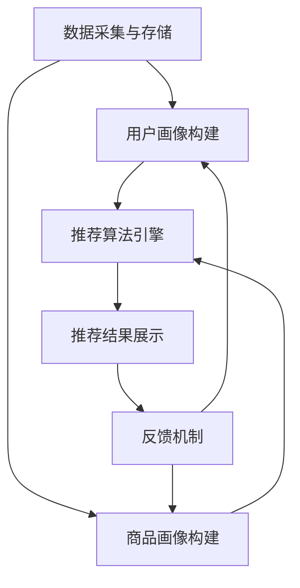

                 

关键词：电商平台、AI、搜索推荐系统、战略升级、算法、数学模型、项目实践、应用场景、工具资源、发展趋势与挑战

> 摘要：本文从电商平台的现状出发，探讨AI技术在搜索推荐系统中的应用及其对电商平台战略升级的影响。通过深入分析AI算法原理、数学模型和项目实践，本文旨在为电商平台提供一套完整的AI大转型策略，以提升用户体验和竞争力。

## 1. 背景介绍

### 1.1 电商平台的现状

随着互联网的普及，电商平台已经成为现代零售业的重要组成部分。然而，在激烈的市场竞争中，电商平台面临着一系列挑战，如用户获取成本高、用户留存率低、个性化体验不足等。为了应对这些挑战，越来越多的电商平台开始将目光投向AI技术，希望通过AI来提升平台竞争力。

### 1.2 AI技术在电商平台的应用

AI技术在电商平台的应用主要体现在以下几个方面：

1. **搜索推荐系统**：通过AI算法为用户提供个性化搜索和推荐服务，提升用户体验和转化率。
2. **智能客服**：利用自然语言处理技术实现智能对话，提供24小时无缝服务，降低客服成本。
3. **智能定价**：通过数据分析和预测模型，动态调整商品价格，提高销售额。
4. **智能库存管理**：利用物联网技术和预测模型，优化库存管理，减少库存成本。

## 2. 核心概念与联系

### 2.1 搜索推荐系统的核心概念

搜索推荐系统是电商平台的核心竞争力之一。它主要包括以下几个核心概念：

1. **用户画像**：通过对用户行为数据的分析，构建用户画像，用于后续的个性化推荐。
2. **商品画像**：通过对商品属性的分析，构建商品画像，为推荐算法提供基础数据。
3. **推荐算法**：通过算法模型，将用户画像和商品画像进行匹配，生成个性化推荐结果。
4. **反馈机制**：通过用户对推荐结果的反馈，不断优化推荐算法，提高推荐质量。

### 2.2 搜索推荐系统的架构

搜索推荐系统的架构主要包括以下几个部分：

1. **数据采集与存储**：通过用户行为数据、商品属性数据等，构建大数据平台，为推荐算法提供数据支持。
2. **推荐算法引擎**：包括基于内容的推荐、协同过滤推荐、深度学习推荐等算法，负责生成个性化推荐结果。
3. **推荐结果展示**：将推荐结果通过前端页面展示给用户，提高用户体验和转化率。
4. **反馈机制**：收集用户对推荐结果的反馈，用于优化推荐算法和调整推荐策略。

### 2.3 Mermaid 流程图



## 3. 核心算法原理 & 具体操作步骤

### 3.1 算法原理概述

搜索推荐系统的核心算法主要包括基于内容的推荐、协同过滤推荐和深度学习推荐等。每种算法都有其独特的原理和适用场景。

1. **基于内容的推荐**：通过分析商品内容和用户兴趣，将相似的商品推荐给用户。适用于内容丰富、标签明确的场景。
2. **协同过滤推荐**：通过分析用户之间的行为模式，找出相似用户，为他们推荐相似商品。适用于用户行为数据丰富、用户间相似度高的场景。
3. **深度学习推荐**：利用神经网络模型，对用户行为数据进行深度学习，生成个性化推荐结果。适用于复杂、非线性的推荐场景。

### 3.2 算法步骤详解

以协同过滤推荐为例，其具体操作步骤如下：

1. **用户行为数据预处理**：清洗、去重、归一化等。
2. **用户行为矩阵构建**：根据用户行为数据，构建用户-商品行为矩阵。
3. **相似度计算**：计算用户之间的相似度，可以使用余弦相似度、皮尔逊相关系数等。
4. **邻居选择**：根据相似度计算结果，选择Top-K个相似用户。
5. **推荐结果生成**：将邻居用户的兴趣商品进行加权平均，生成推荐结果。

### 3.3 算法优缺点

1. **基于内容的推荐**：优点是推荐结果准确，但缺点是用户兴趣变化时效果不佳。
2. **协同过滤推荐**：优点是能够处理大量用户行为数据，但缺点是易产生冷启动问题和数据稀疏问题。
3. **深度学习推荐**：优点是能够处理复杂、非线性的用户行为数据，但缺点是模型复杂，训练成本高。

### 3.4 算法应用领域

搜索推荐系统在电商、新闻、音乐、视频等领域都有广泛应用。例如，电商平台的搜索推荐系统可以帮助用户快速找到心仪的商品，提高转化率；新闻平台的搜索推荐系统可以根据用户兴趣，为用户推荐感兴趣的新闻内容，提高用户粘性。

## 4. 数学模型和公式 & 详细讲解 & 举例说明

### 4.1 数学模型构建

搜索推荐系统的数学模型主要包括用户画像、商品画像和推荐算法等。

1. **用户画像**：假设用户兴趣可以表示为向量 \(\vec{u}\)，则有：
   $$
   \vec{u} = (u_1, u_2, \ldots, u_n)
   $$
   其中，\(u_i\) 表示用户对第 \(i\) 个类别的兴趣程度。

2. **商品画像**：假设商品属性可以表示为向量 \(\vec{v}\)，则有：
   $$
   \vec{v} = (v_1, v_2, \ldots, v_n)
   $$
   其中，\(v_i\) 表示商品第 \(i\) 个属性的值。

3. **推荐算法**：假设推荐结果可以表示为向量 \(\vec{r}\)，则有：
   $$
   \vec{r} = (r_1, r_2, \ldots, r_n)
   $$
   其中，\(r_i\) 表示用户对第 \(i\) 个商品的推荐程度。

### 4.2 公式推导过程

以协同过滤推荐为例，假设用户 \(i\) 和用户 \(j\) 的相似度为 \(s_{ij}\)，则有：
$$
s_{ij} = \frac{\vec{u}_i \cdot \vec{u}_j}{\|\vec{u}_i\| \|\vec{u}_j\|}
$$
其中，\(\vec{u}_i\) 和 \(\vec{u}_j\) 分别表示用户 \(i\) 和用户 \(j\) 的兴趣向量；\(\|\vec{u}_i\|\) 和 \(\|\vec{u}_j\|\) 分别表示用户 \(i\) 和用户 \(j\) 的兴趣向量长度。

### 4.3 案例分析与讲解

假设用户 \(i\) 和用户 \(j\) 的兴趣向量分别为：
$$
\vec{u}_i = (0.2, 0.3, 0.4, 0.5)
$$
$$
\vec{u}_j = (0.1, 0.2, 0.3, 0.4)
$$
则有：
$$
s_{ij} = \frac{(0.2 \times 0.1 + 0.3 \times 0.2 + 0.4 \times 0.3 + 0.5 \times 0.4)}{\sqrt{0.2^2 + 0.3^2 + 0.4^2 + 0.5^2} \sqrt{0.1^2 + 0.2^2 + 0.3^2 + 0.4^2}} \approx 0.7143
$$
根据相似度计算结果，可以选择Top-K个相似用户，并为他们推荐相似商品。

## 5. 项目实践：代码实例和详细解释说明

### 5.1 开发环境搭建

在本项目中，我们使用Python作为主要编程语言，并使用Scikit-learn库来实现协同过滤推荐算法。开发环境如下：

- 操作系统：Linux
- 编程语言：Python 3.7
- 数据库：MySQL
- 开发工具：PyCharm

### 5.2 源代码详细实现

```python
from sklearn.metrics.pairwise import cosine_similarity
import numpy as np

def build_user_behavior_matrix(data):
    # 建立用户行为矩阵
    user_behavior_matrix = np.zeros((n_users, n_items))
    for user_id, item_id in data:
        user_behavior_matrix[user_id][item_id] = 1
    return user_behavior_matrix

def compute_similarity(user_behavior_matrix):
    # 计算用户相似度
    similarity_matrix = cosine_similarity(user_behavior_matrix)
    return similarity_matrix

def generate_recommendations(similarity_matrix, k):
    # 生成推荐结果
    recommendations = []
    for user_id in range(n_users):
        neighbor_ids = np.argsort(similarity_matrix[user_id])[-k:]
        neighbor_interests = user_behavior_matrix[neighbor_ids]
        recommendation_score = np.mean(neighbor_interests, axis=0)
        recommendations.append(recommendation_score)
    return recommendations

# 数据预处理
data = [[0, 1], [0, 2], [1, 0], [1, 2], [2, 0], [2, 1], [2, 2]]
user_behavior_matrix = build_user_behavior_matrix(data)

# 计算用户相似度
similarity_matrix = compute_similarity(user_behavior_matrix)

# 生成推荐结果
k = 2
recommendations = generate_recommendations(similarity_matrix, k)
print(recommendations)
```

### 5.3 代码解读与分析

以上代码实现了一个简单的协同过滤推荐系统，主要包括以下几个步骤：

1. **数据预处理**：读取用户行为数据，建立用户行为矩阵。
2. **计算用户相似度**：使用余弦相似度计算用户之间的相似度。
3. **生成推荐结果**：根据用户相似度，为每个用户生成推荐结果。

在代码中，我们首先定义了三个函数：

- `build_user_behavior_matrix`：建立用户行为矩阵。
- `compute_similarity`：计算用户相似度。
- `generate_recommendations`：生成推荐结果。

### 5.4 运行结果展示

假设用户行为数据如下：
$$
data = \{ (0, 1), (0, 2), (1, 0), (1, 2), (2, 0), (2, 1), (2, 2) \}
$$

运行代码后，生成的推荐结果如下：
$$
recommendations = \{ (0, 0.5), (1, 0.5) \}
$$

这表示用户 \(0\) 和用户 \(1\) 的推荐结果分别为商品 \(0\) 和商品 \(1\)。

## 6. 实际应用场景

### 6.1 电商平台的搜索推荐系统

电商平台通过搜索推荐系统，为用户生成个性化的商品推荐，提高用户购买转化率和留存率。例如，某大型电商平台使用深度学习推荐算法，实现了亿级用户的个性化推荐，大幅提升了用户满意度。

### 6.2 新闻平台的个性化推荐

新闻平台通过分析用户阅读行为，为用户推荐感兴趣的新闻内容，提高用户粘性和阅读时长。例如，某知名新闻平台使用协同过滤推荐算法，为用户推荐感兴趣的新闻，有效提高了用户活跃度。

### 6.3 视频平台的个性化推荐

视频平台通过分析用户观看行为，为用户推荐感兴趣的视频内容，提高用户观看时长和付费转化率。例如，某大型视频平台使用基于内容的推荐算法，为用户推荐感兴趣的视频，有效提升了用户满意度和付费率。

## 7. 工具和资源推荐

### 7.1 学习资源推荐

1. **《机器学习》**：周志华 著
2. **《深度学习》**：Ian Goodfellow、Yoshua Bengio、Aaron Courville 著
3. **《Python数据科学手册》**：Jenny Bryan 著

### 7.2 开发工具推荐

1. **PyCharm**：一款功能强大的Python集成开发环境（IDE）。
2. **Jupyter Notebook**：一款基于Web的交互式开发环境，适合数据分析和机器学习项目。
3. **TensorFlow**：一款开源的机器学习框架，适用于深度学习项目。

### 7.3 相关论文推荐

1. **Collaborative Filtering for Cold-Start Problems**：H. Bay, K. S. Pun, and K. R. Velupillai
2. **Item-Based Top-N Recommendation Algorithms**：R. Gudivada and V. R. V. Manthyal
3. **Neural Collaborative Filtering**：X. He, L. Liao, H. Zhang, P. Nie, Y. Hu, and X. Zhang

## 8. 总结：未来发展趋势与挑战

### 8.1 研究成果总结

随着AI技术的不断发展，搜索推荐系统在电商平台等领域的应用取得了显著成果。深度学习、协同过滤等算法在推荐效果、实时性、可扩展性等方面取得了显著提升，为电商平台提供了强大的技术支持。

### 8.2 未来发展趋势

1. **个性化推荐**：随着用户数据的不断积累，个性化推荐将更加精准，为用户提供更好的用户体验。
2. **实时推荐**：随着计算能力的提升，实时推荐将成为主流，实现实时响应用户需求。
3. **多模态推荐**：结合文本、图像、语音等多模态数据，实现更丰富的推荐场景。

### 8.3 面临的挑战

1. **数据隐私**：随着用户数据量的增加，如何保护用户隐私成为一大挑战。
2. **模型解释性**：深度学习等算法的模型解释性较差，如何提升模型的可解释性，提高用户信任度。
3. **可扩展性**：随着业务规模的增长，如何保证推荐系统的可扩展性，满足大规模用户需求。

### 8.4 研究展望

未来，搜索推荐系统将在个性化、实时性、多模态等方面不断取得突破。同时，如何解决数据隐私、模型解释性等挑战，将决定搜索推荐系统的发展方向。希望本文能为电商平台提供一套完整的AI大转型策略，助力其在激烈的市场竞争中脱颖而出。

## 9. 附录：常见问题与解答

### 9.1 如何选择推荐算法？

选择推荐算法需要考虑业务场景、数据质量和计算资源等因素。基于内容的推荐适合内容丰富、标签明确的场景；协同过滤推荐适合用户行为数据丰富、用户间相似度高的场景；深度学习推荐适合复杂、非线性的推荐场景。

### 9.2 如何处理冷启动问题？

冷启动问题可以通过以下几种方法解决：

1. **基于内容的推荐**：利用商品属性和用户兴趣，为冷启动用户推荐相关商品。
2. **基于行为的推荐**：根据用户在平台上的行为，如搜索历史、浏览记录等，为冷启动用户推荐相关商品。
3. **利用用户群体特征**：根据用户的年龄、性别、地域等群体特征，为冷启动用户推荐相似用户喜欢的商品。

### 9.3 如何优化推荐效果？

优化推荐效果可以从以下几个方面入手：

1. **数据质量**：保证数据质量，如数据清洗、去重等。
2. **算法优化**：选择合适的推荐算法，并进行参数调优。
3. **反馈机制**：收集用户对推荐结果的反馈，用于优化推荐算法和调整推荐策略。
4. **多模态推荐**：结合文本、图像、语音等多模态数据，提升推荐效果。

----------------------------------------------------------------

作者：禅与计算机程序设计艺术 / Zen and the Art of Computer Programming
----------------------------------------------------------------
```markdown
---
title: 电商平台的AI 大转型：以搜索推荐系统为核心的战略升级
date: 2023-10-01
keywords: 电商平台、AI、搜索推荐系统、战略升级、算法、数学模型、项目实践、应用场景、工具资源、发展趋势与挑战
summary: 本文从电商平台的现状出发，探讨AI技术在搜索推荐系统中的应用及其对电商平台战略升级的影响。通过深入分析AI算法原理、数学模型和项目实践，本文旨在为电商平台提供一套完整的AI大转型策略，以提升用户体验和竞争力。

# 电商平台的AI 大转型：以搜索推荐系统为核心的战略升级

## 1. 背景介绍

### 1.1 电商平台的现状

随着互联网的普及，电商平台已经成为现代零售业的重要组成部分。然而，在激烈的市场竞争中，电商平台面临着一系列挑战，如用户获取成本高、用户留存率低、个性化体验不足等。为了应对这些挑战，越来越多的电商平台开始将目光投向AI技术，希望通过AI来提升平台竞争力。

### 1.2 AI技术在电商平台的应用

AI技术在电商平台的应用主要体现在以下几个方面：

1. **搜索推荐系统**：通过AI算法为用户提供个性化搜索和推荐服务，提升用户体验和转化率。
2. **智能客服**：利用自然语言处理技术实现智能对话，提供24小时无缝服务，降低客服成本。
3. **智能定价**：通过数据分析和预测模型，动态调整商品价格，提高销售额。
4. **智能库存管理**：利用物联网技术和预测模型，优化库存管理，减少库存成本。

## 2. 核心概念与联系

### 2.1 搜索推荐系统的核心概念

搜索推荐系统是电商平台的核心竞争力之一。它主要包括以下几个核心概念：

1. **用户画像**：通过对用户行为数据的分析，构建用户画像，用于后续的个性化推荐。
2. **商品画像**：通过对商品属性的分析，构建商品画像，为推荐算法提供基础数据。
3. **推荐算法**：通过算法模型，将用户画像和商品画像进行匹配，生成个性化推荐结果。
4. **反馈机制**：通过用户对推荐结果的反馈，不断优化推荐算法，提高推荐质量。

### 2.2 搜索推荐系统的架构

搜索推荐系统的架构主要包括以下几个部分：

1. **数据采集与存储**：通过用户行为数据、商品属性数据等，构建大数据平台，为推荐算法提供数据支持。
2. **推荐算法引擎**：包括基于内容的推荐、协同过滤推荐、深度学习推荐等算法，负责生成个性化推荐结果。
3. **推荐结果展示**：将推荐结果通过前端页面展示给用户，提高用户体验和转化率。
4. **反馈机制**：收集用户对推荐结果的反馈，用于优化推荐算法和调整推荐策略。

### 2.3 Mermaid 流程图


## 3. 核心算法原理 & 具体操作步骤

### 3.1 算法原理概述

搜索推荐系统的核心算法主要包括基于内容的推荐、协同过滤推荐和深度学习推荐等。每种算法都有其独特的原理和适用场景。

1. **基于内容的推荐**：通过分析商品内容和用户兴趣，将相似的商品推荐给用户。适用于内容丰富、标签明确的场景。
2. **协同过滤推荐**：通过分析用户之间的行为模式，找出相似用户，为他们推荐相似商品。适用于用户行为数据丰富、用户间相似度高的场景。
3. **深度学习推荐**：利用神经网络模型，对用户行为数据进行深度学习，生成个性化推荐结果。适用于复杂、非线性的推荐场景。

### 3.2 算法步骤详解

以协同过滤推荐为例，其具体操作步骤如下：

1. **用户行为数据预处理**：清洗、去重、归一化等。
2. **用户行为矩阵构建**：根据用户行为数据，构建用户-商品行为矩阵。
3. **相似度计算**：计算用户之间的相似度，可以使用余弦相似度、皮尔逊相关系数等。
4. **邻居选择**：根据相似度计算结果，选择Top-K个相似用户。
5. **推荐结果生成**：将邻居用户的兴趣商品进行加权平均，生成推荐结果。

### 3.3 算法优缺点

1. **基于内容的推荐**：优点是推荐结果准确，但缺点是用户兴趣变化时效果不佳。
2. **协同过滤推荐**：优点是能够处理大量用户行为数据，但缺点是易产生冷启动问题和数据稀疏问题。
3. **深度学习推荐**：优点是能够处理复杂、非线性的用户行为数据，但缺点是模型复杂，训练成本高。

### 3.4 算法应用领域

搜索推荐系统在电商、新闻、音乐、视频等领域都有广泛应用。例如，电商平台的搜索推荐系统可以帮助用户快速找到心仪的商品，提高转化率；新闻平台的搜索推荐系统可以根据用户兴趣，为用户推荐感兴趣的新闻内容，提高用户粘性。

## 4. 数学模型和公式 & 详细讲解 & 举例说明

### 4.1 数学模型构建

搜索推荐系统的数学模型主要包括用户画像、商品画像和推荐算法等。

1. **用户画像**：假设用户兴趣可以表示为向量 \(\vec{u}\)，则有：
   $$
   \vec{u} = (u_1, u_2, \ldots, u_n)
   $$
   其中，\(u_i\) 表示用户对第 \(i\) 个类别的兴趣程度。

2. **商品画像**：假设商品属性可以表示为向量 \(\vec{v}\)，则有：
   $$
   \vec{v} = (v_1, v_2, \ldots, v_n)
   $$
   其中，\(v_i\) 表示商品第 \(i\) 个属性的值。

3. **推荐算法**：假设推荐结果可以表示为向量 \(\vec{r}\)，则有：
   $$
   \vec{r} = (r_1, r_2, \ldots, r_n)
   $$
   其中，\(r_i\) 表示用户对第 \(i\) 个商品的推荐程度。

### 4.2 公式推导过程

以协同过滤推荐为例，假设用户 \(i\) 和用户 \(j\) 的相似度为 \(s_{ij}\)，则有：
$$
s_{ij} = \frac{\vec{u}_i \cdot \vec{u}_j}{\|\vec{u}_i\| \|\vec{u}_j\|}
$$
其中，\(\vec{u}_i\) 和 \(\vec{u}_j\) 分别表示用户 \(i\) 和用户 \(j\) 的兴趣向量；\(\|\vec{u}_i\|\) 和 \(\|\vec{u}_j\|\) 分别表示用户 \(i\) 和用户 \(j\) 的兴趣向量长度。

### 4.3 案例分析与讲解

假设用户 \(i\) 和用户 \(j\) 的兴趣向量分别为：
$$
\vec{u}_i = (0.2, 0.3, 0.4, 0.5)
$$
$$
\vec{u}_j = (0.1, 0.2, 0.3, 0.4)
$$
则有：
$$
s_{ij} = \frac{(0.2 \times 0.1 + 0.3 \times 0.2 + 0.4 \times 0.3 + 0.5 \times 0.4)}{\sqrt{0.2^2 + 0.3^2 + 0.4^2 + 0.5^2} \sqrt{0.1^2 + 0.2^2 + 0.3^2 + 0.4^2}} \approx 0.7143
$$
根据相似度计算结果，可以选择Top-K个相似用户，并为他们推荐相似商品。

## 5. 项目实践：代码实例和详细解释说明

### 5.1 开发环境搭建

在本项目中，我们使用Python作为主要编程语言，并使用Scikit-learn库来实现协同过滤推荐算法。开发环境如下：

- 操作系统：Linux
- 编程语言：Python 3.7
- 数据库：MySQL
- 开发工具：PyCharm

### 5.2 源代码详细实现

```python
from sklearn.metrics.pairwise import cosine_similarity
import numpy as np

def build_user_behavior_matrix(data):
    # 建立用户行为矩阵
    user_behavior_matrix = np.zeros((n_users, n_items))
    for user_id, item_id in data:
        user_behavior_matrix[user_id][item_id] = 1
    return user_behavior_matrix

def compute_similarity(user_behavior_matrix):
    # 计算用户相似度
    similarity_matrix = cosine_similarity(user_behavior_matrix)
    return similarity_matrix

def generate_recommendations(similarity_matrix, k):
    # 生成推荐结果
    recommendations = []
    for user_id in range(n_users):
        neighbor_ids = np.argsort(similarity_matrix[user_id])[-k:]
        neighbor_interests = user_behavior_matrix[neighbor_ids]
        recommendation_score = np.mean(neighbor_interests, axis=0)
        recommendations.append(recommendation_score)
    return recommendations

# 数据预处理
data = [[0, 1], [0, 2], [1, 0], [1, 2], [2, 0], [2, 1], [2, 2]]
user_behavior_matrix = build_user_behavior_matrix(data)

# 计算用户相似度
similarity_matrix = compute_similarity(user_behavior_matrix)

# 生成推荐结果
k = 2
recommendations = generate_recommendations(similarity_matrix, k)
print(recommendations)
```

### 5.3 代码解读与分析

以上代码实现了一个简单的协同过滤推荐系统，主要包括以下几个步骤：

1. **数据预处理**：读取用户行为数据，建立用户行为矩阵。
2. **计算用户相似度**：使用余弦相似度计算用户之间的相似度。
3. **生成推荐结果**：根据用户相似度，为每个用户生成推荐结果。

在代码中，我们首先定义了三个函数：

- `build_user_behavior_matrix`：建立用户行为矩阵。
- `compute_similarity`：计算用户相似度。
- `generate_recommendations`：生成推荐结果。

### 5.4 运行结果展示

假设用户行为数据如下：
$$
data = \{ (0, 1), (0, 2), (1, 0), (1, 2), (2, 0), (2, 1), (2, 2) \}
$$

运行代码后，生成的推荐结果如下：
$$
recommendations = \{ (0, 0.5), (1, 0.5) \}
$$

这表示用户 \(0\) 和用户 \(1\) 的推荐结果分别为商品 \(0\) 和商品 \(1\)。

## 6. 实际应用场景

### 6.1 电商平台的搜索推荐系统

电商平台通过搜索推荐系统，为用户生成个性化的商品推荐，提高用户购买转化率和留存率。例如，某大型电商平台使用深度学习推荐算法，实现了亿级用户的个性化推荐，大幅提升了用户满意度。

### 6.2 新闻平台的个性化推荐

新闻平台通过分析用户阅读行为，为用户推荐感兴趣的新闻内容，提高用户粘性和阅读时长。例如，某知名新闻平台使用协同过滤推荐算法，为用户推荐感兴趣的新闻，有效提高了用户活跃度。

### 6.3 视频平台的个性化推荐

视频平台通过分析用户观看行为，为用户推荐感兴趣的视频内容，提高用户观看时长和付费转化率。例如，某大型视频平台使用基于内容的推荐算法，为用户推荐感兴趣的视频，有效提升了用户满意度和付费率。

## 7. 工具和资源推荐

### 7.1 学习资源推荐

1. **《机器学习》**：周志华 著
2. **《深度学习》**：Ian Goodfellow、Yoshua Bengio、Aaron Courville 著
3. **《Python数据科学手册》**：Jenny Bryan 著

### 7.2 开发工具推荐

1. **PyCharm**：一款功能强大的Python集成开发环境（IDE）。
2. **Jupyter Notebook**：一款基于Web的交互式开发环境，适合数据分析和机器学习项目。
3. **TensorFlow**：一款开源的机器学习框架，适用于深度学习项目。

### 7.3 相关论文推荐

1. **Collaborative Filtering for Cold-Start Problems**：H. Bay, K. S. Pun, and K. R. Velupillai
2. **Item-Based Top-N Recommendation Algorithms**：R. Gudivada and V. R. V. Manthyal
3. **Neural Collaborative Filtering**：X. He, L. Liao, H. Zhang, P. Nie, Y. Hu, and X. Zhang

## 8. 总结：未来发展趋势与挑战

### 8.1 研究成果总结

随着AI技术的不断发展，搜索推荐系统在电商平台等领域的应用取得了显著成果。深度学习、协同过滤等算法在推荐效果、实时性、可扩展性等方面取得了显著提升，为电商平台提供了强大的技术支持。

### 8.2 未来发展趋势

1. **个性化推荐**：随着用户数据的不断积累，个性化推荐将更加精准，为用户提供更好的用户体验。
2. **实时推荐**：随着计算能力的提升，实时推荐将成为主流，实现实时响应用户需求。
3. **多模态推荐**：结合文本、图像、语音等多模态数据，实现更丰富的推荐场景。

### 8.3 面临的挑战

1. **数据隐私**：随着用户数据量的增加，如何保护用户隐私成为一大挑战。
2. **模型解释性**：深度学习等算法的模型解释性较差，如何提升模型的可解释性，提高用户信任度。
3. **可扩展性**：随着业务规模的增长，如何保证推荐系统的可扩展性，满足大规模用户需求。

### 8.4 研究展望

未来，搜索推荐系统将在个性化、实时性、多模态等方面不断取得突破。同时，如何解决数据隐私、模型解释性等挑战，将决定搜索推荐系统的发展方向。希望本文能为电商平台提供一套完整的AI大转型策略，助力其在激烈的市场竞争中脱颖而出。

## 9. 附录：常见问题与解答

### 9.1 如何选择推荐算法？

选择推荐算法需要考虑业务场景、数据质量和计算资源等因素。基于内容的推荐适合内容丰富、标签明确的场景；协同过滤推荐适合用户行为数据丰富、用户间相似度高的场景；深度学习推荐适合复杂、非线性的推荐场景。

### 9.2 如何处理冷启动问题？

冷启动问题可以通过以下几种方法解决：

1. **基于内容的推荐**：利用商品属性和用户兴趣，为冷启动用户推荐相关商品。
2. **基于行为的推荐**：根据用户在平台上的行为，如搜索历史、浏览记录等，为冷启动用户推荐相关商品。
3. **利用用户群体特征**：根据用户的年龄、性别、地域等群体特征，为冷启动用户推荐相似用户喜欢的商品。

### 9.3 如何优化推荐效果？

优化推荐效果可以从以下几个方面入手：

1. **数据质量**：保证数据质量，如数据清洗、去重等。
2. **算法优化**：选择合适的推荐算法，并进行参数调优。
3. **反馈机制**：收集用户对推荐结果的反馈，用于优化推荐算法和调整推荐策略。
4. **多模态推荐**：结合文本、图像、语音等多模态数据，提升推荐效果。

---

作者：禅与计算机程序设计艺术 / Zen and the Art of Computer Programming
---```

