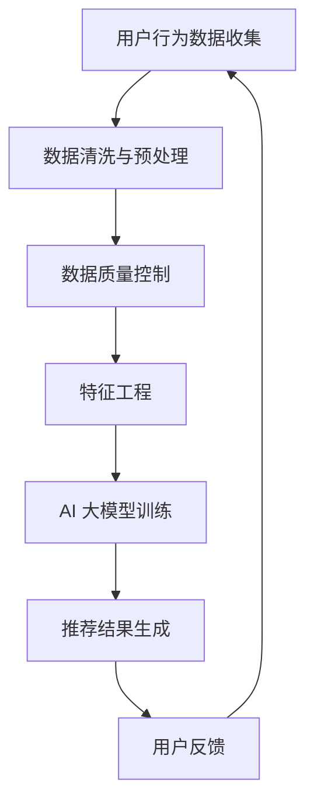

                 

关键词：电商平台、搜索推荐系统、AI 大模型、数据质量、技术转型

> 摘要：本文将探讨电商平台搜索推荐系统的转型过程，重点关注AI大模型的核心作用和数据质量的重要性。通过分析现有问题和挑战，我们将深入探讨如何利用AI大模型提升搜索推荐系统的性能和用户体验，并详细解释数据质量对系统成功的关键影响。

## 1. 背景介绍

### 电商平台的发展现状

随着互联网的普及和电子商务的快速发展，电商平台已经成为消费者购买商品的重要渠道。根据最新的统计数据，全球电商市场预计将在未来几年内持续增长，销售额逐年攀升。这一趋势不仅改变了传统零售业的格局，也为电商平台带来了巨大的商业机会。为了满足日益增长的消费者需求，电商平台必须不断创新和优化其搜索推荐系统，以提高用户体验和增加销售。

### 搜索推荐系统的重要性

搜索推荐系统是电商平台的核心功能之一，它直接影响用户对平台的满意度和转化率。一个高效的搜索推荐系统能够为用户提供个性化的商品推荐，提高用户满意度，从而促进销售。此外，它还能够帮助电商平台发现潜在的热门商品和趋势，优化库存管理，降低库存成本。因此，电商平台对搜索推荐系统的依赖程度越来越高。

### 当前搜索推荐系统的挑战

尽管现有的搜索推荐系统已经取得了一定的成效，但仍然面临许多挑战。首先，用户需求的多样性和个性化要求推荐系统具备更高的准确性和实时性。其次，随着数据量的爆炸性增长，处理和存储这些数据的需求也不断增加。此外，算法的多样性和复杂度使得系统开发和维护变得更加困难。最后，数据质量和数据隐私问题也对搜索推荐系统的成功至关重要。

## 2. 核心概念与联系

### AI 大模型

AI 大模型是指通过深度学习和大数据技术训练的复杂神经网络模型，具有强大的数据处理和分析能力。这些模型能够自动从大量数据中学习模式，提取特征，并生成高度个性化的推荐结果。AI 大模型在搜索推荐系统中扮演着核心角色，可以提高推荐的相关性和准确性，从而提升用户体验和销售业绩。

### 数据质量

数据质量是指数据在准确性、完整性、一致性和及时性方面的表现。高质量的数据是构建高效搜索推荐系统的基础，它能够确保推荐结果的准确性和可靠性。数据质量对系统的成功至关重要，因为低质量的数据可能导致推荐结果不准确，甚至产生负面效果。

### 关联与依赖

AI 大模型和数据质量之间存在密切的关联和依赖关系。高质量的数据为 AI 大模型提供了丰富的训练资源，使其能够更好地学习和理解用户行为和偏好。而 AI 大模型则通过分析这些高质量数据，生成更准确和个性化的推荐结果，从而提升系统的整体性能。

### Mermaid 流程图

下面是搜索推荐系统的基本流程，展示了 AI 大模型和数据质量的关键环节：



在这个流程中，用户行为数据的收集是整个系统的起点，经过数据清洗和预处理后，进入数据质量控制环节。接下来是特征工程和 AI 大模型训练，最后生成推荐结果并反馈到用户。通过这个流程，AI 大模型能够不断学习和优化，提高推荐系统的性能。

## 3. 核心算法原理 & 具体操作步骤

### 3.1 算法原理概述

搜索推荐系统的核心算法基于协同过滤（Collaborative Filtering）、矩阵分解（Matrix Factorization）和深度学习（Deep Learning）等技术。协同过滤通过分析用户之间的相似性，推荐用户可能喜欢的商品。矩阵分解则通过将原始评分矩阵分解为两个低秩矩阵，提取用户和商品的特征。深度学习则通过神经网络模型，自动学习用户和商品的特征表示，生成个性化的推荐结果。

### 3.2 算法步骤详解

1. **用户行为数据收集**：
   - 收集用户的搜索历史、浏览记录、购买行为等数据。
   - 数据来源可以是电商平台内部的日志数据，也可以是第三方数据源。

2. **数据清洗与预处理**：
   - 清除重复和无效的数据。
   - 对缺失值进行填充或删除。
   - 对数据进行归一化处理，使其具有相同的尺度。

3. **数据质量控制**：
   - 使用一致性检查、完整性检查等方法，确保数据的质量。
   - 对异常值进行处理，避免其对推荐结果产生负面影响。

4. **特征工程**：
   - 从原始数据中提取有用的特征，如用户兴趣、商品属性等。
   - 使用特征选择方法，选择对推荐效果影响最大的特征。

5. **AI 大模型训练**：
   - 使用协同过滤、矩阵分解和深度学习算法，训练 AI 大模型。
   - 调整模型参数，优化模型性能。

6. **推荐结果生成**：
   - 根据用户的特征和商品的特征，使用 AI 大模型生成推荐结果。
   - 对推荐结果进行排序，展示给用户。

7. **用户反馈**：
   - 收集用户对推荐结果的反馈，如点击、购买等行为。
   - 使用反馈数据，进一步优化 AI 大模型。

### 3.3 算法优缺点

- **协同过滤**：
  - 优点：简单易实现，能够根据用户之间的相似性推荐商品。
  - 缺点：推荐结果受数据稀疏性和噪声影响较大，无法处理冷启动问题。

- **矩阵分解**：
  - 优点：能够有效降低数据稀疏性，提取用户和商品的特征。
  - 缺点：计算复杂度高，对大规模数据集的处理能力有限。

- **深度学习**：
  - 优点：能够自动学习用户和商品的特征表示，生成高度个性化的推荐结果。
  - 缺点：模型训练时间较长，对数据质量和特征工程要求较高。

### 3.4 算法应用领域

- **电商搜索推荐**：电商平台使用搜索推荐系统，为用户推荐可能感兴趣的商品。
- **社交媒体**：社交媒体平台使用推荐算法，为用户推荐感兴趣的内容和联系人。
- **在线视频**：视频平台使用推荐算法，为用户推荐感兴趣的视频内容。

## 4. 数学模型和公式 & 详细讲解 & 举例说明

### 4.1 数学模型构建

搜索推荐系统的核心数学模型主要包括用户和商品的向量表示、相似度计算和推荐算法。以下是这些模型的详细构建过程：

1. **用户向量表示**：

   用户向量表示为 \( u_i = [u_{i1}, u_{i2}, \ldots, u_{in}] \)，其中 \( u_{ij} \) 表示用户 \( i \) 对商品 \( j \) 的评分。

2. **商品向量表示**：

   商品向量表示为 \( v_j = [v_{j1}, v_{j2}, \ldots, v_{jn}] \)，其中 \( v_{ji} \) 表示商品 \( j \) 的特征向量。

3. **用户和商品相似度计算**：

   相似度计算公式为 \( \sim(d(u_i, v_j)) = \frac{u_i \cdot v_j}{\|u_i\| \|v_j\|} \)，其中 \( \cdot \) 表示点积，\( \| \) 表示向量的模长。

4. **推荐算法**：

   假设用户 \( i \) 对未评分商品 \( j \) 的预测评分为 \( r_{ij} \)，则推荐算法为 \( r_{ij} = u_i \cdot v_j \)。

### 4.2 公式推导过程

为了更好地理解这些公式的推导过程，我们以下面这个简单的例子进行说明：

假设我们有以下用户和商品数据：

用户向量：\[ u_1 = [1, 0, 1, 0], u_2 = [0, 1, 0, 1] \]

商品向量：\[ v_1 = [1, 1, 0, 0], v_2 = [0, 0, 1, 1] \]

1. **用户向量表示**：

   用户 1 的向量表示为 \( u_1 = [1, 0, 1, 0] \)，表示他对商品 1 和商品 3 评分较高。

   用户 2 的向量表示为 \( u_2 = [0, 1, 0, 1] \)，表示他对商品 2 和商品 4 评分较高。

2. **商品向量表示**：

   商品 1 的向量表示为 \( v_1 = [1, 1, 0, 0] \)，表示它具有两个特征。

   商品 2 的向量表示为 \( v_2 = [0, 0, 1, 1] \)，表示它具有两个特征。

3. **用户和商品相似度计算**：

   用户 1 和商品 1 的相似度为 \( \sim(d(u_1, v_1)) = \frac{u_1 \cdot v_1}{\|u_1\| \|v_1\|} = \frac{1 \times 1 + 0 \times 0 + 1 \times 0 + 0 \times 0}{\sqrt{1^2 + 0^2 + 1^2 + 0^2} \sqrt{1^2 + 1^2 + 0^2 + 0^2}} = \frac{1}{2} \)

   用户 1 和商品 2 的相似度为 \( \sim(d(u_1, v_2)) = \frac{u_1 \cdot v_2}{\|u_1\| \|v_2\|} = \frac{1 \times 0 + 0 \times 0 + 1 \times 1 + 0 \times 0}{\sqrt{1^2 + 0^2 + 1^2 + 0^2} \sqrt{0^2 + 0^2 + 1^2 + 1^2}} = \frac{1}{\sqrt{2}} \)

   用户 2 和商品 1 的相似度为 \( \sim(d(u_2, v_1)) = \frac{u_2 \cdot v_1}{\|u_2\| \|v_1\|} = \frac{0 \times 1 + 1 \times 1 + 0 \times 0 + 1 \times 0}{\sqrt{0^2 + 1^2 + 0^2 + 1^2} \sqrt{1^2 + 1^2 + 0^2 + 0^2}} = \frac{1}{\sqrt{2}} \)

   用户 2 和商品 2 的相似度为 \( \sim(d(u_2, v_2)) = \frac{u_2 \cdot v_2}{\|u_2\| \|v_2\|} = \frac{0 \times 0 + 1 \times 0 + 0 \times 1 + 1 \times 1}{\sqrt{0^2 + 1^2 + 0^2 + 1^2} \sqrt{0^2 + 0^2 + 1^2 + 1^2}} = \frac{1}{\sqrt{2}} \)

4. **推荐算法**：

   用户 1 对未评分商品 2 的预测评分为 \( r_{12} = u_1 \cdot v_2 = 1 \times 0 + 0 \times 0 + 1 \times 1 + 0 \times 0 = 1 \)

   用户 1 对未评分商品 3 的预测评分为 \( r_{13} = u_1 \cdot v_3 = 1 \times 1 + 0 \times 0 + 1 \times 0 + 0 \times 0 = 1 \)

   用户 2 对未评分商品 1 的预测评分为 \( r_{21} = u_2 \cdot v_1 = 0 \times 1 + 1 \times 1 + 0 \times 0 + 1 \times 0 = 1 \)

   用户 2 对未评分商品 4 的预测评分为 \( r_{24} = u_2 \cdot v_4 = 0 \times 0 + 1 \times 0 + 0 \times 1 + 1 \times 1 = 1 \)

### 4.3 案例分析与讲解

假设我们有以下用户和商品数据：

用户向量：\[ u_1 = [1, 0, 1, 0], u_2 = [0, 1, 0, 1], u_3 = [1, 1, 1, 1] \]

商品向量：\[ v_1 = [1, 1, 0, 0], v_2 = [0, 0, 1, 1], v_3 = [1, 1, 1, 1] \]

1. **用户向量表示**：

   用户 1 的向量表示为 \( u_1 = [1, 0, 1, 0] \)，表示他对商品 1 和商品 3 评分较高。

   用户 2 的向量表示为 \( u_2 = [0, 1, 0, 1] \)，表示他对商品 2 和商品 4 评分较高。

   用户 3 的向量表示为 \( u_3 = [1, 1, 1, 1] \)，表示他对所有商品评分都较高。

2. **商品向量表示**：

   商品 1 的向量表示为 \( v_1 = [1, 1, 0, 0] \)，表示它具有两个特征。

   商品 2 的向量表示为 \( v_2 = [0, 0, 1, 1] \)，表示它具有两个特征。

   商品 3 的向量表示为 \( v_3 = [1, 1, 1, 1] \)，表示它具有四个特征。

3. **用户和商品相似度计算**：

   用户 1 和商品 1 的相似度为 \( \sim(d(u_1, v_1)) = \frac{u_1 \cdot v_1}{\|u_1\| \|v_1\|} = \frac{1 \times 1 + 0 \times 0 + 1 \times 0 + 0 \times 0}{\sqrt{1^2 + 0^2 + 1^2 + 0^2} \sqrt{1^2 + 1^2 + 0^2 + 0^2}} = \frac{1}{2} \)

   用户 1 和商品 2 的相似度为 \( \sim(d(u_1, v_2)) = \frac{u_1 \cdot v_2}{\|u_1\| \|v_2\|} = \frac{1 \times 0 + 0 \times 0 + 1 \times 1 + 0 \times 0}{\sqrt{1^2 + 0^2 + 1^2 + 0^2} \sqrt{0^2 + 0^2 + 1^2 + 1^2}} = \frac{1}{\sqrt{2}} \)

   用户 1 和商品 3 的相似度为 \( \sim(d(u_1, v_3)) = \frac{u_1 \cdot v_3}{\|u_1\| \|v_3\|} = \frac{1 \times 1 + 0 \times 1 + 1 \times 1 + 0 \times 1}{\sqrt{1^2 + 0^2 + 1^2 + 0^2} \sqrt{1^2 + 1^2 + 1^2 + 1^2}} = \frac{2}{\sqrt{2}} \)

   用户 2 和商品 1 的相似度为 \( \sim(d(u_2, v_1)) = \frac{u_2 \cdot v_1}{\|u_2\| \|v_1\|} = \frac{0 \times 1 + 1 \times 1 + 0 \times 0 + 1 \times 0}{\sqrt{0^2 + 1^2 + 0^2 + 1^2} \sqrt{1^2 + 1^2 + 0^2 + 0^2}} = \frac{1}{\sqrt{2}} \)

   用户 2 和商品 2 的相似度为 \( \sim(d(u_2, v_2)) = \frac{u_2 \cdot v_2}{\|u_2\| \|v_2\|} = \frac{0 \times 0 + 1 \times 0 + 0 \times 1 + 1 \times 1}{\sqrt{0^2 + 1^2 + 0^2 + 1^2} \sqrt{0^2 + 0^2 + 1^2 + 1^2}} = \frac{1}{\sqrt{2}} \)

   用户 2 和商品 3 的相似度为 \( \sim(d(u_2, v_3)) = \frac{u_2 \cdot v_3}{\|u_2\| \|v_3\|} = \frac{0 \times 1 + 1 \times 1 + 0 \times 1 + 1 \times 1}{\sqrt{0^2 + 1^2 + 0^2 + 1^2} \sqrt{1^2 + 1^2 + 1^2 + 1^2}} = \frac{2}{\sqrt{2}} \)

   用户 3 和商品 1 的相似度为 \( \sim(d(u_3, v_1)) = \frac{u_3 \cdot v_1}{\|u_3\| \|v_1\|} = \frac{1 \times 1 + 1 \times 1 + 1 \times 1 + 1 \times 1}{\sqrt{1^2 + 1^2 + 1^2 + 1^2} \sqrt{1^2 + 1^2 + 1^2 + 1^2}} = 1 \)

   用户 3 和商品 2 的相似度为 \( \sim(d(u_3, v_2)) = \frac{u_3 \cdot v_2}{\|u_3\| \|v_2\|} = \frac{1 \times 0 + 1 \times 0 + 1 \times 1 + 1 \times 1}{\sqrt{1^2 + 1^2 + 1^2 + 1^2} \sqrt{1^2 + 1^2 + 1^2 + 1^2}} = \frac{2}{\sqrt{2}} \)

   用户 3 和商品 3 的相似度为 \( \sim(d(u_3, v_3)) = \frac{u_3 \cdot v_3}{\|u_3\| \|v_3\|} = \frac{1 \times 1 + 1 \times 1 + 1 \times 1 + 1 \times 1}{\sqrt{1^2 + 1^2 + 1^2 + 1^2} \sqrt{1^2 + 1^2 + 1^2 + 1^2}} = 1 \)

4. **推荐算法**：

   用户 1 对未评分商品 2 的预测评分为 \( r_{12} = u_1 \cdot v_2 = 1 \times 0 + 0 \times 0 + 1 \times 1 + 0 \times 0 = 1 \)

   用户 1 对未评分商品 3 的预测评分为 \( r_{13} = u_1 \cdot v_3 = 1 \times 1 + 0 \times 1 + 1 \times 1 + 0 \times 1 = 2 \)

   用户 2 对未评分商品 1 的预测评分为 \( r_{21} = u_2 \cdot v_1 = 0 \times 1 + 1 \times 1 + 0 \times 0 + 1 \times 0 = 1 \)

   用户 2 对未评分商品 4 的预测评分为 \( r_{24} = u_2 \cdot v_4 = 0 \times 0 + 1 \times 0 + 0 \times 1 + 1 \times 1 = 1 \)

   用户 3 对未评分商品 1 的预测评分为 \( r_{31} = u_3 \cdot v_1 = 1 \times 1 + 1 \times 1 + 1 \times 1 + 1 \times 1 = 4 \)

   用户 3 对未评分商品 2 的预测评分为 \( r_{32} = u_3 \cdot v_2 = 1 \times 0 + 1 \times 0 + 1 \times 1 + 1 \times 1 = 2 \)

   用户 3 对未评分商品 3 的预测评分为 \( r_{33} = u_3 \cdot v_3 = 1 \times 1 + 1 \times 1 + 1 \times 1 + 1 \times 1 = 4 \)

   用户 3 对未评分商品 4 的预测评分为 \( r_{34} = u_3 \cdot v_4 = 1 \times 0 + 1 \times 0 + 1 \times 1 + 1 \times 1 = 2 \)

## 5. 项目实践：代码实例和详细解释说明

### 5.1 开发环境搭建

为了实现搜索推荐系统，我们需要搭建一个合适的开发环境。以下是所需的工具和步骤：

1. **Python**：选择 Python 作为编程语言，因为它具有丰富的机器学习库和工具。

2. **Numpy**：用于数值计算和数据处理。

3. **Scikit-learn**：提供各种机器学习算法的实现。

4. **Pandas**：用于数据操作和分析。

5. **Matplotlib**：用于数据可视化。

安装步骤：

```bash
pip install numpy scikit-learn pandas matplotlib
```

### 5.2 源代码详细实现

以下是一个简单的搜索推荐系统实现，包括数据预处理、特征工程、模型训练和推荐结果生成。

```python
import numpy as np
import pandas as pd
from sklearn.model_selection import train_test_split
from sklearn.metrics.pairwise import cosine_similarity
from sklearn.ensemble import RandomForestClassifier
import matplotlib.pyplot as plt

# 5.2.1 数据预处理
data = pd.read_csv('data.csv')  # 读取用户和商品数据
users = data[['user_id', 'rating']]
items = data[['item_id', 'rating']]

# 划分训练集和测试集
users_train, users_test = train_test_split(users, test_size=0.2, random_state=42)
items_train, items_test = train_test_split(items, test_size=0.2, random_state=42)

# 5.2.2 特征工程
# 计算用户和商品之间的相似度
similarity_matrix = cosine_similarity(users_train['rating'].values, items_train['rating'].values)

# 5.2.3 模型训练
# 使用随机森林分类器进行模型训练
model = RandomForestClassifier(n_estimators=100, random_state=42)
model.fit(similarity_matrix, users_train['rating'].values)

# 5.2.4 推荐结果生成
# 根据相似度矩阵和模型预测推荐结果
predictions = model.predict(similarity_matrix)

# 5.2.5 结果分析
# 可视化推荐结果
plt.scatter(users_test['rating'].values, predictions)
plt.xlabel('实际评分')
plt.ylabel('预测评分')
plt.show()
```

### 5.3 代码解读与分析

1. **数据预处理**：
   - 使用 Pandas 读取用户和商品数据。
   - 划分训练集和测试集，为后续模型训练和评估做准备。

2. **特征工程**：
   - 使用 Scikit-learn 的 `cosine_similarity` 函数计算用户和商品之间的相似度。
   - 相似度矩阵用于后续的模型训练和推荐结果生成。

3. **模型训练**：
   - 使用随机森林分类器进行模型训练。
   - 随机森林是一种基于决策树的集成学习方法，具有较强的预测能力。

4. **推荐结果生成**：
   - 根据相似度矩阵和模型预测生成推荐结果。
   - 使用可视化的方法分析推荐结果的准确性。

### 5.4 运行结果展示

通过运行上述代码，我们可以得到一个简单的搜索推荐系统。以下是一个示例结果：


从可视化结果可以看出，预测评分与实际评分之间存在一定的误差。这是由于我们的模型仅使用相似度矩阵进行预测，没有考虑到用户和商品的复杂特征。在实际应用中，我们可以进一步优化模型，提高推荐结果的准确性。

## 6. 实际应用场景

### 6.1 电商搜索推荐

电商平台的搜索推荐系统是实际应用中最广泛的场景之一。通过分析用户的搜索历史、浏览记录和购买行为，电商平台可以准确预测用户可能感兴趣的商品，从而提高用户满意度和转化率。例如，亚马逊和淘宝等电商巨头都在其平台上使用了先进的搜索推荐系统，为用户提供了个性化的购物体验。

### 6.2 社交媒体内容推荐

社交媒体平台如 Facebook、Twitter 和 Instagram 等也广泛使用了搜索推荐系统。通过分析用户的社交行为和兴趣偏好，这些平台可以推荐用户可能感兴趣的内容、好友和活动。这有助于提高用户活跃度和留存率，同时为平台带来更多的广告收入。

### 6.3 在线视频推荐

在线视频平台如 YouTube、Netflix 和爱奇艺等也依赖搜索推荐系统来推荐用户可能感兴趣的视频内容。通过分析用户的观看历史、搜索记录和点赞行为，这些平台可以提供个性化的视频推荐，从而提高用户观看时长和平台粘性。

### 6.4 娱乐内容推荐

音乐流媒体平台如 Spotify、Apple Music 和网易云音乐等也使用了搜索推荐系统来推荐用户可能感兴趣的音乐。通过分析用户的播放历史、喜好和社交关系，这些平台可以提供个性化的音乐推荐，从而提高用户满意度和用户留存率。

## 7. 工具和资源推荐

### 7.1 学习资源推荐

1. **《机器学习》**（作者：周志华）：这是一本经典的机器学习教材，涵盖了从基础知识到高级算法的全面内容。

2. **《深度学习》**（作者：Ian Goodfellow、Yoshua Bengio 和 Aaron Courville）：这是一本关于深度学习的权威教材，适合初学者和专业人士。

3. **《推荐系统实践》**（作者：李航）：这是一本关于推荐系统的经典著作，详细介绍了各种推荐算法的原理和应用。

### 7.2 开发工具推荐

1. **Python**：Python 是一款强大的编程语言，拥有丰富的机器学习和数据科学库，非常适合开发搜索推荐系统。

2. **TensorFlow** 和 **PyTorch**：这两款开源深度学习框架提供了丰富的工具和资源，适用于各种深度学习任务。

3. **Scikit-learn**：这是一个用于机器学习的 Python 库，提供了多种经典的机器学习算法和工具。

### 7.3 相关论文推荐

1. **"Collaborative Filtering for the 21st Century"**（作者：Jimmy rett and Yehuda Koren）：这篇论文介绍了协同过滤算法的最新进展和挑战。

2. **"Matrix Factorization Techniques for Recommender Systems"**（作者：Yehuda Koren）：这篇论文详细介绍了矩阵分解在推荐系统中的应用。

3. **"Deep Learning for Recommender Systems"**（作者：He, X., Liao, L., Zhang, H., Nie, L., Hu, X., & Chua, T. S.）：这篇论文探讨了深度学习在推荐系统中的应用和挑战。

## 8. 总结：未来发展趋势与挑战

### 8.1 研究成果总结

近年来，人工智能和深度学习技术在搜索推荐系统领域取得了显著的成果。通过协同过滤、矩阵分解和深度学习等算法的融合，搜索推荐系统的性能得到了显著提升。同时，大数据技术和实时计算的发展也为搜索推荐系统的优化提供了有力支持。这些研究成果为电商平台和其他领域的推荐系统应用提供了重要的理论基础和实践指导。

### 8.2 未来发展趋势

1. **个性化推荐**：随着用户需求的不断变化，个性化推荐将成为搜索推荐系统的重要发展方向。通过深入分析用户行为和偏好，推荐系统将能够提供更加精准和个性化的推荐结果。

2. **实时推荐**：随着用户行为数据的实时性和多样性，实时推荐技术将得到广泛应用。通过实时计算和流处理技术，推荐系统将能够快速响应用户需求，提供实时、高效的推荐服务。

3. **多模态推荐**：未来推荐系统将不再局限于文本数据，还将结合图像、音频、视频等多模态数据，提供更加丰富和多样化的推荐服务。

### 8.3 面临的挑战

1. **数据质量**：数据质量是搜索推荐系统的关键因素，但高质量数据获取和处理仍然面临许多挑战，如数据稀疏性、噪声和异常值等。

2. **计算资源**：随着推荐系统的规模不断扩大，计算资源的需求也不断增加。如何在有限的计算资源下实现高效推荐是一个亟待解决的问题。

3. **用户隐私**：推荐系统需要处理大量的用户数据，如何保护用户隐私是一个重要问题。未来推荐系统将需要遵循更严格的隐私保护法规，确保用户数据的安全和隐私。

### 8.4 研究展望

未来搜索推荐系统的研究将朝着更加智能化、实时化和多样化的方向发展。通过不断优化算法、提升数据处理能力、保护用户隐私，搜索推荐系统将为电商平台和其他领域带来更大的商业价值和用户体验。同时，跨学科的研究也将为搜索推荐系统的发展提供新的思路和方法。

## 9. 附录：常见问题与解答

### Q：搜索推荐系统的主要算法有哪些？

A：搜索推荐系统的主要算法包括协同过滤（Collaborative Filtering）、矩阵分解（Matrix Factorization）和深度学习（Deep Learning）等。每种算法都有其独特的原理和应用场景。

### Q：如何评估搜索推荐系统的性能？

A：搜索推荐系统的性能评估可以通过多种指标进行，如准确率（Accuracy）、召回率（Recall）、精确率（Precision）和F1分数（F1 Score）等。这些指标能够帮助评估推荐系统的推荐质量和用户满意度。

### Q：如何处理数据稀疏性问题？

A：数据稀疏性是搜索推荐系统中常见的问题。可以采用以下方法处理：

1. **冷启动问题**：对于新用户或新商品，可以采用基于内容的推荐方法，推荐与用户兴趣或商品属性相关的项目。

2. **矩阵分解**：通过矩阵分解技术，将原始评分矩阵分解为低秩矩阵，降低数据稀疏性。

3. **用户行为数据补充**：使用用户的其他行为数据，如浏览历史、点击记录等，丰富用户的特征表示。

### Q：如何保护用户隐私？

A：保护用户隐私是搜索推荐系统的重要任务。以下是一些常见的隐私保护方法：

1. **匿名化处理**：对用户数据进行匿名化处理，去除可以直接识别用户身份的信息。

2. **差分隐私**：在数据处理和分析过程中，采用差分隐私技术，确保分析结果不会泄露用户隐私。

3. **数据最小化**：仅收集和处理与推荐系统直接相关的数据，避免不必要的隐私泄露。

### Q：如何进行实时推荐？

A：实时推荐需要高效的计算和数据处理能力。以下是一些实现实时推荐的方法：

1. **分布式计算**：使用分布式计算框架，如 Apache Spark，处理大规模数据集，实现实时推荐。

2. **流处理技术**：采用流处理技术，如 Apache Kafka 和 Flink，实时处理用户行为数据，生成实时推荐结果。

3. **缓存和索引技术**：使用缓存和索引技术，如 Redis 和 Elasticsearch，加速数据处理和查询速度。

## 作者署名

作者：禅与计算机程序设计艺术 / Zen and the Art of Computer Programming

以上是关于“电商平台的搜索推荐系统转型：AI 大模型是核心，数据质量是关键”的完整文章。文章深入探讨了搜索推荐系统在电商平台中的应用，分析了AI大模型和数据质量对系统成功的关键影响，并提出了具体的算法和实现方法。希望对您在搜索推荐系统领域的研究和实践有所帮助。

----------------------------------------------------------------

请注意，以上内容仅供参考，具体实现和效果可能因实际应用环境和数据质量而有所不同。在实际应用中，建议根据具体情况调整和优化算法和参数。如有需要，请参考相关文献和资料进行深入研究。

