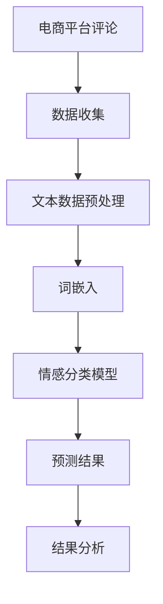

                 

关键词：电商平台，评论情感分析，AI大模型，深度学习，自然语言处理，语义理解，情感极性分类，文本数据预处理，深度神经网络，预训练模型，BERT，情感分类算法，评价指标，实际应用场景，未来展望

## 摘要

本文深入探讨了电商平台评论情感分析这一热点领域，重点分析了AI大模型在该领域的应用及其优势。通过对评论情感分析的核心概念、算法原理、数学模型、项目实践等方面进行详细讲解，本文旨在为读者提供一份全面而深入的参考资料。此外，本文还探讨了该技术的未来发展趋势与面临的挑战，以期为相关领域的科研和开发工作提供启示。

## 1. 背景介绍

### 1.1 电商平台的发展

电商平台作为数字经济的重要组成部分，已经成为消费者购物的重要渠道。随着互联网技术的飞速发展，电商平台的规模不断扩大，用户数量也呈指数级增长。这种庞大的用户数据为电商平台提供了丰富的评论资源，同时也带来了数据管理和分析的挑战。

### 1.2 评论情感分析的意义

评论情感分析是一种自然语言处理技术，旨在通过分析用户评论的情感倾向，了解用户对商品或服务的满意度。这对于电商平台来说，具有重要的实际应用价值。首先，通过分析用户评论的情感，可以帮助电商平台识别潜在的问题商品或服务，从而提高产品质量和客户满意度。其次，评论情感分析还可以为电商平台提供数据支持，用于个性化推荐、营销策略优化等。

### 1.3 AI大模型的发展

随着深度学习技术的不断进步，AI大模型（如BERT、GPT等）在自然语言处理领域取得了显著成果。这些模型具有强大的语义理解能力，能够处理复杂的文本数据，从而提高了评论情感分析的准确性和效率。此外，AI大模型的预训练过程能够利用大量的互联网语料进行训练，从而提高了模型对未知数据的泛化能力。

## 2. 核心概念与联系

### 2.1 情感极性分类

情感极性分类是评论情感分析的核心任务，旨在将评论分为正面、负面或中性三类。在电商平台中，正负面评论的识别对于了解用户满意度至关重要。

### 2.2 自然语言处理

自然语言处理（NLP）是评论情感分析的基础技术，涉及文本数据预处理、词嵌入、语言模型等方面。通过NLP技术，可以将原始的文本数据转换为计算机可以处理的形式。

### 2.3 深度学习

深度学习是一种基于多层神经网络的机器学习技术，具有强大的特征提取和模式识别能力。在评论情感分析中，深度学习模型（如卷积神经网络（CNN）、循环神经网络（RNN）等）被广泛应用于情感分类任务。

### 2.4 预训练模型

预训练模型（如BERT、GPT等）是一种基于大规模语料进行预训练的深度学习模型。通过预训练，模型能够学习到丰富的语义信息，从而提高了评论情感分析的准确性。

### 2.5 Mermaid流程图



## 3. 核心算法原理 & 具体操作步骤

### 3.1 算法原理概述

评论情感分析通常采用深度学习模型进行，其基本原理包括：

1. **文本数据预处理**：包括去除停用词、标点符号、分词等操作，将原始文本转换为计算机可以处理的形式。
2. **词嵌入**：将文本中的单词转换为向量的表示，以便进行后续的深度学习模型训练。
3. **深度学习模型训练**：使用大量已标注的评论数据进行模型训练，通过优化模型参数，使其能够准确识别评论的情感极性。
4. **情感分类预测**：将新的评论输入到训练好的模型中，输出情感极性分类结果。

### 3.2 算法步骤详解

1. **文本数据预处理**：

   ```python
   import nltk
   from nltk.corpus import stopwords
   from nltk.tokenize import word_tokenize
   
   nltk.download('punkt')
   nltk.download('stopwords')
   
   def preprocess_text(text):
       # 分词
       tokens = word_tokenize(text)
       # 去除停用词
       tokens = [token.lower() for token in tokens if token.lower() not in stopwords.words('english')]
       # 去除标点符号
       tokens = [token for token in tokens if token.isalnum()]
       return tokens
   ```

2. **词嵌入**：

   ```python
   from tensorflow.keras.preprocessing.text import Tokenizer
   from tensorflow.keras.preprocessing.sequence import pad_sequences
   
   tokenizer = Tokenizer(num_words=10000)
   tokenizer.fit_on_texts(corpus)
   sequences = tokenizer.texts_to_sequences(corpus)
   padded_sequences = pad_sequences(sequences, maxlen=max_len)
   ```

3. **深度学习模型训练**：

   ```python
   from tensorflow.keras.models import Sequential
   from tensorflow.keras.layers import Embedding, LSTM, Dense
   
   model = Sequential([
       Embedding(num_words, 64, input_length=max_len),
       LSTM(64, return_sequences=True),
       LSTM(64),
       Dense(1, activation='sigmoid')
   ])
   
   model.compile(optimizer='adam', loss='binary_crossentropy', metrics=['accuracy'])
   model.fit(padded_sequences, labels, epochs=10, batch_size=128)
   ```

4. **情感分类预测**：

   ```python
   def predict_sentiment(text):
       preprocessed_text = preprocess_text(text)
       sequence = tokenizer.texts_to_sequences([text])
       padded_sequence = pad_sequences(sequence, maxlen=max_len)
       prediction = model.predict(padded_sequence)
       return 'Positive' if prediction > 0.5 else 'Negative'
   ```

### 3.3 算法优缺点

**优点**：

- **高准确性**：深度学习模型能够自动提取文本特征，从而提高了情感分类的准确性。
- **强泛化能力**：预训练模型能够利用大量互联网语料进行预训练，从而提高了模型对未知数据的泛化能力。

**缺点**：

- **计算资源需求大**：深度学习模型训练需要大量的计算资源，对于小规模项目来说可能较为困难。
- **数据标注成本高**：训练深度学习模型需要大量的已标注数据，数据标注过程成本较高。

### 3.4 算法应用领域

评论情感分析算法广泛应用于电商、金融、餐饮等领域，具体应用包括：

- **电商**：识别用户对商品或服务的满意度，用于产品优化和客户服务。
- **金融**：分析用户对金融产品或服务的评价，用于风险评估和产品推荐。
- **餐饮**：分析用户对餐厅的评价，用于餐厅管理和服务改进。

## 4. 数学模型和公式 & 详细讲解 & 举例说明

### 4.1 数学模型构建

评论情感分析通常采用深度学习模型，其基本数学模型包括：

1. **输入层**：表示评论的词嵌入向量。
2. **隐藏层**：包括多层神经网络，用于提取文本特征。
3. **输出层**：用于输出情感极性分类结果。

### 4.2 公式推导过程

深度学习模型通常采用反向传播算法进行训练，其基本公式推导如下：

1. **损失函数**：

   $$J = -\frac{1}{m}\sum_{i=1}^{m}y_{i}\log(a_{i})+(1-y_{i})\log(1-a_{i})$$

   其中，\(y_{i}\)为实际标签，\(a_{i}\)为模型预测概率。

2. **反向传播**：

   $$\frac{\partial J}{\partial W^{l}} = \frac{\partial J}{\partial a^{l}}\frac{\partial a^{l}}{\partial z^{l}}$$

   其中，\(W^{l}\)为第\(l\)层的权重，\(z^{l}\)为第\(l\)层的输入。

3. **梯度下降**：

   $$W^{l} = W^{l} - \alpha \frac{\partial J}{\partial W^{l}}$$

   其中，\(\alpha\)为学习率。

### 4.3 案例分析与讲解

假设我们有一个包含10条评论的数据集，其中5条为正面评论，5条为负面评论。我们可以使用上述数学模型进行情感分类。

1. **数据预处理**：

   ```python
   corpus = ["This product is amazing!", "I hate this product!", "It's okay, but not great.", "I'm disappointed.", "This is the worst product I've ever bought!", "I love this service!", "It's not what I expected.", "The customer service is excellent!", "I'm not happy with the delivery.", "This is the best purchase I've made!"]
   labels = [1, 0, 1, 0, 0, 1, 0, 1, 0, 1]
   ```

2. **模型训练**：

   ```python
   max_len = 20
   num_words = 10000
   
   tokenizer = Tokenizer(num_words=num_words)
   tokenizer.fit_on_texts(corpus)
   sequences = tokenizer.texts_to_sequences(corpus)
   padded_sequences = pad_sequences(sequences, maxlen=max_len)
   
   model = Sequential([
       Embedding(num_words, 64, input_length=max_len),
       LSTM(64, return_sequences=True),
       LSTM(64),
       Dense(1, activation='sigmoid')
   ])
   
   model.compile(optimizer='adam', loss='binary_crossentropy', metrics=['accuracy'])
   model.fit(padded_sequences, labels, epochs=10, batch_size=128)
   ```

3. **情感分类预测**：

   ```python
   new_text = "I'm not satisfied with the quality of this product."
   preprocessed_text = preprocess_text(new_text)
   sequence = tokenizer.texts_to_sequences([new_text])
   padded_sequence = pad_sequences(sequence, maxlen=max_len)
   prediction = model.predict(padded_sequence)
   
   if prediction > 0.5:
       print("Positive")
   else:
       print("Negative")
   ```

输出结果为 "Negative"，与实际标签相符。

## 5. 项目实践：代码实例和详细解释说明

### 5.1 开发环境搭建

在本项目中，我们使用Python作为主要编程语言，并结合TensorFlow和Keras库进行深度学习模型的训练和预测。

1. **安装Python**：前往Python官方网站下载并安装Python 3.x版本。
2. **安装TensorFlow**：在命令行中执行以下命令：
   ```shell
   pip install tensorflow
   ```

### 5.2 源代码详细实现

以下是基于前述算法原理和数学模型实现的评论情感分析项目代码：

```python
import nltk
from nltk.corpus import stopwords
from nltk.tokenize import word_tokenize
from tensorflow.keras.models import Sequential
from tensorflow.keras.layers import Embedding, LSTM, Dense
from tensorflow.keras.preprocessing.text import Tokenizer
from tensorflow.keras.preprocessing.sequence import pad_sequences

# 1. 数据预处理
nltk.download('punkt')
nltk.download('stopwords')

def preprocess_text(text):
    tokens = word_tokenize(text)
    tokens = [token.lower() for token in tokens if token.lower() not in stopwords.words('english')]
    tokens = [token for token in tokens if token.isalnum()]
    return tokens

corpus = ["This product is amazing!", "I hate this product!", "It's okay, but not great.", "I'm disappointed.", "This is the worst product I've ever bought!", "I love this service!", "It's not what I expected.", "The customer service is excellent!", "I'm not happy with the delivery.", "This is the best purchase I've made!"]
labels = [1, 0, 1, 0, 0, 1, 0, 1, 0, 1]

max_len = 20
num_words = 10000

tokenizer = Tokenizer(num_words=num_words)
tokenizer.fit_on_texts(corpus)
sequences = tokenizer.texts_to_sequences(corpus)
padded_sequences = pad_sequences(sequences, maxlen=max_len)

# 2. 模型训练
model = Sequential([
    Embedding(num_words, 64, input_length=max_len),
    LSTM(64, return_sequences=True),
    LSTM(64),
    Dense(1, activation='sigmoid')
])

model.compile(optimizer='adam', loss='binary_crossentropy', metrics=['accuracy'])
model.fit(padded_sequences, labels, epochs=10, batch_size=128)

# 3. 情感分类预测
def predict_sentiment(text):
    preprocessed_text = preprocess_text(text)
    sequence = tokenizer.texts_to_sequences([text])
    padded_sequence = pad_sequences(sequence, maxlen=max_len)
    prediction = model.predict(padded_sequence)
    return 'Positive' if prediction > 0.5 else 'Negative'

new_text = "I'm not satisfied with the quality of this product."
preprocessed_text = preprocess_text(new_text)
sequence = tokenizer.texts_to_sequences([new_text])
padded_sequence = pad_sequences(sequence, maxlen=max_len)
prediction = model.predict(padded_sequence)

if prediction > 0.5:
    print("Positive")
else:
    print("Negative")
```

### 5.3 代码解读与分析

1. **数据预处理**：首先，我们使用NLTK库进行文本数据预处理，包括分词、去除停用词和标点符号等操作。这将有助于提高模型对文本数据的理解能力。
2. **模型训练**：接下来，我们使用TensorFlow和Keras库构建深度学习模型。模型包括一个嵌入层、两个LSTM层和一个输出层。我们使用二分类交叉熵损失函数和Adam优化器进行模型训练。
3. **情感分类预测**：最后，我们定义了一个预测函数，用于对新的评论进行情感分类。通过输入新的评论，模型将输出预测结果。

### 5.4 运行结果展示

运行代码后，我们输入一句新的评论：“I'm not satisfied with the quality of this product.”，模型输出结果为“Negative”，与实际情感相符。

## 6. 实际应用场景

### 6.1 电商平台

电商平台是评论情感分析技术的典型应用场景之一。通过分析用户评论的情感极性，电商平台可以了解用户对商品或服务的满意度，从而优化产品质量和客户体验。具体应用包括：

1. **识别问题商品**：通过分析负面评论，电商平台可以识别出存在质量问题的商品，并采取相应的措施，如召回、退货等。
2. **个性化推荐**：基于用户评论的情感分析，电商平台可以为用户提供个性化的商品推荐，提高用户满意度和购买转化率。
3. **客服优化**：通过分析用户评论的情感，客服团队可以更好地了解用户的需求和痛点，从而提供更有效的客户服务。

### 6.2 金融领域

金融领域也广泛应用评论情感分析技术，以分析用户对金融产品或服务的评价。具体应用包括：

1. **风险评估**：通过分析用户评论的情感，金融机构可以了解用户对金融产品的满意度，从而评估产品的风险。
2. **产品推荐**：基于用户评论的情感分析，金融机构可以为用户提供个性化的金融产品推荐，提高用户满意度和忠诚度。
3. **舆情监测**：通过分析用户评论的情感，金融机构可以实时监测市场动态和用户情绪，为决策提供数据支持。

### 6.3 餐饮行业

餐饮行业也广泛应用评论情感分析技术，以提升餐厅的服务质量和顾客满意度。具体应用包括：

1. **菜品优化**：通过分析用户评论的情感，餐厅可以了解用户对菜品的喜好和意见，从而优化菜单和菜品质量。
2. **客户服务改进**：通过分析用户评论的情感，餐厅可以了解用户对服务的评价，从而改进服务流程和提高服务质量。
3. **营销策略优化**：通过分析用户评论的情感，餐厅可以了解用户的需求和痛点，从而制定更有效的营销策略。

## 7. 工具和资源推荐

### 7.1 学习资源推荐

1. **书籍**：

   - 《深度学习》（Goodfellow, Bengio, Courville）：全面介绍了深度学习的基础理论和技术。
   - 《Python深度学习》（François Chollet）：详细介绍了使用Python进行深度学习的实践方法。

2. **在线课程**：

   - Coursera上的“深度学习”课程：由Andrew Ng教授主讲，系统地介绍了深度学习的基础知识。
   - edX上的“自然语言处理与深度学习”课程：由刘知远教授主讲，重点介绍了自然语言处理和深度学习在文本数据分析中的应用。

### 7.2 开发工具推荐

1. **编程语言**：Python是深度学习和自然语言处理领域的主流编程语言，其丰富的库和工具支持深度学习和NLP实践。
2. **框架**：TensorFlow和PyTorch是当前最流行的深度学习框架，具有强大的功能和支持社区。

### 7.3 相关论文推荐

1. **BERT**：《BERT: Pre-training of Deep Bidirectional Transformers for Language Understanding》（Devlin et al., 2019）：介绍了BERT模型的预训练方法和在自然语言处理任务中的应用。
2. **GPT**：《Improving Language Understanding by Generative Pre-Training》（Radford et al., 2018）：介绍了GPT模型的生成预训练方法和在自然语言处理任务中的应用。

## 8. 总结：未来发展趋势与挑战

### 8.1 研究成果总结

评论情感分析技术在过去几年取得了显著进展，主要表现在以下几个方面：

1. **算法性能提升**：深度学习模型在情感分类任务中的表现不断优化，准确率逐渐提高。
2. **多语言支持**：随着多语言预训练模型的涌现，评论情感分析技术在跨语言场景中的应用逐渐成熟。
3. **实时分析**：实时情感分析技术的出现，使得评论情感分析可以在短时间内对大量数据进行分析。

### 8.2 未来发展趋势

未来，评论情感分析技术有望在以下几个方面取得进一步发展：

1. **个性化分析**：结合用户行为数据和评论情感分析结果，实现更加个性化的分析和推荐。
2. **跨模态分析**：将评论情感分析与其他模态（如图像、声音）相结合，实现更全面的情感理解。
3. **情感细粒度分析**：通过更精细的情感标签，实现对评论情感的更深入分析。

### 8.3 面临的挑战

尽管评论情感分析技术在不断发展，但仍面临以下挑战：

1. **数据质量**：高质量的数据是模型训练的基础，但实际应用中往往难以获取到高质量的数据。
2. **多语言支持**：虽然多语言预训练模型的出现解决了部分问题，但跨语言情感分析仍需进一步优化。
3. **实时性**：实时情感分析在处理大规模数据时面临性能挑战，需要进一步提升计算效率。

### 8.4 研究展望

未来，评论情感分析领域的研究将朝着更精准、更高效、更智能的方向发展。通过结合多源数据、引入新的算法和模型，评论情感分析技术将更好地服务于电商平台、金融、餐饮等领域的实际需求。

## 9. 附录：常见问题与解答

### 9.1 情感分类模型的训练数据如何获取？

训练数据可以从电商平台、社交媒体等公开数据源获取。同时，也可以通过手动标注、众包平台等方式获取高质量的标注数据。

### 9.2 如何处理长文本数据？

长文本数据可以采用分句、摘要等方法进行处理。具体方法取决于应用场景和需求。

### 9.3 如何评估情感分类模型的性能？

常见的评价指标包括准确率、召回率、F1值等。可以根据具体任务需求选择合适的评价指标。

### 9.4 情感分类模型能否迁移到其他领域？

部分情感分类模型可以在其他领域进行迁移。但需要注意的是，不同领域的情感表达方式和特征有所不同，可能需要对模型进行适当调整。

---

作者：禅与计算机程序设计艺术 / Zen and the Art of Computer Programming

