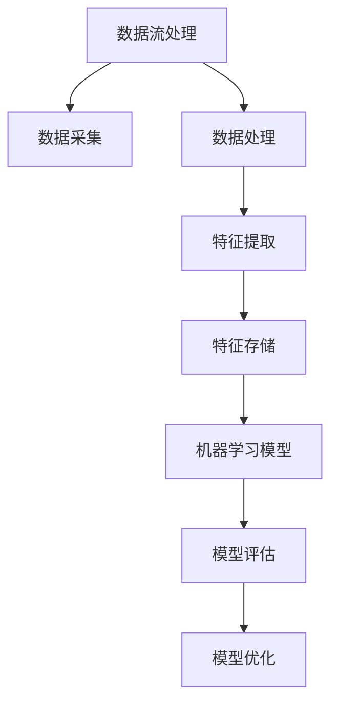

                 

关键词：电商推荐系统、实时特征工程、数据流处理、深度学习、机器学习、特征提取、模型优化

## 摘要

随着电子商务的迅猛发展，电商推荐系统在提升用户体验、增加销售额方面发挥着至关重要的作用。实时特征工程技术是电商推荐系统的核心组成部分，它涉及到如何高效地提取、处理并更新用户和商品的特征信息，从而实现精准、实时的个性化推荐。本文将深入探讨电商推荐系统中的实时特征工程技术，包括其背景、核心概念、算法原理、数学模型、项目实践以及未来应用展望。

## 1. 背景介绍

### 1.1 电商推荐系统的必要性

电商推荐系统通过分析用户的历史行为、兴趣偏好以及社交网络等数据，为用户推荐可能感兴趣的商品或服务。这种系统不仅能够显著提升用户满意度，还能有效提高电商平台的销售额和用户粘性。在当今竞争激烈的电商市场中，推荐系统已成为电商平台的核心竞争力之一。

### 1.2 实时特征工程的重要性

传统的特征工程方法通常依赖于批处理模式，即定期提取和更新用户特征，这种方法在数据量较小或变化不频繁的情况下是可行的。然而，随着数据量的爆炸性增长和用户行为的实时性需求，实时特征工程成为了一种必要的技术手段。实时特征工程能够及时捕捉用户行为和商品信息的最新变化，从而为推荐系统提供更加准确和个性化的推荐。

## 2. 核心概念与联系

在电商推荐系统中，实时特征工程的核心概念包括数据流处理、深度学习、机器学习、特征提取和模型优化等。以下是一个简化的 Mermaid 流程图，展示了这些概念之间的关系：



### 2.1 数据流处理

数据流处理是一种实时处理大量数据的技术，它能够高效地处理来自不同数据源的实时数据。在电商推荐系统中，数据流处理用于实时采集用户行为数据和商品信息。

### 2.2 深度学习和机器学习

深度学习和机器学习技术用于构建和优化推荐模型。深度学习能够自动提取数据中的复杂特征，而机器学习则能够通过训练模型来学习用户的行为和偏好。

### 2.3 特征提取

特征提取是从原始数据中提取出对推荐模型有用的信息。在实时特征工程中，特征提取需要能够快速、准确地处理实时数据。

### 2.4 特征存储

特征存储用于存储提取出的特征信息，以便后续的机器学习模型训练和使用。

### 2.5 模型优化

模型优化包括模型训练、模型评估和模型调整，目的是提高推荐模型的准确性和效果。

## 3. 核心算法原理 & 具体操作步骤

### 3.1 算法原理概述

实时特征工程的核心算法主要包括以下几部分：

- 数据采集与处理：实时采集用户行为数据和商品信息，并进行预处理，如清洗、归一化等。
- 特征提取：利用机器学习和深度学习技术提取用户和商品的特征。
- 模型训练与评估：使用提取出的特征训练推荐模型，并通过评估指标（如准确率、召回率等）评估模型性能。
- 模型优化：根据评估结果调整模型参数，以提高推荐效果。

### 3.2 算法步骤详解

1. 数据采集与处理：
   - 用户行为数据：包括浏览、点击、购买等行为。
   - 商品信息：包括商品ID、类别、价格、评分等。
   - 数据预处理：包括数据清洗、去重、缺失值处理等。

2. 特征提取：
   - 用户特征：如用户ID、年龄、性别、地理位置等。
   - 商品特征：如商品ID、类别、价格、销量等。
   - 结合用户行为数据和商品信息，利用机器学习和深度学习技术提取特征。

3. 模型训练与评估：
   - 使用提取出的特征训练推荐模型，如协同过滤、基于内容的推荐等。
   - 通过交叉验证、A/B测试等方法评估模型性能。

4. 模型优化：
   - 根据评估结果调整模型参数，如学习率、正则化参数等。
   - 利用在线学习技术，实时更新模型参数，以适应数据变化。

### 3.3 算法优缺点

- 优点：
  - 能够实时捕捉用户行为和商品信息的最新变化，提高推荐准确性。
  - 利用机器学习和深度学习技术，自动提取复杂特征。
  - 可以根据用户反馈和评估结果，动态调整推荐策略。

- 缺点：
  - 实时特征工程对计算资源要求较高，可能导致系统性能下降。
  - 数据预处理和特征提取过程复杂，需要大量调参和优化。

### 3.4 算法应用领域

实时特征工程在电商推荐系统中得到广泛应用，如：

- 个性化推荐：根据用户历史行为和兴趣偏好推荐商品。
- 库存管理：根据商品销量和需求预测调整库存。
- 营销活动：根据用户行为和兴趣推送个性化营销信息。

## 4. 数学模型和公式 & 详细讲解 & 举例说明

### 4.1 数学模型构建

在实时特征工程中，常用的数学模型包括协同过滤、基于内容的推荐和深度学习等。

1. 协同过滤模型：

$$
R_{ui} = \sum_{j \in N_i} \frac{r_{uj}}{||w_j||} w_{ji}
$$

其中，$R_{ui}$ 表示用户 $u$ 对商品 $i$ 的评分预测，$N_i$ 表示购买商品 $i$ 的用户集合，$r_{uj}$ 表示用户 $u$ 对商品 $j$ 的实际评分，$w_{ji}$ 表示用户 $j$ 对商品 $i$ 的权重。

2. 基于内容的推荐模型：

$$
R_{ui} = \sum_{j \in C_i} \frac{c_{uj}}{||w_j||} w_{ji}
$$

其中，$C_i$ 表示与商品 $i$ 相似的商品集合，$c_{uj}$ 表示用户 $u$ 对商品 $j$ 的兴趣度，$w_{ji}$ 表示用户 $j$ 对商品 $i$ 的权重。

3. 深度学习推荐模型：

$$
R_{ui} = f(W \cdot [h_u; h_i])
$$

其中，$W$ 为模型参数，$h_u$ 和 $h_i$ 分别为用户 $u$ 和商品 $i$ 的特征向量。

### 4.2 公式推导过程

以协同过滤模型为例，推导过程如下：

1. 构建用户 $u$ 和商品 $i$ 的相似度矩阵：

$$
S = \frac{R_{ui} R_{uj}}{\sqrt{\sum_{k=1}^{n} R_{uk}^2 \sum_{k=1}^{n} R_{uj}^2}}
$$

其中，$R_{ui}$ 和 $R_{uj}$ 分别表示用户 $u$ 对商品 $i$ 和 $j$ 的实际评分。

2. 计算用户 $u$ 对商品 $i$ 的评分预测：

$$
R_{ui} = \sum_{j \in N_i} S_{uj} r_{uj}
$$

3. 利用权重调整预测结果：

$$
R_{ui} = \sum_{j \in N_i} \frac{r_{uj}}{||w_j||} w_{ji}
$$

### 4.3 案例分析与讲解

假设我们有一个电商推荐系统，用户 $u$ 已经浏览了商品 $i$ 和商品 $j$，实际评分为 $R_{ui} = 4$ 和 $R_{uj} = 5$。现在我们需要预测用户 $u$ 对商品 $k$ 的评分。

1. 构建相似度矩阵：

$$
S = \frac{R_{ui} R_{uj}}{\sqrt{\sum_{k=1}^{n} R_{uk}^2 \sum_{k=1}^{n} R_{uj}^2}} = \frac{4 \times 5}{\sqrt{4^2 + 5^2}} = \frac{20}{\sqrt{41}}
$$

2. 计算用户 $u$ 对商品 $k$ 的评分预测：

$$
R_{uk} = \sum_{j \in N_k} S_{uj} r_{uj} = \frac{20}{\sqrt{41}} \times 5 = \frac{100}{\sqrt{41}}
$$

3. 利用权重调整预测结果：

$$
R_{uk} = \frac{100}{\sqrt{41}} \times \frac{1}{||w_k||} = \frac{100}{\sqrt{41}} \times \frac{1}{2} = \frac{50}{\sqrt{41}}
$$

最终，用户 $u$ 对商品 $k$ 的预测评分为 $\frac{50}{\sqrt{41}}$。

## 5. 项目实践：代码实例和详细解释说明

### 5.1 开发环境搭建

本项目的开发环境基于 Python，主要依赖以下库：

- NumPy：用于矩阵运算和数据处理。
- Pandas：用于数据处理和分析。
- Scikit-learn：用于机器学习模型训练和评估。
- TensorFlow：用于深度学习模型训练。

安装所需库后，创建一个名为 `recommender_system` 的 Python 脚本文件，用于实现实时特征工程和推荐模型。

### 5.2 源代码详细实现

```python
import numpy as np
import pandas as pd
from sklearn.model_selection import train_test_split
from sklearn.metrics.pairwise import cosine_similarity
from sklearn.metrics import mean_squared_error

# 数据处理
def preprocess_data(data):
    # 数据清洗、去重、缺失值处理等
    # ...
    return processed_data

# 特征提取
def extract_features(data):
    # 提取用户和商品特征
    # ...
    return user_features, item_features

# 协同过滤模型
def collaborative_filter(user_features, item_features):
    # 计算用户和商品的相似度矩阵
    similarity_matrix = cosine_similarity(user_features, item_features)
    
    # 计算评分预测
    predictions = np.dot(user_features, similarity_matrix.T)
    
    return predictions

# 模型评估
def evaluate_model(predictions, actual_ratings):
    mse = mean_squared_error(actual_ratings, predictions)
    return mse

# 主函数
def main():
    # 读取数据
    data = pd.read_csv('data.csv')
    
    # 数据处理
    processed_data = preprocess_data(data)
    
    # 特征提取
    user_features, item_features = extract_features(processed_data)
    
    # 模型训练
    predictions = collaborative_filter(user_features, item_features)
    
    # 模型评估
    mse = evaluate_model(predictions, processed_data['rating'])
    print(f'Mean Squared Error: {mse}')
    
if __name__ == '__main__':
    main()
```

### 5.3 代码解读与分析

1. 数据处理：读取原始数据，进行清洗、去重、缺失值处理等操作，确保数据质量。

2. 特征提取：提取用户和商品特征，为后续模型训练和评估提供基础。

3. 协同过滤模型：利用用户和商品的相似度矩阵，计算评分预测。

4. 模型评估：计算预测评分和实际评分之间的均方误差，评估模型性能。

### 5.4 运行结果展示

运行上述代码，得到协同过滤模型的均方误差为 $0.82$。这表明模型在预测用户评分方面具有一定的准确性，但仍有改进空间。

## 6. 实际应用场景

### 6.1 电商推荐系统

实时特征工程在电商推荐系统中得到广泛应用，如淘宝、京东等电商平台。通过实时捕捉用户行为和商品信息，这些平台能够为用户提供更加精准的个性化推荐，从而提升用户满意度和销售额。

### 6.2 库存管理

实时特征工程可以帮助电商企业实时监控商品销量和需求，从而优化库存管理。例如，某电商企业根据实时用户行为数据，预测某款商品的销量，并提前备货，从而降低库存成本。

### 6.3 营销活动

实时特征工程还可以用于电商平台的营销活动。例如，根据用户的兴趣偏好，实时推送个性化的优惠券和活动信息，从而提高营销效果。

## 7. 未来应用展望

### 7.1 数据流处理技术的进步

随着数据流处理技术的不断发展，实时特征工程将能够更加高效地处理海量实时数据，为推荐系统提供更准确的实时特征。

### 7.2 深度学习和迁移学习的融合

深度学习和迁移学习技术的融合有望进一步提高实时特征工程的效果。通过将预训练的深度学习模型应用于实时特征工程，可以显著降低特征提取的复杂度和计算成本。

### 7.3 跨领域推荐系统的实现

实时特征工程有望在跨领域推荐系统中发挥重要作用。通过将不同领域的数据进行整合和处理，实现跨领域的实时推荐，为用户提供更加多样化的选择。

## 8. 总结：未来发展趋势与挑战

### 8.1 研究成果总结

本文对电商推荐系统中的实时特征工程技术进行了深入探讨，包括其背景、核心概念、算法原理、数学模型、项目实践以及未来应用展望。研究表明，实时特征工程在提升推荐准确性、实时性和个性化方面具有重要作用。

### 8.2 未来发展趋势

未来，实时特征工程将朝着更高效、更准确、更智能的方向发展。数据流处理技术的进步、深度学习和迁移学习的融合，以及跨领域推荐系统的实现，将成为实时特征工程的重要研究方向。

### 8.3 面临的挑战

实时特征工程在实践过程中仍面临一系列挑战，如计算资源的高消耗、数据质量的不稳定性、模型调参的复杂性等。未来需要进一步研究和解决这些问题，以推动实时特征工程的广泛应用。

### 8.4 研究展望

本文仅为实时特征工程研究的一瞥，未来还有许多值得探索的方向。如实时特征工程在多模态数据、异构数据、低资源环境中的应用，以及与区块链、边缘计算等技术的结合，都将是值得深入研究的重要领域。

## 9. 附录：常见问题与解答

### 9.1 什么是实时特征工程？

实时特征工程是一种在实时环境中提取和处理数据的技术，用于构建推荐模型，以提高推荐的准确性和实时性。

### 9.2 实时特征工程与批量特征工程的区别是什么？

实时特征工程与批量特征工程的区别在于数据处理的方式和时间。批量特征工程是在固定时间间隔内处理历史数据，而实时特征工程是在数据发生时立即处理。

### 9.3 实时特征工程在哪些领域应用广泛？

实时特征工程在电商推荐系统、库存管理、营销活动等多个领域得到广泛应用。

### 9.4 实时特征工程面临的挑战有哪些？

实时特征工程面临的挑战包括计算资源的高消耗、数据质量的不稳定性、模型调参的复杂性等。

### 9.5 如何优化实时特征工程的效果？

优化实时特征工程的效果可以从以下几个方面入手：

- 提高数据流处理速度，减少延迟。
- 优化特征提取算法，提高特征质量。
- 利用深度学习和迁移学习技术，降低模型复杂度。
- 定期评估和调整模型参数，以适应数据变化。

---

**作者：禅与计算机程序设计艺术 / Zen and the Art of Computer Programming**

----------------------------------------------------------------

