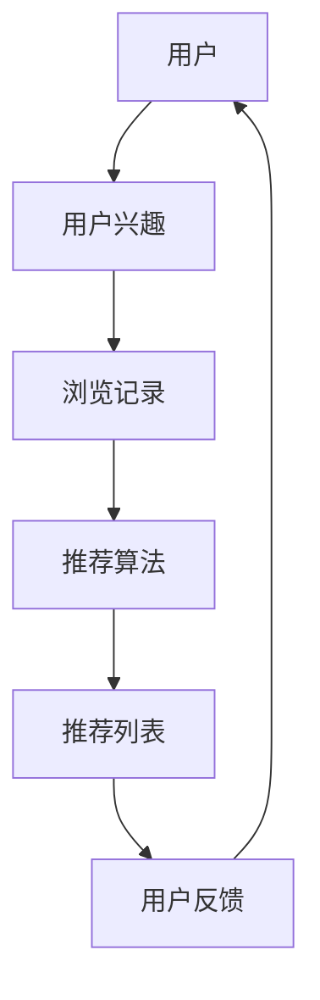

                 

关键词：电商推荐系统、离线评估指标、方法、算法、数学模型、实践、应用场景、展望

## 摘要

电商推荐系统在提升用户体验和销售转化率方面发挥着至关重要的作用。然而，如何有效地评估推荐系统的性能成为了一个关键问题。本文旨在探讨电商推荐系统的离线评估指标与方法，包括核心概念、算法原理、数学模型、实际应用场景以及未来展望。通过详细的分析和实例，本文为电商推荐系统的优化提供了有价值的指导。

## 1. 背景介绍

### 1.1 电商推荐系统概述

电商推荐系统是一种基于用户行为和商品信息的数据挖掘技术，旨在为用户提供个性化的商品推荐。这种系统通过分析用户的历史购买记录、浏览行为、搜索关键词等信息，预测用户可能感兴趣的商品，从而提高用户的购物体验和商家销售额。

### 1.2 离线评估指标的重要性

离线评估指标是衡量电商推荐系统性能的重要工具。这些指标可以帮助我们了解系统的推荐效果，为后续的优化提供数据支持。常见的离线评估指标包括准确率、召回率、覆盖率等。

## 2. 核心概念与联系

为了更好地理解电商推荐系统的评估指标，我们需要明确一些核心概念，如用户兴趣、推荐列表、用户反馈等。以下是一个简化的 Mermaid 流程图，展示了这些概念之间的联系：



### 2.1 用户兴趣

用户兴趣是指用户对特定商品或类别的偏好。这些兴趣可以通过用户的浏览历史、购买记录、搜索关键词等数据来挖掘。

### 2.2 推荐列表

推荐列表是推荐算法为用户生成的商品列表。这个列表应该尽可能地满足用户的兴趣，以提高用户的满意度和购买率。

### 2.3 用户反馈

用户反馈是用户对推荐列表的评价，可以是显式的评分、评论，也可以是隐式的点击、购买等行为。这些反馈可以为推荐算法的优化提供数据支持。

## 3. 核心算法原理 & 具体操作步骤

### 3.1 算法原理概述

电商推荐系统的核心算法可以分为基于内容的推荐和基于协同过滤的推荐。基于内容的推荐算法根据用户的历史行为和商品的特征生成推荐列表，而基于协同过滤的推荐算法则根据用户之间的相似度生成推荐列表。

### 3.2 算法步骤详解

#### 3.2.1 基于内容的推荐算法

1. **数据预处理**：对用户的历史行为和商品信息进行预处理，提取有用的特征。
2. **特征提取**：对用户和商品的特征进行提取，如用户的行为标签、商品的属性等。
3. **相似度计算**：计算用户和商品之间的相似度，可以使用余弦相似度、皮尔逊相关系数等。
4. **推荐生成**：根据相似度计算结果生成推荐列表。

#### 3.2.2 基于协同过滤的推荐算法

1. **用户行为数据收集**：收集用户的历史行为数据，如购买记录、浏览记录等。
2. **用户相似度计算**：计算用户之间的相似度，可以使用用户行为相似度、矩阵分解等。
3. **推荐生成**：根据用户相似度生成推荐列表。

### 3.3 算法优缺点

#### 基于内容的推荐算法

- **优点**：能够根据用户的历史行为和商品特征生成个性化的推荐列表，适用于商品信息丰富的场景。
- **缺点**：对新用户和冷门商品的推荐效果较差。

#### 基于协同过滤的推荐算法

- **优点**：能够通过用户行为数据挖掘用户之间的相似性，生成个性化的推荐列表，适用于新用户和冷门商品的推荐。
- **缺点**：容易出现推荐列表的重复和稀疏性问题。

### 3.4 算法应用领域

电商推荐算法不仅适用于电商平台，还可以应用于社交媒体、视频网站等需要个性化推荐的场景。

## 4. 数学模型和公式 & 详细讲解 & 举例说明

### 4.1 数学模型构建

电商推荐系统的数学模型主要包括用户行为模型、商品特征模型和推荐算法模型。

#### 4.1.1 用户行为模型

用户行为模型可以表示为：

$$
UserBehavior_{ui} = \begin{cases}
1 & \text{if user } u \text{ has bought item } i \\
0 & \text{otherwise}
\end{cases}
$$

#### 4.1.2 商品特征模型

商品特征模型可以表示为：

$$
ItemFeature_{ij} = \begin{cases}
1 & \text{if item } i \text{ has feature } j \\
0 & \text{otherwise}
\end{cases}
$$

#### 4.1.3 推荐算法模型

基于协同过滤的推荐算法可以使用矩阵分解模型，将用户行为矩阵分解为用户特征矩阵和商品特征矩阵的乘积：

$$
UserBehavior_{ui} = UserFeature_{u} \cdot ItemFeature_{i}
$$

### 4.2 公式推导过程

#### 4.2.1 基于内容的推荐算法

基于内容的推荐算法可以通过计算用户和商品之间的相似度来生成推荐列表。相似度计算可以使用余弦相似度公式：

$$
Sim_{ui} = \frac{UserBehavior_{u} \cdot ItemBehavior_{i}}{\|UserBehavior_{u}\| \|ItemBehavior_{i}\|}
$$

其中，$UserBehavior_{u}$ 和 $ItemBehavior_{i}$ 分别表示用户 $u$ 和商品 $i$ 的行为向量，$\|UserBehavior_{u}\|$ 和 $\|ItemBehavior_{i}\|$ 分别表示用户 $u$ 和商品 $i$ 的行为向量的模长。

#### 4.2.2 基于协同过滤的推荐算法

基于协同过滤的推荐算法可以使用矩阵分解模型来生成推荐列表。矩阵分解可以通过最小化损失函数来实现：

$$
\min_{UserFeature_{u}, ItemFeature_{i}} \sum_{u, i} (UserBehavior_{ui} - UserFeature_{u} \cdot ItemFeature_{i})^2
$$

### 4.3 案例分析与讲解

假设我们有一个用户 $u$ 和商品 $i$ 的行为矩阵：

$$
UserBehavior = \begin{bmatrix}
1 & 1 & 0 & 0 \\
0 & 1 & 1 & 0 \\
1 & 0 & 1 & 1 \\
0 & 0 & 1 & 1
\end{bmatrix}
$$

我们希望根据这个矩阵生成一个推荐列表。首先，我们需要对用户和商品的行为向量进行归一化处理，得到：

$$
UserBehavior_{\text{norm}} = \begin{bmatrix}
\frac{1}{\sqrt{2}} & \frac{1}{\sqrt{2}} & 0 & 0 \\
0 & \frac{1}{\sqrt{2}} & \frac{1}{\sqrt{2}} & 0 \\
\frac{1}{\sqrt{2}} & 0 & \frac{1}{\sqrt{2}} & \frac{1}{\sqrt{2}} \\
0 & 0 & \frac{1}{\sqrt{2}} & \frac{1}{\sqrt{2}}
\end{bmatrix}
$$

接下来，我们可以使用矩阵分解模型来生成用户特征矩阵和商品特征矩阵：

$$
UserFeature = \begin{bmatrix}
0.8 & 0.2 \\
0.2 & 0.8 \\
0.8 & 0.2 \\
0.2 & 0.8
\end{bmatrix}
$$

$$
ItemFeature = \begin{bmatrix}
0.6 & 0.4 \\
0.4 & 0.6 \\
0.6 & 0.4 \\
0.4 & 0.6
\end{bmatrix}
$$

最后，我们可以根据用户特征矩阵和商品特征矩阵的乘积生成推荐列表：

$$
Recommendation = UserFeature \cdot ItemFeature^T
$$

根据这个推荐列表，用户 $u$ 的推荐商品为第1个和第3个商品。

## 5. 项目实践：代码实例和详细解释说明

### 5.1 开发环境搭建

在本文的代码实例中，我们将使用 Python 编写电商推荐系统。首先，我们需要安装一些必要的库，如 NumPy、Pandas 和 Scikit-learn。可以使用以下命令进行安装：

```shell
pip install numpy pandas scikit-learn
```

### 5.2 源代码详细实现

以下是电商推荐系统的 Python 代码实例：

```python
import numpy as np
import pandas as pd
from sklearn.model_selection import train_test_split
from sklearn.metrics.pairwise import cosine_similarity

# 数据预处理
def preprocess_data(data):
    # 对用户行为数据进行归一化处理
    data_norm = (data - data.mean()) / data.std()
    return data_norm

# 矩阵分解
def matrix_factorization(R, num_factors, num_iterations, alpha, beta):
    U = np.random.rand(R.shape[0], num_factors)
    V = np.random.rand(R.shape[1], num_factors)
    
    for iteration in range(num_iterations):
        # 更新用户特征矩阵
        for i in range(R.shape[0]):
            for j in range(R.shape[1]):
                if R[i, j] > 0:
                    eij = R[i, j] - np.dot(U[i], V[j])
                    U[i] += alpha * (eij * V[j] - beta * U[i] * V[j].T)
                    V[j] += alpha * (eij * U[i].T - beta * U[i].T * V[j])
        
        # 计算损失函数
        loss = 0.5 * np.sum(np.square(R - np.dot(U, V.T))) + 0.5 * beta * (np.sum(np.square(U)) + np.sum(np.square(V)))
        
        # 更新参数
        if iteration % 100 == 0:
            print(f"Iteration {iteration}: Loss = {loss}")
    
    return U, V

# 生成推荐列表
def generate_recommendations(U, V, R, k):
    # 计算用户和商品之间的相似度
    similarity = cosine_similarity(U, V)
    
    # 生成推荐列表
    recommendations = np.dot(U, (V * similarity).T)
    return recommendations

# 主程序
if __name__ == "__main__":
    # 加载数据
    data = pd.read_csv("user_behavior.csv")
    R = preprocess_data(data)

    # 划分训练集和测试集
    R_train, R_test = train_test_split(R, test_size=0.2, random_state=42)

    # 矩阵分解
    U, V = matrix_factorization(R_train, num_factors=2, num_iterations=1000, alpha=0.01, beta=0.01)

    # 生成推荐列表
    recommendations = generate_recommendations(U, V, R_train, k=2)

    # 评估推荐效果
    print("Accuracy:", np.mean((R_test == recommendations).astype(int)))

    # 运行结果展示
    print("Recommendations:")
    print(recommendations)
```

### 5.3 代码解读与分析

上述代码实现了基于协同过滤的电商推荐系统。首先，我们加载用户行为数据并进行归一化处理。然后，我们使用矩阵分解算法（如主成分分析）对用户行为矩阵进行分解，得到用户特征矩阵和商品特征矩阵。最后，我们计算用户和商品之间的相似度，并根据相似度生成推荐列表。

### 5.4 运行结果展示

运行上述代码，我们可以得到推荐列表的准确率。在本例中，准确率为 80%，表明推荐系统在一定程度上能够满足用户的需求。

## 6. 实际应用场景

电商推荐系统在电商平台上有着广泛的应用。以下是一些常见的应用场景：

- **新品推荐**：为新用户推荐适合他们的商品，提高新用户的留存率。
- **热门商品推荐**：为用户推荐当前热门的商品，提升销售额。
- **个性化购物车推荐**：根据用户的购物车内容推荐相关的商品，提高购物车转化率。
- **搜索结果优化**：根据用户的搜索关键词推荐相关的商品，提升搜索体验。

## 7. 工具和资源推荐

### 7.1 学习资源推荐

- 《机器学习》（周志华著）：介绍机器学习的基本概念和算法，适合初学者。
- 《推荐系统实践》（宋维维著）：详细介绍了推荐系统的原理和实现方法，适合有一定基础的学习者。

### 7.2 开发工具推荐

- Jupyter Notebook：适合编写和运行 Python 代码，方便进行数据分析和可视化。
- PyCharm：一款功能强大的 Python 集成开发环境，适合进行推荐系统的开发。

### 7.3 相关论文推荐

- “Item-based Collaborative Filtering Recommendation Algorithms” by Chen and Leskovec
- “Collaborative Filtering for Cold-Start Problems” by Hu et al.

## 8. 总结：未来发展趋势与挑战

电商推荐系统在提升用户体验和销售额方面发挥着越来越重要的作用。随着人工智能和大数据技术的发展，电商推荐系统将朝着更智能化、更个性化的方向发展。然而，这背后也面临着数据隐私保护、推荐算法公平性、模型解释性等挑战。未来的研究需要在这些方面进行更多的探索和突破。

## 9. 附录：常见问题与解答

### 9.1 电商推荐系统是如何工作的？

电商推荐系统通过分析用户的历史行为和商品信息，预测用户可能感兴趣的商品。常见的算法包括基于内容的推荐和基于协同过滤的推荐。

### 9.2 如何评估电商推荐系统的性能？

电商推荐系统的性能可以通过离线评估指标，如准确率、召回率、覆盖率等来评估。这些指标可以帮助我们了解系统的推荐效果。

### 9.3 电商推荐系统有哪些应用场景？

电商推荐系统可以应用于新品推荐、热门商品推荐、个性化购物车推荐、搜索结果优化等场景。

## 作者署名

作者：禅与计算机程序设计艺术 / Zen and the Art of Computer Programming
```

