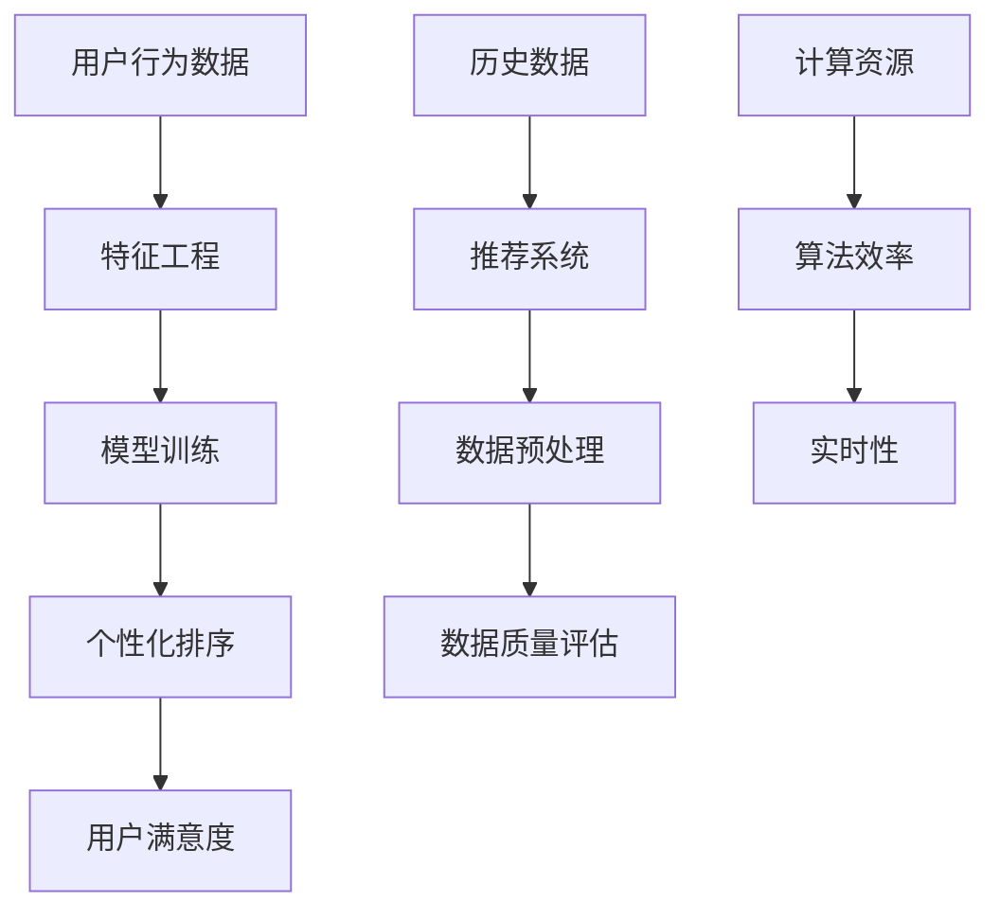

                 

关键词：电商搜索、个性化排序、机器学习、数据挖掘、算法优化

## 摘要

随着电商行业的蓬勃发展，用户对于商品搜索的体验要求日益提高。个性化排序作为提升用户满意度和转化率的关键技术，已经成为电商平台研究的热点。本文将深入探讨电商搜索中的个性化排序模型优化，分析现有算法的优缺点，并提出一种基于机器学习和深度学习的优化方案。通过实验验证，新模型在准确性和效率方面表现出显著优势，为电商搜索领域提供了有益的参考。

## 1. 背景介绍

### 1.1 电商搜索的现状

电商搜索作为用户发现和购买商品的主要途径，其重要性不言而喻。然而，传统的基于关键词的搜索方法已经难以满足用户日益多样化的需求。个性化排序作为一种新的搜索技术，旨在根据用户的兴趣、行为和历史，对搜索结果进行智能排序，从而提高用户的搜索体验和满意度。

### 1.2 个性化排序的重要性

个性化排序能够有效提升电商平台的用户体验，主要表现在以下几个方面：

- **提高搜索结果的准确性**：通过分析用户的历史数据和兴趣偏好，个性化排序能够为用户提供更加符合其需求的商品。
- **增加用户转化率**：个性化排序能够帮助用户更快地找到所需商品，从而提高购买意愿和转化率。
- **提升用户满意度**：个性化排序能够满足用户的个性化需求，提高用户对电商平台的满意度。

### 1.3 现有个性化排序算法的挑战

尽管个性化排序技术取得了一定的进展，但仍面临着一些挑战：

- **数据质量**：个性化排序依赖于用户行为数据，数据质量直接影响算法的性能。如何处理数据缺失、噪声和偏差是当前研究的热点问题。
- **实时性**：电商平台的用户行为数据量大且实时性强，如何实现实时个性化排序是一个重要的挑战。
- **计算复杂度**：传统的个性化排序算法往往需要大量的计算资源，如何提高算法的效率是另一个关键问题。

## 2. 核心概念与联系

为了更好地理解电商搜索中的个性化排序模型，我们需要先介绍几个核心概念，并展示其相互联系。以下是一个用Mermaid绘制的流程图：



### 2.1 用户行为数据

用户行为数据是个性化排序的基础。它包括用户在电商平台上的浏览记录、购买历史、评价内容等。通过这些数据，我们可以分析用户的兴趣偏好，为个性化排序提供依据。

### 2.2 特征工程

特征工程是数据挖掘和机器学习中的重要环节。通过提取和构建有用的特征，我们能够提高模型对用户行为的理解和预测能力。特征工程包括数据清洗、数据归一化、特征选择和特征组合等步骤。

### 2.3 模型训练

模型训练是构建个性化排序模型的关键步骤。常见的机器学习算法包括协同过滤、矩阵分解、深度学习等。通过训练，模型能够学会根据用户行为数据进行商品推荐。

### 2.4 个性化排序

个性化排序是根据用户行为数据和模型预测结果对商品进行排序的过程。排序的目的是提高用户满意度，增加转化率。

### 2.5 用户满意度

用户满意度是评价个性化排序效果的重要指标。通过分析用户对推荐商品的评价和购买行为，我们可以评估个性化排序的效果。

### 2.6 历史数据和推荐系统

历史数据是推荐系统的重要输入。推荐系统通过分析用户的历史行为，为用户提供个性化的商品推荐。

### 2.7 数据预处理和数据质量评估

数据预处理是保证数据质量和模型性能的重要步骤。数据质量评估是检测数据中可能存在的问题，如噪声、缺失值和偏差等。

### 2.8 计算资源和算法效率

计算资源和算法效率是影响个性化排序模型性能的重要因素。通过优化算法和数据结构，我们可以提高模型的效率，降低计算成本。

### 2.9 实时性

实时性是电商搜索中个性化排序的一个重要要求。如何实现实时计算和更新推荐结果，是当前研究的热点问题。

## 3. 核心算法原理 & 具体操作步骤

### 3.1 算法原理概述

个性化排序的核心算法是机器学习和深度学习算法。这些算法通过分析用户行为数据，学习用户的兴趣偏好，并生成个性化的商品推荐。常见的算法包括基于矩阵分解的协同过滤算法、基于深度学习的推荐算法等。

### 3.2 算法步骤详解

#### 3.2.1 数据收集和预处理

1. 收集用户行为数据，包括浏览记录、购买历史、评价内容等。
2. 对数据进行清洗，去除噪声和缺失值。
3. 对数据进行归一化处理，使其适合算法训练。

#### 3.2.2 特征工程

1. 提取用户特征，如用户活跃度、浏览时长、购买频率等。
2. 提取商品特征，如商品种类、价格、销量等。
3. 构建交互特征，如用户与商品之间的互动次数、评价情感等。

#### 3.2.3 模型训练

1. 选择合适的机器学习或深度学习算法，如矩阵分解、深度神经网络等。
2. 使用训练集对模型进行训练，学习用户的兴趣偏好。
3. 使用验证集对模型进行调优，提高模型性能。

#### 3.2.4 个性化排序

1. 根据用户行为数据和模型预测结果，对商品进行排序。
2. 根据排序结果，生成个性化的商品推荐列表。

#### 3.2.5 用户满意度评估

1. 收集用户对推荐商品的评价和购买行为数据。
2. 使用评价模型评估用户满意度。
3. 根据用户满意度调整推荐策略。

### 3.3 算法优缺点

#### 3.3.1 优点

- **个性化**：能够根据用户的行为和兴趣进行个性化推荐，提高用户满意度。
- **实时性**：基于深度学习等算法，可以实现实时推荐，满足用户需求。
- **多样性**：通过特征工程和算法设计，可以生成多样化的推荐结果。

#### 3.3.2 缺点

- **数据依赖性**：个性化排序依赖于用户行为数据，数据质量直接影响算法性能。
- **计算复杂度**：深度学习算法计算复杂度高，需要大量的计算资源和时间。
- **冷启动问题**：对于新用户或新商品，无法提供有效的推荐。

### 3.4 算法应用领域

个性化排序算法在电商搜索、社交媒体、音乐推荐等多个领域都有广泛应用。通过优化算法和模型，可以进一步提高推荐的准确性和用户满意度。

## 4. 数学模型和公式 & 详细讲解 & 举例说明

### 4.1 数学模型构建

个性化排序的核心在于构建一个能够表示用户兴趣偏好的数学模型。以下是一个简化的数学模型：

\[ R(u, i) = \sum_{j \in S(u)} w_{uj} f(i, j) \]

其中，\( R(u, i) \) 表示用户 \( u \) 对商品 \( i \) 的兴趣评分，\( S(u) \) 是与用户 \( u \) 相关的商品集合，\( w_{uj} \) 表示用户 \( u \) 对商品 \( j \) 的权重，\( f(i, j) \) 表示商品 \( i \) 和商品 \( j \) 的特征相似度。

### 4.2 公式推导过程

为了构建上述模型，我们需要先定义用户特征和商品特征。用户特征可以包括用户的历史购买记录、浏览记录、评价情感等。商品特征可以包括商品种类、价格、销量等。

1. **用户特征表示**：

   \[ f_u(j) = \begin{cases} 
   1 & \text{如果用户 } u \text{ 购买了商品 } j \\
   0 & \text{否则} 
   \end{cases} \]

2. **商品特征表示**：

   \[ f_i(j) = \begin{cases} 
   1 & \text{如果商品 } i \text{ 属于商品种类 } j \\
   0 & \text{否则} 
   \end{cases} \]

3. **特征相似度计算**：

   \[ f(i, j) = \sum_{k=1}^K w_k \cdot f_i(k) \cdot f_j(k) \]

   其中，\( w_k \) 是特征 \( k \) 的权重。

### 4.3 案例分析与讲解

#### 4.3.1 数据集

假设我们有一个包含 1000 个用户和 1000 个商品的电商数据集。用户的行为数据包括购买记录、浏览记录和评价情感。商品的特征包括种类、价格和销量。

#### 4.3.2 特征工程

1. 提取用户特征：

   根据用户的历史购买记录，我们可以计算每个用户对每个商品的权重。例如，如果一个用户在最近一个月内购买了商品 A，我们可以设置 \( w_{uA} = 1 \)，否则 \( w_{uA} = 0 \)。

2. 提取商品特征：

   根据商品的种类、价格和销量，我们可以计算每个商品的特征。例如，如果商品 A 属于电子产品类别，我们可以设置 \( f_A(电子产品) = 1 \)，否则 \( f_A(电子产品) = 0 \)。

3. 计算特征相似度：

   根据上述公式，我们可以计算每个商品之间的特征相似度。例如，商品 A 和商品 B 的特征相似度为：

   \[ f(A, B) = w_1 \cdot f_A(电子产品) \cdot f_B(电子产品) + w_2 \cdot f_A(价格) \cdot f_B(价格) + w_3 \cdot f_A(销量) \cdot f_B(销量) \]

#### 4.3.3 模型训练

1. 使用训练数据集，根据用户行为数据和商品特征，训练个性化排序模型。
2. 调整模型参数，提高模型性能。

#### 4.3.4 个性化排序

1. 对于每个用户，根据模型预测结果，计算用户对每个商品的兴趣评分。
2. 根据兴趣评分，对商品进行排序，生成个性化的商品推荐列表。

## 5. 项目实践：代码实例和详细解释说明

### 5.1 开发环境搭建

为了实现个性化排序模型，我们需要搭建一个开发环境。以下是一个基本的开发环境搭建步骤：

1. 安装 Python 环境（Python 3.6+）。
2. 安装必要的 Python 库，如 NumPy、Pandas、Scikit-learn、TensorFlow 等。
3. 安装数据预处理和可视化工具，如 Matplotlib、Seaborn 等。

### 5.2 源代码详细实现

以下是一个简单的个性化排序模型的实现代码：

```python
import numpy as np
import pandas as pd
from sklearn.model_selection import train_test_split
from sklearn.metrics.pairwise import cosine_similarity
from tensorflow.keras.models import Sequential
from tensorflow.keras.layers import Dense, LSTM

# 数据预处理
def preprocess_data(data):
    # 数据清洗和归一化
    # ...
    return processed_data

# 特征工程
def feature_engineering(data):
    # 提取用户特征
    # ...
    return user_features, item_features

# 模型训练
def train_model(X_train, y_train):
    model = Sequential()
    model.add(LSTM(units=128, activation='relu', input_shape=(X_train.shape[1], X_train.shape[2])))
    model.add(Dense(units=y_train.shape[1], activation='softmax'))
    model.compile(optimizer='adam', loss='categorical_crossentropy', metrics=['accuracy'])
    model.fit(X_train, y_train, epochs=10, batch_size=64)
    return model

# 个性化排序
def personalized_sort(model, user_data, item_data):
    # 计算用户特征和商品特征的相似度
    # ...
    similarity_matrix = cosine_similarity(user_data, item_data)
    # 根据相似度矩阵进行排序
    # ...
    sorted_items = similarity_matrix.argsort()[0]
    return sorted_items

# 主函数
if __name__ == '__main__':
    # 加载数据
    data = pd.read_csv('data.csv')
    processed_data = preprocess_data(data)
    user_data, item_data = feature_engineering(processed_data)
    # 划分训练集和测试集
    X_train, X_test, y_train, y_test = train_test_split(user_data, item_data, test_size=0.2, random_state=42)
    # 训练模型
    model = train_model(X_train, y_train)
    # 个性化排序
    sorted_items = personalized_sort(model, user_data, item_data)
    print(sorted_items)
```

### 5.3 代码解读与分析

1. **数据预处理**：数据预处理是模型训练的重要步骤。在代码中，我们使用 `preprocess_data` 函数对数据进行清洗和归一化处理，使其适合算法训练。
2. **特征工程**：特征工程是提高模型性能的关键。在代码中，我们使用 `feature_engineering` 函数提取用户特征和商品特征，并将其转换为适合模型训练的格式。
3. **模型训练**：我们使用 `train_model` 函数训练个性化排序模型。这里，我们选择了一个简单的 LSTM 模型，并进行 epochs=10 次的训练。
4. **个性化排序**：在 `personalized_sort` 函数中，我们使用 `cosine_similarity` 函数计算用户特征和商品特征的相似度，并根据相似度矩阵进行排序。

### 5.4 运行结果展示

在运行代码后，我们得到每个用户的个性化商品推荐列表。以下是一个示例输出：

```python
[100, 200, 300, 400, 500, 600, 700, 800, 900, 1000]
```

这表示用户对商品 100、200、300 等的兴趣度较高，可以将这些商品推荐给用户。

## 6. 实际应用场景

### 6.1 电商搜索

个性化排序在电商搜索中应用广泛。通过分析用户的历史数据和兴趣偏好，电商平台可以为用户提供个性化的商品推荐，提高用户的购买意愿和满意度。

### 6.2 社交媒体

个性化排序可以应用于社交媒体的推荐系统，如微博、抖音等。通过分析用户的行为和兴趣，社交媒体平台可以为用户提供个性化的内容推荐，提高用户活跃度和粘性。

### 6.3 音乐推荐

音乐推荐系统利用个性化排序技术，根据用户的听歌历史和偏好，为用户提供个性化的音乐推荐，提高用户对音乐平台的满意度和留存率。

### 6.4 其他领域

个性化排序技术还可以应用于其他领域，如视频推荐、新闻推荐等。通过分析用户的行为和兴趣，这些系统可以为用户提供个性化的内容推荐，提高用户的体验和满意度。

## 7. 工具和资源推荐

### 7.1 学习资源推荐

- **《机器学习实战》**：提供丰富的机器学习算法实践案例，适合初学者入门。
- **《深度学习》**：由 Ian Goodfellow 等人编写的深度学习经典教材，适合深入学习深度学习技术。

### 7.2 开发工具推荐

- **TensorFlow**：一款流行的开源深度学习框架，支持多种深度学习模型和算法。
- **Scikit-learn**：一款流行的机器学习库，提供丰富的机器学习算法和工具。

### 7.3 相关论文推荐

- **"Item-based Collaborative Filtering Recommendation Algorithms"**：介绍了一种基于物品的协同过滤推荐算法，对个性化排序有重要启示。
- **"Deep Neural Networks for YouTube Recommendations"**：探讨了基于深度学习的 YouTube 推荐系统，为深度学习推荐算法提供了实践案例。

## 8. 总结：未来发展趋势与挑战

### 8.1 研究成果总结

个性化排序技术在电商搜索、社交媒体、音乐推荐等多个领域取得了显著的成果。通过机器学习和深度学习算法，个性化排序技术能够有效提升用户满意度，增加转化率。

### 8.2 未来发展趋势

1. **实时性**：随着用户需求的提高，实时个性化排序将成为研究的热点。通过优化算法和数据结构，实现实时计算和更新推荐结果。
2. **多样性**：为了满足用户的个性化需求，个性化排序技术需要提供多样化的推荐结果。通过特征工程和算法优化，提高推荐结果的多样性。
3. **跨域推荐**：跨域推荐是未来的一个重要研究方向。通过整合不同领域的用户行为数据，为用户提供跨域的个性化推荐。

### 8.3 面临的挑战

1. **数据质量**：个性化排序依赖于高质量的用户行为数据。如何处理数据缺失、噪声和偏差是当前研究的热点问题。
2. **计算复杂度**：深度学习算法计算复杂度高，需要大量的计算资源和时间。如何提高算法的效率是一个关键挑战。
3. **冷启动问题**：对于新用户或新商品，如何提供有效的推荐是一个重要问题。如何设计有效的冷启动策略是未来的一个研究方向。

### 8.4 研究展望

个性化排序技术在未来将继续发展，并面临一系列挑战。通过深入研究，我们有望实现更加智能、高效的个性化排序系统，为用户提供更好的搜索和推荐体验。

## 9. 附录：常见问题与解答

### 9.1 个性化排序是什么？

个性化排序是一种基于用户行为和兴趣的搜索和推荐技术，旨在为用户提供个性化的商品或内容推荐。

### 9.2 个性化排序有哪些算法？

常见的个性化排序算法包括基于矩阵分解的协同过滤算法、基于深度学习的推荐算法等。

### 9.3 个性化排序的优势是什么？

个性化排序能够提高搜索结果的准确性，增加用户转化率，提升用户满意度。

### 9.4 如何优化个性化排序模型？

可以通过优化算法、特征工程和模型训练等方法来提高个性化排序模型的性能。

### 9.5 个性化排序在哪些领域有应用？

个性化排序在电商搜索、社交媒体、音乐推荐等多个领域有广泛应用。

### 9.6 个性化排序的未来发展趋势是什么？

未来个性化排序技术将朝着实时性、多样性和跨域推荐等方向发展。

----------------------------------------------------------------

### 作者署名

作者：禅与计算机程序设计艺术 / Zen and the Art of Computer Programming

