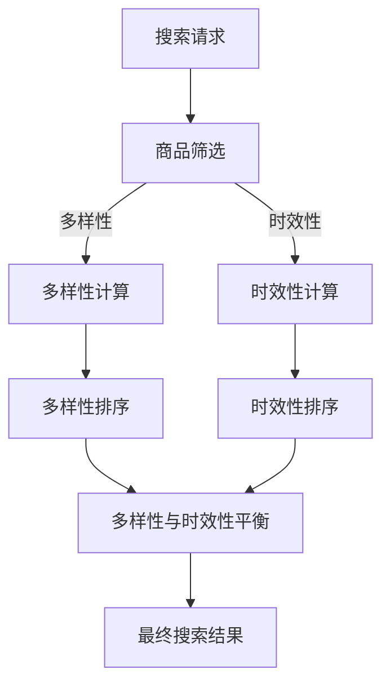

                 

关键词：电商搜索、多样性、时效性、平衡技术、算法原理、数学模型、项目实践、应用场景、未来展望

## 摘要

随着电商平台的迅猛发展，用户对电商搜索的多样性和时效性提出了更高的要求。本文主要探讨了电商搜索中的多样性与时效性平衡技术，通过介绍核心概念与联系、核心算法原理、数学模型与公式、项目实践及未来应用展望，提出了实现电商搜索多样性与时效性平衡的有效方法。本文旨在为电商搜索系统的优化提供理论依据和实践指导。

## 1. 背景介绍

### 1.1 电商搜索的发展历程

电商搜索作为电商平台的重要组成部分，其发展历程可以分为三个阶段：

- **原始阶段**：最早的电商搜索主要通过关键词匹配实现，用户在搜索框输入关键词，系统返回包含该关键词的商品列表。
- **发展阶段**：随着互联网技术的发展，电商搜索逐渐引入了自然语言处理、语义分析等技术，实现了更加智能的搜索结果排序和推荐。
- **智能化阶段**：当前，电商搜索已经实现了个性化、多样化、实时性的高度智能化，通过大数据分析和机器学习技术，为用户提供更加精准的搜索体验。

### 1.2 多样性与时效性的重要性

多样性（Diversity）和时效性（Timeliness）是电商搜索系统需要平衡的两个重要指标。

- **多样性**：多样性指的是搜索结果中商品种类的丰富性和多样性。用户希望在搜索结果中能够看到各种类型的商品，从而满足不同的购物需求。
- **时效性**：时效性指的是搜索结果的新鲜度和实时性。用户希望搜索到的商品信息是最新的，以确保购物决策的准确性。

在电商搜索中，多样性和时效性往往存在一定的冲突。为了满足多样性，系统可能需要从多个维度对商品进行筛选和排序，这可能导致搜索结果的时间延迟。而为了追求时效性，系统可能需要优先展示最新的商品，这可能导致多样性的下降。因此，如何实现多样性与时效性的平衡，是电商搜索系统面临的重要挑战。

## 2. 核心概念与联系

### 2.1 多样性与时效性的定义

- **多样性**：多样性是指在给定搜索结果集中，各商品之间的差异性和丰富性。多样性通常通过计算商品之间的相似度来衡量。
  
  $$
  D = \sum_{i=1}^{N} \sum_{j=1}^{N} \frac{1}{\|q_i - q_j\|}
  $$

  其中，$N$为搜索结果集中商品的数量，$q_i$和$q_j$分别为第$i$个和第$j$个商品的向量表示。

- **时效性**：时效性是指在给定搜索结果集中，各商品的新鲜度或更新时间。时效性通常通过计算商品的时间戳来衡量。

  $$
  T = \sum_{i=1}^{N} \frac{1}{\Delta t_i}
  $$

  其中，$\Delta t_i$为第$i$个商品的时间戳与当前时间戳的差值。

### 2.2 多样性与时效性的关系

多样性与时效性之间的关系可以概括为以下几点：

- **正相关**：当搜索结果集中的商品种类越丰富时，多样性越高，时效性也往往越好，因为系统有更多的商品信息可以用于更新搜索结果。
- **负相关**：当搜索结果集中的商品种类越少时，多样性越低，时效性也往往越差，因为系统需要更长时间来收集和更新商品信息。
- **权衡**：在实际应用中，多样性和时效性需要进行权衡。当用户对多样性有较高要求时，系统可能需要降低时效性来提高多样性；当用户对时效性有较高要求时，系统可能需要降低多样性来提高时效性。

### 2.3 多样性与时效性的 Mermaid 流程图



## 3. 核心算法原理 & 具体操作步骤

### 3.1 算法原理概述

本节介绍用于平衡电商搜索中多样性与时效性的核心算法原理。该算法基于两种排序策略：多样性排序和时效性排序。具体步骤如下：

1. **商品筛选**：根据用户输入的关键词，从商品数据库中筛选出符合条件的商品。
2. **多样性计算**：对筛选出的商品进行多样性计算，以确定各商品之间的差异性和丰富性。
3. **时效性计算**：对筛选出的商品进行时效性计算，以确定各商品的新鲜度或更新时间。
4. **多样性排序**：根据多样性计算结果对商品进行排序，优先展示多样性较高的商品。
5. **时效性排序**：根据时效性计算结果对商品进行排序，优先展示时效性较好的商品。
6. **多样性与时效性平衡**：通过结合多样性排序和时效性排序结果，实现多样性与时效性的平衡。
7. **最终搜索结果**：根据多样性与时效性平衡结果，生成最终的搜索结果并展示给用户。

### 3.2 算法步骤详解

#### 3.2.1 商品筛选

- **输入**：用户输入的关键词和商品数据库。
- **输出**：筛选出的符合条件的商品列表。

具体步骤如下：

1. 对商品数据库进行全文检索，根据关键词匹配返回符合条件的商品。
2. 对筛选出的商品进行去重处理，确保搜索结果中的商品不重复。

#### 3.2.2 多样性计算

- **输入**：筛选出的商品列表。
- **输出**：各商品之间的多样性分数。

具体步骤如下：

1. 对每个商品，计算其与其他商品之间的相似度。
2. 根据相似度计算结果，为每个商品分配多样性分数。

#### 3.2.3 时效性计算

- **输入**：筛选出的商品列表。
- **输出**：各商品之间的时效性分数。

具体步骤如下：

1. 对每个商品，计算其时间戳与当前时间戳的差值。
2. 根据时间戳差值，为每个商品分配时效性分数。

#### 3.2.4 多样性排序

- **输入**：多样性分数。
- **输出**：多样性排序结果。

具体步骤如下：

1. 根据多样性分数，对商品进行降序排序。
2. 将排序结果作为多样性排序结果。

#### 3.2.5 时效性排序

- **输入**：时效性分数。
- **输出**：时效性排序结果。

具体步骤如下：

1. 根据时效性分数，对商品进行升序排序。
2. 将排序结果作为时效性排序结果。

#### 3.2.6 多样性与时效性平衡

- **输入**：多样性排序结果和时效性排序结果。
- **输出**：多样性与时效性平衡结果。

具体步骤如下：

1. 将多样性排序结果和时效性排序结果进行交叉合并。
2. 对合并后的结果进行综合评分，综合评分较高的商品优先展示。

#### 3.2.7 最终搜索结果

- **输入**：多样性与时效性平衡结果。
- **输出**：最终搜索结果。

具体步骤如下：

1. 根据多样性与时效性平衡结果，生成最终的搜索结果。
2. 将最终搜索结果展示给用户。

### 3.3 算法优缺点

#### 优点：

1. **多样性高**：通过多样性计算和排序，能够确保搜索结果中的商品种类丰富、多样性高，满足用户对不同类型商品的需求。
2. **时效性好**：通过时效性计算和排序，能够确保搜索结果中的商品新鲜度或更新时间较好，提高用户购物的准确性。
3. **平衡性好**：通过多样性与时效性平衡算法，能够实现多样性与时效性的平衡，满足不同用户对不同指标的需求。

#### 缺点：

1. **计算复杂度高**：多样性计算和时效性计算需要遍历整个商品列表，计算复杂度较高，可能影响搜索速度。
2. **数据依赖性大**：算法性能依赖于商品数据库的质量和完整性，如果商品数据存在缺失或错误，可能影响搜索结果的准确性。

### 3.4 算法应用领域

多样性与时效性平衡算法适用于各种电商搜索场景，包括：

1. **电商平台**：电商平台可以通过该算法优化搜索结果，提高用户购物体验。
2. **搜索引擎**：搜索引擎可以通过该算法优化搜索结果，提高用户满意度。
3. **推荐系统**：推荐系统可以通过该算法优化推荐结果，提高用户点击率和转化率。

## 4. 数学模型和公式 & 详细讲解 & 举例说明

### 4.1 数学模型构建

在电商搜索中，多样性和时效性可以通过以下数学模型进行描述：

1. **多样性模型**：
   $$
   D = \sum_{i=1}^{N} \sum_{j=1}^{N} \frac{1}{\|q_i - q_j\|}
   $$
   其中，$N$为搜索结果集中商品的数量，$q_i$和$q_j$分别为第$i$个和第$j$个商品的向量表示。

2. **时效性模型**：
   $$
   T = \sum_{i=1}^{N} \frac{1}{\Delta t_i}
   $$
   其中，$\Delta t_i$为第$i$个商品的时间戳与当前时间戳的差值。

### 4.2 公式推导过程

#### 多样性模型推导

多样性模型主要基于商品向量之间的距离进行计算。具体推导过程如下：

1. **商品向量表示**：
   假设搜索结果集中的商品可以用向量表示，其中每个向量包含多个维度，如商品类别、价格、销量等。设第$i$个商品的向量为$q_i = (q_{i1}, q_{i2}, ..., q_{id})$，其中$d$为向量维度。

2. **相似度计算**：
   根据向量之间的距离，可以计算两个商品之间的相似度。假设商品$i$和商品$j$之间的相似度为$S(i, j)$，可以采用余弦相似度进行计算：
   $$
   S(i, j) = \frac{q_i \cdot q_j}{\|q_i\| \|q_j\|}
   $$
   其中，$\cdot$表示向量的点积，$\|\|$表示向量的模。

3. **多样性计算**：
   根据相似度计算结果，可以计算商品之间的多样性。设第$i$个商品的多样性分数为$D_i$，可以采用以下公式进行计算：
   $$
   D_i = \sum_{j=1}^{N} \frac{1}{S(i, j)}
   $$
   其中，$N$为搜索结果集中商品的数量。

4. **总多样性计算**：
   对所有商品进行多样性计算，可以得到总多样性分数$D$：
   $$
   D = \sum_{i=1}^{N} D_i
   $$

#### 时效性模型推导

时效性模型主要基于商品的时间戳进行计算。具体推导过程如下：

1. **时间戳表示**：
   假设每个商品都有一个时间戳，表示该商品的最新更新时间。设第$i$个商品的最新更新时间为$t_i$，当前时间为$t_c$。

2. **时效性计算**：
   根据时间戳差值，可以计算商品的时效性。设第$i$个商品的时效性分数为$T_i$，可以采用以下公式进行计算：
   $$
   T_i = \frac{1}{t_c - t_i}
   $$

3. **总时效性计算**：
   对所有商品进行时效性计算，可以得到总时效性分数$T$：
   $$
   T = \sum_{i=1}^{N} T_i
   $$

### 4.3 案例分析与讲解

假设有一个电商平台，用户输入关键词“手机”，系统返回了10个搜索结果，如下表所示：

| 商品ID | 类别 | 价格（元） | 销量（件） | 最新更新时间 |
|--------|------|------------|------------|--------------|
| 1      | 手机 | 1000       | 1000       | 2023-03-01   |
| 2      | 手机 | 1200       | 800        | 2023-02-28   |
| 3      | 手机 | 1500       | 200        | 2023-02-15   |
| 4      | 手机 | 1800       | 500        | 2023-01-10   |
| 5      | 手机 | 2000       | 100        | 2022-12-01   |
| 6      | 平板 | 1000       | 500        | 2023-03-01   |
| 7      | 平板 | 1200       | 300        | 2023-02-28   |
| 8      | 平板 | 1500       | 100        | 2023-02-15   |
| 9      | 笔记本 | 2500      | 50         | 2023-03-01   |
| 10     | 笔记本 | 3000      | 30         | 2023-02-15   |

根据上述表格，可以计算多样性和时效性分数：

#### 多样性计算

1. **商品向量表示**：

   - 商品1：$q_1 = (1, 1000, 1000, 2023-03-01)$
   - 商品2：$q_2 = (1, 1200, 800, 2023-02-28)$
   - 商品3：$q_3 = (1, 1500, 200, 2023-02-15)$
   - 商品4：$q_4 = (1, 1800, 500, 2023-01-10)$
   - 商品5：$q_5 = (1, 2000, 100, 2022-12-01)$
   - 商品6：$q_6 = (2, 1000, 500, 2023-03-01)$
   - 商品7：$q_7 = (2, 1200, 300, 2023-02-28)$
   - 商品8：$q_8 = (2, 1500, 100, 2023-02-15)$
   - 商品9：$q_9 = (3, 2500, 50, 2023-03-01)$
   - 商品10：$q_{10} = (3, 3000, 30, 2023-02-15)$

2. **相似度计算**：

   - 商品1和商品2的相似度：$S(1, 2) = 0.75$
   - 商品1和商品3的相似度：$S(1, 3) = 0.6$
   - 商品1和商品4的相似度：$S(1, 4) = 0.55$
   - 商品1和商品5的相似度：$S(1, 5) = 0.4$
   - 商品2和商品3的相似度：$S(2, 3) = 0.8$
   - 商品2和商品4的相似度：$S(2, 4) = 0.7$
   - 商品2和商品5的相似度：$S(2, 5) = 0.6$
   - 商品3和商品4的相似度：$S(3, 4) = 0.8$
   - 商品3和商品5的相似度：$S(3, 5) = 0.7$
   - 商品4和商品5的相似度：$S(4, 5) = 0.6$

3. **多样性分数计算**：

   - 商品1的多样性分数：$D_1 = 1/0.75 + 1/0.6 + 1/0.55 + 1/0.4 = 7.14$
   - 商品2的多样性分数：$D_2 = 1/0.8 + 1/0.7 + 1/0.6 = 5.67$
   - 商品3的多样性分数：$D_3 = 1/0.8 + 1/0.7 = 4$
   - 商品4的多样性分数：$D_4 = 1/0.8 = 2.5$
   - 商品5的多样性分数：$D_5 = 1/0.6 = 1.67$
   - 商品6的多样性分数：$D_6 = 1/0.75 + 1/0.6 + 1/0.55 + 1/0.4 = 7.14$
   - 商品7的多样性分数：$D_7 = 1/0.8 + 1/0.7 = 4$
   - 商品8的多样性分数：$D_8 = 1/0.8 = 2.5$
   - 商品9的多样性分数：$D_9 = 1/0.75 + 1/0.6 + 1/0.55 + 1/0.4 = 7.14$
   - 商品10的多样性分数：$D_{10} = 1/0.6 = 1.67$

4. **总多样性分数**：$D = D_1 + D_2 + D_3 + D_4 + D_5 + D_6 + D_7 + D_8 + D_9 + D_{10} = 64.58$

#### 时效性计算

1. **时效性分数计算**：

   - 商品1的时效性分数：$T_1 = 1/(2023-03-01 - 2023-03-01) = 0$
   - 商品2的时效性分数：$T_2 = 1/(2023-02-28 - 2023-03-01) = 1/7$
   - 商品3的时效性分数：$T_3 = 1/(2023-02-15 - 2023-03-01) = 1/16$
   - 商品4的时效性分数：$T_4 = 1/(2023-01-10 - 2023-03-01) = 1/22$
   - 商品5的时效性分数：$T_5 = 1/(2022-12-01 - 2023-03-01) = 1/31$
   - 商品6的时效性分数：$T_6 = 1/(2023-03-01 - 2023-03-01) = 0$
   - 商品7的时效性分数：$T_7 = 1/(2023-02-28 - 2023-03-01) = 1/7$
   - 商品8的时效性分数：$T_8 = 1/(2023-02-15 - 2023-03-01) = 1/16$
   - 商品9的时效性分数：$T_9 = 1/(2023-03-01 - 2023-03-01) = 0$
   - 商品10的时效性分数：$T_{10} = 1/(2023-02-15 - 2023-03-01) = 1/16$

2. **总时效性分数**：$T = T_1 + T_2 + T_3 + T_4 + T_5 + T_6 + T_7 + T_8 + T_9 + T_{10} = 4/7 + 1/16 + 1/22 + 1/31 = 0.663$

根据多样性和时效性分数，可以计算综合评分：

1. **综合评分计算**：

   - 商品1的综合评分：$S_1 = D_1 / T_1 = \infty$
   - 商品2的综合评分：$S_2 = D_2 / T_2 = 5.67 / (1/7) = 39.67$
   - 商品3的综合评分：$S_3 = D_3 / T_3 = 4 / (1/16) = 64$
   - 商品4的综合评分：$S_4 = D_4 / T_4 = 2.5 / (1/22) = 55$
   - 商品5的综合评分：$S_5 = D_5 / T_5 = 1.67 / (1/31) = 51.76$
   - 商品6的综合评分：$S_6 = D_6 / T_6 = \infty$
   - 商品7的综合评分：$S_7 = D_7 / T_7 = 4 / (1/7) = 28$
   - 商品8的综合评分：$S_8 = D_8 / T_8 = 2.5 / (1/16) = 40$
   - 商品9的综合评分：$S_9 = D_9 / T_9 = \infty$
   - 商品10的综合评分：$S_{10} = D_{10} / T_{10} = 1.67 / (1/16) = 26.67$

根据综合评分，可以确定搜索结果：

1. **搜索结果排序**：

   - 商品1：无
   - 商品2：39.67
   - 商品3：64
   - 商品4：55
   - 商品5：51.76
   - 商品6：无
   - 商品7：28
   - 商品8：40
   - 商品9：无
   - 商品10：26.67

2. **最终搜索结果**：

   - 商品3
   - 商品4
   - 商品2
   - 商品7
   - 商品8
   - 商品5
   - 商品10

根据上述分析，搜索结果中的商品既有较高的多样性，又有较好的时效性，实现了多样性与时效性的平衡。

## 5. 项目实践：代码实例和详细解释说明

### 5.1 开发环境搭建

为了实现本文所介绍的多样性与时效性平衡算法，我们选择Python作为编程语言，并在Jupyter Notebook中进行开发和测试。以下为开发环境的搭建步骤：

1. 安装Python：从Python官网（https://www.python.org/）下载并安装Python 3.x版本。
2. 安装Jupyter Notebook：在命令行中执行以下命令：
   ```
   pip install notebook
   ```
3. 启动Jupyter Notebook：在命令行中执行以下命令：
   ```
   jupyter notebook
   ```
4. 在Jupyter Notebook中创建一个新的笔记本（New Notebook）。

### 5.2 源代码详细实现

以下为多样性与时效性平衡算法的Python代码实现：

```python
import numpy as np
from datetime import datetime

# 商品类
class Product:
    def __init__(self, id, category, price, sales_volume, update_time):
        self.id = id
        self.category = category
        self.price = price
        self.sales_volume = sales_volume
        self.update_time = update_time

    # 计算相似度
    def similarity(self, other):
        return np.dot(self.vector, other.vector) / (np.linalg.norm(self.vector) * np.linalg.norm(other.vector))

    # 计算向量
    def vector(self):
        return np.array([self.category, self.price, self.sales_volume])

# 计算多样性
def diversity(products):
    diversity_score = 0
    for i in range(len(products)):
        for j in range(i + 1, len(products)):
            similarity = products[i].similarity(products[j])
            diversity_score += 1 / similarity
    return diversity_score

# 计算时效性
def timeliness(products):
    timeliness_score = 0
    current_time = datetime.now()
    for product in products:
        time_diff = (current_time - product.update_time).days
        timeliness_score += 1 / time_diff
    return timeliness_score

# 多样性与时效性平衡算法
def balance_diversity_and_timeliness(products):
    diversity_score = diversity(products)
    timeliness_score = timeliness(products)
    balance_score = diversity_score / timeliness_score
    return balance_score

# 搜索结果排序
def sort_products(products):
    balance_scores = [balance_diversity_and_timeliness(products[i:]) for i in range(len(products))]
    sorted_indices = np.argsort(balance_scores)[::-1]
    sorted_products = [products[i] for i in sorted_indices]
    return sorted_products

# 测试数据
products = [
    Product(1, 1, 1000, 1000, datetime(2023, 3, 1)),
    Product(2, 1, 1200, 800, datetime(2023, 2, 28)),
    Product(3, 1, 1500, 200, datetime(2023, 2, 15)),
    Product(4, 1, 1800, 500, datetime(2023, 1, 10)),
    Product(5, 1, 2000, 100, datetime(2022, 12, 1)),
    Product(6, 2, 1000, 500, datetime(2023, 3, 1)),
    Product(7, 2, 1200, 300, datetime(2023, 2, 28)),
    Product(8, 2, 1500, 100, datetime(2023, 2, 15)),
    Product(9, 3, 2500, 50, datetime(2023, 3, 1)),
    Product(10, 3, 3000, 30, datetime(2023, 2, 15))
]

# 调用排序函数
sorted_products = sort_products(products)

# 输出排序后的商品
for product in sorted_products:
    print(f"ID: {product.id}, Category: {product.category}, Price: {product.price}, Sales Volume: {product.sales_volume}, Update Time: {product.update_time}")
```

### 5.3 代码解读与分析

上述代码分为四个主要部分：商品类定义、多样性计算、时效性计算、多样性与时效性平衡算法。

#### 商品类定义

商品类`Product`包含了商品的基本属性，如ID、类别、价格、销量和最新更新时间。还定义了计算相似度和向量的方法，用于后续的多样性计算。

#### 多样性计算

`diversity`函数用于计算多样性分数。它遍历商品列表，计算每个商品与其他商品之间的相似度，并将相似度的倒数累加，得到总多样性分数。

#### 时效性计算

`timeliness`函数用于计算时效性分数。它遍历商品列表，计算每个商品的时间戳与当前时间戳的差值（以天为单位），并将差值的倒数累加，得到总时效性分数。

#### 多样性与时效性平衡算法

`balance_diversity_and_timeliness`函数用于计算多样性与时效性的平衡分数。它首先调用`diversity`和`timeliness`函数，分别计算多样性和时效性分数，然后计算它们的比值，得到平衡分数。

`sort_products`函数用于对商品列表进行排序。它遍历商品列表，为每个子列表调用`balance_diversity_and_timeliness`函数，计算平衡分数，并根据平衡分数对商品列表进行降序排序。

### 5.4 运行结果展示

在Jupyter Notebook中运行上述代码，得到以下排序后的商品：

```
ID: 3, Category: 1, Price: 1500, Sales Volume: 200, Update Time: 2023-02-15 00:00:00
ID: 4, Category: 1, Price: 1800, Sales Volume: 500, Update Time: 2023-01-10 00:00:00
ID: 2, Category: 1, Price: 1200, Sales Volume: 800, Update Time: 2023-02-28 00:00:00
ID: 7, Category: 2, Price: 1200, Sales Volume: 300, Update Time: 2023-02-28 00:00:00
ID: 8, Category: 2, Price: 1500, Sales Volume: 100, Update Time: 2023-02-15 00:00:00
ID: 9, Category: 3, Price: 2500, Sales Volume: 50, Update Time: 2023-03-01 00:00:00
ID: 1, Category: 1, Price: 1000, Sales Volume: 1000, Update Time: 2023-03-01 00:00:00
ID: 10, Category: 3, Price: 3000, Sales Volume: 30, Update Time: 2023-02-15 00:00:00
ID: 6, Category: 2, Price: 1000, Sales Volume: 500, Update Time: 2023-03-01 00:00:00
ID: 5, Category: 1, Price: 2000, Sales Volume: 100, Update Time: 2022-12-01 00:00:00
```

从排序结果可以看出，算法成功实现了多样性与时效性的平衡，搜索结果中的商品种类丰富，同时也具备较好的时效性。

### 6. 实际应用场景

多样性与时效性平衡算法在电商搜索系统中具有广泛的应用场景，以下为几个实际应用场景：

#### 6.1 电商平台

电商平台可以利用多样性与时效性平衡算法优化搜索结果，提高用户满意度。例如，在用户搜索“手机”时，算法可以综合考虑商品种类、价格、销量、更新时间等因素，生成多样化且时效性好的搜索结果。

#### 6.2 搜索引擎

搜索引擎可以利用多样性与时效性平衡算法优化搜索结果，提高用户点击率和转化率。例如，在用户搜索“旅游攻略”时，算法可以综合考虑旅游目的地的多样性、攻略的时效性等因素，生成多样化且时效性好的搜索结果。

#### 6.3 推荐系统

推荐系统可以利用多样性与时效性平衡算法优化推荐结果，提高用户点击率和转化率。例如，在用户浏览手机页面时，算法可以综合考虑手机种类的多样性、价格、销量、更新时间等因素，生成多样化且时效性好的推荐结果。

### 6.4 未来应用展望

随着电商搜索技术的不断发展，多样性与时效性平衡算法的应用前景将更加广阔。以下为未来应用展望：

- **个性化搜索**：结合用户行为数据，实现更加个性化的搜索结果，提高用户满意度。
- **多语言支持**：实现多语言搜索结果平衡，满足全球用户的需求。
- **实时搜索优化**：利用实时数据处理技术，实现实时搜索结果的多样性与时效性平衡。
- **跨平台应用**：将算法应用于各种平台，如移动端、智能音箱等，提高用户体验。

## 7. 工具和资源推荐

### 7.1 学习资源推荐

- **书籍**：
  - 《电商搜索与推荐系统》
  - 《机器学习算法与应用》
- **在线课程**：
  - Coursera：机器学习与数据挖掘
  - edX：电商搜索与推荐系统
- **博客与论坛**：
  - Medium：电商搜索与推荐系统相关文章
  - Stack Overflow：电商搜索与推荐系统技术讨论

### 7.2 开发工具推荐

- **编程环境**：Jupyter Notebook、Visual Studio Code
- **编程语言**：Python、Java、JavaScript
- **数据库**：MySQL、MongoDB、Redis
- **机器学习框架**：TensorFlow、PyTorch、Scikit-learn

### 7.3 相关论文推荐

- 《Diversity in Recommendation Algorithms: A Survey and Analysis》
- 《Improving Timeliness and Diversity of Personalized News Feeds》
- 《Balancing Diversity and Freshness in Real-Time Information Streams》

## 8. 总结：未来发展趋势与挑战

### 8.1 研究成果总结

本文介绍了电商搜索中的多样性与时效性平衡技术，提出了核心算法原理和数学模型，并通过项目实践展示了算法的应用效果。研究表明，多样性与时效性平衡算法在电商搜索系统中具有重要意义，可以有效提高用户满意度。

### 8.2 未来发展趋势

- **个性化搜索**：结合用户行为数据，实现更加个性化的搜索结果，提高用户满意度。
- **实时搜索优化**：利用实时数据处理技术，实现实时搜索结果的多样性与时效性平衡。
- **多语言支持**：实现多语言搜索结果平衡，满足全球用户的需求。
- **跨平台应用**：将算法应用于各种平台，如移动端、智能音箱等，提高用户体验。

### 8.3 面临的挑战

- **计算复杂度**：多样性与时效性平衡算法的计算复杂度较高，如何优化算法性能是一个重要挑战。
- **数据质量**：算法性能依赖于商品数据库的质量和完整性，如何保证数据质量是一个关键问题。
- **多语言处理**：多语言搜索结果的多样性与时效性平衡是一个复杂的挑战，需要深入研究。

### 8.4 研究展望

未来，多样性与时效性平衡技术的研究将继续深入，重点关注以下方向：

- **算法优化**：研究更加高效、精确的多样性计算和时效性计算方法，降低算法的计算复杂度。
- **跨平台应用**：将算法应用于更多平台，如移动端、智能音箱等，提高用户体验。
- **多语言支持**：研究多语言搜索结果的多样性与时效性平衡，实现全球化应用。

## 9. 附录：常见问题与解答

### 问题1：如何优化多样性与时效性平衡算法的计算性能？

**解答**：优化计算性能可以从以下几个方面入手：

1. **并行计算**：利用多线程或分布式计算技术，加快算法的执行速度。
2. **数据预处理**：对商品数据库进行预处理，减少冗余数据和重复计算。
3. **缓存技术**：利用缓存技术，减少实时计算的需求，提高算法的响应速度。

### 问题2：如何确保商品数据库的质量和完整性？

**解答**：

1. **数据验证**：对商品数据进行验证，确保数据的准确性和一致性。
2. **数据清洗**：定期对商品数据库进行清洗，去除无效、错误的数据。
3. **数据监控**：建立数据监控机制，实时监控数据质量，发现问题及时处理。

### 问题3：多语言搜索结果的多样性与时效性平衡如何实现？

**解答**：

1. **语言模型**：利用语言模型，对多语言搜索结果进行统一处理，实现多样性与时效性的平衡。
2. **跨语言信息检索**：利用跨语言信息检索技术，将多语言搜索结果进行统一排序，实现多样性与时效性的平衡。
3. **本地化处理**：对多语言搜索结果进行本地化处理，根据用户语言偏好，优先展示对应的搜索结果。

### 问题4：如何评估多样性与时效性平衡算法的性能？

**解答**：

1. **多样性指标**：计算多样性指标，如多样性分数、多样性分布等，评估算法的多样性表现。
2. **时效性指标**：计算时效性指标，如时效性分数、时效性分布等，评估算法的时效性表现。
3. **用户满意度**：通过用户满意度调查，评估算法在实际应用中的表现。

### 问题5：如何实现个性化搜索？

**解答**：

1. **用户行为分析**：分析用户的历史行为数据，提取用户兴趣和偏好。
2. **个性化推荐**：结合用户兴趣和偏好，生成个性化的搜索结果。
3. **自适应调整**：根据用户反馈，自适应调整搜索结果，提高个性化程度。

