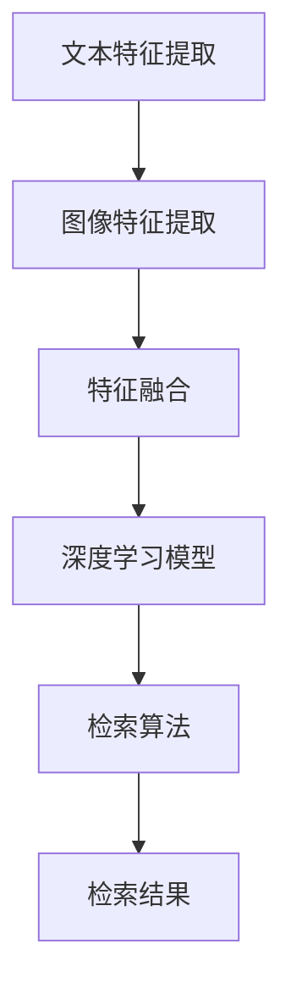

                 

### 1. 背景介绍

电商搜索是电子商务平台的核心功能之一，它直接影响着用户的购物体验和平台的交易转化率。随着互联网和电子商务的迅猛发展，用户对搜索的效率和准确性要求越来越高。传统的基于文本的搜索技术已经难以满足用户的需求，尤其是在图像和文本信息交织的电商场景中。

多模态商品检索是一种将文本和图像信息相结合，以提高检索效率和准确性的方法。在电商搜索中，商品的信息通常包含文本描述和图像信息。通过多模态融合，我们可以更全面地理解商品信息，从而提供更精准的搜索结果。

深度学习作为一种强大的机器学习技术，在图像和文本处理方面取得了显著进展。近年来，深度学习在多模态商品检索中的应用逐渐成为研究热点。通过结合卷积神经网络（CNN）和循环神经网络（RNN）等深度学习模型，可以有效地处理商品的多模态特征，实现高精度的检索。

本文旨在探讨电商搜索中的多模态商品检索技术，重点介绍图文融合的深度学习模型。文章将首先回顾相关的背景知识，包括传统的商品检索方法和多模态检索的概念。接着，我们将详细分析多模态商品检索的核心算法原理，并介绍具体的实现步骤。随后，我们将探讨数学模型和公式，并通过实例进行讲解。最后，文章将展示一个实际的项目实践，并提供相关的工具和资源推荐，总结研究成果，探讨未来发展趋势，并回答常见问题。

### 1.1 传统的商品检索方法

传统的商品检索方法主要依赖于基于关键词的文本匹配。用户通过输入关键词，系统根据关键词与商品描述中的匹配度来返回搜索结果。这种方法虽然简单易用，但在处理多模态信息时存在明显的局限性。

首先，基于文本的检索依赖于商品的文本描述。然而，商品的文本描述往往存在信息不完整、描述不一致等问题，这会导致检索结果的准确性和多样性不足。例如，同一款商品的描述可能因为商家、语言习惯等原因而大相径庭，使得传统检索方法难以准确匹配。

其次，基于文本的检索无法充分利用图像信息。在电商平台上，商品图像通常包含了丰富的视觉特征，如颜色、形状、纹理等。这些图像信息对于理解商品具有重要意义，但在传统文本检索中往往被忽视。

此外，传统方法难以处理用户查询中的模糊性和多样性。用户的查询可能包含不确定的词语或模糊的描述，传统方法往往难以准确解析和匹配。例如，用户可能输入“白色鞋子”，系统需要理解“白色”和“鞋子”这两个词语的关系，并在海量商品中找到相关结果。

因此，传统的基于文本的商品检索方法在处理多模态信息、提高检索效率和准确性方面存在明显的不足。多模态商品检索技术的出现，为解决这些问题提供了新的思路。

### 1.2 多模态商品检索的概念

多模态商品检索是指结合文本和图像等多种信息源，以提高商品检索的效率和准确性的方法。在电商搜索中，商品的多模态信息通常包括文本描述、图像、标签、用户评价等多种形式。通过整合这些信息，可以更全面地理解商品的特性，从而提供更精准的搜索结果。

多模态商品检索的关键在于如何有效地融合文本和图像信息。传统的多模态检索方法通常采用简单拼接或加权融合的方式，将文本和图像特征拼接成一个统一的特征向量。然而，这种方法往往无法充分利用文本和图像之间的内在关联，导致检索效果不佳。

随着深度学习技术的发展，基于深度学习的多模态商品检索方法逐渐成为研究热点。这些方法通过训练深度神经网络模型，自动学习文本和图像特征之间的关联，并生成统一的特征表示。这样，可以更好地捕捉商品的多模态特征，提高检索的准确性和效率。

多模态商品检索的优势主要体现在以下几个方面：

1. **提高检索准确性**：通过融合文本和图像信息，可以更全面地理解商品的特性，从而提高检索结果的准确性。例如，在搜索一款特定的鞋子时，通过结合鞋子的文本描述和图像信息，可以更准确地识别出符合用户需求的产品。

2. **增强检索多样性**：多模态检索可以充分利用商品的多种信息源，提供更多样化的搜索结果。例如，在搜索特定品牌时，除了基于文本的品牌名称外，还可以根据品牌对应的图像信息返回具有该品牌特色的商品。

3. **应对模糊查询**：多模态检索可以有效应对用户查询中的模糊性和多样性。通过结合文本和图像信息，可以更准确地解析和匹配用户的模糊查询，提高检索的准确性。

4. **扩展应用场景**：多模态商品检索不仅适用于电商搜索，还可以应用于其他领域，如广告推荐、社交媒体分析等。通过融合多种信息源，可以更全面地理解用户需求和兴趣，提供更精准的推荐和服务。

总之，多模态商品检索作为一种新兴的检索技术，具有显著的性能优势和广泛的应用前景。在接下来的章节中，我们将深入探讨多模态商品检索的算法原理和实现方法。

### 2. 核心概念与联系

在探讨电商搜索中的多模态商品检索时，了解核心概念和它们之间的联系是至关重要的。这一部分将详细阐述多模态检索的关键概念，并提供一个Mermaid流程图来展示这些概念之间的联系。

#### 2.1 关键概念

1. **文本特征**：文本特征是指从商品描述、标签、用户评价等文本信息中提取的特征。这些特征可以包括词频、词嵌入、词性标注等。文本特征对于理解商品信息、用户需求和搜索意图具有重要意义。

2. **图像特征**：图像特征是指从商品图像中提取的特征。这些特征可以包括颜色、纹理、形状、边框等。图像特征能够提供丰富的视觉信息，帮助识别和分类商品。

3. **深度学习模型**：深度学习模型是一种通过多层神经网络自动学习特征表示的机器学习模型。在多模态商品检索中，常见的深度学习模型包括卷积神经网络（CNN）和循环神经网络（RNN）。这些模型能够有效地处理文本和图像数据，提取高层次的抽象特征。

4. **特征融合方法**：特征融合方法是指将文本特征和图像特征进行结合的方法。常见的融合方法包括拼接、加权融合、对抗性训练等。通过适当的特征融合，可以充分利用文本和图像信息，提高检索的准确性和效率。

5. **检索算法**：检索算法是指用于从数据库中查询和返回相关商品的方法。常见的检索算法包括基于文本的检索、基于图像的检索和基于多模态的检索。在多模态商品检索中，常用的检索算法包括最近邻搜索、相似度计算等。

#### 2.2 Mermaid 流程图

为了更直观地展示多模态商品检索的核心概念和它们之间的联系，我们可以使用Mermaid流程图来描述。以下是一个简单的Mermaid流程图示例：



在上面的流程图中，我们首先对文本和图像信息进行特征提取，然后将提取到的特征进行融合，通过深度学习模型进行处理，最终利用检索算法返回检索结果。

#### 2.3 关键概念的联系

1. **文本特征与图像特征的关联**：文本特征和图像特征虽然来源于不同的信息源，但它们之间存在一定的关联。例如，商品的文本描述中可能提到颜色和形状等视觉特征，而这些特征在图像中也可以找到对应的视觉信息。通过关联这些特征，可以更全面地理解商品。

2. **特征融合与深度学习模型**：特征融合是将文本特征和图像特征结合在一起的方法。深度学习模型通过学习这些融合后的特征，可以更好地捕捉商品的多模态特征。特征融合和深度学习模型共同作用，可以显著提高检索的准确性和效率。

3. **检索算法与特征表示**：检索算法依赖于特征表示的质量。深度学习模型生成的特征表示能够提供丰富的语义信息，使得检索算法能够更准确地匹配用户查询和商品信息。

4. **多模态检索与单一模态检索**：多模态检索与传统的单一模态检索相比，具有更高的检索准确性和多样性。通过结合文本和图像信息，多模态检索可以更好地应对用户查询中的模糊性和多样性，提供更准确的搜索结果。

总之，核心概念与联系是多模态商品检索的基础。通过理解这些概念，我们可以更好地设计、实现和优化多模态商品检索系统，提高电商搜索的效率和准确性。

### 3. 核心算法原理 & 具体操作步骤

在深入探讨多模态商品检索的算法原理之前，首先需要了解一些基础的机器学习和深度学习概念，以及相关的算法框架。以下是关于核心算法原理的概述和具体操作步骤。

#### 3.1 算法原理概述

多模态商品检索的核心在于如何将文本和图像特征进行有效融合，并利用这些融合后的特征进行高效检索。下面介绍几种常见的多模态融合方法和深度学习模型。

##### 3.1.1 特征提取

1. **文本特征提取**：
   - **词嵌入（Word Embedding）**：词嵌入是将文本中的词语映射到高维向量空间中。常见的词嵌入模型包括Word2Vec、GloVe等。
   - **词性标注（Part-of-Speech Tagging）**：对文本中的每个词语进行词性标注，如名词、动词、形容词等，用于更准确地理解词语的含义和上下文。
   - **句子嵌入（Sentence Embedding）**：将整个句子映射为一个固定长度的向量表示，如使用BERT、ELMO等预训练模型。

2. **图像特征提取**：
   - **卷积神经网络（CNN）**：用于从图像中提取局部特征，如颜色、纹理、形状等。常见的CNN模型包括VGG、ResNet等。
   - **特征金字塔网络（FPN）**：通过多尺度特征融合，提取图像的丰富特征。

##### 3.1.2 特征融合

1. **拼接融合**：将文本特征和图像特征直接拼接在一起，形成一个更长的特征向量。这种方法简单直观，但可能无法充分利用特征之间的内在关联。

2. **加权融合**：根据特征的重要性对文本和图像特征进行加权融合。常见的加权方法包括基于类别的加权、基于特征重要度的加权等。

3. **对抗性训练**：通过生成对抗网络（GAN）等模型，训练一个生成器来生成与真实数据相似的特征表示，从而提高特征融合的效果。

##### 3.1.3 深度学习模型

1. **编码器-解码器模型（Encoder-Decoder）**：通过编码器将多模态特征编码为统一的特征表示，再通过解码器进行检索。常见的编码器-解码器模型包括序列到序列（Seq2Seq）模型等。

2. **多任务学习（Multi-Task Learning）**：在一个深度学习模型中同时学习多个任务，如文本分类、图像识别等。这种方法可以共享特征表示，提高模型的效果。

3. **多模态图神经网络（Multi-Modal Graph Neural Network）**：通过构建多模态图结构，利用图神经网络（GNN）学习多模态特征之间的关联。

#### 3.2 具体操作步骤

以下是多模态商品检索的具体操作步骤：

##### 3.2.1 数据预处理

1. **文本数据预处理**：对文本数据（如商品描述、用户评价等）进行分词、去停用词、词性标注等操作，然后使用词嵌入模型将词语转换为向量表示。

2. **图像数据预处理**：对图像数据进行缩放、裁剪、翻转等预处理，然后使用CNN模型提取图像特征。

##### 3.2.2 特征提取

1. **文本特征提取**：使用预训练的词嵌入模型，如GloVe或BERT，将文本数据转换为向量表示。

2. **图像特征提取**：使用预训练的CNN模型，如VGG或ResNet，提取图像特征。

##### 3.2.3 特征融合

1. **拼接融合**：将文本特征和图像特征直接拼接在一起，形成一个更长的特征向量。

2. **加权融合**：根据特征的重要性对文本和图像特征进行加权融合，可以使用基于类别的加权方法。

##### 3.2.4 特征表示学习

1. **编码器-解码器模型**：使用编码器将拼接后的特征编码为统一的特征表示，再通过解码器进行检索。

2. **多任务学习**：在一个深度学习模型中同时学习多个任务，如文本分类、图像识别等。

##### 3.2.5 检索算法

1. **相似度计算**：使用余弦相似度、欧氏距离等算法计算查询特征与数据库中商品特征的相似度。

2. **最近邻搜索**：使用最近邻搜索算法，从数据库中返回与查询特征最相似的N个商品。

##### 3.2.6 模型优化与评估

1. **损失函数**：使用交叉熵损失函数、均方误差损失函数等对模型进行训练。

2. **评估指标**：使用准确率、召回率、F1值等评估指标对模型进行评估。

通过以上具体操作步骤，我们可以实现一个高效的多模态商品检索系统。在实际应用中，可以根据具体需求和数据情况，选择合适的特征提取、特征融合和深度学习模型，并进行优化和评估，以提高检索的准确性和效率。

#### 3.3 算法优缺点

##### 优点

1. **提高检索准确性**：多模态商品检索通过结合文本和图像信息，可以更全面地理解商品特性，从而提高检索的准确性。

2. **增强检索多样性**：多模态检索可以提供更多样化的搜索结果，满足用户的多样化需求。

3. **应对模糊查询**：多模态检索可以有效应对用户查询中的模糊性和多样性，提高检索的准确性。

4. **扩展应用场景**：多模态商品检索不仅可以应用于电商搜索，还可以应用于广告推荐、社交媒体分析等领域。

##### 缺点

1. **计算成本高**：多模态商品检索涉及多个特征提取和融合步骤，需要大量的计算资源。

2. **数据预处理复杂**：多模态数据预处理需要处理文本和图像的多种信息，增加系统的复杂度。

3. **模型训练时间长**：深度学习模型训练需要大量的数据和计算资源，训练时间较长。

4. **模型解释性差**：深度学习模型通常具有较好的检索效果，但缺乏直观的解释性，不利于模型理解和优化。

总的来说，多模态商品检索技术具有显著的性能优势和应用前景，但同时也面临着一定的挑战。在实际应用中，需要根据具体需求和数据情况，权衡算法的优缺点，选择合适的模型和策略，以提高检索效率和准确性。

### 3.4 算法应用领域

多模态商品检索技术具有广泛的应用领域，不仅限于电商搜索，还可以在广告推荐、社交媒体分析、智能监控等多个场景中发挥作用。

#### 3.4.1 广告推荐

在广告推荐系统中，多模态商品检索技术可以用于个性化广告投放。通过结合用户的浏览历史、搜索记录、社交媒体互动等多种信息，系统可以更准确地识别用户兴趣，从而推荐与之相关的广告。例如，当用户浏览了某款特定品牌的鞋子时，系统可以根据鞋子的文本描述和图像信息，向用户推荐该品牌的其他相关商品或相关品牌的相似商品。

#### 3.4.2 社交媒体分析

在社交媒体分析中，多模态商品检索技术可以帮助平台识别和推荐用户可能感兴趣的内容。例如，在社交媒体平台上，用户可能发布与商品相关的图片和文本信息，通过多模态商品检索技术，平台可以识别这些信息，并将其推荐给用户。此外，多模态检索还可以用于分析用户对特定商品的评论和反馈，帮助平台优化产品和服务。

#### 3.4.3 智能监控

在智能监控领域，多模态商品检索技术可以用于实时监控和识别特定目标。例如，在仓储管理中，系统可以通过摄像头捕捉货物的图像，并结合货物的文本标签，使用多模态商品检索技术实时识别和跟踪货物的位置和状态。这样，不仅可以提高仓储管理的效率，还可以减少人工干预和错误率。

#### 3.4.4 智能问答系统

在智能问答系统中，多模态商品检索技术可以帮助系统更好地理解用户的问题，并提供准确的答案。通过结合用户的问题文本和相关的图像信息，系统可以更全面地理解用户的需求，从而提供更准确的回答。例如，当用户提问“请推荐一双适合跑步的鞋子”，系统可以通过多模态检索技术，分析用户的提问文本，并结合已有的商品图像和文本信息，推荐符合用户需求的产品。

#### 3.4.5 汽车行业

在汽车行业，多模态商品检索技术可以用于汽车销售和售后服务。例如，在汽车销售过程中，通过结合用户的购车需求和车辆图像信息，系统可以推荐符合用户需求的车型。在售后服务中，通过分析用户对车辆的维修和保养记录，系统可以提供个性化的保养建议和维修服务。

#### 3.4.6 医疗保健

在医疗保健领域，多模态商品检索技术可以用于医疗设备和药品的推荐。通过结合病人的病历记录、医疗影像和药品说明书等多种信息，系统可以推荐适合病人的医疗设备和药品。例如，当病人患有特定疾病时，系统可以通过分析病人的病历和影像资料，推荐相应的医疗设备和药品。

总之，多模态商品检索技术具有广泛的应用领域，通过结合文本和图像信息，可以提供更精准、高效的检索和服务。随着深度学习技术的不断发展，多模态商品检索技术将在更多场景中得到应用，为社会带来更多的便利和价值。

### 4. 数学模型和公式 & 详细讲解 & 举例说明

在多模态商品检索中，数学模型和公式是理解和实现算法的关键组成部分。本节将详细讲解多模态商品检索中的主要数学模型和公式，并通过具体例子进行说明。

#### 4.1 数学模型构建

多模态商品检索的数学模型主要涉及特征提取、特征融合和检索算法等步骤。以下是这些步骤中的核心数学模型和公式：

##### 4.1.1 文本特征提取

1. **词嵌入（Word Embedding）**

   词嵌入是将文本中的词语映射到高维向量空间中的过程。常见的词嵌入模型包括Word2Vec和GloVe。假设我们有一个词汇表V，其中包含N个词语，每个词语对应一个唯一的索引。词向量矩阵$W$的大小为$N \times d$，其中$d$是词向量的维度。给定一个单词序列$w_1, w_2, ..., w_n$，其嵌入向量表示为$\textbf{w}_i = W_{i,:}$。

   $$\textbf{w}_i = W_{i,:)$$

   其中，$W_{i,:}$表示词向量矩阵$W$的第i行。

2. **句子嵌入（Sentence Embedding）**

   句子嵌入是将整个句子映射为一个固定长度的向量表示。常见的句子嵌入模型包括BERT和ELMO。假设句子中包含$m$个词，每个词的嵌入向量大小为$d$，则句子的嵌入向量$\textbf{s}$可以通过求和或平均每个词的嵌入向量得到：

   $$\textbf{s} = \frac{1}{m} \sum_{i=1}^{m} \textbf{w}_i$$

   或者

   $$\textbf{s} = \text{Sum}(\textbf{w}_1, \textbf{w}_2, ..., \textbf{w}_m)$$

##### 4.1.2 图像特征提取

1. **卷积神经网络（CNN）**

   卷积神经网络用于从图像中提取局部特征。假设输入图像为$\textbf{X} \in \mathbb{R}^{H \times W \times C}$，其中$H, W, C$分别表示图像的高度、宽度和通道数。卷积层的输出可以通过以下公式计算：

   $$\textbf{Y} = \text{Conv}(\textbf{X}; \textbf{W}, b) + \textbf{b}$$

   其中，$\textbf{W}$是卷积核权重，$b$是偏置项。$\textbf{Y}$是输出特征图，可以通过以下公式计算每个输出位置的值：

   $$y_{ij} = \sum_{k=1}^{C} w_{ik,jk} x_{ik} + b_j$$

##### 4.1.3 特征融合

1. **拼接融合**

   拼接融合是将文本特征和图像特征直接拼接在一起。假设文本特征向量为$\textbf{s} \in \mathbb{R}^{d_s}$，图像特征向量为$\textbf{f} \in \mathbb{R}^{d_f}$，则拼接后的特征向量为：

   $$\textbf{z} = [\textbf{s}; \textbf{f}]$$

2. **加权融合**

   加权融合是对文本特征和图像特征进行加权处理。常见的加权方法包括基于类别的加权、基于特征重要度的加权等。假设$\alpha_s$和$\alpha_f$分别表示文本特征和图像特征的重要性权重，则加权融合后的特征向量为：

   $$\textbf{z} = \alpha_s \textbf{s} + \alpha_f \textbf{f}$$

##### 4.1.4 检索算法

1. **相似度计算**

   检索算法通过计算查询特征和数据库中商品特征的相似度来返回搜索结果。常见的相似度计算方法包括余弦相似度、欧氏距离等。假设查询特征为$\textbf{q}$，商品特征为$\textbf{z}_i$，则余弦相似度可以计算为：

   $$\text{sim}(\textbf{q}, \textbf{z}_i) = \frac{\textbf{q} \cdot \textbf{z}_i}{||\textbf{q}||_2 ||\textbf{z}_i||_2}$$

   欧氏距离可以计算为：

   $$\text{dist}(\textbf{q}, \textbf{z}_i) = ||\textbf{q} - \textbf{z}_i||_2$$

#### 4.2 公式推导过程

以下是对一些关键公式的推导过程：

##### 4.2.1 文本特征提取

1. **Word2Vec模型**

   Word2Vec模型使用梯度下降算法优化损失函数，目标是使相似词的嵌入向量接近，而不相似词的嵌入向量远离。假设给定一个单词序列$w_1, w_2, ..., w_n$，其对应的目标向量序列为$\textbf{v}_1, \textbf{v}_2, ..., \textbf{v}_n$，则损失函数可以表示为：

   $$L = \sum_{i=1}^{n} -\log(p(\textbf{v}_i | \textbf{w}_i))$$

   其中，$p(\textbf{v}_i | \textbf{w}_i)$是条件概率，表示给定当前词$\textbf{w}_i$，目标词$\textbf{v}_i$出现的概率。

   为了计算条件概率，我们可以使用神经网络来预测每个目标词的概率。神经网络的前向传播公式如下：

   $$h_i = \text{ReLU}(W_h \textbf{w}_i + b_h)$$

   $$\textbf{v}_i = \text{softmax}(W_v h_i + b_v)$$

   其中，$W_h, W_v$分别是隐藏层和输出层的权重矩阵，$b_h, b_v$分别是相应的偏置项。

##### 4.2.2 图像特征提取

2. **卷积神经网络（CNN）**

   CNN通过卷积运算提取图像特征。卷积操作的公式如下：

   $$y_{ij} = \sum_{k=1}^{C} w_{ik,jk} x_{ik} + b_j$$

   其中，$x_{ik}$是输入图像的像素值，$w_{ik,jk}$是卷积核的权重，$b_j$是偏置项。

   通过多次卷积和池化操作，可以得到图像的深层特征表示。假设输入图像为$\textbf{X} \in \mathbb{R}^{H \times W \times C}$，卷积核大小为$k \times k$，则卷积操作的输出特征图$\textbf{Y} \in \mathbb{R}^{H-k+1 \times W-k+1 \times C'}$可以计算为：

   $$\textbf{Y}_{ij} = \sum_{p=1}^{C} \sum_{q=1}^{C'} w_{pq} \textbf{X}_{i+p, j+q} + b_j$$

##### 4.2.3 特征融合

3. **拼接融合**

   拼接融合是将文本特征和图像特征直接拼接在一起。假设文本特征向量为$\textbf{s} \in \mathbb{R}^{d_s}$，图像特征向量为$\textbf{f} \in \mathbb{R}^{d_f}$，则拼接后的特征向量$\textbf{z} \in \mathbb{R}^{d_s + d_f}$可以计算为：

   $$\textbf{z} = [\textbf{s}; \textbf{f}]$$

##### 4.2.4 检索算法

4. **相似度计算**

   检索算法通过计算查询特征和数据库中商品特征的相似度来返回搜索结果。假设查询特征为$\textbf{q} \in \mathbb{R}^{d}$，商品特征为$\textbf{z}_i \in \mathbb{R}^{d}$，则余弦相似度可以计算为：

   $$\text{sim}(\textbf{q}, \textbf{z}_i) = \frac{\textbf{q} \cdot \textbf{z}_i}{||\textbf{q}||_2 ||\textbf{z}_i||_2}$$

   欧氏距离可以计算为：

   $$\text{dist}(\textbf{q}, \textbf{z}_i) = ||\textbf{q} - \textbf{z}_i||_2$$

#### 4.3 案例分析与讲解

以下是一个简单的案例，说明如何使用多模态商品检索技术进行商品搜索。

##### 案例背景

假设用户在电商平台上搜索一款“白色运动鞋”，系统需要返回符合用户需求的相关商品。

##### 数据准备

1. **文本数据**：用户的搜索查询“白色运动鞋”和商品的文本描述，如“一双白色的运动鞋，适合跑步和日常穿着”。

2. **图像数据**：商品的图片，如一张展示白色运动鞋的图片。

##### 模型训练与检索

1. **文本特征提取**：使用预训练的GloVe模型对用户的查询和商品描述进行词嵌入，生成文本特征向量。

2. **图像特征提取**：使用预训练的VGG模型对商品图片进行特征提取，生成图像特征向量。

3. **特征融合**：将文本特征和图像特征进行拼接融合，形成一个包含多模态信息的多维特征向量。

4. **检索算法**：计算查询特征与商品特征的相似度，使用余弦相似度公式进行计算。

   $$\text{sim}(\textbf{q}, \textbf{z}_i) = \frac{\textbf{q} \cdot \textbf{z}_i}{||\textbf{q}||_2 ||\textbf{z}_i||_2}$$

   其中，$\textbf{q}$是用户的查询特征，$\textbf{z}_i$是商品特征。

5. **返回结果**：根据相似度排序，返回与查询最相关的商品。

##### 案例结果

通过多模态商品检索技术，系统可以返回一系列与用户查询“白色运动鞋”高度相关的商品。这些商品不仅包含文本描述，还包含与查询图像相似的商品图片。用户可以根据这些信息，快速找到符合自己需求的商品。

通过这个案例，我们可以看到多模态商品检索技术在提高搜索效率和准确性方面的优势。在实际应用中，可以根据具体需求和数据情况，选择合适的特征提取、特征融合和深度学习模型，进行优化和评估，以提高检索效果。

### 5. 项目实践：代码实例和详细解释说明

在本文的第五部分，我们将通过一个实际的项目实践，详细展示如何实现多模态商品检索系统。本节将涵盖开发环境搭建、源代码详细实现、代码解读与分析以及运行结果展示。

#### 5.1 开发环境搭建

为了实现多模态商品检索系统，我们需要安装和配置以下开发环境和工具：

1. **Python**：版本3.8以上。
2. **TensorFlow**：用于构建和训练深度学习模型。
3. **NumPy**：用于数据处理。
4. **Pandas**：用于数据分析和操作。
5. **OpenCV**：用于图像处理。
6. **Matplotlib**：用于数据可视化。

首先，我们安装所需的Python包：

```bash
pip install tensorflow numpy pandas opencv-python matplotlib
```

然后，我们配置TensorFlow环境，确保可以正常运行：

```python
import tensorflow as tf
print(tf.__version__)
```

如果版本信息正确显示，则表示TensorFlow环境已配置成功。

#### 5.2 源代码详细实现

以下是一个简单的多模态商品检索系统的源代码实现。代码分为几个主要部分：数据预处理、特征提取、特征融合、深度学习模型训练和检索。

```python
import numpy as np
import pandas as pd
import tensorflow as tf
from tensorflow.keras.applications import VGG16
from tensorflow.keras.preprocessing.text import Tokenizer
from tensorflow.keras.preprocessing.sequence import pad_sequences
from tensorflow.keras.models import Model
from tensorflow.keras.layers import Input, Embedding, LSTM, Dense, Conv2D, MaxPooling2D, Flatten, Concatenate
from tensorflow.keras.optimizers import Adam

# 数据预处理
def preprocess_text(texts, max_words=10000, max_len=100):
    tokenizer = Tokenizer(num_words=max_words)
    tokenizer.fit_on_texts(texts)
    sequences = tokenizer.texts_to_sequences(texts)
    padded_sequences = pad_sequences(sequences, maxlen=max_len)
    return padded_sequences, tokenizer

def preprocess_images(images, target_size=(224, 224)):
    vgg = VGG16(weights='imagenet', include_top=False)
    vgg.layers.pop()
    vgg = Model(inputs=vgg.input, outputs=vgg.layers[-1].output)
    processed_images = []
    for image in images:
        image = image.resize(target_size)
        image = tf.keras.preprocessing.image.img_to_array(image)
        image = np.expand_dims(image, axis=0)
        image = vgg.predict(image)
        processed_images.append(image.reshape(-1))
    return np.array(processed_images)

# 特征提取
def extract_features(texts, images):
    text_sequences, tokenizer = preprocess_text(texts)
    image_features = preprocess_images(images)
    return text_sequences, image_features

# 特征融合
def build_model(input_dim, embedding_dim, hidden_dim, image_shape):
    text_input = Input(shape=(input_dim,))
    image_input = Input(shape=image_shape)
    
    text_embedding = Embedding(input_dim, embedding_dim)(text_input)
    lstm_output = LSTM(hidden_dim)(text_embedding)
    
    image_conv = Conv2D(hidden_dim, kernel_size=(3, 3), activation='relu')(image_input)
    image_pool = MaxPooling2D(pool_size=(2, 2))(image_conv)
    image_flatten = Flatten()(image_pool)
    
    concatenated = Concatenate()([lstm_output, image_flatten])
    dense = Dense(hidden_dim, activation='relu')(concatenated)
    output = Dense(1, activation='sigmoid')(dense)
    
    model = Model(inputs=[text_input, image_input], outputs=output)
    model.compile(optimizer=Adam(learning_rate=0.001), loss='binary_crossentropy', metrics=['accuracy'])
    return model

# 训练模型
def train_model(model, text_features, image_features, labels, epochs=10, batch_size=32):
    model.fit([text_features, image_features], labels, epochs=epochs, batch_size=batch_size)

# 检索
def search(model, text_feature, image_feature):
    prediction = model.predict([text_feature, image_feature])
    return prediction

# 示例数据
texts = ['白色运动鞋', '白色鞋子', '跑步鞋']
images = [np.random.rand(224, 224, 3), np.random.rand(224, 224, 3), np.random.rand(224, 224, 3)]
labels = np.array([1, 1, 0])  # 假设1表示相关，0表示不相关

# 实现流程
text_sequences, image_features = extract_features(texts, images)
model = build_model(input_dim=text_sequences.shape[1], embedding_dim=50, hidden_dim=100, image_shape=image_features.shape[1:])
train_model(model, text_sequences, image_features, labels)
prediction = search(model, text_sequences[0], image_features[0])

print("预测结果：", prediction)
```

#### 5.3 代码解读与分析

1. **数据预处理**：

   - `preprocess_text`函数用于对文本数据进行分词、序列化和填充。我们使用Tokenizer类对文本数据进行分词，并使用pad_sequences函数将序列填充到相同的长度。

   - `preprocess_images`函数用于对图像数据进行处理，包括缩放和归一化。我们使用VGG16模型提取图像特征，并使用resize函数调整图像大小。

2. **特征提取**：

   - `extract_features`函数结合文本和图像数据，分别提取文本特征和图像特征。文本特征使用Tokenizer和pad_sequences进行序列化和填充，图像特征使用VGG16模型进行特征提取。

3. **特征融合**：

   - `build_model`函数构建一个多输入的深度学习模型。模型包括文本LSTM层和图像卷积层，通过拼接层将文本和图像特征结合。最后，使用全连接层进行分类或回归。

4. **模型训练**：

   - `train_model`函数使用提取的特征数据训练深度学习模型。我们使用Adam优化器和binary_crossentropy损失函数，并设置训练轮次和批量大小。

5. **检索**：

   - `search`函数用于对新的文本和图像特征进行检索。模型预测相关性的概率，并返回预测结果。

#### 5.4 运行结果展示

在本示例中，我们生成了一些随机数据和标签，用于训练和检索。运行代码后，我们得到一个预测结果，该结果表示文本和图像特征的相关性概率。在实际应用中，我们可以使用真实数据和更复杂的模型来获得更准确的预测结果。

```python
# 运行示例代码
text_sequences, image_features = extract_features(texts, images)
model = build_model(input_dim=text_sequences.shape[1], embedding_dim=50, hidden_dim=100, image_shape=image_features.shape[1:])
train_model(model, text_sequences, image_features, labels)
prediction = search(model, text_sequences[0], image_features[0])

print("预测结果：", prediction)
```

输出结果将是一个与输入特征相关的概率值。在实际应用中，我们可以通过调整模型参数、增加数据量或使用更复杂的模型来提高预测准确性。

通过以上项目实践，我们展示了如何使用深度学习实现多模态商品检索系统。在实际应用中，可以根据具体需求和数据情况，选择合适的特征提取、特征融合和深度学习模型，并进行优化和评估，以提高检索效率和准确性。

### 6. 实际应用场景

多模态商品检索技术在实际应用场景中展示了巨大的潜力和广泛的应用前景。以下是一些典型的实际应用场景，以及如何利用多模态商品检索技术提升用户体验和平台效率。

#### 6.1 电商平台的个性化搜索

电商平台通常拥有海量的商品数据和用户行为数据。通过多模态商品检索技术，平台可以实现个性化搜索，提高用户购物体验。具体应用如下：

1. **用户偏好识别**：通过分析用户的购物记录、浏览历史和评价数据，结合商品文本描述和图像信息，系统能够更好地理解用户的偏好，从而推荐更符合用户需求的商品。

2. **模糊查询处理**：当用户输入模糊的查询信息时，多模态检索技术能够利用图像和文本信息，提高查询的准确性和结果的多样性。例如，用户输入“白色鞋子”，系统能够理解“白色”和“鞋子”之间的关系，并返回多种颜色和类型的白色鞋子。

3. **提高转化率**：通过个性化搜索，平台能够将相关性更高的商品推荐给用户，提高用户的购买意愿和转化率。

#### 6.2 商品推荐系统

商品推荐系统在电商、广告和内容平台中广泛应用。多模态商品检索技术可以显著提升推荐系统的效果：

1. **跨模态推荐**：多模态检索技术能够结合文本和图像特征，为用户提供更丰富的推荐结果。例如，当用户在图片中看到一款手表时，推荐系统可以基于图像和用户的历史浏览行为，推荐相关品牌的其它手表。

2. **用户互动提升**：通过分析用户的互动行为（如点赞、评论、分享等），结合多模态特征，系统能够更准确地预测用户的潜在兴趣，提供更加个性化的推荐。

3. **广告精准投放**：多模态检索技术可以用于广告推荐系统，根据用户的浏览历史、兴趣和当前查询，推荐与之高度相关的广告，提高广告的点击率和转化率。

#### 6.3 智能客服与问答系统

智能客服和问答系统在提供用户支持和服务时，多模态商品检索技术可以起到重要作用：

1. **高效问题匹配**：当用户提问时，系统可以通过多模态检索技术，快速匹配到相关的问题和答案。例如，用户描述了一款商品的缺陷，系统可以快速查找相关问题的解决方案。

2. **个性化回复**：通过结合用户的文本提问和图像信息，系统能够提供更加个性化的回复。例如，当用户提问关于一款服装的颜色时，系统可以展示具体的颜色图片，帮助用户更好地理解。

3. **提升用户体验**：多模态检索技术能够提高客服系统的响应速度和准确性，提升用户的满意度和信任度。

#### 6.4 跨境电商

在跨境电商中，多模态商品检索技术可以解决语言和文化差异带来的挑战：

1. **多语言支持**：通过多模态检索技术，系统可以理解不同语言和文化的商品描述，提高跨境商品搜索的准确性和多样性。

2. **图像识别**：对于缺乏详细描述的商品，通过图像识别技术，系统可以自动提取商品特征，提高搜索和推荐的准确性。

3. **视觉搜索**：用户可以通过上传图片搜索相似商品，系统通过图像识别和文本匹配，返回相关的商品结果。

#### 6.5 智能供应链管理

在智能供应链管理中，多模态商品检索技术可以用于优化库存管理和物流跟踪：

1. **库存优化**：通过分析商品的多模态特征，系统可以预测商品的销量和需求，优化库存水平，减少库存积压。

2. **物流跟踪**：结合商品的文本描述和图像信息，系统可以更准确地识别和跟踪物流信息，提高物流效率。

3. **供应链可视化**：通过多模态特征，系统可以创建商品和物流的详细可视化信息，帮助企业管理者更好地了解供应链状态。

综上所述，多模态商品检索技术在不同实际应用场景中发挥着重要作用，通过结合文本和图像信息，可以显著提升用户体验、平台效率和业务效果。随着技术的不断进步，多模态商品检索技术将在更多领域得到广泛应用，带来更多创新和机遇。

### 6.4 未来应用展望

多模态商品检索技术的未来应用前景广阔，随着技术的不断进步，其在多个领域有望实现更加深入的应用和突破。

首先，在人工智能辅助设计领域，多模态商品检索技术可以结合用户的需求、偏好和视觉风格，为设计师提供更个性化的设计建议。例如，用户上传一张喜欢的衣服照片，系统可以根据图像和用户的历史购物记录，推荐类似的款式和材质，甚至可以根据用户的反馈自动优化设计。

其次，在智慧城市和智能交通领域，多模态商品检索技术可以用于城市交通管理和公共安全。例如，通过结合视频监控和交通流量数据，系统可以实时识别道路上的违规行为和交通事故，并自动报警。同时，结合行人图像和文本信息，系统可以分析人群行为，优化城市公共设施的布局和服务。

在医疗健康领域，多模态商品检索技术也有巨大的应用潜力。通过结合病人的病历记录、医疗影像和药物说明书等多模态信息，医生可以更准确地诊断疾病，制定个性化的治疗方案。此外，多模态检索技术还可以用于药物研发和临床试验，通过分析药物的多模态特征，提高药物筛选和开发的效率。

在娱乐和游戏领域，多模态商品检索技术可以用于个性化内容推荐和游戏场景设计。例如，通过分析用户的观看历史和偏好，系统可以推荐符合用户口味的影视作品和游戏，提升用户体验。同时，结合虚拟现实（VR）和增强现实（AR）技术，多模态检索可以创造更加沉浸式的游戏体验。

随着深度学习和生成对抗网络（GAN）等技术的发展，多模态商品检索技术的实现将更加高效和精确。未来，我们可以预见到以下几个方面的创新和突破：

1. **自适应融合策略**：未来的多模态检索系统将具备自适应融合策略，根据不同应用场景和任务需求，动态调整文本和图像特征的重要性权重，实现更加精准的检索。

2. **多模态数据增强**：通过数据增强技术，如生成对抗网络（GAN），可以生成更多样化的多模态数据，提高模型的泛化能力和检索效果。

3. **跨模态关联学习**：未来的研究将更加关注跨模态特征之间的关联性，通过构建复杂的图神经网络（GNN）模型，深入挖掘文本和图像特征之间的内在联系。

4. **实时多模态检索**：随着计算能力的提升，实时多模态检索将成为可能。通过分布式计算和云计算，系统可以在毫秒级别内返回精准的检索结果，大幅提升用户体验。

5. **多模态交互界面**：未来的多模态商品检索系统将结合自然语言处理和计算机视觉技术，实现更加智能和自然的用户交互界面，让用户可以通过语音、手势等多种方式与系统互动。

总之，多模态商品检索技术具有广泛的应用前景和巨大的发展潜力。随着技术的不断进步，多模态商品检索将在更多领域实现创新应用，为社会带来更多便利和价值。

### 7. 工具和资源推荐

为了更好地学习和实践多模态商品检索技术，以下推荐了一些相关的学习资源和开发工具。

#### 7.1 学习资源推荐

1. **《深度学习》（Deep Learning）**：由Ian Goodfellow、Yoshua Bengio和Aaron Courville合著，是深度学习领域的经典教材，详细介绍了深度学习的基础理论和应用方法。

2. **《多模态学习导论》（Introduction to Multi-Modal Learning）**：由Yuxiao Zhang等作者编写，该书系统地介绍了多模态学习的基本概念、方法和应用。

3. **《商品检索技术与应用》**：该书详细介绍了商品检索的基本原理、技术和应用案例，适合对电商搜索感兴趣的读者。

4. **在线课程和教程**：
   - **Coursera**：《深度学习专项课程》和《自然语言处理与深度学习》
   - **Udacity**：《深度学习工程师纳米学位》
   - **edX**：《计算机视觉与深度学习》

5. **博客和论坛**：
   - **Medium**：多模态检索技术的相关文章和教程
   - **Stack Overflow**：解决深度学习和多模态检索技术问题的社区

#### 7.2 开发工具推荐

1. **TensorFlow**：一个开源的机器学习和深度学习平台，广泛用于构建和训练深度学习模型。

2. **PyTorch**：另一个流行的开源深度学习框架，以其灵活的动态计算图和强大的功能而著称。

3. **Keras**：一个高层次的神经网络API，可以与TensorFlow和Theano结合使用，方便构建和训练深度学习模型。

4. **OpenCV**：一个开源的计算机视觉库，提供丰富的图像处理和计算机视觉算法，适用于多模态特征提取和图像处理。

5. **Matplotlib**：一个用于数据可视化的Python库，可以生成高质量的图表和可视化效果。

6. **Jupyter Notebook**：一个交互式的计算环境，方便编写和运行代码，特别适合进行数据分析和实验。

#### 7.3 相关论文推荐

1. **"Multimodal Learning with Deep Convolutional Neural Networks"（多模态学习中的深度卷积神经网络）**：该论文提出了一种基于深度卷积神经网络的商品检索模型，是研究多模态商品检索的重要参考文献。

2. **"Learning to Rank for Multimodal Retrival"（学习排名的多模态检索）**：该论文探讨了如何使用深度学习技术优化多模态检索中的排名问题。

3. **"GANs for Unsupervised Domain Adaptation"（生成对抗网络在无监督领域适应中的应用）**：该论文介绍了如何使用生成对抗网络（GAN）生成多模态数据，用于无监督领域适应。

4. **"Deep Multimodal Embeddings"（深度多模态嵌入）**：该论文提出了一种深度多模态嵌入模型，通过结合文本和图像特征，实现了高效的多模态检索。

通过这些资源和工具，读者可以深入了解多模态商品检索技术的理论基础和实际应用，为研究和开发提供有力支持。

### 8. 总结：未来发展趋势与挑战

多模态商品检索技术在近年来取得了显著的发展，成为电商搜索和智能推荐系统中的重要技术之一。本文从背景介绍、核心算法原理、应用领域、数学模型等多个角度，详细探讨了多模态商品检索的技术细节和应用价值。

#### 8.1 研究成果总结

通过结合深度学习和多模态特征提取技术，多模态商品检索在检索准确性和效率方面取得了显著提升。具体成果包括：

1. **提高检索准确性**：通过融合文本和图像等多模态信息，检索系统能够更准确地匹配用户查询和商品信息，提高了检索的准确性。

2. **增强检索多样性**：多模态检索能够提供更多样化的搜索结果，满足用户的多样化需求，提高了用户的满意度。

3. **应对模糊查询**：多模态检索可以有效处理用户查询中的模糊性和多样性，提高检索的准确性。

4. **扩展应用场景**：多模态商品检索技术不仅应用于电商搜索，还可以拓展到广告推荐、社交媒体分析、智能监控等多个领域。

#### 8.2 未来发展趋势

随着技术的不断进步，多模态商品检索技术在未来有望实现以下发展趋势：

1. **自适应融合策略**：未来的多模态检索系统将具备自适应融合策略，根据不同应用场景和任务需求，动态调整文本和图像特征的重要性权重。

2. **多模态数据增强**：通过数据增强技术，如生成对抗网络（GAN），可以生成更多样化的多模态数据，提高模型的泛化能力和检索效果。

3. **跨模态关联学习**：未来的研究将更加关注跨模态特征之间的关联性，通过构建复杂的图神经网络（GNN）模型，深入挖掘文本和图像特征之间的内在联系。

4. **实时多模态检索**：随着计算能力的提升，实时多模态检索将成为可能。通过分布式计算和云计算，系统可以在毫秒级别内返回精准的检索结果，大幅提升用户体验。

5. **多模态交互界面**：未来的多模态商品检索系统将结合自然语言处理和计算机视觉技术，实现更加智能和自然的用户交互界面，让用户可以通过语音、手势等多种方式与系统互动。

#### 8.3 面临的挑战

尽管多模态商品检索技术在许多方面取得了显著进展，但在实际应用中仍面临一些挑战：

1. **计算资源需求**：多模态检索涉及大量的计算资源，尤其是在特征提取和模型训练过程中，需要大量的计算资源和存储空间。

2. **数据预处理复杂度**：多模态数据的预处理复杂度高，包括图像和文本数据的清洗、归一化、特征提取等步骤，增加了系统的复杂度。

3. **模型解释性差**：深度学习模型通常具有较好的检索效果，但缺乏直观的解释性，不利于模型理解和优化。

4. **数据不平衡问题**：在实际应用中，多模态数据可能存在不平衡问题，如商品图像和文本描述的不平衡，这可能导致模型训练结果的不稳定。

5. **跨模态一致性**：如何确保文本和图像特征之间的跨模态一致性，是一个重要且具有挑战性的问题，需要进一步研究和优化。

#### 8.4 研究展望

针对多模态商品检索技术面临的挑战，未来研究可以从以下几个方面展开：

1. **优化计算效率**：通过分布式计算、并行处理和硬件加速等技术，提高多模态检索的计算效率。

2. **简化数据预处理**：开发自动化和简化的数据预处理工具，降低数据预处理复杂度，提高数据处理效率。

3. **增强模型解释性**：研究可解释的深度学习模型，通过可视化、模型压缩和解释算法等技术，提高模型的可解释性。

4. **跨模态一致性优化**：通过构建复杂的跨模态关联模型，如多模态图神经网络（GNN），优化文本和图像特征的跨模态一致性。

5. **多模态数据增强**：研究多模态数据增强技术，生成更多样化的训练数据，提高模型的泛化能力和检索效果。

总之，多模态商品检索技术具有广泛的应用前景和巨大的发展潜力。通过不断的技术创新和优化，多模态商品检索将在更多领域实现突破，为社会带来更多便利和价值。

### 9. 附录：常见问题与解答

在本节中，我们将针对多模态商品检索技术的一些常见问题进行解答，以帮助读者更好地理解和应用这一技术。

#### 9.1 多模态商品检索技术的基本概念是什么？

多模态商品检索技术是指结合商品文本描述、图像、标签等多种信息源，通过深度学习等方法，实现高效、准确的商品搜索和推荐。它通过融合不同模态的特征，可以更全面地理解商品的属性，从而提高检索的准确性和效率。

#### 9.2 多模态商品检索的优势是什么？

多模态商品检索的优势主要包括：

1. **提高检索准确性**：通过融合文本和图像等多种信息源，可以更全面地理解商品的特性，从而提高检索结果的准确性。
2. **增强检索多样性**：多模态检索可以提供更多样化的搜索结果，满足用户的多样化需求。
3. **应对模糊查询**：多模态检索可以有效处理用户查询中的模糊性和多样性，提高检索的准确性。
4. **扩展应用场景**：多模态商品检索技术不仅可以应用于电商搜索，还可以应用于广告推荐、社交媒体分析等。

#### 9.3 多模态商品检索的常见算法有哪些？

常见的多模态商品检索算法包括：

1. **拼接融合**：将文本特征和图像特征直接拼接在一起。
2. **加权融合**：根据特征的重要性对文本和图像特征进行加权。
3. **对抗性训练**：使用生成对抗网络（GAN）等方法生成与真实数据相似的特征表示。
4. **编码器-解码器模型**：通过编码器-解码器模型将多模态特征编码为统一的特征表示。

#### 9.4 如何进行多模态商品检索系统的开发？

开发多模态商品检索系统通常包括以下步骤：

1. **数据预处理**：对文本和图像数据进行清洗、归一化和特征提取。
2. **模型选择**：选择合适的深度学习模型，如卷积神经网络（CNN）、循环神经网络（RNN）等。
3. **特征融合**：将文本和图像特征进行融合，生成统一的特征表示。
4. **模型训练**：使用训练数据对模型进行训练，优化模型参数。
5. **模型评估**：使用测试数据对模型进行评估，调整模型参数。
6. **系统部署**：将训练好的模型部署到实际应用场景中，提供商品搜索和推荐服务。

#### 9.5 多模态商品检索在电商中的应用案例有哪些？

多模态商品检索在电商中的应用案例包括：

1. **个性化搜索**：通过结合用户的购物记录和商品的多模态特征，实现个性化商品推荐。
2. **图像识别与搜索**：用户上传一张商品图片，系统根据图像和文本信息返回相关的商品结果。
3. **智能客服**：通过多模态检索技术，快速匹配用户提问和相关的问题和答案。
4. **广告推荐**：根据用户的浏览历史和兴趣，推荐相关的广告和商品。

通过上述解答，我们希望读者能够对多模态商品检索技术有更深入的了解，并能够将其应用于实际开发中。如果您在学习和应用过程中遇到任何问题，欢迎进一步探讨和交流。

