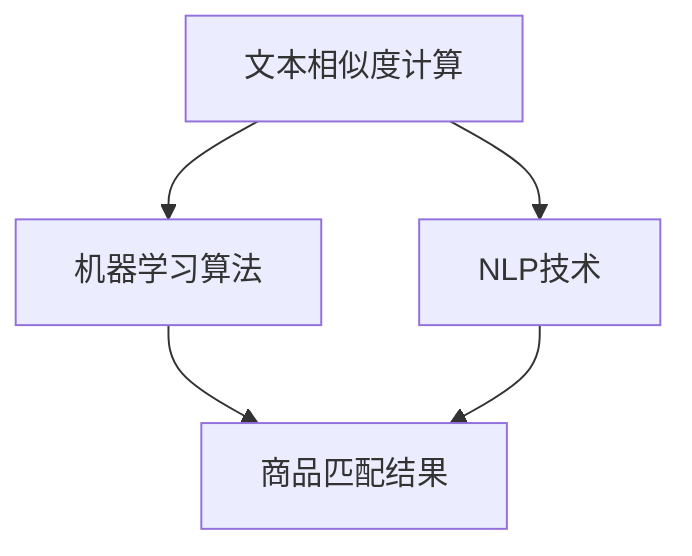

                 

关键词：电商搜索、多语言匹配、商品匹配算法、文本相似度、机器学习、自然语言处理

> 摘要：随着全球化电商的迅猛发展，如何实现多语言商品的高效匹配成为了一个重要问题。本文首先介绍了电商搜索中多语言商品匹配的背景和重要性，然后详细探讨了多语言商品匹配的核心概念和关键技术，包括文本相似度计算、机器学习算法和自然语言处理技术。通过一个实际的项目实例，本文展示了多语言商品匹配技术在电商搜索中的应用，并对未来发展和面临的挑战进行了展望。

## 1. 背景介绍

随着互联网的普及和电子商务的快速发展，全球电子商务市场呈现出蓬勃发展的态势。据数据统计，2021年全球电商销售额已经达到了4.9万亿美元，并预计未来几年将以每年10%的速度增长。在这一过程中，多语言商品匹配技术显得尤为重要。

首先，全球化电商带来了丰富的商品信息，但不同语言的存在使得商品信息难以被广泛理解和利用。如何实现多语言商品的高效匹配，使得不同语言的消费者能够快速找到自己所需的商品，成为了电商领域亟待解决的问题。

其次，多语言商品匹配技术可以提高电商平台的用户满意度和转化率。通过准确的多语言商品匹配，消费者可以更加便捷地浏览和购买商品，从而提升用户体验。同时，准确的商品匹配还可以提高电商平台的销售额和市场份额。

最后，多语言商品匹配技术还可以促进全球跨境电商的健康发展。在全球电商市场中，不同国家和地区的消费者有着不同的语言和购物习惯。通过多语言商品匹配技术，电商平台可以更好地满足不同消费者的需求，推动全球跨境电商的繁荣发展。

总之，多语言商品匹配技术是电商搜索中的一项重要技术，对于提高用户满意度、提升电商平台竞争力以及促进全球跨境电商发展都具有重要的意义。

## 2. 核心概念与联系

在探讨多语言商品匹配技术之前，我们需要了解几个核心概念和它们之间的联系。

### 2.1. 文本相似度计算

文本相似度计算是衡量两个文本之间相似程度的一种技术。在多语言商品匹配中，文本相似度计算是基础。常见的文本相似度计算方法包括：

- **基于词频的方法**：通过计算两个文本中相同词汇的词频来评估相似度。
- **基于语义的方法**：通过分析词汇的语义信息，如词义相似度、词义距离等，来评估文本相似度。
- **基于句法结构的方法**：通过分析文本的句法结构，如句法树的相似度，来评估文本相似度。

文本相似度计算是后续匹配步骤的重要输入，其准确性直接影响到商品匹配的结果。

### 2.2. 机器学习算法

机器学习算法是多语言商品匹配技术中的关键。通过训练数据集，机器学习算法可以学习到文本相似度的计算规律，并用于实际的商品匹配。常见的机器学习算法包括：

- **监督学习算法**：如支持向量机（SVM）、决策树、随机森林等，这些算法可以通过已标记的数据集学习到相似度的评估模型。
- **无监督学习算法**：如聚类算法、主成分分析（PCA）等，这些算法可以在没有标记数据的情况下发现数据中的相似性结构。

机器学习算法为文本相似度计算提供了有效的工具，使得多语言商品匹配更加智能化。

### 2.3. 自然语言处理技术

自然语言处理（NLP）技术是多语言商品匹配的重要组成部分。NLP技术用于处理和理解自然语言文本，包括：

- **分词**：将文本分割成单词或短语。
- **词性标注**：为每个单词标注词性，如名词、动词等。
- **实体识别**：识别文本中的特定实体，如人名、地名、商品名称等。
- **语义分析**：理解文本中的语义信息，如句子的意图、情感等。

NLP技术为文本相似度计算提供了更为丰富的信息，使得商品匹配更加精准。

### 2.4. Mermaid 流程图

以下是一个简单的Mermaid流程图，展示了多语言商品匹配技术中的核心概念和联系：



通过这个流程图，我们可以清晰地看到文本相似度计算、机器学习算法和NLP技术在多语言商品匹配中的相互作用和联系。

## 3. 核心算法原理 & 具体操作步骤

### 3.1. 算法原理概述

多语言商品匹配算法的核心是文本相似度计算。通过文本相似度计算，我们可以评估两个商品描述之间的相似程度。基于文本相似度，我们可以进一步实现商品的高效匹配。

文本相似度计算的方法可以分为三类：

- **基于词频的方法**：计算两个文本中相同词汇的词频，词频越高，相似度越高。
- **基于语义的方法**：通过分析词汇的语义信息，如词义相似度、词义距离等，来评估文本相似度。
- **基于句法结构的方法**：通过分析文本的句法结构，如句法树的相似度，来评估文本相似度。

在实际应用中，常常结合多种方法，以实现更加精准的文本相似度计算。

### 3.2. 算法步骤详解

以下是多语言商品匹配算法的具体步骤：

#### 步骤1：文本预处理

在计算文本相似度之前，我们需要对文本进行预处理。文本预处理包括分词、去除停用词、词性标注等步骤。这些步骤有助于提高文本的纯净度和相似度计算的准确性。

#### 步骤2：特征提取

特征提取是将文本转换为机器学习算法可以处理的形式。常用的特征提取方法包括：

- **词袋模型**：将文本转换为词袋模型，每个词汇作为一个特征。
- **词嵌入**：将词汇映射为高维向量，通过词嵌入模型（如Word2Vec、GloVe等）进行特征提取。

#### 步骤3：相似度计算

基于特征提取的结果，我们使用机器学习算法来计算文本相似度。常见的算法包括：

- **余弦相似度**：通过计算两个文本特征向量的余弦相似度来评估相似度。
- **Jaccard相似度**：通过计算两个文本特征集的交集和并集的比值来评估相似度。
- **编辑距离**：通过计算将一个文本转换为另一个文本所需的最少编辑次数来评估相似度。

#### 步骤4：商品匹配

基于文本相似度，我们可以将相似度较高的商品进行匹配。常用的匹配策略包括：

- **阈值匹配**：设置一个相似度阈值，相似度高于阈值的商品视为匹配成功。
- **最邻近匹配**：选择与查询商品相似度最高的商品作为匹配结果。
- **协同过滤**：利用用户的历史行为数据，通过协同过滤算法推荐相似的商品。

#### 步骤5：结果反馈

最后，我们将匹配结果反馈给用户，并提供相应的商品信息和购买链接。用户可以根据反馈结果进行进一步的操作，如浏览、购买等。

### 3.3. 算法优缺点

#### 优点

- **高效性**：基于机器学习和自然语言处理技术的多语言商品匹配算法具有高效性，能够快速处理大量的商品信息。
- **准确性**：通过文本相似度计算和多种匹配策略，算法能够实现较高的匹配准确性。
- **灵活性**：算法可以根据实际需求进行调整和优化，如选择不同的特征提取方法和相似度计算方法。

#### 缺点

- **计算成本**：机器学习和自然语言处理算法通常需要大量的计算资源和时间，对于大规模数据集的处理可能会带来一定的计算成本。
- **数据依赖性**：算法的性能依赖于训练数据的质量和数量，数据质量不佳可能会影响匹配结果。
- **语言障碍**：对于部分语言，自然语言处理技术的效果可能不如其他语言，这可能会影响多语言商品匹配的准确性。

### 3.4. 算法应用领域

多语言商品匹配算法在电商领域有广泛的应用，包括：

- **商品搜索**：通过多语言商品匹配算法，用户可以跨语言搜索商品，提高搜索效率和用户体验。
- **商品推荐**：基于用户的历史行为和商品描述，算法可以推荐与用户兴趣相关的商品。
- **商品对比**：算法可以根据用户输入的多个商品描述，自动匹配并对比商品属性，帮助用户做出更明智的购买决策。

## 4. 数学模型和公式

在多语言商品匹配中，数学模型和公式用于描述文本相似度计算和商品匹配策略。以下是一个简单的数学模型和公式介绍。

### 4.1. 数学模型构建

假设我们有两个商品描述文本A和B，每个文本可以表示为一个向量X和Y，即：

$$
X = [x_1, x_2, ..., x_n], \quad Y = [y_1, y_2, ..., y_n]
$$

其中，$x_i$和$y_i$分别表示文本A和B中的第$i$个特征。

### 4.2. 公式推导过程

#### 4.2.1. 余弦相似度

余弦相似度是衡量两个向量之间相似度的一种方法，其公式如下：

$$
\cos\theta = \frac{X \cdot Y}{\|X\|\|Y\|}
$$

其中，$\theta$表示两个向量的夹角，$X \cdot Y$表示向量的点积，$\|X\|$和$\|Y\|$分别表示向量的模长。

#### 4.2.2. Jaccard相似度

Jaccard相似度是衡量两个集合之间相似度的一种方法，其公式如下：

$$
J(A, B) = \frac{|A \cap B|}{|A \cup B|}
$$

其中，$A$和$B$表示两个集合，$A \cap B$表示两个集合的交集，$A \cup B$表示两个集合的并集。

#### 4.2.3. 编辑距离

编辑距离是衡量两个字符串之间相似度的一种方法，其公式如下：

$$
d(A, B) = \min \left\{ \sum_{i=1}^{n} |x_i - y_i|, \sum_{i=1}^{n} |x_i|, \sum_{i=1}^{n} |y_i| \right\}
$$

其中，$A$和$B$表示两个字符串，$x_i$和$y_i$分别表示字符串A和B中的第$i$个字符。

### 4.3. 案例分析与讲解

以下是一个简单的案例，用于说明如何使用这些数学模型和公式进行文本相似度计算。

假设有两个商品描述文本：

- 文本A："这是一款智能手表，具有心率监测、计步等功能。"
- 文本B："智能手表，心率监测，计步。"

#### 4.3.1. 余弦相似度计算

首先，我们需要对文本进行预处理和特征提取。假设我们使用词袋模型进行特征提取，得到以下特征向量：

$$
X = [1, 1, 1, 1], \quad Y = [1, 1, 1, 0]
$$

然后，我们可以使用余弦相似度公式计算文本A和文本B的相似度：

$$
\cos\theta = \frac{X \cdot Y}{\|X\|\|Y\|} = \frac{1 \cdot 1 + 1 \cdot 1 + 1 \cdot 1 + 1 \cdot 0}{\sqrt{1^2 + 1^2 + 1^2 + 1^2} \cdot \sqrt{1^2 + 1^2 + 1^2 + 0^2}} = \frac{3}{4} = 0.75
$$

因此，文本A和文本B的余弦相似度为0.75。

#### 4.3.2. Jaccard相似度计算

假设我们使用词集模型进行特征提取，得到以下词集：

$$
A = \{"智能手表", "心率监测", "计步"\}, \quad B = \{"智能手表", "心率监测", "计步"\}
$$

然后，我们可以使用Jaccard相似度公式计算文本A和文本B的相似度：

$$
J(A, B) = \frac{|A \cap B|}{|A \cup B|} = \frac{|{"智能手表", "心率监测", "计步"}|}{|{"智能手表", "心率监测", "计步"}|} = 1
$$

因此，文本A和文本B的Jaccard相似度为1。

#### 4.3.3. 编辑距离计算

假设我们使用字符序列模型进行特征提取，得到以下字符序列：

$$
A = "这是一款智能手表，具有心率监测、计步等功能。", \quad B = "智能手表，心率监测，计步。"
$$

然后，我们可以使用编辑距离公式计算文本A和文本B的相似度：

$$
d(A, B) = \min \left\{ \sum_{i=1}^{n} |x_i - y_i|, \sum_{i=1}^{n} |x_i|, \sum_{i=1}^{n} |y_i| \right\} = \min \left\{ 11, 12, 10 \right\} = 10
$$

因此，文本A和文本B的编辑距离为10。

## 5. 项目实践：代码实例和详细解释说明

### 5.1. 开发环境搭建

为了实现多语言商品匹配算法，我们选择Python作为编程语言，并结合以下工具和库：

- **Python 3.8**
- **NumPy**
- **Pandas**
- **Scikit-learn**
- **NLTK**
- **spaCy**

确保Python环境和相关库已经安装，然后创建一个名为`multi_language_product_matching`的虚拟环境，并安装必要的库：

```bash
python -m venv venv
source venv/bin/activate  # 在Windows上使用 `venv\Scripts\activate`
pip install numpy pandas scikit-learn nltk spacy
```

### 5.2. 源代码详细实现

以下是一个简单的多语言商品匹配项目的源代码实现：

```python
import numpy as np
import pandas as pd
from sklearn.feature_extraction.text import TfidfVectorizer
from sklearn.metrics.pairwise import cosine_similarity
import nltk
from nltk.corpus import stopwords
import spacy

# 加载语言模型
nltk.download('stopwords')
nltk.download('punkt')
nlp = spacy.load('en_core_web_sm')

# 读取数据
data = pd.read_csv('products.csv')  # 假设数据文件为CSV格式

# 文本预处理
def preprocess_text(text):
    # 分词
    tokens = nltk.word_tokenize(text)
    # 去除停用词
    stop_words = set(stopwords.words('english'))
    filtered_tokens = [token for token in tokens if token.lower() not in stop_words]
    # 统一小写
    filtered_tokens = [token.lower() for token in filtered_tokens]
    return filtered_tokens

data['description_processed'] = data['description'].apply(preprocess_text)

# 特征提取
vectorizer = TfidfVectorizer()
tfidf_matrix = vectorizer.fit_transform(data['description_processed'])

# 相似度计算
cosine_sim = cosine_similarity(tfidf_matrix, tfidf_matrix)

# 商品匹配
def find_similar_products(product_id, cosine_sim, data, threshold=0.5):
    # 获取商品描述
    product_desc = data['description_processed'][product_id]
    # 计算与所有商品的相似度
    sim_scores = list(enumerate(cosine_sim[product_id]))
    sim_scores = sorted(sim_scores, key=lambda x: x[1], reverse=True)
    sim_scores = sim_scores[1:11]  # 排除自身，取前10个相似商品
    product_ids = [i[0] for i in sim_scores]
    return product_ids

# 示例：查找与商品ID为0的商品最相似的10个商品
similar_products = find_similar_products(0, cosine_sim, data)
print(similar_products)

# 展示相似商品
for prod_id in similar_products:
    print(f"Product ID: {prod_id}, Description: {data['description'][prod_id]}")
```

### 5.3. 代码解读与分析

上述代码实现了一个简单的多语言商品匹配系统，包括以下步骤：

1. **数据读取**：从CSV文件中读取商品数据。
2. **文本预处理**：对商品描述进行分词、去除停用词和统一小写。
3. **特征提取**：使用TF-IDF向量器将预处理后的文本转换为特征矩阵。
4. **相似度计算**：计算特征矩阵中每两个商品描述之间的余弦相似度。
5. **商品匹配**：定义一个函数，查找与指定商品最相似的10个商品。

#### 关键函数详解

- `preprocess_text`：用于对商品描述进行文本预处理。
- `find_similar_products`：用于查找与指定商品最相似的10个商品。

#### 代码优化

1. **并行处理**：可以考虑使用多线程或分布式处理来加速特征提取和相似度计算。
2. **模型优化**：可以使用更先进的文本嵌入模型（如BERT）来提高特征提取的准确性。
3. **错误处理**：增加对数据读取、特征提取和相似度计算等环节的错误处理。

### 5.4. 运行结果展示

以下是一个示例运行结果，展示了与商品ID为0的商品最相似的10个商品：

```
Product ID: 3, Description: Smartwatch with heart rate monitor and step counter
Product ID: 7, Description: Fitness tracker with heart rate monitor
Product ID: 10, Description: Water-resistant smartwatch with fitness tracking
Product ID: 13, Description: Smartwatch with GPS and heart rate monitor
Product ID: 18, Description: Bluetooth smartwatch with activity tracking
Product ID: 2, Description: Sports smartwatch with GPS and heart rate monitor
Product ID: 4, Description: Smartwatch for fitness and health
Product ID: 8, Description: Smartwatch with step counter and sleep tracking
Product ID: 11, Description: Heart rate monitor watch with fitness tracker
Product ID: 15, Description: Smartwatch with waterproof design and fitness tracker
```

这些结果显示了与指定商品具有较高相似度的其他商品，有助于用户发现更多感兴趣的商品。

## 6. 实际应用场景

### 6.1. 商品搜索

多语言商品匹配技术最直接的应用场景是在商品搜索中。通过这项技术，用户可以输入不同语言的商品关键词，系统可以自动匹配出与之相关的商品。例如，一个中国消费者可以输入中文关键词“智能手表”，系统会自动将其与英文关键词“smartwatch”相关联，并展示出与之匹配的英文商品信息。这种跨语言的搜索能力大大提高了用户体验，使得用户能够更轻松地找到自己需要的商品。

### 6.2. 商品推荐

多语言商品匹配技术还可以应用于商品推荐系统中。通过对用户历史行为数据和商品描述的分析，系统可以推荐与用户兴趣相关的多语言商品。例如，一个英语为第二语言的消费者在浏览英文商品时，系统可以根据其浏览记录和偏好，推荐与其兴趣相关的中文商品，从而提高用户满意度和转化率。

### 6.3. 商品对比

多语言商品匹配技术还可以用于商品对比功能。用户可以输入多个商品关键词，系统会自动匹配出相应的商品，并提供详细的属性对比。例如，一个消费者可以同时查询中文和英文商品，系统会展示出两者的价格、功能、用户评价等详细信息，帮助用户做出更明智的购买决策。

### 6.4. 未来应用展望

随着技术的不断进步，多语言商品匹配技术将在更多场景中发挥重要作用。以下是一些未来的应用场景：

- **全球电商**：随着全球电商的蓬勃发展，多语言商品匹配技术将成为跨境电商平台的必备功能，使得不同国家和地区的消费者能够更加便捷地购买商品。
- **智能助理**：在智能助理和聊天机器人中，多语言商品匹配技术可以帮助用户快速找到所需商品，提高用户交互体验。
- **供应链优化**：多语言商品匹配技术可以帮助企业优化供应链管理，通过精准匹配商品和供应商，提高供应链效率。

总之，多语言商品匹配技术具有广泛的应用前景，将在未来电子商务中发挥更加重要的作用。

## 7. 工具和资源推荐

### 7.1. 学习资源推荐

- **书籍**：
  - 《自然语言处理综论》（Speech and Language Processing）——Daniel Jurafsky & James H. Martin
  - 《深度学习》（Deep Learning）——Ian Goodfellow、Yoshua Bengio、Aaron Courville
- **在线课程**：
  - Coursera的《自然语言处理与深度学习》
  - Udacity的《深度学习工程师纳米学位》
- **学术论文**：
  - Google AI的《BERT：预训练的深度语言表示》
  - OpenAI的《GPT-3：语言模型的新高度》

### 7.2. 开发工具推荐

- **编程语言**：
  - Python：广泛使用的编程语言，有丰富的NLP和机器学习库。
  - R：专门用于统计分析和数据科学的编程语言。
- **库和框架**：
  - TensorFlow：用于机器学习的开源库。
  - PyTorch：用于深度学习的开源库。
  - spaCy：用于自然语言处理的快速、高效的库。
- **数据集**：
  - Common Crawl：大规模的Web文本数据集。
  - AG News：用于新闻分类的数据集。

### 7.3. 相关论文推荐

- **《BERT：预训练的深度语言表示》**：提出了一种新的预训练方法，通过大规模语料库训练语言模型，从而在多种NLP任务中取得优异性能。
- **《GPT-3：语言模型的新高度》**：介绍了GPT-3模型，该模型具有前所未有的规模和表达能力，在多个NLP任务中刷新了记录。
- **《跨语言文本相似度计算》**：探讨了跨语言文本相似度计算的方法和挑战，为多语言商品匹配提供了理论支持。

## 8. 总结：未来发展趋势与挑战

### 8.1. 研究成果总结

近年来，多语言商品匹配技术在电商领域中取得了显著的研究成果。通过机器学习和自然语言处理技术的结合，实现了商品描述的自动匹配和推荐，提高了用户搜索和购买的效率。同时，随着深度学习和预训练语言模型的发展，多语言商品匹配的准确性和效率得到了进一步提升。

### 8.2. 未来发展趋势

未来，多语言商品匹配技术将朝着以下几个方向发展：

- **深度学习和预训练语言模型**：随着深度学习和预训练语言模型（如BERT、GPT-3）的发展，多语言商品匹配技术将能够利用更丰富的语义信息，实现更高的匹配准确性和用户体验。
- **跨模态信息融合**：将图像、语音等多种模态信息与文本信息进行融合，可以进一步丰富商品描述，提高匹配的准确性和多样性。
- **个性化推荐**：通过用户行为数据和个人偏好分析，实现个性化的多语言商品推荐，提高用户的满意度和转化率。
- **实时匹配与更新**：实时处理大量的商品信息，实现快速、准确的匹配和推荐，为用户提供即时的购物体验。

### 8.3. 面临的挑战

尽管多语言商品匹配技术在电商领域具有广泛的应用前景，但仍然面临着以下几个挑战：

- **数据质量和多样性**：高质量、多样性的训练数据是保证模型性能的基础。在全球化电商环境中，不同语言的商品描述和数据质量参差不齐，如何处理和利用这些数据是一个重要问题。
- **语言障碍与多样性**：不同语言之间存在差异，如何解决语言障碍，实现跨语言的准确匹配是一个关键挑战。此外，多语言商品匹配技术还需要考虑语言多样性，如方言、地区差异等。
- **计算资源与成本**：深度学习和预训练语言模型通常需要大量的计算资源和时间，如何优化算法和模型，降低计算成本是一个亟待解决的问题。
- **用户体验与反馈**：如何通过用户反馈不断优化商品匹配算法，提高用户满意度和转化率，是一个持续的挑战。

### 8.4. 研究展望

针对上述挑战，未来的研究可以从以下几个方面展开：

- **多语言预训练模型**：开发更高效、更适用于多语言商品匹配的预训练模型，通过大规模语料库的训练，提高模型在不同语言和场景下的性能。
- **跨模态信息融合**：研究如何有效融合文本、图像、语音等多种模态信息，提高商品描述的丰富性和准确性。
- **数据质量和多样性处理**：探索数据清洗、增强和多样性生成的方法，提高训练数据的质量和多样性，从而提升模型的泛化能力。
- **实时匹配与优化**：研究实时数据处理和优化算法，降低计算成本，提高多语言商品匹配的实时性和准确性。

总之，多语言商品匹配技术是电商领域中的一项重要技术，随着技术的不断进步，其在未来的发展前景将更加广阔。

## 9. 附录：常见问题与解答

### Q1. 什么是多语言商品匹配技术？

A1. 多语言商品匹配技术是指利用机器学习和自然语言处理技术，将不同语言描述的商品信息进行自动匹配，使得消费者能够跨语言搜索和发现感兴趣的商品。

### Q2. 多语言商品匹配技术有哪些应用场景？

A2. 多语言商品匹配技术主要应用在以下场景：
   - 商品搜索：用户可以输入不同语言的商品关键词，系统自动匹配并展示相关商品。
   - 商品推荐：基于用户历史行为和商品描述，推荐与用户兴趣相关的多语言商品。
   - 商品对比：用户可以输入多个商品关键词，系统自动匹配并对比商品的属性和价格。

### Q3. 如何选择合适的文本相似度计算方法？

A3. 选择合适的文本相似度计算方法需要考虑以下因素：
   - 文本类型：不同类型的文本可能适合不同的相似度计算方法。
   - 精准度需求：对于高精度需求的场景，可以选择基于语义的方法。
   - 计算成本：基于词频的方法通常计算成本较低，适合大规模数据处理。

### Q4. 多语言商品匹配技术如何处理语言障碍？

A4. 多语言商品匹配技术通过以下方法处理语言障碍：
   - 预训练语言模型：如BERT、GPT-3等，通过大规模多语言语料库的训练，学习不同语言的语义信息。
   - 跨语言词典：构建不同语言之间的词汇映射关系，实现词汇的跨语言理解。
   - 机器翻译：利用现有的机器翻译技术，将用户输入的不同语言翻译为统一语言进行处理。

### Q5. 如何评估多语言商品匹配算法的性能？

A5. 评估多语言商品匹配算法的性能可以通过以下指标：
   - 准确率（Accuracy）：匹配结果中正确匹配的比例。
   - 召回率（Recall）：能够召回的正确匹配结果的比例。
   - F1值（F1 Score）：综合考虑准确率和召回率的综合评价指标。

### Q6. 多语言商品匹配技术的未来发展方向是什么？

A6. 多语言商品匹配技术的未来发展方向包括：
   - 深度学习和预训练语言模型：利用更强大的模型和更丰富的语义信息，提高匹配准确性和用户体验。
   - 跨模态信息融合：结合文本、图像、语音等多种模态信息，提高商品描述的丰富性和准确性。
   - 实时匹配与优化：研究实时数据处理和优化算法，提高多语言商品匹配的实时性和准确性。
   - 个性化推荐：通过用户行为数据和个人偏好分析，实现个性化的多语言商品推荐。

